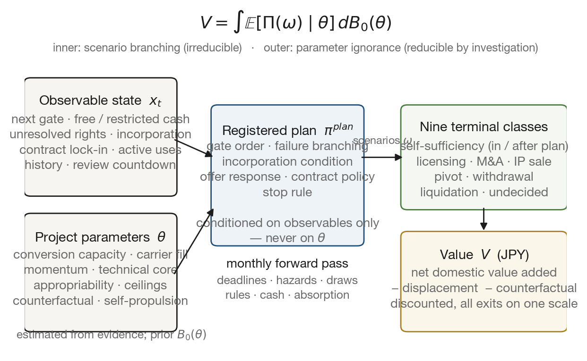
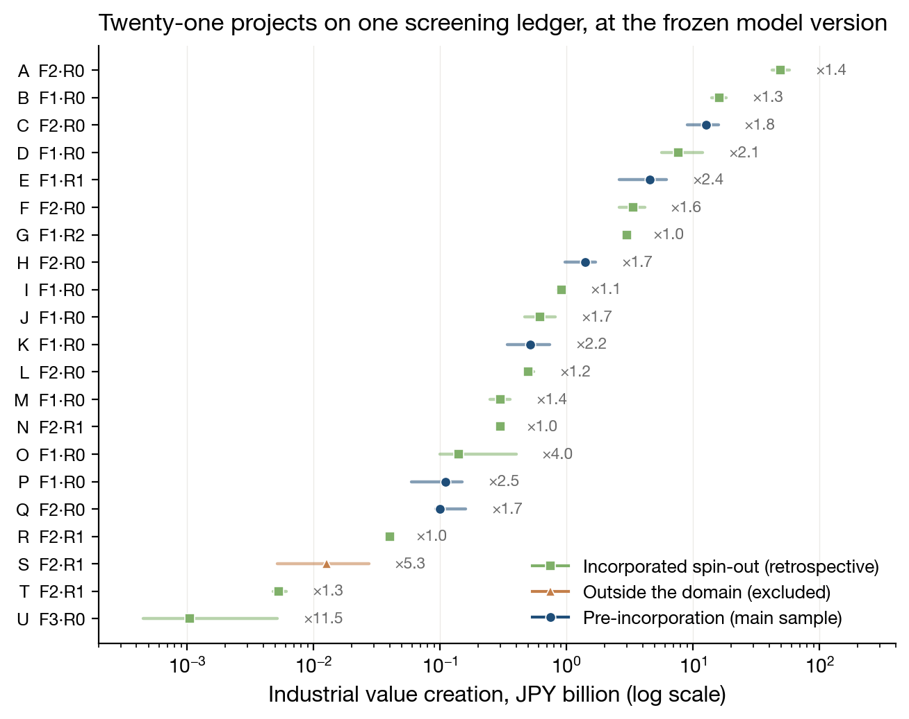
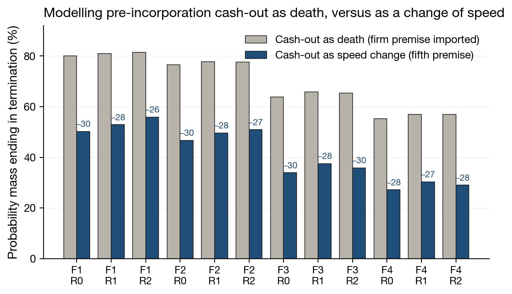
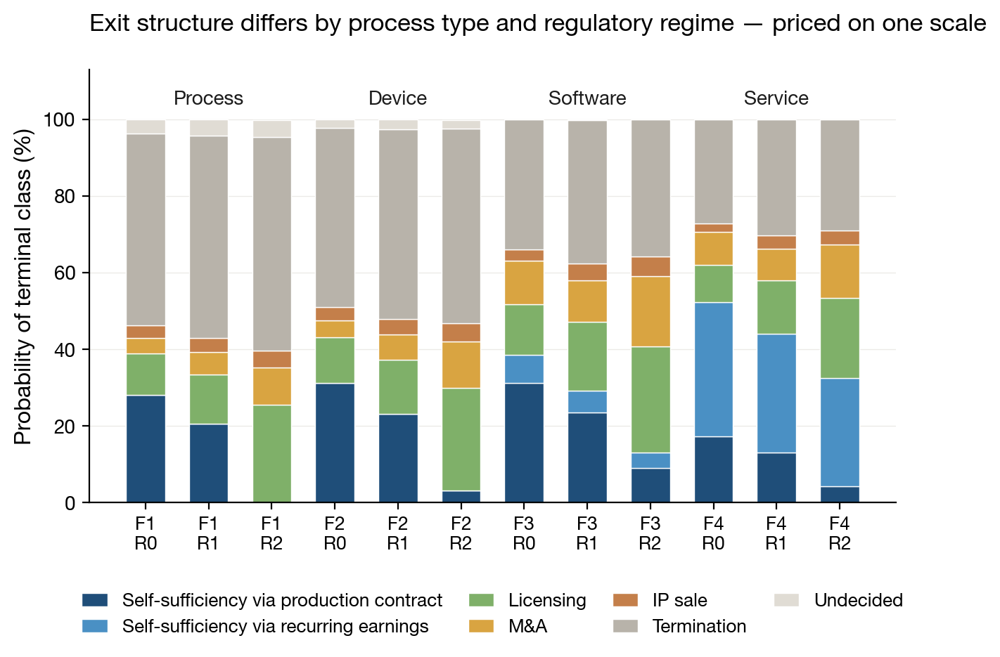

<!-- PAPER_P1_DRAFT_V2.md — S3 full draft. 正本はこの md。HTML は pandoc 生成 (PAPER_P1_PREVIEW_V2.html)。
     状態: v2.6 (2026-08-29)。**入力凍結済み: main 91385d77 / 承認 #2026-08-29-1・-2 + 入力の置き直し**。
     以降のモデル・入力の改訂は本稿の数値に反映せず、次の評価版で扱う (まさ確定 2026-08-29)。
     残る空欄は二重採点の全件分布のみ (計算中)。[verify at S6] タグ = 投稿前照合。著者行は暫定 (共著相談前)。 -->

**Masa Yamaji** — Team ARMADA Inc., Japan. *Author line provisional; declarations at end.*

*Draft v2.6 (full working draft). Target: Journal of Technology Transfer. Word count (main text): ~8,900. The model version and its inputs are frozen (main commit 91385d77; approvals #2026-08-29-1 and #2026-08-29-2 plus the input-placement corrections of 29 Aug 2026 — recorded in SM-G). Four figures are computed at the frozen version; the remaining placeholder is the dual-scoring distribution.*

# Abstract {-}

University deep-tech projects are screened, funded, and steered toward incorporation at a stage when no firm exists — yet the tools used to screen them, from discounted cash flows and venture-capital comparables to readiness levels and composite indicators, all presuppose one. We formalize this mismatch as the *Before Zero* measurement problem: the project has no legal entity, no financial statements, no settled management team, and its failures leave no records; and because a research laboratory that runs out of money slows down rather than dies, even the absorbing-state logic of survival models imports a firm premise. We then present the Before Zero Model (BZM), a valuation framework whose object of evaluation is not the venture but a *registered plan* over an observable monthly state. The framework brings the additionality logic of ex-post program evaluation — value net of displacement, net of counterfactual realization, socially discounted — to ex-ante, project-level selection, and prices all exit forms (own production, licensing, acquisition, self-sustaining service business) on one yen-denominated scale of net domestic value creation. Developed and operated inside a venture builder and reported as a design science artifact, the model comes with its operating system: externally verifiable gates, evidence grades with expiry, an event registry, gaming-resistance rules, and a calibration plan with explicit identification constraints. Application to a venture builder's live screening ledger shows that rankings are dominated by information the operational database does not record — in the most extreme case observed, a score fell by three orders of magnitude when four elicited facts entered — implying that the binding constraint on ex-ante selection is the observation system, not the aggregation formula. A prospective registry with pre-stated falsification conditions is declared.

**Keywords:** university spin-outs; deep tech; ex-ante evaluation; additionality; technology transfer; design science

# 1. Introduction

Consider the moment at which a university deep-tech project is screened: a gap-fund committee prices it, a technology transfer office (TTO) triages it, a venture builder decides whether to assemble a team around it. At that moment the project typically has no legal entity, no financial statements, no chief executive, and no revenue, and the paths open to it still include licensing, acquisition, and a modest self-sustaining business as well as the venture-scale company the pitch deck depicts. Yet the instruments available for screening — discounted cash-flow and venture-capital valuations, technology readiness levels, weighted composite scores — were built for objects that have at least some of these attributes. The object being screened is not a firm; the screening tools assume one.

We call the interval between the public disclosure of a research result and the incorporation of a company *Before Zero*. Longitudinal studies of university spin-outs show that the junctures which largely determine what the future firm can become — consolidating intellectual property, sequencing disclosure, assembling the carrying team, timing incorporation itself — concentrate in this interval[1,2]. It is also the interval in which evaluation practice is most improvised: committees borrow firm-stage tools, adjust them by feel, and archive the results in databases that record progress but not its absence. This paper treats that improvisation as a measurement problem and reports an instrument built for it.

The instrument transplants a logic that is mature elsewhere. Ex-post program evaluation has long priced public research and development (R&D) by *additionality*: the value a program created net of what incumbents lost and net of what would have happened anyway, discounted at a social rate[3,4]. We bring that logic to ex-ante, project-level selection in a domain where the firm does not yet exist. The move that makes this operable is a change in the object of evaluation: what is scored is not the venture — there is none — but a *registered plan*: a set of decision rules, conditioned only on externally observable events, run forward over a monthly observable state. Selection then means asking what a given plan, executed on a given state, is expected to create for domestic industry, in yen.

Methodologically, this is design science research: an artifact designed, implemented, and evaluated inside the operations of one venture builder, reported with design propositions and falsification conditions rather than with claims of external validity (van Aken[5]; Romme[6]; Gregor and Hevner[7]). We state this genre openly because it governs what the paper does and does not claim. The requirement set is disclosed together with its derivation and its rejected alternatives; the coefficients are initial values awaiting calibration, and are labeled as such; the empirical section is a retrospective application plus implementation verification, not a validation.

Two boundary commitments prevent this framework from being read as more than it is. First, "selection" here means replacing the *objective function* of screening; the framework issues no go/no-go decisions and allocates no funds. Those decisions belong to a second tier — in our case an investment vehicle — that weighs the model's output against costs, portfolio constraints, and fiduciary duties. Second, the score V is a gross measure of value creation; the costs of achieving it (public grants consumed, builder capacity absorbed) are deliberately left on the second tier's ledger, and we say so rather than net them invisibly.

The paper contributes three things. First, a formalization of the Before Zero measurement problem as five broken premises — no legal entity, no financial statements, no settled team, no survivorship records, and no absorbing state at zero cash — that jointly disqualify firm-stage instruments (§2). Second, an additionality-based valuation framework whose object is a registered plan, together with the operating system that makes it auditable: externally verifiable gates, evidence grades with expiry, a typed event registry, gaming-resistance rules, and a calibration plan with identification constraints (§4–§6). Third, evidence on *information sufficiency*: in a dual-scoring exercise on a venture builder's live screening ledger, rankings were dominated by information the operational database did not hold (§7), which relocates the binding constraint of ex-ante selection from the aggregation formula to the observation system.

Section 2 states the measurement problem and situates it against the instrument families that might claim it. Section 3 presents the design propositions. Sections 4 and 5 define the framework and the value function; Section 6 the operating system. Section 7 reports the application, and Section 8 the policy implications and the prospective research program.

# 2. The measurement problem

## 2.1 Five broken premises

Four absences define the object. A Before Zero project has: (1) *no legal entity* — there is no boundary that delimits its accounts, contracts, or ownership; (2) *no financial statements* — there is no cash-flow base from which to project, and often no cost series at all; (3) *no settled management team* — the carrier of execution, which firm-stage evaluation treats as an attribute to be scored, is here undetermined and partly a product of the selection decision itself; and (4) *no survivorship record* — projects that quietly end before incorporation leave no registry trace, so any sample drawn from firm records is left-truncated[8].

A fifth premise breaks more quietly. Nearly every quantitative treatment of young-organization survival models death as absorption at zero resources[9]. That logic presupposes an entity with payroll to meet. A research laboratory that runs out of project money does not die: it slows down, survives on institutional infrastructure, and waits for the next public grant. Before incorporation, cash-out changes *speed*, not existence. Any valuation that imports absorption-at-zero into this domain therefore imports a firm premise — and, as Figure 3 shows, the error is not decorative: whether cash matters enormously or hardly at all turns out to be the sharpest behavioral difference between the pre- and post-incorporation regimes.

## 2.2 Why the available instrument families break

Table 1 summarizes the mismatch. Discounted cash-flow and venture-capital methods need projections anchored in statements and comparables anchored in firms; the most serious attempt to stretch them toward young companies[10] still assumes an operating entity, and the venture-capital model itself fits deep tech poorly even after incorporation[11]. Real options need a definable underlying asset and exercise cost; Before Zero, even the cost series is undefined. Readiness scales (TRL and its descendants) are ordinal and single-axis: they order technical maturity but cannot say what a project is worth, and they collapse when the binding constraint is a missing carrier or an unresolved right rather than technical maturity. Composite indicators aggregate heterogeneous axes under weights whose arbitrariness is well documented; whatever their merits as dashboards, a weighted sum of incommensurable readiness axes is not a value and licenses rank reversals that follow the weights rather than the projects [verify at S6: composite-indicator critique anchor]. Survival and hazard models founder on premises four and five simultaneously: their samples are survivors and their absorbing state is a firm's death, not a laboratory's pause.

**Table 1. Instrument families and the premise that breaks at Before Zero.**

| Instrument family | Presupposes | What breaks before the firm exists |
|---|---|---|
| DCF / VC method | statements, comparables, an entity | no cash-flow base; no comparable class; no entity boundary |
| Real options | definable underlying, exercise cost | cost series and exercise object undefined |
| TRL / readiness scales | technical maturity is the bottleneck | ordinal, single-axis; silent on value and on non-technical binding constraints |
| Composite indicators | commensurable axes, defensible weights | weights arbitrary; sum is not a value; reversals follow weights |
| Survival / hazard models | firm death as absorbing state; registry samples | left truncation; labs pause instead of dying |
| Program-level additionality evaluation | a defined program with costs and outputs | object itself undefined: no firm, no cost series, no output definition |

## 2.3 What the additionality tradition supplies — and what it lacks here

The tradition we transplant is the strongest of the candidates, which is why its gap matters. Social cost-benefit analysis has selected projects ex ante by shadow-priced net social benefit since the 1970s[12,13,14]. Program evaluation of public R&D prices benefits net of counterfactual realization[3], and the "but-for" test was applied project-by-project in the U.S. Advanced Technology Program's selection criteria [verify at S6: ATP statutory criteria citation]. Forecast-mode social-return frameworks operationalize precisely the deductions we need — deadweight (what would have happened anyway), displacement (what incumbents lose), attribution, drop-off [verify at S6: SROI guide edition]. In health technology assessment, value-of-information analysis selects research projects by integrating expected social value over a parameter prior[15] — mathematically the same two-stage expectation our score uses.

None of these, however, can pick up a Before Zero project, because all of them inherit their object from somewhere else: a program with a budget line, a policy with a defined instrument, a trial with a protocol. Here the object is what is missing. There is no firm, no cost series, no output definition — nothing yet to which the additionality operators can attach. The gap is not the valuation logic; it is the *definition of the thing valued*.

## 2.4 What the spin-out literature supplies

The phenomenon, unlike the object, is well described. Stage models trace pre-company phases and their junctures[16,1,17,2]; TTO studies show that disclosure triage already operates on informal expected value[18,19,20]. What this literature does not supply is a mapping from stages and junctures to a money-denominated, plan-conditional value — the stages are described, not priced. Our claim is emphatically not that Before Zero is unstudied; it is that it is unmeasured.

## 2.5 Which counterfactual

One distinction must be fixed before any formalism, because it decides what the number means. *Enterprise-level additionality* nets out what other actors would have realized had this project never existed. *Investor additionality* nets out what would have happened had this particular funder or builder not engaged[21]. The two questions have different answers whenever a project would have been carried by someone else. This framework measures the former: the project's contribution relative to a world without the project. The builder's own contribution — the treatment effect of engagement — is a separate identification problem that we deliberately leave outside (§3.4), and the two coincide only under an assumption we state and register for falsification (§8): that in the current Japanese Before Zero population, projects not carried by a dedicated builder are, with high probability, not carried at all.

## 2.6 The gap

No existing apparatus (i) defines a valuation object for a project with no firm attached, (ii) prices its industrial contribution net of displacement and counterfactual realization on a scale indifferent to exit form, and (iii) remains auditable when the evaluated parties can game the inputs. Constructing and operating that apparatus is the contribution this paper reports.

# 3. Design propositions

## 3.1 Derivation and its disclosure

The requirement set was not derived from literature; it was distilled from the 2026 operating decisions of one venture builder (the authors' organization) as it screened live university seeds, and each requirement was confirmed or rejected by the builder's principal in a logged sequence of design decisions. We report it in the design-science register: as *design propositions* — normative statements about what an artifact for this task must handle — open to falsification through use rather than argued as theory (van Aken[5]). The derivation trail, including verbatim decision records, is in Supplementary Material (SM) E; the content-validity step of circulating the propositions to external practitioners[22] is registered as future work, not claimed.

## 3.2 The twelve propositions

Table 2 states the twelve design propositions (DP1–DP12), the theoretical footing each rests on, what had to be newly built because the footing literature begins "after the firm exists," and the implementation status of each in the current reference implementation. The last column is deliberate: nothing in this paper's model is presented as implemented when it is approximated or pending.

**Table 2. Design propositions, footings, and implementation status.** *(Implementation status: I = implemented; A = approximated, declared in §7; C = awaiting calibration; P = pending model revision.)*

| # | Design proposition | Theoretical footing | What had to be built | Status |
|---|---|---|---|---|
| DP1 | Conversion capacity: score the rate at which resources become progress, not the resources | Penrose[23]; Teece[24] | measuring capability at zero revenue, from gate history | I/C |
| DP2 | Strategic slack: cash as a stock whose exhaustion changes the process — but only after incorporation does it kill | Bourgeois[25]; Levinthal[9]; §2.1 fifth premise | slack for entities without statements; two-account (free/restricted) yen stocks | I |
| DP3 | Self-propulsion: earning capacity independent of external finance is value, and a pivot seed | Winborg and Landström[26]; Myers and Majluf[27] | measuring "can it earn" before any revenue exists | I/C |
| DP4 | Timing window: incorporation can be too early and too late; both sides close | McDonald and Siegel[28]; Weeds[29] | clocks from calls, tenure, patents, rivals — not market prices | I (diagnosis P) |
| DP5 | Sector momentum: academia–industry–government tailwind conditions award and offer rates | Etzkowitz and Leydesdorff[30]; Aldrich and Fiol[31] | mapping field momentum onto one project's hazards | I/C |
| DP6 | Money-denominated output: the score is yen, not an ordinal index | decision analysis[32,33] | denomination without market prices for the object | I |
| DP7 | Absorb all field conditions that move score precision | structured expert judgment[34] | typed registry from evidence to state (§6) | I |
| DP8 | Exit-form independence: production, licensing, M&A, small business — one scale | Wennberg et al.[35]; DeTienne et al.[36] | nine terminal classes valued identically (§5) | I |
| DP9 | Carrier as functions: decompose the team into functions; vacancy delays, it does not disqualify | Morgeson et al.[37]; Lazear[38]; Wasserman[39] | evaluating with the carrier undetermined; fill processes | I/A |
| DP10 | Ceiling: the size of the industry the application set could create bounds value | input–output accounting[40]; Adner[41] | per-application annual domestic value-added ceilings at screening depth | I/C |
| DP11 | Unit economics as a hard gate: no application enters value unless price can exceed cost floor | Wright[42]; Gutowski et al.[43] | cost floors by process physics before process design exists | A |
| DP12 | Capital intensity: the *gap* between required cumulative funding and current slack drives gates-to-cross | Roberts and Weitzman[44]; Audretsch and Mahmood[45] | funding-cliff counts under public-grant regimes | I |

## 3.3 Rejected candidate requirements

The boundary of a requirement set is as informative as its content. Four candidates were considered and rejected, with reasons logged: (i) *inverted-U slack* (too much slack harms innovation) — the evidence is from established firms; for young private ventures the observed slope is positive[46,47], and Before Zero projects live in chronic scarcity where the descending arm is unobserved; (ii) *Monte Carlo simulation* over judgment-quality inputs — random draws add no information to inputs that are themselves elicited ranges, so the implementation uses deterministic grids; (iii) *irreversibility points* as a standalone requirement — irreversibilities are many, and their decision content is already carried by slack (DP2) and the timing window (DP4); (iv) *IP ownership as a standalone requirement* — rights are one of many gate-blocking items, handled as unresolved-rights state, not elevated above equally binding items such as shareholder agreements or unit economics.

## 3.4 Non-independence and exclusions

The propositions are not independent, and treating them as separately scorable axes would reproduce the composite-indicator failure. Slack and capital intensity interact (what matters is the gap); conversion capacity measured by slack increments risks double-counting DP2; learning-curve cost declines are a function of cumulative investment. The framework therefore enforces a one-effect-one-entry discipline at the registry level (§6.3). Two families are excluded by design: the host institution's readiness (a property of the nursery, not the seed — a separate theory), and the causal effect of builder intervention (§2.5). Folding either into the project score would re-create exactly the conflation the impossibility of which motivated this research program.

# 4. The framework

## 4.1 The object of evaluation

The framework's central move is to give the missing object a definition. What is evaluated is a **registered plan over an observable state**: a tuple $(\pi^{\mathrm{plan}}, x_0, B_0)$ consisting of decision rules registered at evaluation time, the observable state at that time, and a prior over parameters that cannot be observed directly. The score answers one question: *what is this plan, run on this state, expected to create for domestic industry?* Nothing in the object requires a firm; incorporation is simply one of the events the plan may trigger.

**Figure 1. The framework.** An observable monthly state and a prior over unobservable project parameters feed a plan registered from a finite template; the plan conditions only on observables, never on the parameters. Running it forward produces scenarios ending in nine terminal classes, each priced on one scale of net domestic value added. The score integrates twice — over scenario branching, which investigation cannot reduce, and over parameter ignorance, which it can.

## 4.2 The observable state

Time advances monthly from the evaluation date, $t = 0, 1, \dots, T$ (evaluation horizon $T = 240$ months, a convention shared across projects; value beyond $T$ is carried by a continuation term, §5.6). The observable state is

$$
x_t = \big(g_t,\ s^{\mathrm{f}}_t,\ s^{\mathrm{r}}_t,\ R_t,\ \iota_t,\ \chi_t,\ A_t,\ n_t,\ \varsigma_t\big),
$$

whose components are: the next stage gate $g_t$ (drawn from a standard gate table, §6.1); free and use-restricted cash balances $s^{\mathrm{f}}_t, s^{\mathrm{r}}_t$ in yen (public grants live in the restricted account and can expire at fiscal year-end); the set $R_t$ of unresolved rights and approvals (invention ownership, co-filing consents, conflict-of-interest clearances) each with its committee calendar; the incorporation flag $\iota_t$; contract-work lock-in $\chi_t$ (remaining months, workload share, monthly amount, contracting entity); the set $A_t$ of *active applications* — uses that have passed their market gate and are generating value, with ramp-up and two exit channels; the success/failure history summary $n_t$; and a regulatory-review countdown $\varsigma_t$. Cash follows an explicit transition,

$$
s^{\mathrm{f}}_{t+1} = s^{\mathrm{f}}_t - \mu^{\mathrm{f}}_t + \rho_t r + y_t + z^{\mathrm{f}}_t,
\qquad
s^{\mathrm{r}}_{t+1} = s^{\mathrm{r}}_t - \mu^{\mathrm{r}}_t + z^{\mathrm{r}}_t - \ell_t,
$$

where $\mu_t$ is the burn rate (observed per-project spending where recorded, sector defaults otherwise), $\rho_t r$ contract-work earnings, $y_t$ sales from active applications, $z_t$ funding inflows, and $\ell_t$ fiscal-year expiry of restricted funds. Hard deadlines — final calls, tenure clocks, rights expiries, fiscal year-ends — enter the state as dated constraints rather than hazards, because their dates are known. One bookkeeping rule governs the two accounts and is easy to get wrong: **balances and outlays must be recorded on the same side**. If a restricted public grant is excluded from the balance, the expenditure it funds must be excluded from the burn rate as well; if it is included, both are. Recording only one side misreads the months of runway by an order of magnitude, and in the wrong direction — a project that has just won a large grant appears to be burning through nothing.

## 4.3 Project parameters and their prior

Thirteen quantities cannot be observed directly and are treated as project parameters $\theta$: conversion capacity $c$; evangelist-function fill prospect $e$; sector momentum $\sigma$; process type $\tau_{\mathrm{proc}}$; technical-core validity $\psi$; appropriability $\kappa_{\mathrm{IP}}$; per-application willingness-to-pay caps $\{w_u\}$, annual domestic value-added ceilings $\{\bar P_u\}$, displacement shares $\{\delta_u\}$, counterfactual schedules $\{\alpha_u(\cdot), L_u\}$, production-cost floors $\{\underline{c}_u\}$; and self-propulsion $r$. Each is estimated at the evaluation date from source-tagged evidence by a four-point elicitation (low, best, high, confidence) in the structured-expert-judgment lineage[34,48,49], yielding the prior $B_0(\theta)$; correlated components share source variables rather than being elicited independently.

Two of these deserve their measurement rules stated here. Conversion capacity $c$ — the *speed* at which resources become progress, not the reach of what the project could attempt (§5.1) — is estimated per project as a recency-weighted moving average of the ratio of strategic-slack increments (funds won, gates passed, IP created, demand relationships, people retained) to the spending that produced them — with pre-incorporation grants credited not at face value but by how much of them became project assets; where spending records do not exist, $c$ is approximated from the *quiet period* $t_q$ — the months since the last externally visible positive event — on a declared scale. The quiet period is itself an observable that damps offer-arrival hazards (§5.8): a project showing no outward motion attracts no suitors. And the carrier's eight functions enter as per-project fill observations $f_1,\dots,f_7 \in [0,1]$ (the evangelist prospect $e$ is $f_1$); the technical core may be marked vacant only on an observed loss, in which case the blanket loss hazard is switched off so the same fact is not counted twice. Projects without organizational observations keep the population defaults — observation where it exists, defaults where it does not, which is the model's general pattern.

One honesty clause governs $\theta$: it is held constant over the horizon *because its variation cannot be separately identified from the gate history, not because capabilities are static*. This is a declared approximation, and it sits in visible tension with the dynamic-capabilities footing of DP1, in which capability is precisely the capacity to change the resource base[24,50,51]. Evaluation-version updates (re-estimating $B_0$ as evidence accumulates) are the mechanism that absorbs slow variation; monotone drift of posteriors across versions is one of the registered falsification signals (§8).

## 4.4 Plan rules

The plan $\pi^{\mathrm{plan}}$ is registered from a finite template — gate order; failure branching (retry, pivot, exit thresholds); the incorporation condition (demand evidence plus a funding prospect, source-indifferent); response policy to realization offers (licensing, M&A, IP sale); contract-work policy; and a stop condition. Two restrictions carry the framework's epistemology. First, rules may condition **only on observables** — the state, the funding-window list, contract terms — never on $\theta$, which no party observes; this keeps the scenario measure well-defined and forecloses self-serving rule definitions. Second, registration is by the evaluator from the template, with second-person approval, not by the evaluated project; unregistered projects receive sector defaults (Tier 0), so every project has a defined score, and deviations from defaults are displayed rather than hidden.

The relation to effectuation theory deserves one paragraph, because "register a plan" can be misread as "demand a prediction." What is registered is a *policy* — branching responses to observable events — not a forecast of which branch will occur; the critique of prediction-based planning[52] does not bite a conditional rule set, and experimental evidence that entrepreneurs trained to make decision rules explicit terminate and pivot better[53] runs in the framework's favor. What the framework genuinely cannot represent is goal transformation — new stakeholders redefining what the project is for — because application sets are fixed within an evaluation version. That is a scope condition, stated as such.

## 4.5 Monthly transition and terminal classes

Each month resolves in a fixed order: dated deadlines; stochastic loss (competitor preemption and demand disappearance as hazards; the technical core's permanent loss as a separate hazard); process draws — gate advance, award decisions, offer arrivals, rights resolutions, contract events; rule application; cash update; absorption and self-sufficiency checks; history update. Gate advance compounds the parameters:

$$
p^{\mathrm{adv}}_t = 1 - \exp\!\big(-\,\kappa_{g_t}\,\psi_{g_t}\, c\, \eta_t\, (1 - \gamma\rho_t)\big),
$$

with $\kappa_{g_t}$ a sector base rate, $\psi$ entering only technical gates, $\eta_t$ the carrier-fill factor (§6.2), and $\gamma\rho_t$ the drag of contract work. Scenarios terminate in nine classes measured on one scale: capital self-sufficiency within or after the 60-month plan horizon, licensing, M&A, IP sale, pivot, withdrawal, liquidation, and undecided continuation. When self-propulsion fails, probability mass does not fall into a single death state but splits across four routes — application pivot, exit-class conversion (M&A), licensing fold-down, and return of the rights to the institution (value zero; any later revival is a new project) — with evidence-level asymmetries that prevent early-stage projects from claiming exit value they cannot show. Before incorporation the process does not absorb at zero cash at all: when free funds cannot cover the burn, progress continues at a reduced rate (×0.35 at initial values) with running expenses carried by the institutional base, and the project re-accelerates on the next award — the fifth premise of §2.1 implemented as a speed rule rather than a death state. After incorporation, cash-out routes into the four-path split above, because a company, unlike a laboratory, cannot pause. Removing the pre-incorporation absorbing wall also removed most of the scheme's numerical stiffness (§7.5).

## 4.6 The score and its two kinds of uncertainty

For a fixed $\theta$, the plan induces a probability measure over scenarios $\omega$; the conditional value is $v(\theta) = \mathbb{E}[\Pi(\omega) \mid \theta, \pi^{\mathrm{plan}}]$, computed by a forward deterministic grid (no Monte Carlo at judgment-quality inputs), and the score integrates over the prior:

$$
V \;=\; \int v(\theta)\, dB_0(\theta).
$$

The two-stage structure separates uncertainty by what information can do to it. Scenario branching inside $v(\theta)$ is irreducible — more research does not tell you whether the next trial succeeds. Parameter ignorance in $B_0$ is reducible — and because the same computation yields the sensitivity of $V$ to each component of $\theta$, the model reports *which parameter to investigate next*, turning DP7 from a slogan into an output.

## 4.7 Reporting

A score is reported as three numbers — the 10th, 50th, and 90th percentiles of $v(\theta)$ under $B_0$ — plus the ratio upper/lower as an explicit "how much is not yet known," the probabilities of the value-bearing paths, and the continuation-value share, flagged for review when it exceeds half (§5.6). One reading rule prevents a common misinterpretation: the percentiles quantify *parameter ignorance alone* — scenario uncertainty is already integrated inside each $v(\theta)$ — so the band means "what investigation could still narrow," not "the range of what might happen." Grid-convergence error is below 0.3% (§7.5); values are still read to two significant digits, input quality being the binding limit.

# 5. Valuing industrial creation

## 5.1 The value of a scenario

A scenario's value is the discounted sum of the net domestic value added created by its active applications, month by month, plus a terminal continuation value:

$$
\Pi(\omega) \;=\; \sum_{t=1}^{T} \frac{1}{(1+d)^{t/12}} \sum_{u \in A_t(\omega)} \phi_u\, \frac{\bar P_u - \delta_u}{12}\,\big(1 - \alpha_u(t)\big) \;+\; \frac{1}{(1+d)^{T/12}}\, C\!\big(x_T(\omega),\ \theta\big).
$$

Each element earns its place. $\bar P_u$ is the annual domestic value added the application could sustain at maturity — value added in the national-accounts sense, not revenue[40] — set as one number per application, because the uncertainty of *reaching* it is already carried by scenario probabilities and the ramp-up of $A_t$; giving the ceiling its own distribution would count the same uncertainty twice. Applications enter $A_t$ only at the adoption/production-contract gate, ramp up over twelve months, and exit by either an observed withdrawal event or an obsolescence hazard that runs over the whole active life. The ceiling is also bounded by what the project can actually undertake: applications whose development the project has no prospect of financing are excluded from $\bar P_u$ rather than left in as distant possibilities. This is not fastidiousness but a consequence of what the parameters mean — conversion capacity governs the *speed* of progress, not reachability of an application the project cannot fund. Leaving unfundable applications in the ceiling would let a project that merely survives a long time accumulate industrial value it will never create. Late realization is automatically worth less: the discount sits inside the scenario.

## 5.2 What is counted — and what deliberately is not

The framework prices the value realized by the **project system** — the project and its successors in realization: a licensee, an acquirer — and not the value realized by imitators. The share parameter $\phi_u$ (increasing in appropriability) captures how much of an application's domestic value added the project system can bring into being — the classic determinant of who profits from an innovation[54]. We report both $V$ with $\phi_u$ (the headline: the industrial contribution realized through this project's own path) and $V$ without it (the ceiling the application set could support regardless of who realizes it); the gap between the two is itself informative, since it is largest exactly where imitation is easiest. Two things follow from this declaration. First, the measure is an **industrial-policy objective, not a welfare quantity**: consumer surplus is not counted, factor opportunity costs are not netted, and we do not call the result social value. Second, spillovers through imitation — often the majority of an innovation's social return[55,56] — are outside the object by design; a selector who wishes to value them needs a different instrument, and we say so rather than stretch this one.

## 5.3 Displacement, counterfactual, and the no-double-deduction rule

Two deductions make the measure *net*. Displacement $\delta_u$ removes the domestic value added that incumbent activity loses to the application[57,58]. The counterfactual schedule $\alpha_u(t)$ removes what others would have realized anyway: up to an acceleration horizon $L_u$ (estimated from the competitive landscape), only the acceleration wedge counts; beyond it, only the location wedge — the difference between the value arising domestically rather than abroad. Because a domestic competitor's alternative realization is simultaneously displacement-like and counterfactual-like, the two deductions are governed by a single-entry rule: one fact, one deduction, worked through the registry typing (§6.3), never both.

## 5.4 The counterfactual under partial identification

$\alpha_u$ cannot be calibrated, in principle: it is a claim about a world that will not occur. The framework therefore treats it under partial identification[59]: competitor audits bound it from below and above, the score is reported across the bounds, and — the operational payoff — we report the **breakeven $\alpha$** at which project rankings flip. Honesty compels one disclosure that a promotional paper would bury: at current default settings, with $L_u = 36$ months and value realization typically beyond it, the deduction binds as a near-constant factor across projects and therefore does *no selection work yet* (measured elasticity $\approx 0$; §7.6). It begins to discriminate exactly for projects that can reach market inside the acceleration horizon — which is where a counterfactual should discriminate.

## 5.5 Discounting

Values are real 2026 yen, discounted at a social rate of $d = 2.0\%$ per year derived from a Ramsey decomposition (pure time preference 0.5–1.0%; elasticity of marginal utility 1–2; long-run per-capita consumption growth 0.3–1.0%), with 1% and 4% reported as sensitivity and any rank reversal under them flagged. Risk carries no premium in $d$ — failure lives in scenario probabilities and parameter ignorance lives in $B_0$ (Damodaran[10], makes the corresponding argument for survival-adjusted valuation) — and the risk-spreading logic of Arrow and Lind[60] covers the idiosyncratic component; what $d$ does not cover, and we flag as a limit, is aggregate covariance of sector momentum with the macroeconomy (Weitzman[61]; Gollier[62], govern the long-horizon end).

## 5.6 Continuation value

Beyond the horizon, unresolved states are extended under default rules for 120 months and surviving applications receive a perpetuity under the obsolescence hazard; decided scenarios keep only their surviving applications' tails. Because the same hazard runs during and after the horizon, the tail neither double-counts nor gaps. The continuation share of $V$ is reported per project — at current defaults it spans 31–68% across sector cells (§7.5) — and any project whose value is majority-continuation is review-flagged: the least verifiable assumption is not allowed to dominate a number silently.

## 5.7 The unit-economics gate

An application enters $A_t$ only where the willingness-to-pay cap exceeds the production-cost floor, $m_u = w_u - \underline{c}_u > 0$, with floors drawn from process-type priors (thermodynamic and experience-curve bounds: Gutowski et al.[43]; Wright[42]; Lafond et al.[63]) and updated by evidence. A project none of whose applications clears the gate accumulates no value — DP11 is a rule inside the model, not a committee judgment outside it.

## 5.8 Exit-form independence in operation

Licensing, acquisition, and IP-sale offers arrive as hazards increasing in appropriability, evidence level, momentum, and carrier fill, and damped by the quiet period (§4.3); whether an offer is taken is the plan's decision, and the value that follows is the successor's: the tail is scaled by the probability that a licensee (0.60), acquirer (0.75), or IP buyer (0.45) completes the remaining market gates — initial values, all awaiting calibration. Nothing in the scale privileges the IPO-track scenario: a service business that reaches self-sufficiency on repeated contract work books its (smaller) domestic value added on exactly the same ledger, which is DP8 kept honest.

## 5.9 Two numbers, not one

Finally, the measure decomposes into an acceleration wedge (value the world gets earlier — a genuine welfare-relevant gain) and a location wedge (value arising in Japan rather than elsewhere — a transfer between jurisdictions). The framework reports both. A selector maximizing the sum is running an industrial policy and should know it; the decomposition is what keeps the beggar-thy-neighbor critique answerable by construction rather than by rhetoric.

# 6. Operating the system

A valuation object that can be gamed is not a measurement. The framework therefore ships with an operating layer whose rules are as much a part of the artifact as the equations.

## 6.1 Gates and evidence grades

Stage gates are defined only by externally verifiable events — third-party replication, standards tests, a paid proof-of-concept with a materiality threshold on the payment, production terms bearing an authorized signature. Gate positions come from a standard table by process type and regulatory attribute; splitting a standard gate into sub-steps to farm passage counts is displayed as a deviation and collapsed to one passage in computation. Demand evidence carries graded strength (interest, paid PoC, production terms, adoption), rises only on defined events, and *expires*: a paid PoC with no follow-on movement for 24 months falls back to "interest"; production terms lapse after 12. Evidence is not allowed to age into pedigree.

## 6.2 Carrier functions

The management team is decomposed into eight functions (evangelist, technical core, application and customer development, decision-making, fundraising, negotiation and contracts, organization building, plus an extension slot), following the functional view of leadership[37]. A function counts as filled only on recent, multi-point, evidence-floored *working records* — titles, intentions, and prestige do not count — and vacancy produces delay, not disqualification: the fill factor $\eta_t = \prod_f (1 - d_f\,\mathbb{1}[\text{vacant}])$ multiplies gate advance, award, and offer hazards. Fill states are per-project observations for all eight functions (§4.3), and vacancies are expected to be filled by supply and search processes whose rates are themselves parameters. Two declared weaknesses bound this design. The product form excludes compensation and threshold effects among vacancies, whereas founding-team evidence suggests function *bundles* matter[64,65] — the form is an assumption awaiting interaction tests, not a finding. And carrier supply is shared across a builder's portfolio while the model prices projects one at a time, so per-project scores are not portfolio-consistent; in congestion the model overstates simultaneous achievability, a scope condition inherited from excluding the builder's capacity as a separate theory[66].

## 6.3 The event registry

Every observation enters as one typed row: date, event type (from a fixed list spanning funding, rights, verification, market, people, environment), a declared *target* — state component, parameter estimate, funding-window list, or rule version — and its effect. One event, one entry: derived quantities may not be targets, which is the single-entry bookkeeping that enforces the no-double-count discipline of §3.4 and §5.3. A thin record (few entries in six months) raises a "thin-record" flag that suspends staleness-driven downgrades rather than punishing the project for the evaluator's silence — record-keeping gaps and project deterioration are different facts and are kept apart.

## 6.4 Gaming resistance, both faces

The design holds where measurement pressure has historically broken evaluation systems[67,68,69]: gates cannot be self-attested, evidence demotes on withdrawal, plans are registered by the evaluator with second-person approval, exit thresholds looser than default require logged justification. It does not yet hold everywhere, and we disclose where: the two highest-leverage inputs — the ceilings $\bar P_u$ (to which $V$ is constructively proportional) and the counterfactual $\alpha_u$ — sit outside the calibration plan, one because it is a per-project investigation item, the other because it is unidentifiable. That is exactly where a reactive system will bend when stakes rise, and naming the joint is the beginning of guarding it.

## 6.5 Evaluator incentives

In this deployment the builder is simultaneously operator, evaluator, and investor. The countermeasures are declared as design, not achieved fact: priors registered before scoring; estimation separated from the investment decision; and a prospective registry (§8.4) whose falsification conditions are stated before outcomes arrive. The conflict itself is disclosed in the declarations.

## 6.6 Calibration with identification constraints

Every coefficient carries a grade — directly evidenced, derived from institutional design, or provisional — and a calibration plan with explicit identification constraints: award rates and window-arrival rates enter observation only as a product and need separate data to split; conversion capacity's median is pinned to 1.0 as a scale convention; history effects are fixed at unity until state dependence can be separated from heterogeneity; stop rules forbid updating before the required independent events accumulate. One constraint is disclosed with emphasis: the builder's ledger currently records 51 grant awards and **zero rejections** — the coefficient family to which the score is most elastic (§7.6) cannot yet be calibrated from internal data at all, and the registry now auto-generates a pending record at application time so that rejections can no longer silently vanish.

# 7. Application and evidence

## 7.1 Sample, stratification, and freeze

The model was applied to the twenty-one projects on one venture builder's 2026 screening ledger, spanning process, device, software, and service types across regulated and unregulated sectors. The ledger is a fund's working list, not a clean Before Zero sample, and the evaluation says so by stratifying it into three layers. (a) Pre-incorporation university seeds are Before Zero applications proper — the paper's **main sample**; every headline claim rests here. (b) Incorporated spin-outs are re-scored as *retrospective* applications, with the evaluation date moved back before incorporation and inputs restricted to information datable to that time; any project where this restriction cannot be enforced is dropped, with the count reported. (c) A residual layer — seeds inside established firms, projects with no incorporation intent — lies **outside the Before Zero domain**; the fund screens them for its own purposes, and they are excluded from the main sample and marked as domain-external wherever cited. The freeze is a dated act, not a manner of speaking: model version, coefficient set, and every project input were fixed at one commit on 29 August 2026 (identifiers in SM-G), and revisions made after that date — the ledger is a live operating instrument and continues to change — are excluded from this paper and carried to the next evaluation version. Of the twenty-one projects at that instant, **six** are pre-incorporation (the main sample), **fourteen** are incorporated spin-outs re-scored retrospectively, and **one** lies outside the domain. Figure 2 shows the resulting distribution.

**Figure 2. Scores and what is not yet known about them.** Twenty-one projects at the frozen model version, ordered by median value; the bar spans the 10th to 90th percentile of $v(\theta)$ and the multiplier is their ratio. Values span four orders of magnitude, and the width of what remains unknown varies from a factor of 1.0 to 11.5 — a project can be precisely small or imprecisely large, and the reporting format is built to keep those distinguishable. Marker shape and colour give the sample layer of §7.1.

## 7.2 Dual scoring: what the database knows vs. what people know

The central empirical exercise is deliberately simple. Each project is scored twice under the same model version: once with inputs drawn *only from the operational database* (grants, contracts, patents, meeting records, project knowledge tables), and once after *structured elicitation* — interviews with the principals that fill the same input schema. The quantity of interest is the ratio of the two scores and the reshuffling of ranks. Two design points make the comparison informative rather than tautological. First, both scorings run at the same frozen model version, so any difference is attributable to information alone — not to the aggregation formula, whose coefficients are identical in both passes. Second, the records-only pass is not a strawman: it uses everything the operating database holds — grant awards, contracts, patents re-verified at the national registry, stage assessments, project knowledge — and falls back to sector defaults only where the database is silent. It is, in other words, the score a well-run venture builder would produce from its own systems without picking up the telephone. [Distribution of the twenty-one ratios and the rank reshuffling: computation at the frozen version in progress; the completed cases already fix the sign and the order of magnitude of the effect, and are reported below.]

## 7.3 What the record does not hold

The pattern is not confined to one layer. Across the ledger, the inputs that moved scores most were not the ones the database records well — award histories, patent counts, stage assessments — but the ones it records badly or not at all: how much cash is actually the project's own to spend, whether volume production has ever been attempted, which applications the project could realistically finance, whether the person who can build the thing is still there. Each of these is knowable by asking; none is reliably derivable from the operating record.

The *mechanism*, meanwhile, is already fixed by the most extreme revision observed anywhere on the ledger, and we report it with its domain status stated plainly: the case sits in the domain-external layer (a seed inside an established firm, with no incorporation intent), so it illustrates how record-dependence operates, not what a Before Zero project looks like. Scored from the database alone — patents re-verified at the national registry, a live development contract, evidence level upgraded on documented filings — it ranked **2nd of 21, at ≈¥103bn**. Structured elicitation then surfaced four facts the database did not hold: the cash runway was months, not years; volume production had never been entered; the principal's credit standing blocked ordinary financing; and the addressable-market figure conflated the component's market with the system's. Re-scored, it fell to **19th of 21, at ≈¥0.05bn** — a revision of three orders of magnitude, produced not by changing the model but by changing what the model was allowed to know. (Figures from the pre-freeze version current at the time of the exercise; the systematic dual-scoring pass re-runs both scorings at the frozen version.) That the extreme arose off-domain is itself informative: the failure mode belongs to the *record system*, which is shared across layers, and nothing in it is specific to established firms. The general statement: *rankings are dominated by information the operational record does not capture.*

## 7.4 The structural counterpart: what the model could receive

The dual-scoring result has a structural echo inside the model's own development, and we report it as one completed design–evaluation cycle. In the version first fielded, only one of the eight carrier functions entered as a per-project input (the evangelist prospect), the technical core being fixed "never vacant" by convention and the rest filling by portfolio-common supply processes. Two live cases exposed the consequence — an incorporated spin-out whose only person able to build the product had left, and a main-sample project whose principal was degrading key negotiations: sweeping the one available input across its full admissible range moved the score by only a few percent, and evaluators could represent organizational collapse only by re-assigning *evidence levels* — a workaround neither reproducible across evaluators nor reversible when the organization recovers. The frozen version closes the gap: all eight functions enter as per-project observations, the technical core may be marked vacant on an observed loss (§4.3), and an organizational-observation registry was added to the operating system to feed them. The episode is the §7.3 lesson read from the model's side — the binding constraint is what the observation system can receive — and it is why the falsification registry (§8.4) treats observability, not functional form, as the first thing to test.

## 7.5 Internal verification, kept separate

Synthetic checks verify the implementation, not the world, and are reported as such[70]. Degenerate-cell runs at the frozen version across the twelve process-type × regulation cells behave in the directions practice expects: heavily regulated pharmaceutical-type cells essentially never reach own-production within the horizon and realize value through licensing and acquisition instead — consistent with how that industry actually exits — while service-type cells reach self-sufficiency largely on repeated contract earnings (35.0 points of a 52.3% self-sufficiency probability in the service cell), which is DP3 visibly at work. Figure 3 isolates what the fifth premise (§2.1) is worth: holding coefficients, plan rules, and cells fixed and changing only the treatment of pre-incorporation cash-out, the mass ending in termination falls by 26 to 30 percentage points in every cell. A framework that imports absorption-at-zero from firm-stage survival modelling does not merely mis-state a detail; it condemns roughly a third of the pre-incorporation population to a death it does not die.

**Figure 3. What treating a cash-out as a death costs.** The same twelve process-type × regulation cells under two modelling assumptions. A laboratory that exhausts project funds slows and waits for the next award; only an incorporated firm must dissolve.

Full nine-class probabilities are reported *including* the termination mass (27–56% across cells at Tier-0 defaults; before the §4.5 speed rule the same cells showed 55–81%, most of the difference being pre-incorporation projects that previously died at zero cash and now slow down instead): a selector should see the mortality its instrument implies, not only the value-bearing tails. Figure 4 shows the corresponding exit structures, and they differ exactly as practice would predict: heavily regulated process-type cells realize value through licensing and acquisition rather than own production, while service-type cells reach self-sufficiency largely on recurring earnings. Neither pattern is privileged by the measure — which is DP8 visible as a result rather than as an intention.

**Figure 4. Exit structure by process type and regulatory regime.** Terminal-class probabilities at Tier-0 defaults, frozen model version. Every class is priced on the same scale of net domestic value added, so a licensing outcome and a production outcome are comparable rather than ranked by form.

Two classes sit at 0.0% because their mechanisms are unimplemented (application pivot; the plan-vs-optimal timing diagnosis), and the continuation-value share spans 33.5–75.1% across cells, with the six majority-continuation cells flagged under §5.6's own rule. Grid-convergence checks bound numerical error below 0.3% — removing the pre-incorporation absorbing wall removed the scheme's main stiffness — and values are still read to two significant digits, input quality being the binding limit.

## 7.6 Elasticities, and the difference between placing and working

Sweeping every coefficient by ±10% under one definition yields a consistent hierarchy: funding-access coefficients (base award rate, window arrival) rank first everywhere (elasticity ≈ +1.4), gate base-speeds and the counterfactual retention factor follow (≈ ±1.0), obsolescence and appropriability next (≈ 0.7); the rights-resolution rates that dominate practitioner discussion move the score not at all (≈ −0.00), and the counterfactual's *evaluation-date* deduction — the framework's philosophical centerpiece — has measured elasticity 0.000 at defaults, for the horizon reason disclosed in §5.4. The honesty rule this section enforces: *a coefficient placed is not a coefficient at work*, and sixteen declared approximations (A1–A16 in SM-C) mark exactly where the reference implementation substitutes, collapses, or omits what the specification defines.

## 7.7 Ceiling sensitivity as a property of the object

Because $V$ is constructively proportional to the ceiling (A6), the single largest lever on any score is how the addressable market is sliced. Re-basing the same project's ceiling across the standard market conventions — from total market to obtainable segment — moves its value by two to three orders of magnitude, dwarfing every coefficient elasticity in §7.6. We treat this as a property of the measurement object, not a defect to be smoothed: *ex-ante selection output is order-of-magnitude sensitive to market-slicing conventions*, and a framework that conceals this behind a stable-looking composite is not more robust, only less honest. Three governance rules follow and are implemented: the ceiling convention is fixed once — the obtainable slice, net of the share already carried by the model's take-rate parameter, so the same uncertainty is never counted twice; per-project ceilings are versioned with approval records; and the reported 10/50/90 bands are labeled as **not** propagating ceiling uncertainty (A7) — calling a band a confidence interval while its largest driver sits outside it would be the quiet lie this section exists to prevent.

## 7.8 Limits

Everything here is implementation verification plus retrospective application under judgment-quality inputs on one builder's ledger, at pre-calibration coefficients; predictive validity is exactly what the prospective registry (§8.4) is for. The self-propulsion value share awaits a displacement audit (a service business built on work that domestic incumbents would otherwise have done nets to little); the dual-scoring distribution is in computation at the frozen version; and the sample's stratification bounds any claim about incorporated projects to the quality of their date-restricted reconstruction.

# 8. Policy implications and a research program

## 8.1 For policy

An evaluation object denominated in net domestic value added connects, without translation, to the ledger on which industrial policy is currently argued — economic-security programs, mission-oriented agencies, and the growing family of ARPA-type institutions whose daily work *is* ex-ante, project-level selection[71] [verify at S6: ARIA/SPRIN-D program documents]. For that audience the framework offers two things the unicorn count cannot: exit-form indifference — licensing, acquisition, and self-sustaining small firms are priced on the same scale as venture-scale outcomes, an operational answer to the well-documented misfit between the VC model and deep tech[11] — and the acceleration/location decomposition, which states openly how much of a project's value is world gain versus jurisdictional transfer.

## 8.2 For universities and TTOs

For technology transfer practice the immediate import is not the score but the object: a registered plan gives disclosure triage something definable to evaluate, and the registry gives it an audit trail. The cost is the observation discipline of §6 — which, as §7 demonstrated, is precisely where current records fail: they capture progress and are silent about why progress stopped.

## 8.3 What this paper does not deliver

The plan-versus-optimal-rule gap — *is this incorporation too early or too late?* — is the framework's designed answer to DP4 and, we believe, its most valuable future output. Its computation (policy search over the registered rule space) is unimplemented, and we have kept its promise out of this paper's results; it is the centerpiece of the second paper, to be built on the calibrated model.

## 8.4 A prospective registry with falsification conditions

The framework's claims are kept falsifiable by a registry declared before outcomes arrive, with left-truncation handled by registering cases from first contact[8]. Five conditions are pre-stated. (1) *Ceiling stability*: if per-project ceilings move by factors across evaluation versions after the convention freeze, rankings are artifacts of market-slicing variance and the ceiling procedure must be replaced. (2) *Breakeven-α flips*: if plausible counterfactual bounds flip top-decile rankings, the deduction moves from reporting to redesign. (3) *Dual-scoring convergence*: after the registry redesign now in operation, the records-vs-elicitation ratio should converge toward unity; persistent order-of-magnitude gaps falsify the claim that the observation system can be completed. (4) *Carrier-function interactions*: hazard-model tests of vacancy effects with interactions; significant interaction terms falsify the product form of $\eta_t$ and force a bundle representation. (5) *Regime asymmetry*: because the model treats pre-incorporation cash as a speed variable (§4.5), it predicts that idea quality dominates rankings before incorporation while cash dominates after; version-controlled outcome tracking that contradicts this asymmetry rejects the fifth-premise treatment itself.

## 8.5 The external-validity path

A single further deployment decides more than any argument: if a second organization can run the gate table and registry unmodified, the propositions are design knowledge; if operation turns out to require this builder's tacit judgment, they are an in-house procedure honestly documented. The registry format is public in SM-B precisely to make that test cheap (Van de Ven[72]).

# 9. Conclusion

Before a deep-tech company exists there is still something to evaluate — but it is not the company, and treating it as one has made a generation of screening tools quietly unfit. The Before Zero Model gives the interval its own object of evaluation: a registered plan over an observable state, priced by the additionality logic of program evaluation on a yen scale indifferent to exit form, operated through gates, evidence grades, and a typed registry that keep the number auditable, and reported with its uncertainties, approximations, and conflicts stated rather than smoothed.

The application taught one lesson worth more than the score itself: rankings were dominated by information the operational record did not hold, because records are built to capture progress, not the reasons progress stops. The binding constraint on ex-ante selection is the observation system, not the aggregation formula — and that is why this paper's real deliverable is not a formula but a registry, running forward, with its falsification conditions on the record.

# Declarations {-}

**Declaration of competing interest.** The author operates the venture builder whose screening ledger supplies the application in §7 and holds economic interests in vehicles that may invest in the projects scored. This dual role is intrinsic to the design science setting and is mitigated by the design measures of §6.5 (pre-registered priors, separation of estimation from investment decisions, prospective registry); it cannot be eliminated and is disclosed here rather than minimized.

**Funding.** This research received no external funding.

**Data availability.** The underlying records are proprietary operational data of the venture builder and contain personal and commercially sensitive information; they cannot be shared. Anonymized summaries sufficient to reconstruct every table, the full coefficient set with provenance grades, the registry and gate-table formats, and the falsification-condition registry are provided in the Supplementary Material.

**Author note.** The author line is provisional; a co-authorship discussion is scheduled on completion of this draft. [To be resolved at S6.]

# Supplementary Material (contents) {-}

SM-A Notation and complete model equations. SM-B Gate table, carrier-function table, event-registry format, and plan-rule template (complete versions; public formats for replication). SM-C Coefficient tables with provenance grades, declared approximations A1–A16, and full elasticity tables. SM-D Application detail: stratified sample, dual-scoring protocol and per-project ratios, ceiling-sensitivity worked cases. SM-E Design-proposition derivation log and audit-process records (five-persona, three-round adversarial audits). SM-F Calibration plan, identification constraints, and falsification-condition registry. SM-G Version freeze: model version hash (main commit 91385d77), approval identifiers, input freeze date (29 August 2026), the per-project input set as frozen, and the figure-generation script with the data behind every figure.

# References {-}

*Numbered in order of first appearance. DOIs verified for entries carried over from the model canon; entries marked [verify at S6] await final bibliographic verification before submission.*

1. Vohora, A., Wright, M., & Lockett, A. (2004). Critical junctures in the development of university high-tech spinout companies. *Research Policy*, 33(1), 147–175.
2. Rasmussen, E., Mosey, S., & Wright, M. (2011). The evolution of entrepreneurial competencies: A longitudinal study of university spin-off venture emergence. *Journal of Management Studies*, 48(6), 1314–1345.
3. Link, A. N., & Scott, J. T. (2011). *Public Goods, Public Gains: Calculating the Social Benefits of Public R&D*. Oxford University Press.
4. David, P. A., Hall, B. H., & Toole, A. A. (2000). Is public R&D a complement or substitute for private R&D? A review of the econometric evidence. *Research Policy*, 29(4–5), 497–529.
5. van Aken, J. E. (2004). Management research based on the paradigm of the design sciences: The quest for field-tested and grounded technological rules. *Journal of Management Studies*, 41(2), 219–246.
6. Romme, A. G. L. (2003). Making a difference: Organization as design. *Organization Science*, 14(5), 558–573.
7. Gregor, S., & Hevner, A. R. (2013). Positioning and presenting design science research for maximum impact. *MIS Quarterly*, 37(2), 337–355.
8. Yang, T., & Aldrich, H. E. (2012). Out of sight but not out of mind: Why failure to account for left truncation biases research on failure rates. *Journal of Business Venturing*, 27(4), 477–492.
9. Levinthal, D. A. (1991). Random walks and organizational mortality. *Administrative Science Quarterly*, 36(3), 397–420.
10. Damodaran, A. (2009). Valuing young, start-up and growth companies: Estimation issues and valuation challenges. SSRN Working Paper 1418687.
11. Lerner, J., & Nanda, R. (2020). Venture capital's role in financing innovation: What we know and how much we still need to learn. *Journal of Economic Perspectives*, 34(3), 237–261.
12. Little, I. M. D., & Mirrlees, J. A. (1974). *Project Appraisal and Planning for Developing Countries*. Heinemann.
13. Dasgupta, P., Marglin, S., & Sen, A. (1972). *Guidelines for Project Evaluation*. United Nations Industrial Development Organization.
14. Squire, L., & van der Tak, H. G. (1975). *Economic Analysis of Projects*. Johns Hopkins University Press for the World Bank.
15. Claxton, K. (1999). The irrelevance of inference: A decision-making approach to the stochastic evaluation of health care technologies. *Journal of Health Economics*, 18(3), 341–364.
16. Ndonzuau, F. N., Pirnay, F., & Surlemont, B. (2002). A stage model of academic spin-off creation. *Technovation*, 22(5), 281–289.
17. Clarysse, B., Wright, M., Lockett, A., Van de Velde, E., & Vohora, A. (2005). Spinning out new ventures: A typology of incubation strategies from European research institutions. *Journal of Business Venturing*, 20(2), 183–216.
18. Jensen, R., & Thursby, M. (2001). Proofs and prototypes for sale: The licensing of university inventions. *American Economic Review*, 91(1), 240–259.
19. Thursby, J. G., & Thursby, M. C. (2002). Who is selling the ivory tower? Sources of growth in university licensing. *Management Science*, 48(1), 90–104.
20. Siegel, D. S., Waldman, D., & Link, A. (2003). Assessing the impact of organizational practices on the relative productivity of university technology transfer offices: An exploratory study. *Research Policy*, 32(1), 27–48.
21. Brest, P., & Born, K. (2013). When can impact investing create real impact? *Stanford Social Innovation Review*, 11(4), 22–31. [verify at S6]
22. Churchill, G. A. (1979). A paradigm for developing better measures of marketing constructs. *Journal of Marketing Research*, 16(1), 64–73.
23. Penrose, E. T. (1959). *The Theory of the Growth of the Firm*. Oxford University Press.
24. Teece, D. J. (2007). Explicating dynamic capabilities: The nature and microfoundations of (sustainable) enterprise performance. *Strategic Management Journal*, 28(13), 1319–1350.
25. Bourgeois, L. J. (1981). On the measurement of organizational slack. *Academy of Management Review*, 6(1), 29–39.
26. Winborg, J., & Landström, H. (2001). Financial bootstrapping in small businesses: Examining small business managers' resource acquisition behaviors. *Journal of Business Venturing*, 16(3), 235–254.
27. Myers, S. C., & Majluf, N. S. (1984). Corporate financing and investment decisions when firms have information that investors do not have. *Journal of Financial Economics*, 13(2), 187–221.
28. McDonald, R., & Siegel, D. (1986). The value of waiting to invest. *Quarterly Journal of Economics*, 101(4), 707–727.
29. Weeds, H. (2002). Strategic delay in a real options model of R&D competition. *Review of Economic Studies*, 69(3), 729–747.
30. Etzkowitz, H., & Leydesdorff, L. (2000). The dynamics of innovation: From National Systems and "Mode 2" to a Triple Helix of university–industry–government relations. *Research Policy*, 29(2), 109–123.
31. Aldrich, H. E., & Fiol, C. M. (1994). Fools rush in? The institutional context of industry creation. *Academy of Management Review*, 19(4), 645–670.
32. Raiffa, H. (1968). *Decision Analysis: Introductory Lectures on Choices under Uncertainty*. Addison-Wesley.
33. Howard, R. A. (1966). Information value theory. *IEEE Transactions on Systems Science and Cybernetics*, 2(1), 22–26.
34. Cooke, R. M. (1991). *Experts in Uncertainty: Opinion and Subjective Probability in Science*. Oxford University Press.
35. Wennberg, K., Wiklund, J., DeTienne, D. R., & Cardon, M. S. (2010). Reconceptualizing entrepreneurial exit: Divergent exit routes and their drivers. *Journal of Business Venturing*, 25(4), 361–375.
36. DeTienne, D. R., McKelvie, A., & Chandler, G. N. (2015). Making sense of entrepreneurial exit strategies: A typology and test. *Journal of Business Venturing*, 30(2), 255–272.
37. Morgeson, F. P., DeRue, D. S., & Karam, E. P. (2010). Leadership in teams: A functional approach to understanding leadership structures and processes. *Journal of Management*, 36(1), 5–39.
38. Lazear, E. P. (2005). Entrepreneurship. *Journal of Labor Economics*, 23(4), 649–680.
39. Wasserman, N. (2003). Founder-CEO succession and the paradox of entrepreneurial success. *Organization Science*, 14(2), 149–172.
40. Miller, R. E., & Blair, P. D. (2022). *Input-Output Analysis: Foundations and Extensions* (3rd ed.). Cambridge University Press.
41. Adner, R. (2002). When are technologies disruptive? A demand-based view of the emergence of competition. *Strategic Management Journal*, 23(8), 667–688.
42. Wright, T. P. (1936). Factors affecting the cost of airplanes. *Journal of the Aeronautical Sciences*, 3(4), 122–128.
43. Gutowski, T. G., Branham, M. S., Dahmus, J. B., Jones, A. J., Thiriez, A., & Sekulic, D. P. (2009). Thermodynamic analysis of resources used in manufacturing processes. *Environmental Science & Technology*, 43(5), 1584–1590.
44. Roberts, K., & Weitzman, M. L. (1981). Funding criteria for research, development, and exploration projects. *Econometrica*, 49(5), 1261–1288.
45. Audretsch, D. B., & Mahmood, T. (1995). New firm survival: New results using a hazard function. *Review of Economics and Statistics*, 77(1), 97–103.
46. George, G. (2005). Slack resources and the performance of privately held firms. *Academy of Management Journal*, 48(4), 661–676.
47. Vanacker, T., Collewaert, V., & Paeleman, I. (2013). The relationship between slack resources and the performance of entrepreneurial firms: The role of venture capital and angel investors. *Journal of Management Studies*, 50(6), 1070–1096.
48. Colson, A. R., & Cooke, R. M. (2017). Cross validation for the classical model of structured expert judgment. *Reliability Engineering & System Safety*, 163, 109–120.
49. Fairfield, T., & Charman, A. E. (2017). Explicit Bayesian analysis for process tracing: Guidelines, opportunities, and caveats. *Political Analysis*, 25(3), 363–380.
50. Baker, T., & Nelson, R. E. (2005). Creating something from nothing: Resource construction through entrepreneurial bricolage. *Administrative Science Quarterly*, 50(3), 329–366.
51. Sirmon, D. G., Hitt, M. A., Ireland, R. D., & Gilbert, B. A. (2011). Resource orchestration to create competitive advantage: Breadth, depth, and life cycle effects. *Journal of Management*, 37(5), 1390–1412.
52. Sarasvathy, S. D. (2001). Causation and effectuation: Toward a theoretical shift from economic inevitability to entrepreneurial contingency. *Academy of Management Review*, 26(2), 243–263.
53. Camuffo, A., Cordova, A., Gambardella, A., & Spina, C. (2020). A scientific approach to entrepreneurial decision making: Evidence from a randomized control trial. *Management Science*, 66(2), 564–586.
54. Teece, D. J. (1986). Profiting from technological innovation: Implications for integration, collaboration, licensing and public policy. *Research Policy*, 15(6), 285–305.
55. Nordhaus, W. D. (2004). Schumpeterian profits in the American economy: Theory and measurement. NBER Working Paper 10433.
56. Mansfield, E., Rapoport, J., Romeo, A., Wagner, S., & Beardsley, G. (1977). Social and private rates of return from industrial innovations. *Quarterly Journal of Economics*, 91(2), 221–240.
57. Bloom, N., Schankerman, M., & Van Reenen, J. (2013). Identifying technology spillovers and product market rivalry. *Econometrica*, 81(4), 1347–1393.
58. Myers, K. R., & Lanahan, L. (2022). Estimating spillovers from publicly funded R&D: Evidence from the US Department of Energy. *American Economic Review*, 112(7), 2393–2423.
59. Manski, C. F. (2003). *Partial Identification of Probability Distributions*. Springer. [verify at S6]
60. Arrow, K. J., & Lind, R. C. (1970). Uncertainty and the evaluation of public investment decisions. *American Economic Review*, 60(3), 364–378.
61. Weitzman, M. L. (1998). Why the far-distant future should be discounted at its lowest possible rate. *Journal of Environmental Economics and Management*, 36(3), 201–208.
62. Gollier, C. (2012). *Pricing the Planet's Future: The Economics of Discounting in an Uncertain World*. Princeton University Press.
63. Lafond, F., Bailey, A. G., Bakker, J. D., Rebois, D., Zadourian, R., McSharry, P., & Farmer, J. D. (2018). How well do experience curves predict technological progress? A method for making distributional forecasts. *Technological Forecasting and Social Change*, 128, 104–117.
64. Beckman, C. M., Burton, M. D., & O'Reilly, C. (2007). Early teams: The impact of team demography on VC financing and going public. *Journal of Business Venturing*, 22(2), 147–173.
65. Klotz, A. C., Hmieleski, K. M., Bradley, B. H., & Busenitz, L. W. (2014). New venture teams: A review of the literature and roadmap for future research. *Journal of Management*, 40(1), 226–255.
66. Ocasio, W. (1997). Towards an attention-based view of the firm. *Strategic Management Journal*, 18(S1), 187–206.
67. Campbell, D. T. (1979). Assessing the impact of planned social change. *Evaluation and Program Planning*, 2(1), 67–90.
68. Espeland, W. N., & Sauder, M. (2007). Rankings and reactivity: How public measures recreate social worlds. *American Journal of Sociology*, 113(1), 1–40.
69. Bevan, G., & Hood, C. (2006). What's measured is what matters: Targets and gaming in the English public health care system. *Public Administration*, 84(3), 517–538.
70. Oreskes, N., Shrader-Frechette, K., & Belitz, K. (1994). Verification, validation, and confirmation of numerical models in the earth sciences. *Science*, 263(5147), 641–646.
71. Mazzucato, M. (2018). Mission-oriented innovation policies: Challenges and opportunities. *Industrial and Corporate Change*, 27(5), 803–815. [verify at S6]
72. Van de Ven, A. H. (2007). *Engaged Scholarship: A Guide for Organizational and Social Research*. Oxford University Press.
