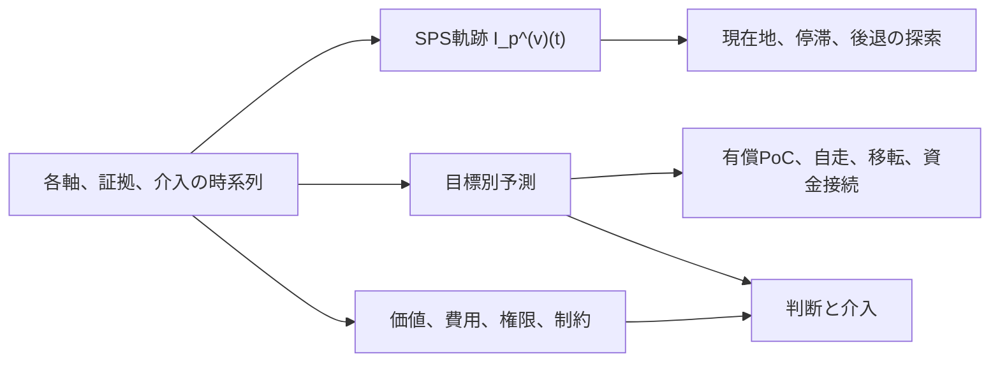

# Session 0　BZMの二つの観測対象とSPSの役割

> **講義資料の状態**：`live-reviewed v1.0`
>
> **最終対話確認**：2026-07-31
>
> **理論上の注意**：この資料は、現行仕様、設計案、仮説、反証済みの主張を区別する。SPSの新しい予測式またはPWA計算式を確定する文書ではない。

## 到達目標

この回を終えた受講者は、次の五点を説明できる。

1. BZMがPJ側と研究機関側の何を観測しようとしているか。
2. 「証拠」と「採点」と「合成値」の違い。
3. SPSの九軸式と$M\times P\times R\times S$の関係。
4. 現行SPSを成功確率、価値、自走状態として読めない理由。
5. 一本のSPS軌跡と、目標別予測モデルが両方必要になる理由。

## 前提

高校数学の指数、対数、関数を使う。

大学初年次の確率を思い出せれば十分である。

偏微分、一般化線形モデル、状態空間モデルは式を示すが、この回では計算技法まで要求しない。

## BZMが観測する二つの対象

大学発ディープテックのPJは、会社になる前から判断を迫られる。

用途を絞るか、追加試験をするか、知財条件を詰めるか、経営機能を誰が担うか、会社化を待つか。

この領域を、BZMは**Before Zero**と呼ぶ。

BZMは、Before Zeroにある不確実性を、事実、仮説、未確認へ分け、次に確認すべき条件を議論するための診断体系である。

現行BZMには、少なくとも二つの観測対象がある。

| 対象 | 現行の代表指標 | 観測したいもの | 現時点で言えないこと |
|---|---|---|---|
| SU側のPJ | SPS | 追い風、天井、到達準備、自走力に関する現在のプロフィール | 成功確率、企業価値、最適投資額 |
| 研究機関 | ECR | 制度、人員、予算、契約雛形などの機関側条件 | 支援の因果効果、機関の単一順位、PJ成功率 |

PJ側と研究機関側は別々に観測する。

両者の点数を掛けて一本の総合順位にする設計は、現行の安全な利用範囲に含まれない。

BZM 2.0では、AMDを含む支援者の権限、容量、利益相反も別に記録する方向が承認されている。

## 証拠、採点、合成値

「証拠」は、PJが良さそうだという印象ではない。

ある主張を支持または反証するために、特定の時点で確認できた記録である。

たとえば「TRLが5である」という数値は証拠そのものではない。

用途を限定した試作品を、どの条件で、誰が、何回、どの基準に照らして再現したかという記録が証拠であり、その記録を採点基準へ対応させた結果がTRLの採点になる。

| 層 | 例 | 必要な属性 |
|---|---|---|
| 証拠 | 顧客候補が有償検証の発注書へ署名した | 出典、時点、対象用途、当事者、拘束力、鮮度 |
| 採点 | BRLを4と評価した | 使用した採点基準、評価者、欠測、判断理由、評価時点 |
| 合成値 | 九軸からSPSを計算した | 式の版、重み、欠測規則、入力時点 |

この順序を逆にすると、点数の根拠を後から探すことになる。

後の結果を知ってから過去のPや$R_{\mathrm{net}}$を補う行為も、当時の予測を検証するデータには使えない。

## 現行SPSの四因子

現行SPSはSeed Prospect Scoreの略であり、M、P、R、Sの頭文字を並べた名称ではない。

四因子は、次の四つの問いに対応する。

| 因子 | 問い | 現行入力 |
|---|---|---|
| $M$ | いま、この分野に追い風があるか | $\sigma_{\mathrm{SU}}$ |
| $P$ | 当たったときの事業または社会的な天井はどこか | $P_{\mathrm{input}}$ |
| $R$ | その天井へ届く準備がどこまで整っているか | TRL、BRL、GRL、SRL、HRL |
| $S$ | 外部資金が細っても走る内部条件があるか | FRL、$R_{\mathrm{net}}$ |

表示上の式は次である。

$$
\mathrm{Score}_{\mathrm{SPS}}
=K_{\mathrm{SPS}}\cdot M\cdot P\cdot R\cdot S
$$

各因子は、九軸の寄与を括ったものである。

$$
M=(\sigma_{\mathrm{SU}}+1)^{\alpha_\sigma}
$$

$$
P=(P_{\mathrm{input}}+1)^{\alpha_P}
$$

$$
R=\prod_{x\in\{\mathrm{TRL},\mathrm{BRL},\mathrm{GRL},\mathrm{SRL},\mathrm{HRL}\}}
(x+1)^{\alpha_x}
$$

$$
S=(\mathrm{FRL}+1)^{\alpha_F}
(R_{\mathrm{net}}+1)^{\alpha_{R_{\mathrm{net}}}}
$$

したがって、展開形は次になる。

$$
\begin{aligned}
\mathrm{Score}_{\mathrm{SPS}}
={}&K_{\mathrm{SPS}}
(\sigma_{\mathrm{SU}}+1)^{\alpha_\sigma}
(P_{\mathrm{input}}+1)^{\alpha_P}\\
&\times\prod_{x\in\{\mathrm{TRL},\mathrm{BRL},\mathrm{GRL},\mathrm{SRL},\mathrm{HRL}\}}
(x+1)^{\alpha_x}\\
&\times(\mathrm{FRL}+1)^{\alpha_F}
(R_{\mathrm{net}}+1)^{\alpha_{R_{\mathrm{net}}}}.
\end{aligned}
$$

$1+1+5+2=9$軸である。

積の結合法則により、九軸式と$M\times P\times R\times S$は、現行実装では代数的に同一である。

これは「四因子が現実の四つの量を妥当に測っている」ことまでは意味しない。

式が同じであることと、式の解釈が正しいことは別の主張である。

### 現行正本内の矛盾

`BZM_2_0_REVISION_REQUIREMENTS.md`の4.2節には、概念式と九軸式が「同一の対象ではない」とある。

一方、現行PWA仕様は、四因子を九軸の積の括弧付けとして定義し、再グルーピングで数値が不変だと明記する。

少なくとも代数についてはPWA仕様が正しく、4.2節の表現は修正が必要である。

修正後は、次の二文を分けなければならない。

1. 九軸式とMPRS式は、現行実装上、代数的に同一である。
2. M、P、R、Sという解釈と、九軸の測定妥当性は未検証である。

## 九軸を掛けるときに置いている仮定

現在の0〜9は、まず順序尺度として扱う。

順序尺度が保証するのは、5が3より高いという順序である。

5と3の差が、別の軸の5と3の差と同じ大きさであることは保証しない。

二つのPJを考える。

- PJ A：$M=5$、他の注目軸$X=3$。
- PJ B：$M=3$、$X=5$。

単純な積なら、どちらも15で並ぶ。

しかし、$M$の3から5が政策資金、市場参入、競争環境を大きく変える二段階であり、$X$の3から5が連続した確認作業の二段階なら、両者を交換可能とみなす根拠はない。

もう一つ、順位が尺度の取り方で変わる例を考える。

$$
Q=(X+1)(Y+1)
$$

PJ Aを$(X,Y)=(9,3)$、PJ Bを$(5,5)$とすると、$Q_A=40>Q_B=36$である。

0〜9が順序だけを表すなら、順序を保つ別の符号化も許される。

たとえば$t(3)=0.1$、$t(5)=10$、$t(9)=11$と変換すると、

$$
Q'_A=(11+1)(0.1+1)=13.2,
\qquad
Q'_B=(10+1)^2=121
$$

となり、順位が逆転する。

したがって、SPSの順位も符号化、重み、集約法に依存しうる。

「絶対値ではなく順位だけを見る」と限定しても、この問題は消えない。

## $S$は現在の自走状態か

現行仕様は$S$を「自走力」と呼び、FRLと$R_{\mathrm{net}}$の寄与を掛ける。

$$
S=(\mathrm{FRL}+1)^{\alpha_F}
(R_{\mathrm{net}}+1)^{\alpha_{R_{\mathrm{net}}}}
$$

しかし、この式だけから、売上で自走している程度、資金枯渇までの期間、または生存確率は得られない。

FRLは創業者または経営チームの特性と能力を含む評価であり、$R_{\mathrm{net}}$は粗利、運営費、本命PJへの資源毀損をまとめようとするレビュー入力だからである。

現在の財務自走状態を知りたいなら、少なくとも次を直接観測する必要がある。

- 現金残高と月別の確定支払。
- 有償売上の入金時点と粗利。
- 補助金、共同研究費、資本調達の条件と有効期限。
- 本命PJへ必要な人員と時間。
- 売上活動が本命PJを毀損する程度。

創薬のように、売上がなくても助成、ライセンス、資本、薬事経路によって存続するPJもある。

反対に、売上があっても低粗利の受託が本命開発を止めるPJもある。

この二つは、$R_{\mathrm{net}}$を売上の有無だけで採点すると誤判定になる。

現行$S$は、自走に関する仮説を整理する診断因子としては使える。

「売上による現在の自走状態」または「将来の生存確率」としては未検証である。

## 一本の軌跡と目標別予測

PJの歩みを一本の時系列で残す要求と、目標ごとに将来を予測する要求は両立する。

同じ履歴から、用途の異なる出力を作ればよい。

$$
\mathcal H_p(t)
=\{\text{各軸、証拠、介入、変更履歴}\}_{\tau\le t}
$$

### 探索的なSPS軌跡

現時点のSPS軌跡は、次のように置く。

$$
I_p^{(v)}(t)=D_v\!\left(\mathbf X_p(t)\right)
$$

$p$はPJ、$t$は時点、$v$は採点規約と合成方式の版である。

$D_v$は、同じ版のもとで九軸を一本に要約する規則である。

この縦軸に当面与える意味は、次の一文に限る。

> 評価規約と合成方式の版$v$のもとで、PJの各軸を一本に要約した位置。

数値が2倍でも、PJが2倍有望であるとは限らない。

この値は成功確率、事業価値、自走までの距離ではない。

同じPJの上昇、停滞、後退を調べる入口として使う。

極大と極小は、何が変わったかを調べる候補時点になる。

ただし、極大がPJの真の好転、極小が真の悪化を証明するわけではない。

### 変曲点への反論

単調な変換$h$をSPSへ施すと、二階微分は次になる。

$$
\frac{d^2h(I)}{dt^2}
=h''(I)(I')^2+h'(I)I''
$$

したがって、変曲点は尺度または合成法を変えただけで移動しうる。

当面は「変曲点」と断定せず、**傾向変化の候補点**として扱う。

採点基準または合成法を変えたときは、過去の全時点を同じ版で再計算するか、グラフ上に版の切れ目を表示する必要がある。

### 目標別予測

目標別予測は、圧縮後のSPSだけを入力にしない。

各軸、証拠、介入、時間変化を含む履歴$\mathcal H_p(t)$を使う。

$$
\Pr\!\left(
Y_{p,k}\text{が今後}h\text{以内に達成される}
\mid\mathcal H_p(t)
\right)
$$

たとえば、次は別々のアウトカムである。

- 1年以内の有償PoC。
- 3年以内の売上による自走。
- 2年以内の技術移転契約。
- 次回資金接続までの存続。

一般化加法モデルの候補形は、次のように書ける。

$$
\operatorname{logit}
\Pr(Y_{p,k}^{(h)}=1\mid\mathcal H_p(t))
=\beta_{0,k,h}+\sum_i f_{i,k,h}(X_{i,p}(t))+u_p
$$

$f_{i,k,h}$は軸ごとの非線形な効果、$u_p$は同じPJ内の観測が似ることを扱うPJ効果である。

この式は未推定の設計候補であり、現行SPSの置換済み計算式ではない。

### 三つの出力

SPS軌跡はPJの歩みを圧縮表示する。

目標別予測は特定の将来事象を予測する。

判断は、予測だけでなく、価値、費用、権限、制約を使う。

## 縦断データの数え方

2026-07-28の監査で「Pと$R_{\mathrm{net}}$まで揃う行が13行」と確認された。

この13行は、完全入力の一時点スナップショット数であり、BZMが利用できる全PJ数または全観測数ではない。

まさからは、13を超えるPJについてデータを保有し、各PJについて遡及評価できる時点が複数あると共有されている。

未入力データの件数と内容は、この講義では未確認である。

時点を増やせば、変化についての情報は増える。

ただし、同じPJの100時点を独立した100PJとして数えることはできない。

検証時には、少なくとも次の三つを分けて報告する。

1. 観測時点数。
2. 独立したPJ数。
3. 目標ごとの達成イベント数。

後知恵を避けるため、各時点で当時利用可能だった証拠だけを凍結する必要もある。

## 例題

### 例題1　証拠と採点を分ける

「顧客が興味を示したのでBRLは5」という記録には、何が不足しているか。

#### 解答

「興味を示した」の具体的行動、相手の予算権限、用途、時点、拘束力、反対証拠、使用したBRL採点基準が不足している。

発言メモは証拠候補になりうるが、それだけでBRL 5は導けない。

### 例題2　SPSの二つの式

$\alpha_i=1$、$K_{\mathrm{SPS}}=1$とする。

$\sigma_{\mathrm{SU}}=3$、$P_{\mathrm{input}}=4$、TRL=2、BRL=3、GRL=1、SRL=2、HRL=3、FRL=4、$R_{\mathrm{net}}=2$のとき、四因子形と九軸展開形が同じになることを確認せよ。

#### 解答

$$
M=4,\quad P=5
$$

$$
R=3\times4\times2\times3\times4=288
$$

$$
S=5\times3=15
$$

したがって、

$$
MPRS=4\times5\times288\times15=86{,}400
$$

九つの寄与を直接掛けても、同じ86,400になる。

### 例題3　同じ軌跡から別の予測を作る

あるPJでTRLとBRLは上がったが、顧客予算の拘束力ある行動はなく、月次資金余力が減った。

この変化は、有償PoC予測と技術統合予測へ同じように効くだろうか。

#### 解答

同じように効くとは限らない。

TRL上昇は技術統合には強く効く可能性があるが、有償PoCには予算保有者の行動が不足している。

資金余力の低下は、両方の目標に対して観測を継続できない競合リスクを増やしうる。

この差が、目標別に式を分ける理由である。

## 演習

1. 自分が知っているPJを一つ選び、証拠、採点、合成値を一例ずつ分けて書け。
2. 九軸のうち、異なる0〜9尺度が同じ二段階を表していないと思う組を二つ挙げ、理由を説明せよ。
3. 「3年以内の売上自走」を、判定可能なアウトカムとして定義せよ。売上、粗利、固定費、外部資金をどう扱うかも決めること。
4. SPS軌跡の極大候補時点で確認すべき外部事象を五つ挙げよ。
5. 同じPJの縦断データを扱うとき、通常のロジスティック回帰へ各時点を独立行として入れると、標準誤差が過小になりうる理由を説明せよ。

## 理解確認

次の問いへ、数式を使わずに答えられれば、この回の中心は理解できている。

1. BZMはSU側と研究機関側を、それぞれ何のために観測するのか。
2. 九軸式とMPRS式は「同じ」なのか、「違う」のか。代数と解釈を分けて答えよ。
3. $S=FRL\times R_{\mathrm{net}}$を、そのまま売上自走率または生存確率と呼べないのはなぜか。
4. SPS軌跡と目標別予測の入力と出力を、それぞれ説明せよ。
5. 時点数が増えても独立PJ数が増えないのはなぜか。

## 原典とBZMへの接続

### OECD、欧州委員会JRC『複合指標構築ハンドブック』

- **何を問うたか**：複数の指標を一本の複合指標へまとめるとき、どの手順と検査が必要か。
- **方法**：理論枠組み、データ選定、欠測、正規化、重み、集約、感度分析、不確実性分析を一連の手順として整理した公的手引き。
- **結果**：重み、正規化、欠測処理、集約法の選択が順位とメッセージを変えるため、透明性と感度分析が必要になる。
- **BZMとの接続**：SPSの値だけでなく、九軸プロフィール、欠測、版、重みと集約法を変えた順位範囲を併記する根拠になる。
- **限界**：主対象は国などの複合指標であり、小標本のディープテックPJを直接検証した資料ではない。
- **誤読しやすい点**：「複合指標を作ってよい」という許可ではなく、作った指標の脆さを検査する方法を示す資料である。
- [OECD/European Union/EC-JRC, 2008](https://www.oecd.org/en/publications/handbook-on-constructing-composite-indicators-methodology-and-user-guide_9789264043466-en.html)
- [JRC, Step 8: Sensitivity analysis](https://knowledge4policy.ec.europa.eu/composite-indicators/toolkit_en/navigation-page/10-step-guide_en/step-8-sensitivity-analysis_en)

### Stock and Watson「一致指標と先行指標の新しい指数」

- **何を問うたか**：複数の経済系列から現在の景気状態を表す指数と、将来を予測する指数をどう作るか。
- **方法**：動学的因子モデルで一致指数を作り、別に6か月先の成長を予測する先行指数と景気後退確率を構成した。
- **結果**：現在状態を表す一致指数、将来成長の予測、景気後退確率を別々の出力として提示した。
- **BZMとの接続**：SPS軌跡を現在状態の圧縮表示、目標別モデルを将来予測として分ける発想を支持する。
- **限界**：経済統計は連続量で観測頻度も高い。0〜9の順序評価と少数PJを使うBZMへ、そのまま推定法を移植できない。
- **誤読しやすい点**：一本の指数が現在状態と全将来事象を同時に予測した研究ではない。
- [Stock and Watson, 1989](https://www.nber.org/books-and-chapters/nber-macroeconomics-annual-1989-volume-4/new-indexes-coincident-and-leading-economic-indicators)

### Liuほか「順序カテゴリ測定の縦断的不変性」

- **何を問うたか**：順序カテゴリで測った構成概念を、異なる時点で同じ尺度として比較するには何が必要か。
- **方法**：縦断的確認的因子分析で、因子負荷、閾値、誤差などの不変性を段階的に検定する方法を整理し、実データで例示した。
- **結果**：時系列変化を構成概念の真の変化と読むには、測定が時点間で同じ意味を保つという仮定の検査が必要になる。
- **BZMとの接続**：採点基準、評価者、証拠基準、合成式が変わると、SPSの上昇がPJの変化ではなく測り方の変化になりうる。
- **限界**：心理尺度の項目反応を対象とする方法論であり、BZMの九軸が単一の潜在因子を測ると証明する研究ではない。
- **誤読しやすい点**：測定不変性を確認すれば、予測妥当性や因果妥当性まで確認できるわけではない。
- [Liu et al., 2017](https://pmc.ncbi.nlm.nih.gov/articles/PMC5121102/)

## 講師用ノート

### この回で固定する説明順

1. BZMはPJ側と研究機関側を別々に観測する。
2. 証拠から採点し、採点から合成値を作る。
3. SPSのMPRS式を出す。
4. MPRSを九軸へ展開する。
5. 代数的同一性と測定妥当性を分ける。
6. SPS軌跡と目標別予測を分ける。

Mを説明する前に、SPS全体と四因子を示す。

### 誤解しやすい点

- 「SPS」のSをSurvivalの頭文字だと思う。実際はSeed Prospect Scoreの名称である。
- MPRSを概念図、九軸式を別の計算と考える。現行実装では同じ積である。
- 0〜9を置いた時点で等間隔の量になったと思う。
- $S$という記号だけを見て生存確率だと思う。
- SPSが高いPJをGOにすべきだと思う。
- 時点が増えれば独立標本も同じだけ増えると思う。
- 数値を見てから付けた「イケている」という所見を、SPSの外部検証に使う。

人間の定性的所見は残してよいが、SPSから自動生成せず、別の記録として時点固定する。

### 主張の地位

| 主張 | 地位 | 理由 |
|---|---|---|
| 現行九軸式とMPRS式は代数的に同一 | `established` | 現行定義と積の結合法則から従う |
| 現行SPSはPWAの主表示である | `established` | 現行実装仕様上の事実 |
| 九軸の0〜9は共通の量的尺度である | `unknown` | 通約可能性と段階差の等価性が未検証 |
| SPSは成功確率または企業価値である | `unknown` | 前向き外部検証がない |
| 現行$S$は売上自走状態を直接表す | `unknown` | FRLと$R_{\mathrm{net}}$の測定対象が異なる |
| SPSを版管理された探索的PJ軌跡として残す | `design-choice` | まさとの対話で採用した設計方針 |
| 目標別予測を各軸と履歴から作る | `hypothesis` | 合理的な設計だが未推定、未検証 |
| 旧Book Aの二層非可換性定理 | `refuted` | $\Phi(g,h)=gh$が現行証明への反例になる |

### 次回へ残す問い

SPS軌跡の一点を、いつ記録するのか。

月次の定期観測、重要イベント時の観測、判断直前の観測は、それぞれ異なるバイアスを持つ。

次回は、この一点を決めるために測定尺度と縦断比較の条件を扱う。

## スライド構成案

1. Before Zeroで会社設立前に起きる判断。
2. PJ側SPSと研究機関側ECR。
3. 証拠、採点、合成値の三層。
4. SPSの四つの問い。
5. MPRSから九軸式への展開。
6. 代数的同一性と測定妥当性。
7. 0〜9の符号化で順位が逆転する例。
8. 現行$S$と売上自走、生存確率の違い。
9. SPS軌跡と目標別予測の分岐図。
10. 縦断データの三つの件数。
11. 主張の地位。
12. 次回の問い「SPSの一点はいつ発生するか」。
