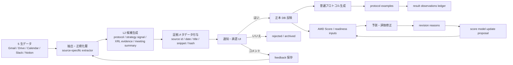

# AMD OS / AMDプロトコル 特許提案書

作成日: 2026-05-27  
対象: AMD OS、AMDプロトコル、AMD Score revision feedback loop  
位置づけ: 弁理士相談用の発明提案書ドラフト。法的判断ではなく、出願可能性を検討するための技術整理。

---

## 1. 提案の結論

現時点で特許化を狙うべき中核は、以下の 3 要素を一体化した「DeepTech 事業化判断支援システム」である。

1. **5 生データから L2 正本を生成し、人間承認を経て正本 DB に反映する仕組み (ワークフロー + データ構造)**
2. **経営判断を普遍プロトコルへ変換し、複数事例と後追い結果観測を ledger 化する仕組み (データ構造 + 結果追跡)**
3. **AMD Score の修正理由を蓄積し、人手承認を経てスコアリング設計を改訂する governance loop (ワークフロー)**

### 🚨 特許化対象外 (まさ明示判断 2026-05-27)

以下は **特許化対象に含めない**。論文・既存学術定義・公的フレームワークの引用元として明細書に書くだけで、新規性主張対象としない。

- **Cobb-Douglas 関数による集約**: Cobb & Douglas (1928) AER の経済学古典
- **TRL の 9 段階定義**: NASA Mankins (1995)
- **TRL/BRL/GRL/SRL/HRL の 5 軸構成と 9 段階定義**: 内閣府 SIP 第 3 期公募要領 (2023-) 、EU H2020、内閣府 CSTI
- **Triple Helix (μ_A × μ_I × μ_G)**: Etzkowitz & Leydesdorff (2000) Research Policy
- **FRL の構成要素 (ALQ / Grit / Resilience)**: Walumbwa 2008 JoM / Duckworth 2007 JPSP / Markman 2005 JOB
- **Bernstein 2017 JF (Founder Quality)** など FRL 関連の心理測定・経済学文献
- **AMD Score の 7 軸構成 (σ_SU × TRL × BRL × GRL × SRL × HRL × FRL)** 自体
- **α 重みの具体値**

これらは AMD が「論文・公的フレームワークを正しく引用して採用しているからこそ信頼できる」要素であり、独自発明ではない。

### 新規性主張の対象

単に「AI でスタートアップを採点する」「経営判断を記録する」では既存技術と近く、広く取るのは弱い。強い切り方は、

- **複数業務ソースからの証拠付き L2 候補抽出**
- **人間承認 (yes / no / comment) と次回 prompt への自動注入**
- **証拠メタデータ (snippet + hash + URL + run id + confidence) で原本非保存**
- **経営判断の固有名詞除去 + 題目ハッシュによる普遍 protocol 集約 + 1:N 事例構造**
- **multi-horizon append-only 結果観測 ledger (過去観測を上書きしない)**
- **AI 提案 → 人手承認 → 設定 / ルール / プロンプト / モデルの新 version 昇格 (governance versioning chain)**

の **ワークフロー + データ構造の AND 結合** + **Before-Zero (= 法人設立前の研究シーズ段階) ドメインへの適用 + 法人設立タイミング判定の出力** にあり、**スコア値 / スコア式 / スコア軸定義 / 重みの値そのものは新規性主張対象外**。

### Before-Zero 適用 + 法人設立タイミング判定 の新規性 (まさ #q1 後)

軸 G (= 「研究シーズの法人設立タイミングを AI で判断するシステム」) を対象とした 2026-05-27 調査の結果、以下が確認された:

- **Microsoft US 12,315,010 B2 (2025)** は「次のイベント (funding / exit / closure) とその時期を同時予測する」設計だが、**対象イベントに「法人設立 (incorporation)」を含まない**。Crunchbase 系の既存法人データ前提。
- **ReadyScore.ai (2025 SaaS)** は post-founding スタートアップの投資準備度評価で、設立タイミング出力ではない。
- **JST START / NEDO TCP / AIST GAP** は人手 Due Diligence プロセスで、AI 自動化 + 定量的タイミング出力ではない。
- **CRL (Univ. of Sydney)** は静的フレームワークでタイミング出力なし。
- **R.A.I.S.E. (arXiv 2504.12090, 2025)** は LLM ベース startup 評価だが投資判定 (buy/pass) で設立タイミングではない。

**結論 (conditional yes)**: 「未法人化 (pre-incorporation) 研究シーズを入力 + 出力に法人設立推奨時点を含む」と明記すれば、調査範囲内で同一クレームの先行例は発見できず。請求項 12 (Before-Zero + 設立タイミング判定) として明示的にクレーム化する。

ただし以下は **動機づけ (motivation)** として進歩性審査で引用される可能性:

- JST START / NEDO TCP の人手プロセス (= AI 化が容易想到と判断されうる)
- ReadyScore / R.A.I.S.E. の post-founding AI 評価 (= 適用先変更が容易想到と判断されうる)
- Microsoft US 12,315,010 のテンポラル予測モデル (= イベント種別変更が容易想到と判断されうる)

**防御線**: 請求項 1-11 の **ワークフロー / データ構造軸の AND 結合** + 請求項 12 の **Before-Zero 適用 + 法人設立タイミング出力** の組み合わせで進歩性を主張する。

---

## 2. 想定発明名

### 主案

**研究シーズの事業化判断を支援する情報処理装置、情報処理方法、及びプログラム**

### 代替案

- DeepTech 事業化プロセスにおける意思決定パターン抽出装置、方法及びプログラム
- 複数業務データ源に基づく事業化 readiness 評価及び経営判断プロトコル生成装置
- 人間承認付きの事業化判断ナレッジ生成及び評価モデル更新システム

---

## 3. 背景課題

大学・研究機関発の DeepTech 事業化では、設立前または設立初期の段階で以下が同時に起きる。

- 技術、顧客、資金、知財、規制、人材、研究者コミットメントなどの情報が分散している
- 情報源はメール、ドライブ資料、カレンダー、チャット、議事録、Notion などに散在する
- 経営判断は個人の経験に依存し、「なぜその判断をしたか」が再利用可能な形で残りにくい
- 判断が後から正しかったかどうかは、短期・中期・長期で評価が変わる
- AI が自動抽出した候補をそのまま正本化すると、誤抽出や楽観評価が混入する
- 事業化 readiness のスコアは、初期値や未来予測が実態とズレたとき、修正理由がモデル改善へ戻りにくい

既存の CRM、PM ツール、議事録要約ツール、スタートアップ評価スコアは、個別の要約・採点・案件管理には使える。しかし、**研究シーズの Before 0 事業化に特化して、証拠付きで判断候補を作り、人間承認で正本化し、判断パターンを普遍化し、結果を時系列で追跡し、評価モデルを更新する一連の閉ループ**は十分に実現されていない。

---

## 4. 発明の概要

本発明は、複数の業務データ源から事業化に関する構造化情報を抽出し、証拠情報を付与した候補として提示し、人間の承認または却下を受けて正本 DB に反映する。さらに、承認された経営判断を、個別プロジェクトに閉じない普遍的な意思決定パターンへ変換し、具体事例と時系列の結果観測を紐づけて保存する。加えて、事業化 readiness スコアの評価値または未来予測が修正された場合、その修正理由を蓄積し、スコアリングモデルの重みまたは評価ルールの変更候補を生成する。

---

## 5. システム構成

---

## 6. 発明要素 1: 5 生データから L2 正本を生成する human-in-the-loop 抽出システム

### 6.1 技術的構成

複数種類の社内生データを入力とする。

- 電子メール及び添付ファイル
- クラウドストレージ上の文書、スライド、表計算ファイル、議事録ファイル
- カレンダーイベント、イベント本文、参加者情報
- チャットメッセージ、スレッド、ファイル
- ナレッジ管理ツール上のページ本文及びデータベース項目

抽出器は、生データを全文保存せず、以下のような短い証拠メタデータへ正規化する。

- source type
- source id
- source url または permalink
- source date
- title / subject
- short snippet
- source hash
- extraction run id
- confidence

その上で、用途別の L2 候補へ変換する。

- 経営判断プロトコル候補
- 経営ハイライト候補
- XRL / readiness 根拠候補
- MTG サマリ
- PJ ナレッジ
- メンバーナレッジ
- 台帳差分

候補は直接正本化せず、通知 UI に表示し、人間が「はい」「いいえ」「コメント」を返す。承認時のみ正本 DB へ反映し、却下時は rejected / archived として保存する。コメントは次回抽出のプロンプトまたは判定ルールへ反映する。

### 6.2 技術的効果

- 複数データ源に散在する判断材料を、正本 DB の構造へ直接変換できる
- メール全文や議事録全文を保存せず、プライバシー・機密性を保ちつつ監査可能性を確保できる
- AI 抽出候補の誤りを、人間承認ゲートで抑制できる
- コメントを次回抽出に戻すことで、同種の誤抽出を減らせる
- 「通知だけで終わる」状態を避け、承認された候補だけが事業化判断の正本へ入る

### 6.3 既存 AMD OS 実装との対応

- L2_DATA.md: 5 生データ、L2 9 種、通知、反映・学習
- project_strategy_signals.md: outbox、applier、通知、承認
- xrl_evidence.md: XRL 根拠候補、source refs、承認
- notifications.md: 通知 UI と feedback

---

## 7. 発明要素 2: 経営判断の普遍プロトコル化と結果観測 ledger

### 7.1 技術的構成

プロジェクト固有の会議サマリや経営ハイライトから、経営判断に関する以下の要素を抽出する。

1. 分岐点: どの選択肢があるか
2. 判断材料: 何を基準に判断するか
3. アクション: どの方針を採るか
4. 結果: アクション後に実際に起きたこと

抽出時点では、結果を推測で埋めず、分岐点・判断材料・アクションを中心に候補化する。候補は、固有プロジェクト名や個人名を除いた普遍的な意思決定パターンとして生成する。同一または類似の判断パターンは、ハッシュまたは類似度判定により同一 protocol_id に集約する。

各プロトコルには、複数の具体事例を紐づける。

- project_id
- occurred_on
- summary
- example-specific branch point
- criteria
- action taken
- source meeting id / source url

結果は単一フィールドの上書きではなく、観測時点ごとに append-only で保存する。

- immediate
- 1m
- 3m
- 6m
- 12m
- 24m
- long_term

各結果観測は、positive / negative / mixed / neutral / unknown、confidence、summary、evidence refs を持つ。これにより、短期では悪く見えた判断が長期では有効だった、またはその逆、といった時間軸の変化を保持できる。

### 7.2 技術的効果

- 経営判断を個別案件ログではなく、再利用可能な意思決定パターンとして蓄積できる
- 複数プロジェクトの類似判断を 1 つの普遍プロトコルへ集約できる
- 後続案件で同じ分岐点が出たとき、過去事例と結果観測を参照できる
- 結果評価を上書きせず、時間経過に伴う評価変化を保持できる
- DeepTech 事業化における暗黙知を、URA / EIR が参照できる知識ベースへ変換できる

### 7.3 既存 AMD OS 実装との対応

- amd_protocol.md: protocols、protocol_examples、protocol_result_observations
- L2_DATA.md: AMDプロトコルを L2 ②として定義
- AdminProtocolsClient: 候補の確認、修正依頼、却下、archive

---

## 8. 発明要素 4: AMD Score revision feedback loop

### 8.1 技術的構成

事業化 readiness スコアの入力値または未来予測値について、人間または AI が修正した場合、以下を保存する。

- project_id
- score_input_id
- axis
- old_value
- new_value
- evaluated_at
- reason_md
- discussion_md
- revised_by
- source: manual / AI proposal
- applied_to_model flag

修正理由を一定期間ごとに集約し、軸ごとのズレ傾向を抽出する。

例:

- 特定領域で学術 momentum が高めに推定される
- Founder readiness の resilience 評価が甘く出る
- HRL が関連メンバー数に引っ張られすぎる
- 未来予測が資金調達遅延を反映できていない

抽出されたズレ傾向に基づいて、スコアリングモデルの変更候補を生成する。

- alpha 重みの変更候補
- axis 定義の変更候補
- signal_type 定義の変更候補
- FRL / HRL 算定式の変更候補
- confidence しきい値の変更候補

変更候補は自動適用せず、管理 UI に pending proposal として提示し、人間承認後に新しい score model version として保存する。

### 8.2 技術的効果

- スコア修正が単発の上書きで終わらず、モデル改善データとして再利用される
- 人間の違和感や現場判断が、次回以降の AI 評価へ戻る
- スコアリングモデルの versioning と説明可能性を確保できる
- 同じズレが複数 PJ で再発する場合、モデル構造の問題として検出できる
- AI 提案と人間承認を分離し、過度な自動更新を避けられる

### 8.3 既存 AMD OS 設計との対応

- score_revision_feedback_loop.md: `amd_score_revisions`、`amd_score_alpha_proposals`
- amd_score.md: AMD Score 入力値、alpha、未来予測、根拠 notes
- notifications.md: revision proposal の採否

---

## 9. 請求項たたき台 (2026-05-27 先行特許スクリーニング後 改訂版)

以下は弁理士相談用のラフ案である。先行特許一次スクリーニング (`2026-05-27_amd_os_protocol_prior_art_screening.md`) を反映し、以下 4 つのホワイトスペースを請求項の中心に置く設計に組み替えた。

- **WS-1**: 全文非保存 + snippet + hash + extraction run id + confidence の 5 タプル証拠メタデータ
- **WS-2**: 却下 / コメントが次回 LLM 抽出プロンプトに自動注入される継続学習ループ
- **WS-3**: 同一意思決定に対する multi-horizon (immediate / 1m / 3m / 6m / 12m / 24m / long_term) × valence × confidence の append-only 結果観測 ledger
- **WS-4**: 固有名詞除去 + 題目ハッシュによる普遍 protocol 集約 + 1:N 事例構造
- **WS-5**: スコア修正理由 md の LLM 集約 → 重み / 軸定義 / 閾値の変更候補 → pending UI → 人間承認による新モデル version 昇格 (governance versioning chain)

### 請求項 1: 主請求項 (改訂 = WS-1 と WS-2 を明示)

事業化判断を支援する情報処理方法であって、コンピュータが、

1. 電子メール、クラウドストレージ文書、カレンダーイベント、チャットメッセージ、及びナレッジ管理ページのうち少なくとも二以上を含む複数種類の業務データ源から、対象プロジェクトに関連するソースデータを取得し、
2. 前記ソースデータから、事業化判断、事業化 readiness 根拠、又はプロジェクト状態変化の少なくとも一つを示す候補データを抽出し、
3. 前記候補データに、前記ソースデータの**全文を保存することなく、ソース種別、ソース識別子、ソース所在情報、日付、タイトル、所定長以下の抜粋、ハッシュ値、抽出処理識別子、及び信頼度を含む証拠メタデータ**を付与し、
4. 前記候補データを、承認、却下、又はコメントを受け付ける確認インターフェースに提示し、
5. 承認入力を受けた候補データを正本データベースに反映し、
6. 却下入力又はコメント入力を、**後続の候補データ抽出処理に用いる大規模言語モデルへの入力プロンプトに自動的に注入する**、

情報処理方法。

### 請求項 2: L2 種別

請求項 1 の方法において、前記候補データは、経営判断プロトコル、経営ハイライト、readiness 評価根拠、会議サマリ、プロジェクトナレッジ、メンバーナレッジ、又は台帳差分の少なくとも一つの種別に分類される。

### 請求項 3: 普遍プロトコル化 (改訂 = WS-4 を明示)

請求項 1 又は 2 の方法において、前記コンピュータは、承認された事業化判断候補から、プロジェクト固有名詞を除去又は抽象化した意思決定パターンを生成し、当該意思決定パターンを、**分岐点、判断材料、及びアクションを含むプロトコルデータとして保存し、当該プロトコルデータの題目を所定のハッシュ関数で識別子化することによって、同一又は類似の意思決定パターンを同一の普遍プロトコル識別子に集約する**。

### 請求項 4: 1:N 事例構造 (改訂 = 出典会議識別子を明示)

請求項 3 の方法において、前記コンピュータは、前記普遍プロトコル識別子に対して**複数のプロジェクト固有事例を紐づけて保存し、各事例は当該事例に固有の分岐点、判断材料、アクション、対象プロジェクト識別子、発生日、及び出典会議識別子を含む**。

### 請求項 5: 結果観測 ledger (改訂 = FHIR/OMOP との区別を強化、WS-3 改)

請求項 3 又は 4 の方法において、前記コンピュータは、前記プロトコルデータ又は前記プロジェクト固有事例に紐づくアクション後の結果を、

- **観測時点 (observed_on)**、
- **所定の評価期間カテゴリ (immediate, 1 月, 3 月, 6 月, 12 月, 24 月、及び長期のうちのいずれか)**、
- **所定の評価極性カテゴリ (positive, negative, mixed, neutral、及び unknown のうちのいずれか)**、
- 信頼度、
- 要約、及び
- 証拠メタデータ

を含む結果観測データとして append-only に保存し、

1. **過去の結果観測を上書きすることなく**、同一意思決定に対して時系列の複数観測を保持し、
2. **同一の (プロトコル識別子, 評価期間) に対して、評価極性が異なる複数の結果観測データが共存する場合、当該複数の結果観測データを上書きすることなく時系列に並べて意思決定者の確認インターフェースに呈示し**、
3. **前記証拠メタデータは、会議録、月次レポート、組織内 KPI、戦略シグナル、及びプロジェクト状態変化記録のうち少なくとも二以上の異種ソースからの参照を含む**。

→ 医療系の FHIR Observation / OMOP CDM OBSERVATION との区別: (a) 経営判断ドメイン (b) 矛盾観測の同時保持 UI (c) 異種 evidence 統合参照 の 3 点が specific limitation。

### 請求項 6: システムパラメータの修正記録 (改訂 = スコアモデルに限定しない汎用化)

請求項 1 から 5 のいずれかの方法において、前記コンピュータは、

**大規模言語モデルへの入力プロンプト、抽出ルール、判定ルール、設定値、及びスコアリングモデルのうち少なくとも二以上を含む複数種類のシステムパラメータ**に対する修正を受け付け、修正前値、修正後値、対象パラメータ識別子、対象日、修正理由を表す自由記述テキスト、修正者、及び修正種別 (人手 / AI 提案) を含む修正履歴データを保存する。

### 請求項 7: 修正履歴の集約と変更候補生成 (改訂 = LLM 集約を明示)

請求項 6 の方法において、前記コンピュータは、**所定期間内に蓄積された複数の修正履歴データを大規模言語モデルに入力することにより、対象パラメータごとの修正傾向を表すパターンデータを抽出し**、当該パターンデータに基づいて前記システムパラメータの変更候補を生成する。

### 請求項 8: human-in-the-loop governance versioning (改訂 = 異種オブジェクト統一適用、WS-5 改)

請求項 7 の方法において、前記コンピュータは、

1. 前記変更候補を pending proposal として確認インターフェースに提示し、
2. **承認入力を受けた場合に限り、当該変更候補を反映した新たなシステムパラメータを新規 version として保存し、過去 version を保持し**、
3. **当該複数種類のシステムパラメータに対して、上記 1-2 と同一の処理パターンを統一的に適用する**。

→ Ciena US 10,965,527 との区別: (a) ブロックチェーンに依存しない RDB version カラム + pending_proposals テーブル実装 (b) ネットワーク機器設定限定ではなく **複数種類のシステムパラメータ (プロンプト / ルール / 設定値 / スコアリングモデル) に統一適用するメタ機構**。

### (削除) 旧請求項 9: 7 軸以上 readiness の積による集約

**まさ判断 2026-05-27**: Cobb-Douglas / 7 軸 readiness の積は **論文・内閣府公募要領の引用要素**であり、特許化対象に含めない。よって本請求項は削除。明細書の実施例 (§5 システム構成 / §8 発明要素 3) に「本実施例ではスコアリングモデルとして Cobb-Douglas 形式の積による集約を採用しているが、本発明はスコアリングモデルの種別に依存せず、加重和、ニューラルネットワーク、決定木、その他任意のスコアリングモデルに適用可能である」と書く。

### 請求項 9: 装置請求項 (旧 10)

請求項 1 から 8 のいずれかの方法を実行するプロセッサ及びメモリを備える情報処理装置。

### 請求項 10: プログラム請求項 (旧 11)

請求項 1 から 8 のいずれかの方法をコンピュータに実行させるプログラム。

### 請求項 11: 分割出願候補 (発明要素 3 を独立クレーム化、旧 12)

**複数種類のシステムパラメータ (大規模言語モデルへの入力プロンプト、抽出ルール、判定ルール、設定値、又はスコアリングモデルを含む) を、人手承認を経て新規 version として保存する情報処理方法**であって、コンピュータが、請求項 6, 7, 8 と同等の処理を実行する、情報処理方法。

→ 基幹出願 (請求項 1-5, 9, 10) と分割出願 (請求項 11 を主請求項とし、6-8 を従属項) の 2 系統に分ける選択肢を弁理士相談の論点とする。**当該分割出願は「スコアモデル」に限定せず、複数種類のシステムパラメータに統一適用する汎用 governance loop として書く方針**。Cobb-Douglas / 7 軸 / 重み α の具体値は明細書実施例にとどめる。

### 請求項 12: Before-Zero 適用 + 法人設立タイミング判定 (新設、まさ #q1 後)

請求項 1 から 11 のいずれかの方法において、

1. **前記対象プロジェクトは、法人設立前の研究シーズ段階にあるプロジェクトであり、当該プロジェクトに関する組織は当該方法の実行時点で法人として設立されていない**;
2. 前記コンピュータは、前記正本データベースに反映された前記候補データ、前記スコアリングモデルの出力、及び前記結果観測データに基づいて、**当該研究シーズについて法人を設立すべき時期を推奨する設立時期推奨データを生成し**;
3. 前記設立時期推奨データを、所定の閾値条件を満たした時点で意思決定者の通知インターフェースに提示する、

情報処理方法。

→ Microsoft US 12,315,010 B2 との区別: (a) 対象が「未法人化研究シーズ」(b) 出力イベントが「法人設立」(funding/exit/closure ではない) (c) 入力が「組織の財務・投資履歴」ではなく「研究シーズに関する 5 生データ + L2 候補 + 普遍 protocol + 結果観測」。

→ JST START / NEDO TCP との区別: (a) 完全自動化 (人手 due diligence ではない) (b) 定量的タイミング出力 (GO/NO-GO バイナリではなく時期推奨)。

→ ReadyScore.ai / R.A.I.S.E. との区別: (a) pre-incorporation 段階 (post-founding ではない) (b) 「設立タイミング出力」(投資準備度評価ではない)。

---

## 10. 先行技術との差分仮説 (2026-05-27 ピント修正後)

**⚠️ 2026-05-27 まさ判断による再構成**: スコアロジック (Cobb-Douglas / TRL / 5-7 軸 readiness / Triple Helix / FRL 構成要素) は特許化対象外。よって本節も、ワークフロー / システム / データ構造軸に絞って整理する。

### 10.1 (削除) 旧版で「危険」と挙げたスコアロジック系公報

以下の先行特許 / 文献は、AMD 案が **そもそも新規性主張対象としていないスコアロジック系**であるため、本提案書の新規性主張の阻害要因にはならない。明細書では「公知の引用元」として参照するのみ。

- 内閣府 SIP 第 3 期公募要領 (TRL/BRL/GRL/SRL/HRL の 5 軸 9 段階定義)
- C2X XRL+ サービス (早稲田大学 + Smart City Planning)
- US 6,175,824 B1 (CHI Research, Cobb-Douglas portfolio scoring)
- AFRL TRL Calculator (Nolte 2003), AEB IMATEC (2018)
- CN102890753A (TRL determination)
- WO2014146088A2 (investment scoring)
- EQT Motherbrain (CNN による VC スコアリング)
- CB Insights Mosaic (4 軸加重スコア)
- arXiv 2407.04885 / 2509.14448 / 2509.08140 (LLM-powered VC scoring)

これらは AMD の請求項 1-11 のいずれもブロックしない。**スコアの「値」「式」「軸」を特許化対象から外したことで、これらの懸念は構造的に消えた**。

### 10.2 ワークフロー / データ構造軸での先行特許 (再調査中)

詳細は別文書 `2026-05-27_amd_os_protocol_prior_art_screening.md` を参照 (新版起草中、2026-05-27 ピント修正後再調査中)。再調査軸:

| 軸 | 内容 |
|---|---|
| A | 業務マルチソース HITL LLM 構造化抽出 + 承認ワークフロー + 正本 DB 反映 (Glean / Seek AI / Otter / Gong / Microsoft / Notion AI) |
| B | 却下 / コメントが次回 LLM プロンプトに自動注入される prompt-level 継続学習ループ |
| C | 証拠メタデータ (snippet + hash + url + run_id + confidence) で原本非保存・監査可能 |
| D | 意思決定 / 教訓 / 議事録ナレッジベース (CBR / Lessons Learned / Confluence Decisions / ServiceNow KB) |
| E | multi-horizon append-only outcome ledger (経営判断 + 医療 + 投資 + 教育 + 臨床試験) |
| F | AI 提案 → 人手承認 → 設定 / ルール / プロンプト / モデルの new version 昇格 governance loop |

(参考: 初版調査で IBM US 7,730,005 (Lessons Learned)、HP US 9,299,025 (CBR generalization)、Seek AI 2 件 (HITL LLM)、Glean 関連出願群 (multi-source KG)、Microsoft US20250131289A1 (KG extraction) が候補として確認されている)

### 10.3 本発明の新規性 (ホワイトスペース)

本発明は、以下 5 要素の **AND 結合** に新規性・進歩性がある。**スコア値・式・軸は含まない**。

1. **WS-1**: 全文非保存 + ソース URL + 日付 + タイトル + 短い抜粋 + ハッシュ + 抽出処理識別子 + 信頼度 の **5 タプル証拠メタデータ**で監査可能性とプライバシーを両立
2. **WS-2**: **却下入力 / コメント入力が、次回の LLM 抽出プロンプトに自動注入される継続学習ループ** (重みを更新せず prompt few-shot で更新)
3. **WS-3**: 同一意思決定に対する **multi-horizon (immediate / 1m / 3m / 6m / 12m / 24m / long_term) × 5 値 valence × confidence の append-only 結果観測 ledger**。過去の観測を上書きしない
4. **WS-4**: **固有名詞除去 + 題目ハッシュによる普遍 protocol 集約 + 1 protocol : N project_examples の 1:N 構造**。各 example は source_meeting_id を持つ
5. **WS-5**: 修正理由 reason_md を LLM で **軸別ズレ傾向に集約 → 設定 / 軸定義 / 閾値 / プロンプト等の change candidate を生成 → pending proposal UI で人間承認 → 新 version 昇格**という **governance chain** (スコアモデルに限定されない汎用 pattern)

「AI で経営判断を記録する」「マルチソース抽出する」のいずれかを単体で書くと拒絶確実。**5 要素の AND と、「Before-Zero deep-tech 事業化 (法人設立前の研究シーズ段階)」のドメイン文脈** で押すべき。

### 10.4 明細書に明示引用すべき公知文献 (新規性主張対象ではない引用元)

弁理士相談時に、以下を「公知の引用元として参照しているが、本発明の新規性主張対象には含めない」と明示する記載を準備する。

#### スコアロジック (特許化対象外、明細書実施例で引用)

- 内閣府 SIP 第 3 期公募要領 (TRL/BRL/GRL/SRL/HRL の 5 軸定義)
- NASA Mankins (1995) (TRL 9 段階の原典)
- Etzkowitz & Leydesdorff (2000) Research Policy (Triple Helix)
- Cobb & Douglas (1928) AER (Cobb-Douglas 関数)
- Walumbwa et al. (2008) JoM (ALQ 4 次元)
- Duckworth et al. (2007) JPSP (Grit)
- Markman et al. (2005) JOB (Resilience)
- Bernstein et al. (2017) JF (Founder Quality)

#### ワークフロー / データ構造系 (周辺先行特許、新規性主張で区別すべき)

- IBM US 7,730,005 B2 (Lessons Learned closed loop)
- HP US 9,299,025 B1 (CBR case generalization)
- Seek AI 米国特許 2 件 (HITL LLM workflow, 2024)
- Glean Technologies 関連出願群 (マルチソース KG)
- Microsoft US20250131289A1 (Knowledge Graph Extraction)

(再調査軸 A-F の確定リストは別文書 `prior_art_screening.md` に整理)

---

## 11. 特許と営業秘密の切り分け

### 特許に出してよいもの

- システム全体の処理フロー
- データ構造の抽象形
- 候補生成、承認、正本反映、feedback 保存の流れ
- 普遍プロトコルと事例 ledger の構造
- スコア修正データからモデル更新候補を作る流れ
- 全文保存せず証拠メタデータで監査性を確保する方法

### 営業秘密として残すもの

- AMD OS の実データ
- プロンプト全文
- 個別 PJ の判断事例本文
- AMD Score の具体的な重み
- まさの判断ノウハウの具体例
- source connector の認証・運用ノウハウ
- 実際の scoring calibration データ
- 研究機関や顧客ごとの導入運用ルール

---

## 12. 出願前の注意

日本では、出願前に発明を公開すると原則として新規性の問題が生じる。新規性喪失の例外はあるが、公開から 1 年以内の出願や証明書類などの手続きが必要になる。外国出願では国ごとに扱いが異なるため、対外資料、営業資料、イベント登壇、Web 公開、論文、note、スライド共有の前に、少なくとも発明のコア部分は弁理士へ確認する。

本提案書自体も、外部共有する場合は NDA 前提にする。

---

## 13. 弁理士に確認したい論点 (2026-05-27 ピント修正後)

**前提**: スコアロジック (Cobb-Douglas / 7 軸 readiness / Triple Helix / FRL 構成) は特許化対象外 (まさ判断)。論点はワークフロー / システム / データ構造軸に絞る。

### 高優先

1. **3 要素を 1 出願にまとめるか、基幹出願 (要素 1+2) + 連続/分割出願 (要素 3) に分けるか**
   - 私の事前判断: 後者を推奨。要素 3 (governance loop) は MLOps 系周辺特許の引用リスクを隔離できる + 「スコアモデルに限定しない汎用 governance パターン」として広めに取れる可能性。
2. **主請求項に「Before-Zero deep-tech 事業化」のドメイン限定を入れるか**
   - 私の事前判断: 主請求項には入れない。技術構成 (snippet+hash, prompt 注入, multi-horizon ledger, governance versioning) で勝負。ドメインは明細書実施例に留める。
3. **Seek AI 2 件 (HITL × LLM workflow) の請求項範囲を verify したうえで、AMD 主請求項の言い回しをどう設計するか**
   - 私の事前判断: 「クエリ生成」ではなく「**ソースイベント駆動の構造化候補生成**」「**通知 UI による push 型 yes/no/comment**」「**複数業務スキーマ並列出力**」「**承認済みのみがマスタ DB + 下流カスケード**」を AND で書くことで Seek AI と区別できる。
4. **Glean / Microsoft / Notion Labs のマルチソース KG 特許との区別**
   - 私の事前判断: 「(a) LLM 候補は自動書き込みしない (b) snippet + hash 限定で本文非保存 (c) 人コメント → 次回 prompt の自動注入」の 3 点を必ず請求項 1 に入れる。

### 中優先

5. 5 生データの列挙を請求項に入れるか、「複数種類の業務データ源」と広く書くか
   - 私の事前判断: 広く書きつつ従属項で 5 種を例示する 2 段構成。
6. snippet / hash / no full-text storage を独立技術的特徴として強く押すか
   - 私の事前判断: 強く押す。請求項 1 の核に置いた。
7. multi-horizon append-only ledger を独立請求項化するか
   - 私の事前判断: 独立従属項化を推奨。請求項 5 に組み込み済み。「医療判断 / 投資判断 / 教育 / 臨床試験」などへの横展開可能性を明細書で示唆して権利範囲を広げる。
8. 「却下 / コメントが次回 LLM 抽出プロンプトに注入される」を独立従属項化するか
   - 私の事前判断: 独立従属項化を推奨。請求項 1 の最後の要件として組み込み済み。
9. 「AI 提案 → 人手承認 → new version 昇格」を **スコアモデルに限定せず**、設定 / ルール / プロンプト / モデルの汎用 governance pattern として書くか
   - 私の事前判断: 汎用 pattern として書く。具体例 (スコアモデル / 抽出 prompt / extraction rule) は実施例。

### 低優先 (一般論点)

10. AI / LLM を明示するべきか、機械学習モデル・ルールベース・LLM を含む一般的な抽出器として書くか
11. 国内優先で先に出して、1 年以内に PCT を検討するのがよいか
    - 私の事前判断: 国内優先で早期出願 + 1 年以内 PCT を強く推奨。
12. 既に営業資料や社内外発信で公開済みの要素があるか、その場合に新規性喪失例外の手続きが必要か
    - 私の事前判断: AMD 側で「これまでの社外公開資料・登壇・note 等のコア要素開示状況」を棚卸しして弁理士に開示する。

### 追加で確認したい論点

13. **Seek AI / Glean / Microsoft / Notion Labs の公報番号 verify と請求項 1 全文取得** をどう進めるか (USPTO PPUBS 直撃 / EPO Espacenet / 弁理士事務所への代行依頼可否)
14. ServiceNow / Salesforce Einstein / Otter / Gong / Chorus / Fireflies の HITL 抽出 + CRM 反映系の精査
15. 「議事録 / 経営判断 KB 系」での J-PlatPat 日本国内出願人検索 (Stockmark / ABEJA / FRONTEO / AnyTech 等)

---

## 14. 推奨出願方針

### 第 1 優先: 基幹出願

名称案: **研究シーズの事業化判断を支援する情報処理装置、情報処理方法、及びプログラム**

対象:

- 5 生データから L2 候補を生成する
- 証拠メタデータを付与する
- 人間承認で正本反映する
- フィードバックを次回抽出へ戻す
- 承認済み判断を普遍プロトコル化する
- 結果観測を ledger 化する

### 第 2 優先: 派生出願

名称案: **事業化 readiness 評価モデルの修正理由に基づくモデル更新候補生成装置、方法及びプログラム**

対象:

- 未来予測修正
- 修正理由保存
- 修正パターン抽出
- alpha / axis / confidence 変更候補
- human approval による model versioning

### 第 3 優先: 将来出願

名称案: **Triple Helix 状態空間モデルに基づく研究シーズ事業化タイミング推定装置**

対象:

- μ_A / μ_I / μ_G
- 観測量 P/B/V/R/I_R/N/C
- 状態空間モデル
- DeepTech シーズの立ち上げ timing / macro fit 推定

今回は 1,2,4 に集中するため、第 3 優先はメモに留める。

---

## 15. 参考にした社内正本

- `/Users/masa/projects/knowledge/amd_os_vision.md`
- `/Users/masa/projects/knowledge/amd_value_model.md`
- `/Users/masa/projects/AMD/amd-os/pwa/design/L2_DATA.md`
- `/Users/masa/projects/AMD/amd-os/pwa/design/amd_protocol.md`
- `/Users/masa/projects/AMD/amd-os/pwa/design/score_revision_feedback_loop.md`
- `/Users/masa/projects/AMD/amd-os/pwa/design/amd_score.md`
- `/Users/masa/projects/AMD/amd-os/pwa/design/xrl_evidence.md`
- `/Users/masa/projects/AMD/amd-os/pwa/design/project_strategy_signals.md`

## 16. 参考にした外部公開情報

- JPO, [Recent Trends in Business-Related Inventions](https://www.jpo.go.jp/e/system/patent/gaiyo/recent_trends_biz_inv.html): business method implemented by ICT can be business-related invention.
- JPO, [「コンピュータソフトウエア関連発明に係る審査基準」の改訂について](https://www.jpo.go.jp/system/laws/rule/guideline/patent/tukujitu_kijun/kaitei2/h3003_kaitei.html): software information processing concretely realized using hardware resources can have invention eligibility.
- JPO, [Procedures for Obtaining a Patent Right](https://www.jpo.go.jp/e/system/patent/gaiyo/patent.html): first-to-file, avoid public disclosure before filing.
- JPO, [Procedures for Seeking the Application of Exceptions to Lack of Novelty of Invention](https://www.jpo.go.jp/e/system/laws/rule/other/patent/hatumei_reigai.html): grace period may apply within one year under conditions.
- USPTO, [2024 AI subject matter eligibility guidance](https://www.uspto.gov/about-us/news-updates/uspto-issues-ai-subject-matter-eligibility-guidance): AI inventions require practical application analysis.
- USPTO, [2025 revised inventorship guidance](https://www.uspto.gov/subscription-center/2025/revised-inventorship-guidance-ai-assisted-inventions): AI systems are tools; natural persons are inventors.

---

## 17. 次に作るべき資料

1. 弁理士面談用 1 枚サマリ
2. システム構成図 1 枚
3. 請求項案を 2 系統に分けた比較表
4. 出願前公開チェックリスト
5. 社外秘 / NDA 前提の共有版 docx
