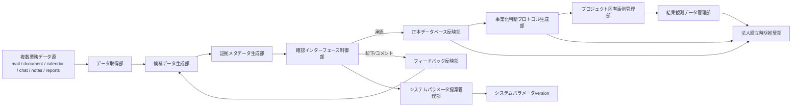
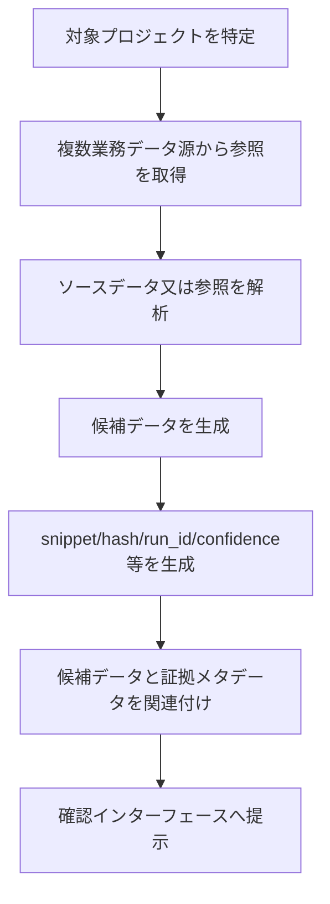
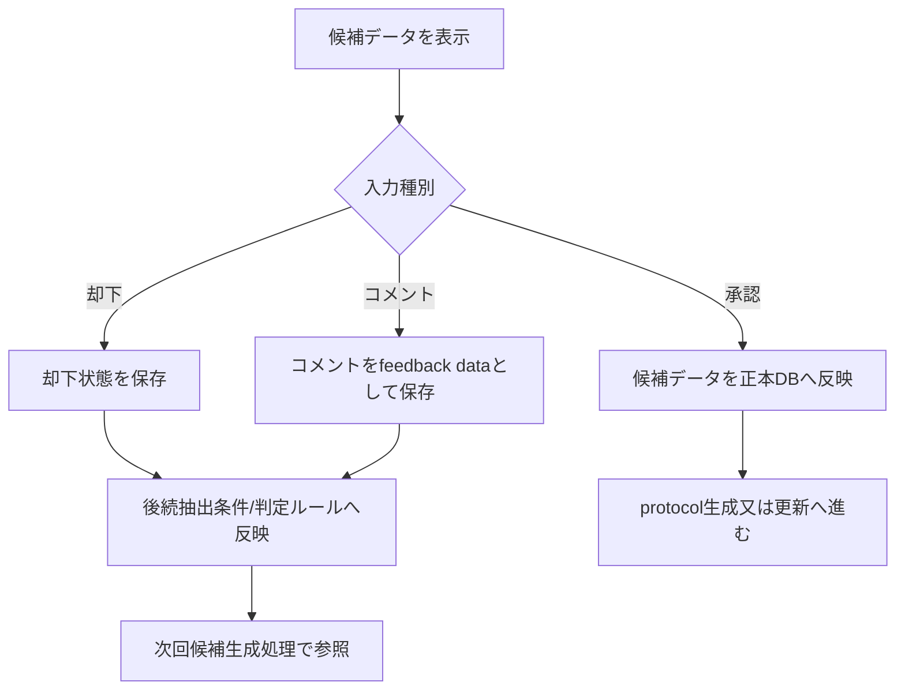
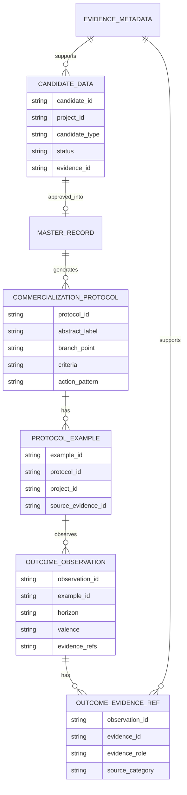
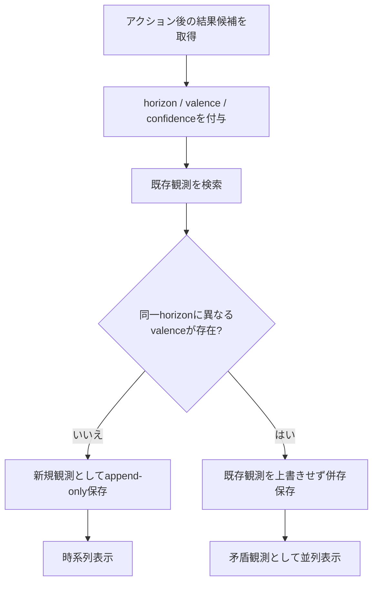
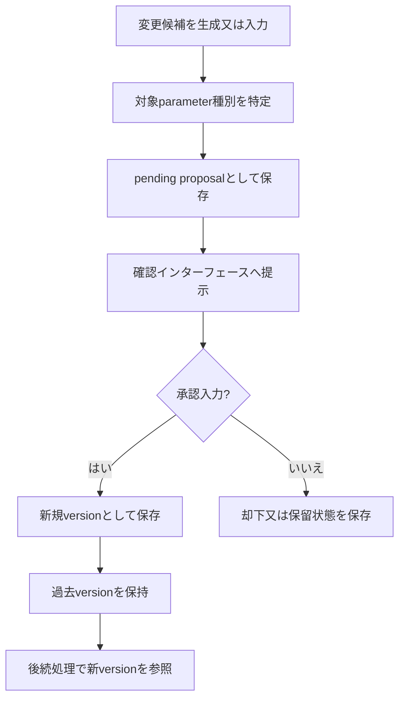
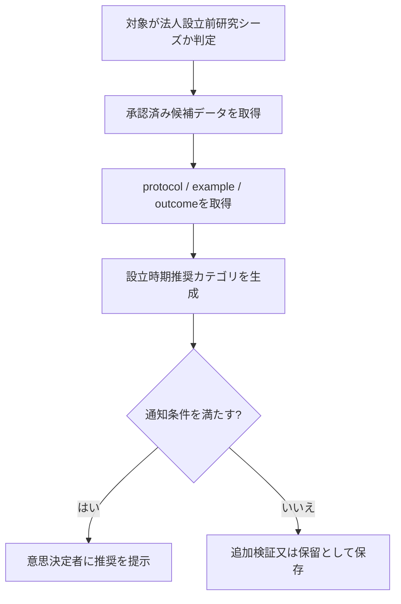
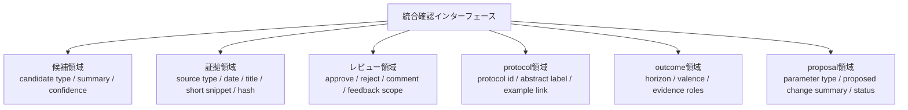

# AMD OS / AMDプロトコル 特許出願書類たたき台（内部版）

- 作成日: 2026-06-01
- 位置づけ: 出願前の内部ドラフト。外部送付用ではない。
- 目的: 請求項と明細書を同じ文書上に置き、出願可能性とretrofit不足を早期に発見する。
- 注意: 本文書は弁理士レビュー前の内部案。実データ、prompt全文、AMD Score重み、calibration、実PJ事例本文は入れない。

## 0. 現時点の結論

出願には、請求項だけでなく、明細書の「発明を実施するための形態」が必要。

このドラフトを書き始めた時点で見えた不足は以下。

1. Fig.1〜Fig.8相当の図面案を追加済み。ただし特許図面としての清書は未実施。
2. WS-1〜WS-5を1つの処理フローとして説明するretrofit図を追加済み。
3. evidence metadata、candidate、master DB、protocol、example、outcome、pending proposalの抽象テーブル例を追加済み。
4. reject/comment feedbackの抽象処理例を追加済み。ただし具体prompt変換ロジックは営業秘密として非開示。
5. Before-Zero/設立タイミング推奨の安全な抽象実施例を追加済み。ただし実weight/threshold/calibrationは非開示。

よって次の作業は、弁理士が形式化できるように、**図面の清書、請求項との対応表、及び実施例の過不足レビュー**を行うこと。

---

## 【発明の名称】

研究シーズの事業化判断を支援する情報処理装置、情報処理方法、及びプログラム

---

## 【技術分野】

本発明は、研究機関、大学、企業研究所、又はスタートアップスタジオ等における研究シーズの事業化判断を支援する情報処理技術に関する。

より具体的には、本発明は、複数種類の業務データ源から事業化判断に関する候補データを生成し、証拠メタデータを付与し、人間の承認を経て正本データベースへ反映し、事業化判断プロトコル、複数プロジェクト事例、結果観測データ、及びシステムパラメータの改訂履歴を管理する情報処理装置、情報処理方法、及びプログラムに関する。

---

## 【背景技術】

大学又は研究機関発の技術シーズを事業化する過程では、技術成熟度、知的財産、顧客候補、研究者のコミットメント、資金調達可能性、規制、チーム構成、共同研究契約、及び市場仮説等の情報が、複数の業務ツールに分散して存在する。

例えば、電子メール、クラウドストレージ上の文書、カレンダーイベント、チャットメッセージ、会議録、ナレッジ管理ページ、月次レポート、及びプロジェクト台帳等に、事業化判断に必要な情報が断片的に記録される。

従来、CRM、プロジェクト管理ツール、議事録要約ツール、文書検索ツール、又はスタートアップ評価ツール等は存在する。しかし、これらは、個別の情報整理、検索、要約、又は評価に留まることが多い。

特に、法人設立前の研究シーズ段階では、法人としての財務履歴、顧客履歴、採用履歴、投資履歴等が存在しない場合がある。このため、既存のスタートアップ評価又は投資判断モデルをそのまま適用することは困難である。

また、AIにより抽出された候補情報をそのまま正本データベースへ反映すると、誤抽出、過剰な要約、根拠不明な評価、又は営業秘密の混入が生じるおそれがある。さらに、一度行われた事業化判断が短期的には有効でも、中長期的には異なる結果をもたらすことがあるため、結果を単一フィールドで上書きするだけでは判断知見を再利用しにくい。

---

## 【発明が解決しようとする課題】

本発明が解決しようとする課題は、複数の業務データ源に分散した研究シーズの事業化判断材料を、証拠に基づいて構造化し、人間承認を経て正本化し、抽象化された事業化判断プロトコルとして再利用可能にし、さらに短期から長期にわたる結果観測及びシステムパラメータの改訂を一連の閉ループとして管理することである。

具体的には、以下の課題を含む。

1. 複数業務データ源に散在する判断材料を、出典証拠とともに候補データ化すること。
2. 元データ全文を保存せず、必要最小限の証拠メタデータで監査可能性を確保すること。
3. AIが生成した候補データを、人間の承認、却下、又はコメントによって制御すること。
4. 却下又はコメントを後続の候補生成処理へ反映し、同種の誤抽出を低減すること。
5. 承認済み候補データから、プロジェクト固有情報を抽象化した事業化判断プロトコルを生成すること。
6. 1つの事業化判断プロトコルに複数のプロジェクト固有事例を関連付けること。
7. 同一判断に対する短期、中期、長期の結果観測を上書きせず保持すること。
8. 矛盾する結果観測を保持したまま意思決定者に提示すること。
9. AI又は人間が提案したシステムパラメータの変更を、人間承認を経てversion管理すること。
10. 法人設立前の研究シーズについて、法人設立時期の推奨を支援すること。

---

## 【課題を解決するための手段】

本発明の一態様は、事業化判断を支援する情報処理方法であって、コンピュータが、対象プロジェクトに関する複数種類の業務データ源からソースデータ又は当該ソースデータへの参照を取得し、当該ソースデータ又は参照に基づいて候補データを生成し、候補データに証拠メタデータを付与し、候補データ及び証拠メタデータを確認インターフェースに提示し、承認入力を受けた候補データを正本データベースへ反映し、却下入力又はコメント入力を後続の候補データ生成処理へ反映し、正本データベースに反映された候補データに基づいて事業化判断プロトコルデータを生成又は更新する、情報処理方法である。

本発明の別の態様では、コンピュータは、事業化判断プロトコルデータに複数のプロジェクト固有事例を関連付け、当該プロジェクト固有事例に紐づくアクション後の結果を、複数の評価期間カテゴリ及び評価極性カテゴリを含む結果観測データとしてappend-onlyに保存する。

本発明のさらに別の態様では、コンピュータは、複数種類のシステムパラメータに対する変更候補をpending proposalとして保存し、確認インターフェースに提示し、承認入力を受けた場合に限り、新たなシステムパラメータを新規versionとして保存する。

本発明のさらに別の態様では、対象プロジェクトは法人設立前の研究シーズ段階にあるプロジェクトであり、コンピュータは、正本データベースに反映された候補データ、事業化判断プロトコルデータ、又は結果観測データの少なくとも一つに基づいて、法人設立時期推奨データを生成する。

---

## 【発明の効果】

本発明によれば、複数業務データ源に分散した研究シーズの事業化判断材料を、出典証拠とともに構造化し、人間承認を経て正本化することができる。

また、元データ全文を保存しない証拠メタデータを用いることで、機密性を維持しながら判断候補の根拠を確認できる。

また、却下入力又はコメント入力を後続の候補生成処理へ反映することにより、AIによる同種の誤抽出又は過剰抽出を抑制できる。

また、承認済み候補データから、プロジェクト固有情報を抽象化した事業化判断プロトコルを生成し、複数プロジェクト事例を関連付けることにより、個別案件の経験を再利用可能な判断知見として蓄積できる。

また、同一判断に対する短期、中期、長期の結果観測をappend-onlyに保存し、矛盾する結果観測を保持したまま提示することにより、判断の有効性を時間軸に沿って評価できる。

また、複数種類のシステムパラメータに対する変更候補を、人間承認を経てversion管理することにより、AI又は人間による評価ルールの変更を監査可能にできる。

さらに、法人設立前の研究シーズに対して法人設立時期推奨データを生成することにより、法人設立前段階の事業化判断を支援できる。

---

## 【図面の簡単な説明】

以下の図面を用いて本発明の実施形態を説明する。

- 【図1】本発明の情報処理装置の全体構成例
- 【図2】候補データ生成及び証拠メタデータ付与処理のフローチャート
- 【図3】人間承認、却下、コメント、及び正本反映処理のフローチャート
- 【図4】事業化判断プロトコルデータ及びプロジェクト固有事例のデータ構造例
- 【図5】結果観測データのappend-only保存及び矛盾観測提示の画面例
- 【図6】システムパラメータ変更候補のpending proposal及びversion昇格処理のフローチャート
- 【図7】法人設立前研究シーズに対する法人設立時期推奨処理のフローチャート
- 【図8】候補、証拠、レビュー、プロトコル、結果観測、及び変更候補を横断する統合確認インターフェースの表示態様例

### 図面案

以下のMermaid図は、弁理士又は図面作成者が特許図面へ清書するための内部材料である。

#### 【図1】全体構成例

#### 【図2】候補データ生成及び証拠メタデータ付与

#### 【図3】人間承認、却下、コメント、正本反映

#### 【図4】protocol / example / outcomeデータ構造

#### 【図5】append-only outcome及び矛盾観測提示

#### 【図6】pending proposal / version governance

#### 【図7】Before-Zero設立時期推奨処理

#### 【図8】統合確認インターフェースの表示態様例

---

## 【発明を実施するための形態】

### 1. 全体構成

情報処理装置は、少なくともプロセッサ、メモリ、ストレージ、通信インターフェース、及び表示制御部を備える。情報処理装置は、単一のサーバ、クラウドサーバ、又は複数の装置に分散されたシステムとして構成されてもよい。

情報処理装置は、以下の機能部を備える。

- データ取得部
- 候補データ生成部
- 証拠メタデータ生成部
- 確認インターフェース制御部
- 正本データベース反映部
- フィードバック反映部
- 事業化判断プロトコル生成部
- プロジェクト固有事例管理部
- 結果観測データ管理部
- システムパラメータ提案管理部
- 法人設立時期推奨部

### 2. データ取得部

データ取得部は、対象プロジェクトに関する複数種類の業務データ源から、ソースデータ又はソースデータへの参照を取得する。

業務データ源は、電子メール、クラウドストレージ文書、カレンダーイベント、チャットメッセージ、会議録、ナレッジ管理ページ、月次レポート、プロジェクト台帳、又は外部制度情報を含んでもよい。

データ取得部は、ソースデータの全文を正本データベースへ保存しない構成としてもよい。代わりに、後述する証拠メタデータが生成される。

### 3. 候補データ生成部

候補データ生成部は、ソースデータ又はソースデータへの参照に基づいて、候補データを生成する。

候補データは、例えば以下の少なくとも一つを含む。

- 事業化判断候補
- 事業化readiness根拠候補
- プロジェクト状態変化候補
- 会議サマリ候補
- 戦略シグナル候補
- プロジェクトナレッジ候補
- 台帳差分候補

候補データ生成部は、大規模言語モデル、ルールベース抽出器、分類器、検索器、又はこれらの組合せを用いて候補データを生成してもよい。

### 4. 証拠メタデータ生成部

証拠メタデータ生成部は、候補データに関連付ける証拠メタデータを生成する。

証拠メタデータは、以下の少なくとも一部を含む。

- source type
- source identifier
- source locator
- source date
- title
- snippet
- hash value
- extraction run identifier
- confidence

snippetは、所定長以下の抜粋であってよい。hash valueは、ソースデータ、抜粋、又は候補データの少なくとも一つから生成されてもよい。

### 5. 確認インターフェース制御部

確認インターフェース制御部は、候補データ及び証拠メタデータを、意思決定者又はレビュー担当者に提示する。

確認インターフェースは、候補データ、source type、snippet、confidence、承認状態、却下状態、コメント、出典証拠識別子、又は関連プロジェクト識別子を表示してもよい。

確認インターフェースは、承認入力、却下入力、又はコメント入力を受け付ける。

一実施形態では、確認インターフェースは、候補領域、証拠領域、レビュー領域、プロトコル領域、結果観測領域、及び変更候補領域の少なくとも一部を含む統合確認画面として構成されてもよい。候補領域は候補種別、候補要約、信頼度、及び対象プロジェクト識別子を表示してもよい。証拠領域はソース種別、日付、タイトル、所定長以下の抜粋、及びハッシュ値を表示してもよい。レビュー領域は承認、却下、コメント、feedback_scope、及びcomment_summaryを表示又は受け付けてもよい。プロトコル領域はprotocol identifier、抽象化ラベル、及び関連するプロジェクト固有事例への参照を表示してもよい。結果観測領域はhorizon、valence、観測要約、及び複数証拠参照の役割を表示してもよい。変更候補領域はparameter_type、proposed_change_summary、承認状態、又はレビューコメント要約を表示してもよい。

この統合確認画面に表示される情報は、全文ソース、具体的なprompt、個別プロジェクト本文、又は内部設定値を含まなくてもよい。これにより、外部から観測可能な表示態様として、候補、証拠、レビュー、プロトコル、結果観測、及び変更候補の関係を確認できる。

### 6. 正本データベース反映部

正本データベース反映部は、承認入力を受けた候補データを正本データベースに反映する。

一実施形態では、承認入力を受けていない候補データは正本データベースに反映されない。これにより、AIが生成した未確認候補が正本化されることを抑制できる。

正本データベースは、プロジェクト、候補データ、証拠メタデータ、事業化判断プロトコル、プロジェクト固有事例、結果観測データ、及びシステムパラメータversionを管理してもよい。

### 7. フィードバック反映部

フィードバック反映部は、却下入力又はコメント入力に基づいて、フィードバックデータを生成する。

フィードバックデータは、後続の候補データ生成処理における抽出スコープ、抽出条件、入力プロンプト、判定ルール、信頼度判定、又は設定値の少なくとも一つに反映される。

ただし、具体的なprompt全文、few-shot例、及びcomment-to-guidance変換ロジックは、実施例として詳細に限定しない。

一実施形態では、フィードバックデータは、feedback_scope、comment_summary、target_parameter_type、target_candidate_type、及びapplication_modeの少なくとも一部を含んでもよい。target_parameter_typeは、抽出スコープ、抽出条件、判定ルール、信頼度判定、設定値、又はワークフロー定義等の抽象カテゴリを示してもよい。application_modeは、後続処理で参照する、候補生成前に条件へ反映する、又はレビュー画面上の注意表示として用いる等の抽象的な適用態様を示してもよい。

### 8. 事業化判断プロトコル生成部

事業化判断プロトコル生成部は、正本データベースに反映された候補データに基づいて、事業化判断プロトコルデータを生成又は更新する。

事業化判断プロトコルデータは、プロジェクト固有名詞を除去又は抽象化した意思決定パターンを含む。

事業化判断プロトコルデータは、例えば以下を含む。

- protocol identifier
- title or abstracted label
- branch point
- decision criteria
- action pattern
- result category
- source evidence reference

protocol identifierは、ハッシュ、類似度判定、埋め込みベクトルのクラスタ、手動タグ、UUID、又はこれらの組合せにより決定されてもよい。

### 9. プロジェクト固有事例管理部

プロジェクト固有事例管理部は、事業化判断プロトコルデータに複数のプロジェクト固有事例を関連付ける。

プロジェクト固有事例は、以下の少なくとも一部を含む。

- project identifier
- occurred date
- branch point
- criteria
- action
- result summary
- source evidence identifier

これにより、同一又は類似の意思決定パターンに対して、複数プロジェクトにおける具体例を蓄積できる。

### 10. 結果観測データ管理部

結果観測データ管理部は、事業化判断プロトコルデータ又はプロジェクト固有事例に紐づくアクション後の結果を、結果観測データとして保存する。

結果観測データは、以下の少なくとも一部を含む。

- observed on
- horizon
- valence
- confidence
- summary
- evidence metadata

horizonは、immediate、1 month、3 months、6 months、12 months、24 months、又はlong termを含んでもよい。

valenceは、positive、negative、mixed、neutral、又はunknownを含んでもよい。

結果観測データはappend-onlyに保存される。同一のprotocol identifier又はproject-specific exampleに対して、異なるvalenceを有する複数の結果観測データが存在する場合、情報処理装置は当該複数の結果観測データを上書きせず、確認インターフェースに提示する。

一実施形態では、1つの結果観測データは、複数の異種証拠メタデータへの参照を含んでもよい。例えば、結果観測データは、会議録由来の観測、月次レポート由来の観測、組織内指標由来の観測、戦略シグナル由来の観測、プロジェクト状態変化記録由来の観測、又は外部制度情報由来の観測のうち二以上を、evidence_refs又は中間関連データを介して関連付けてもよい。各証拠参照は、当該結果観測に対する役割、ソースカテゴリ、観測日、及び短い根拠要約の少なくとも一部を有してもよい。

### 11. システムパラメータ提案管理部

システムパラメータ提案管理部は、複数種類のシステムパラメータに対する変更候補を管理する。

システムパラメータは、以下の少なくとも二以上を含んでもよい。

- large language model input prompt
- extraction rule
- judgment rule
- configuration value
- scoring model
- workflow definition

変更候補は、AI又は人間により生成され、pending proposalとして保存される。pending proposalは確認インターフェースに提示され、承認入力を受けた場合に限り、新たなシステムパラメータが新規versionとして保存される。

過去versionは保持されてもよい。これにより、システムパラメータの変更履歴を監査可能にできる。

### 12. 法人設立時期推奨部

法人設立時期推奨部は、法人設立前の研究シーズ段階にある対象プロジェクトについて、法人設立時期推奨データを生成する。

法人設立時期推奨データは、正本データベースに反映された候補データ、事業化判断プロトコルデータ、プロジェクト固有事例、結果観測データ、又はスコアリングモデル出力の少なくとも一つに基づいて生成されてもよい。

法人設立時期推奨データは、例えば、即時設立、一定期間後の設立、追加検証後の設立、又は設立保留等のカテゴリを含んでもよい。

ただし、具体的なスコア重み、閾値、calibration dataset、又は実プロジェクト事例本文は、本実施形態に限定されない。

一実施形態では、法人設立時期推奨部は、入力カテゴリとして、研究シーズ段階情報、検証進捗情報、知的財産関連状態、外部連携又は顧客候補状態、チーム又は関係者状態、資金又は制度対応状態、並びに直近及び過去の結果観測カテゴリの少なくとも一部を用いてもよい。

法人設立時期推奨部が参照する正本レコード種別は、承認済み候補データ、正本化されたプロジェクト状態レコード、事業化判断プロトコルデータ、プロジェクト固有事例、結果観測データ、レビュー済みフィードバックデータ、及び承認済みシステムパラメータversionの少なくとも一部であってよい。

法人設立時期推奨部は、例えば、(i)対象プロジェクトが法人設立前研究シーズであることを判定し、(ii)上記入力カテゴリに対応する正本レコードを取得し、(iii)不足又は矛盾するカテゴリを識別し、(iv)既存の事業化判断プロトコル及び結果観測カテゴリと照合し、(v)推奨カテゴリ及び根拠要約を生成し、(vi)必要に応じて確認インターフェースへ提示する、という処理により設立時期推奨データを生成してもよい。

### 13. 抽象データ構造例

本実施形態において、正本データベースは、以下の抽象データ構造を含んでもよい。各フィールド名は説明の便宜上の例であり、実装上のテーブル名又はカラム名に限定されない。

#### candidate_data

| field | description |
|---|---|
| candidate_id | 候補データ識別子 |
| project_id | 対象プロジェクト識別子 |
| candidate_type | 事業化判断、readiness根拠、状態変化等の種別 |
| candidate_summary | 候補内容の要約 |
| status | pending / approved / rejected / archived等 |
| confidence | 候補生成時の信頼度 |
| evidence_id | 関連する証拠メタデータ識別子 |
| extraction_run_id | 候補生成処理識別子 |

#### evidence_metadata

| field | description |
|---|---|
| evidence_id | 証拠メタデータ識別子 |
| source_type | ソース種別 |
| source_identifier | ソース識別子 |
| source_locator | ソース所在情報 |
| source_date | ソースの日付 |
| title | タイトル又は件名 |
| snippet | 所定長以下の抜粋 |
| hash_value | ソース又は抜粋等から生成したハッシュ値 |
| extraction_run_id | 抽出処理識別子 |

#### review_feedback

| field | description |
|---|---|
| feedback_id | フィードバック識別子 |
| candidate_id | 対象候補データ識別子 |
| reviewer_id | レビュー担当者識別子 |
| review_action | approved / rejected / commented等 |
| comment_summary | コメントの要約 |
| feedback_scope | 後続処理へ反映する範囲 |
| target_parameter_type | 抽出スコープ、抽出条件、判定ルール、信頼度判定、設定値、ワークフロー定義等の抽象カテゴリ |
| application_mode | 後続処理での参照、条件反映、注意表示等の抽象的な適用態様 |
| created_at | 作成日時 |

#### master_record

| field | description |
|---|---|
| master_record_id | 正本レコード識別子 |
| project_id | 対象プロジェクト識別子 |
| source_candidate_id | 反映元候補データ識別子 |
| record_type | 正本レコード種別 |
| content_summary | 正本化された内容の要約 |
| approved_by | 承認者識別子 |
| approved_at | 承認日時 |

#### commercialization_protocol

| field | description |
|---|---|
| protocol_id | 事業化判断プロトコル識別子 |
| abstract_label | 抽象化ラベル |
| branch_point | 分岐点 |
| decision_criteria | 判断材料 |
| action_pattern | アクションパターン |
| result_category | 結果カテゴリ |
| identity_basis | hash / similarity / manual tag等の識別根拠 |

#### protocol_example

| field | description |
|---|---|
| example_id | プロジェクト固有事例識別子 |
| protocol_id | 関連プロトコル識別子 |
| project_id | 対象プロジェクト識別子 |
| occurred_on | 発生日 |
| branch_point | 当該事例に固有の分岐点 |
| criteria | 当該事例に固有の判断材料 |
| action_taken | 当該事例で採用したアクション |
| source_evidence_id | 出典証拠識別子 |

#### outcome_observation

| field | description |
|---|---|
| observation_id | 結果観測データ識別子 |
| protocol_id | 関連プロトコル識別子 |
| example_id | 関連事例識別子 |
| observed_on | 観測日 |
| horizon | immediate / 1m / 3m / 6m / 12m / 24m / long_term等 |
| valence | positive / negative / mixed / neutral / unknown等 |
| confidence | 観測信頼度 |
| summary | 結果要約 |
| evidence_refs | 関連証拠識別子の集合又は関連データへの参照 |

#### outcome_evidence_ref

| field | description |
|---|---|
| observation_id | 結果観測データ識別子 |
| evidence_id | 証拠メタデータ識別子 |
| evidence_role | supporting / contradicting / contextual等の役割 |
| source_category | 会議録、月次レポート、指標、戦略シグナル、状態変化、外部制度情報等の抽象カテゴリ |
| basis_summary | 所定長以下の根拠要約 |

#### system_parameter

| field | description |
|---|---|
| parameter_id | システムパラメータ識別子 |
| parameter_type | prompt / rule / config / model / workflow等 |
| current_version_id | 現行version識別子 |
| scope | 適用範囲 |

#### parameter_proposal

| field | description |
|---|---|
| proposal_id | 変更候補識別子 |
| parameter_id | 対象システムパラメータ識別子 |
| proposed_change_summary | 変更候補の要約 |
| proposal_source | AI / human等 |
| status | pending / approved / rejected等 |
| reviewer_comment | レビューコメント要約 |

#### parameter_version

| field | description |
|---|---|
| version_id | version識別子 |
| parameter_id | 対象システムパラメータ識別子 |
| version_number | version番号 |
| change_summary | 変更要約 |
| approved_proposal_id | 承認済みproposal識別子 |
| effective_from | 有効開始日時 |

#### incorporation_timing_recommendation

| field | description |
|---|---|
| recommendation_id | 設立時期推奨識別子 |
| project_id | 対象プロジェクト識別子 |
| recommendation_category | 即時設立 / 一定期間後 / 追加検証後 / 保留等 |
| input_categories | 推奨生成時に参照した入力カテゴリ |
| basis_summary | 根拠要約 |
| source_record_refs | 参照した正本レコード又は観測データ |
| missing_or_conflicting_categories | 不足又は矛盾がある入力カテゴリ |
| confidence | 推奨信頼度 |
| generated_at | 生成日時 |

### 14. 疑似処理フロー例

以下は、実施形態を説明するための抽象的な処理フローである。具体的なprompt、few-shot、重み、閾値、calibration、又は実プロジェクト事例は含めない。

#### 14.1 candidate generation flow

1. 対象プロジェクト識別子を取得する。
2. 対象プロジェクトに紐づく複数業務データ源の参照を取得する。
3. 各参照について、取得可能なメタデータ及び所定長以下の抜粋を生成する。
4. ソースデータ又は参照を、抽出器又は言語モデルに入力する。
5. 事業化判断候補、readiness根拠候補、状態変化候補等を生成する。
6. 候補データと証拠メタデータを関連付けてpending状態で保存する。

#### 14.2 evidence metadata generation flow

1. ソース種別及びソース識別子を取得する。
2. ソース所在情報及びソース日付を取得する。
3. タイトル又は件名を取得する。
4. 所定長以下のsnippetを生成する。
5. ソース又はsnippetに基づくhash値を生成する。
6. extraction_run_id及びconfidenceを付与する。
7. evidence_metadataとして保存する。

#### 14.3 review approval/rejection flow

1. pending状態の候補データを確認インターフェースに表示する。
2. レビュー担当者から承認、却下、又はコメントを受け付ける。
3. 承認の場合、候補データを正本データベースへ反映する。
4. 却下の場合、候補データをrejected又はarchivedとして保存する。
5. コメントの場合、コメント要約をreview_feedbackとして保存する。
6. 却下又はコメントを、後続候補生成処理のfeedbackとして参照可能にする。

#### 14.4 feedback-to-next-extraction flow

1. 過去のreview_feedbackを対象プロジェクト、候補種別、抽出器種別、又は適用範囲で検索する。
2. comment_summary、feedback_scope、target_parameter_type、及びapplication_modeを含むfeedback dataを選択する。
3. feedback dataを、抽出スコープ、抽出条件、判定ルール、信頼度判定、設定値、又はワークフロー定義の少なくとも一つへ抽象的に対応付ける。
4. 対応付けられた条件に基づき候補データ生成を実行する。
5. 生成結果を新たな候補データとして保存し、確認インターフェースへ提示する。

#### 14.5 protocol abstraction flow

1. 承認済み正本レコードを取得する。
2. 事業化判断に関する分岐点、判断材料、アクション、結果カテゴリを抽出する。
3. プロジェクト固有名詞又は個人名を除去又は抽象化する。
4. ハッシュ、類似度判定、埋め込みクラスタ、手動タグ、又はUUID等によりprotocol identifierを決定する。
5. 既存protocolがある場合は更新し、ない場合は新規protocolを作成する。
6. プロジェクト固有事例をprotocolに関連付ける。

#### 14.6 outcome observation flow

1. 事業化判断プロトコル又はプロジェクト固有事例に紐づくアクションを取得する。
2. アクション後に得られた業務データ源又は結果参照を取得する。
3. 会議録、月次レポート、指標、戦略シグナル、状態変化、外部制度情報等の異種証拠参照を分類する。
4. observed_on、horizon、valence、confidence、summary、及びevidence_refsを生成する。
5. outcome_observationをappend-only保存し、複数証拠がある場合はoutcome_evidence_ref等の中間関連データへ保存する。
6. 同一protocol又はexampleに対し同一horizonで異なるvalenceがある場合、矛盾観測として確認インターフェースへ併記する。

#### 14.7 parameter governance flow

1. システムパラメータに対する変更候補を生成又は受け付ける。
2. 変更候補をparameter_proposalとしてpending状態で保存する。
3. 確認インターフェースにproposalを表示する。
4. 承認入力を受けた場合、新規parameter_versionを生成する。
5. 過去versionを保持し、current_version_idを更新する。
6. 却下入力又はコメント入力を受けた場合、proposal状態又はreview_feedbackを保存する。

#### 14.8 incorporation timing recommendation flow

1. 対象プロジェクトが法人設立前研究シーズであるか判定する。
2. 研究シーズ段階、検証進捗、知的財産関連状態、外部連携又は顧客候補状態、チーム又は関係者状態、資金又は制度対応状態、及び結果観測カテゴリの少なくとも一部を入力カテゴリとして取得する。
3. 承認済み候補データ、正本化されたプロジェクト状態レコード、protocol、example、outcome、review_feedback、及び承認済みparameter versionの少なくとも一部を参照する。
4. 不足又は矛盾する入力カテゴリを識別し、既存protocol及び結果観測カテゴリと照合する。
5. 設立時期推奨カテゴリ、根拠要約、参照レコード、及び不足又は矛盾カテゴリを保存する。
6. 必要に応じて意思決定者へ提示する。

### 15. 安全な実施例

以下は、営業秘密を含まない合成例である。

ある研究シーズAについて、情報処理装置は、会議録、カレンダーイベント、クラウド文書、及び月次レポートへの参照を取得する。情報処理装置は、各参照から所定長以下の抜粋、ソース種別、ソース識別子、日付、ハッシュ値、抽出処理識別子、及び信頼度を含む証拠メタデータを生成する。

情報処理装置は、当該研究シーズAについて、顧客候補との検証を優先すべきであるという候補データを生成し、確認インターフェースへ提示する。レビュー担当者が承認した場合、当該候補データは正本データベースへ反映される。レビュー担当者が「顧客候補の種別を限定しすぎている」とコメントした場合、当該コメントは後続の候補生成処理における抽出条件又は判定ルールへ反映される。

承認済み候補データから、情報処理装置は、個別の研究シーズ名を除いた事業化判断プロトコルデータを生成する。当該プロトコルデータは、分岐点、判断材料、アクションパターン、及び結果カテゴリを含む。別の研究シーズBで類似の判断が発生した場合、情報処理装置は当該研究シーズBの事例を同一又は類似のプロトコル識別子へ関連付ける。

その後、情報処理装置は、1か月後、6か月後、及び24か月後の結果観測データをappend-onlyに保存する。各結果観測データは、会議録由来の観測、月次レポート由来の観測、状態変化記録由来の観測等、複数の異種証拠参照に関連付けられてもよい。1か月後の観測がpositiveであり、24か月後の観測がnegativeである場合でも、情報処理装置は一方を上書きせず、双方を確認インターフェースへ時系列に提示する。

また、情報処理装置は、抽出ルール又は判定ルールに対する変更候補をpending proposalとして保存し、承認入力を受けた場合に限り、新規versionとして保存する。

統合確認インターフェースは、候補要約、証拠メタデータの短い表示、レビュー入力、関連protocol、結果観測、及びpending proposalを同一画面又は関連画面群として表示してもよい。表示される証拠は短い抜粋又はメタデータに限定されてもよく、実データ本文を含まなくてもよい。

対象プロジェクトが法人設立前研究シーズである場合、情報処理装置は、研究シーズ段階、検証進捗、知的財産関連状態、外部連携又は顧客候補状態、チーム又は関係者状態、資金又は制度対応状態、及び結果観測カテゴリの少なくとも一部に基づいて、法人設立時期推奨データを生成する。当該推奨データは、即時設立、一定期間後の設立、追加検証後の設立、又は設立保留等のカテゴリを含んでもよい。

---

## 【請求項案】

### 【請求項1】

事業化判断を支援する情報処理方法であって、コンピュータが、

対象プロジェクトに関する複数種類の業務データ源からソースデータ又は当該ソースデータへの参照を取得し、

前記ソースデータ又は参照に基づいて、事業化判断、事業化readiness根拠、プロジェクト状態変化、又は意思決定候補の少なくとも一つを示す候補データを生成し、

前記候補データに、前記ソースデータの全文を保存することなく、ソース種別、ソース識別子、ソース所在情報、日付、タイトル、所定長以下の抜粋、ハッシュ値、抽出処理識別子、及び信頼度の少なくとも一部を含む証拠メタデータを付与し、

前記候補データ及び前記証拠メタデータを、承認、却下、又はコメントを受け付ける確認インターフェースに提示し、

承認入力を受けた候補データを、対象プロジェクトの正本データベースに反映し、

却下入力又はコメント入力を、後続の候補データ生成処理に用いられる抽出条件、入力プロンプト、判定ルール、又は設定値の少なくとも一つに反映し、

前記正本データベースに反映された候補データに基づいて、プロジェクト固有情報を抽象化した事業化判断プロトコルデータを生成又は更新する、

情報処理方法。

### 【請求項2】

請求項1に記載の情報処理方法において、

前記複数種類の業務データ源は、電子メール、クラウドストレージ文書、カレンダーイベント、チャットメッセージ、会議録、ナレッジ管理ページ、月次レポート、又はプロジェクト台帳のうち少なくとも二以上を含む、

情報処理方法。

### 【請求項3】

請求項1又は2に記載の情報処理方法において、

前記証拠メタデータは、抽出処理識別子ごとに永続化され、前記候補データの承認状態、却下状態、又はコメント状態と関連付けて保存される、

情報処理方法。

### 【請求項4】

請求項1から3のいずれか一項に記載の情報処理方法において、

前記コンピュータは、承認入力を受けていない候補データを前記正本データベースへ反映せず、承認入力を受けた候補データのみを前記正本データベースへ反映する、

情報処理方法。

### 【請求項5】

請求項1から4のいずれか一項に記載の情報処理方法において、

前記コンピュータは、却下入力又はコメント入力に基づいて生成されたフィードバックデータを、後続の候補データ生成処理における抽出スコープ、抽出条件、入力プロンプト、判定ルール、又は信頼度判定の少なくとも一つに反映する、

情報処理方法。

### 【請求項6】

請求項1から5のいずれか一項に記載の情報処理方法において、

前記コンピュータは、承認された候補データから、プロジェクト固有名詞を除去又は抽象化した意思決定パターンを生成し、当該意思決定パターンを、分岐点、判断材料、アクション、及び結果カテゴリの少なくとも一部を含む事業化判断プロトコルデータとして保存する、

情報処理方法。

### 【請求項7】

請求項6に記載の情報処理方法において、

前記コンピュータは、同一又は類似の意思決定パターンを同一のプロトコル識別子に関連付け、前記プロトコル識別子に対して複数のプロジェクト固有事例を紐づけて保存し、各プロジェクト固有事例は、当該事例に固有の分岐点、判断材料、アクション、対象プロジェクト識別子、発生日、及び出典証拠識別子の少なくとも一部を含む、

情報処理方法。

### 【請求項8】

請求項6又は7に記載の情報処理方法において、

前記コンピュータは、前記事業化判断プロトコルデータ又は前記プロジェクト固有事例に紐づくアクション後の結果を、観測時点、評価期間カテゴリ、評価極性カテゴリ、信頼度、要約、及び証拠メタデータの少なくとも一部を含む結果観測データとしてappend-onlyに保存する、

情報処理方法。

### 【請求項9】

請求項8に記載の情報処理方法において、

同一のプロトコル識別子又はプロジェクト固有事例に対して、評価期間カテゴリが同一であり評価極性カテゴリが異なる複数の結果観測データが共存する場合、前記コンピュータは、当該複数の結果観測データを上書きすることなく、意思決定者の確認インターフェースに呈示する、

情報処理方法。

### 【請求項10】

請求項8又は9に記載の情報処理方法において、

前記結果観測データは、一又は複数の証拠参照又は中間関連データを介して、会議録、月次レポート、組織内キーパフォーマンス指標、戦略シグナル、プロジェクト状態変化記録、又は外部制度情報のうち少なくとも二以上の異種ソースからの参照に関連付けられる、

情報処理方法。

### 【請求項11】

請求項1から10のいずれか一項に記載の情報処理方法において、

前記コンピュータは、大規模言語モデルへの入力プロンプト、抽出ルール、判定ルール、設定値、スコアリングモデル、又はワークフロー定義のうち少なくとも二以上を含む複数種類のシステムパラメータに対して、AI又は人間が生成した変更候補をpending proposalとして保存し、前記pending proposalを確認インターフェースに提示し、承認入力を受けた場合に限り、当該変更候補を反映した新たなシステムパラメータを新規versionとして保存する、

情報処理方法。

### 【請求項12】

請求項11に記載の情報処理方法において、

前記コンピュータは、前記複数種類のシステムパラメータに対して、pending proposalとしての保存、確認インターフェースへの提示、承認入力に基づく新規version保存、及び過去version保持を含む同一の処理パターンを統一的に適用する、

情報処理方法。

### 【請求項13】

請求項1から12のいずれか一項に記載の情報処理方法において、

前記対象プロジェクトは、法人設立前の研究シーズ段階にあるプロジェクトであり、

前記コンピュータは、前記正本データベースに反映された候補データ、前記事業化判断プロトコルデータ、又は前記結果観測データの少なくとも一つに基づいて、当該研究シーズについて法人を設立すべき時期を推奨する設立時期推奨データを生成する、

情報処理方法。

### 【請求項14】

請求項1から13のいずれか一項に記載の情報処理方法において、

前記確認インターフェースは、候補データ、証拠メタデータ、信頼度、承認状態、却下状態、コメント、プロトコル識別子、プロジェクト固有事例、結果観測データ、又はpending proposalの少なくとも一部を表示する、

情報処理方法。

### 【請求項15】

請求項1から14のいずれか一項に記載の情報処理方法を実行するプロセッサ及びメモリを備える情報処理装置。

### 【請求項16】

請求項1から14のいずれか一項に記載の情報処理方法をコンピュータに実行させるプログラム。

---

## 【要約】

複数種類の業務データ源に分散した研究シーズの事業化判断材料を、証拠メタデータ付き候補データとして生成し、人間承認を経て正本データベースに反映し、事業化判断プロトコルデータを生成又は更新する情報処理方法を提供する。情報処理方法では、候補データに、ソースデータの全文を保存することなく、ソース種別、ソース識別子、所在情報、日付、タイトル、抜粋、ハッシュ値、抽出処理識別子、及び信頼度の少なくとも一部を含む証拠メタデータを付与し、承認、却下、又はコメントを受け付ける確認インターフェースに提示する。承認入力を受けた候補データは正本データベースへ反映され、却下入力又はコメント入力は後続の候補データ生成処理へ反映される。さらに、事業化判断プロトコル、複数プロジェクト事例、結果観測データ、及びシステムパラメータのversion管理を行う。

---

## 付録A: retrofit不足リスト

明細書を書き始めた結果、出願前に補うべきretrofitは以下。

### A-1. 図面不足

図面案は本文へ追加済み。ただし、特許図面としての清書が必要。

- Fig.1 全体システム構成: Mermaid案あり
- Fig.2 candidate生成/evidence metadata付与: Mermaid案あり
- Fig.3 HITL承認/reject/comment/正本反映: Mermaid案あり
- Fig.4 protocol + example + outcomeのデータ構造: Mermaid ER案あり
- Fig.5 contradictory outcome UI: Mermaid案あり
- Fig.6 pending proposal/version governance: Mermaid案あり
- Fig.7 Before-Zero設立時期推奨: Mermaid案あり
- Fig.8 統合確認インターフェース表示態様: Mermaid案あり

### A-2. データ構造不足

安全な抽象テーブル例は本文へ追加済み。ただし、請求項との対応表は未作成。

- `candidate_data`
- `evidence_metadata`
- `review_feedback`
- `master_record`
- `commercialization_protocol`
- `protocol_example`
- `outcome_observation`
- `system_parameter`
- `parameter_proposal`
- `parameter_version`
- `incorporation_timing_recommendation`

### A-3. 処理フロー不足

疑似フローは本文へ追加済み。ただし、各請求項との対応表は未作成。

- candidate generation flow
- evidence metadata generation flow
- review approval/rejection flow
- feedback-to-next-extraction flow
- protocol abstraction flow
- outcome observation flow
- parameter governance flow
- incorporation timing recommendation flow

### A-4. 営業秘密境界

以下は明細書に書かない。

- prompt全文
- few-shot
- comment-to-guidance変換ロジック
- score weight/threshold/calibration
- 実PJ事例本文
- production DB row
- source permalink
- connector認証/監視/復旧手順

### A-5. 弁理士確認が必要な点

1. 請求項1に事業化判断プロトコル生成まで入れると狭すぎるか。
2. `全文非保存` を主請求項の必須要件にするか。
3. `feedback` を抽出条件/prompt/判定ルール/設定値へ広げる書き方で十分か。
4. outcome ledgerはFHIR/OMOP回避として矛盾観測UIと異種evidenceをどこまで入れるか。
5. system parameter governanceを同一出願に含めるか、分割候補にするか。
6. Before-Zero設立時期推奨を従属項に留めるか、独立請求項も置くか。
7. Mermaid図の各構成を特許図面へ清書する際、どの構成要素番号を振るべきか。
8. 抽象テーブル例が実施可能要件の説明として十分か。
