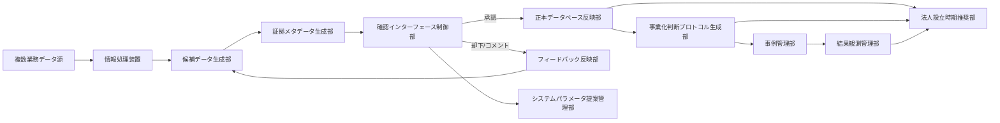
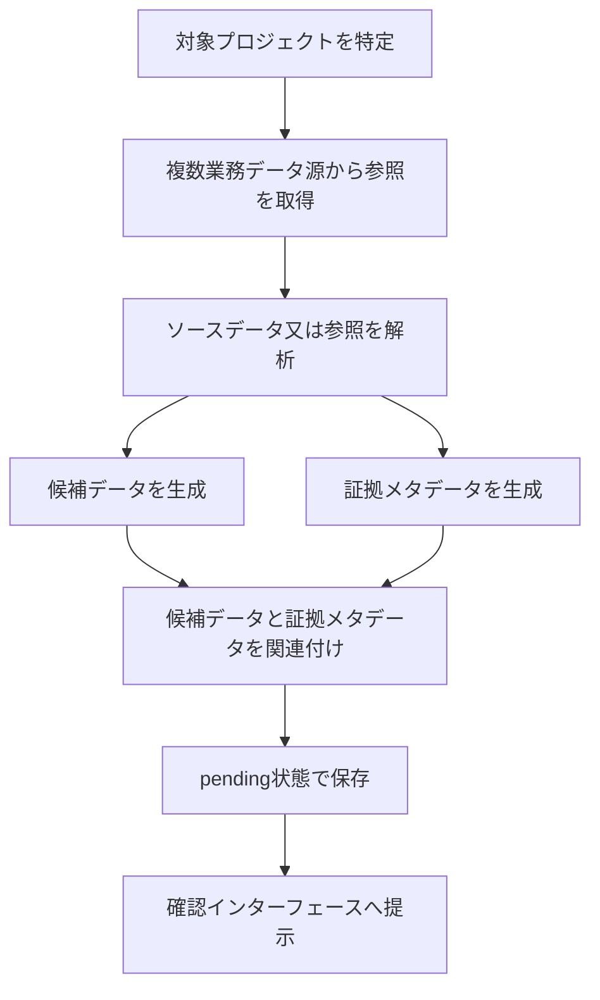
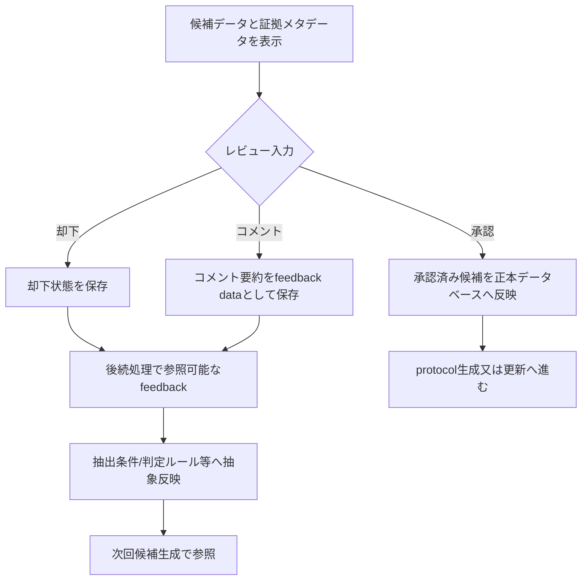
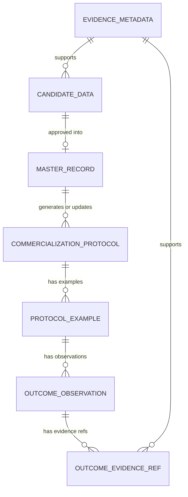
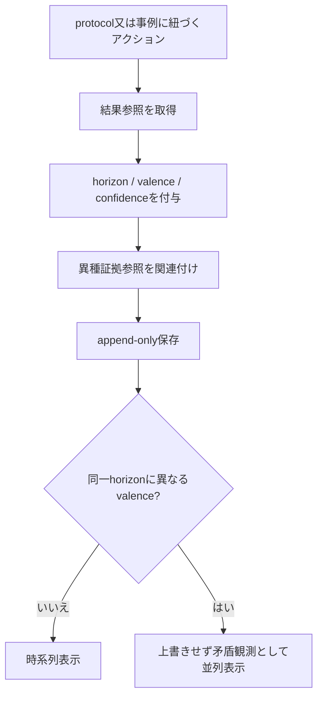
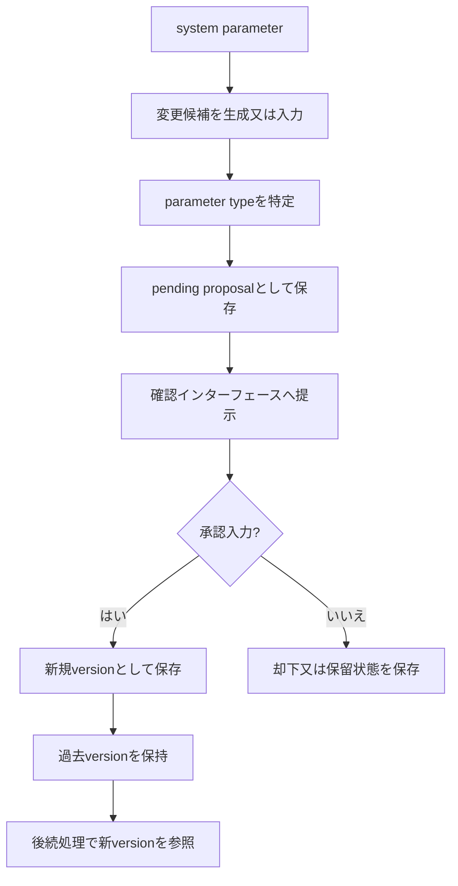
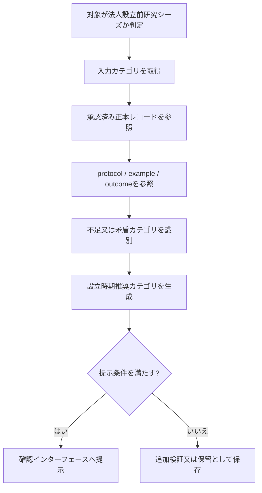
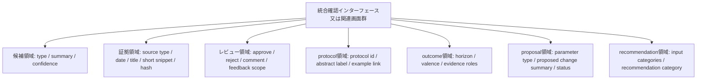

# AMD OS / AMDプロトコル Fig.1-Fig.8 図面清書指示メモ（内部版）

- 作成日: 2026-06-01
- 位置づけ: 特許出願書類たたき台に含まれる Fig.1-Fig.8 を、弁理士又は図面作成者が特許図面へ清書するための内部ブリーフ。
- 共有制限: 外部送付禁止。弁理士へもこのファイル自体は送らない。相談時に使う場合は、必要箇所だけ削除版を別途作る。
- 対象資料: `docs/ip/2026-06-01_patent_application_draft_internal.md` の図面案、請求項1-16、抽象データ構造、疑似処理フロー。

## 0. 作図方針

Fig.1-Fig.8 は、実画面スクリーンショット、実DB構造、実source所在、実案件ログを図面化しない。

図面は、以下のような抽象表現に寄せる。

- 抽象ブロック図
- 処理フロー図
- 抽象データ構造図
- UI概念図
- 関連画面群の表示態様例

図面番号は、明細書中の構成要素番号へ後で置換できる粒度にする。清書時は、各図の主要要素に `100`, `110` のような番号を振れるよう、箱を増やしすぎず、関係線を読みやすく保つ。

## 1. 全図共通の安全線

### 図に入れてよい情報

- 複数業務データ源、ソース参照、短い抜粋、hash、抽出処理識別子、信頼度などの抽象的な証拠メタデータ。
- 候補データ、人間承認、却下、コメント、feedback data、承認済み正本反映。
- 抽象protocol、プロジェクト固有事例、結果観測、評価期間カテゴリ、評価極性カテゴリ、矛盾観測表示。
- system parameter、pending proposal、approved version、past versionなどの抽象概念。
- 法人設立前研究シーズ、入力カテゴリ、設立時期推奨カテゴリ、不足又は矛盾カテゴリ。
- 「確認インターフェース」又は「関連画面群」という抽象UI。

### 図に入れない情報

- 実データ本文、実メール、議事録、Slack本文、クラウド文書本文、月次レポート本文。
- production DB row、実テーブルの生構造、実source permalink、内部source id、長いsnippet。
- prompt全文、few-shot、negative examples、comment-to-guidance変換ロジック。
- score weight、threshold、calibration、イベント加点、正解ラベル、教師データ。
- 実PJ名、顧客名、研究機関名、個人名、契約条件、価格、商談ログ、未公開知財詳細。
- connector認証、権限、監視、復旧、watch path、運用PC、抽出スケジュール細部。
- 実画面スクショ、実URL、admin-only導線の具体名。

## 2. WS対応の前提

| WS | 図面上の扱い | 現OS乖離チェックを踏まえた描き方 |
|---|---|---|
| WS-1 | 複数業務データ源 -> 候補生成 -> 証拠メタデータ | 現OS裏付けは強い。全文非保存は「正本DBへ全文を保存しない」「所定長以下の抜粋又はメタデータ」と抽象化する |
| WS-2 | 確認インターフェース、人間承認、却下、コメント、feedback | 現OS裏付けは強いが画面は分散。図では「確認インターフェース又は関連画面群」とする |
| WS-3 | 承認済み候補から抽象protocol生成 | 現OS裏付けは強い。固有名詞除去・抽象化を中心に描き、具体promptは描かない |
| WS-4 | protocol 1:N example、multi-horizon outcome、矛盾観測 | table/設計裏付けはあるがUIと複数evidence参照は部分実装。抽象実施例として描き、現OS retrofit候補と明記する |
| WS-5 | system parameter pending proposal -> approval -> version | 現OSはscore-specific寄りで汎用化は部分実装。抽象実施例として描き、基幹出願に残すか分割候補か弁理士確認 |
| WS-6 | Before-Zero / 法人設立時期推奨 | 専用table/route/UIは未実装寄り。従属項・補強の抽象実施例として描き、現OS retrofit候補とする |

## 3. Fig.1 全体構成例

| 項目 | 指示 |
|---|---|
| 図の目的 | 本発明の情報処理装置又はシステムが、複数業務データ源から候補生成、証拠メタデータ付与、人間確認、正本反映、feedback、protocol、outcome、parameter governance、設立時期推奨までを閉ループとして扱う全体像を示す |
| 対応WS | WS-1, WS-2, WS-3, WS-4, WS-5, WS-6 |
| 対応請求項 | 請求項1-16全体。特に請求項1, 2, 4, 5, 6, 8, 11, 13, 14, 15, 16 |
| 対応明細書箇所 | 【課題を解決するための手段】、【発明を実施するための形態】1-12、14.1-14.8、15 |
| 入れる構成要素 | 情報処理装置、プロセッサ、メモリ、ストレージ、通信インターフェース、表示制御部、複数業務データ源、データ取得部、候補データ生成部、証拠メタデータ生成部、確認インターフェース制御部、正本データベース反映部、フィードバック反映部、事業化判断プロトコル生成部、事例管理部、結果観測管理部、システムパラメータ提案管理部、法人設立時期推奨部 |
| 入れない情報 | 実connector名、実URL、実DB row、実source所在、prompt全文、score条件、実PJ名、管理画面スクショ |
| 図面作成時の注意 | 最初の図なので、請求項15の装置クレームを支えるためにハードウェア/機能部の両方を出す。各機能部は単一サーバでも分散システムでもよいように、物理配置を限定しない。WS-5/WS-6は現OSではpartial/not-found要素を含むため、実装済み画面の写しではなく抽象機能部として描く |

清書イメージ:

## 4. Fig.2 候補データ生成及び証拠メタデータ付与

| 項目 | 指示 |
|---|---|
| 図の目的 | 複数業務データ源からソースデータ又は参照を取得し、候補データと証拠メタデータを関連付けて確認インターフェースへ渡す流れを示す |
| 対応WS | WS-1 |
| 対応請求項 | 請求項1, 2, 3, 10, 15, 16 |
| 対応明細書箇所 | 実施形態2-4、13の `candidate_data` / `evidence_metadata`、14.1、14.2、15 |
| 入れる構成要素 | 対象プロジェクト特定、複数業務データ源、ソース参照取得、候補データ生成、証拠メタデータ生成、候補と証拠の関連付け、pending状態、確認インターフェース |
| 入れられる証拠メタデータ例 | source type、source identifier、source locatorの抽象表現、source date、title、所定長以下のsnippet、hash value、extraction run identifier、confidence |
| 入れない情報 | 実source permalink、実source id、全文、長い抜粋、実抽出ログ、connector認証情報、watch path |
| 図面作成時の注意 | 「全文非保存」は図中で強調しすぎると狭くなる可能性があるため、「元データ全文を正本DBへ保存せず、証拠メタデータを生成」と表現する。5生データの具体名を出す場合も、実サービス画面や実アカウントを連想させない一般名にする |

清書イメージ:

## 5. Fig.3 人間承認、却下、コメント、正本反映

| 項目 | 指示 |
|---|---|
| 図の目的 | 候補データが人間の承認を経て正本データベースへ反映され、却下又はコメントが後続処理のfeedbackとして保存・参照される閉ループを示す |
| 対応WS | WS-2、WS-3の入口 |
| 対応請求項 | 請求項1, 3, 4, 5, 6, 14, 15, 16 |
| 対応明細書箇所 | 実施形態5-8、13の `review_feedback` / `master_record`、14.3、14.4、15 |
| 入れる構成要素 | pending候補表示、証拠メタデータ表示、入力種別判定、承認、却下、コメント、正本反映、feedback data保存、後続候補生成処理で参照、protocol生成又は更新 |
| 入れない情報 | 実レビュー担当者名、実コメント全文、comment-to-guidance変換ロジック、prompt全文、few-shot、実DB row |
| 図面作成時の注意 | 「未承認候補は正本DBへ行かない」分岐を明確に描く。コメントは本文そのものではなく `comment summary` や `feedback data` として描く。feedbackの反映先は「抽出条件 / 判定ルール / 設定値 / ワークフロー定義等」とし、prompt注入だけに限定しない |

清書イメージ:

## 6. Fig.4 事業化判断プロトコルデータ及びプロジェクト固有事例のデータ構造例

| 項目 | 指示 |
|---|---|
| 図の目的 | 承認済み正本レコードから抽象protocolを生成し、1つのprotocolに複数のプロジェクト固有事例、結果観測、証拠参照がぶら下がる抽象データ構造を示す |
| 対応WS | WS-3, WS-4 |
| 対応請求項 | 請求項1, 6, 7, 8, 10, 15, 16 |
| 対応明細書箇所 | 実施形態8-10、13の `master_record` / `commercialization_protocol` / `protocol_example` / `outcome_observation` / `outcome_evidence_ref`、14.5、14.6、15 |
| 入れる構成要素 | 承認済み正本レコード、抽象protocol、protocol identifier、branch point、decision criteria、action pattern、result category、プロジェクト固有事例、source evidence identifier、outcome observation、evidence reference |
| 入れない情報 | 実protocol本文、実PJ事例本文、実meeting id、実title hash固定、実source所在、実個人名、実判断材料の詳細 |
| 図面作成時の注意 | `source_meeting_id` など実装名に寄せない。清書では「source evidence identifier」に広げる。1:N構造を強調し、複数プロジェクト固有事例が同一又は類似protocolに紐づく構図にする。結果観測と証拠参照はFig.5にも出すため、Fig.4では関係性を簡潔に置く |

清書イメージ:

## 7. Fig.5 結果観測データのappend-only保存及び矛盾観測提示

| 項目 | 指示 |
|---|---|
| 図の目的 | protocol又は事例に紐づくアクション後の結果を、評価期間カテゴリと評価極性カテゴリを持つ結果観測としてappend-only保存し、矛盾する観測を上書きせず提示する態様を示す |
| 対応WS | WS-4 |
| 対応請求項 | 請求項8, 9, 10, 14, 15, 16 |
| 対応明細書箇所 | 実施形態10、13の `outcome_observation` / `outcome_evidence_ref`、14.6、15 |
| 入れる構成要素 | action後の結果候補、horizon、valence、confidence、summary、evidence refs、append-only保存、同一horizon異valence判定、時系列表示、矛盾観測の並列表示 |
| 入れない情報 | 実KPI raw row、成功/失敗教師ラベル、個別案件の長期解釈、実outcome本文、実source所在、実DB row |
| 図面作成時の注意 | 現OSではoutcome UIと複数異種evidence参照がpartialなので、実装済み画面ではなく抽象実施例として描く。FHIR/OMOP等の一般的な観測データとの差別化のため、医療データ風ではなく「事業化判断protocol / project-specific example に紐づく結果観測」として描く |

清書イメージ:

## 8. Fig.6 システムパラメータ変更候補のpending proposal及びversion昇格

| 項目 | 指示 |
|---|---|
| 図の目的 | prompt、rule、config、model、workflow等の複数種類のsystem parameterについて、変更候補をpending proposalとして保存し、人間承認時のみ新versionへ昇格する処理を示す |
| 対応WS | WS-5 |
| 対応請求項 | 請求項11, 12, 14, 15, 16 |
| 対応明細書箇所 | 実施形態11、13の `system_parameter` / `parameter_proposal` / `parameter_version`、14.7、15 |
| 入れる構成要素 | system parameter、parameter type、変更候補生成、pending proposal、確認インターフェース、承認、却下又は保留、新規version保存、過去version保持、後続処理での新version参照 |
| 入れない情報 | prompt全文、model選定、temperature、chunking、retrieval条件、score weight、threshold、calibration、実設定値、実承認者名 |
| 図面作成時の注意 | 現OSはscore-specificのproposal設計が先行し、汎用system parameter governanceはpartial。図面は「現OSの実画面」ではなく抽象実施例として描く。`parameter type` は抽象カテゴリだけにし、具体設定値は空欄にしないでそもそも描かない |

清書イメージ:

## 9. Fig.7 法人設立前研究シーズに対する法人設立時期推奨

| 項目 | 指示 |
|---|---|
| 図の目的 | 法人設立前研究シーズについて、承認済み候補、protocol、example、outcome、review feedback、approved parameter version等を参照し、設立時期推奨カテゴリを生成する抽象処理を示す |
| 対応WS | WS-6 |
| 対応請求項 | 請求項13, 14, 15, 16 |
| 対応明細書箇所 | 実施形態12、13の `incorporation_timing_recommendation`、14.8、15 |
| 入れる構成要素 | 法人設立前研究シーズ判定、入力カテゴリ取得、承認済み正本レコード参照、protocol参照、outcome参照、不足又は矛盾カテゴリ識別、推奨カテゴリ生成、必要に応じた確認インターフェース提示 |
| 入力カテゴリ例 | 研究シーズ段階、検証進捗、知的財産関連状態、外部連携又は顧客候補状態、チーム又は関係者状態、資金又は制度対応状態、結果観測カテゴリ |
| 入れない情報 | 実判定条件、実weight、threshold、calibration、具体予定月、資金計画、CEO候補、顧客名、案件別判断 |
| 図面作成時の注意 | 現OSでは専用機能がnot-found寄りのため、従属項・補強の抽象実施例として描く。主軸に見えすぎないよう、Fig.1の末端機能又はFig.7単独の補助処理として扱う。推奨結果は「即時設立 / 一定期間後 / 追加検証後 / 保留」などのカテゴリに留める |

清書イメージ:

## 10. Fig.8 統合確認インターフェースの表示態様例

| 項目 | 指示 |
|---|---|
| 図の目的 | 候補、証拠、レビュー、protocol、outcome、proposalを、同一画面又は関連画面群で意思決定者が確認できる表示態様を示す |
| 対応WS | WS-2, WS-3, WS-4, WS-5, WS-6 |
| 対応請求項 | 請求項1, 3, 4, 5, 8, 9, 10, 11, 12, 13, 14, 15, 16 |
| 対応明細書箇所 | 実施形態5、10、11、12、15、請求項14 |
| 入れる構成要素 | 統合確認インターフェース、候補領域、証拠領域、レビュー領域、protocol領域、outcome領域、proposal領域、設立時期推奨領域又は関連表示、承認/却下/コメント入力 |
| 入れない情報 | 実画面スクリーンショット、実URL、実サービス名、実案件情報、長いsnippet、実コメント全文、score詳細、admin-only運用導線 |
| 図面作成時の注意 | 現OSでは単一の統合画面ではなく分散実装。図では「同一画面又は関連画面群」「少なくとも一部を表示」とする。UI限定で請求項が狭くなりすぎないよう、表示項目は抽象ラベルに留め、操作ボタンの実デザインは描かない |

清書イメージ:

## 11. 図面番号と請求項対応まとめ

| Figure | 主目的 | 主WS | 主請求項 | 現OSとの扱い |
|---|---|---|---|---|
| Fig.1 | 全体システム構成 | WS-1〜WS-6 | 1-16 | 全体抽象図。WS-5/6は抽象実施例として描く |
| Fig.2 | 候補生成 + evidence metadata | WS-1 | 1, 2, 3, 10, 15, 16 | 実装裏付け強。全文非保存は正本DB非保存へ抽象化 |
| Fig.3 | HITL承認 / reject / comment / feedback | WS-2 | 1, 3, 4, 5, 6, 14, 15, 16 | 実装裏付け強。関連画面群として描く |
| Fig.4 | protocol / example / outcomeデータ構造 | WS-3, WS-4 | 1, 6, 7, 8, 10, 15, 16 | protocolは強、outcome関係は抽象実施例 + retrofit候補 |
| Fig.5 | append-only outcome + 矛盾観測表示 | WS-4 | 8, 9, 10, 14, 15, 16 | partial。現OS retrofit候補として描く |
| Fig.6 | system parameter proposal/version governance | WS-5 | 11, 12, 14, 15, 16 | partial。汎用governanceは抽象実施例、分割候補論点 |
| Fig.7 | Before-Zero設立時期推奨 | WS-6 | 13, 14, 15, 16 | not-found/手動運用寄り。従属項・補強の抽象実施例 |
| Fig.8 | 統合確認UI表示態様 | WS-2〜WS-6 | 1, 3-5, 8-14, 15, 16 | 分散実装。単一画面に限定せず関連画面群として描く |

## 12. 図面作成者への短い指示文案

特許図面として清書する場合は、以下の指示にする。

1. 実画面スクリーンショットではなく、抽象的なブロック図・フローチャート・データ構造図・UI概念図として作図する。
2. 各図の構成要素へ番号を振れるよう、機能部、データ、処理、分岐、保存先、表示領域を分ける。
3. 実サービス名、実DB名、実URL、実案件名、実データ、実prompt、score重み、threshold、calibrationは入れない。
4. Fig.1は装置クレームも支えられるよう、情報処理装置、プロセッサ、メモリ、ストレージ、通信インターフェース、表示制御部、機能部を含める。
5. Fig.2-Fig.3は請求項1-5を支えるため、候補生成、証拠メタデータ、HITL、approved-only反映、reject/comment feedbackを明確にする。
6. Fig.4-Fig.5は請求項6-10を支えるため、protocol 1:N example、multi-horizon outcome、append-only、矛盾観測、異種evidence参照を抽象的に示す。
7. Fig.6は請求項11-12を支えるため、複数種類のsystem parameterに共通のpending proposal -> approval -> version処理を示す。
8. Fig.7は請求項13を支えるため、法人設立前研究シーズ、入力カテゴリ、不足又は矛盾カテゴリ、設立時期推奨カテゴリを示す。
9. Fig.8は請求項14を支えるため、候補、証拠、レビュー、protocol、outcome、proposal、recommendationの少なくとも一部を表示する関連画面群として描く。

## 13. 残論点

- 請求項1にprotocol生成まで入れるか、HITL + feedbackまでを主軸にしてprotocol生成を従属項へ下げるか。
- Fig.5のoutcome ledger / 矛盾観測UI / 複数evidence参照を、出願前に現OSへ最小retrofitするか。
- Fig.6の汎用system parameter governanceを基幹出願に含めるか、分割候補にするか。
- Fig.7のBefore-Zero設立時期推奨を従属項・補強に留めるか、独立請求項も検討するか。
- Fig.8を単一統合画面として描くか、関連画面群として描くか。現OS実態との整合を優先するなら関連画面群が安全。
