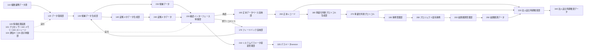
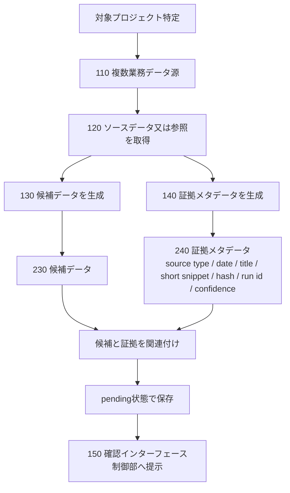
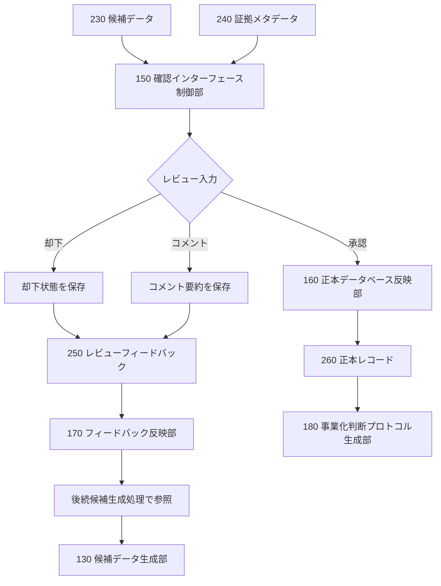
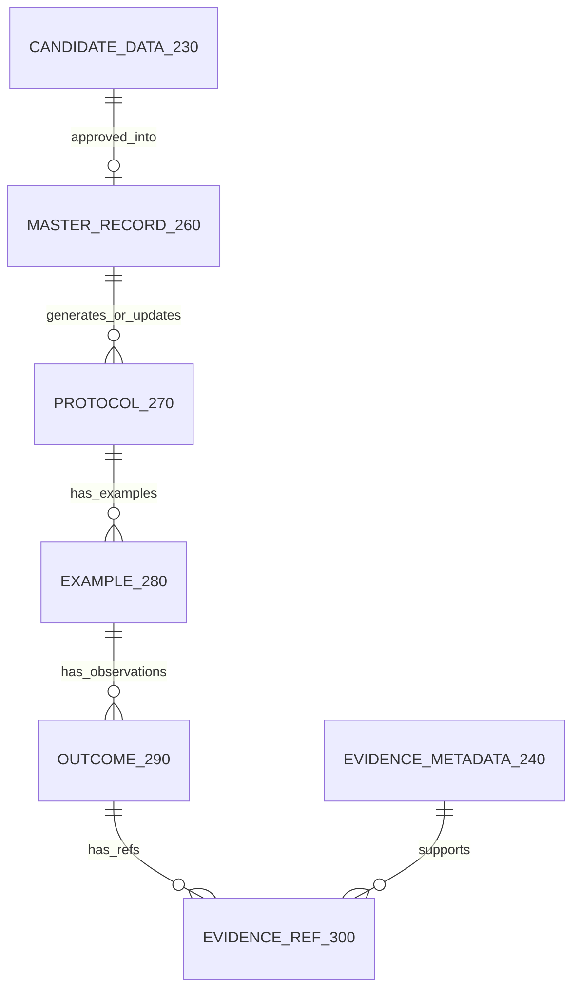
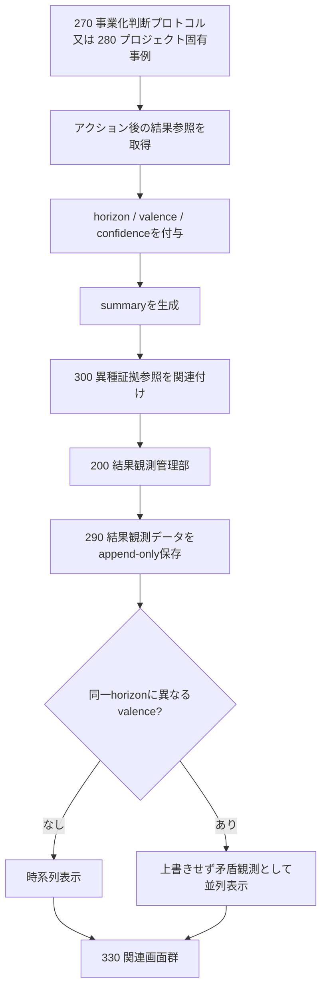
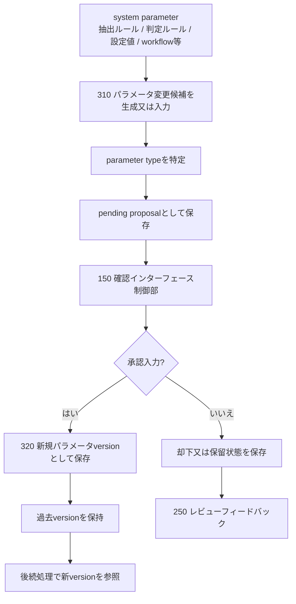
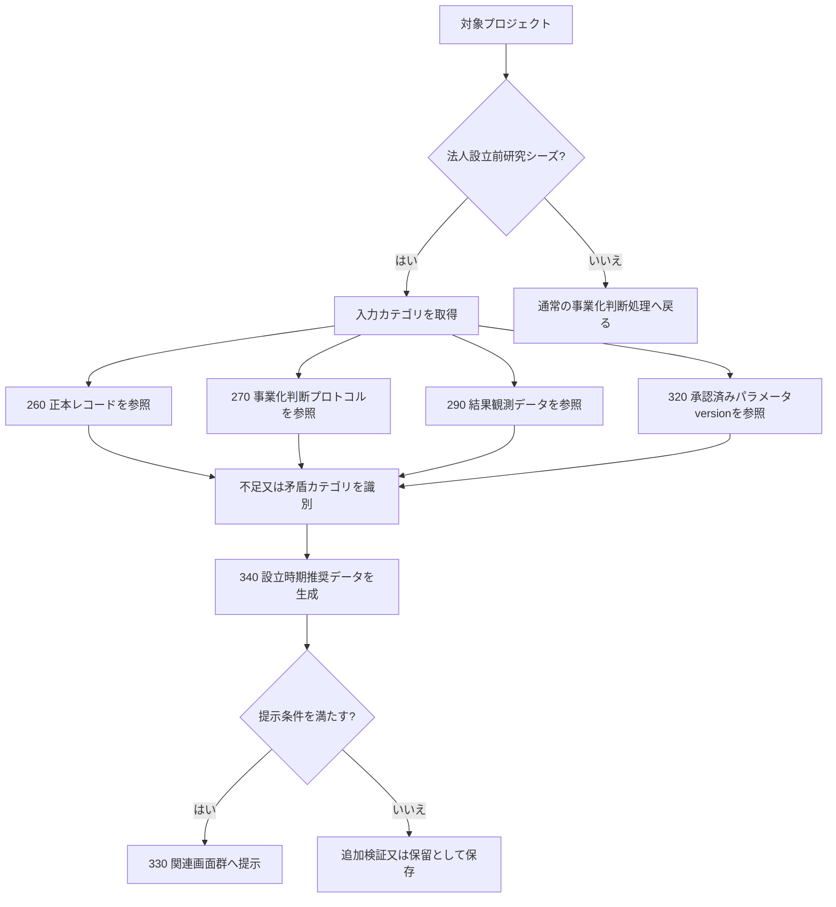
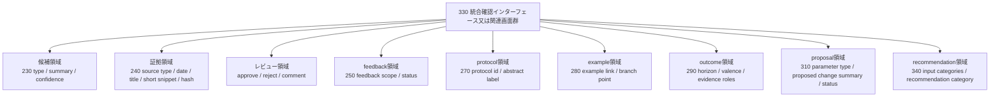

# Fig.1-Fig.8 白黒線画ドラフト（内部提出図面候補）

- 作成日: 2026-06-02
- 位置づけ: まさ / 特許出願司令塔が確認するための提出図面候補ドラフト。実提出版ではない。
- 重要: 外部送付禁止。JPO提出禁止。弁理士問い合わせ禁止。
- 作成方針: 画像生成ではなく、白黒線画化を前提とした Mermaid / 参照符号付き図面案として作成する。
- 記載制限: 実案件名、顧客名、個人名、契約条件、未公開知財詳細、prompt全文、score weight / threshold / calibration、実DB行、source permalink、実画面スクリーンショット、実URL、実サービス名、実connector名は入れない。

## 0. 公式形式メモ

JPO「図面: 特許」では、図面は原則として黒色で鮮明に記録し、着色しないこと、符号はアラビア数字を用いること、オンライン手続では図表 / 線図等をモノクロ2値の画像として扱うことが示されている。

特許庁「公報に関して: よくあるご質問」では、図面作成時に線を濃く描き、不要な余白を削除し、白黒2値化したデータを提出することが、意図しない縮小や精度劣化を避けるうえで有用とされている。

本ファイルは提出画像ではなく、正式画像化前の構造ドラフトである。正式化時は、各図を黒色線画、均一線、十分な余白管理、読み取り可能な参照符号付き画像へ変換する。

## 1. 全図共通の参照符号

| 符号 | 名称 |
|---|---|
| 100 | 情報処理装置 |
| 101 | プロセッサ |
| 102 | メモリ |
| 103 | ストレージ |
| 104 | 通信インターフェース |
| 105 | 表示制御部 |
| 110 | 複数業務データ源 |
| 120 | データ取得部 |
| 130 | 候補データ生成部 |
| 140 | 証拠メタデータ生成部 |
| 150 | 確認インターフェース制御部 |
| 160 | 正本データベース反映部 |
| 170 | フィードバック反映部 |
| 180 | 事業化判断プロトコル生成部 |
| 190 | 事例管理部 |
| 200 | 結果観測管理部 |
| 210 | システムパラメータ提案管理部 |
| 220 | 法人設立時期推奨部 |
| 230 | 候補データ |
| 240 | 証拠メタデータ |
| 250 | レビューフィードバック |
| 260 | 正本レコード |
| 270 | 事業化判断プロトコル |
| 280 | プロジェクト固有事例 |
| 290 | 結果観測データ |
| 300 | 異種証拠参照 |
| 310 | パラメータ変更候補 |
| 320 | パラメータversion |
| 330 | 統合確認インターフェース又は関連画面群 |
| 340 | 法人設立時期推奨データ |

## 2. Fig.1 全体システム構成

| 項目 | 内容 |
|---|---|
| タイトル | Fig.1 全体システム構成 |
| 目的 | 複数業務データ源から、候補生成、証拠メタデータ付与、人間確認、approved-only正本反映、feedback、protocol、outcome、parameter governance、法人設立時期推奨までの全体構成を示す。 |
| 対応請求項 | 請求項1-16。特に請求項1, 5, 6, 8, 10, 11, 13, 15, 16。 |
| 対応明細書段落 | 【0020】図1、【0021】-【0023】、【0041】-【0043】、【0045】。 |

### 図面ドラフト

### 構成要素と矢印関係

- 110 -> 120 -> 130: 業務データ源から対象プロジェクトに関する参照を取得し候補を生成する。
- 130 -> 140: 候補生成と並行して証拠メタデータを生成する。
- 230 / 240 -> 150: 候補と証拠を確認インターフェースへ提示する。
- 150 -> 160: 承認済み候補のみ正本へ反映する。
- 150 -> 170 -> 130: 却下又はコメントを後続候補生成へ反映する。
- 260 -> 270 -> 280 -> 290: 正本からprotocol、事例、結果観測へ連鎖する。
- 150 -> 210 -> 320: パラメータ変更候補を承認時のみversion化する。
- 260 / 270 / 290 -> 220 -> 340: 法人設立前研究シーズに対する推奨データを生成する。

### 入れる情報 / 入れない情報

- 入れる: 100-340の抽象構成要素、approved-only正本反映、feedback loop、protocol / outcome / parameter / recommendationの補助機能。
- 入れない: 実connector名、実DB名、実URL、実source所在、prompt全文、score条件、実案件名、実UI。

## 3. Fig.2 候補生成及び証拠メタデータ付与

| 項目 | 内容 |
|---|---|
| タイトル | Fig.2 候補データ生成及び証拠メタデータ付与処理 |
| 目的 | 複数業務データ源から取得した参照に基づき、候補データと証拠メタデータを関連付け、pending状態で確認へ渡す流れを示す。 |
| 対応請求項 | 請求項1, 2, 3, 9, 15, 16。 |
| 対応明細書段落 | 【0020】図2、【0024】-【0025】、【0039】-【0040】、【0045】。 |

### 図面ドラフト

### 構成要素と矢印関係

- 対象プロジェクト特定 -> 110 -> 120: 複数種類の業務データ源からソースデータ又は参照を取得する。
- 120 -> 130 / 140: 同一参照から候補データと証拠メタデータを生成する。
- 230 / 240 -> pending: 候補と証拠を関連付け、承認前状態として保存する。
- pending -> 150: 確認インターフェースへ提示する。

### 入れる情報 / 入れない情報

- 入れる: source type、source identifierの抽象表現、date、title、short snippet、hash、run id、confidence。
- 入れない: source permalink、全文、長い抜粋、実source id、connector認証、watch path、実抽出ログ。

## 4. Fig.3 人間承認、却下、コメント、正本反映

| 項目 | 内容 |
|---|---|
| タイトル | Fig.3 人間承認、却下、コメント、及び正本反映処理 |
| 目的 | 候補データが人間承認を経て正本へ反映され、却下又はコメントが後続処理へfeedbackとして戻る閉ループを示す。 |
| 対応請求項 | 請求項1, 3, 4, 5, 10, 15, 16。 |
| 対応明細書段落 | 【0020】図3、【0026】-【0028】、【0039】-【0041】、【0045】。 |

### 図面ドラフト

### 構成要素と矢印関係

- 230 / 240 -> 150: 候補と証拠を人間が確認できるように表示する。
- 150 -> 承認 -> 160 -> 260: 承認済み候補だけが正本化される。
- 150 -> 却下 / コメント -> 250 -> 170 -> 130: レビュー結果を後続候補生成で参照する。
- 260 -> 180: 正本化された候補がprotocol生成又は更新へ進む。

### 入れる情報 / 入れない情報

- 入れる: 承認、却下、コメント、comment summary、feedback data、approved-only正本反映。
- 入れない: 実レビュー担当者名、実コメント全文、comment-to-guidance具体ロジック、prompt全文、few-shot、実DB row。

## 5. Fig.4 Protocol / project-specific example / evidence関係

| 項目 | 内容 |
|---|---|
| タイトル | Fig.4 事業化判断プロトコルデータ及びプロジェクト固有事例のデータ構造 |
| 目的 | 承認済み正本レコードから抽象protocolを生成し、1つのprotocolに複数のプロジェクト固有事例、結果観測、証拠参照がぶら下がる構造を示す。 |
| 対応請求項 | 請求項5, 6, 7, 9, 10, 15, 16。 |
| 対応明細書段落 | 【0020】図4、【0029】-【0030】、【0033】、【0039】、【0041】-【0042】、【0045】。 |

### 図面ドラフト

### 構成要素と矢印関係

- 260 -> 270: 承認済み正本レコードから抽象protocolを生成又は更新する。
- 270 -> 280: 1つのprotocolに複数のプロジェクト固有事例を関連付ける。
- 280 -> 290: 事例に紐づくアクション後の結果観測を保持する。
- 290 -> 300、240 -> 300: 結果観測へ異種証拠参照を関連付ける。
- 230 -> 260: 承認済み候補だけが正本レコードとなる。

### 入れる情報 / 入れない情報

- 入れる: protocol identifier、branch point、decision criteria、action pattern、result category、source evidence identifier。
- 入れない: 実protocol本文、実PJ事例本文、実meeting id、実title hash固定、実source所在、実個人名。

## 6. Fig.5 Outcome ledger / 矛盾観測提示

| 項目 | 内容 |
|---|---|
| タイトル | Fig.5 結果観測データのappend-only保存及び矛盾観測提示 |
| 目的 | protocol又は事例に紐づく結果観測をappend-only保存し、同一horizonで異なるvalenceを上書きせず並列提示する態様を示す。 |
| 対応請求項 | 請求項6, 8, 9, 10, 15, 16。 |
| 対応明細書段落 | 【0020】図5、【0031】-【0033】、【0039】、【0042】、【0045】。 |

### 図面ドラフト

### 構成要素と矢印関係

- 270 / 280 -> 結果参照: protocol又は事例単位でアクション後の結果を取得する。
- 結果参照 -> 290: horizon、valence、confidence、summary、evidence refsを持つ観測として保存する。
- 290 -> 分岐: 同一horizonで異なるvalenceがあるかを判定する。
- 分岐 -> 330: 通常時系列又は矛盾観測の並列表示として提示する。

### 入れる情報 / 入れない情報

- 入れる: horizon、valence、confidence、summary、evidence roles、append-only、矛盾観測並列表示。
- 入れない: 実KPI row、成功 / 失敗教師ラベル、実outcome本文、実source所在、実DB row。

## 7. Fig.6 System parameter governance

| 項目 | 内容 |
|---|---|
| タイトル | Fig.6 システムパラメータ変更候補のpending proposal及びversion昇格処理 |
| 目的 | 複数種類のsystem parameterについて、変更候補をpending proposalとして保存し、人間承認時のみnew versionへ昇格する処理を示す。 |
| 対応請求項 | 請求項11, 12, 10, 15, 16。 |
| 対応明細書段落 | 【0020】図6、【0034】-【0035】、【0039】、【0043】、【0045】。 |

### 図面ドラフト

### 構成要素と矢印関係

- system parameter -> 310: 抽象カテゴリのパラメータ変更候補を生成又は入力する。
- 310 -> pending -> 150: 変更候補を確認インターフェースへ提示する。
- 150 -> 320: 承認入力を受けた場合だけ新規versionとして保存する。
- 150 -> 250: 却下又は保留はfeedbackとして保持する。
- 320 -> 後続処理: 後続候補生成又は判定処理で承認済みversionを参照する。

### 入れる情報 / 入れない情報

- 入れる: parameter type、pending proposal、承認、却下、保留、新規version、過去version。
- 入れない: prompt全文、model選定、temperature、chunking、retrieval条件、score weight、threshold、calibration、実設定値。

## 8. Fig.7 Before-Zero / 法人設立時期推奨

| 項目 | 内容 |
|---|---|
| タイトル | Fig.7 法人設立前研究シーズに対する法人設立時期推奨処理 |
| 目的 | 法人設立前研究シーズについて、承認済み正本、protocol、outcome等を参照し、設立時期推奨カテゴリを生成する補助処理を示す。 |
| 対応請求項 | 請求項13, 14, 10, 15, 16。 |
| 対応明細書段落 | 【0020】図7、【0036】-【0037】、【0039】、【0045】。 |

### 図面ドラフト

### 構成要素と矢印関係

- 対象プロジェクト -> 判定: 法人設立前研究シーズかを判定する。
- 入力カテゴリ -> 260 / 270 / 290 / 320: 承認済み情報を参照する。
- 参照情報 -> 不足又は矛盾カテゴリ -> 340: 推奨データを生成する。
- 340 -> 330: 提示条件を満たす場合、確認インターフェース又は関連画面群へ提示する。

### 入れる情報 / 入れない情報

- 入れる: 研究シーズ段階、検証進捗、知的財産関連状態、外部連携又は顧客候補状態、チーム又は関係者状態、資金又は制度対応状態、結果観測カテゴリ、推奨カテゴリ。
- 入れない: 実weight、threshold、calibration、具体予定月、資金計画、CEO候補、顧客名、案件別判断。

## 9. Fig.8 統合確認UI / 外部検出可能態様

| 項目 | 内容 |
|---|---|
| タイトル | Fig.8 統合確認インターフェース又は関連画面群の表示態様 |
| 目的 | 候補、証拠、レビュー、protocol、outcome、proposal、recommendationの少なくとも一部を、意思決定者が確認できる表示態様として示す。 |
| 対応請求項 | 請求項1, 3, 4, 5, 8, 9, 10, 11, 12, 13, 14, 15, 16。 |
| 対応明細書段落 | 【0020】図8、【0026】、【0032】、【0035】、【0038】-【0039】、【0045】。 |

### 図面ドラフト

### 構成要素と矢印関係

- 330 -> 230 / 240: 候補と証拠を同一又は関連画面群に表示する。
- 330 -> review / 250: 承認、却下、コメント、feedback scopeを表示又は入力する。
- 330 -> 270 / 280 / 290: protocol、事例、結果観測を確認できるようにする。
- 330 -> 310 / 340: parameter proposal又は設立時期推奨を確認できるようにする。

### 入れる情報 / 入れない情報

- 入れる: 抽象ラベル、領域、状態、短いメタデータ、承認 / 却下 / コメント入力。
- 入れない: 実画面スクリーンショット、実URL、実サービス名、実案件情報、long snippet、score詳細、admin-only導線名、実UIデザイン。

## 10. 正式画像化TODO

1. Mermaidをそのまま提出せず、黒色線のみの線画画像へ清書する。
2. 各図の箱、矢印、分岐、保存先、表示領域に参照符号を明瞭に付ける。
3. 同一構成要素には全図で同一符号を使い、符号の重複又は未使用を点検する。
4. 図中テキストは短くし、説明は明細書本文へ寄せる。
5. 図面余白、線の濃さ、文字サイズ、矢印方向、分岐ラベルを、白黒2値化後も読めるように調整する。
6. 実サービス名、実案件名、実source、prompt、score、DB、個人情報が入っていないか再scanする。
7. Fig.6 / Fig.7を今回出願の従属項に残すか分割候補に下げるかの判断後、必要なら図面番号又は図中の強調度を調整する。

## 11. まさ判断事項（5個以内）

1. Fig.6 system parameter governanceを今回出願の図面として残すか、分割候補用の図面として下げるか。
2. Fig.7 Before-Zero / 法人設立時期推奨を今回出願の図面として残すか、分割候補用の図面として下げるか。
3. Fig.8を「同一画面」寄りで描くか、「関連画面群」寄りで描くか。現OS実態との整合は関連画面群が安全。
4. Fig.4 / Fig.5のoutcome ledgerを、提出前に現OSへ最小retrofitしてから出すか、抽象実施例として出すか。
5. 正式画像化を内部で継続するか、直前レビュー時だけ図面作成者に清書依頼するか。

## 12. 営業秘密scan結果

- 実案件名: 記載なし。
- 顧客名 / 個人名: 記載なし。
- 契約条件 / 価格 / 商談ログ: 記載なし。
- prompt全文 / few-shot / comment-to-guidance具体ロジック: 記載なし。
- score weight / threshold / calibration: 記載なし。
- production DB row / 実source permalink / 実URL / 実サービス名 / 実connector名: 記載なし。
- 実画面スクリーンショット / 実UI: 記載なし。
- 未公開知財詳細: 抽象カテゴリと処理関係に限定。

## 13. Readiness結論

Fig.1-Fig.8は、清書指示から一段進み、提出図面候補ドラフトとして内部レビュー可能な水準になった。正式提出には未達であり、提出前には黒色線画画像化、参照符号視認性、白黒2値化後の読解性、図面番号と明細書 / 請求項の最終整合、営業秘密scanの再実施が必要である。
