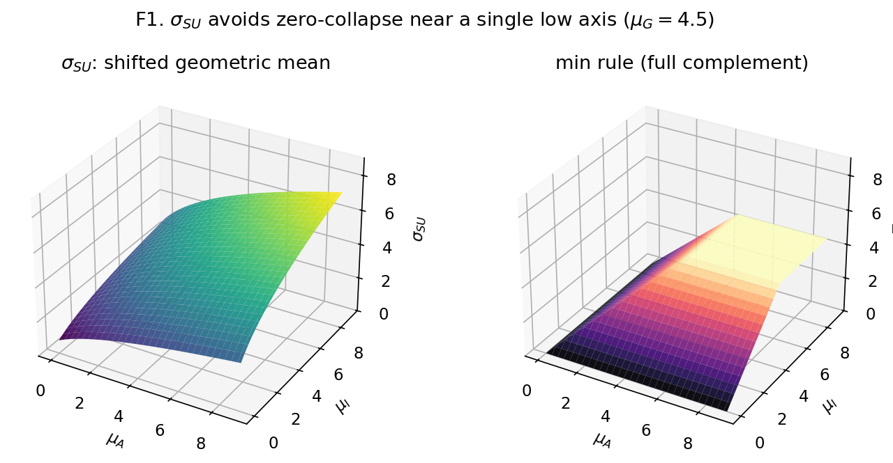
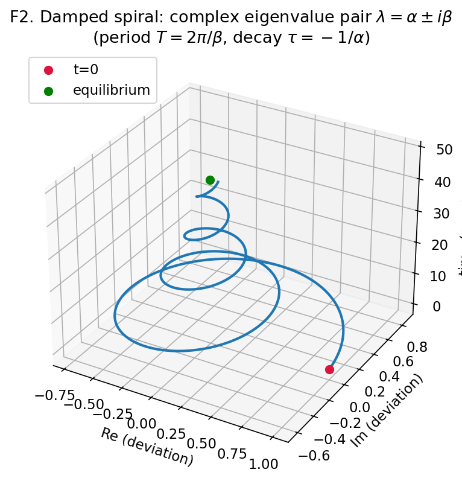
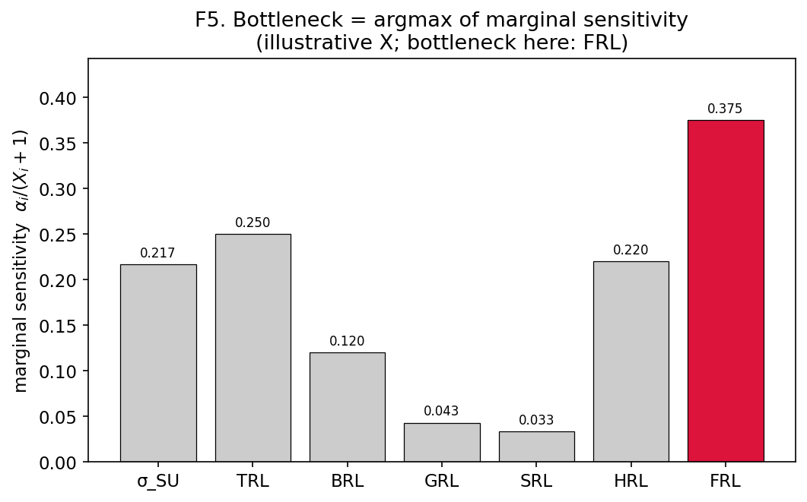
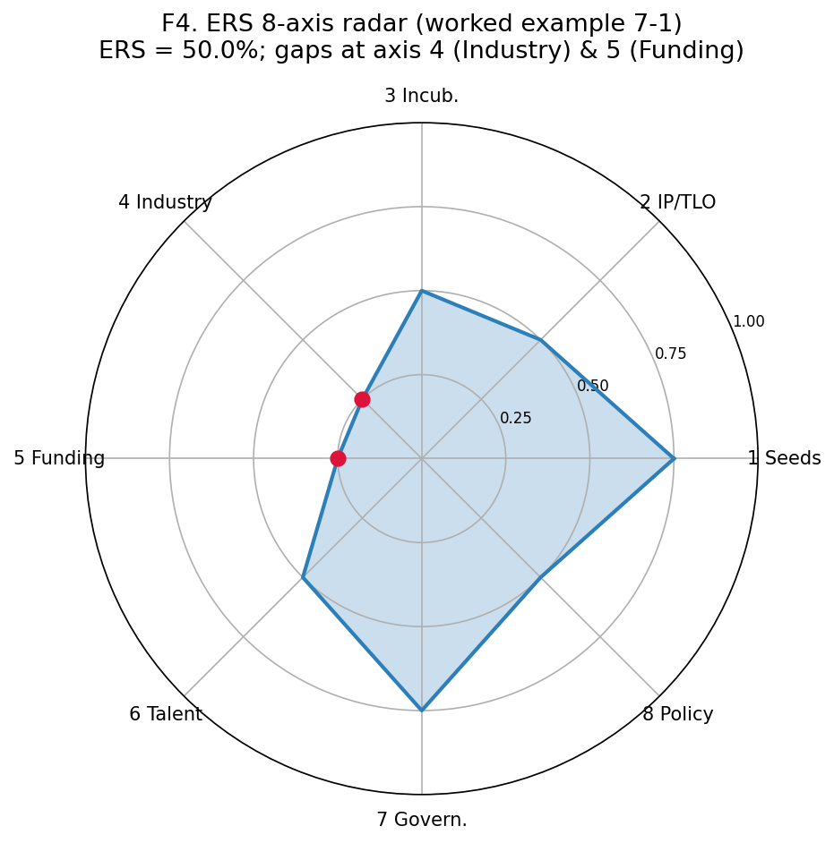
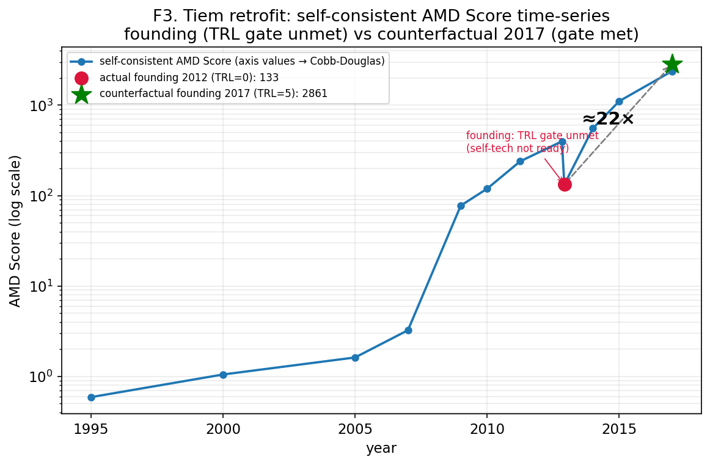

# Before Zero Model：法人設立前ベンチャーの成熟度を測る7軸統合スコアと苗床レイヤーの提案

**著者**：（まさ ほか、所属：株式会社AMD）
**投稿先想定**：日本ベンチャー学会（JASVE）／日本語／IMRaD
**ドラフト状態**：初稿（2026-05-30 起稿）。骨子は `design/bzm_paper.md` §2、教科書正本は `pwa/bzm/*.md`、モデル定義正本は `pwa/design/amd_score.md` / `institution_readiness.md`。

> ⚠️ 本ファイルは論文本文の起稿ドラフト。数式・重み・rubric の値に揺れが出たら、本ドラフトではなく上記正本を直し、教科書・本ドラフトを同じ更新で揃える。

---

## 要旨

ベンチャー評価の主流である企業価値評価（Valuation）は、キャッシュフローや既存事業の存在を前提とするため、法人設立・事業開始という「ゼロ」より前の段階——本稿が *Before Zero* と呼ぶ局面——の準備度を測ることができない。しかしディープテックや大学発ベンチャーでは、設立前の数年間における技術成熟・制度整備・創業者の質こそが、その後の成否を大きく規定する。本稿は、設立前ベンチャーの成熟度を定量化する枠組みとして **Before Zero Model（BZM）** を提案する。BZMは、(1) マクロ環境の追い風を表す σ_SU（Triple Helix に基づく学・産・官モメンタムのシフト幾何平均）、(2) 技術・事業・規制・社会・人材の5つの Readiness Level（XRL群）、(3) 創業者リーダーシップを独立軸として測る FRL の計7軸を、Cobb-Douglas 型関数で統合した **AMD Score** を中核とする。あわせて、ベンチャーを生み育てる「苗床」＝研究機関の整備度を、欠損が掛け算で消えない加重和（充足率）で測る **ERS（Ecosystem Readiness Score）** を導入し、個体レイヤー（AMD Score）と苗床レイヤー（ERS）を計算式上は分離する二層構造を設計する。結果が既知の過去9プロジェクトへの遡及適用（retrofit）により、モデルの判定が現実と整合するかを検証し、「マクロ環境は揃っていたが自社技術の成熟度（TRL）が閾値未達で立ち上げが早すぎた」事例を定量的に説明できることを示す。

**キーワード**：設立前ベンチャー評価、Technology Readiness Level、Triple Helix、創業者リーダーシップ、Cobb-Douglas、大学発ベンチャー、エコシステム整備度

---

## 1. はじめに

### 1.1 背景

近年、大学・研究機関発のディープテックベンチャーが政策的にも実務的にも注目を集めている。これらのベンチャーは、ソフトウェア中心のスタートアップと異なり、技術の成熟（研究室レベルから量産可能なレベルへ）、知財の権利化、規制対応、社会受容の獲得といった、設立前から長い準備期間を要する。すなわち、価値創出のかなりの部分が「法人設立・事業開始」という時点（本稿でいう「ゼロ」）の **前** に蓄積される。

ところが、ベンチャー評価の実務と研究の多くは、設立後を前提とした企業価値評価（Valuation）に集中してきた。DCF（割引キャッシュフロー）法は将来キャッシュフローを、マルチプル法は既存事業の指標を必要とし、いずれも「事業がまだ無い」設立前の局面には適用できない。設立前の評価は、ピッチの巧拙や評価者の主観に大きく依存し、再現可能な定量的枠組みを欠いてきた。

### 1.2 問題設定

本稿が解こうとする問題は、**「ゼロより前（Before Zero）の準備度を、再現可能な形で定量化できるか」** である。ここで「ゼロ」とは法人設立・事業開始の時点を指す。Before Zero の評価には、少なくとも次の3つの困難がある。

1. **多軸性**：技術だけでも、事業だけでも、創業者だけでも足りない。複数の異質な軸を一つの尺度に統合する必要がある。
2. **マクロ依存性**：同じシーズでも、学・産・官の追い風（政策予算、産業の関心、研究の蓄積）が揃う時期に立ち上げるかどうかで成否が変わる。「5年早い／遅い」が決定的になる。
3. **苗床依存性**：ベンチャーは無から生まれない。それを生み育てる研究機関の整備度（TLO、ギャップファンド、客員起業家制度など）が、事業化のスピードを左右する。

### 1.3 本研究の貢献

本稿の貢献は次の4点である。

- **(a)** 設立前ベンチャーの成熟度を、マクロ1軸・個体5軸・創業者1軸の計7軸で統合する **AMD Score** を定義する。完全代替（加重和）と完全補完（min）の中間の性質を持つ Cobb-Douglas 型関数を採用し、「全軸が揃わないと IPO に届かない」という個体の宿命をモデル化する。
- **(b)** 創業者リーダーシップを、組織の人材軸（HRL）とは別の **独立軸 FRL** として立てる。CEO個人の質が設立前ベンチャーの成否に与える影響の大きさを反映し、Authentic Leadership・Grit・Resilience で操作化する。
- **(c)** ベンチャー個体（AMD Score）と苗床＝研究機関（ERS）を **二層構造** で分離し、両者を σ_SU 経由の因果でつなぎつつ計算式には足し込まない設計を示す（二重計上の回避）。
- **(d)** 結果が既知の過去プロジェクトにモデルを遡及適用する **retrofit** を、設立前評価モデルの妥当性検証手法として提示する。

### 1.4 本稿の構成

第2章で先行研究を整理し、第3章で BZM のモデル（σ_SU・XRL・FRL・AMD Score・ERS）を定義する。第4章で9プロジェクトへの retrofit による検証を報告し、第5章で含意と限界を論じ、第6章で結論を述べる。

---

## 2. 先行研究

### 2.1 Readiness Level 系

技術成熟度を段階的に測る Technology Readiness Level（TRL）は、NASA が宇宙技術の成熟度評価のために導入した9段階尺度に起源を持つ（Mankins 1995）。その後、事業・規制・社会・人材などへの拡張が各所で試みられ、欧州委員会の Horizon Europe では社会受容度を測る Societal Readiness Level（SRL）が9段階で定義されている。日本でも、内閣府SIPの公募要領（2023年度、サーキュラーエコノミー領域）が TRL/BRL/GRL/SRL/HRL の9段階定義を一次資料として提示している。BZM の XRL群（第3.2節）は、これら既存の Readiness Level 群を設立前評価のために整理・統合したものである。

### 2.2 Triple Helix

学・産・官の三者が役割を引き受け合いながら共進化するという Triple Helix モデルは、Etzkowitz & Leydesdorff（1995, 2000）によって提唱された。BZM のマクロ軸 σ_SU（第3.1節）は、この三分解を理論的根拠として、学術モメンタム μ_A・産業モメンタム μ_I・政府モメンタム μ_G の合成によりマクロ環境の追い風を定量化する。

### 2.3 創業者・リーダーシップ

創業者の質と資金調達・成果の関係は、複数の実証研究で示されてきた。経験豊富な創業者ほど組織資本を蓄積しベンチャーキャピタル資金を獲得しやすいこと（Hsu 2007）、初期段階の投資家誘致においてチームの提示の仕方が因果的に効くこと（Bernstein, Korteweg & Laws 2017）が報告されている。創業者リーダーシップの質を測る尺度としては、Authentic Leadership の理論と測定尺度（Avolio & Gardner 2005；Walumbwa et al. 2008）、長期目標への粘りを測る Grit（Duckworth et al. 2007）、失敗からの回復力を測る Resilience（Markman, Baron & Balkin 2005）がある。BZM の FRL（第3.3節）は、これらを組み合わせて創業者軸を操作化する。

### 2.4 統合関数

異質な複数の生産要素を一つの産出に統合する関数として、Cobb-Douglas 型生産関数（Cobb & Douglas 1928）は、完全代替（加重和）と完全補完（Leontief, min）の中間の代替弾力性を持つことで知られる。BZM の AMD Score（第3.4節）は、各軸の相対重要度を弾力性パラメータ α で表現できるこの性質を、設立前ベンチャーの多軸統合に応用する。

### 2.5 時系列推定

マクロ環境の隠れ状態を観測量から推定する枠組みとして、ベクトル自己回帰（VAR；Sims 1980）と、その少標本での識別性を事前分布で補う Bayesian VAR（Minnesota prior：Litterman 1986；Panel VAR：Canova & Ciccarelli 2013）、多数の予測子から主成分で因子を抽出する手法（Stock & Watson 2002）がある。BZM のマクロ推定（第3.1節・付録A）は、σ_SU を構成する μ_A/μ_I/μ_G を状態空間モデルで推定する際にこれらを援用する。

### 2.6 本研究の位置づけ

上記のように、Readiness Level・Triple Helix・創業者リーダーシップ・統合関数・時系列推定の各分野には豊富な蓄積がある。しかし、これらを **設立前（Before Zero）ベンチャーの成熟度評価という一つの目的のために統合** し、さらに **個体と苗床を二層で分離** した枠組みは、筆者らの知る限り提案されていない。本稿の新規性はこの統合と二層設計にある。

---

## 3. モデル

BZM は、マクロ環境（σ_SU）・個体5軸（XRL群）・創業者軸（FRL）を統合する個体レイヤー（AMD Score）と、それを生む苗床レイヤー（ERS）からなる。本章で各構成要素を定義する。記号は付録Bにまとめる。

### 3.1 マクロ環境 σ_SU と Triple Helix

マクロ環境の追い風 σ_SU は、Triple Helix の三モメンタム——学術 μ_A、産業 μ_I、政府 μ_G（いずれも0–9）——のシフト幾何平均で定義する。

$$\sigma_{SU} = \bigl((\mu_A+1)(\mu_I+1)(\mu_G+1)\bigr)^{1/3} - 1$$

各軸を +1 してから幾何平均を取り、最後に −1 で戻す（シフト方式）。これにより、ある一軸がゼロ近傍（例：政策がまだ動いていないシーズ察知段階）でも全体がゼロに張り付かず、追い風の立ち上がりを捉えられる。これは min 律（完全補完）が一軸ゼロで全体をゼロにしてしまう硬さを避けるための設計である（図1）。

**図1.** μ_G=4.5 に固定したときの σ_SU（左、シフト幾何平均）と min 律（右、完全補完）。min 律は一軸が低いだけで全体が押し下げられるのに対し、σ_SU は他軸の追い風を残す。

各モメンタム μ_x は、直接観測できない隠れ状態であり、7種の観測量 ỹ_p（政策密度・公募予算・VC投資・言及/PR・研究費・論文・競合密度を16四半期レンジで0–9正規化したもの）を、C行列の負荷量 c_{xp} で加重平均して構成する。

$$\mu_x = \frac{\sum_p c_{xp}\,\tilde{y}_p}{\sum_p c_{xp}}$$

時間発展は状態空間モデルで書く。状態ベクトル $\mathbf{x}_t=(\mu_A,\mu_I,\mu_G)^\top$、観測ベクトル $\mathbf{y}_t$、外生入力 $\mathbf{u}_t$（海外政策・災害・地政学ショック）として、

$$\mathbf{x}_{t+1}=\mathbf{A}\mathbf{x}_t+\mathbf{B}\mathbf{u}_t+\boldsymbol\epsilon_t,\qquad \mathbf{y}_t=\mathbf{C}\mathbf{x}_t+\mathbf{D}\mathbf{u}_t+\boldsymbol\eta_t$$

状態遷移行列 $\mathbf{A}$ の固有値分解で複素固有値ペア $\lambda=\alpha\pm i\beta$ が現れると、軌道が減衰螺旋を描く（図2）。これが Triple Helix の「螺旋」を数学的に正当化する（詳細は付録A）。少標本での識別性は Minnesota prior（Litterman 1986）と階層 prior（Canova & Ciccarelli 2013）で補う。

**図2.** 状態遷移行列の複素固有値ペアが生む減衰螺旋。周期 $T=2\pi/\beta$ で回りながら時定数 $\tau=-1/\alpha$ で均衡へ収束する。Triple Helix の「螺旋」が状態空間モデルの固有モードとして現れることを示す。

立ち上げの可否判定は、マクロ側の閾値 θ_σ と自社技術のTRLゲート $g_{TRL}(t)\in\{0,1\}$ の積で表す。

$$\mathrm{GO}(t)=\mathbb{1}[\sigma_{SU}(t)\ge\theta_\sigma]\cdot g_{TRL}(t)$$

マクロが揃っていても TRL ゲートが未達なら GO は出ない。この構造が、第4章で扱う「早すぎた」事例の説明の鍵となる。

### 3.2 個体軸 XRL群

個体ベンチャーの成熟度を、5つの Readiness Level（XRL群）で測る。いずれも0–9。

| 軸 | 名称 | 内容 |
|---|---|---|
| TRL | Technology Readiness Level | 技術成熟度 |
| BRL | Business Readiness Level | 事業モデル成熟度 |
| GRL | Governance Readiness Level | 規制・ガバナンス成熟度 |
| SRL | Social Readiness Level | 社会受容成熟度 |
| HRL | Human Resources Readiness Level | 人材・組織成熟度 |

定義の一次資料は NASA（Mankins 1995）、EU Horizon の SRL、内閣府SIP公募要領（2023）に拠る。なお、深い技術障壁を持たない事業形態（Shallow Tech）では TRL 軸を計算から除外し、残り軸とスケール再校正で評価する（第3.4節）。

### 3.3 創業者軸 FRL

設立前ベンチャーでは、組織としての人材（HRL）が薄い段階で、CEO個人の質が成否を大きく左右する。そこで創業者リーダーシップを HRL とは別の独立軸 FRL（Founder Readiness Level、0–9）として立てる。FRL は、Authentic Leadership Questionnaire（ALQ）の4次元平均、Grit、Resilience の加重和で構成する。

$$FRL = 0.6\cdot\mathrm{ALQ}_{avg} + 0.2\cdot\mathrm{Grit} + 0.2\cdot\mathrm{Resilience}$$

ALQ は自己認識・関係透明性・均衡的処理・内在化された道徳観の4次元（Walumbwa et al. 2008）、Grit は長期目標への粘り（Duckworth et al. 2007）、Resilience は失敗からの回復力（Markman et al. 2005）に基づく。後述のとおり FRL は AMD Score で最大の重み（α_{FRL}=1.5）を与える。

### 3.4 統合関数 AMD Score

7軸 $\{\sigma_{SU}, TRL, BRL, GRL, SRL, HRL, FRL\}$ を、各軸を +1 シフトした上で Cobb-Douglas 型に統合する。

$$S = K\cdot\!\!\prod_{X}\!(X_i+1)^{\alpha_X},\qquad K=\frac{100{,}000}{10^{\sum\alpha_i}}$$

シフト（X+1）により、ある軸がゼロ（例：TRL=0 のシーズ察知段階）でも全体がゼロに落ちず、他軸の情報が反映される。スケール定数 K は、全軸が最大のとき AMD Score が IPO 級の 100,000 になるよう校正する。base case では弾力性の合計 $\sum\alpha=6.0$ より $K=0.1$。

弾力性（重み）α は各軸の相対重要度を表す。base case は、創業者と立ち上げタイミングを重視して次のように置く。

$$\alpha_{FRL}=1.5,\ \alpha_{\sigma}=1.3,\ \alpha_{HRL}=1.1,\ \alpha_{TRL}=1.0,\ \alpha_{BRL}=0.6,\ \alpha_{GRL}=0.3,\ \alpha_{SRL}=0.2\quad(\textstyle\sum=6.0)$$

UI上は、AMD Score を Macro・XRL積・Founder の3要素に分解して提示する。

$$S=k\cdot M\cdot X\cdot F,\quad M=(\sigma_{SU}+1)^{\alpha_\sigma},\ X=\!\!\prod_{x\in\{TRL,..,HRL\}}\!\!(x+1)^{\alpha_x},\ F=(FRL+1)^{\alpha_F}$$

Cobb-Douglas を採用する理由は、加重和（完全代替：一軸の欠損を他軸で補える）と min（完全補完：一軸の欠損で全体が決まる）の中間の代替弾力性を持つためである。設立前ベンチャーは「全軸が揃わないと IPO に届かない」が「一軸ゼロで即死でもない」という中間的性質を持ち、Cobb-Douglas がこれに合致する。

**律速軸**：次に手当てすべき軸は、限界感度が最大の軸として求める。$\partial S/\partial X_i = \alpha_i S/(X_i+1)$ より、

$$\mathrm{bottleneck}(t)=\arg\max_i\frac{\alpha_i}{X_i(t)+1}$$

重要度（α）と伸びしろ（$1/(X+1)$）の積が最大の軸が、1段階上げたときスコアを最も増やす。これが経営アクションの優先順位を与える（図3）。

**図3.** ある時点の軸別限界感度 $\alpha_i/(X_i+1)$（軸値 X は説明用）。最大の軸（この例では FRL）が律速軸であり、「次に手当てすべき軸」を示す。

### 3.5 苗床レイヤー ERS

ベンチャーを生み育てる研究機関の整備度を ERS（Ecosystem Readiness Score）で測る。AMD Score が乗法（欠損が全体を消す）であるのに対し、ERS の目的は **何が欠けているか（支援ギャップ）を見せる** ことなので、欠損が掛け算で消えない加重和（充足率）を採る。

構造は2階層：8つの capability 軸 × サブ軸 × Lv1–5。各サブ軸の到達レベル lv を $s=(\mathrm{lv}-1)/4$ で0–1に正規化し、軸内で平均、軸間で加重平均する。

$$A_k=\mathrm{mean}(\text{軸 }k\text{ のサブ軸 }s),\qquad \mathrm{ERS}=100\cdot\sum_k w_k A_k,\quad \sum_k w_k=1$$

軸スコア $A_k$ をサブ軸の平均で取ることで、サブ軸数の偏りが軸間の重みを歪めない。重み $w_k$ は当面 等加重（$1/8$）とし、精度向上に応じて軸レベルで調整する。8軸は AMD Score の軸と供給側で概念対応する（軸2 知財/TLO→TRL、軸5 資金→FRL、軸8 政策→μ_G など）。全8軸 × サブ軸の rubric は付録C に示す。図4 は8軸レーダーの例である。

**図4.** ある機関の ERS 8軸レーダー（充足率 0–1）。乗法（AMD Score）と違い加重和なので、低い軸（この例では軸4 産学連携・軸5 資金）が潰れずに「支援ギャップ」として残る。これがそのまま次の支援メニューになる。

**二層構造（重要）**：ERS（苗床）と AMD Score（個体）は、現実には「機関の整備が進む→そこ発のベンチャーの μ_I/μ_G が上がる→σ_SU が上がる→AMD Score が上がる」という因果でつながる。しかし、この連動を計算式に直接持ち込まない。機関の整備度は σ_SU を通じて **すでに** AMD Score に効いているため、ERS を AMD Score の式に足すと **二重計上** になる。連動は概念的・データ上の因果にとどめ、二つのスコアは別ロジック（乗法 vs 加重和）で保つ。

---

## 4. 検証 — 9プロジェクトへの retrofit

### 4.1 方法

設立前評価モデルは、新規プロジェクトの結果を待っていては検証に長い時間を要する。そこで、**結果がすでに分かっている過去プロジェクトにモデルを遡及適用し、判定が現実と整合するかを確かめる retrofit** を採る。AMDのスタジオ運営実務に基づく9プロジェクト（ティエムファクトリ、輝翠TECH、CrestecBio、LiSTie、JOYCLE、BWE、Yellow Duck、CryoX、SolvioraX）について、各時点の7軸評価を付与し AMD Score を算出した。

### 4.2 ティエムの時系列 — 「5年早かった」の定量化

代表事例として、ティエムファクトリの時系列を取り上げる。同社は、マクロ環境（σ_SU）の追い風は早期から立ち上がっていた一方、自社内製の技術成熟度（TRL）がゲート閾値（運用候補4–5）に達するまで時間を要した。表1 に主要時点の7軸評価と AMD Score を示す。

**表1. ティエムファクトリの retrofit 時系列（主要時点）**

| 年 | イベント | σ_SU | TRL | BRL | GRL | SRL | HRL | FRL | AMD Score |
|---|---|--:|--:|--:|--:|--:|--:|--:|--:|
| 2007 | 中西 PMSQ 発明（Adv. Mater.） | 4 | 1 | 0 | 3 | 3 | 0 | 0 | 3 |
| 2009 | 論文急成長期 | 5 | 1 | 1 | 4 | 4 | 1 | 2 | 27 |
| 2011-03 | 東日本大震災（省エネ大義） | 6 | 2 | 1 | 5 | 5 | 1 | 3 | 78 |
| **2012-11** | **ティエム設立** | 7 | **0** | 1 | 5 | 5 | 1 | 4 | **133** |
| 2014 | NEDO SUI 採択期 | 7 | 1 | 2 | 6 | 5 | 2 | 4 | 300 |
| 2017 | シリーズB（TRL 進捗） | 6 | 4 | 3 | 5 | 5 | 3 | 5 | 2,400 |
| **（仮想）2017 設立** | **この時点で立ち上げていれば** | 6 | **5** | 3 | 5 | 5 | 3 | 5 | **3,100** |

実際の設立時点（2012-11, AMD Score=133）と、TRL がゲートを越えて条件が揃った仮想設立時点（2017, 3,100）との間には **約23倍** の差がある。設立時に TRL=0 だった——マクロは追い風でも自社技術の成熟度が立ち上がっていなかった——ことが、この差の主因である。これは第3.1節の GO 判定 $\mathrm{GO}(t)=\mathbb{1}[\sigma_{SU}\ge\theta_\sigma]\cdot g_{TRL}(t)$ ——マクロが揃っても TRL ゲート未達なら GO が出ない——の構造を、定量的に裏づける。

> なお表1の AMD Score 列は、各時点の専門家評価による期待値であり、同じ行の軸値を統合関数 $S=K\prod(X_i+1)^{\alpha_i}$ に代入した一方向計算の結果と必ずしも一致しない（第5.4節 限界1）。本稿は再現可能性の観点からこの点を秘さず、軸評価の客観化（第5.5節）による自己整合的な再計算を今後の課題とする。

参考として、表1の各時点の軸値を統合関数に**自己整合的に代入**して再計算した AMD Score の時系列を図5に示す。

**図5.** ティエムの各時点の軸評価を統合関数 $S=K\prod(X_i+1)^{\alpha_i}$ に代入して自己整合に再計算した AMD Score の時系列（対数スケール）。設立2012-11（TRL=0 でゲート未達, $S\approx133$）と仮想2017設立（TRL=5, $S\approx2{,}861$）の差は **約22倍**で、表1の期待値ベースの約23倍とほぼ一致する。すなわち本稿の定性的結論——「5年早かった」の倍率、TRL ゲート未達、σ_SU の追い風寄与——は score の構成法（期待値か自己整合再計算か）に依らず頑健である。設立時に score がいったん凹む（2012-10 の $\approx399$ → 設立 $\approx133$）のは、設立時点で TRL を実測0に評価し直したことを反映し、自社技術がまだ立ち上がっていない状態を示す。

### 4.3 他プロジェクトの試算

残るプロジェクトについても同様に各時点の軸評価から AMD Score を試算し、判定（GO/見送り、律速軸の指摘）が実際の経過と整合するかを確認した。（個別の数値表は本文付表または別紙に整理する。）

---

## 5. 考察

### 5.1 含意

BZM は、設立前の GO/NO 判定に再現可能な根拠を与える。とくに律速軸の特定（$\arg\max_i \alpha_i/(X_i+1)$）は、「次にどの軸へ資源を投じるべきか」という経営判断に直結する。ティエムの事例が示すように、マクロの追い風だけで立ち上げを急ぐのではなく、TRL ゲートとの両立で GO を判断する枠組みは、ディープテックの「早すぎる立ち上げ」による消耗を避ける指針となる。

### 5.2 二層構造を分ける設計判断

ERS を AMD Score の式に足さないという設計は、一見すると「整備された機関発の PJ は AMD Score が高く出るのだから、機関整備度を直接加点すべき」という直観に反する。しかし、機関整備度は σ_SU（μ_I/μ_G）を通じて **すでに** AMD Score に反映されており、ERS を足せば二重計上になる。乗法（個体）と加重和（苗床）という設計思想の異なる二つを混ぜないことが、各レイヤーの解釈可能性を保つ。

### 5.3 実装含意

BZM は AMD OS というソフトウェアに実装され、重みスライダーによる α の調整、それに伴う K の自動再校正、律速軸の可視化として日々の経営判断に供される。理論を運用に落とす際は、軸評価をできるだけ生データ（運用ログ）から客観的に抽出することが、評価の主観依存を減らす鍵となる。

### 5.4 限界

本稿の検証と運用には、以下の限界がある。これらは今後の課題でもある。

1. **retrofit の後ろ向き性**：retrofit の軸評価は、結果を知った後の専門家事前情報に依存する。確証バイアスを排除しきれず、第4章の AMD Score は「専門家の期待値」と「軸値からの一方向計算」が一致しない行を含む。本稿はこの点を秘さず、表値が期待値であることを明示する運用を採る。
2. **重みと校正の暫定性**：弾力性 α と校正 K は base case の暫定値であり、データ駆動の推定はこれからである。
3. **マクロ推定の少標本性**：σ_SU の状態空間推定は少標本であり、識別性を prior で補っている。推定の不確実性は大きい。
4. **外部妥当性**：検証サンプルが AMD 関与プロジェクトに偏る。一般化には外部事例での再現が必要。

### 5.5 反証可能性と今後

今後は、(a) 新規プロジェクトでの前向き検証、(b) OS 運用ログからの軸評価の客観化（主観依存の低減）、(c) 重み α のデータ駆動推定、(d) 軸値からの自己整合的な再計算への移行、に取り組む。とくに(b)(d)は、第4章の「期待値と計算値の乖離」を解消し、モデルの再現可能性を高める。

---

## 6. 結論

本稿は、企業価値評価が扱えない「ゼロより前」の設立前ベンチャーの成熟度を測る枠組みとして Before Zero Model を提案した。マクロ環境 σ_SU・個体5軸（XRL群）・創業者軸 FRL を Cobb-Douglas で統合する AMD Score と、苗床＝研究機関の整備度を加重和で測る ERS を、計算式上は分離する二層構造として設計した。9プロジェクトへの retrofit により、「マクロは揃っていたが TRL ゲート未達で早すぎた」事例を約23倍のスコア差として定量的に説明できることを示した。本モデルは設立前の GO/NO 判定と律速軸の特定に再現可能な根拠を与える。今後は前向き検証と重みのデータ駆動推定により、再現可能性と外部妥当性を高める。

---

## 謝辞

（記載予定）

## 付録A 状態空間モデルの定式化

本文第3.1節の σ_SU を構成する三モメンタム μ_A/μ_I/μ_G は直接観測できない隠れ状態であり、状態空間モデルで推定する。本付録はその定式化を要約する（理論詳細は `before-zero/theory/state_space_model.md`、prior 設計は同 `bvar_prior.md` を正本とする）。

### A.1 離散時間状態空間表現

状態ベクトル $\mathbf{x}_t=(\mu_A,\mu_I,\mu_G)^\top$、観測ベクトル $\mathbf{y}_t$（政策密度 P・公募予算 B・VC投資 V・言及/PR R・研究費 $I_R$・論文 N・競合密度 C の7観測量）、外生入力 $\mathbf{u}_t$（海外政策・災害・地政学ショック）として、

$$\mathbf{x}_{t+1}=\mathbf{A}\mathbf{x}_t+\mathbf{B}\mathbf{u}_t+\boldsymbol\epsilon_t,\quad \boldsymbol\epsilon_t\sim\mathcal{N}(\mathbf{0},\mathbf{Q})$$
$$\mathbf{y}_t=\mathbf{C}\mathbf{x}_t+\mathbf{D}\mathbf{u}_t+\boldsymbol\eta_t,\quad \boldsymbol\eta_t\sim\mathcal{N}(\mathbf{0},\mathbf{R})$$

$\mathbf{A}$ は状態遷移行列（三螺旋の内部ダイナミクス）、$\mathbf{C}$ は観測負荷行列（本文 §3.1 の $c_{xp}$ に対応）、$\mathbf{Q},\mathbf{R}$ はそれぞれ内生ショックと測定誤差の共分散である。隠れ状態 $\mathbf{x}_t$ は Kalman フィルタ／スムーザにより観測列 $\{\mathbf{y}_t\}$ から逐次推定する。実装ではラグ次数 $p=4$（四半期データで1年）の VAR 形を採り、状態次元を $3\times4=12$ に拡張して複数の固有モードを同時に表現する。

### A.2 固有値分解と減衰螺旋（Triple Helix の数学的正当化）

状態遷移行列を固有値分解する。

$$\mathbf{A}=\mathbf{V}\boldsymbol\Lambda\mathbf{V}^{-1},\qquad \boldsymbol\Lambda=\mathrm{diag}(\lambda_1,\dots,\lambda_n)$$

$\mathbf{A}$ の非対角成分が非対称のとき複素固有値ペア $\lambda=\alpha\pm i\beta$ が現れ、$|\lambda|<1$ なら軌道は回転しながら均衡へ収束する——すなわち**減衰螺旋**を描く（本文 図2）。連続時間に戻すと、この固有モードの振動周期と減衰時定数が直接読める。

$$T=\frac{2\pi}{\beta},\qquad \tau=-\frac{1}{\alpha}$$

Etzkowitz & Leydesdorff（1995, 2000）の Triple Helix における「螺旋的共進化」の比喩は、ここで状態空間モデルの複素固有モードとして厳密に対応づけられる。すなわち本モデルでは、螺旋は文学的修辞ではなく、推定された $\mathbf{A}$ の固有構造から導かれる定量的帰結である。$|\lambda|=1$ なら持続振動（単位根・非定常）、$|\lambda|>1$ なら発散に対応し、固有値の絶対値がマクロ環境の安定性を判定する。

### A.3 少標本での識別性（prior 設計）

検証対象が AMD 関与の少数プロジェクトに限られるため、状態空間パラメータの識別は事前分布で補う。

- **Minnesota prior**（Litterman 1986）：VAR 係数に経済理論的な収縮を入れる。自己ラグ1期の係数事前平均を1（ランダムウォーク仮説）、自己ラグ2期以降と交差ラグの事前平均を0に置き、ラグ次数 $k$ が大きいほど強く収縮させる（分散 $\propto \lambda_1^2/k^2$）。overall tightness $\lambda_1$（base case 0.2）と cross-equation tightness $\lambda_2<1$ で収縮の強さを制御する。
- **階層 prior**（Canova & Ciccarelli 2013）：複数プロジェクトをプールし、プロジェクト→レーン→グローバルの3レベル階層でパラメータを部分的に共有する。レーン平均の識別が厳しい場合はグローバル層で全レーン共通の収縮を掛ける。

これらにより、観測点が少なくても σ_SU の状態推定が安定する。ただし推定の不確実性は依然大きく、本文第5.4節の限界3として明記している。

---

## 付録B 記号表

論文本文で用いる主要記号を、登場順（マクロ→個体→苗床）に整理する。軸の値は ERS のサブ軸（Lv1–5）を除き $0\!-\!9$ に統一する。

### B.1 マクロ環境（σ_SU・状態空間）

| 記号 | 意味 | 値域 |
|---|---|---|
| $\sigma_{SU}$ | マクロ追い風スコア（Triple Helix 合成） | $0\!-\!9$ |
| $\mu_A,\mu_I,\mu_G$ | 学術／産業／政府モメンタム | $0\!-\!9$ |
| $\tilde{y}_p$ | $p$ 番目の観測量の16四半期レンジ 0–9 正規化値 | $0\!-\!9$ |
| $c_{xp}$ | 観測量 $p$ のモメンタム $x$ への負荷量 | $0\!-\!1$ |
| $\mathbf{x}_t,\mathbf{y}_t,\mathbf{u}_t$ | 状態／観測／外生入力ベクトル | — |
| $\mathbf{A},\mathbf{B},\mathbf{C},\mathbf{D}$ | 状態遷移／伝達／観測／直達行列 | — |
| $\mathbf{Q},\mathbf{R}$ | 内生ショック／測定誤差の共分散 | — |
| $\lambda=\alpha\pm i\beta$ | $\mathbf{A}$ の固有値（複素ペアで減衰螺旋） | — |
| $T=2\pi/\beta,\ \tau=-1/\alpha$ | 固有モードの周期／減衰時定数 | — |
| $\theta_\sigma$ | 立ち上げ判定のマクロ側閾値 | — |
| $g_{TRL}(t)$ | TRL ゲート関数 | $\{0,1\}$ |

### B.2 個体レイヤー（XRL・FRL・AMD Score）

| 記号 | 意味 | 値域 |
|---|---|---|
| TRL/BRL/GRL/SRL/HRL | 技術／事業／規制／社会／人材 Readiness Level | $0\!-\!9$ |
| FRL | 創業者 Readiness Level（$=0.6\,\mathrm{ALQ}_{avg}+0.2\,\mathrm{Grit}+0.2\,\mathrm{Resilience}$） | $0\!-\!9$ |
| $S$ | AMD Score（7軸統合スコア） | $\approx 0\!-\!100{,}000$ |
| $X_i,\ \widetilde{X}_i=X_i+1$ | 軸の生値／+1 シフト後の値 | $0\!-\!9$ ／ $1\!-\!10$ |
| $\alpha_i$ | 軸 $i$ の弾力性（重み）。base case $\sum\alpha=6.0$ | $>0$ |
| $K$ | スケール校正定数 $=100{,}000/10^{\sum\alpha}$（base case $0.1$） | $>0$ |
| $M,X,F$ | UI 表示用の Macro／XRL積／Founder 分解 | — |
| $\mathrm{bottleneck}(t)$ | 律速軸 $=\arg\max_i \alpha_i/(X_i+1)$ | — |

base case の重み：$\alpha_{FRL}=1.5,\ \alpha_{\sigma}=1.3,\ \alpha_{HRL}=1.1,\ \alpha_{TRL}=1.0,\ \alpha_{BRL}=0.6,\ \alpha_{GRL}=0.3,\ \alpha_{SRL}=0.2$（合計 $6.0$）。

### B.3 苗床レイヤー（ERS）

| 記号 | 意味 | 値域 |
|---|---|---|
| ERS | 研究機関の整備度（充足率） | $0\!-\!100\%$ |
| $\mathrm{lv}$ | サブ軸の rubric 到達段階 | $\{1,\dots,5\}$ |
| $s=(\mathrm{lv}-1)/4$ | サブ軸スコア（0–1 正規化） | $\{0,.25,.5,.75,1\}$ |
| $A_k$ | 軸 $k$ のサブ軸 $s$ の平均 | $0\!-\!1$ |
| $w_k$ | 軸重み（当面 $1/8$ の等加重） | $\sum_k w_k=1$ |

---

## 付録C ERS 全8軸 rubric

ERS の8つの capability 軸とサブ軸、AMD Score 軸との供給側対応を示す。各サブ軸は到達レベル Lv1（最低）〜Lv5（最高）で評価し、$s=(\mathrm{lv}-1)/4$ で 0–1 正規化、軸内平均 $A_k$、軸間加重平均で ERS を得る（本文第3.5節）。rubric の正本は `pwa/design/institution_readiness.md`。

### C.1 軸構造とサブ軸

| 軸 | 名称 | サブ軸数 | AMD Score 軸との供給側対応 |
|---|---|---|---|
| 1 | シーズ発掘・技術評価体制 | 3 | TRL |
| 2 | 知財・TLO 機能 | 4 | TRL→権利化 |
| 3 | インキュベーション・起業支援 | 3 | BRL |
| 4 | 産学連携・事業会社接続窓口 | 3 | σ_SU（産業 μ_I） |
| 5 | 資金・ファンド接続 | 4 | FRL |
| 6 | 経営人材（EIR/CXO）供給 | 3 | HRL |
| 7 | 規程・ガバナンス整備（ゲート的） | 5 | 制度基盤 |
| 8 | 政府・自治体・政策連携 | 3 | σ_SU（政府 μ_G）/ GRL |

軸スコア $A_k$ をサブ軸の**平均**で取るため、サブ軸数の偏り（軸2・5 は4、軸7 は5、他は3）が軸間の重みを歪めない。重み $w_k$ は当面 等加重（$1/8$）とし、精度向上に応じて軸レベルで調整する。

### C.2 rubric フォーマット（代表サブ軸 7-c の5段階フル例）

各サブ軸は Lv1＝最低／Lv3＝標準／Lv5＝最高を定義し、Lv2・Lv4 を中間補間する。代表として軸7-c（大学のエクイティ保有・取得制度）の5段階フル定義を示す。

| Lv | 到達状態 |
|---|---|
| 1 | 制度なし。大学は株式も SO も一切保有できない |
| 2 | 認定 VB 制度はあるが、出資・保有の規程は未整備 |
| 3 | 現金出資による株式保有は可能。ただし SO/IP 対価エクイティは不可 |
| 4 | IP ライセンス対価の SO 取得まで可能。運用実績は限定的 |
| 5 | 株式・SO 保有・IP-equity・ファンド経由出資まで規程化＆運用実績あり |

全8軸 × 全サブ軸の Lv1/Lv3/Lv5 rubric は紙幅の都合で本稿には収めず、正本 `institution_readiness.md`（教科書付録 9-4 に同内容を掲載）に委ねる。なお軸7（ガバナンス）は「整っていないと他軸が空回りする前提条件」であり、将来「軸7 が低いと全体に係数で効くゲート」とする拡張余地があるが、当面は欠損可視化を優先して加重和のまま運用する。

---

> **付録の正本対応**：付録A＝教科書 2-2／`state_space_model.md`・`bvar_prior.md`、付録B＝教科書 9-2、付録C＝教科書 9-4／`institution_readiness.md`。値に揺れが出たら正本を直し、教科書・本ドラフトを同じ更新で揃える。

## 参考文献

（教科書 9-1 の母集合から、本文で実際に文中引用したものを採録。著者姓アルファベット順。）

- Avolio, B. J., & Gardner, W. L. (2005). Authentic leadership development. *The Leadership Quarterly*, 16(3), 315–338.
- Bernstein, S., Korteweg, A., & Laws, K. (2017). Attracting early-stage investors. *The Journal of Finance*, 72(2), 509–538.
- Canova, F., & Ciccarelli, M. (2013). Panel Vector Autoregressive Models: A Survey. *Advances in Econometrics*, 32, 205–246.
- Cobb, C. W., & Douglas, P. H. (1928). A theory of production. *American Economic Review*, 18(1), 139–165.
- Duckworth, A. L., et al. (2007). Grit. *Journal of Personality and Social Psychology*, 92(6), 1087–1101.
- Etzkowitz, H., & Leydesdorff, L. (1995). The Triple Helix. *EASST Review*, 14(1), 14–19.
- Etzkowitz, H., & Leydesdorff, L. (2000). The dynamics of innovation. *Research Policy*, 29(2), 109–123.
- Hsu, D. H. (2007). Experienced entrepreneurial founders, organizational capital, and venture capital funding. *Research Policy*, 36(5), 722–741.
- Litterman, R. B. (1986). Forecasting with Bayesian vector autoregressions. *Journal of Business & Economic Statistics*, 4(1), 25–38.
- Mankins, J. C. (1995). Technology Readiness Levels: A White Paper. NASA.
- Markman, G. D., Baron, R. A., & Balkin, D. B. (2005). Are perseverance and self-efficacy costless? *Journal of Organizational Behavior*, 26(1), 1–19.
- Sims, C. A. (1980). Macroeconomics and reality. *Econometrica*, 48(1), 1–48.
- Stock, J. H., & Watson, M. W. (2002). Forecasting using principal components. *JASA*, 97(460), 1167–1179.
- Walumbwa, F. O., et al. (2008). Authentic leadership: Development and validation of a theory-based measure. *Journal of Management*, 34(1), 89–126.
- 内閣府・ERCA (2023). 戦略的イノベーション創造プログラム（SIP）サーキュラーエコノミーシステムの構築 2023年度公募要領 Ver1.1.
- European Commission. Horizon Europe における Societal Readiness Level（SRL）枠組み.
