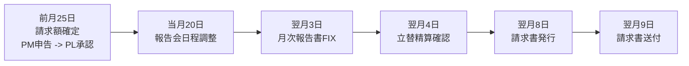
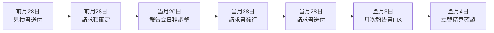

# 01. PJ コックピット

AMD OS の **中心画面**。各 PJ ごとに 1 つあり、URL は `/project/{project_id}/cockpit` (例: `/project/p21/cockpit` = SX)。

## 誰がいつ使うか
- **PM / PL / 伴走メンバー** (= PJ を動かす AMD メンバー) が日常的に開く
- **月次ルーティン**で月初・月末に各 step を触る
- 経営判断のタイミングで **経営ハイライト** を確認・採否
- **提案前の論点整理セッション**で議題を出すときに、各 PJ の candidate をここで見る

## 画面構成 (上から)

```
┌─────────────────────────────────────────────────────┐
│  PJ ヘッダー (= 名前 / レーン / アウトカム / 設立日)   │
├─────────────────────────────────────────────────────┤
│  AMD スコアグラフ │ M/X/F カード │ XRL 進捗グラフ      │
├──────────────────┬──────────────────┬──────────────┤
│  年間 MS リスト   │  経営ハイライト   │  月次ルーティン │
│  月次サマリ       │  MTG サマリ        │  つくよみメモ   │
└──────────────────┴──────────────────┴──────────────┘
```

(= 3 カラム x 2 段)

---

## 1.1 PJ Status (= AMD Score / XRL)

### AMD Score
- PJ / SU の価値・成熟度を見る総合スコア。p00 の `AMD Management Score` とは別物
- 理論上の 7 因子 (= `σ_SU` + TRL/BRL/GRL/SRL/HRL + FRL) を Cobb-Douglas で合成
  - `σ_SU` = Macrotrend / Triple Helix (= 学術 μ_A × 産業 μ_I × 政府 μ_G)
  - XRL = 会社側の readiness (= TRL/BRL/GRL/SRL/HRL)
  - FRL = CEO / founder 側の leadership readiness (= ALQ / Grit / Resilience 等)
- **過去 = 実線** (黒)、**未来予測 = 破線** (5 4 dash) で表示
- 右上 pill (大数字) は **現在のスコア** (= 過去最終点)
- M/X/F カード = 現在の `M` (MACROTREND, max 30) / `X` (XRL, max 600) / `F` (FRL, max 100) 内訳

### XRL 進捗 (5 軸)
- TRL (技術) / BRL (事業化) / GRL (制度) / SRL (社会) / HRL (人材)
- 1-9 段階で内閣府 SIP 体系互換
- `venture-xrl-refresh` route はあるが、Gemini 利用のため自動 schedule は停止中。既存 / 手動の proposal は `/notifications` で「はい / いいえ」承認 → 確定
- ドットクリック (= 透明 r=16 hit area) で詳細モーダル

→ Atlas / Macrotrend / AMD Protocol との関係は **[07 章 判断エンジン](07-atlas-protocol-score-macrotrend.md)**、AMD Score の算出ロジックは **[21 章 AMD Score 詳細仕様](21-amd-score-spec.md)**、関連メンバー / HRL / FRL は **[35 章](35-frl-related-members-score-spec.md)**。SU 系 PJ の hero に出る事業概要、沿革、XRL dot 修正、月次試算表、つくよみヒアリングの詳細は **[37 章 Venture Status / Narrative / PL / XRL Feedback](37-venture-status-narrative-pl-xrl-spec.md)**。

---

## 1.2 年間マイルストーン (MS)

- 4 月期-3 月期で 年間 10-15 個の MS を持つ
- 各 MS は `pt` (= ポイント)、`effort` (= 年間 / 期 / 単発)、責任者 (= AMD メンバーごとの share %)
- Gantt 表示 (= 月 4/26-3/27)
- 各 MS をクリック → 詳細モーダル

### MS の進捗
- `milestone_monthly_progress.note` + `progress_pct` で月次更新
- `monthly_reports` + `project_meeting_summaries` から月次差分を自動推定
- `progress_pct` は累積値。LLM は今月の増分を返し、OS が前月累積に足して保存する
- 月次モーダルで PM が `採用 / 不採用 / 修正 / 手動Edit / つくよみに修正依頼` を使って確認・確定する
- 詳細仕様は **[36 章 MS Progress / Monthly Report / Revision Loop](36-ms-progress-monthly-report-revision-spec.md)** が正本

### MS の 3 列展開 (= 未実装)
- **🎯 ゴール** = `value_milestones.success_criteria`
- **📝 やること** = `milestone_sub_items` + `responsibility.task_description`
- **📍 現状** = `milestone_monthly_progress.note` + `progress_pct`

→ 実装は別タスク。

---

## 1.3 経営ハイライト (= 旧「経営・事業シグナル」)

> **これは「進んだこと・起きたこと」だけを書く場所**。未了 / TODO / アイディア / 議論中は **書かない** (= 別の場所で扱う)。

### 4 分類

| 分類 | 色 | 含まれる signal_type |
|---|---|---|
| 🏛 **経営全般** | violet | `management_decision` / `strategic_pivot` / `funding` / `next_move` |
| 🚀 **事業開発** | emerald | `business_progress` / `commercial_progress` / `partnership` |
| 🔬 **技術開発** | sky | `tech_progress` (= 自社特許 / 技術スタック進捗) |
| 🌐 **外部環境** | amber | `ip_regulatory` (= 他国規制等) / `risk` |

外部マクロ一覧の正本は **Atlas** (= header の「Atlas で全マクロ ↗」リンク)。ただし PJ にとって重要な外部シグナルも cockpit に並ぶ (= 例: 5/21 中国レアアース → SX 重金属回収追い風)。

### Polarity アイコン
- 🎉 大進捗 (= IPO 内諾、量産開始、特許出願完了、大型受注)
- ✨ 順調な前進 (= LOI 締結、PoC 完了、調達合意)
- 🔄 戦略転換 (= 事業ピボット、戦略撤回)
- ⚠️ リスク・悪化 (= 訴訟、品質問題、契約破棄)

→ **🌐 中立アイコンは廃止**: 外部環境シグナルも中立じゃなく、PJ にとってプラスかマイナスのいずれか。中立なら書く必要がない。

### AMD Score 影響併記
各シグナルに `score_impact_summary` がある場合は、「📊 影響: TRL 4→5、X 軸 +40pt」のような 1 行を添える。

### candidate と confirm の違い
- **candidate** = 自動抽出されたばかりで、レビュー担当が内容を確認する前 (= 「⚠️ 未確認」注釈)
- **confirmed** = レビュー担当 / admin が「これで OK」と確認したもの (= 注釈なし)
- **rejected** = 抽出が誤りで却下したもの (= 表示しない)

詳しいフローは **[02 章 2.2 提案前の論点整理セッション](02-amd-cockpit.md#22-提案前の論点整理セッション)** と **[28 章](28-notification-review-and-strategy-signals-spec.md)**。

### つくよみに修正依頼
各シグナルに「⚠️ つくよみに修正依頼」ボタンあり。修正コメント (= 例「これは LOI じゃなく NDA」) を投げると `l2_feedbacks` に保存され、**次回の自動抽出やレビューで過去フィードバックとして参照される** (= 学習ループ)。

→ 詳細は **[22 章 通知・つくよみ](22-notifications-and-tsukuyomi.md)**。

---

## 1.4 MTG サマリ

- `project_meeting_summaries` テーブル
- 入力: Calendar (= 開催情報) + Slack / Notion / Drive (= 議事録本文) + 提案前の論点整理ログ
- `source_kinds` で種別判別: `notion` / `gmail` / `slack` / `drive` / `calendar` (= 議事録ソース) / `dialogue` (= 提案前の論点整理セッション) / `upcoming` (= 未開催、初見ブリーフ)
- 詳細モーダルで `narrative_md` (= Sonnet 4.6 が「背景 → 議論の流れ → チームへの提案案 → 残課題」の Markdown narrative に書き直したもの) を主表示
- raw 配列 (= 元データ) は折りたたみ「元データ」へ

### 予定MTG / 準備中

未開催の MTG は、MTG サマリ欄の先頭に「予定MTG / 準備中」として出る。詳細モーダルでは、意味の薄い箇条書きではなく、初めて読む人が流れを追える文章を主表示にする。編集欄も `1段落1ブロック` で扱い、短い断片の羅列に戻さない。

- `narrative_md`: まず読む「初見ブリーフ」。背景、今回の焦点、会議後に残したい状態、当日までの準備を文章でつなぐ
- `summary_short`: 一覧カードに出す、この MTG の短い狙い
- `decided`: 「会議後に残したい状態」として文章表示する素材
- `progress`: 「いまの状況」として文章表示する素材
- `next_actions`: 「当日までに揃えるもの」として文章表示する素材
- `risks`: 「気をつけたい読み違い」として文章表示する素材

詳細モーダルの「Codex相談メモをコピー」で、そのまま Codex に渡せる準備 prompt を作れる。「準備内容を編集」から内容を直すと `POST /api/meeting-prep` 経由で同じ row に保存される。

### 「提案前の論点整理セッション」とは
- レビュー担当が LLM と、チームへ提案する前の論点・提案・残課題を整理する対話セッション
- 議事録では「決定」よりも「提案」「整理」「相談前提の論点」として残す
- 詳細は **[02 章 2.2 提案前の論点整理セッション](02-amd-cockpit.md#22-提案前の論点整理セッション)**。

---

## 1.5 月次ルーティン (= 報告書 / 請求 / 会計)

各月の運用 step (= 例: 2026-04 稼働分) を、コックピット右カラムで前月から翌月まで追う。

```text
標準PJ
前月25日  請求額確定
   ↓
当月20日  報告会日程調整
   ↓
翌月03日  月次報告書FIX
   ↓
翌月04日  立替精算確認
   ↓
翌月08日  請求書発行
   ↓
翌月09日  請求書送付

CTB
前月28日  見積書送付 + 請求額確定
   ↓
当月20日  報告会日程調整
   ↓
当月28日  請求書発行 + 請求書送付
   ↓
翌月03日  月次報告書FIX
   ↓
翌月04日  立替精算確認
```

すべて **営業日調整あり** (= 土日なら前営業日へ繰り上げ)。

標準 PJ の流れ:



CTB PJ の流れ:



| step | 締切 | 主担当 | やること | 完了判定 | クリック先 |
|---|---|---|---|---|---|
| 見積書送付 (CTBのみ) | 前月28日 | PM / admin | 見積書を発行・送付する | `invoice_base_lines_json` に `[[CTB_ESTIMATE_SENT]]` marker | 請求書モーダル (`quotation`) |
| 請求額確定 | 前月25日 (CTB は28日) | PM → PL | 請求額・バッファ・PJ予算を申告し、PL承認に回す | `budget_confirmed_at` or `status='budget_confirmed' / 'allocation_confirmed'` | 請求額確定モーダル |
| 報告会日程調整 | 当月20日 | PM | 月次報告会の候補日を取り、日程を確定する | `meeting_event_id` or `meeting_start_at` | 日程調整モーダル |
| 月次報告書FIX | 翌月3日 | PM / PL | `monthly_reports` を確認し、送付できる状態に固定する | `report_fixed_at` | 報告書FIXモーダル |
| 立替精算確認 | 翌月4日 | PM / admin | 未処理の立替申請がないか確認する | 締切後、`submitted` / `pmapproved` の立替がなければ自動完了 | `/reimburse` |
| 請求書発行 | 翌月8日 (CTB は当月28日) | PM / admin | 請求書番号・PDF・freee連携を作る | `invoice_issued_at` | 請求書モーダル (`invoice`) |
| 請求書送付 | 翌月9日 (CTB は当月28日) | PM / admin | 送付済みにして `invoice_sent_at` を保存する | `invoice_sent_at` | 確認ダイアログ |

月見出し (`2026.05稼働分`) をクリックすると月次の集約モーダルを開く。各 step 行は、それぞれ専用のモーダル / ページを開く。

`billing_cycles.invoice_ym` が稼働月と違う場合 (= 複数月を後からまとめて請求) は、当月側には **月次報告書FIXだけ**残し、見積書送付 / 請求額確定 / 報告会日程調整 / 立替確認 / 請求書発行・送付は請求月側でまとめて回す。

請求書・見積書・freee 発行の詳細仕様は **[32 章 Invoice / Billing Routine](32-invoice-and-billing-routine-spec.md)** が正本。月次報告書、MS進捗、修正依頼ループの詳細仕様は **[36 章 MS Progress / Monthly Report / Revision Loop](36-ms-progress-monthly-report-revision-spec.md)** が正本。

→ 詳細は **[04 章 admin オペ](04-admin-ops.md)** へ。

---

## 1.6 つくよみメモ

`tsukuyomi_nudge_queue` テーブルに溜まる「LLM が見つけた要注意事項」を右下に表示。例:
- 「DG ダイワ から VC 6/12 同時突入予定の進行確認」
- 「担当メンバーの活動量が直近 7 日で減少」

各 nudge は「対応済」or「無視」で消える。

---

## 1.7 メンバー / 事業会社 / 関連メンバー (= 用語の使い分け)

**ここで使われる「メンバー」関連用語は紛らわしい**。整理:

| ボタン / モーダル名 | 実態 | データソース |
|---|---|---|
| **👥 メンバー** | AMD 内部メンバーで、この PJ に伴走してる人 | `project_members.member_id` (= AMD members table への FK) |
| **🤝 事業会社** | 興味事業会社 (= 協業先 / 顧客候補)。法人レベル | `project_partners` |
| **関連メンバー** | HRL 評価のベース。SU 創業・経営・技術に直接コミットする人 + AMD 伴走メンバー + 大学キーパーソン | `project_founding_members` (= 紛らわしい DB 名) |

→ **`project_founding_members` という名前は誤解を生む**。マニュアルでは「**関連メンバー**」と呼ぶ。VC / 顧客 / 行政 / 産業パートナーは HRL 根拠外。

→ 詳細は **[35 章 FRL / 関連メンバー / HRL 詳細仕様](35-frl-related-members-score-spec.md)** へ。

---

## 関連
- **[02 章 AMD 会社全体](02-amd-cockpit.md)**
- **[21 章 AMD Score 詳細仕様](21-amd-score-spec.md)**
- **[35 章 FRL / 関連メンバー / HRL 詳細仕様](35-frl-related-members-score-spec.md)**
