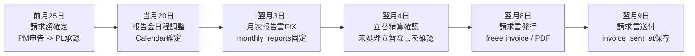
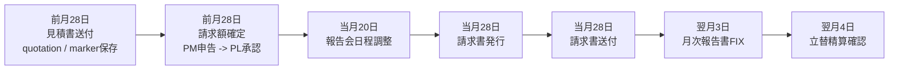
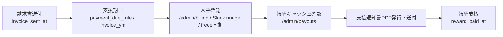

# 04. admin オペ

月次の管理オペレーション。

## 4.0 月次運用カレンダー

admin 視点では、月次運用は **稼働月のルーティン** と **支払月の回収・支払** を分けて見る。

- 稼働月のルーティン: PJ cockpit 右カラム / `/mypage` / `/admin/billing`
- 支払月の回収・支払: `/admin/billing` / `/admin/payouts?ym=YYYYMM` / `/admin/finance`

標準 PJ の稼働月ルーティン:



CTB PJ は、見積と請求を前倒しする:



請求書送付後は、固定締切ではなく PJ ごとの支払条件で動く。



| タイミング | 主担当 | 画面 | やること | 完了 / 保存先 |
|---|---|---|---|---|
| 前月25日 | PM -> PL | PJ cockpit / `/mypage` | 標準 PJ の請求額・バッファ・PJ予算を申告し、PL が承認する | `billing_cycles.budget_confirmed_at`, `budget_yen`, `status='budget_confirmed'` |
| 前月28日 | PM / admin | PJ cockpit | CTB の見積書送付と請求額確定を行う | `invoice_base_lines_json` の `[[CTB_ESTIMATE_SENT]]`, `budget_confirmed_at` |
| 当月20日 | PM | PJ cockpit | 月次報告会の日程を確定する | `meeting_event_id` or `meeting_start_at` |
| 当月28日 | PM / admin | PJ cockpit | CTB の請求書を発行・送付する | `invoice_issued_at`, `invoice_sent_at` |
| 翌月3日 | PM / PL | PJ cockpit | 月次報告書を確認し、送付可能な状態に固定する | `monthly_reports.status`, `billing_cycles.report_fixed_at` |
| 翌月4日 | PM / admin | `/reimburse` / `/admin/billing` | 未処理の立替申請がないか確認する | 締切後に `submitted` / `pmapproved` が無ければ自動完了 |
| 翌月8日 | PM / admin | PJ cockpit | 標準 PJ の請求書を freee で発行する | `invoice_issued_at`, `freee_invoice_number` |
| 翌月9日 | PM / admin | PJ cockpit | 標準 PJ の請求書を送付済みにする | `invoice_sent_at` |
| 支払期日 | admin | `/admin/billing`, Slack, `/payment-confirm` | 入金を確認する。期日は `/admin/projects` の支払条件と `invoice_ym` で決まる | `payment_confirmed_at`, `billing_log` |
| 支払月 | admin | `/admin/payouts?ym=YYYYMM` | 報酬キャッシュを確認し、支払データ保存、支払通知書 PDF 発行、送付済み化を行う | `monthly_reward_payout`, `payout_notices` |

`billing_cycles.invoice_ym` が稼働月と違う場合、稼働月側には **月次報告書FIXだけ**残り、請求・日程・立替・発行・送付は請求月側にまとめる。月次ルーティンの細かいクリック先と完了判定は [01 章 1.5](01-pj-cockpit.md#15-月次ルーティン--報告書--請求--会計) が正本。

## 4.1 admin/payouts (= 月次支払通知書フロー)

URL: `/admin/payouts?ym=YYYYMM`

### 何をする画面か
AMD から SU に対する月次業務委託費 (= AMD 業務委託フィー) の **支払通知書発行**フロー。SU 法人がまだ無い PJ (= pre-founding) でも、業務委託契約に基づき支払が発生する。

報酬キャッシュ、支払月 / 稼働月の判定、PJ別収支、PDF確認 / 正式発行、送付済み管理の詳細は **[31 章 Admin Payouts / 支払通知書](31-admin-payouts-reward-notice-spec.md)** が正本。

### 月次サイクル
1. **報酬サマリ表示** (= 過去 cycle の `billing_cycles.reward_summary_json` をキャッシュ表示)
2. **月次ベースでメンバー別支払額確認**
3. **支払通知書発行**:
   - **番号発行** (= `payout_notices.notice_no` = `PN-YYYYMM-NNN`)
   - **PDF URL 保存** (= 改善版フォーマット生成)
   - **送付済み化** (= `payout_notices.sent_at` set)
4. 「PDF 確認」ボタンで支払データ確定前でも確認用 PDF 生成可能 (= 確認用は `payout_notices` に保存しない)

### 重要な仕様
- 通常表示は **報酬キャッシュを読むだけ**。重い再計算は暗黙実行しない
- 手動「報酬キャッシュ再計算」ボタンまたは保存系処理だけが再計算する
- 支払通知書 PDF フォーマット: **2026-04 改善版** が正本。白地、青アクセント、公式ロゴ画像、青ヘッダ明細表、税内訳、支払予定/方法/振込先/備考を出す

→ 守るべき PDF / UI 契約: [31 章 Admin Payouts / 支払通知書](31-admin-payouts-reward-notice-spec.md)

---

## 4.2 admin/projects

URL: `/admin/projects`

### 何をする画面か
全 PJ 台帳の編集。
- PJ メタ (= 名前 / レーン / アウトカム / 設立日 / 起源機関 / 代表者)
- 月次予算
- メンバー紐付け
- report_emails (= 月次報告書送付先メールアドレス、chip 表示で個別削除 + 一括保存可能)

### sticky thead
- ヘッダーは `sticky top-0 z-30` で固定 (= 大量 PJ で下スクロールしてもヘッダーが見える)

### 詳細仕様

セル単位編集、支払条件、関係先メアド、PJメンバー、ASPI lane は **[30 章 Admin Projects / Members 台帳](30-admin-projects-members-ledger-spec.md)** が正本。

### projects.status (= PJ の稼働・営業状態)

`projects.status` は **契約・営業・稼働状態** の軸。`project_category` (= AMD OS 上の扱い / 事業モデル) とは別物。

| value | 表示色 | 意味 | 主な扱い |
|---|---|---|---|
| `draft` | gray | 台帳作成済みだが、契約・稼働・営業状態がまだ固まっていない準備中 PJ | `admin/projects` で情報を揃える段階。通常の月次ルーティンや請求対象にはまだ入れない |
| `active` | emerald | AMD が伴走・運用中の PJ | cockpit / 月次ルーティン / 請求・支払 / MS 進捗抽出の標準対象 |
| `sales` | blue | 商談・受注前・提案中の PJ | 台帳や資料生成には載せるが、契約後の月次オペは個別に確認してから開始 |
| `ended` | gray | AMD の伴走・契約が終了した PJ | 履歴として残す。新規の月次ルーティンは原則表示しない |
| `frozen` | amber | 明示的に休止中の PJ | 新規月次ルーティンは止める。再開見込みがある場合は `freeze_from_ym` / `restart_expected_ym` も併用 |
| `lost` | red | 失注 / 破談 / 契約化しなかった PJ | `/admin/payouts` では支払原資なしの個別確認対象。契約が取れなかった場合の支払は個別合意が必要 |

#### status と凍結期間の使い分け

- `status` は PJ の大きな状態ラベル。`active` / `sales` / `ended` / `lost` のような契約・営業フェーズを表す。
- `freeze_from_ym` / `restart_expected_ym` は **期間つきの休止オーバーレイ**。たとえば「契約は継続してるが 202605 から一時停止」のように、`status='active'` のまま月次ルーティンだけ止めたい時に使う。
- 複数回の凍結 / 再開履歴は `project_freeze_periods` が正本。`projects.freeze_from_ym` / `restart_expected_ym` は現在表示用キャッシュ。
- 新しく凍結・再開を扱う実装では、`projects.status='frozen'` だけで判断せず、`project_freeze_periods` と現在 ym も見る。

### project_category (= status の右隣の分類チップ)

`projects.project_category` = AMD OS 上で PJ をどう扱うかの軸 (= status と別軸、契約状態とは無関係)。

| value | 表示 | 意味 | AMD Score | MS 進捗抽出 |
|---|---|---|---|---|
| `dtsu` | DTSU (cyan) | 学術発 SU 伴走 PJ (通常) | 対象 | 対象 |
| `new_business` | 新規事業創出 (emerald) | レガシー企業 DX + 研究シーズ取込で新規事業創出 | 対象 | 対象 |
| `ecosystem` | Ecosystem (violet) | 研究機関の SU エコシステム構築業務 | 対象外 | 対象 |
| `advisor` | Advisor (amber) | AMD が社外取締役 / 経営顧問として入る PJ | 対象 | 対象外 (月次ノート運用) |

- ZMP (`p19`) は `new_business` (= 葛飾ロード新規事業創出)
- KUTE (`p25`) は `ecosystem`、LST (`p07`) は `advisor`
- 追加経緯や内部判断ログは開発者向けマニュアルで管理する

---

## 4.3 admin/members

URL: `/admin/members`

### 何をする画面か
AMD 内部メンバー台帳の編集。
- code_name (= AMD OS 内で使うメンバー識別名)
- email
- 個人情報 (= 入社日、稼働率等)
- どの PJ に伴走してるか

### sticky thead 同様

Google Calendar 状態、最終ログイン、admin / officer、Slack ID、保存方式は **[30 章](30-admin-projects-members-ledger-spec.md#3011-adminmembers)** が正本。

---

## 4.4 admin/billing

URL: `/admin/billing`

### 何をする画面か
月次請求マトリクス。各 SU × 各月の請求状態 (= 発行済 / 送付済 / 入金済 / 未対応) を一覧。

請求書 / 見積書の freee 発行、既存導線の扱いは **[32 章 Invoice / Billing Routine](32-invoice-and-billing-routine-spec.md)** が正本。

### 対象と step

- 対象月は 13 ヶ月分 (= 基準月の 11 ヶ月前から翌月)
- 対象 PJ は `active` / `frozen` と、`ended` でも cycle が `end_ym` 以前のもの
- 標準 PJ は `予算確定 -> 報告会 -> 報告書 -> 立替確認 -> 請求発行 -> 請求送付 -> 支払通知 -> 入金確認 -> 報酬支払`
- CTB PJ は `見積送付 -> 予算確定 -> 報告会 -> 請求発行 -> 請求送付 -> 報告書 -> 立替確認 -> 支払通知 -> 入金確認 -> 報酬支払`。請求発行 / 請求送付は当月 28 日基準になる
- `立替確認` は手動更新不可。締切後に未処理立替がなければ自動で完了扱い
- 入金確認 / 報酬支払は、手前の step が残っていると完了できない

詳細仕様は [26 章 Member Ops / Billing / Prompt](26-member-billing-prompts-spec.md#266-adminbilling)。

---

## 4.5 立替申請

URL: `/reimburse`

### 何をする画面か
AMD メンバーが業務関連で立替えた費用 (= 出張 / イベント参加費 / 書籍 等) を申請。
- 領収書 (= 写真 / PDF アップロード)
- 金額 / 用途 / PJ 紐付け
- 承認フロー (= PM 承認 → admin 承認)
- `approved` の立替だけが請求書発行時の明細対象

### status flow

```text
submitted -> pmApproved -> approved -> paid
        \-> rejected
pmApproved -> rejected
```

自分の申請は `submitted` の間だけ編集 / 削除できる。領収書は private Storage `reimbursement-receipts` に保存し、画面では signed URL を作る。

詳しい入力項目・権限・保存仕様は [10 章](10-member-workflows-quick-start.md#104-reimburse-で立替を申請する) と [26 章](26-member-billing-prompts-spec.md#265-reimburse-と-reimbursements)。

---

## 4.6 コックピット月次ルーティンとの接続

コックピット右カラムの月次ルーティンは、admin の請求・支払・立替データを触る入口。

```text
コックピット月次ルーティン
  請求額確定
    -> billing_cycles / PL 承認 / PJ 予算
  報告会日程調整
    -> meeting-slots / schedule-meeting
  月次報告書FIX
    -> monthly_reports / billing_cycles
  立替精算確認
    -> /reimburse
  請求書発行・送付
    -> billing_cycles / freee invoice / invoice_sent_at

admin
  /admin/projects  -> PJ 台帳・支払条件・月次予算
  /admin/billing   -> SU x 月の請求状態マトリクス
  /admin/payouts   -> AMD から SU への支払通知書
  /admin/finance   -> 固定費・領収書・budget forward-fill
```

締切・クリック先・CTB 例外は **[01 章 1.5 月次ルーティン](01-pj-cockpit.md#15-月次ルーティン--報告書--請求--会計)** が読み手向け正本。

---

## 4.7 admin/settings (= Operations Settings)

URL: `/admin/settings`

### 何をする画面か
Raw Data / L2 Data / Cron Control を見る admin 専用の運用台帳。

- Raw Data: Calendar / Notion / Gmail / Slack / Drive / Web がどの table に入るか
- L2 Data: monthly report, AMD Protocol, MS 進捗, MTG サマリ, 経営ハイライトなどの table と目的
- Cron Control: 稼働中・停止中の処理、旧頻度、入力、出力、Run Now 可否
- DB Settings: `settings` table の key/value

### 重要な仕様
- `Stopped` の operation は意図的に止めている。開発者向けの移管対象なので、すぐ復活させない
- `Run Now` できるものも、`dryRun` がある時はまず `dryRun=1` で確認する
- 表示内容の正本は `pwa/src/lib/operations-catalog.ts`

内部設定の詳細は開発者向けマニュアルで管理する。

---

## 4.8 admin/finance (= 経理オペ台帳)

URL: `/admin/finance`

### 何をする画面か
月次 PL に入る前段の、会社固定費・領収書・自動振替の運用台帳。

| ブロック | 役割 |
|---|---|
| Recurring items | サブスク / 固定継続費 / 年次費用 / 自動振替 / 引落口座を管理 |
| Budget forward-fill | 毎月発生する費用だけ `company_budget_monthly` へ将来分を同期 |
| Receipt events | Gmail / freee / manual 由来の領収書候補を確認し、`company_actual_monthly` へ同期 |
| 役員除外分 | 支払通知書から除外され AMD 運営費へ残る金額の見落とし防止 |

### 重要な仕様
- 月次 PL baseline に既に入っている固定費は、二重計上を避けるため `budget_forward_fill=false` で始める
- 新しいサブスク / 自動振替 / 固定費を見つけたら recurring item に登録する
- 実績に入れるのは receipt event を確認してから。同期済みは `status='synced'`
- 入金確認 nudge は `/admin/payouts` から動き、Slack の signed token フォーム `/payment-confirm` につながる

詳細仕様は **[25 章 Finance / Payment Confirm](25-finance-payment-confirm-spec.md)**。

---

## 4.9 admin/prompts (= LLM prompt 管理)

URL: `/admin/prompts`

### 何をする画面か

LLM prompt を `llm_prompts` に置き、コード内 hardcode ではなく DB 正本として管理する。`prompt_key` ごとに body / model / max_tokens / is_active / notes を確認・編集できる。

`tsukuyomi_context` も併記するが、これは本体スプシ `DB_TsukuyomiContext` 由来の context 群。PWA 側では主に閲覧し、正本編集はスプシ側で行う。

詳細仕様は [26 章 Member Ops / Billing / Prompt](26-member-billing-prompts-spec.md#267-adminprompts)。

---

## 4.10 admin/protocols (= AMD Protocol 候補確認)

URL: `/admin/protocols`

### 何をする画面か

AMD Protocol の候補を確認し、正式化・修正依頼・却下・archive する画面。

- `protocols`: 普遍的な判断パターン
- `protocol_examples`: 具体事例
- `protocol_result_observations`: 後追いの結果観測

`確定` は `status='confirmed'`、`修正依頼` はつくよみ chat drawer への prefill、`却下` は `status='rejected'`、`archive` は `status='archived'`。旧形式 `kind='legacy_specific'` は新形式と混ぜず、再抽出または archive 対象。

詳細仕様は [27 章 Knowledge Admin / Tsukuyomi](27-knowledge-admin-tsukuyomi-spec.md#273-adminprotocols)。

---

## 4.11 admin/contexts (= LLM Context 管理)

URL: `/admin/contexts`

### 何をする画面か

`tsukuyomi_context` の汎用編集画面。`context_id` / `tags` / `priority` / `system_prompt` / `status` を確認・編集する。

prompt 本文の正本は `/admin/prompts`、context の正本は `/admin/contexts`。つくよみ人格・学習運用は `/admin/tsukuyomi` で扱う。

詳細仕様は [27 章 Knowledge Admin / Tsukuyomi](27-knowledge-admin-tsukuyomi-spec.md#274-admincontexts)。

---

## 4.12 admin/tsukuyomi (= つくよみ管理)

URL: `/admin/tsukuyomi`

### 何をする画面か

つくよみの投稿・学習メモ・人格 DB layer を見る admin 画面。

| ブロック | 役割 |
|---|---|
| PJチャンネルへ強制発言 | AI生成または手書きで PJ Slack チャンネルへ投稿 |
| つくよみ学習状況 | `tsukuyomi_learnings` / `tsukuyomi_learnings_status` を見る |
| 人格DB編集 | `judge / role / memory / tone / safety` layer で context を編集 |

2026-05-25 時点では、PWA 側の強制発言ボタンは投稿導線として使う前に修正が必要。

詳細仕様と既知ギャップは [27 章 Knowledge Admin / Tsukuyomi](27-knowledge-admin-tsukuyomi-spec.md#275-admintsukuyomi)。

---

## 関連
- **[01 章 PJ コックピット](01-pj-cockpit.md)**
- **[30 章 Admin Projects / Members 台帳](30-admin-projects-members-ledger-spec.md)**
- **[31 章 Admin Payouts / 支払通知書](31-admin-payouts-reward-notice-spec.md)**
- **[32 章 Invoice / Billing Routine](32-invoice-and-billing-routine-spec.md)**
