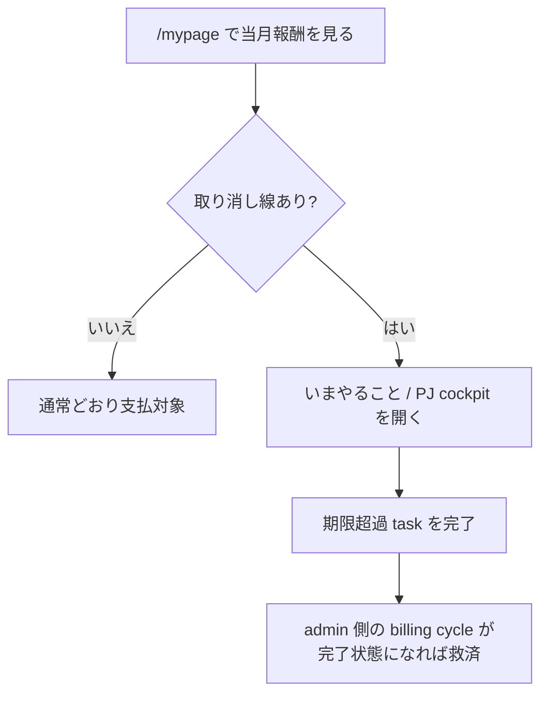
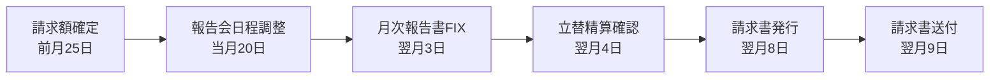
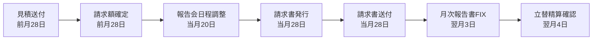
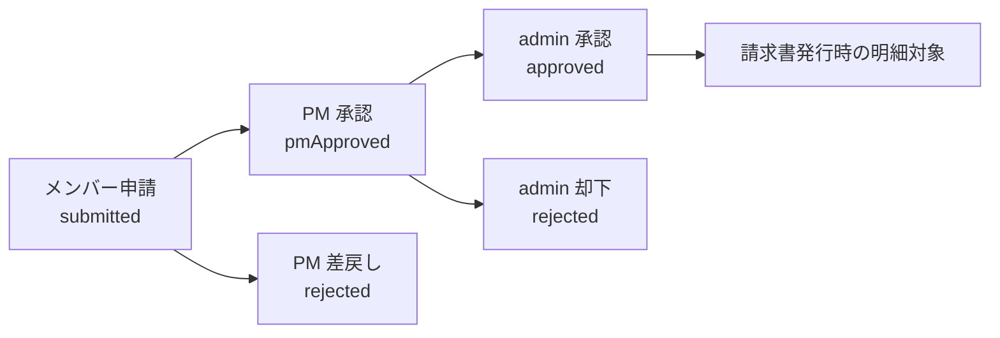

# 10. メンバーの日常ワークフロー

AMD メンバー / SU 側メンバーが日常的に使う画面を、実際の作業順で見る章。細かい DB・自動判定ロジックは [26 章 Member Ops / Billing / Prompt 仕様](26-member-billing-prompts-spec.md) にまとめる。

## 10.1 まず `/mypage` を見る

`/mypage` は、自分に関係ある PJ と月次TODOをまとめて見る入口。

| ブロック | 見るもの | 使い方 |
|---|---|---|
| 当月報酬合計 | 今月の支払見込み合計 | 取り消し線がある PJ は、期限超過の月次ルーティンが残っている |
| いまやること | PM / PL として対応すべき月次TODO | クリックすると対象 PJ cockpit の該当 step に移動する |
| 今週やったこと | Gmail / Calendar / source_cache / MTG サマリ由来の週次活動 | 「いますぐ抽出」で自分の今週分を再抽出できる |
| 月別 PJ カード | 過去 6 ヶ月 + 当月の参加 PJ | 当月は展開、過去月は必要に応じて開く |

admin は `/mypage?memberId=<member_id>` で他メンバーのページを確認できる。admin 以外は自分のページだけ。

りり (`ID006`) は NIMS から無償出向で AMD に入っているため、`/mypage` と `/dashboard` 右側のマイページ埋め込みでは、当月報酬合計・月別合計・PJ別報酬額を金額ではなく `ー` と表示する。

## 10.2 報酬に取り消し線が出たら

当月報酬の PJ 名や金額に取り消し線が出ている場合、その PJ の月次ルーティンに期限超過の未完了 task が残っている。

社外役員 / 顧問 PJ は月次ルーティンの対象外なので、取り消し線判定には使わない。

## 10.3 月次TODOの流れ

標準 PJ の月次TODOはこの順番。

CTB PJ は、見積送付 / 請求書発行 / 請求書送付のタイミングが通常 PJ と違う。

締切日が土日なら前営業日に寄せる。細かい step 判定は [01 章 1.5](01-pj-cockpit.md#15-月次ルーティン--報告書--請求--会計) が読み手向け正本。

| step | 主担当 | やること | 完了すると何が保存されるか |
|---|---|---|---|
| 見積送付 (CTBのみ) | PM / admin | CTB の見積書を作り、送付済みにする | `invoice_base_lines_json` に `[[CTB_ESTIMATE_SENT]]` |
| 請求額確定 | PM -> PL | 請求額・バッファ・PJ予算を申告し、PL が承認する | `budget_confirmed_at`, `budget_yen`, `status='budget_confirmed'` |
| 報告会日程調整 | PM | 月次報告会の日程を確定する | `meeting_event_id` or `meeting_start_at` |
| 月次報告書FIX | PM / PL | 月次報告書を確認し、送付できる状態に固定する | `report_fixed_at` |
| 立替精算確認 | PM / admin | 未処理の立替申請がないか確認する | 締切後に未処理立替がなければ自動完了 |
| 請求書発行 | PM / admin | 確定額と承認済み立替を入れて freee 請求書を発行する | `invoice_issued_at`, `freee_invoice_number` |
| 請求書送付 | PM / admin | 発行済み請求書を送付済みにする | `invoice_sent_at` |

複数月を後からまとめて請求する月は、対象月のルーティンには **月次報告書FIXだけ**が残る。ほかの請求・日程・立替 step は `請求月` バッジが示す月側でまとめて回す。

## 10.4 `/reimburse` で立替を申請する

立替精算は `/reimburse` で申請する。

| 入力 | 内容 |
|---|---|
| PJ | どの PJ に紐づく立替か |
| 発生日 | 費用が発生した日 |
| 費目 | 交通費 / 宿泊 / 備品 / 会食 / その他 |
| 金額・税率 | 税込金額と 10% / 8% / 非課税 |
| 摘要 | 何の費用か |
| 領収書 | PNG / JPEG / WebP / PDF、1 ファイル 10MB まで |

交通費では、交通手段、出発、到着、片道 / 往復を入れる。往復を選ぶと保存時の金額は片道金額の 2 倍になる。

## 10.5 立替の承認フロー

自分の申請は `submitted` の間だけ編集 / 削除できる。PM は自分が PM の PJ の `submitted` を承認でき、admin は `pmApproved` を最終承認できる。

## 10.6 今週やったことを更新する

`/mypage` の「今週やったこと」は、今週(月-日 JST)の `member_activities` を表示する。

「いますぐ抽出」を押すと、ログイン中のメンバーについて今週の活動抽出を即時実行する。本人の Calendar が未接続でも、他メンバーの共有済み Calendar / 議事録 / source_cache に参加者として出ている活動は抽出対象になる。

## 10.7 困った時の読み先

| 困りごと | 読む章 |
|---|---|
| `/mypage` の報酬やTODOの仕様を知りたい | [26 章](26-member-billing-prompts-spec.md) |
| 立替が請求・支払にどう入るか知りたい | [04 章](04-admin-ops.md) / [26 章](26-member-billing-prompts-spec.md) |
| 月次ルーティンの締切を確認したい | [01 章](01-pj-cockpit.md#15-月次ルーティン--報告書--請求--会計) |
| 通知の採否や修正依頼を知りたい | [22 章](22-notifications-and-tsukuyomi.md) |
