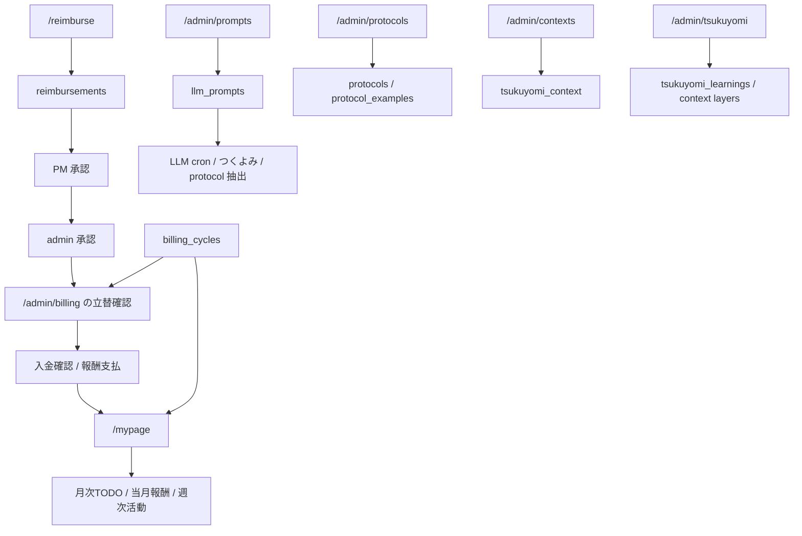

# 20. 全体設計 — OS の地図

AMD OS 全体の構成を、画面・データ・自動処理・外部サービスの関係で見る章。細かいコードや migration の正本は `pwa/design/` と `pwa/scripts/migrations/` だが、まずここで全体像を掴む。

## 20.1 プラットフォーム構成

```text
5 生データ
  Slack / Notion / Calendar / Drive / Gmail
        ↓
L2 抽出・運用処理
  Codex automation / Claude routine / Vercel cron / GAS
        ↓
Supabase
  projects / members / billing_cycles / L2 tables / Atlas / Scores
        ↓
4 クライアント
  PWA / iOS / GAS / Android(TBD)
```

| レイヤー | 役割 |
|---|---|
| Supabase | DB 正本。PWA / iOS / GAS が共有 |
| PWA | ブラウザ版。cockpit、admin、Atlas、Seeds、VC、manual を持つ |
| iOS | ネイティブ版。先行実装がある機能も多い |
| GAS | freee / Slack / 外部サービス連携の一部。LLM定期抽出は 2026-05-22 に停止 |
| Codex automation | 5 生データ・Atlas の LLM レビューを subscription 枠で実行し outbox を出す |
| Claude routine | 旧 GAS L2 の復旧先。議事録 / protocol / knowledge 抽出を予定 |
| LaunchAgent | outbox JSON を 5 分ごとに拾って Supabase / API へ反映 |
| Vercel cron | LLM を使わない運用 cron。freee、入金、週次活動、集計など |

## 20.2 画面マップ

### 日常利用

| 画面 | 役割 |
|---|---|
| `/dashboard` | OS の入口。PJ 一覧と主要画面への導線 |
| `/mypage` | 自分の参加 PJ、今週の活動、月次報酬予定、月次TODO |
| `/project/{projectId}/cockpit` | PJ の中心画面 |
| `/notifications` | L2 候補・差分候補の確認 / 修正依頼 |
| `/reimburse` | 立替申請 |
| `/manual` | このマニュアル |
| `/manual/{slug}` / `/manual/[slug]` | 各マニュアル章 |

### 経営・判断

| 画面 | 役割 |
|---|---|
| `/project/p00/cockpit` | AMD 全社 cockpit |
| `/management-score` | AMD Management Score 詳細。5 軸推移、runway / cash、GAS 月次試算表移植ビュー、差分メモ |
| `/venture-map/amd-score` | AMD Score 一覧 |
| `/venture-map/amd-score/{projectId}` | AMD Score 詳細 |
| `/atlas` | 外部マクロ signal / story |
| `/atlas/macrotrends` | 構造課題と変化仮説 |
| `/atlas/divergence` | 世界 / 日本差分 |
| `/atlas/decisions` | Atlas 由来の判断ログ |
| `/atlas/inbox/submit` | 手動 signal 投入 |
| `/atlas/admin/themes` | Atlas theme clustering 管理 |

### 探索・アセット

| 画面 | 役割 |
|---|---|
| `/seeds` | 研究シーズリスト |
| `/seeds/{id}` | シーズ詳細の直接 URL |
| `/seeds/inbox` | 自動発見 seed の確認 |
| `/vcs` | VC リスト |
| `/vcs/inbox` | VC ニュース確認 |
| `/scholar` | 学術トレンド |

### Admin

| 画面 | 役割 |
|---|---|
| `/admin/projects` | PJ 台帳、契約・請求・支払条件。詳細は [30 章](30-admin-projects-members-ledger-spec.md) |
| `/admin/members` | AMD メンバー台帳、Google Calendar 状態、最終ログイン。詳細は [30 章](30-admin-projects-members-ledger-spec.md) |
| `/admin/billing` | SU × 月の請求状態マトリクス。請求書 / freee 詳細は [32 章](32-invoice-and-billing-routine-spec.md) |
| `/admin/payouts` | AMD から SU への支払通知書。報酬キャッシュ / PDF 詳細は [31 章](31-admin-payouts-reward-notice-spec.md) |
| `/admin/finance` | 経理オペ台帳、固定費、領収書、budget forward-fill |
| `/admin/protocols` | AMD Protocol 候補確認 |
| `/admin/prompts` | LLM prompt 管理 |
| `/admin/settings` | Raw Data / L2 Data / Cron Control |
| `/admin/tsukuyomi` | つくよみ管理 |
| `/admin/contexts` | LLM context 管理 |
| `/payment-confirm` | Slack 入金確認 nudge から開く signed token フォーム |

### HUD / 実験ビュー

| 画面 | 役割 |
|---|---|
| `/hud/dashboard` | HUD 版 dashboard。将来的に正本化したい候補 |
| `/hud/project/{projectId}/cockpit` | HUD 版 PJ cockpit |
| `/hud/notifications` | HUD 版 notifications |
| `/hud/atlas` | HUD skin 付き Atlas |
| `/hud/atlas/inbox` | HUD skin 付き Atlas inbox |
| `/hud/atlas/inbox/submit` | HUD skin 付き signal 手動投入 |
| `/hud/atlas/map` | HUD skin 付き Atlas map |
| `/hud/atlas/macrotrends` | HUD skin 付き Macrotrends |
| `/hud/atlas/divergence` | HUD skin 付き divergence |
| `/hud/atlas/decisions` | HUD skin 付き decision log |
| `/hud/atlas/admin/themes` | HUD skin 付き theme clustering 管理 |
| `/hud/seeds` | HUD skin 付き Seeds |
| `/hud/seeds/inbox` | HUD skin 付き Seeds inbox |
| `/hud/seeds/{id}` | HUD skin 付き seed 詳細 |
| `/hud/vcs` | HUD skin 付き VC List |
| `/hud/vcs/inbox` | HUD skin 付き VC news inbox |
| `/hud/vcs/{id}` | HUD skin 付き VC 詳細 |
| `/hud/vcs/{id}/edit` | HUD skin 付き VC 編集 |
| `/hud/venture-map/amd-score/retrofit` | HUD 版 retrofit view |
| `/venture-map/cyberspace` | 実験ビュー |
| `/venture-map/oscillator` | Coupled oscillator 実験 |
| `/venture-map/state-space` | Triple Helix 状態空間 |
| `/venture-map/timeline-3d` | 3D timeline 実験 |
| `/venture-map/su/{id}` | SU 個別ビュー |
| `/dashboard-cyber-3d-lab` | 3D Cyber Dashboard 実験 |
| `/dashboard-cyber-glass-cube` | 廃案比較用の 3D dashboard 実験 |
| `/dashboard-cyber-hud-wall` | 固定視点 HUD wall 実験 |

### 設定・編集系

| 画面 | 役割 |
|---|---|
| `/project/{projectId}/config` | 旧 PJ 設定。契約・請求・支払条件は `/admin/projects` を正本にする |
| `/vcs/{id}/edit` | VC 手入力編集 |
| `/scholar` | OpenAlex 由来の ASPI 8 domain x quarter 論文数 |

## 20.3 データレイヤー

```text
Raw evidence
  source_cache / meeting docs / calendar / Gmail refs
        ↓
L2
  monthly_reports
  member_activities
  milestone progress
  project_knowledge
  member_knowledge
  project_meeting_summaries
  project_registry_diffs
  project_xrl_evidence
  project_strategy_signals
        ↓
Decision / Ops UI
  cockpit / notifications / admin / score / atlas
```

| 系統 | 主なテーブル |
|---|---|
| PJ / メンバー | `projects`, `members`, `project_members`, `project_ventures`, `project_venture_members`, `project_partners` |
| SU / Venture Status | `project_events`, `project_xrl_log`, `xrl_feedbacks`, `narrative_feedbacks`, `project_pl_monthly`, `project_pl_hearings` |
| 月次 / 請求 | `billing_cycles`, `monthly_reports`, `project_monthly_notes`, `reimbursements`, `payout_notices`, `billing_log` |
| 経理 / 会社 PL | `company_finance_recurring_items`, `company_finance_receipt_events`, `company_budget_monthly`, `company_actual_monthly` |
| MS / 月次進捗 | `value_plan_cycles`, `value_milestones`, `milestone_monthly_progress`, `progress_estimate_state`, `ms_progress_revisions`, `ms_revision_messages`, `member_ms_activities` |
| L2 | `project_strategy_signals`, `project_xrl_evidence`, `project_registry_diffs`, `project_knowledge`, `member_knowledge`, `protocols` |
| 通知 | `l2_notifications`, `meeting_notifications`, `l2_feedbacks`, `app_notifications` |
| Prompt / Context | `llm_prompts`, `tsukuyomi_context`, `llm_model_config` |
| Atlas | `atlas_signals`, `atlas_stories`, `atlas_themes`, `atlas_divergences`, `atlas_decisions` |
| Seeds / VC / Scholar | `seeds`, `seed_*`, `vcs`, `vc_*`, `papers_log` |
| Scores | `amd_score_inputs`, `amd_score_alpha`, `amd_management_score_*`, `macro_index_log`, `papers_log`, `project_founding_members` |

## 20.4 書き込み経路

| 経路 | 例 | 原則 |
|---|---|---|
| PWA UI -> API -> Supabase | 月次ルーティン、通知回答、admin編集 | ユーザー操作を即保存 |
| Codex automation -> outbox -> LaunchAgent -> API/Supabase | MS進捗修正候補、XRL根拠、経営ハイライト、Atlas | LLM が直接 DB へ大量書き込みしない。MS進捗の primary writer は [36 章](36-ms-progress-monthly-report-revision-spec.md)、Atlas は [34 章](34-atlas-macrotrend-signal-spec.md) |
| Claude routine -> Supabase REST | 議事録 / protocol / knowledge 復旧予定 | source_hash と feedback を見て冪等に upsert |
| Vercel cron -> Supabase | freee同期、入金確認、週次活動、集計 | LLM 非使用の運用処理だけ残す |
| GAS -> Supabase / Slack / freee | 支払通知書 PDF、外部サービス連携 | LLM 定期抽出は停止中 |

## 20.5 メンバー / admin オペの接続



`/mypage` はメンバー向け入口、`/admin/billing` は admin の月次状態確認、`/admin/prompts` は LLM prompt の運用台帳。`/admin/protocols` / `/admin/contexts` / `/admin/tsukuyomi` は知識候補とつくよみ学習の運用台帳。`/notifications` の実 UI と cockpit 側の修正依頼履歴は [28 章](28-notification-review-and-strategy-signals-spec.md)。日常の使い方は [10 章](10-member-workflows-quick-start.md)、月次 / prompt 仕様は [26 章](26-member-billing-prompts-spec.md)、知識 admin 仕様は [27 章](27-knowledge-admin-tsukuyomi-spec.md)。

## 20.6 認証と権限

- PWA の `(app)` 配下は Supabase Auth の Google login が必要
- `/auth/login` と `/auth/callback` は公開
- `/hud/dashboard/embed` は外部プレゼン用の公開 embed route
- admin 画面と `/notifications` は admin 権限を前提にする
- Google Workspace login は Calendar / Gmail scope を使う。Calendar 共有状態は `members.google_calendar_status` に残す
- `/mypage?memberId=<member_id>` で他メンバーを表示できるのは admin だけ
- `/reimburse` の編集 / 削除は作成者本人かつ `submitted` の間だけ
- `/admin/prompts` の更新 API は auth user email を `updated_by` に残し、DB 書き込みは service role で実行する

## 20.7 今回クロールで見つけた manual 化対象

今回の OS 全体クロールで、manual 側が薄かったもの:

| 領域 | 反映先 | 状態 |
|---|---|---|
| 初心者向けの使い方 | [08 章](08-member-quick-start.md) | 追記済み |
| 全体画面マップ / platform map | この章 | 追記済み |
| AMD Score の数式・軸・更新ロジック | [21 章](21-amd-score-spec.md) | 追記済み |
| 通知 / つくよみ修正依頼 / 正本反映ゲート | [22 章](22-notifications-and-tsukuyomi.md) | 追記済み |
| Seeds / VC / Scholar の使い方 | [09 章](09-research-assets-quick-start.md) | 追記済み |
| Seeds / VC / Scholar の詳細仕様 | [33 章](33-research-assets-vc-seeds-scholar-spec.md) | 追記済み |
| Venture Map の数理モデル・実験ビュー | [23 章](23-hud-and-venture-map-spec.md) | 追記済み |
| HUD 版の正本化方針 | [23 章](23-hud-and-venture-map-spec.md) | 追記済み |
| SU 系 PJ hero / 事業概要 / 沿革 / 試算表 / XRL feedback | [37 章](37-venture-status-narrative-pl-xrl-spec.md) | 追記済み |
| L2 ②④⑤⑥ 抽出 routine / ghost 復旧 | [38 章](38-l2-extraction-routines-spec.md) | 追記済み |
| admin/settings の Cron Control | [24 章](24-operations-settings-spec.md) | 追記済み |
| admin/finance / payment-confirm / signed token | [25 章](25-finance-payment-confirm-spec.md) | 追記済み |
| `/mypage` / `/reimburse` のメンバー向け日常導線 | [10 章](10-member-workflows-quick-start.md) | 追記済み |
| `/mypage` / `/admin/billing` / `/admin/prompts` の仕様 | [26 章](26-member-billing-prompts-spec.md) | 追記済み |
| `/admin/protocols` / `/admin/contexts` / `/admin/tsukuyomi` / feedback API の仕様 | [27 章](27-knowledge-admin-tsukuyomi-spec.md) | 追記済み |
| `/notifications` の実 UI / 経営ハイライトの修正依頼履歴 | [28 章](28-notification-review-and-strategy-signals-spec.md) | 追記済み |
| AMD Management Score / finance simulation の算出仕様 | [29 章](29-management-score-and-finance-simulation-spec.md) | 追記済み |
| `/admin/projects` / `/admin/members` の台帳仕様 | [30 章](30-admin-projects-members-ledger-spec.md) | 追記済み |
| `/admin/payouts` / 支払通知書 PDF / 報酬キャッシュ | [31 章](31-admin-payouts-reward-notice-spec.md) | 追記済み |
| 請求書 / 見積書 / freee 発行 / billing routine | [32 章](32-invoice-and-billing-routine-spec.md) | 追記済み |
| MS進捗 / 月次報告書 / 月次ノート / つくよみ修正依頼ループ | [36 章](36-ms-progress-monthly-report-revision-spec.md) | 追記済み |
| Atlas / Macrotrend の signal / story / theme / divergence | [34 章](34-atlas-macrotrend-signal-spec.md) | 追記済み |
| FRL / 関連メンバー / HRL 推定 | [35 章](35-frl-related-members-score-spec.md) | 追記済み |

manual 拡充時は、この表を更新しながら「見つける -> 書く -> 再クロール」を回す。

## 20.8 設計 md の索引

このマニュアルは読み手向けの正本。実装者がさらに細かい設計判断・過去の検討・migration 境界を追う時は `pwa/design/` を見る。設計 md は数が多いので、まず下の地図から入る。

| 読みたいこと | 主な design md | manual 側の入口 |
|---|---|---|
| PWA 全体仕様 / 重要 UI の回帰防止 | [`../design/SPEC_pwa.md`](../design/SPEC_pwa.md), [`../design/FEATURE_REGISTRY.md`](../design/FEATURE_REGISTRY.md), [`../design/README.md`](../design/README.md) | この章 / [06 章](06-developer.md) |
| 仕様ドリフト防止 / traceability | [`../design/SPEC_GOVERNANCE.md`](../design/SPEC_GOVERNANCE.md), [`../design/os_manual.md`](../design/os_manual.md) | この章 / [05 章](05-decisions-and-history.md) |
| L2 9 種 / 抽出 pipeline | [`../design/L2_DATA.md`](../design/L2_DATA.md), [`../design/l2_extract_claude_routine.md`](../design/l2_extract_claude_routine.md) | [03 章](03-data-and-extraction.md), [38 章](38-l2-extraction-routines-spec.md) |
| PJ cockpit / 月次 routine / member workflow | [`../design/cockpit.md`](../design/cockpit.md), [`../design/routine.md`](../design/routine.md), [`../design/mypage.md`](../design/mypage.md) | [01 章](01-pj-cockpit.md), [10 章](10-member-workflows-quick-start.md), [26 章](26-member-billing-prompts-spec.md) |
| AMD Protocol / PJ knowledge / member knowledge | [`../design/amd_protocol.md`](../design/amd_protocol.md), [`../design/project_knowledge.md`](../design/project_knowledge.md), [`../design/member_knowledge.md`](../design/member_knowledge.md) | [07 章](07-atlas-protocol-score-macrotrend.md), [27 章](27-knowledge-admin-tsukuyomi-spec.md), [38 章](38-l2-extraction-routines-spec.md) |
| MTG summary / registry diffs / 経営ハイライト | [`../design/meeting_summaries.md`](../design/meeting_summaries.md), [`../design/project_registry_diffs.md`](../design/project_registry_diffs.md), [`../design/project_strategy_signals.md`](../design/project_strategy_signals.md) | [22 章](22-notifications-and-tsukuyomi.md), [28 章](28-notification-review-and-strategy-signals-spec.md) |
| AMD Score / Management Score / 進捗推定 | [`../design/amd_score.md`](../design/amd_score.md), [`../design/score_revision_feedback_loop.md`](../design/score_revision_feedback_loop.md), [`../design/management_score.md`](../design/management_score.md), [`../design/progress_estimation.md`](../design/progress_estimation.md) | [21 章](21-amd-score-spec.md), [29 章](29-management-score-and-finance-simulation-spec.md), [36 章](36-ms-progress-monthly-report-revision-spec.md) |
| XRL / SU knowledge / narrative | [`../design/xrl_evidence.md`](../design/xrl_evidence.md), [`../design/su_knowledge_promotion_loop.md`](../design/su_knowledge_promotion_loop.md) | [35 章](35-frl-related-members-score-spec.md), [37 章](37-venture-status-narrative-pl-xrl-spec.md) |
| Atlas / Macrotrend / policy signals | [`../design/atlas.md`](../design/atlas.md), [`../design/atlas_routine.md`](../design/atlas_routine.md), [`../design/policy_signals.md`](../design/policy_signals.md) | [07 章](07-atlas-protocol-score-macrotrend.md), [34 章](34-atlas-macrotrend-signal-spec.md) |
| Seeds / VC / Scholar / ASPI lanes | [`../design/seeds.md`](../design/seeds.md), [`../design/vc_list.md`](../design/vc_list.md), [`../design/aspi_lanes.md`](../design/aspi_lanes.md) | [09 章](09-research-assets-quick-start.md), [33 章](33-research-assets-vc-seeds-scholar-spec.md) |
| HUD / Venture Map / experimental views | [`../design/hud_visual_language.md`](../design/hud_visual_language.md), [`../design/venture_map_model.md`](../design/venture_map_model.md), [`../design/venture_map_demo.md`](../design/venture_map_demo.md), [`../design/venture_map_v01_critique.md`](../design/venture_map_v01_critique.md) | [23 章](23-hud-and-venture-map-spec.md) |
| 認証 / invoice URL / migration | [`../design/google_signin.md`](../design/google_signin.md), [`../design/invoice_url_payout_auth.md`](../design/invoice_url_payout_auth.md), [`../design/supabase_migration.md`](../design/supabase_migration.md) | [06 章](06-developer.md), [25 章](25-finance-payment-confirm-spec.md), [31 章](31-admin-payouts-reward-notice-spec.md), [32 章](32-invoice-and-billing-routine-spec.md) |

運用ルール:

- マニュアルは **読む人が OS を使う / 理解するための正本**。
- `pwa/design/` は **実装者が仕様境界・過去検討・DB / cron / prompt の細部を追うための設計正本**。
- 仕様を変えたら、該当 manual 章と該当 design md を同時に更新する。
