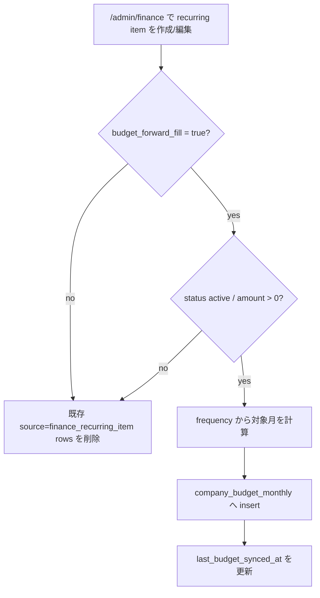
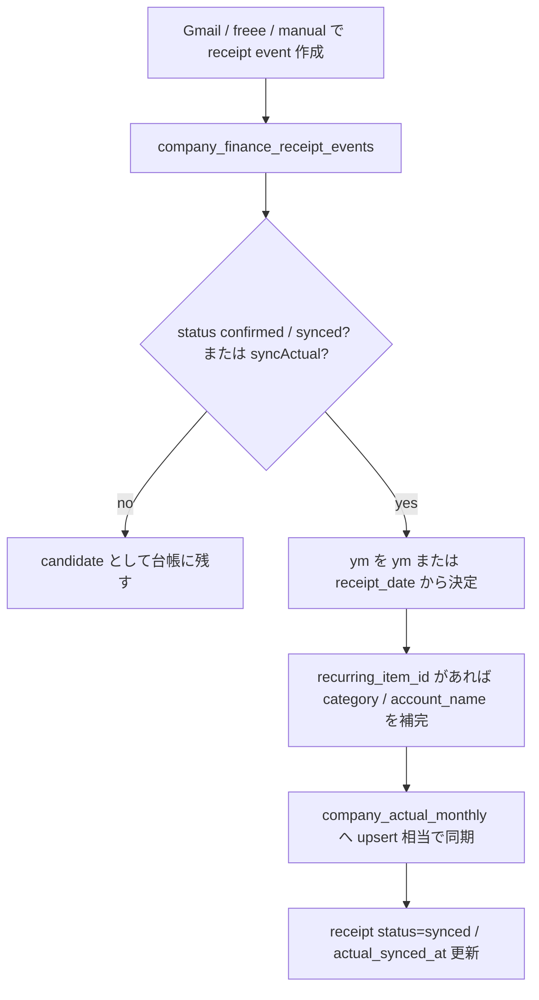
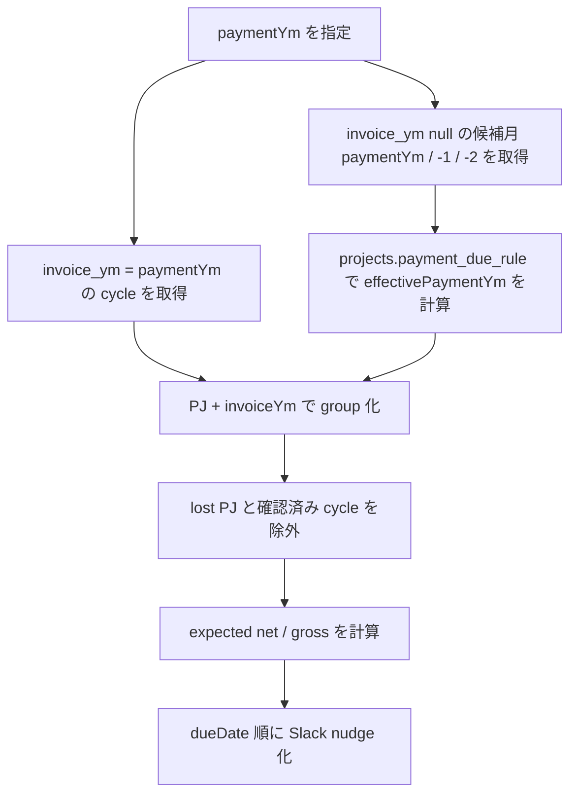

# 25. Finance / Payment Confirm 仕様

`/admin/finance` と `/payment-confirm` は、月次 PL / 請求 / 入金確認の裏側を支える admin 運用。ここでは、固定費台帳、領収書イベント、入金確認 nudge、signed token の流れをまとめる。

## 25.1 画面と役割

| 画面 / API | 役割 |
|---|---|
| `/admin/finance` | サブスク / 固定継続費 / 自動振替 / 引落口座 / 領収書イベントの admin 台帳 |
| `/api/admin/finance/recurring` | 継続費 item の作成・更新・予算 forward-fill |
| `/api/admin/finance/receipts` | 領収書 event の作成・実績同期 |
| `/api/cron/payment-confirm-nudges` | 支払月ごとの未入金 PJ を admin Slack DM へ通知 |
| `/api/admin/payment-confirm` | signed token を検証し、入金確認を `billing_cycles` に反映 |
| `/payment-confirm` | Slack の「金額を入力」から開く公開フォーム |

`/admin/finance` は会社全体の固定費・領収書オペ、`/payment-confirm` は PJ 請求の入金確認オペ。どちらも Management Score の財務系 raw signal に入る。

## 25.2 Admin Finance のデータモデル

| table | 役割 | 主な状態 |
|---|---|---|
| `company_finance_recurring_items` | 毎月・年次・単発の固定費候補。サブスク、自動振替、引落口座、budget forward-fill を持つ | `status`, `frequency`, `budget_forward_fill`, `last_budget_synced_at`, `last_receipt_at` |
| `company_finance_receipt_events` | Gmail / freee / manual 由来の領収書イベント。継続費の証跡にもなる | `candidate`, `confirmed`, `synced` |
| `company_budget_monthly` | 予算側への forward-fill 出力先 | `source='finance_recurring_item'` |
| `company_actual_monthly` | 領収書 event の実績同期先 | `source_ref='company_finance_receipt_events:{id}'` |

初期 seed は GAS 月次 PL baseline から作る。ただし二重計上を避けるため、既存 baseline に含まれる固定費は `budget_forward_fill=false` で始める。

## 25.3 `/admin/finance` の読み方

| ブロック | 読むもの |
|---|---|
| KPI | active item 数、monthly run-rate、自動振替、budget forward-fill 件数 |
| 役員除外分 | `members.is_officer=true` の報酬が `/admin/payouts` から除外され、AMD 運営費へ残る金額 |
| Recurring items | 固定継続費の金額、頻度、開始月、終了月、引落口座、予算反映 |
| Receipt events | 領収書候補、金額、発生日、vendor、実績同期状態 |

役員除外分は支払通知書の対象外にした金額を、会社側の運営費として見落とさないための表示。支払通知書の配分ロジックそのものは `/admin/payouts` と `billing_cycles.reward_summary_json` が正本。詳細は [31 章 Admin Payouts / 支払通知書](31-admin-payouts-reward-notice-spec.md) を見る。

## 25.4 Budget Forward-Fill

Recurring item は、`budget_forward_fill=true` かつ `status='active'` かつ `amount_yen > 0` の時だけ予算へ同期する。

対象月の考え方:

| frequency | 対象月 |
|---|---|
| `monthly` | 現在月から最大 24 か月先まで |
| `annual` | 現在月以降、12 か月刻み |
| `one_time` / `unknown` | `start_ym` の 1 行だけ |

同期時は同じ item の既存 `company_budget_monthly` rows を削除してから入れ直す。`source_ref` は `company_finance_recurring_items:{id}`。

## 25.5 Receipt Event Sync

領収書 event は、確認後に会社実績へ同期する。

同期先の `company_actual_monthly` は `scope='company'`、`project_id=null`。同じ `receipt.id` の実績は一度削除してから insert するので、再同期しても二重計上しない。

## 25.6 Payment Confirm Group の作り方

入金確認 nudge は、支払月 `paymentYm` に対して未入金の `billing_cycles` を PJ ごとにまとめる。

`effectivePaymentYm` は `billing_cycles.invoice_ym` があればそれを優先し、空なら `/admin/projects` の支払条件 (`projects.payment_due_rule`, `payment_due_day`) から計算する。

予定金額の優先順位:

| 優先 | 入力 |
|---|---|
| 1 | `billing_cycles.budget_reported_amount` |
| 2 | `billing_cycles.invoice_base_lines_json` の明細合計 |
| 3 | `billing_cycles.budget_yen / 0.65` |

税抜予定額を合算し、税込予定額は `net * 1.1` で計算する。

## 25.7 Slack Nudge と Signed Token

`payment-confirm-nudges` は active admin (`members.is_admin=true`, `status='active'`, `slack_id` あり) に Slack DM を送る。

| ボタン | URL | 何が起きるか |
|---|---|---|
| 予定通り入金済み | `/api/admin/payment-confirm?mode=expected&token=...` | 予定税込額で即時反映 |
| 金額を入力 | `/payment-confirm?token=...` | 入金額とメモを入力して反映 |

token は `projectId`, `invoiceYm`, `sourceYms`, `expectedAmountYen`, `expectedNetAmountYen`, `recipientSlackId`, `exp` を持ち、HMAC-SHA256 で署名する。secret は `PAYMENT_CONFIRM_TOKEN_SECRET`、未設定なら `CRON_SECRET` を使う。デフォルト有効期限は 14 日。

`/payment-confirm` は login 前提ではなく、token 検証だけで開く。Slack DM から admin がすぐ入金確認するための公開フォームなので、token の期限と署名が権限境界になる。

## 25.8 入金確認の保存先

入金確認が通ると、対象 group の `sourceYms` に含まれる `billing_cycles` をまとめて更新する。

| 保存先 | 書く内容 |
|---|---|
| `billing_cycles.payment_confirmed_at` | 確認時刻 |
| `billing_cycles.payment_confirmed_by` | `slack:{recipientSlackId}` または `slack:payment-confirm` |
| `billing_cycles.status` | `payment_confirmed` |
| `billing_log` | `action='payment_confirmed'` の証跡 |
| `billing_log.detail` | source、invoice_ym、source_yms、実額、予定額、メモ、recipient、freee payload |

同じ group に複数月の cycle が入っている場合は、全 cycle に同じ入金確認を反映し、`billing_log` は cycle ごとに残る。

## 25.9 freee Payment Sync との関係

`freee-payment-sync` も `confirmPaymentGroup` を使う。違いは起点だけ。

| 起点 | source | 主な用途 |
|---|---|---|
| Slack 予定通り | `slack_expected` | 人間が予定額どおり入金を確認 |
| Slack 金額入力 | `slack_actual` | 実入金額が予定と違う / メモが必要 |
| freee 入金 | `freee_deal` / `freee_wallet_txn` | freee 側の入金・明細と照合 |

どの起点でも、最終的な正本は `billing_cycles.payment_confirmed_at` と `billing_log.detail`。

## 25.10 トラブル時

| 症状 | 見る場所 |
|---|---|
| Slack が飛ばない | `SLACK_BOT_TOKEN`, admin の `slack_id`, `/api/cron/payment-confirm-nudges?dryRun=1` |
| nudge 対象が出ない | `paymentYm`, `billing_cycles.invoice_ym`, `/admin/projects` の支払条件, `payment_confirmed_at` |
| token invalid | `PAYMENT_CONFIRM_TOKEN_SECRET` / `CRON_SECRET`, URL の token 欠損, 期限切れ |
| 金額が期待と違う | `budget_reported_amount`, `invoice_base_lines_json`, `budget_yen`, 0.65 fallback |
| 固定費が二重計上される | `budget_forward_fill`, `company_budget_monthly.source='finance_recurring_item'`, GAS baseline |
| 領収書実績が重複する | `company_actual_monthly.source_ref='company_finance_receipt_events:{id}'` |

## 25.11 関連

- [04 章 admin オペ](04-admin-ops.md)
- [22 章 通知・つくよみ](22-notifications-and-tsukuyomi.md)
- [24 章 Operations Settings](24-operations-settings-spec.md)
- `pwa/design/project_pl_monthly.md`
- `pwa/design/notifications.md`
- `pwa/scripts/migrations/068_finance_operations.sql`
