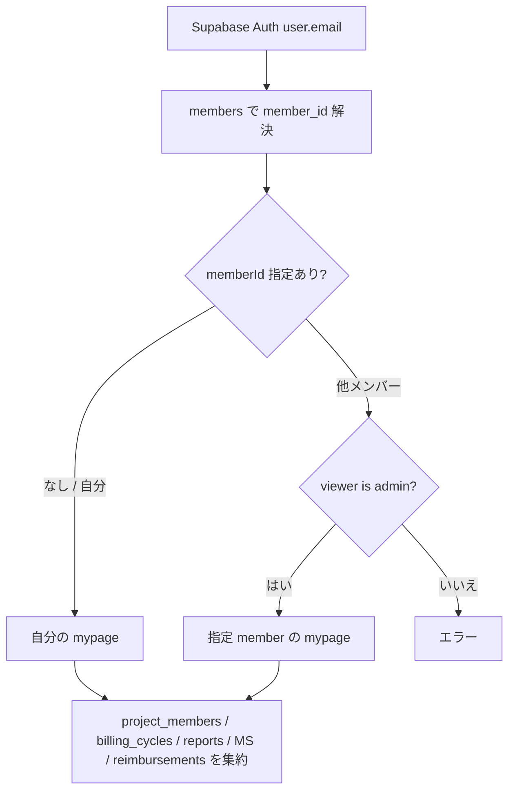
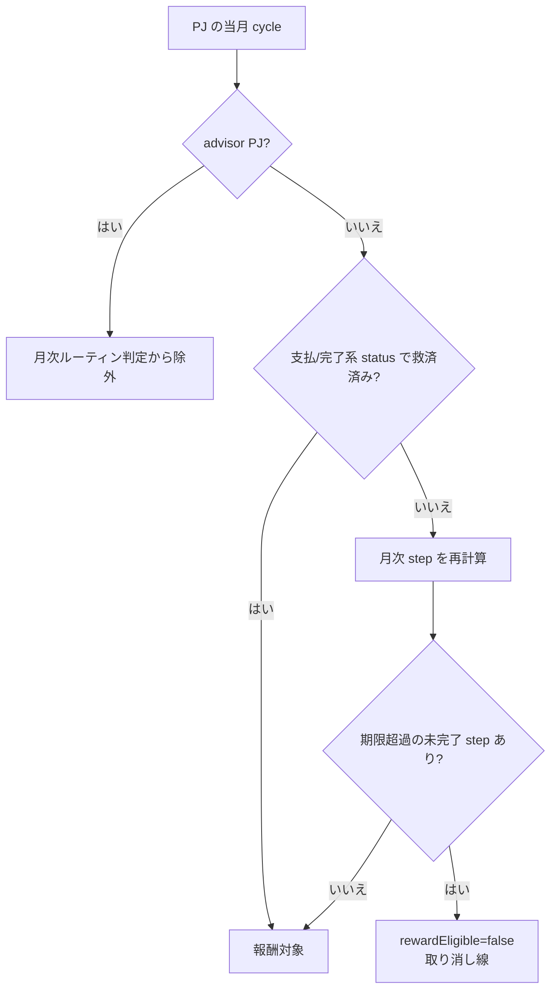
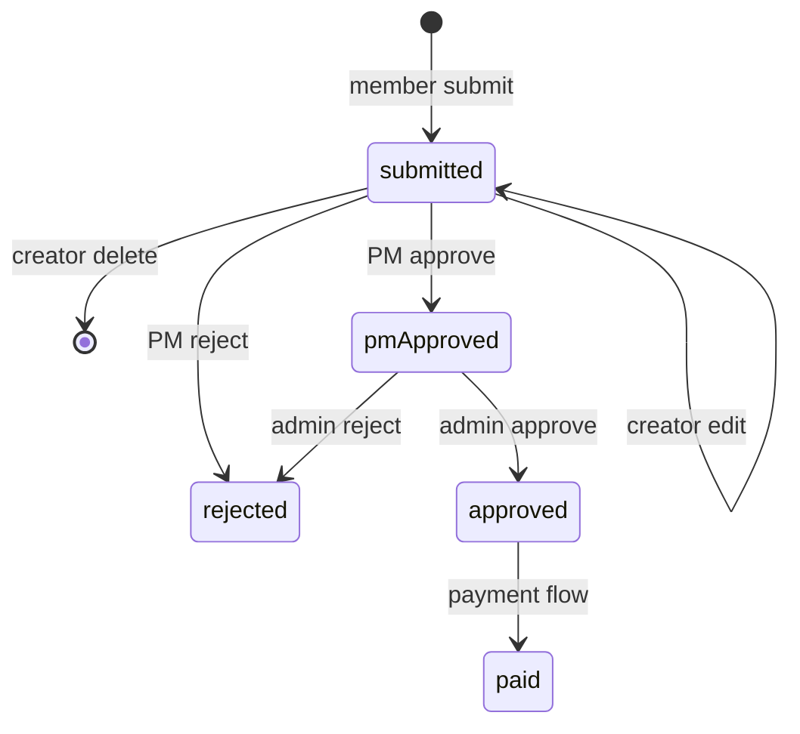
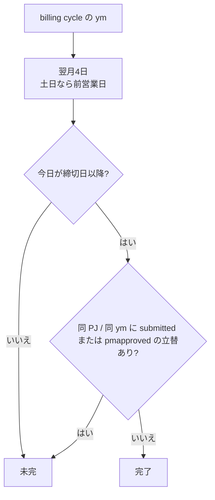
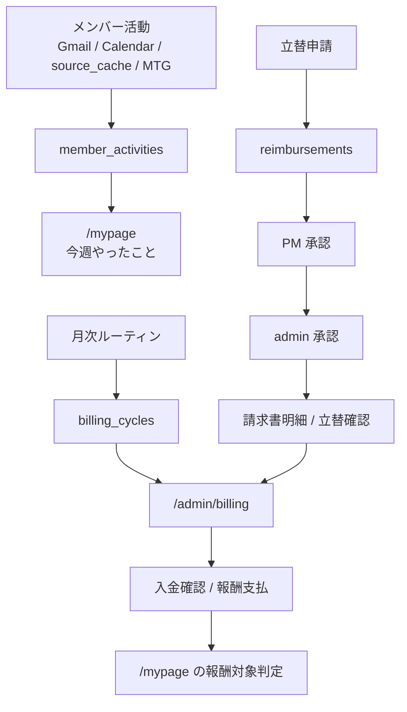

# 26. Member Ops / Billing / Prompt 仕様

`/mypage`、`/reimburse`、`/admin/billing`、`/admin/prompts` の詳細仕様。日常の使い方は [10 章](10-member-workflows-quick-start.md) を読む。

## 26.1 対象画面

| 画面 | 主な役割 |
|---|---|
| `/mypage` | ログインメンバーの参加 PJ、当月報酬、月次TODO、週次活動 |
| `/reimburse` | 立替申請、領収書添付、PM / admin 承認 |
| `/admin/billing` | SU × 月の請求・支払 step マトリクス |
| `/admin/prompts` | `llm_prompts` と `tsukuyomi_context` の確認 / 編集 |

## 26.2 `/mypage` のデータ組み立て

`/mypage` は Supabase を直接読んで、ログイン中メンバーの画面を組み立てる。

表示範囲は当月 + 過去 6 ヶ月。進捗差分を出すために、MS 進捗だけは前月分も参照する。

### 主なデータ源

| データ | テーブル / route | 備考 |
|---|---|---|
| メンバー解決 | `members.email` | auth email と照合 |
| 参加 PJ | `project_members.is_active=true` | PM / PL role もここで見る |
| PJ メタ | `projects` | `lost` は除外 |
| 報酬 | `billing_cycles.reward_summary_json.members.totalPay` | 無い時は `member_allocations_json[memberId]` を見る |
| MS 進捗 | `value_plan_cycles`, `value_milestones`, `milestone_monthly_progress` | 当月増分を表示 |
| 月次コメント | `monthly_reports.section_members` | メンバー別 section を表示 |
| 週次活動 | `member_activities` | 今週(月-日 JST)の最大 60 件を取得し、表示は最大 8 件 |
| 立替未処理 | `reimbursements` | `submitted` / `pmapproved` が残っているかで立替確認を判定 |

## 26.3 報酬対象外の判定

PJ カードの報酬は、期限超過の月次ルーティンが残っていると当月報酬から除外する。

救済済みとみなす状態:

| 条件 | 意味 |
|---|---|
| `billing_cycles.status` が `payment_confirmed` / `reward_paid` / `completed` | admin 側で完了扱い |
| `payment_confirmed_at` がある | 入金確認済み |
| `reward_paid_at` がある | 報酬支払済み |

## 26.4 月次TODOの role 判定

`/mypage` の「いまやること」は、PJ 参加 role で絞る。

| role | 表示するTODO |
|---|---|
| `is_pm=true` | PJ の月次ルーティン全体 |
| `is_pl=true` かつ `is_pm=false` | `請求額確定` だけ |
| 参加メンバーのみ | 月次TODOは出さない |
| advisor PJ | 月次TODOを出さない |

通知は当月と翌月を見て、`current` / `warn` / `overdue` の未完了 step を最大 6 件表示する。

### 締切日

すべて土日なら前営業日に寄せる。

| step | 標準 PJ | CTB PJ | 完了判定 |
|---|---|---|---|
| 見積書送付 | なし | 前月 28 日 | `invoice_base_lines_json` に `[[CTB_ESTIMATE_SENT]]` |
| 請求額確定 | 前月 25 日 | 前月 28 日 | `budget_confirmed_at` or `status='budget_confirmed'` |
| 報告会日程調整 | 当月 20 日 | 当月 20 日 | `meeting_event_id` or `meeting_start_at` |
| 月次報告書FIX | 翌月 3 日 | 翌月 3 日 | `report_fixed_at` |
| 立替精算確認 | 翌月 4 日 | 翌月 4 日 | 締切後、未処理立替がなければ完了 |
| 請求書発行 | 翌月 8 日 | 当月 28 日 | `invoice_issued_at` |
| 請求書送付 | 翌月 9 日 | 当月 28 日 | `invoice_sent_at` |

`立替精算確認` は手動変更不可。締切日前は未完、締切日以降に `reimbursements.status` が `submitted` / `pmapproved` の行がなければ完了。

`billing_cycles.invoice_ym` が稼働月と違う場合、`/mypage` の TODO / 報酬除外判定では `reportFix` 以外を対象外にする。まとめ請求月側の cycle で、見積送付 / 請求額確定 / 報告会日程調整 / 立替確認 / 請求書発行・送付をまとめて判定する。

MS 進捗、月次報告書、月次ノート、つくよみ修正依頼の保存ロジックは [36 章 MS Progress / Monthly Report / Revision Loop](36-ms-progress-monthly-report-revision-spec.md) を見る。

## 26.5 `/reimburse` と `reimbursements`

立替申請は、PWA form から `/api/reimbursements` へ `FormData` で送る。

### 入力と保存

| 項目 | 保存先 / 仕様 |
|---|---|
| `project_id`, `project_name` | active PJ から選択 |
| `date` | 発生日 |
| `category` | `transport` / `lodging` / `supplies` / `meal` / `other` |
| `amount` | 税込金額。交通費 `round` は保存時に 2 倍 |
| `tax_rate` | 0.1 / 0.08 / 0 |
| `description` | 必須 |
| `transport_*` | 交通費のみ、手段 / 出発 / 到着 / 片道往復 |
| `receipt_storage_paths`, `receipt_file_names` | private Storage `reimbursement-receipts` |

領収書は PNG / JPEG / WebP / PDF、1 ファイル 10MB まで。Storage path は `${userId}/${reimbursementId}/${timestamp}-${index}-${safeName}`。

DB 保存に失敗した場合、新規アップロード済みファイルは削除して残骸を残さない。

### 権限と status

| 操作 | 条件 |
|---|---|
| 作成 | Supabase Auth 済みユーザー |
| 編集 | `created_by` が自分、かつ `status='submitted'` |
| 削除 | `created_by` が自分、かつ `status='submitted'` |
| PM 承認 | 対象 PJ の `project_members.is_pm=true` |
| admin 承認 | `members.is_admin=true` |
| 領収書閲覧 | private bucket の signed URL。画面では 1 時間 URL を作る |

## 26.6 `/admin/billing`

`/admin/billing` は SU × 月の月次 step を一覧する admin 画面。対象月は基準月から 11 ヶ月前〜翌月の 13 ヶ月分。

請求書 / 見積書の freee 発行、Edge Function、legacy route の扱いは [32 章](32-invoice-and-billing-routine-spec.md) を見る。

対象 PJ:

| PJ 状態 | 扱い |
|---|---|
| `active` | 対象 |
| `frozen` | 対象 |
| `ended` | `cycle.ym <= projects.end_ym` のものだけ対象 |
| その他 | 原則対象外 |

### step chip

| chip | 更新列 |
|---|---|
| 予算確定 | `status`, `budget_confirmed_at/by` |
| 見積送付 | `invoice_base_lines_json` の `[[CTB_ESTIMATE_SENT]]` marker |
| 報告会 | `meeting_event_id`; skip は `skipped` |
| 報告書 | `report_fixed_at/by` |
| 立替確認 | 自動判定。手動変更不可 |
| 請求発行 | `invoice_issued_at/by`; 未完に戻すと `invoice_sent_at` も戻す |
| 請求送付 | `invoice_sent_at` |
| 支払通知 | `payout_notice_uploaded_at` |
| 入金確認 | `payment_confirmed_at/by`, `status='payment_confirmed'` |
| 報酬支払 | `reward_paid_at/by` |

入金確認 / 報酬支払を完了にする時、入金前 step に未完了が残っている場合は保存せず、未完了 step を表示する。詳細 dialog では Supabase Edge Function `send-payment-delay-nudge` を呼び、未完了メンバーへ nudge を送れる。

### 立替確認の admin 判定

## 26.7 `/admin/prompts`

`/admin/prompts` は、LLM prompt を DB 正本として管理する画面。コードに長い prompt を hardcode しないための運用 UI。

| DB | 役割 |
|---|---|
| `llm_prompts` | PWA / cron / LLM 機能が読む prompt 正本 |
| `tsukuyomi_context` | 本体スプシ `DB_TsukuyomiContext` 由来の旧 context 群。PWA では閲覧中心 |

`llm_prompts` の主要列:

| 列 | 意味 |
|---|---|
| `prompt_key` | 機能識別子。例: `tsukuyomi.system`, `protocol.extract`, `member_activities.extract` |
| `body` | system prompt / instruction 本文 |
| `model` | 使う LLM model |
| `max_tokens` | 出力上限 |
| `is_active` | 有効化フラグ |
| `notes` | 運用メモ |
| `updated_by`, `updated_at` | `/api/admin/prompts/[id]` が auth user email と時刻を保存 |

多くの LLM route は `prompt_key` + `is_active=true` + `body` を必須にする。空なら 500 / skip で止め、`/admin/prompts` で本文を入れて activate する。例外として、`monthly_report.r313_extract` は旧 GAS 互換の事情で `is_active` を無視して本文を読む。

`tsukuyomi_context` は `tags` / `priority` / `system_prompt` を表示する。正本はスプシ側なので、編集はスプシで行う。

## 26.8 end-to-end フロー

## 関連

- 使い方: [10 章 メンバーの日常ワークフロー](10-member-workflows-quick-start.md)
- 月次ルーティン: [01 章 1.5](01-pj-cockpit.md#15-月次ルーティン--報告書--請求--会計)
- MS進捗 / 月次報告書: [36 章](36-ms-progress-monthly-report-revision-spec.md)
- admin オペ: [04 章](04-admin-ops.md)
- 通知 / 正本反映: [22 章](22-notifications-and-tsukuyomi.md)
- Finance / Payment Confirm: [25 章](25-finance-payment-confirm-spec.md)
