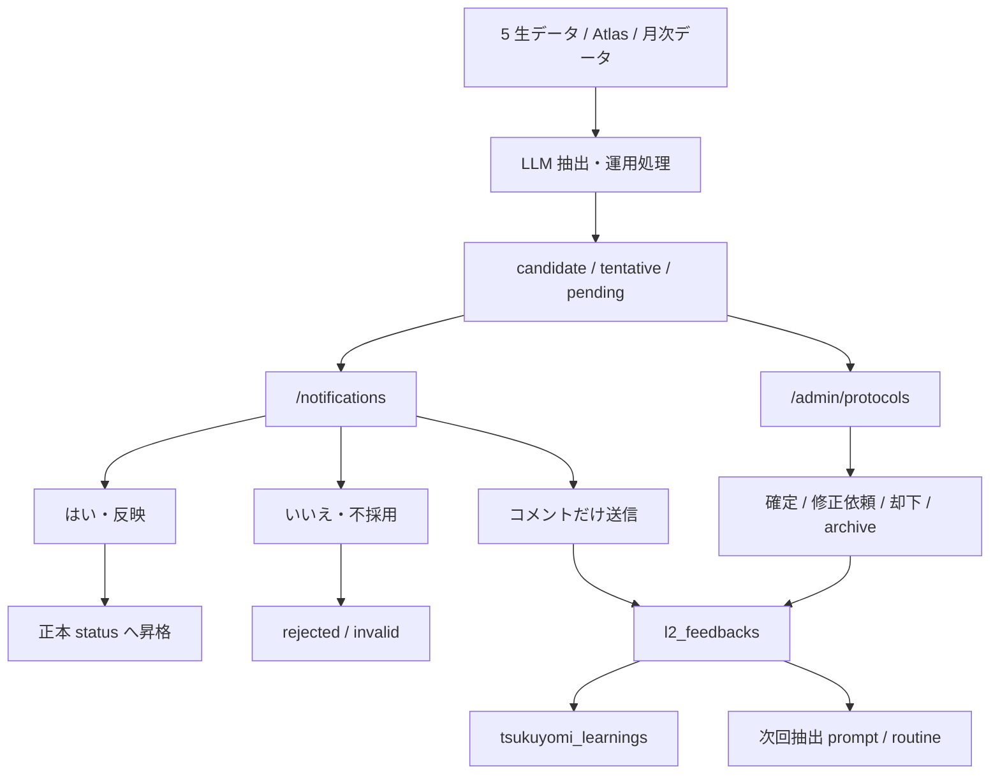
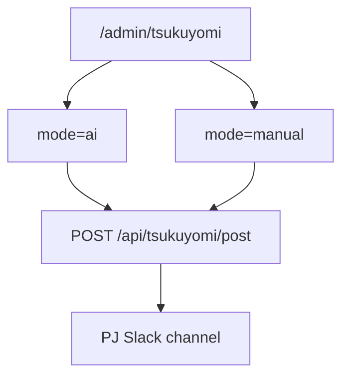

# 27. Knowledge Admin / Tsukuyomi 仕様

`/admin/protocols`、`/admin/contexts`、`/admin/tsukuyomi`、`/api/notifications/feedback` の仕様をまとめる章。ここは「LLM が作った知識候補をどう確認し、どう学習へ戻すか」の運用レイヤー。

## 27.1 この章の対象

| 画面 / API | 役割 | 主なテーブル |
|---|---|---|
| `/admin/protocols` | AMD Protocol 候補の確認、確定、修正依頼、archive | `protocols`, `protocol_examples`, `protocol_result_observations` |
| `/admin/contexts` | LLM context の一覧編集 | `tsukuyomi_context` |
| `/admin/tsukuyomi` | つくよみ投稿、学習メモ、人格 DB layer 編集 | `tsukuyomi_context`, `tsukuyomi_learnings`, `tsukuyomi_learnings_status` |
| `/api/notifications/feedback` | 通知への「はい / いいえ / コメント」を保存し、必要なら候補を正本反映 | `l2_feedbacks`, L2 各テーブル, `tsukuyomi_learnings` |

`/admin/prompts` は LLM prompt 本文そのものの編集、`/admin/contexts` / `/admin/tsukuyomi` は context / 人格 / 学習メモの運用、`/notifications` は候補採否の入口。

## 27.2 知識候補の基本フロー



LLM が直接「正本」を決めるのではなく、候補を作り、人間が採否する。コメントは `l2_feedbacks` に残り、`tsukuyomi_learnings` にも要約される。

## 27.3 `/admin/protocols`

AMD Protocol は、AMD の判断を再利用できる形で残す知識。単なる事実ではなく、似た分岐点にまた出会った時に使える判断パターンを扱う。

### テーブルの分担

| テーブル | 役割 |
|---|---|
| `protocols` | 普遍的な意思決定パターン。`project_id=null`, `kind='pattern'`, `is_universal=true` が新形式 |
| `protocol_examples` | 具体事例。`project_id`, `occurred_on`, `summary`, 事例側の 3 要素を持つ |
| `protocol_result_observations` | 後追いの結果観測。短期 / 中期 / 長期の結果を append-only で積む |

### 4 要素

| 要素 | 意味 | 自動抽出での扱い |
|---|---|---|
| ① 分岐点 | どの選択肢があったか | 保存する |
| ② 判断材料 | 何を見て判断したか | 保存する |
| ③ アクション | どの方針を採ったか | 保存する |
| ④ 結果 | アクション後に実際に起きたこと | 推測で埋めない。後から観測として保存 |

`AdminProtocolsClient` は `content` 内の見出しを `parseFourElements()` で分解し、ステップカードとして表示する。`protocol_examples` があれば「関連事例」として表示する。

### 画面操作

| 操作 | 何が起きるか |
|---|---|
| `確定` | `protocols.status='confirmed'` に更新 |
| `修正依頼` | `localStorage["tsukuyomi:pending-prefill"]` に修正依頼文を入れ、つくよみ chat drawer を開く |
| `却下` | `protocols.status='rejected'` に更新 |
| `archive` | `protocols.status='archived'` に更新 |
| `＋ 追加` | `source='manual'`, `kind='pattern'`, `status='candidate'` の手動 protocol を追加。本文は `content` に 4 要素 markdown として保存 |
| `旧形式を全部 archive` | `kind='legacy_specific'` かつ未 archive の旧候補をまとめて archive |

### status の注意

`/admin/protocols` の UI 正本は `candidate -> confirmed / rejected / archived`。2026-05-25 #59 以降、`/api/notifications/feedback` で `l2_kind='protocols'` に「はい」を押した場合も `status='confirmed'` へ更新する。旧 `active` は使わない。

## 27.4 `/admin/contexts`

`/admin/contexts` は `tsukuyomi_context` の汎用編集画面。LLM に渡す context を、`context_id` / `tags` / `priority` / `system_prompt` / `status` で管理する。

| 項目 | 意味 |
|---|---|
| `context_id` | context の一意 ID |
| `tags` | 用途タグ。例: `tsukuyomi`, `monthlyreport`, `rewardscoring` |
| `priority` | 表示・合成時の優先度。数字の扱いは呼び出し側ごとに確認する |
| `system_prompt` | LLM へ渡す context 本文 |
| `status` | `active` / `archived` |

できること:
- 検索: `context_id` / `tags` / `system_prompt`
- `status` フィルタ
- tag フィルタ
- 新規作成
- 既存行の編集
- archive

`/admin/prompts` が「prompt 本文」、`/admin/contexts` が「追加 context」、`/admin/tsukuyomi` が「つくよみ人格・学習運用」と考える。

## 27.5 `/admin/tsukuyomi`

`/admin/tsukuyomi` は 3 つの機能を持つ。

| ブロック | 役割 | 現状 |
|---|---|---|
| PJ チャンネルへ強制発言 | PJ の Slack チャンネルへ AI 生成または手書きで投稿 | 2026-05-25 #57 以降、ボタンは disabled。#58 で route は 501 placeholder 化 |
| つくよみ学習状況 | 修正依頼・確定内容から蓄積した学習メモを見る | `tsukuyomi_learnings` + `tsukuyomi_learnings_status` |
| 人格 DB 編集 | `tsukuyomi_context` を layer ごとに編集 | `judge / role / memory / tone / safety` を `tags` で保持 |

### 強制発言

PWA 画面は `POST /api/tsukuyomi/post` を呼ぶ。



2026-05-25 #58 時点では `pwa/src/app/api/tsukuyomi/post/route.ts` は存在するが、実投稿は行わない 501 placeholder。route 冒頭で `requireAdmin()` を通し、未ログインは 401、非 admin は 403、admin request は 501 を返す。旧 GAS Admin には `admin_tsukuyomi_generateAndPost` / `admin_tsukuyomi_postToProjectChannel` の設計が残っているため、PWA で使うには Slack/GAS bridge、AI生成、`@here` / `@channel` 暴発防止、送信ログを実装してから UI を enable にする。#57 以降、PWA UI は壊れた fetch を出さないよう投稿ボタンを disabled にしている。

### 学習メモ

`/admin/tsukuyomi` は `tsukuyomi_learnings` と `tsukuyomi_learnings_status` を統合して表示する。

| source | 使われ方 |
|---|---|
| `notification_feedback` | `/notifications` の「はい / いいえ / コメント」から作られる |
| `tsukuyomi_revision` | 月次進捗などの修正依頼から作られる |
| `pj_status:<scope>` | `tsukuyomi_learnings_status` 由来の PJ status 学習を memory layer として表示 |

検索対象は `scope`, `scope_key`, `source`, `content`。`status='active'` が通常表示、`removed` は過去の学習として残る。

### 人格 DB layer

PWA 側の layer editor は次の 5 層で整理する。`tsukuyomi_context` schema には `context_type` 列が無いため、2026-05-25 #60 以降、layer は `tags` に `judge` / `role` / `memory` / `tone` / `safety` のどれかを含めて表す。

| layer | 役割 |
|---|---|
| `judge` | 判断基準 |
| `role` | 役割 |
| `memory` | 記憶 |
| `tone` | 口調 |
| `safety` | 安全ガード |

GAS 側の `172_TsukuyomiContextRepo.js` は、`DB_TsukuyomiContext` から `tags` に `tsukuyomi` を含む `active` 行を集め、`role -> rules -> format -> tone` の順で system prompt を合成する。観測ブロックと記憶ブロックを足し、最後に intent 別の最小制約を入れる。

PWA の保存 payload は `context_id`, `tags`, `priority`, `system_prompt`, `status` のみ。新規作成では `context_id` と `system_prompt` が必須。編集画面の layer select は DB へ `context_type` としては保存せず、選んだ layer tag を `tags` に追加し、既存の layer tag は置き換える。

## 27.6 `/api/notifications/feedback`

通知への回答 API。admin only。

### 入力

```json
{
  "l2_kind": "project_strategy_signal",
  "target_id": "p21",
  "scope_key": "202605",
  "notification_id": "uuid",
  "meeting_id": null,
  "feedback_text": "ここはLOIではなくNDA",
  "action": "comment"
}
```

`action` は `yes` / `no` / `comment`。`comment` の時だけ `feedback_text` 必須。`yes` / `no` はコメントなしでも保存できる。

### 保存されるもの

| 保存先 | 内容 |
|---|---|
| `l2_feedbacks` | 回答本体。`[はい]` / `[いいえ]` の prefix もここに入る |
| `tsukuyomi_learnings` | 通知回答の学習メモ |
| L2 正本テーブル | `yes` / `no` の時だけ、許可された kind を status 更新 |

### 反映ルール

| l2_kind | yes | no / reject |
|---|---|---|
| `meeting_summary` | GAS `nav_meeting_processOneEvent_` を同期実行し、通知側 summary も更新 | コメントのみでは正本反映しない |
| `member_knowledge` | `candidate -> active` | `candidate -> rejected` |
| `project_knowledge` | `candidate -> active` | `candidate -> rejected` |
| `protocols` | `candidate -> confirmed` | `candidate -> rejected` |
| `founding_members` | `tentative -> active` | `tentative -> invalid` |
| `project_member_candidate` | `project_members` へ upsert | 自動 reject handler なし |
| `project_contact_candidate` | 外部メールだけ `projects.report_emails` へ追加 | 自動 reject handler なし |
| `project_registry_diff` | allowlist 済みの DB 更新を実行し `applied` | `rejected` |
| `xrl_evidence` | `candidate -> confirmed` | `candidate -> rejected` |
| `project_strategy_signal` | `candidate -> confirmed` | `candidate -> rejected` |
| `ms_progress` | 月次モーダルの revision confirm が正本 | API では自動反映しない |

### 即時再抽出

回答保存後、対応している kind は GAS WebApp の `pwaApi/runFunc` を呼ぶ。

| l2_kind | runFunc |
|---|---|
| `meeting_summary` | `nav_meeting_processOneEvent_` |
| `member_knowledge` | `nav_member_knowledge_extractOne_` |
| `project_knowledge` | `nav_project_knowledge_extractOneForYm_` |
| `protocols` | `nav_protocol_extractOneForYm_` |

`NEXT_PUBLIC_GAS_WEBAPP_URL` と `NEXT_PUBLIC_GAS_API_KEY`、または `CRON_SECRET` が必要。`meeting_summary` の「はい」は同期的に成功確認し、失敗したら 502 を返す。他 kind は fire-and-forget。

## 27.7 既知ギャップ

2026-05-25 時点で、次は manual 化だけでなく実装修正が必要。

| ギャップ | 影響 |
|---|---|
| `/api/tsukuyomi/post` が 501 placeholder | `/admin/tsukuyomi` の強制投稿は disabled。API 本実装まで投稿は旧 GAS Admin / Slack 手動 |
| L2 ②④⑤⑥ の旧 writer 停止中 | protocol / project knowledge / member knowledge / meeting summary の新規抽出は Claude routine 復旧待ち |

## 27.8 関連

- [07 章 判断エンジン](07-atlas-protocol-score-macrotrend.md)
- [22 章 通知・つくよみ](22-notifications-and-tsukuyomi.md)
- [26 章 Member Ops / Billing / Prompt](26-member-billing-prompts-spec.md)
- [`pwa/design/amd_protocol.md`](../design/amd_protocol.md)
- [`pwa/design/notifications.md`](../design/notifications.md)
- [`pwa/design/L2_DATA.md`](../design/L2_DATA.md)
