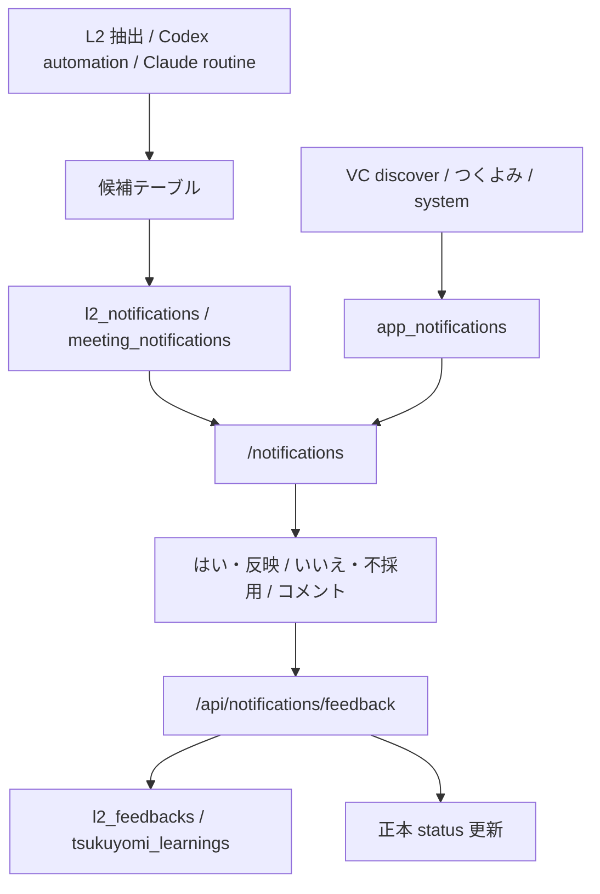
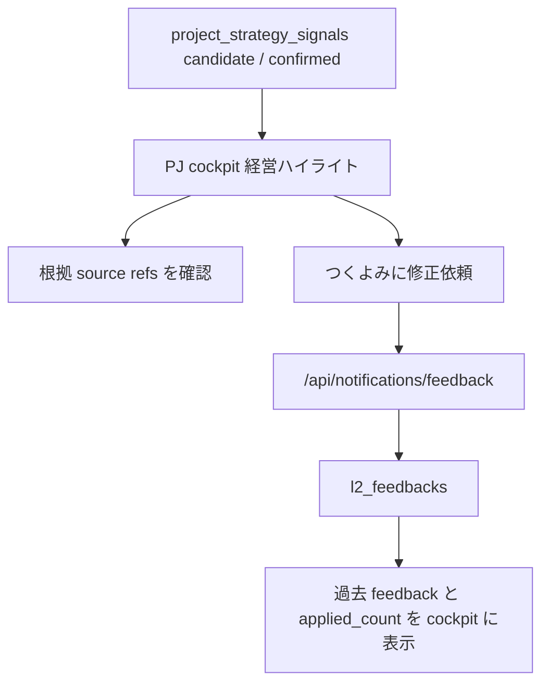

# 28. 通知レビュー UI / 経営ハイライト確認仕様

この章は `/notifications` と cockpit 内の経営ハイライト確認 UI の詳細仕様。22 章が「通知と正本反映ゲートの考え方」なら、この章は **実際の画面で何が見えて、どの DB 行がどう動くか** を扱う。

## 28.1 画面の役割

`/notifications` は admin 専用の確認センター。LLM / automation が作った候補を、OS 正本へ入れてよいか判断する場所。

`/notifications` は server page で `members.is_admin` を確認する。admin でなければ `notFound()`。一般メンバーの日常導線には出さない。

## 28.2 通知セクション

| セクション | コンポーネント | 主なテーブル | 役割 |
|---|---|---|---|
| VC / Web 通知 | `AppNotificationsSection` | `app_notifications` | VC discover、つくよみ、system 由来のお知らせ |
| L2 / MTG 通知 | `NotificationsClient` | `l2_notifications`, `meeting_notifications`, `l2_feedbacks` | L2 候補・議事録候補の採否確認 |

### VC / Web 通知

`app_notifications` は L2 反映ゲートではない。未読 / 全部の切替、全部既読、個別既読、削除を持つ。

| 操作 | DB / UI の動き |
|---|---|
| 未読 / 全部 | `includeRead` を切り替えて fetch |
| 全部既読 | 未読をまとめて read 扱いへ |
| 既読 | 個別 `read_at` を更新 |
| 削除 | dismiss 扱いにして一覧から外す |

空の場合は「次の cron は毎週土曜 09:00 JST」と表示する。これは VC discover 系の運用目安。

## 28.3 L2 / MTG 通知のフィルタ

`NotificationsClient` は L2 通知 100 件、MTG 通知 100 件、feedback 200 件を受け取り、作成日時降順で統合する。

| フィルタ | 意味 |
|---|---|
| 未対応 | まだ `はい` / `いいえ` / `コメント` が送られていない |
| 未読 | `read_at` が空で、かつ未回答 |
| 回答済み | 既存 feedback がある、またはこのセッションで回答済み |
| 修正依頼あり | 同じ `(l2_kind, target_id, scope_key)` に feedback がある |

カードを展開すると `read_at` を保存して既読扱いにする。`未読に戻す` を押すと `read_at=null` に戻す。回答送信に成功した通知は未対応 / 未読から外れ、回答済みに移る。

## 28.4 既読と回答済みの判定

UI は server 値とローカル状態を組み合わせて、画面遷移なしで自然に状態が変わるようにしている。

| 判定 | 見ているもの |
|---|---|
| 既読 | `read_at`、このセッションの `readMap`、回答済み状態 |
| 未読へ戻す | `unreadOverride` + DB の `read_at=null` |
| 回答済み | 既存 `l2_feedbacks`、送信成功後の `answeredMap` |
| 修正依頼あり | 同 scope の feedback 件数 |

`notified_at` は iOS / APNs などの配信済み marker。PWA で読んだかどうかは `read_at` だけを見る。

## 28.5 カード展開時の詳細 fetch

通知カードは、展開されるまで詳細データを取りに行かない。候補テーブルが重いため、一覧初期表示を軽くするため。

| kind | 詳細表示で見る主なテーブル / 内容 | deep link |
|---|---|---|
| `member_knowledge` | `member_knowledge` の候補行 | text reference / admin members |
| `project_knowledge` | `project_knowledge`。`source='l2_hourly_extract'` を優先 | text reference |
| `protocols` | `scope_key=YYYYMM:protocol:<protocol_id>` を分解し、`protocols` + `protocol_examples` | `/admin/protocols` |
| `founding_members` | `project_founding_members` の更新候補。manual 上は「関連メンバー」と呼ぶ。HRL / FRL 詳細は [35 章](35-frl-related-members-score-spec.md) | PJ cockpit |
| `ms_progress` | `ms_progress_revisions` と現在の `milestone_monthly_progress` | `/project/{id}/cockpit?ym=YYYYMM` |
| `raw_data_gap` | `metadata_json.evidence_refs`。fallback は短い snippet のみ | PJ cockpit |
| `project_registry_diff` | `project_registry_diffs` の `proposed_patch_json` と根拠 | `/admin/projects` |
| `xrl_evidence` | `project_xrl_evidence`。axis / evidence kind / source hash で候補を特定 | PJ cockpit |
| `project_strategy_signal` | `project_strategy_signals`。type / impact / 根拠 / hash を表示 | PJ cockpit |
| MTG 通知 | `project_meeting_summaries` の narrative / decided / progress / next / risks | PJ cockpit |

`raw_data_gap` は本文全文を表示しない。通知が持つ `evidence_refs` を優先し、fallback でも `snippet` / `source_url` / hash / item_id までに絞る。後続 backfill の Slack / Gmail が混ざって「別の生データ取り込み通知」に見える事故を避けるため。

## 28.6 回答ボタンと正本反映

| ボタン | API action | 主な結果 |
|---|---|---|
| はい・反映 | `yes` | feedback 保存 + allowlist された候補を `active` / `confirmed` / `applied` へ |
| いいえ・不採用 | `no` | feedback 保存 + 候補を `rejected` / `invalid` へ |
| コメントだけ送信 | `comment` | feedback 保存のみ。正本 status は変えない |

`POST /api/notifications/feedback` の kind 別 status 更新は [27 章 27.6](27-knowledge-admin-tsukuyomi-spec.md#276-apinotificationsfeedback) を正本にする。meeting summary の「はい」は、再抽出 / 更新に失敗した場合に回答済みに移さない。

## 28.7 コスト表示

通知カードには概算コストを表示する。これは請求額の正本ではなく、どの抽出が重いかを人間が把握するための目安。

| kind | 目安 |
|---|---:|
| `member_knowledge` | 0.1 |
| `project_knowledge` | 0.2 |
| `protocols` | 0.3 |
| `ms_progress` | 0.1 |
| `project_registry_diff` | 0.2 |
| `xrl_evidence` | 2 |
| `project_strategy_signal` | 1 |
| `founding_members` | 10 |
| MTG summary | 0.2 |

重い候補ほど「本当に抽出経路として必要か」「batch / subscription 枠に寄せられないか」を後で見直す材料にする。

## 28.8 経営ハイライト cockpit 確認

`CockpitStrategySignals` は PJ cockpit 内で経営ハイライトを表示する。`project_strategy_signals` の `candidate` / `confirmed` を表示し、`rejected` / `archived` は出さない。

表示は次の 3 層で読む。

| 層 | UI | 主な値 |
|---|---|---|
| ぱっと見の性質 | polarity chip | `breakthrough` / `forward` / `pivot` / `risk`。無ければカテゴリ emoji fallback |
| 業務分類 | type chip + 左 border | 経営全般 / 事業開発 / 技術開発 / 外部環境 |
| 重要度 | impact chip | `low` / `medium` / `high` / `critical` |

業務分類:

| 分類 | 色 | 主な signal |
|---|---|---|
| 経営全般 | violet | `management_decision`, `strategic_pivot`, `funding`, `next_move` |
| 事業開発 | emerald | `business_progress`, `commercial_progress`, `partnership` |
| 技術開発 | sky | `tech_progress` |
| 外部環境 | amber | `ip_regulatory`, `risk` |

候補は「未確認」chip を付けて表示する。確認済みは chip なし。旧 `decision_state` は DB に残っているが、経営ハイライト UI の主表示軸にはしない。`score_impact_summary` がある場合は、AMD Score / XRL への影響を 1 行で表示する。

## 28.9 cockpit からの修正依頼

経営ハイライトの各行には `つくよみに修正依頼` がある。コメントを送ると `l2_feedbacks` に保存され、同じ signal の過去 feedback として cockpit 内に表示される。

| 表示 | 意味 |
|---|---|
| feedback 作成日時 / 作成者 | いつ誰が指摘したか |
| `applied_count` | 抽出 prompt に取り込まれた回数 |
| `last_applied_at` | 最後に上流抽出で使われた時刻 |
| 「次回抽出待ち」 | まだ prompt に取り込まれていない |

2026-05-25 時点では、経営ハイライト抽出 (`amd-os`) の prompt が `l2_feedbacks` をまだ読んでいない。つまり **UI 保存と履歴表示は動くが、次回抽出への自動反映は未完**。この gap は 05 章の責務分担表に残す。

## 28.10 既知ギャップ

| ギャップ | 状態 |
|---|---|
| L2 ⑨ 経営ハイライト feedback の prompt 反映 | 未実装。UI 保存 / 履歴表示はあり |
| L2 ②④⑤⑥ の上流 writer | 5/22 停止後 ghost。Claude routine 復旧予定 |
| `protocols` の `active` / `confirmed` status 差分 | 27 章と BUGS に記録済み |
| raw_data_gap fallback | 短い snippet のみ。全文表示は禁止 |

## 28.11 関連

- [22 章 通知・つくよみ修正依頼・正本反映ゲート](22-notifications-and-tsukuyomi.md)
- [27 章 Knowledge Admin / Tsukuyomi](27-knowledge-admin-tsukuyomi-spec.md)
- [`pwa/design/notifications.md`](../design/notifications.md)
- [`pwa/design/project_strategy_signals.md`](../design/project_strategy_signals.md)
