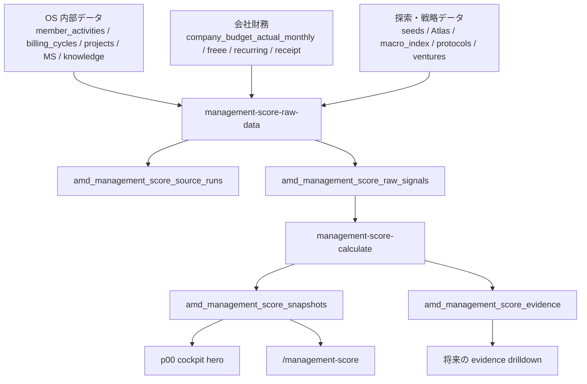
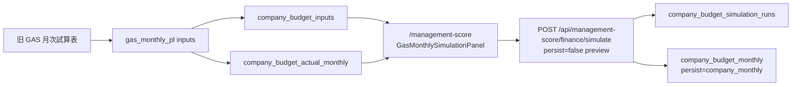

# 29. Management Score / Finance Simulation 仕様

AMD Management Score は、AMD 全社 (= `p00`) の経営状態を月次で見る 0-100 のスコア。PJ / SU の価値・成熟度を見る [21 章 AMD Score](21-amd-score-spec.md) とは別物。

> **UI 表記 (2026-05-25 まさ #71 確定)**: 「AMD Management Score」と「AMD Score」が紛らわしいため、`/dashboard` 等の UI 上では Management Score を **「バイタルサイン (VS)」** と表記する。本仕様 md ・ DB テーブル名 (= `amd_management_score_snapshots` 等) ・ `/management-score` ページ内タイトルは引き続き「AMD Management Score」のまま (= 文脈で明確、内部 ID として安定)。「バイタルサイン」は医療由来の Vital Signs メタファー (= 経営の脈拍・体力)。

## 29.1 何を見るスコアか

| スコア | 対象 | 主な問い | 主な画面 |
|---|---|---|---|
| AMD Score | PJ / SU | この PJ は Macrotrend に乗り、XRL / FRL が整っているか | 各 PJ cockpit, `/venture-map/amd-score` |
| AMD Management Score | AMD 全社 | 今月の AMD は経営状態として良くなったか、どこへ介入すべきか | `/project/p00/cockpit`, `/management-score` |

Management Score は「良い点数を出す」ためではなく、次の問いに答えるために使う。

- 今月の AMD は、経営状態として良くなったか / 悪くなったか
- 何が点数を上げ、何が点数を下げたか
- 次にどこへ介入すれば一番効くか
- 足元の売上は良くても、長期の方向性からズレていないか

## 29.2 画面

| 画面 | 役割 |
|---|---|
| `/project/p00/cockpit` | 会社全体 cockpit。上部 hero に Management Score の total + 5 軸時系列を表示する |
| `/management-score` | Management Score の詳細画面。score history、5 軸 mini trend、runway / cash / 予実、GAS 月次試算表移植ビュー、差分メモを見る |
| `/admin/settings` | raw data 収集 / score 計算 operation の稼働状態を見る。2026-05-25 時点では UI からの Run Now は止め、対象月を明示して Codex automation 側で実行する |

`/project/p00/cockpit` の hero は `amd_management_score_snapshots` を直接読み、横軸 `ym`、縦軸 0-100 の折れ線で `total_score` と 5 軸を重ねる。詳細は `/management-score` へ誘導する。

`/management-score` は次を表示する。

| ブロック | 内容 | 主な table |
|---|---|---|
| score cards | Total / 先手力 / 財務 / 継続 / 新規 / 方向 | `amd_management_score_snapshots` |
| finance metrics | Runway / Cash / 売上 予算・実績 / 純CF 予算・実績 | `company_budget_actual_monthly` |
| スコア推移 | 最大 25 ヶ月の total bar + 5 軸 table | `amd_management_score_snapshots` |
| 5 軸 mini trend | 先手力 / 財務 / 継続 / 新規 / 方向の小型折れ線 | `amd_management_score_snapshots` |
| GAS 月次試算表ビュー | cash balance、cash inflow/outflow、PJ 売上、固定費、税金、runway | `company_budget_actual_monthly`, `company_budget_inputs`, `company_budget_simulation_runs` |
| 差分メモ | 予実差分の理由・確認状態 | `company_budget_variance_notes` |

## 29.3 全体フロー



raw data 収集と score 計算を分ける理由は、当時の根拠 payload を残し、あとから式や重みを変えても入力の欠損・鮮度・source 失敗を追えるようにするため。

## 29.4 5 軸と重み

総合点は 5 軸の重み付き平均。

```text
total_score =
  0.25 * initiative_score
+ 0.25 * finance_score
+ 0.20 * retention_score
+ 0.15 * pipeline_score
+ 0.15 * direction_score
```

| 軸 | 重み | 意味 | 主な入力 |
|---|---:|---|---|
| 先手力 `initiative` | 25% | AMD が受け身ではなく、案件・PJ・交渉を前に動かしているか | `member_activities` |
| 財務耐久 `finance` | 25% | 月次収支、予実差分、請求、入金、runway が健全か | `company_budget_actual_monthly`, `company_actual_monthly`, `billing_cycles`, `company_finance_*` |
| 既存 PJ 継続 `retention` | 20% | 既存 PJ が続くか、伸びるか、止まりそうか | `projects`, `milestone_monthly_progress`, `project_freeze_periods`, `project_meeting_summaries` |
| 新規獲得 `pipeline` | 15% | 次の売上・SU候補・相談が増えているか | `seeds`, `seed_contact_log`, `project_registry_diffs`, `project_knowledge` |
| 戦略接近 `direction` | 15% | AMD が Deeptech startup studio として目指す方向へ近づいているか | `amd_score_inputs`, `protocols`, `project_ventures`, `atlas_signals`, `macro_index_log` |

## 29.5 raw signal 収集

API:

```text
GET /api/cron/management-score-raw-data?ym=YYYYMM&includeFreee=0
```

local:

```bash
npm --prefix pwa run collect:management-score-raw -- --ym=YYYYMM
npm --prefix pwa run collect:management-score-raw -- --ym=YYYYMM --include-freee
```

`CRON_SECRET` が設定されている環境では、API は `Authorization: Bearer ${CRON_SECRET}` を要求する。

| table | 役割 |
|---|---|
| `amd_management_score_source_runs` | raw data intake の実行ログ。`success` / `partial` / `failed`、source 別件数、error を保存 |
| `amd_management_score_raw_signals` | score 算出前の月次 signal。axis / source_table / source_id / signal_key / value / payload / source_hash を保持 |
| `company_actual_monthly` | freee trial_pl 由来の会社月次実績。`includeFreee=1` のとき同期対象 |

source 別の大枠:

| axis | source_kind / table |
|---|---|
| initiative | `member_activities` |
| finance | `budget_actual_view`, `company_actual_monthly`, `billing_cycles`, `company_finance_recurring_items`, `company_finance_receipt_events`, freee `trial_pl` |
| retention | `projects`, `milestone_monthly_progress`, `project_freeze_periods`, `project_meeting_summaries`, retention 寄り `project_knowledge` |
| pipeline | `seeds`, `seed_contact_log`, `project_registry_diffs`, pipeline 寄り `project_knowledge` |
| direction | `amd_score_inputs`, `protocols`, `project_ventures`, `atlas_signals`, `macro_index_log` |

## 29.6 score 計算

API:

```text
GET /api/cron/management-score-calculate?ym=YYYYMM
```

処理:

1. `amd_management_score_raw_signals` から対象 `ym` の row を全件読む
2. axis ごとに 5 軸 score と confidence を計算する
3. `weights_json`, `inputs_json`, `confidence` 付きで `amd_management_score_snapshots` に `ym` upsert
4. 既存 evidence を削除し、上位 40 件まで `amd_management_score_evidence` に insert

`amd_management_score_snapshots.inputs_json` には、raw signal 件数、axis 別件数、axis 入力、finance cap が保存される。

### 先手力

`member_activities` 由来の `initiative_origin` を見る。

```text
initiative_score =
  100 * (amd_proposed_value + 0.5 * co_decided_value)
      / known_non_rejected_value
```

`unknown` が多いと confidence を下げる。event がない場合は暫定 45。

### 財務耐久

```text
finance_score =
  30% runway_score
+ 25% budget_actual_variance_score
+ 20% billing_collection_score
+ 15% forecast_visibility_score
+ 10% data_freshness_score
```

| 要素 | 実装上の読み方 |
|---|---|
| runway_score | `payload.runway_months` を 12 ヶ月で 100 点換算 |
| budget_actual_variance_score | `budget_amount_yen` と `variance_yen` の乖離率。乖離が大きいほど下がる |
| billing_collection_score | `billing_cycles` 由来の paid / payment / done と sent_unpaid の比率 |
| forecast_visibility_score | revenue / net_cash_flow / operating_profit の forecast row が 6 件以上あると満点 |
| data_freshness_score | freee trial_pl row があれば 90、なければ 55 |

財務は総合点の足切りも持つ。

| 条件 | 総合点 cap |
|---|---:|
| runway < 2 ヶ月 | max 45 |
| runway < 4 ヶ月 | max 60 |

設計 md には「重大な請求 / 入金遅延 cap」もあるが、2026-05-25 時点の計算コードでは runway cap のみ実装済み。

### 既存 PJ 継続

```text
retention_score =
  35% active_project_ratio
+ 35% milestone_progress
+ 20% meeting_signal
+ 10% baseline
- freeze_penalty
```

`project_freeze_periods` が active の場合は 1 件あたり 18 点、最大 40 点を減点する。

### 新規獲得

```text
pipeline_score =
  35% seed_score
+ 25% seed_contact_score
+ 20% registry_diff_score
+ 20% project_knowledge_score
```

件数をそのまま満点にせず、seed は 30 件、contact / diff は 8 件、knowledge は 25 件を上限目安に 0-100 へ正規化する。

### 戦略接近

```text
direction_score =
  30% amd_score_average
+ 25% protocol_score
+ 25% venture_portfolio_score
+ 20% atlas_macro_score
```

AMD Score は PJ / SU 側の価値・成熟度を平均的に参照し、Protocol / venture portfolio / Atlas / macro_index で AMD の判断知財・投資仮説・外部構造課題への接近度を見る。

## 29.7 evidence

`amd_management_score_evidence` は、raw signal 全文ではなく「その月のスコアに効いた短い根拠」を保存する。

| column | 意味 |
|---|---|
| `snapshot_id` / `ym` | 対応する score snapshot |
| `axis` | `initiative` / `finance` / `retention` / `pipeline` / `direction` |
| `evidence_kind` | `finance_formula`, `budget_variance`, `meeting_summary` など |
| `summary` | 人間が読む短い根拠 |
| `source_type` / `source_ref` / `source_hash` | 元データへの参照 |
| `impact` | score への概算影響 |
| `confidence` | 根拠の確からしさ |
| `payload` | 後から drilldown するための補助 JSON |

2026-05-25 時点で `/management-score` は evidence row をまだ一覧表示していない。snapshot と evidence は保存済みなので、次の UI 拡張では axis card から evidence drilldown へつなぐ。

## 29.8 Finance Simulation

Finance Simulation は、旧 GAS 月次試算表を PWA に移植した会社 PL / cash runway ビュー。



`/management-score` の `GasMonthlySimulationPanel` は次を表示する。

| 表示 | 内容 |
|---|---|
| KPI | 月平均売上、月平均営業利益、最終キャッシュ残高、現在のランウェイ |
| chart | キャッシュ残高 line、収入 / 支出 bar |
| 月次 table | 売上、粗利、固定費、社保、臨時収入、臨時支出、営業利益、融資、返済、利息、消費税、法人税、月次CF、キャッシュ |
| 展開 row | 売上計の PJ 別内訳、固定費の科目別内訳、粗利周辺の原価 |
| scenario select / 実行 | `company_budget_inputs` から復元した inputs を `POST /api/management-score/finance/simulate` へ `persist=false` で送り、画面上の試算だけを更新 |

API:

```text
POST /api/management-score/finance/simulate
```

admin-only。body は `inputs.params`, `inputs.projects`, `inputs.fixedCosts` を要求する。

| persist | 保存内容 |
|---|---|
| `false` | simulation result だけ返す |
| `simulation_only` | `company_budget_simulation_runs` と `company_budget_inputs` へ保存 |
| `company_monthly` | 上記に加えて company scope の `company_budget_monthly` へ保存 |

2026-05-25 #62 以降、画面上の scenario select と「シミュレーション実行」ボタンは `POST /api/management-score/finance/simulate` に接続済み。`/management-score` の初期表示は既存の imported / persisted data を読む。ボタン実行時は `company_budget_inputs` の `gas_monthly_pl` 行から `MonthlyPlInputs` を復元し、`persist=false` でプレビュー再計算するため、DB には保存しない。保存が必要な場合は admin API / operation 側で `simulation_only` または `company_monthly` を明示する。

## 29.9 更新運用

Management Score を更新する時は、raw 収集 -> score 計算の順に実行する。

```text
1. 対象月を決める
2. raw data 収集
   /api/cron/management-score-raw-data?ym=YYYYMM&includeFreee=0 or 1
3. source_runs を見て success / partial / failed を確認
4. score 計算
   /api/cron/management-score-calculate?ym=YYYYMM
5. /project/p00/cockpit と /management-score を確認
6. 異常な点数なら raw_signals / inputs_json / evidence を見る
```

`/admin/settings` には operation として表示するが、2026-05-25 時点では Run Now は出さない。対象月、freee 同期有無、実行順序を間違えると読み解きづらい snapshot が残るため。

## 29.10 既知ギャップ

| ギャップ | 現状 | 次にやること |
|---|---|---|
| evidence drilldown | `amd_management_score_evidence` は保存されるが `/management-score` で一覧表示していない | axis card から evidence modal / table へつなぐ |
| 上げ要因 / 下げ要因 | evidence はあるが top up / down として UI 表示していない | `impact` 順に grouped display |
| next actions | `next_actions_json` は空配列で保存 | evidence と strategy signal から次アクション生成を追加 |
| finance cap | 実装は runway cap のみ | 請求 / 入金重大遅延 cap を追加するか、設計 md から削る |
| finance simulation 保存 | 画面ボタンは `persist=false` のプレビューのみ | 保存運用が必要になったら `simulation_only` / `company_monthly` を admin operation として分ける |
| freee freshness | freee row が無い時は score と confidence が下がる | token / sync failure を `/admin/settings` と差分メモで見える化 |

## 関連

- 設計: [`pwa/design/management_score.md`](../design/management_score.md)
- cockpit p00: [02 章 AMD 会社全体](02-amd-cockpit.md)
- AMD Score: [21 章 AMD Score 詳細仕様](21-amd-score-spec.md)
- Operations Settings: [24 章 Operations Settings 仕様](24-operations-settings-spec.md)
