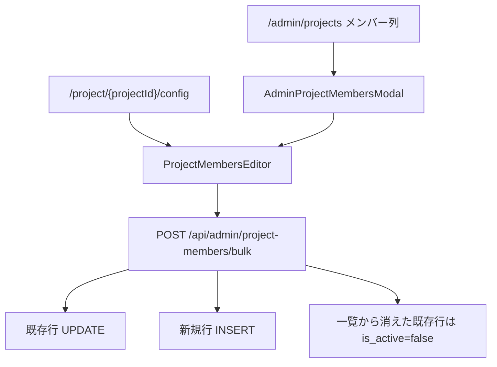

# 30. Admin Projects / Members 台帳仕様

`/admin/projects` と `/admin/members` は、AMD OS の台帳正本。PJ の契約・請求・支払条件、PJ メンバー、AMD メンバーの login / Calendar 状態はここから各 cockpit、月次ルーティン、請求・支払、L2 抽出へ流れる。

## 30.1 位置付け

| 画面 | 正本にするもの | 主な downstream |
|---|---|---|
| `/admin/projects` | PJ 台帳、契約・請求・支払条件、関係先メール、Slack / Drive / freee、PJメンバー、ASPI lane | cockpit、月次ルーティン、請求・支払、Atlas / Venture Map、L2 抽出 |
| `/admin/members` | AMD メンバー台帳、email、role、admin / officer、Slack ID、Google Calendar 状態、最終ログイン | `/mypage`、通知、週次活動抽出、PL確認依頼、入金確認 nudge、admin 権限 |
| `/project/{projectId}/config` | 旧 PJ 設定 | 互換入口。契約・請求・支払条件の正本は `/admin/projects` |

`/admin/projects` は「PJ が存在するか」だけでなく、月次運用に必要な条件を持つ。`/admin/members` は「誰が OS に入れるか」「誰へ通知・確認を送れるか」を持つ。

## 30.2 `/admin/projects` の読み込み

page は次をまとめて読む。

| データ | 用途 |
|---|---|
| `projects` | 台帳本体。`status` / `project_category` / 請求先 / 支払条件 / Slack / Drive など |
| `project_ventures.lanes` | ASPI 8 domain lane。SU 化されていない PJ は `has_venture_row=false` で編集不可 |
| `lane_suggestions(status='pending')` | LLM lane 提案。PJ ごとに最新 1 件だけ表示 |
| `project_members(is_active=true)` + `members` | PL / PM / クローザーの code_name 表示 |

表示順は `projects.status` -> `projects.project_name`。大量 PJ でも見失わないよう、PJID と PJ名の列、thead は sticky。

## 30.3 `/admin/projects` の編集単位

`AdminProjectsTable` は 1 セル単位で編集する。セルをクリックすると、そのセルだけが edit mode になり、保存 / 取消を出す。他セル編集中は別セル click を無視する。

保存先:

```text
AdminProjectsTable
  PATCH /api/admin/projects/[id]
    body:
      { projectsPatch: {...} }
      or
      { venturesPatch: {...} }
```

`/api/admin/projects/[id]` は `projects.id` (= UUID) を受け取り、内部で `projects.project_id` を解決して `project_ventures` も更新する。2026-05-25 #46 以降は `requireAdmin()` 必須。service_role route を admin check なしで公開しない。

## 30.4 `/admin/projects` の主な列

| 列 | 保存先 | 意味 |
|---|---|---|
| PJID | `projects.project_id` | OS 内の短い PJ ID。画面では read-only |
| PJ名 | `projects.project_name` | cockpit / dashboard 表示名 |
| Status | `projects.status` | 契約・営業・稼働状態 |
| 分類 | `projects.project_category` | AMD OS 上の扱い / 事業モデル |
| Lane (ASPI) | `project_ventures.lanes` | ASPI 8 domain weighted lanes |
| メンバー | `project_members` | PL / PM / クローザー、参画月、離脱月、active |
| 請求先 | `projects.client_name` | 請求・契約の相手先表示 |
| 関係先メールアドレス | `projects.report_emails` | 月次報告書や関係者判定に使う CSV |
| 請求書送付 | `invoice_send_manual`, `invoice_to_emails`, `invoice_cc_emails`, `invoice_bcc_emails` | 請求書送付方式と送付先 |
| 業務委託料 | `fee_type`, `fee_amount` | 固定 / 変動 / milestone と固定額 |
| 支払条件 | `payment_due_rule`, `payment_due_day` | 稼働月から支払予定日を出す |
| 開始ym / 終了ym | `start_ym`, `end_ym` | 月次対象期間 |
| 停止 / 再開予定 | `freeze_from_ym`, `restart_expected_ym` | 現在表示用の休止オーバーレイ |
| freee ID | `freee_partner_id` | freee 取引先 ID |
| Slack CH | `slack_channel_id` | PJ channel |
| Drive Folder | `drive_folder_id` | PJ folder |

## 30.5 Status と project_category

`projects.status` は契約・営業・稼働状態。

| value | 意味 | 主な扱い |
|---|---|---|
| `draft` | 準備中 | 通常の月次ルーティン / 請求対象にはまだ入れない |
| `active` | AMD が伴走・運用中 | cockpit / 月次 / 請求・支払 / MS 進捗抽出の標準対象 |
| `sales` | 商談・提案中 | 契約後の月次オペは個別確認 |
| `ended` | 伴走・契約終了 | 履歴として残す。新規月次ルーティンは原則表示しない |
| `frozen` | 休止中 | 新規月次ルーティンは止める。期間は `freeze_from_ym` / `restart_expected_ym` も見る |
| `lost` | 失注 / 契約化しなかった | 支払原資なしの個別確認対象 |

`projects.project_category` は AMD OS 上で PJ をどう扱うか。

| value | 表示 | 意味 | AMD Score | MS 進捗抽出 |
|---|---|---|---|---|
| `dtsu` | DTSU | 学術発 SU 伴走 PJ | 対象 | 対象 |
| `new_business` | 新規事業創出 | レガシー企業 DX + 研究シーズ取込 | 対象 | 対象 |
| `ecosystem` | Ecosystem | 研究機関の SU エコシステム構築 | 対象外 | 対象 |
| `advisor` | Advisor | 社外役員 / 経営顧問として入る PJ | 対象 | 対象外 |

status と category を混ぜない。たとえば `new_business` は事業モデル分類であり、契約中かどうかは `status` で見る。

## 30.6 支払条件

支払条件は `projects.payment_due_rule` に保存し、支払月・支払予定日の計算に使う。`payment_due_day` は legacy fallback。

| rule | 表示 | 支払予定 |
|---|---|---|
| `current_month_eom` | 当月末 | 稼働月の月末 |
| `current_month_25` | 当月25日 | 稼働月の 25 日 |
| `next_month_eom` | 翌月末 | 稼働月の翌月末 |
| `next_month_25` | 翌月25日 | 稼働月の翌月 25 日 |
| `second_month_eom` | 翌々月末 | 稼働月の翌々月末 |
| `second_month_25` | 翌々月25日 | 稼働月の翌々月 25 日 |

`computePaymentDueDateByRule()` は日本の休日を見て前営業日に寄せる。支払月は `computePaymentYmByRule()` で `YYYYMM` にする。

例: 5 月稼働分を 6 月末支払にする場合は `next_month_eom`。請求書を 6 月に出すかどうかではなく、**稼働月基準**で読む。

## 30.7 関係先メールアドレス

`projects.report_emails` は CSV で保存する。画面では長い文字列をそのまま出さず、`N件` chip と先頭メールだけを表示し、click で `EmailsEditModal` を開く。

```text
EmailsEditModal
  追加 / 個別削除 / 重複skip / 形式注意
  保存
    -> PATCH /api/admin/projects/{id}
       { projectsPatch: { report_emails: "a@example.com, b@example.com" } }
```

2026-05-25 #46 で、モーダル保存 body を API 仕様に合わせて修正済み。以前の `{ report_emails: ... }` 直送では API が更新対象として解釈できず、保存されない可能性があった。

## 30.8 PJ メンバー

`project_members` は、AMD 内部メンバーがどの PJ にどう関わるかの正本。

| field | 意味 |
|---|---|
| `project_id` | PJ |
| `member_id` | `members.member_id` |
| `is_pl` | PL。月次の PL 確認依頼などで使う |
| `is_pm` | PM。cockpit 月次ルーティン編集権限などで使う |
| `is_closer` | クローザー。営業・契約関与 |
| `role_label` | 補足役割名 |
| `join_ym` / `leave_ym` | 参画月 / 離脱月 |
| `is_active` | 現在の有効紐付け |

編集 UI は `ProjectMembersEditor` を共有する。`/admin/projects` のメンバー列モーダルと `/project/{projectId}/config` の両方から同じ API を叩く。



物理削除はしない。過去の業務記録、月次報告、立替、支払計算が `project_members` 行を参照する可能性があるため、離脱は `is_active=false` で残す。

API は `requireAdmin()` 必須。`memberId` 重複は UI と API の両方で弾く。`join_ym` / `leave_ym` は `YYYYMM` 形式、空欄可。

## 30.9 ASPI Lane と LLM 提案

`project_ventures.lanes` は ASPI 8 domain weighted lanes。`lane_suggestions(status='pending')` がある場合、`/admin/projects` で最新 1 件を表示し、採用 / 却下できる。

| 操作 | 保存先 |
|---|---|
| 手動 lane 保存 | `PATCH /api/admin/projects/[id]` の `venturesPatch.lanes` |
| LLM 提案採用 | `PATCH /api/admin/lane-suggestions/[id] { action:'approve' }` |
| LLM 提案却下 | `PATCH /api/admin/lane-suggestions/[id] { action:'reject' }` |

`/api/admin/lane-suggestions/[id]` は service role で `lane_suggestions` と `project_ventures.lanes` を更新するため、2026-05-25 #56 以降は `requireAdmin()` 必須。2026-05-25 #61 以降、`project_ventures` 行が無い PJ では採用時に 409 を返し、`lane_suggestions.status='approved'` へ進めない。

注意: `project_ventures` 行が存在しない PJ は `/admin/projects` 側で Lane セルを `SU未化` として表示し、手動編集を出さない。`PATCH /api/admin/projects/[id]` の `venturesPatch` も 0 件 update を成功扱いにせず 409 を返す。新規 PJ を SU 化する時は、別の初期化 flow で `project_ventures.display_name` / `lane` / `outcome_pattern` などの必須列を用意してから lanes を編集する。

## 30.10 全 PJ 紹介資料 HTML

ダッシュボードの `全 PJ 紹介資料作成` は、選択した PJ のエグゼクティブサマリー HTML を雛形どおりに生成する admin 機能。

| 項目 | 内容 |
|---|---|
| UI | `AllPjIntroductionModal` |
| route | `POST /api/admin/pj-introduction-html` |
| 入力 | `{ project_ids: string[] }` |
| 出力 | `text/html`。ダウンロードしてそのまま確認できる portfolio HTML |
| 主な入力テーブル | `projects`, `project_ventures`, `project_knowledge`, `project_founding_members`, `monthly_reports`, `llm_prompts` |
| LLM | `llm_prompts.exec_summary.extract` + Sonnet 4.5。1 PJ ごと JSON 集約、concurrency 3 |
| 雛形 | `src/lib/exec_summary/template_section.html` / `template.css` |

この route は service role で PJ 情報を横断取得し、Anthropic API も呼ぶため `requireAdmin()` 必須。雛形 HTML の構造を崩さないことが最優先で、`renderSection()` は雛形の CHALLENERGY section を template literal として同期している。雛形を変えたら `route.ts` 側の literal も同時に更新する。

## 30.11 `/admin/members`

`/admin/members` は AMD メンバー台帳。表示は最終ログインが新しい順、同順位は code_name 順。

| 列 | 保存先 | 編集 |
|---|---|---|
| codeName | `members.code_name` | 可 |
| memberId | `members.member_id` | read-only。FK 参照される |
| 表示名 | `members.member_name` | 可 |
| email | `members.email` | 可。auth user email と一致させる |
| Role | `members.role` | 可 |
| Status | `members.status` | `active` / `inactive` |
| joinYm / leaveYm | `join_ym`, `leave_ym` | 可 |
| Calendar | `google_calendar_status` 等 | read-only。login / callback 側が更新 |
| 最終ログイン | `last_login_at` | read-only。middleware が touch |
| admin | `is_admin` | 可。admin nav / API gate に効く |
| 役員 | `is_officer` | 可。支払通知書・運営費扱いに効く |
| Slack ID | `slack_id` | 可。Slack DM / nudge に使う |

`/admin/members` のセル保存は browser auth client から `members` を直接 update する。RLS が変わると保存失敗しうるので、将来 service_role API 化する場合は必ず `requireAdmin()` を入れる。

## 30.12 Calendar 状態

Google Workspace login は Calendar / Gmail scope を要求する。Calendar API が読めるかは `members.google_calendar_status` に残す。

| 表示 | status | 意味 |
|---|---|---|
| `ON` | `connected` | Calendar access OK |
| `必須` | `missing` 等 | Calendar access が必要だが未確認 / 未接続 |
| `Error` | `error` | Calendar API check で error。tooltip に `google_calendar_error` |
| `対象外` | - | `@team-armada.jp` ではない、または `info` / `つくよみ` などの system account |

`members.last_login_at` は `/auth/callback` と middleware で更新される。既存 session で使い続ける場合も、middleware が 1 時間に 1 回まで touch する。

## 30.13 既知ギャップ

| ギャップ | 現状 | 次にやること |
|---|---|---|
| PJ 新規作成 / archive 専用 UI | `/admin/projects` は既存 PJ のセル編集が中心 | 新規 PJ 作成 flow を作る時は、`projects` / `project_ventures` / 初期 `project_members` をまとめて作る |
| `project_ventures` 行なしの lane 保存 | `SU未化` と表示し編集不可 | `venturesPatch` / lane suggestion approve は 409。SU 化 flow で row 作成後に編集 |
| `/admin/members` の保存方式 | browser auth client 直接 update | RLS 回帰が出たら service_role API + `requireAdmin()` へ寄せる |
| Calendar 再チェック | login / callback 時が中心 | admin から個別再チェックする操作は未実装 |

## 関連

- admin 概要: [04 章 admin オペ](04-admin-ops.md)
- 月次 / billing: [26 章 Member Ops / Billing / Prompt](26-member-billing-prompts-spec.md)
- payment confirm: [25 章 Finance / Payment Confirm](25-finance-payment-confirm-spec.md)
- project_category 経緯: [05 章 5.6](05-decisions-and-history.md#56-project_category-に-new_business-追加--2026-05-25)
