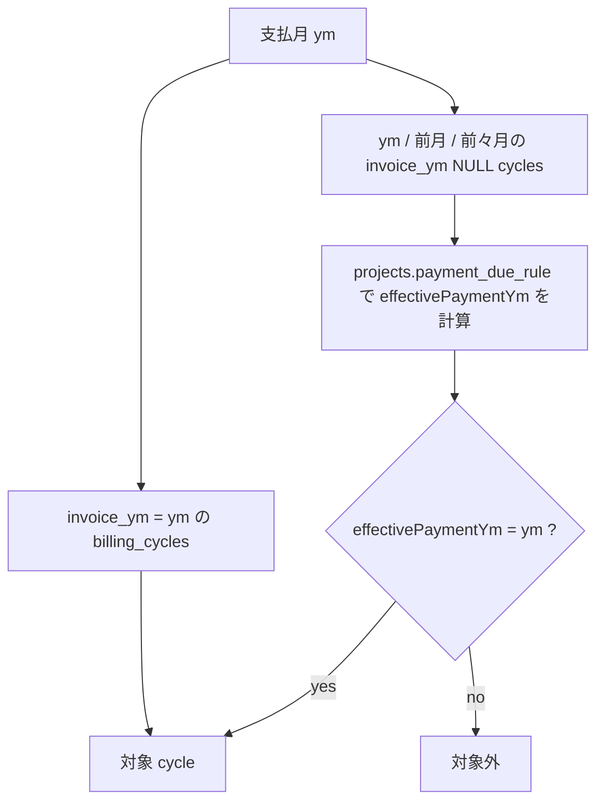
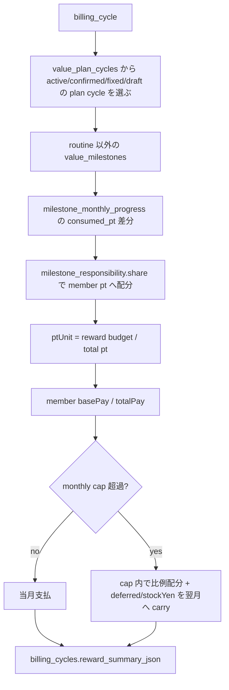

# 31. Admin Payouts / 支払通知書仕様

`/admin/payouts` は、AMD から SU / メンバーへ支払う月次報酬を **支払月ベース**で集約し、支払データ保存、支払通知書 PDF 発行、送付済み管理までを行う画面。

4 章は admin 月次オペ全体の入口。この章は `/admin/payouts` と報酬キャッシュ・支払通知書 PDF の細かい仕様を正本にする。

## 31.1 画面の位置付け

| 画面 / API | 役割 |
|---|---|
| `/admin/payouts?ym=YYYYMM` | 支払月 `ym` の対象 cycle、PJ別収支、メンバー別支払、通知書状態を見る |
| `GET /api/admin/payouts?ym=YYYYMM` | 通常読み込み。`billing_cycles.reward_summary_json` のキャッシュを読む |
| `GET /api/admin/payouts?ym=YYYYMM&refreshRewards=1` | 明示的に報酬キャッシュを再計算してから読む |
| `POST /api/admin/payouts` | 支払データを保存する |
| `PATCH /api/admin/payouts` | PJ予算確定、通知書状態更新、PDF確認 / 発行を行う |
| `POST /api/rewards/sync` | 月次モーダル / 進捗保存後に単一 cycle の `reward_summary_json` を生成・保存する |
| `/api/cron/payout-reward-cache-refresh` | 03:05 JST の日次報酬キャッシュ再計算 |

`/admin/payouts` の `ym` は **支払月**。報酬が発生した稼働月ではない。稼働月は `billing_cycles.ym`、明示支払月は `billing_cycles.invoice_ym`、支払予定の fallback は `/admin/projects` の `payment_due_rule` / `payment_due_day` で決まる。

## 31.2 支払月と対象 cycle

対象 cycle は 2 系統から集める。

| 種類 | 条件 |
|---|---|
| 明示 cycle | `billing_cycles.invoice_ym = 支払月` |
| fallback cycle | `invoice_ym IS NULL` かつ `candidateSourceYmsForPaymentYm(支払月)` の中で、`effectivePaymentYmForCycle()` が支払月になる |

`candidateSourceYmsForPaymentYm(paymentYm)` は `paymentYm` / 前月 / 前々月を見る。これは `当月末` / `翌月末` / `翌々月末` などの支払条件をまとめて拾うため。

## 31.3 報酬キャッシュ

通常表示では `syncRewardSummariesForBillingCycles()` を走らせない。`billing_cycles.reward_summary_json` を読むだけにする。理由は、報酬再計算が `value_plan_cycles`、`value_milestones`、`milestone_monthly_progress`、`milestone_responsibility` を横断する重い処理だから。

再計算が走るのは次の時だけ。

| 契機 | route | 説明 |
|---|---|---|
| 月次モーダル表示 / 進捗保存 | `POST /api/rewards/sync` | 単一 `projectId + ym` の報酬サマリーを保存し、保存済み値を画面へ返す |
| MS進捗更新 | `progress/estimate`, `progress/confirm`, `progress/revisions`, `progress/batch-save` | MS進捗の保存後に `syncRewardSummaryForCycle()` を呼ぶ |
| 手動ボタン | `GET /api/admin/payouts?refreshRewards=1` | `/admin/payouts` の「報酬キャッシュ再計算」 |
| 支払データ保存 | `POST /api/admin/payouts` | 保存前に最新報酬へ同期 |
| PJ予算確定 | `PATCH /api/admin/payouts` | 確定額を配分後、再計算して表示更新 |
| 日次 cron | `/api/cron/payout-reward-cache-refresh` | 前月・当月・翌月の支払月を 03:05 JST に更新 |

報酬キャッシュは次のロジックで作る。

`monthlyBudget65` は、`billing_cycles.budget_yen`、`projects.fee_type='monthly_fixed'` の `fee_amount * 0.65`、または plan cycle budget から決まる。`billing_cycles.budget_yen` が空の時は、`budget_reported_amount * 0.65 - budget_buffer_amount` や月額固定契約から補完する。

重要: cockpit の月次モーダルは、未保存のクライアント側 preview を正本として扱わない。`CockpitMonthlyModal` は `POST /api/rewards/sync` を呼び、`syncRewardSummaryForCycle()` が `billing_cycles.reward_summary_json` へ保存した値を表示する。`/admin/payouts` はこの保存済み `reward_summary_json.members` から `monthly_reward_payout` を作る。

## 31.4 支払データ保存

`POST /api/admin/payouts` は次の順序で動く。

1. `loadTargetData(ym, { refreshRewards: true })` で対象 cycle と報酬キャッシュを最新化
2. `buildPayoutEntries()` で `monthly_reward_payout` 用の明細を作る
3. `members.is_officer=true` のメンバーは支払通知書・支払明細から除外する
4. `budget_yen <= 0` なのに支払予定がある cycle があれば 409 で保存しない
5. 役員分の既存 `monthly_reward_payout` と未送付 `payout_notices` を削除
6. `monthly_reward_payout` を `(project_id, ym, member_id)` で upsert
7. `payout_notices` を `(member_id, ym)` で upsert

`payout_notices.total_yen` はメンバー別に集約した通知額。`members.exclude_from_payout_notice=true` または `is_officer=true` のメンバーは通知額から除外する。

## 31.5 PJ別収支 / 予算チェック

画面上部の「PJ別収支 / 予算チェック」は、支払保存前に事故りそうな PJ を見るための表。

| 表示 | 意味 |
|---|---|
| クライアント支払 | `budget_reported_amount` の合計 |
| バッファ | `budget_buffer_amount` の合計 |
| PJ予算 | `budget_yen` の合計 |
| 支払予定 | 役員以外の `totalPay` 合計 |
| 役員相殺 | `is_officer=true` の支払予定額。支払対象外として会社側に残す |
| 最終収支 | `PJ予算 - 支払予定 - 役員分 + 役員相殺` |

主な警告は次の通り。

| 状態 | 意味 |
|---|---|
| `PJ予算未設定` | `budget_yen <= 0` なのに支払予定がある。保存ブロック |
| `後追い予算未確定` | 支払月に繰り越された cycle で予算が未確定。契約確定額を待つ |
| `予算不足` | `payoutYen > budgetYen`。保存前に支払可否・減額・追加請求を確認 |
| `入金確認前` | 予算内だが `payment_confirmed_at` がない。nudge 対象 |
| `失注/破談: 予算なし` | `projects.status='lost'` かつ予算なし。個別合意が必要 |

## 31.6 後追い PJ予算確定

契約・委託料が後から確定した場合は、PJ別収支の「確定待ちのPJ予算」から `PATCH /api/admin/payouts` を呼ぶ。

入力は `projectId`、`invoiceYm`、`sourceYms`、`clientAmountYen`、`bufferYen`。保存時に `clientAmountYen * 0.65 - bufferYen` を PJ予算総額とし、対象 cycle へ配分する。

配分比率は、対象 cycle の支払予定額がある場合は支払予定額の比率。支払予定額がなければ cycle 数で等分する。

保存される主な列:

| column | 内容 |
|---|---|
| `billing_cycles.budget_yen` | 配分後の PJ 予算 |
| `budget_reported_amount` | 配分後のクライアント税抜支払額 |
| `budget_buffer_amount` | 配分後のバッファ |
| `budget_confirmed_at` / `budget_confirmed_by` | 確定履歴 |
| `status` | `not_started` / `draft` / `reported` などは `budget_confirmed` へ進める |

## 31.7 支払通知書 PDF

支払通知書 PDF は GAS の `payoutCreatePwaNoticePdf` で生成する。PWA は payload を組み立て、`NEXT_PUBLIC_GAS_WEBAPP_URL` に `mode=pwaApi&action=runFunc` で渡す。

PDF 操作は 2 種類ある。

| 操作 | API action | 保存するか | 使い方 |
|---|---|---|---|
| PDF確認 | `preview_notice_pdf` | 保存しない | 支払データ保存前でも、改善版フォーマットを確認する |
| 支払通知書発行 | `issue_notice_pdf` | `payout_notices.notice_no` / `pdf_url` / `total_yen` を保存 | 支払データ保存後に正式発行する |

正式発行では、既存 `notice_no` があれば再利用し、なければ `PNYYYYMM-NNN` を採番する。GAS が `noticeNo` / `freeeNoticeNo` を返した場合はそれを優先する。

PDF payload の主な項目:

| field | 内容 |
|---|---|
| `ym` | 支払月 |
| `memberId` / `payeeName` / `payeeEmail` | 支払先 |
| `noticeNo` | 通知書番号 |
| `totalYen` | 通知額 |
| `breakdown[]` | PJ別・稼働月別の報酬明細 |
| `issuedAt` | 発行時刻 |

## 31.8 送付済み管理

送付済み状態は `payout_notices.sent_at`。UI の「送付」は `PATCH /api/admin/payouts` の `update_notice` で `sent_at=now` にする。「送付取消」は `sent_at=null` に戻す。

送付済みにできるのは PDF がある行だけ。PDF がない行は、まず「PDF確認」または「支払通知書発行」を行う。

## 31.9 日次 cron

`/api/cron/payout-reward-cache-refresh` は 03:05 JST に走る。GET は `CRON_SECRET` が必要で、POST は admin 認証が必要。

明示 `ym` がなければ、JST の現在月を基準に前月・当月・翌月の支払月を更新する。対象 cycle の選び方は `/admin/payouts` と同じで、`invoice_ym` 明示分と `payment_due_rule` fallback の両方を見る。

## 31.10 トラブルシュート

| 症状 | 確認するもの |
|---|---|
| 支払対象が出ない | `billing_cycles.invoice_ym`、`projects.payment_due_rule`、対象 `ym`、`candidateSourceYmsForPaymentYm()` |
| 報酬額が古い | 「報酬キャッシュ再計算」または `payout-reward-cache-refresh` の実行履歴 |
| cockpit では報酬が見えるのに payouts に出ない | `billing_cycles.reward_summary_json`、`/api/rewards/sync`、`syncRewardSummaryForCycle()` の結果 |
| 保存できない | PJ予算未設定 / 予算不足 / `budget_yen` / `budget_reported_amount` |
| PDFが出ない | `NEXT_PUBLIC_GAS_WEBAPP_URL`、`NEXT_PUBLIC_GAS_API_KEY` or `CRON_SECRET`、GAS `payoutCreatePwaNoticePdf` |
| 送付済みにできない | `payout_notices.pdf_url` があるか |
| 役員分が通知額に入らない | 仕様通り。`members.is_officer=true` は支払通知書から除外し、PJ別収支では役員相殺として見る |
| 旧PDFフォーマットに戻った | `FEATURE_REGISTRY.md`、`npm run test:critical-ui`、golden PNG を確認 |
