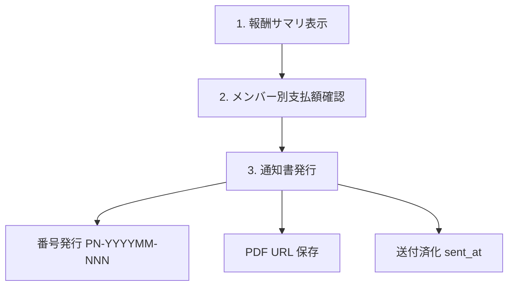
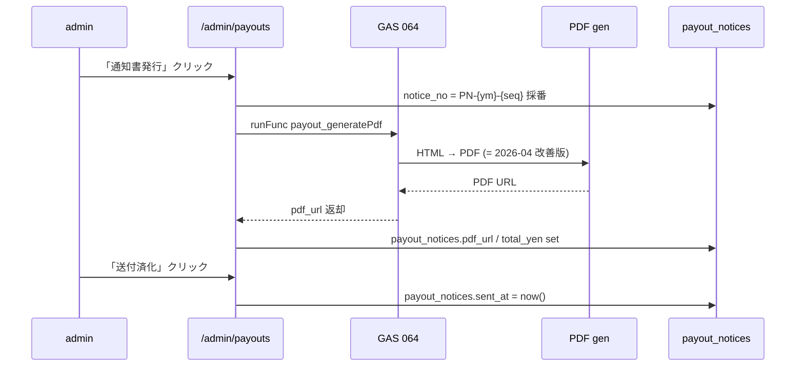

# Admin Payouts / 支払通知書 仕様

`/admin/payouts` 画面の仕様。 AMD から SU 側メンバーへの **月次業務委託費 (= AMD 業務委託フィー) 支払通知書** 発行フロー。 メンバー視点は [10 章](10-member-workflows-quick-start.md)、 admin 入口は [04 章](04-admin-ops.md) を見る。

## 画面 URL

`/admin/payouts?ym=YYYYMM`

`ym` 省略時は現月。 `admin_listPayoutYmCandidates` (GAS) で支払対象月の候補を出して切替できる。

## 支払対象

支払通知書発行は **AMD メンバー → SU 法人** ではなく、 **AMD → AMD メンバー** が原則。 SU 法人がまだ無い PJ (= pre-founding) でも、 業務委託契約に基づき AMD から各メンバーへの月次支払が発生する。

### 対象判定 (= `admin_listPayoutYmCandidates`)

GAS 066 `A066_PayoutPaidRepo.js` の `admin_listPayoutYmCandidates` が、 admin に表示する候補月を返す。 ロジック:

```text
1. members where status='active' AND exclude_from_payout_notice=false
2. 各メンバーの participate PJ (= project_members.is_active=true) × ym で billing_cycles を結合
3. 該当 ym の billing_cycles.reward_summary_json から member_allocations_json[memberId] を抽出
4. 合計額 > 0 のメンバーを表示
```

`exclude_from_payout_notice=true` のメンバー (= 例: りり / ID006 NIMS 無償出向) は通知書発行を skip。

## 月次サイクル



### 1. 報酬サマリ表示

`billing_cycles.reward_summary_json` を **キャッシュ表示**。 通常 GET は重い再計算を走らせない (= 過去ハマり)。

`reward_summary_json` の構造 (= GAS rv2 計算):

```json
{
  "totalPaidYen": 350000,
  "members": {
    "ID001": { "earnedPt": 100, "basePay": 150000, "bonusPt": 50, "totalPay": 200000 },
    "ID002": { ... }
  },
  "ptUnit": 1500,
  "ptUnitNote": "...",
  ...
}
```

### 報酬キャッシュ再計算

- 自動: `/api/cron/payout-reward-cache-refresh` (= 日次 03:05 JST)
- 手動: `/admin/payouts` の「報酬キャッシュ再計算」ボタン (= UI から `refreshRewards=1` で route 叩く)
- 入力: `billing_cycles` + `value_milestones` + `milestone_monthly_progress` + `milestone_responsibility`
- 出力: `billing_cycles.reward_summary_json` (= 上書き) + `budget_yen` fallback

通常 GET は **読むだけ**。 admin の保存系処理または手動ボタンだけが再計算を走らせる (= まさ #過去 教訓)。

### 2. メンバー別支払額確認

メンバー行 × PJ 列のマトリクス。 各セルに per-PJ の per-member 支払額。 行末に各メンバーの月次合計、 PJ 列末に各 PJ の月次合計。

### 3. 通知書発行



### `payout_notices` 列

| column | 用途 |
|---|---|
| `member_id` / `ym` | composite PK |
| `sent_at` | 送付済化時刻 (= NULL なら未送付) |
| `notice_no` | `PN-YYYYMM-NNN` (= 月内 seq) |
| `pdf_url` | Drive / Storage PDF URL |
| `total_yen` | 当月支払総額 (= 内訳ではなく集計値) |

### `payout_agreement` 列

| column | 用途 |
|---|---|
| `project_id` / `member_id` | composite UNIQUE |
| `agreed_at` | 同意時刻 |
| `token` | 同意リンク用 token |

PJ × メンバー単位の業務委託契約同意ステータス。 初回支払前に SU 側メンバーが同意したかを記録する。

### `monthly_reward_payout` 列 (= 実支払ログ)

| column | 用途 |
|---|---|
| `project_id` / `ym` / `member_id` | composite UNIQUE |
| `earned_pt` | 獲得ポイント |
| `base_pay` | base 給 |
| `bonus_pt` | bonus pt |
| `total_pay` | 合計支払額 |

GAS rv2 の最終計算結果を per-PJ × per-ym × per-member で保存する snapshot。 `billing_cycles.reward_summary_json.members[memberId]` の正規化版。

## 支払通知書 PDF (= 2026-04 改善版が正本)

`gas-main/064_PayoutFreeeNotice.js` が PDF 生成正本。 フォーマット:

| 要素 | 内容 |
|---|---|
| ヘッダー | 公式ロゴ画像 (= `PAYOUT_LOGO_FILE_ID`) + `PAYOUT_LOGOTYPE_FILE_ID` |
| 背景 | 白地、 青アクセント |
| 明細表 | 青ヘッダで、 PJ 別の base_pay / bonus / total |
| 税内訳 | 消費税 / 源泉税の内訳 |
| 支払予定 / 方法 / 振込先 | `members.bank_info` を出力 |
| 備考 | `members.member_address` / 通知書番号 / 発行日 |

### 旧フォーマット禁止 anchor

以下の旧 anchor は復活禁止 (= `npm run test:critical-ui` で検知):

- `setValue("team ARMADA")`
- `brandCell`
- 旧 `支払通知書番号` レイアウト

### 確認用 PDF

`/admin/payouts` の「PDF 確認」ボタンは、 確定前でも PDF 生成可能。 確認用 PDF は **`payout_notices` に保存しない** (= 番号採番もしない)。 まさが「これでよさそう」と見た上で「通知書発行」を押す。

### golden test

`pwa/scripts/__fixtures__/payout_notice_golden.png` + SHA256 が回帰防止用 golden。 PDF レイアウト変更時は同 commit で golden を更新する。

## ScriptProperties

GAS 064 が読む:

| key | 用途 |
|---|---|
| `PAYOUT_LOGO_FILE_ID` | ロゴ画像 (= Drive file id) |
| `PAYOUT_LOGOTYPE_FILE_ID` | ロゴタイプ画像 (= Drive file id) |
| `PAYOUT_NOTICE_FOLDER_ID` | PDF 保存先 Drive folder |
| `PAYOUT_NOTICE_TEMPLATE_ID` | Doc テンプレ id |

詳細は `gas/CLAUDE.md` の ScriptProperties section。

## 支払月判定 (= 「いつの ym を払うか」)

`/admin/payouts?ym=YYYYMM` の `ym` は **支払 ym**。 「YYYYMM 月の業務に対する支払」を意味する。 実際の振込日は `members.bank_info` に書いた支払サイクル (= 末締め翌月末払い 等) で決まる。

- `billing_cycles.ym` も同じ意味で **業務 ym** を指す
- 「3 月分の支払を 4 月末に振り込む」場合、 `ym='202603'` の `billing_cycles` を見て、 `payout_notices.ym='202603'` で発行、 振込実行日は別管理

## ZMP 追加開発 cap 外支払 (= 例外運用)

ZMP の通常固定費は 300,000 円 × 65% = 195,000 円が cap。 OkuDoor 追加開発などで追加受託分を支払うときの運用:

1. `/admin/projects` の「PJ 予算確定・調整」で `cap外追加支払枠` に合意額を入れる
2. `billing_cycles.budget_yen = 通常 cap + 追加枠` で書き換え
3. 報酬キャッシュ再計算 → `reward_summary_json` 更新
4. `/admin/payouts` で当月分発行

## 「通常 GET は読むだけ」原則 (= 過去ハマり防止)

- GET `/admin/payouts?ym=YYYYMM` は `syncRewardSummariesForBillingCycles` (= 重い再計算) を暗黙実行しない
- 「報酬キャッシュ再計算」ボタンまたは保存系処理 (= 通知書発行 / 送付済化) だけが `refreshRewards=1` で再計算を走らせる
- 過去事故: GET でも自動再計算してたら、 admin が画面開いただけで全月 reward が再計算され、 値が変わった (= 既に承認済の月の数字がズレる UX 問題)

## トラブル時

| 症状 | 確認場所 |
|---|---|
| 支払額が出ない | `billing_cycles.reward_summary_json` の該当 ym 行、 cron `payout-reward-cache-refresh` 実行履歴 |
| メンバーが行に出ない | `members.status='active'`、 `exclude_from_payout_notice=false`、 `project_members.is_active=true` |
| PDF 確認で住所が空 | `members.member_address` 入力、 `members.bank_info` |
| 通知書発行で notice_no 重複 | `payout_notices` 既存行 (= UNIQUE PK は `(member_id, ym)`)、 再発行は既存行を update |
| GAS Payout 権限エラー | `gas-main/A066_PayoutPaidRepo.js` の OAuth 再認可、 [`pwa/design/invoice_url_payout_auth.md`](../design/invoice_url_payout_auth.md) |
| 旧フォーマット復活 | `npm run test:critical-ui` で `brandCell` / `setValue("team ARMADA")` を検出、 golden png 比較 |

## 関連

- 04 章 [admin オペ](04-admin-ops.md) (= 月次ルーティン早見表)
- 32 章 [Invoice / Billing Routine](32-invoice-and-billing-routine-spec.md) (= 反対側、 SU から AMD への請求書)
- 26 章 [Member Ops / Billing / Prompt](26-member-billing-prompts-spec.md) (= 報酬計算正本)
- 30 章 [Admin Projects / Members 台帳](30-admin-projects-members-ledger-spec.md) (= PJ / メンバー台帳)
- 設計: [`pwa/design/FEATURE_REGISTRY.md`](../design/FEATURE_REGISTRY.md) (= 消してはいけない業務導線)
- 設計: [`pwa/design/invoice_url_payout_auth.md`](../design/invoice_url_payout_auth.md) (= signed URL + Payout OAuth)
- 報酬計算正本: `gas-main/059_RewardV2_Ops.js`
- PDF 生成正本: `gas-main/064_PayoutFreeeNotice.js`
