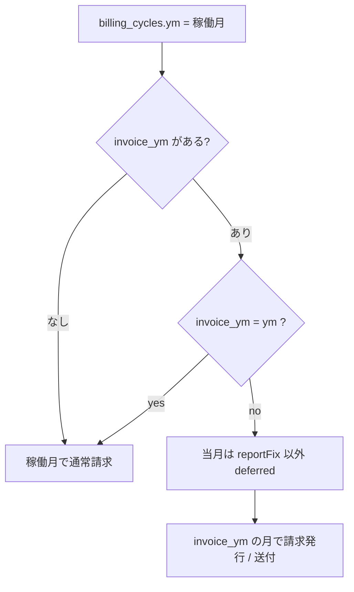
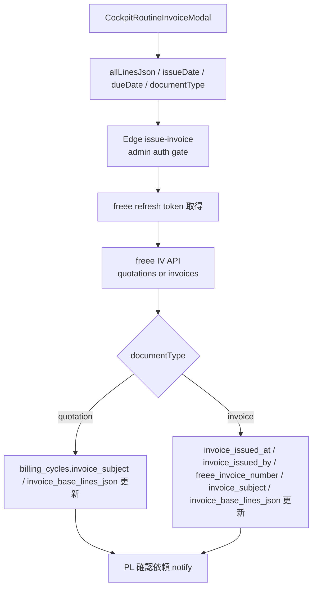
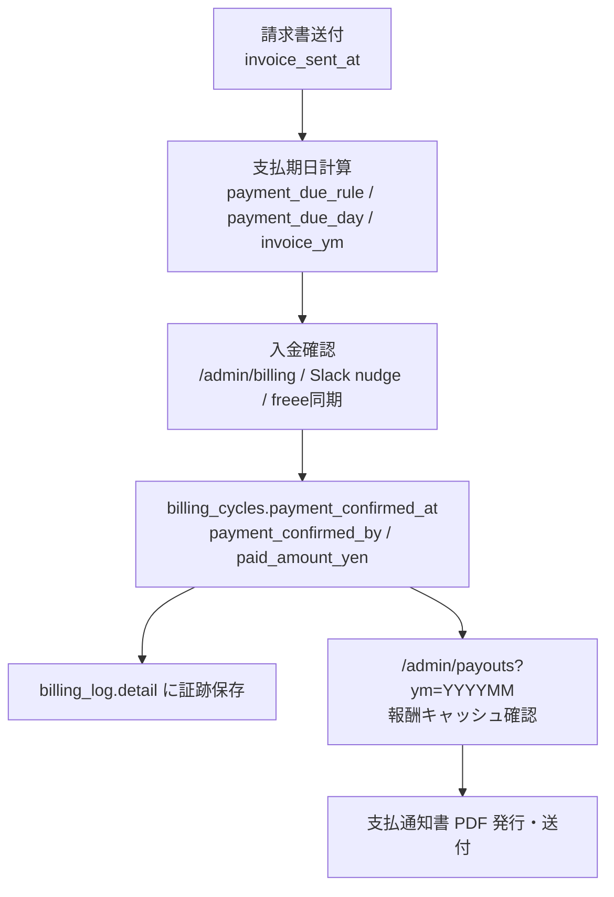

# 32. Invoice / Billing Routine 仕様 (= 請求・月次ルーティン仕様)

請求書・見積書まわりは、月次ルーティン、`/admin/billing`、freee、入金確認、`/admin/payouts` へつながる。ここでは **現行の正本ルート**と、残っている legacy route の扱いを分けて整理する。

## 32.1 正本ルート

| 導線 | 現行の役割 |
|---|---|
| PJ cockpit 右カラムの月次ルーティン | 日常の請求額確定 / 見積書送付 / 請求書発行 / 請求書送付の入口 |
| `CockpitRoutineInvoiceModal` | 見積書 / 請求書の明細編集、下書き保存、freee 発行、取り消し |
| Supabase Edge Function `issue-invoice` | freee IV API で見積書 / 請求書を発行し、`billing_cycles` に記録 |
| Supabase Edge Function `cancel-invoice` | OS 側の発行情報を取り消す。freee 上のキャンセルは手動 |
| `CockpitRoutineInvoiceSendConfirm` | 請求書送付済みを `invoice_sent_at` に保存 |
| `/admin/billing` | SU × 月の step matrix。状態確認と admin 手動補正 |

`/api/invoice/preview` と `/api/invoice/create` も残っているが、現行の月次ルーティンの正本は `CockpitRoutineInvoiceModal` + Edge Function。legacy route は 32.9 に分けて扱う。

## 32.2 月次ルーティン上の順序

標準 PJ:

```text
請求額確定 -> 報告会 -> 報告書 -> 立替確認 -> 請求書発行 -> 請求書送付
```

CTB PJ:

```text
見積書送付 -> 請求額確定 -> 報告会 -> 請求書発行 -> 請求書送付 -> 報告書 -> 立替確認
```

`billing_cycles.invoice_ym` が稼働月と違う場合、その稼働月の routine では月次報告書 FIX 以外を skip / deferred 表示にする。請求書発行・送付は `invoice_ym` の月側でまとめて扱う。

締切はすべて土日なら前営業日に寄せる。

| step | 標準 PJ | CTB PJ | 何をするか | 保存 / 完了判定 |
|---|---|---|---|---|
| 見積書送付 | なし | 前月28日 | CTB の見積書を発行・送付する | `invoice_base_lines_json` の `[[CTB_ESTIMATE_SENT]]` |
| 請求額確定 | 前月25日 | 前月28日 | PM が請求額・バッファを申告し、PL が承認する | `budget_confirmed_at`, `budget_yen`, `status='budget_confirmed'` |
| 報告会日程調整 | 当月20日 | 当月20日 | 月次報告会を Calendar へ確定する | `meeting_event_id` or `meeting_start_at` |
| 請求書発行 | 翌月8日 | 当月28日 | freee で請求書を発行し、番号と PDF を OS に残す | `invoice_issued_at`, `freee_invoice_number` |
| 請求書送付 | 翌月9日 | 当月28日 | 請求書を送付済みにする | `invoice_sent_at` |
| 月次報告書FIX | 翌月3日 | 翌月3日 | 月次報告書を固定する | `report_fixed_at` |
| 立替精算確認 | 翌月4日 | 翌月4日 | 未処理立替がないか確認する | 締切後、`submitted` / `pmapproved` が無ければ自動完了 |



## 32.3 請求額確定と PL 承認

請求額確定は、請求書発行より前に `billing_cycles.budget_yen` を固める step。月次ルーティンの `budget` task が正本で、必要に応じて PL へ Slack 承認依頼を送る。

| route | method | 認証 | 役割 |
|---|---|---|---|
| `/api/notify/pl-review` | POST | login user | `project_members.is_pl=true` のSlack DMへ請求額・バッファ・PJ予算と承認 / 差し戻しボタンを送る |
| `/api/admin/budget-approval` | GET | signed token | Slackボタンからの承認 / 差し戻し。token 内の `projectId`, `ym`, recipient を検証する |
| `/api/admin/budget-approval` | POST | login user + admin or project PL | OSモーダル内の承認 / 差し戻し。`members.is_admin` または対象PJの active PL だけ許可 |

`/api/admin/budget-approval` は `decideBudgetApproval()` に集約され、承認時は `billing_cycles.status='budget_confirmed'`, `budget_yen`, `budget_confirmed_at`, `budget_confirmed_by` を同時に確定する。差し戻し時は budget 確定扱いにしない。

GET は Slack button 用なので login session を要求しないかわりに signed token 必須。POST は OS 内操作なので `requireAuth()` 後に `members.is_admin` または `project_members.is_pl=true` を確認する。

## 32.4 Invoice Modal の入力データ

`CockpitRoutineInvoiceModal` は `fetchPreview()` で次を読む。

| データ | 読むもの |
|---|---|
| `billing_cycles` | `invoice_base_lines_json`, `invoice_subject`, `freee_invoice_number`, `invoice_pdf_url`, `invoice_issued_at`, `budget_yen` |
| `projects` | `project_name`, `payment_due_rule`, `payment_due_day` |
| `reimbursements` | 対象月の `status='approved'` の立替 |
| 前月 `billing_cycles` | 前月の `freee_invoice_number`, `invoice_pdf_url`, 請求明細引き継ぎ |

明細の初期値は次の優先順。

1. 当月 `billing_cycles.invoice_base_lines_json`
2. 前月 `invoice_base_lines_json`
3. `budget_yen` を使った `YYYY年M月分 業務委託費` の 1 行

支払期日は `computePaymentDueDateByRule(ym, projects.payment_due_rule, payment_due_day)` で出す。`payment_due_day` は legacy fallback。

## 32.5 下書き保存

「下書き保存」は freee へは送らず、`billing_cycles` だけを更新する。

| documentType | 保存列 |
|---|---|
| `invoice` | `invoice_subject`, `invoice_base_lines_json` |
| `quotation` | `invoice_subject`, `invoice_base_lines_json` + `[[CTB_ESTIMATE_SENT]]` marker |

CTB の見積書送付済み判定は `invoice_base_lines_json` に `[[CTB_ESTIMATE_SENT]]` が含まれるかで見る。marker は freee に見せるためではなく、OS 内の step 判定用。

## 32.6 freee 発行

「見積書を発行する」または「請求書を発行する」は、Supabase Edge Function `issue-invoice` を呼ぶ。

2026-05-25 #67 以降、PWA の `callEdgeFunctionPOST()` は Supabase anon key ではなく、ログイン中 session の access token を `Authorization: Bearer ...` に優先設定する。Edge Function 側は `auth.getUser()` と `members.is_admin=true` を確認してから service role DB 更新 / freee 発行へ進む。anonymous / anon key のみの request は 401、非 admin は 403。



Edge Function 側の freee 秘密情報:

| secret | 用途 |
|---|---|
| `SUPABASE_ANON_KEY` | Edge Function 内で caller JWT を `auth.getUser()` する |
| `FREEE_CLIENT_ID` / `FREEE_CLIENT_SECRET` | freee token refresh |
| `FREEE_REFRESH_TOKEN` | 初期 refresh token。`freee_oauth_tokens` の最新値を優先 |
| `FREEE_COMPANY_ID` | freee company |
| `SLACK_BOT_TOKEN` | 取り消し時の Slack 通知。任意 |

`issue-invoice` は approved 立替も自動で明細に追加する。freee には `tax_entry_method='out'`、通常 10% 税率で送る。`reimbursements.tax_rate` が 8% 相当なら軽減税率行にする。

## 32.7 請求書送付

請求書の **発行** と **送付** は別ステップ。

| step | 保存列 |
|---|---|
| 請求書発行 | `invoice_issued_at`, `invoice_issued_by`, `freee_invoice_number` |
| 請求書送付 | `invoice_sent_at` |

`CockpitRoutineInvoiceSendConfirm` は `billing_cycles.invoice_sent_at = now()` を保存する。入金確認 nudge は `invoice_sent_at` が入った後に意味を持つため、発行だけで送付済みにしない。

## 32.8 入金確認と支払通知書への接続

請求書送付後は「固定日」ではなく、PJ ごとの支払条件から支払期日・支払月を出す。支払条件は `/admin/projects` の `projects.payment_due_rule` / `payment_due_day`、個別上書きは `billing_cycles.invoice_ym` が正本。



| 入金確認ルート | 保存 / 証跡 |
|---|---|
| `/admin/billing` 手動チップ | `billing_cycles.payment_confirmed_at`, `payment_confirmed_by`, `status='payment_confirmed'` |
| Slack nudge 「予定通り入金済み」 | 予定税込額を `paid_amount_yen` に入れ、`billing_log.detail` に `source='slack_expected'` |
| `/payment-confirm` 金額入力 | 実入金額とメモを `paid_amount_yen` / `billing_log.detail` に保存 |
| `freee-payment-sync` | freee 収入取引 / 口座明細と照合できたものだけ自動で入金確認済みにする |

入金確認の詳細仕様は [25 章](25-finance-payment-confirm-spec.md)、入金後の報酬キャッシュ・支払通知書 PDF は [31 章](31-admin-payouts-reward-notice-spec.md) が正本。

## 32.9 取り消し

`cancel-invoice` は OS 側の発行情報を取り消す。

| documentType | 動作 |
|---|---|
| `invoice` | `invoice_issued_at`, `invoice_issued_by`, `freee_invoice_number`, `invoice_pdf_url`, `invoice_sent_at`, `invoice_sent_by` を null |
| `quotation` | `invoice_base_lines_json` から `[[CTB_ESTIMATE_SENT]]` marker を外す |

freee 上の帳票キャンセルは行わない。freee 側は手動対応が必要。`SLACK_BOT_TOKEN` があれば PJ Slack へ取り消し通知する。

`cancel-invoice` も `issue-invoice` と同じ admin auth gate を持つ。入力バリデーションより先に auth gate を通すため、anonymous request は `projectId / ym` の有無に関係なく 401 で止まる。

## 32.10 legacy `/api/invoice/*`

`/api/invoice/preview` と `/api/invoice/create` は admin gate 付きの Next.js API route として残っている。

| route | 現状 |
|---|---|
| `GET /api/invoice/preview` | `projects.freee_partner_id`、`billing_cycles.budget_yen`、デフォルト請求日 / 支払期日、baseLines を返す |
| `POST /api/invoice/create` | freee `/api/1/invoices` で請求書を作る。legacy だが `invoice_issued_at` / `freee_invoice_number` / `invoice_subject` / `invoice_base_lines_json` を更新し、`invoice_sent_at` は触らない |

注意点:

- 現行 routine の正本は `issue-invoice` Edge Function。
- legacy `create` は freee IV API ではなく旧 `/api/1/invoices` を使う。
- 2026-05-25 #64 以降、legacy `create` も「請求書発行」として `billing_cycles.invoice_issued_at`, `invoice_issued_by`, `freee_invoice_number`, `invoice_subject`, `invoice_base_lines_json` を更新する。`invoice_sent_at` は請求書送付 step のため触らない。
- そのため、現行 routine から新規導線を増やす時は legacy route に寄せない。

## 32.11 `/admin/billing` での補正

`/admin/billing` は SU × 月の step matrix。請求関連では次を直接補正できる。

| chip / 設定 | 保存列 |
|---|---|
| 見積送付 | `invoice_base_lines_json` の `[[CTB_ESTIMATE_SENT]]` marker |
| 請求発行 | `invoice_issued_at`, `invoice_issued_by`。未完に戻すと `invoice_sent_at` も null |
| 請求送付 | `invoice_sent_at` |
| 請求月 | `invoice_ym` |

これは admin 補正用。freee 発行・PDF・帳票番号まで含む通常運用は cockpit の invoice modal を使う。

## 32.12 既知 gap

| gap | 状態 | 次対応 |
|---|---|---|
| legacy `/api/invoice/create` | #64 で発行列へ寄せたが、現行 routine の正本ではない | 可能なら古い `CockpitMonthlyModal` invoice tab を廃止し、`CockpitRoutineInvoiceModal` に一本化 |
| Edge Function `issue-invoice` / `cancel-invoice` の caller 表示が `system` になる | #67 で admin session token 送信 + Edge admin gate + `invoice_issued_by=caller email` に修正 | 実発行を伴う end-to-end は副作用が大きいため未実行。次回の実発行時に `invoice_issued_by` を確認 |
| freee 側キャンセル | `cancel-invoice` は OS 側だけ。freee ダッシュボードで手動キャンセルが必要 | freee 側は手動運用を維持 |

## 32.13 トラブルシュート

| 症状 | 確認するもの |
|---|---|
| freee 発行できない | `projects.freee_partner_id`, freee secrets, `FREEE_COMPANY_ID` |
| Edge Function が 401 / 403 | PWA がログイン session token を送っているか、`members.email` と `auth.user.email` が一致し `is_admin=true` か |
| 明細が空 | `invoice_base_lines_json`, 前月明細, `billing_cycles.budget_yen` |
| 立替が請求書に入らない | `reimbursements.status='approved'`, 対象月の日付範囲 |
| 支払期日が違う | `/admin/projects` の `payment_due_rule` / `payment_due_day` |
| CTB 見積が完了扱いにならない | `invoice_base_lines_json` の `[[CTB_ESTIMATE_SENT]]` marker |
| 入金確認 nudge が出ない | `invoice_sent_at`, `invoice_ym`, `payment_due_rule`, [25 章](25-finance-payment-confirm-spec.md) |
