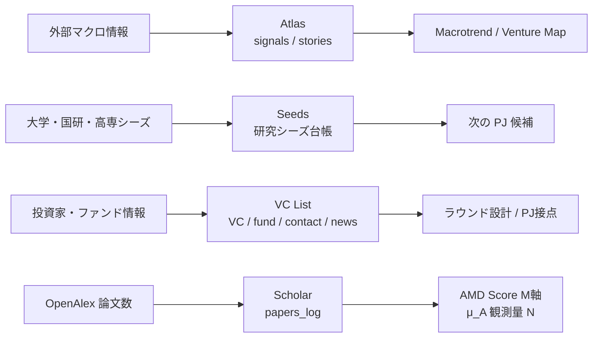
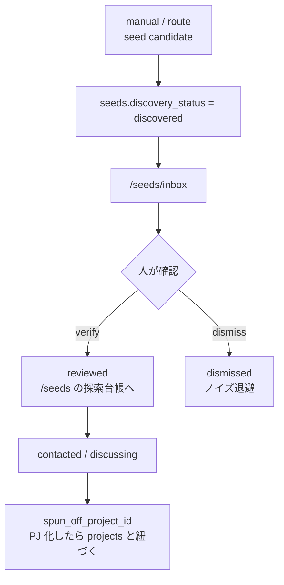
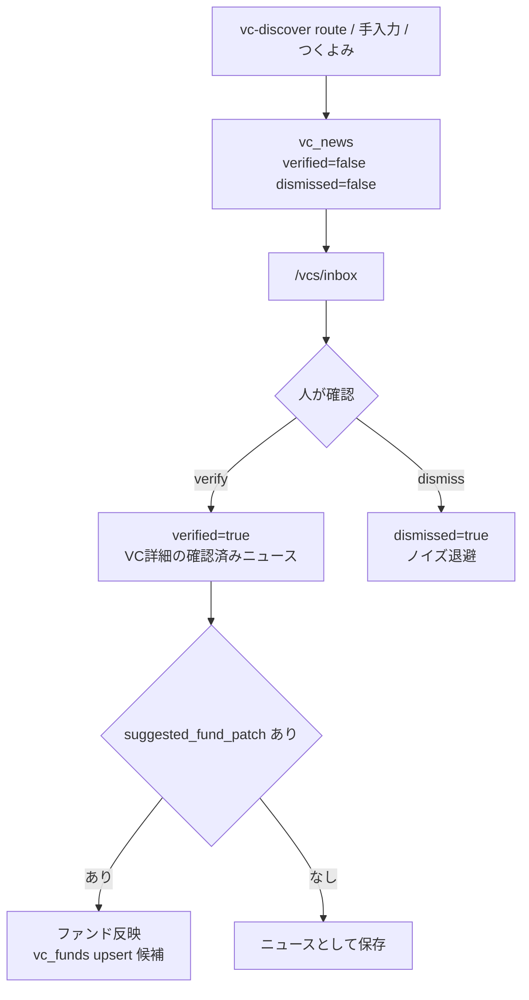

# 33. 探索系アセット詳細仕様 — Seeds / VC / Scholar

09 章は「使い方の入口」。この章は、探索系アセットのデータ構造、inbox、cron route、手動補正、AMD Score / Venture Map への接続をまとめる詳細仕様。

対象は `/seeds`、`/vcs`、`/scholar`。Atlas / Macrotrend の signal / story / theme / divergence は [34 章 Atlas / Macrotrend 詳細仕様](34-atlas-macrotrend-signal-spec.md) に分ける。

## 33.1 4 系統を混ぜない

探索系は似た情報を扱うが、正本テーブルと目的が違う。

| 系統 | 役割 | 正本テーブル | 確認前の置き場 |
|---|---|---|---|
| Atlas | 外部マクロ signal / story / decision | `atlas_signals`, `atlas_stories`, `atlas_decisions` | `/atlas/inbox` |
| Seeds | 研究シーズ候補そのもの | `seeds`, `seed_funding`, `seed_news`, `seed_contact_log` | `/seeds/inbox` |
| VC List | 投資家・ファンド・PJ接点・VCニュース | `vcs`, `vc_funds`, `vc_investments`, `vc_contacts`, `project_vc_relations`, `vc_news` | `/vcs/inbox` |
| Scholar | 学術活動量の時系列 | `papers_log` | なし。cron が集計値を直接 upsert |



## 33.2 Seeds 仕様

Seeds は AMD の Before 0 起点となる研究シーズ台帳。1 行は「技術 x 応用先」の案件単位で、研究者や機関単位ではない。

| 項目 | 内容 |
|---|---|
| 画面 | `/seeds`, `/seeds/{id}`, `/seeds/inbox`, HUD 版 `/hud/seeds/*` |
| 本体 | `seeds` |
| サブテーブル | `seed_funding`, `seed_news`, `seed_contact_log` |
| 主な軸 | `status`, `discovery_status`, `domain_lane`, `amd_rating`, `amd_owner_member_id`, `spun_off_project_id` |
| 書き込み | `SeedDetailModal` の手動 CRUD、inbox verify / dismiss |

`status` は探索・接触の業務状態。

```text
candidate -> investigating -> contacted -> discussing
  -> spun_off / declined
```

`discovery_status` は「自動収集候補を人が確認したか」の状態。

| status | 意味 | 表示 |
|---|---|---|
| `discovered` | 自動収集 route が見つけた未確認候補 | `/seeds/inbox` |
| `reviewed` | 人が採用済み | `/seeds` |
| `dismissed` | ノイズとして退避 | 通常一覧から除外 |



注意点:
- Seeds は Atlas signal ではない。採択ニュースや論文 URL は `seed_news` に残す。
- `domain_lane` は現状 `gx_energy / gx_circular / life / materials / robo / ict / other` の探索用分類。AMD Score / Macrotrend の正本分類である ASPI 8 domain とは別。
- `spun_off` になった seed はアクティブ filter から外れるが、情報資産として残す。

## 33.3 VC List 仕様

VC List は「投資家マスタ」ではなく、AMD の PJ ラウンド設計に使う関係台帳。

| 項目 | 内容 |
|---|---|
| 画面 | `/vcs`, `/vcs/{id}`, `/vcs/{id}/edit`, `/vcs/inbox`, HUD 版 `/hud/vcs/*` |
| 本体 | `vcs` |
| サブテーブル | `vc_funds`, `vc_investments`, `vc_contacts`, `project_vc_relations`, `vc_news` |
| 主な軸 | `amd_rating`, `stage_focus`, `ticket_min/max_jpy`, `dry_powder_*`, `project_vc_relations.status` |
| 書き込み | `/vcs/{id}/edit`, detail modal、inbox verify / dismiss、admin import API |

VC と PJ の関係は `project_vc_relations` で管理する。

```text
not_contacted -> pitching -> evaluating -> dd -> term_sheet -> invested
                                       \-> passed / declined
```

`vc_investments.our_project_id` は実出資イベント。`project_vc_relations.status='invested'` は関係状態。両方が立つことがあるが、意味が違うので冗長を許す。

## 33.4 DPE とファンド情報

`vc_funds` はファンド単位。`fund_no` で号数を持ち、`vc_id + fund_no` が upsert 単位。

| 列 | 意味 |
|---|---|
| `size_jpy` / `size_jpy_low/high` | 公表または推定のファンドサイズ |
| `status` | `raising`, `first_closed`, `final_closed`, `investing`, `harvesting`, `closed`, `unknown` |
| `dry_powder_jpy_low/high` | AMD が見る DPE 残レンジ |
| `dry_powder_source` | `estimated`, `heard_from_contact`, `public_disclosure` |
| `dry_powder_heard_from` | `heard_from_contact` の時の `vc_contacts.id` |

DPE 残は「投資余力」なので、ファンドサイズとは分ける。担当者から聞いた情報は `heard_from_contact` として、誰から聞いたかまで残す。

## 33.5 VC News Inbox

`vc_news` は Atlas とは別系統。VC のファンドレイズや人事、投資ニュースを蓄積する。



`fundraise` / `fund_close` のニュースでは `suggested_fund_patch` を持てる。これは自動確定ではなく、人が inbox で見て `vc_funds` へ反映する候補。

## 33.6 Scholar 仕様

Scholar は個別論文管理ではなく、AMD Score の M 軸に使う学術活動量の観測画面。

| 項目 | 内容 |
|---|---|
| 画面 | `/scholar` |
| 正本 | `papers_log` |
| 粒度 | ASPI 8 domain x quarter |
| 取得元 | OpenAlex |
| cron | `/api/cron/papers-quarterly-ingest` |
| schedule | Vercel cron `20 18 * * 1` (= JST 火曜 03:20) |
| 認証 | `Authorization: Bearer $CRON_SECRET` |
| upsert | `lane, observed_at` unique |

`papers-quarterly-ingest` は `ASPI_DOMAIN_IDS` と `OPENALEX_QUERY_BY_DOMAIN` を使い、直近 16 quarter 分を取得する。`papers_log.paper_count` は当該 domain x quarter の OpenAlex hit count。

読む時のポイント:
- 「どの論文が良いか」ではなく「どの domain の学術活動量が増減しているか」を見る。
- `papers_log` は μ_A 観測量 N の主入力。AMD Score の M 軸や Macrotrend map と同じ ASPI 8 domain に揃える。
- 古い `scholar` テーブルは個別論文型の旧案。現行画面は `papers_log` を読む。

## 33.7 自動収集 route の現在地

2026-05-22 以降、LLM / web_search を使う Vercel cron は課金暴発防止のため schedule から外している。route 自体は手動 review batch 用に残す。

| route | 自動 schedule | 理由 / 使い方 |
|---|---|---|
| `/api/cron/seeds-ingest` | 停止中 | Claude + web_search で研究シーズを探す。明示的に review batch として動かす時だけ使う |
| `/api/cron/vc-discover` | 停止中 | Claude + web_search で VC ニュース / 新 VC stub / `suggested_fund_patch` を作る。通常は手動・つくよみ・inbox確認で補完 |
| `/api/cron/papers-quarterly-ingest` | 稼働中 | OpenAlex の非 LLM 集計。Vercel cron に残す |

## 33.8 Admin / Import API

VC 系には一回限り・補正用 API がある。通常 UI ではなく、復元・初期投入・精度向上用。

| API | 役割 | 認証 |
|---|---|---|
| `POST /api/admin/seed-vcs` | 国内 deeptech VC 初期リストを Claude + web_search で生成し `vcs`, `vc_funds`, `vc_investments` に upsert | `CRON_SECRET` |
| `POST /api/admin/enrich-vcs?offset=&limit=` | 既存 VC を batch で再検索し、thesis / funds / investments を補完 | `CRON_SECRET` |
| `POST /api/admin/extract-amd-pj-investments` | 既存 PJ の公開出資履歴を抽出し `vc_investments` と `project_events` に入れる | `CRON_SECRET` |
| `POST /api/admin/import-contacts-from-sheet` | Google Sheet text から PJ x VC x 担当者 x status を構造化し、`vc_contacts` / `project_vc_relations` に upsert | `CRON_SECRET` |
| `GET /api/admin/inspect-sheet` | Sheets の header / sample を確認 | admin session または `CRON_SECRET` |
| `GET /api/admin/restore-from-sheet` | 旧 master sheet から `projects` / `project_members` を復元 | `CRON_SECRET` |

## 33.9 既知の注意点

- `/api/cron/seeds-ingest` と `/api/cron/vc-discover` は「実装済み route」だが「定期実行中」ではない。
- VC の `amd_rating` は世間的な優良度ではなく、AMD にとっての相性。
- `seed_news` と `vc_news` は Atlas へ混ぜない。Atlas は外部マクロ、Seeds / VC は探索台帳。
- Seeds の `domain_lane` は旧探索分類。Scholar / Macrotrend / AMD Score の ASPI 8 domain とは同じ名前空間ではない。
- Scholar は個別論文の本文要約を持たない。根拠を深掘りしたい場合は OpenAlex query と `papers_log.query_hash` から追う。
