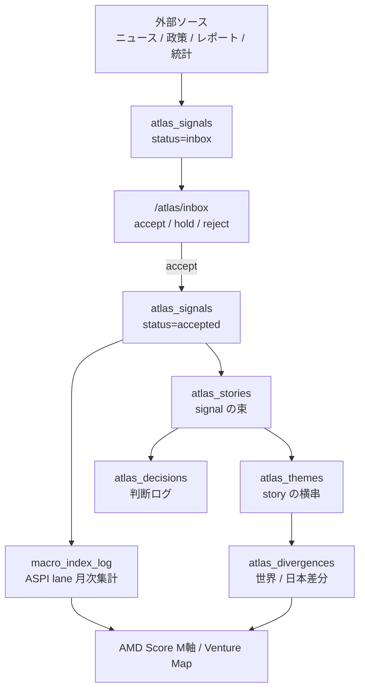
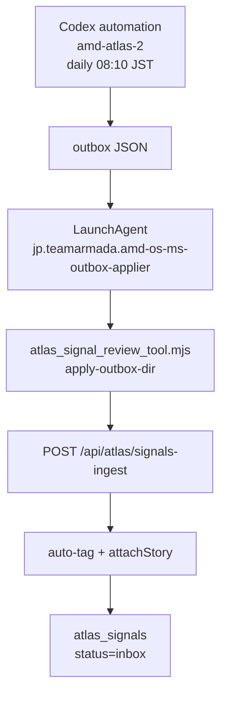
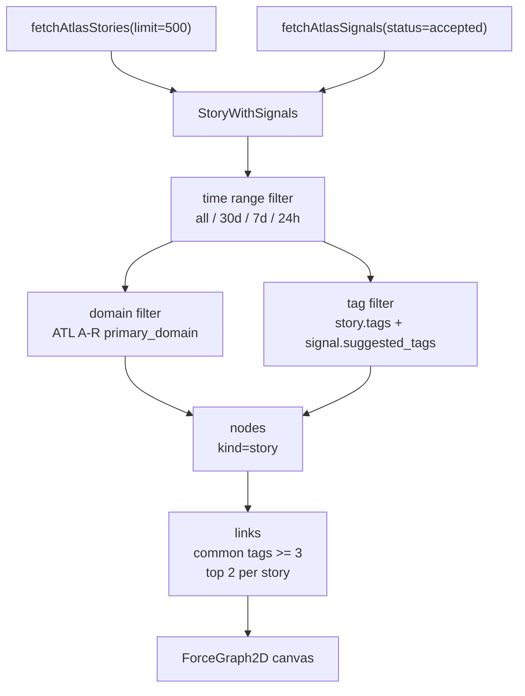
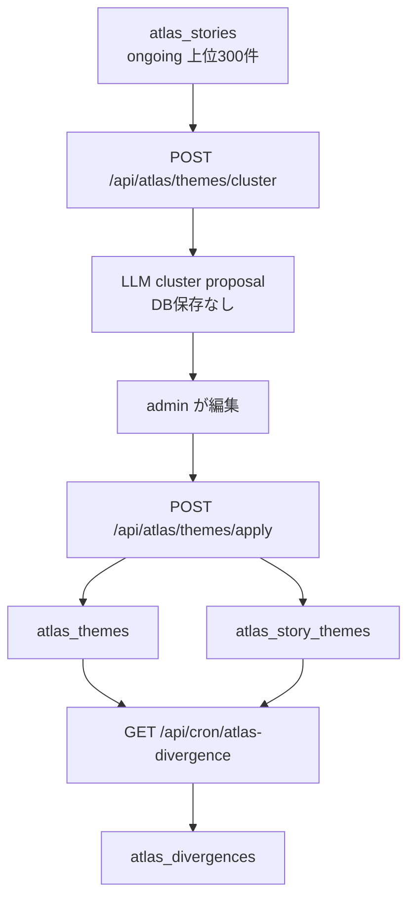

# 34. Atlas / Macrotrend 詳細仕様

07 章は判断エンジンの入口。この章は、Atlas / Macrotrend の現行データモデル、収集経路、review flow、theme / divergence、停止中 cron、API 認証境界まで含めた詳細仕様。

対象は `/atlas`、`/atlas/inbox`、`/atlas/inbox/submit`、`/atlas/map`、`/atlas/admin/themes`、`/atlas/divergence`、`/atlas/macrotrends`、`/atlas/decisions`。

## 34.1 Atlas と Macrotrend の分担

| レイヤー | 役割 | 主なテーブル | 主な画面 |
|---|---|---|---|
| Macrotrend | 10-30 年の構造課題と AMD が見るべき技術波を置く上位地図 | `papers_log`, `macro_index_log`, `atlas_signals` | `/atlas/macrotrends` |
| Atlas Signal | 個別の政策・ニュース・レポート・統計・手動メモ | `atlas_signals` | `/atlas/inbox`, `/atlas` |
| Atlas Story | 複数 signal をまとめる出来事・継続テーマ | `atlas_stories` | `/atlas`, `/atlas/map` |
| Atlas Theme | story より粗い横串テーマ | `atlas_themes`, `atlas_story_themes` | `/atlas/admin/themes` |
| Atlas Divergence | theme 単位の世界 / 日本差分 | `atlas_divergences` | `/atlas/divergence` |
| Atlas Decision | Atlas 由来の判断ログ | `atlas_decisions` | `/atlas/decisions` |



## 34.2 ドメイン軸

Atlas signal の `domain` は ATL 独自の A-R 分類。Macrotrend / AMD Score の正本分類である ASPI 8 domain とは別。

| 軸 | 粒度 | 用途 |
|---|---|---|
| ATL A-R domain | 外部 signal を読むための編集分類 | `atlas_signals.domain`, `atlas_stories.primary_domain`, `atlas_themes.primary_domain` |
| ASPI 8 domain | AMD Score / Macrotrend / Scholar の正本技術分類 | `papers_log.lane`, `macro_index_log.lane`, `/scholar`, `/atlas/macrotrends` |

ATL A-R のうち P/Q/R は ASPI 8 domain を補うために追加された。

| code | label |
|---|---|
| P | 量子・量子計算 |
| Q | センシング・計測 |
| R | 先端通信 |

`macro-aggregate-indicators` は `atlas_signals.domain` を ASPI 8 domain に簡易 mapping して `policy_mention_count` / `raw_signal_count` を月次集計する。概念軸は完全一致しないため、`metadata.lane` がある場合はそちらを優先する。

## 34.3 Signal の状態

`atlas_signals` は確認前候補も確定済み根拠も同じテーブルで扱う。

| column | 意味 |
|---|---|
| `title` / `content` / `source_url` | signal 本体。全文保存ではなく要約 + URL |
| `source_type` | `news`, `report`, `data`, `manual`, `policy` |
| `domain` | ATL A-R domain |
| `suggested_tags` | 横串検索用タグ |
| `importance` | `high`, `medium`, `low` |
| `status` | `inbox`, `accepted`, `held`, `rejected` |
| `story_id` | 紐づく `atlas_stories.id` |
| `metadata` | 政策 source の省庁、発表日、PDF 情報など |

```text
inbox -> accepted
      -> held
      -> rejected
```

確認前の `inbox` はまだ正本ではない。AMD Score や Macrotrend 根拠として強く使うのは、基本的に review 後の `accepted`。

## 34.4 収集経路

現行主系は Codex automation + local applier。LLM が直接 DB に書かず、outbox JSON を非 LLM helper が反映する。



主な path:
- automation 本体: `/Users/masa/.codex/automations/amd-atlas-2/automation.toml`
- 公式 outbox: `/Users/masa/.codex/automations/amd-atlas/outbox/*.json`
- staging outbox: `/Users/masa/.codex/automations/amd-atlas-2/outbox/*.json`
- helper: `pwa/scripts/atlas_signal_review_tool.mjs`
- applier: `scripts/run-ms-outbox-applier.sh`

`amd-atlas-2` が sandbox 等で公式 outbox に書けない時は staging outbox に残る。applier は公式 outbox を優先し、staging が残っている場合は重複 dedupe を効かせたうえで反映する設計にする。

## 34.5 Ingest API

`POST /api/atlas/signals-ingest` は automation outbox の受け口。

| 項目 | 内容 |
|---|---|
| 認証 | `Authorization: Bearer ${ATLAS_INGEST_SECRET || CRON_SECRET}` |
| 入力 | `{ signals: [{ title, content, source_url, source_type, domain, importance }] }` |
| 重複排除 | 直近 48h + 入力 title / source_url の全期間 exact match |
| LLM 使用 | Haiku auto-tag + `attachStory` |
| 保存 | `atlas_signals.status='inbox'`, `story_id` 付き |

`source_type='policy'` は主に policy collector が直接保存する。通常 ingest は `news/report/data/manual` を受ける。

補助 API:

| route | 役割 | 認証 |
|---|---|---|
| `GET /api/atlas/recent-titles` | automation が重複回避用に直近 title を取る | `ATLAS_INGEST_SECRET || CRON_SECRET` |
| `POST /api/atlas/seed` | bulk seed signal 投入 | `CRON_SECRET` |
| `GET /api/atlas/backfill?domain=A&months=3` | domain 別の手動 backfill | `CRON_SECRET` |
| `GET /api/atlas/match-stories` | orphan signal の story 付け | `CRON_SECRET` |

## 34.6 Inbox / Review

`/atlas/inbox` は `status='inbox'` の signal を見る場所。

| 操作 | DB 変化 |
|---|---|
| Accept | `status='accepted'`, `reviewed_at=now()` |
| Hold | `status='held'`, `reviewed_at=now()` |
| Reject | `status='rejected'`, `reviewed_at=now()` |
| すべて承認 | inbox 全件を `accepted` |
| source filter | `all`, `news`, `policy` |

`/atlas/inbox/submit` は手動 signal 投入。タイトル、内容、source URL は必須。タグが空なら `/api/atlas/auto-tag` で生成する。`auto-tag` は Anthropic API を使うため、ログイン済み session が必要。

## 34.7 Story 操作

`/atlas` は accepted signal と story を中心に見る。signal は story に紐づくが、orphan signal も残る。

| 操作 | route | 内容 |
|---|---|---|
| story merge | `POST /api/atlas/merge-stories` | from story の signals を to story へ移し、merge log を残して from を削除 |
| signal detach | `POST /api/atlas/move-signal` | signal の `story_id` を null にする |
| signal move | `POST /api/atlas/move-signal` | signal を別 story へ付け替える |
| signal createNew | `POST /api/atlas/move-signal` | signal から新 story を作る。必要なら Haiku で title / summary 提案 |

これらは story 構造を変える操作なので admin session 必須。DB 更新自体は service role で行う。

## 34.8 Atlas Map

`/atlas/map` は accepted signal に紐づく `atlas_stories` だけを描画するグラフビュー。現行版は signal / project / decision の混在グラフではなく、**story node graph** として運用する。



| 項目 | 現行仕様 |
|---|---|
| node | `StoryNode` のみ。`id=s:${story.id}`, `name=story.title`, `story=StoryWithSignals` |
| node size | `4 + signal_count * 4 + (importance='high' ? 6 : 0)` |
| node color | `primary_domain` を `domainColor()` で ATL domain 色へ変換 |
| recent badge | `last_updated_at` ではなく story 内の最新 `signal.submitted_at` が直近24hなら `NEW` |
| label | zoom が大きい / high importance + signal 4件以上 / signal 6件以上で表示 |
| link | story 同士の共通 tag が 3 個以上。各 story から類似度上位 2 件まで |
| filters | time range、domain 複数選択、tag 複数選択。tag は OR 条件 |
| detail | node click で `centerAt()` + `zoom(2.5)` し、右側 detail panel を開く |
| drag | drag end した node だけ `fx/fy` で固定。他 node の pin は解除 |

力場は 2026-05-11 の分散化実装が正本。2026-05-25 #65 で本番 `/atlas/map` を再確認し、manual / BUGS を現行実装へ同期した。

| force / option | 値 | 理由 |
|---|---:|---|
| initial position | domain 角度 + `RADIUS=3000` + 半径/角度 jitter | 初期状態から domain 別に広げる |
| `center` / `isolatedCenter` | `null` | 中央密集と外周ドーナツ化を避ける |
| `radialDomain` | `(target - current) * 0.15 * alpha` | domain ごとに空間方向を分ける |
| custom collide | `minDist=(ra+rb)*8`, alpha 非依存 | cooldown 後も node が重なったまま止まらないようにする |
| charge | `-30000` | 大量 story を強く反発させる |
| link | `distance=600`, `strength=0.05` | 共通 tag link の中央引力を弱める |
| `cooldownTime` | `8000` | tick 数ではなく時間で収束を管理 |
| `warmupTicks` | `150` | 初期配置を安定させる |
| `d3VelocityDecay` | `0.18` | 動きすぎを抑える |
| `onEngineStop` | intentionally empty | `zoomToFit` による数秒後の再縮小を起こさない |

ブラウザ確認メモ:
- 2026-05-25 #65: production `https://amd-os-pwa.vercel.app/atlas/map` で `183 stories · 144 共通テーマ接続`、canvas 1 枚、凡例、domain/tag filters 表示を確認。
- canvas pixel 直接検査は browser runtime の制約で未実施。ただしスクリーンショット上では node / link / label / legend が描画されている。

## 34.9 Theme / Divergence

`/atlas/admin/themes` は story を横串 theme にまとめる管理画面。



| route | 内容 | 認証 |
|---|---|---|
| `GET /api/atlas/themes/list` | active theme と story count | admin |
| `POST /api/atlas/themes/cluster` | story 群から theme 候補を LLM 生成。保存しない | admin |
| `POST /api/atlas/themes/apply` | theme upsert + story link 保存。`replace=true` は対象 story の既存 link を入れ直す | admin |
| `GET /api/cron/atlas-divergence` | theme 単位で世界 / 日本差分を生成 | `CRON_SECRET` |

`atlas_divergences` は `theme_id` 一意。`global_intensity`, `japan_intensity`, `divergence_score`, summary, signal breakdown を持つ。

## 34.10 Macrotrend 画面

`/atlas/macrotrends` は Atlas の signal 一覧ではなく、ASPI 8 domain の上位課題地図。

見るもの:
- ASPI 8 domain ごとの 2030 / 2040 / 2050 thesis
- UN / WEF / ASPI / OpenAlex などの根拠 overlay
- `papers_log` の論文数
- accepted `atlas_signals`
- `atlas_divergences`
- `seeds`

Macrotrend は「どの波を見るか」、Atlas は「その波を支える個別根拠と判断ログ」。Seeds は「その波に乗る研究シーズ」。VC List は「資本側の接点」。混ぜない。

## 34.11 稼働中 / 停止中 cron

2026-05-25 時点の current truth。

| route | 状態 | 理由 |
|---|---|---|
| `amd-atlas-2` Codex automation | 稼働中 | 外部マクロ signal の主系。daily 08:10 JST |
| `/api/cron/atlas-collect` | schedule なし / 手動 route | Anthropic web_search 課金回避で Vercel cron 化しない |
| `/api/cron/atlas-collect-policy` | 停止中 | LLM-backed collector。手動実行のみ |
| `/api/cron/atlas-divergence` | 停止中 | LLM-backed divergence 生成。手動実行のみ |
| `/api/cron/atlas-daily` | 停止中 | report 生成 cron。LLM-backed |
| `/api/cron/atlas-weekly` | 停止中 | report 生成 cron。LLM-backed |
| `/api/cron/atlas-monthly` | 停止中 | report 生成 cron。LLM-backed |
| `/api/cron/macro-aggregate-indicators` | 稼働中 | LLM 不使用。月初に observation / atlas signal を ASPI lane x month で集計 |

停止中 cron は `pwa/vercel.disabled-crons.json` に退避。Vercel cron として復活させる時は、owner が cost / trigger source を明示承認してから `pwa/vercel.json` へ戻す。

## 34.12 ASPI / Triple Helix 観測 route

ASPI 8 domain と Triple Helix 観測量は、Atlas そのものではなく Macrotrend / AMD Score の下地。route は残しているが、LLM-backed のため多くは停止中。

| route | 出力 | 状態 | 補足 |
|---|---|---|---|
| `/api/cron/lane-suggest` | `lane_suggestions` | stopped | `project_ventures.lanes IS NULL` の PJ に ASPI 8 domain weighted lane 候補を出す |
| `/api/cron/kaken-ingest` | `observation_log` (`key='I_R'`) | stopped | KAKEN OpenSearch を優先し、取れない部分だけ LLM fallback |
| `/api/cron/grant-ingest` | `observation_log` (`key='B'`) | stopped | NEDO / JST / AMED 採択ページ scrape + LLM fallback |
| `/api/cron/vc-investment-ingest` | `observation_log` (`key='V'`) | stopped | `vc_news` を材料に quarter × ASPI domain のVC投資額を推定 |
| `/api/cron/macro-aggregate-indicators` | `macro_index_log` | active | `observation_log` + `atlas_signals` を月次集計。LLMなし |
| `/api/cron/relearn-lane-weights` | `macro_lane_weights` | stopped | α/β/γ/δ/λ/η を Sonnet で再推定 |
| `/api/cron/macro-backfill-historical` | `macro_index_log` | stopped | 2010-2025 の historical row を lane × 4年 chunk で推定 |

`lane-suggest` / `kaken-ingest` / `grant-ingest` / `vc-investment-ingest` は以前 GAS 154 から weekly curl していたが、2026-05-25 時点では GAS 側の ASPI cron trigger は停止中。MS progress の毎時推定とは分けて扱う。

## 34.13 認証境界

| route group | 境界 |
|---|---|
| ingestion / recent / match / backfill / seed | secret (`ATLAS_INGEST_SECRET` or `CRON_SECRET`) |
| auto-tag | logged-in user |
| story merge / signal move | admin |
| theme list / cluster / apply | admin |
| divergence / policy collector / report cron | `CRON_SECRET` |
| ASPI / Triple Helix cron | `CRON_SECRET` |

原則:
- service role を使う route は、先に admin / secret を確認する。
- Anthropic API を使う route は、公開 anonymous から叩けないようにする。
- LLM 定期処理は Vercel cron で増やさず、Codex automation / Claude routine / 手動 run を優先する。

## 34.14 トラブルシュート

| 症状 | まず見る |
|---|---|
| Atlas inbox が増えない | `~/.codex/automations/amd-atlas/outbox`, `~/.codex/automations/amd-atlas-2/outbox`, applier log |
| outbox が残る | `node pwa/scripts/atlas_signal_review_tool.mjs health`, `recent`, `apply-outbox-dir` |
| 重複 signal が出る | `/api/atlas/signals-ingest` の exact title / source_url dedupe、outbox staging の二重反映 |
| Macrotrend の数が 0 | `macro-aggregate-indicators`, `macro_index_log`, `atlas_signals.metadata.lane` |
| divergence が古い | `/api/cron/atlas-divergence` は停止中。手動 run が必要 |
| theme が変 | `/atlas/admin/themes` で cluster proposal を作り直し、apply 前に人が編集する |
| Atlas Map が中央密集する / 数秒後に縮む | `atlas/map/page.tsx` の `center=null`, `radialDomain`, hard collide, empty `onEngineStop` が消えていないか確認 |
