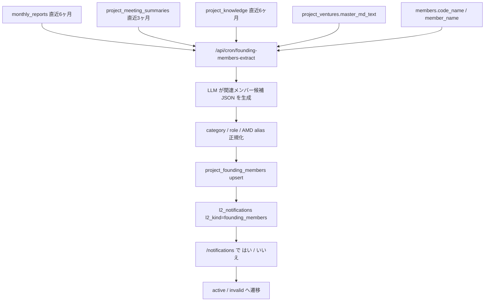
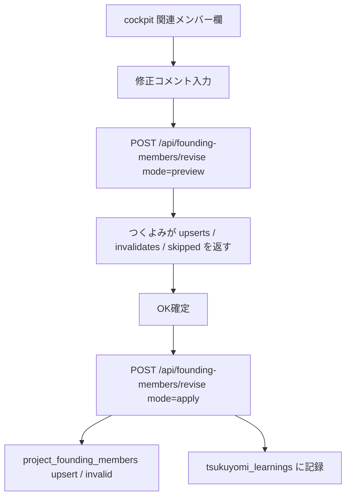
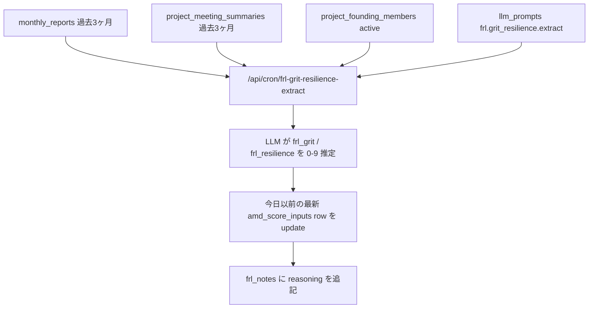

# 35. FRL / 関連メンバー / HRL 詳細仕様

AMD Score のうち、**人に関する readiness** を扱う章。21 章が AMD Score 全体の式なら、この章は HRL / FRL / `project_founding_members` の実装を細かく見る。

## 35.1 用語

| 用語 | 意味 | 主なテーブル / UI |
|---|---|---|
| HRL | Human Resources Readiness Level。チーム・人材・SU 立ち上げコアの readiness | `project_founding_members`, `amd_score_inputs.hrl` |
| FRL | Founder Readiness Level。CEO / founder の leadership readiness | `amd_score_inputs.frl_*`, `/venture-map/amd-score/{projectId}` |
| 関連メンバー | HRL 評価のベースになる人物台帳。DB 名は `project_founding_members` だが、マニュアル上は「関連メンバー」と呼ぶ | PJ cockpit のメンバーモーダル |
| ALQ | Authentic Leadership Questionnaire 4 次元 | `alq_self_awareness` など |
| Grit / Resilience | 起業特化の追加 2 因子 | `frl_grit`, `frl_resilience` |

`project_founding_members` という DB 名は紛らわしい。founder だけの表ではなく、**該当 SU の立ち上げ・経営・技術に直接コミットする人物 + AMD 伴走メンバー + 大学キーパーソン**を扱う。

## 35.2 HRL に算入する人物

HRL の算入対象は `status='active'` かつ `category in ('amd','startup','university')`。

| category | 算入 | 内容 |
|---|---:|---|
| `amd` | yes | AMD の伴走メンバー。`members.code_name` で記録 |
| `startup` | yes | 該当 SU の社員 / 社員候補 / 創業候補 |
| `university` | yes | CEO候補 / 共同創業者 / 技術リード / 起源PI / 共同研究中核として SU 立ち上げに深く関わる大学・研究機関人物 |
| `vc` | no | VC / ファンド / 投資家 / 出資検討者 |
| `partner_company` | no | 産業パートナー / 顧客 / サプライヤー / 委託先 |
| `government` | no | 補助金 / 行政 / 支援機関 / 採択担当 |
| `individual` | no | SU / AMD / 大学キーパーソンのどれにも入らない個人 |
| `unknown` | no | 判断保留。tentative / active でも HRL 算入からは外す |

大学・研究機関の人物は、所属だけで除外しない。SU の CEO候補・共同創業者・技術リード・起源PIとして実質的に SU と一体なら `university` で残し、HRL 根拠に入れる。

## 35.3 関連メンバーの role

| role | 意味 | HRL 上の扱い |
|---|---|---|
| `ceo_candidate` | CEO / 代表候補 | core role: CEO |
| `co_founder` | 共同創業者 | core role: CEO 側としても数える |
| `tech_lead` | 技術リード / CTO候補 | core role: 技術 |
| `researcher` | 研究者 / PI / 発明者 | core role: 技術 |
| `business_advisor` | 事業アドバイザ | core role: 事業 |
| `amd_support` | AMD 伴走 / PM / closer | core role: 事業 |
| `investor` | 投資家 | HRL 根拠外 |
| `partner` | 協業先 / partner | HRL 根拠外 |
| `unknown` | 不明 | 算入 category なら人数には入るが core role には入らない |

## 35.4 HRL 簡易推定ロジック

UI の HRL 簡易推定は `estimateHrlFromMembers()` の Phase 1 ルールベース。これは `amd_score_inputs.hrl` の人間入力値とは別の参考値。

```text
counted = active rows where category in {amd, startup, university}

hasCeo  = role in {ceo_candidate, co_founder}
hasTech = role in {tech_lead, researcher}
hasBiz  = role in {business_advisor, amd_support}
coreCount = hasCeo + hasTech + hasBiz
categories = distinct category count in counted

if total = 0:
  HRL = 0
else if total <= 3:
  HRL = min(3, 1 + coreCount)
else if total <= 9:
  HRL = 3 + min(3, coreCount)
else:
  HRL = 5 + min(4, coreCount + max(0, categories - 1))
```

この推定は「人がいるか」「CEO / 技術 / 事業のコア役割があるか」「AMD / SU / 大学キーパーソンの多様性があるか」を見る。最終的な HRL 評価では、コミットメント、意思決定速度、採用候補、業務委託候補、継続性も合わせて判断する。

## 35.5 関連メンバー抽出フロー



現状 `founding-members-extract` は route と手動キック用実装はあるが、Sonnet 利用のため Vercel schedule からは外している。`vercel.disabled-crons.json` の退避対象。

手動実行:

```text
GET /api/cron/founding-members-extract?project_id=p09
Authorization: Bearer CRON_SECRET
```

## 35.6 つくよみ修正依頼

PJ cockpit の関連メンバー欄から、つくよみに修正依頼を送れる。



`/api/founding-members/revise` は admin 必須。AMD メンバーは code_name に正規化し、大学キーパーソンは `category='university'` で残せる。VC / 顧客 / 行政 / 産業パートナーは skipped または invalid にする。

## 35.7 FRL 6 因子

FRL は CEO / founder の leadership readiness。UI では ALQ 4 次元 + Grit + Resilience の 6 因子で見る。

| 因子 | DB column | 意味 |
|---|---|---|
| 自己認識 | `alq_self_awareness` | 自分の強み・弱み・価値観の理解 |
| 関係透明性 | `alq_relational_transparency` | 本音と建前の一致、誠実性 |
| 均衡的処理 | `alq_balanced_processing` | 反対意見も含めた客観評価 |
| 道徳観 | `alq_internalized_moral` | 倫理基準への一貫性 |
| Grit | `frl_grit` | 長期目標への集中力と粘り |
| Resilience | `frl_resilience` | 失敗・拒絶から戻るタフさ |

自動算出モードでは次の式を使う。

```text
ALQ_avg = average(ALQ 4 dimensions that are not null)

FRL = 0.6 * ALQ_avg + 0.2 * Grit + 0.2 * Resilience
```

null の因子は除外し、有効因子の重み合計で再正規化する。全部 null なら自動 FRL は null。

## 35.8 FRL grit / resilience 抽出フロー



この route も Sonnet 利用のため Vercel schedule からは外している。手動実行時も CRON_SECRET が必要。

重要な安全策:
- 新規 `amd_score_inputs` row は作らない
- 今日以前の最新 row だけを update する
- `evaluator` は上書きしない
- 既存 row がない PJ は保存せず skip する

これは、grit / resilience だけの空 row を作って XRL / ALQ が 0 表示になる事故を避けるため。

## 35.9 通知と status

| 状態 | 意味 |
|---|---|
| `tentative` | LLM 抽出直後。通知の「はい」待ち |
| `active` | HRL / 関連メンバー表示に使う |
| `invalid` | 誤抽出 / 対象外。表示・算入しない |
| `left` | 過去に関与したが現在は離脱 |

`l2_notifications(l2_kind='founding_members')` に出た候補は、`/notifications` で「はい」を押すと `active`、「いいえ」を押すと `invalid` になる。

## 35.10 関連コード

| 領域 | ファイル |
|---|---|
| 関連メンバー data access / HRL 推定 | `pwa/src/lib/founding-members-data.ts` |
| 関連メンバー抽出 route | `pwa/src/app/api/cron/founding-members-extract/route.ts` |
| つくよみ修正 route | `pwa/src/app/api/founding-members/revise/route.ts` |
| cockpit 関連メンバー UI | `pwa/src/components/cockpit/CockpitMembersModal.tsx`, `CockpitFoundingMembersModal.tsx` |
| FRL 6 因子 UI / deriveFrl | `pwa/src/components/venture-map/AmdScoreView.tsx` |
| FRL grit / resilience route | `pwa/src/app/api/cron/frl-grit-resilience-extract/route.ts` |
| 通知 feedback | `pwa/src/app/api/notifications/feedback/route.ts` |

## 35.11 関連設計 md

- [`pwa/design/xrl_evidence.md`](../design/xrl_evidence.md)
- [`pwa/design/amd_score.md`](../design/amd_score.md)
- [`pwa/design/cockpit.md`](../design/cockpit.md)
- [`pwa/design/L2_DATA.md`](../design/L2_DATA.md)
