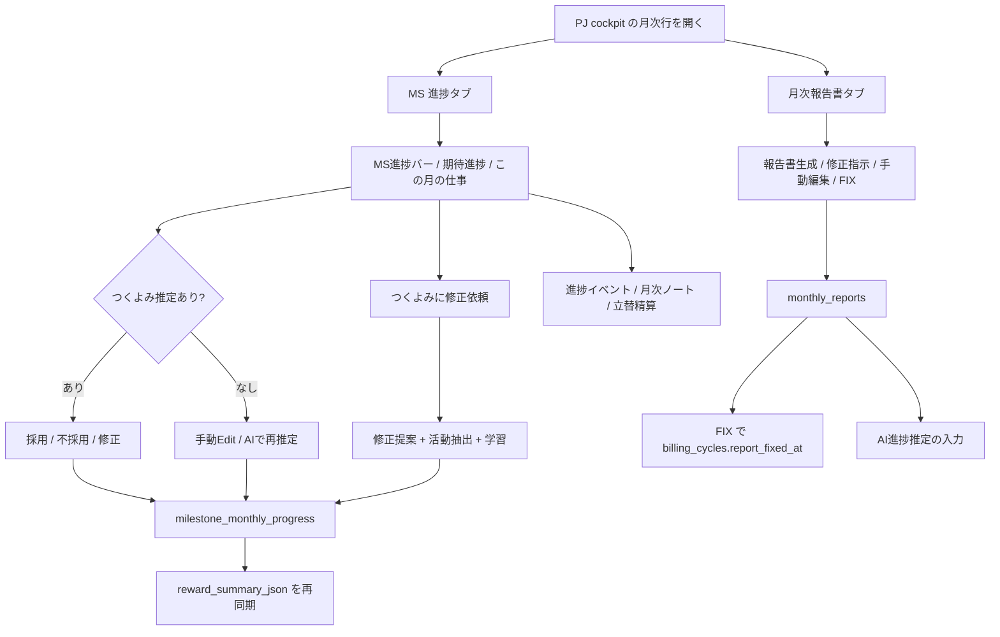
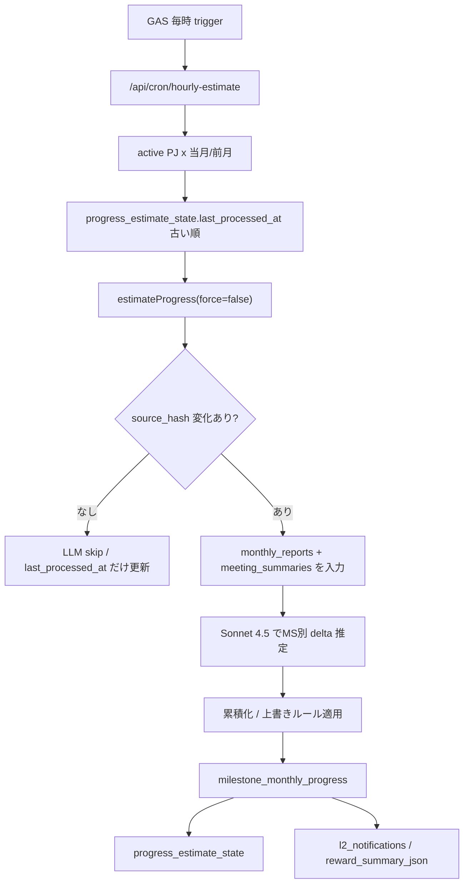
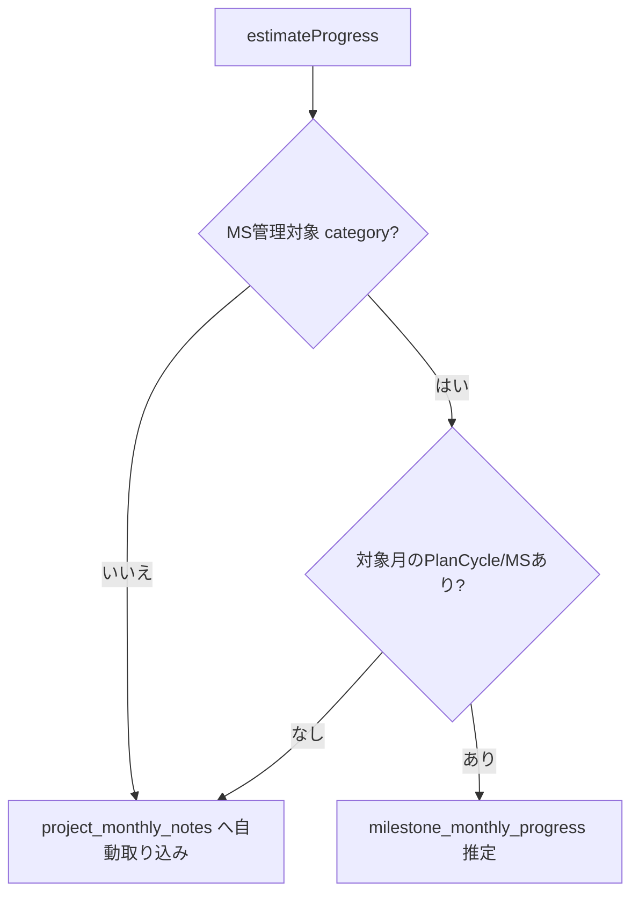
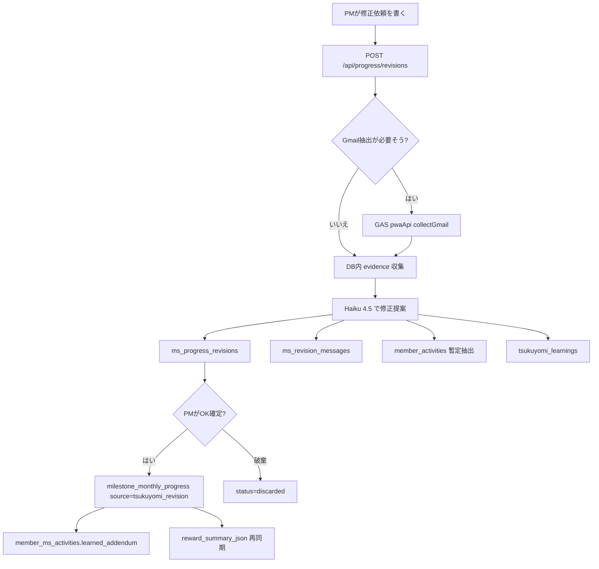

# 36. MS Progress / Monthly Report / Revision Loop 仕様

PJ コックピットの月次モーダルで扱う、MS 進捗、月次報告書、月次ノート、進捗イベント、つくよみ修正依頼の詳細仕様。

日常の使い方だけ知りたい場合は [01 章 1.2 年間マイルストーン](01-pj-cockpit.md#12-年間マイルストーン-ms) と [01 章 1.5 月次ルーティン](01-pj-cockpit.md#15-月次ルーティン--報告書--請求--会計) を読む。ここは、なぜその数字になるか、どの DB に保存されるか、どの route が動くかまで見る章。

## 36.1 対象範囲

| 領域 | 画面 / route | 主な保存先 |
|---|---|---|
| MS 進捗表示 | `/project/{projectId}/cockpit` の月次モーダル | `milestone_monthly_progress` |
| AI 進捗推定 | `GET /api/cron/hourly-estimate`, `POST /api/progress/estimate` | `milestone_monthly_progress`, `progress_estimate_state`, `l2_notifications` |
| PM 確認 | `POST /api/progress/confirm`, `POST /api/progress/batch-save` | `milestone_monthly_progress`, `billing_cycles.reward_summary_json` |
| 修正依頼 | `/api/progress/revisions` | `ms_progress_revisions`, `ms_revision_messages`, `member_activities`, `tsukuyomi_learnings` |
| 月次報告書 | `/api/report/generate`, `/api/report/fix`, `/api/monthly-report/*` | `monthly_reports`, `billing_cycles.report_fixed_at` |
| 月次ノート | `/api/project/monthly-note` | `project_monthly_notes` |
| 進捗イベント | `/api/progress/events` | `member_activities` |

## 36.2 月次モーダルのユーザーフロー



月次モーダルは、単なる表示画面ではなく **月次報告書 -> MS 進捗 -> 報酬サマリー -> 請求・支払ルーティン** をつなぐ編集面。進捗率を触る操作は、原則として `syncRewardSummaryForCycle(projectId, ym)` まで同時に走る。

## 36.3 MS 進捗のデータモデル

### `milestone_monthly_progress`

| 列 | 意味 |
|---|---|
| `milestone_key` | `value_milestones.milestone_id` |
| `ym` | 対象月 (`YYYYMM`) |
| `progress_pct` | その月時点の累積進捗率。0-100 |
| `consumed_pt` | `value_milestones.points * progress_pct / 100` |
| `source` | `tsukuyomi_estimate`, `pm_confirmed`, `pm_rejected`, `pm_manual`, `tsukuyomi_revision`, `criteria_toggle` など |
| `confirmed_at` | PM / route が確定扱いにした時刻 |
| `note` | AI 推定理由、PM 修正理由、修正依頼の反映内容 |

重要なのは、LLM が返す `progressPct` は **今月の増分** だが、DB に保存する `progress_pct` は **累積** という点。

```text
newCumPct = min(100, prevCum + llmDelta)
consumedPt = milestone.points * newCumPct / 100
```

### 上書きルール

AI 推定は、PM が明示的に入れた値を勝手に壊さない。

| 条件 | 挙動 |
|---|---|
| MS `tag='routine'` | 推定保存しない |
| LLM delta が 0 | 保存しない |
| 既存 `source='pm_manual'` | 上書きしない |
| 既存 `source='criteria_toggle'` | 上書きしない |
| 新累積値 <= 現在登録値 | 保存しない |
| 保存できた | `source='tsukuyomi_estimate'` で upsert |

PM 操作の保存 source:

| 操作 | 保存 source | 内容 |
|---|---|---|
| 採用 | `pm_confirmed` | `tsukuyomi_estimate` の値を確定扱いにする |
| 不採用 | `pm_rejected` | 前月累積値へ戻す |
| 修正 | `pm_confirmed` | 指定した累積進捗率に変更 |
| 手動Edit / 一括保存 | `pm_manual` | AI 推定が無くても直接保存できる |
| つくよみ修正依頼 OK確定 | `tsukuyomi_revision` | 修正提案の累積進捗率を保存 |

## 36.4 AI 進捗推定

現行の自動推定は PWA route の `estimateProgress(projectId, ym, opts)` が正本。対象 PJ category は `dtsu`, `ecosystem`, `new_business`。



### 入力ソース

`estimateProgress` が読む入力:

| 入力 | テーブル | 使い方 |
|---|---|---|
| 月次報告書 | `monthly_reports.final_content || draft_content` | 進捗推定の主ソース |
| MTG サマリ | `project_meeting_summaries` | 当月の議論・決定・next action を補助ソースにする |
| MS 設計 | `value_plan_cycles`, `value_milestones` | 対象 MS、ポイント、tag、goal_level |
| 前月までの進捗 | `milestone_monthly_progress` | 累積値計算の起点 |
| 当月の現在値 | `milestone_monthly_progress` | 上書き禁止 / 単調増加判定 |
| prompt | `tsukuyomi_context(tags='reward_estimate')` | AI 推定の system prompt |

### `progress_estimate_state`

毎時 polling で無駄な LLM call を打たないための state。

| 列 | 意味 |
|---|---|
| `project_id`, `ym` | state の単位 |
| `source_hash` | 月次ソース、MS メタ、前月累積、現在値、prompt から作った hash |
| `saved_count`, `skipped_count`, `total_count` | 直近推定の件数 |
| `llm_model` | 直近に使った model |
| `message` | スキップ理由や月次ノート保存理由 |
| `last_processed_at` | fairness sort 用。古いものから回る |

`GET /api/cron/hourly-estimate` は `maxItems` (= default 14) を超える LLM call を打たない。残りは `hasMore=true` にして次の時刻へ送る。

### 手動推定

月次モーダルの「AIで再推定」は `POST /api/progress/estimate { projectId, ym }` を呼び、`force=true` 相当で `source_hash` を無視して LLM を呼ぶ。

月次報告書生成直後も `/api/report/generate` 内で `estimateProgress(projectId, ym)` が走る。これは report 生成の成功 / 失敗とは切り離されていて、進捗推定が失敗しても報告書生成自体は成功扱いになる。

## 36.5 MS 対象外 PJ と月次ノート

MS 進捗の対象外 category、または対象月を覆う `value_plan_cycles` / 有効 MS が無い PJ では、config gap 通知を出すのではなく `project_monthly_notes` に当月ソースを保存する。



月次ノートは、MS がある PJ では「MS に紐付かない補足メモ」、MS がない PJ では「この月の動きを残す主要場所」。UI からの保存は `/api/project/monthly-note` で、admin 権限が必要。

自動取り込みは `## OS自動取り込み` ブロックとして merge される。PM が手で書いたメモがある場合は消さず、区切り線の下に自動取り込みを追加する。

## 36.6 進捗イベント

進捗イベントは `member_activities` を月次モーダル用に見せる layer。

| UI | DB / 列 |
|---|---|
| イベント名 / 内容 | `member_activities.title`, `content_preview` |
| 起点 | `initiative_origin` |
| 先手力 / depth | `impact`, `depth` |
| MS 紐付け | `milestone_id` |
| 責任配分 | `raw_metadata.responsibilities[]` |
| 却下 / 起点喪失理由 | `reject_reason`, `origin_lost_reason` |

`GET /api/progress/events` は admin 権限で、PJ × ym の `member_activities` 最大 80 件を返す。`PATCH /api/progress/events` は title、content、MS 紐付け、起点、impact、depth を編集する。

`POST /api/activities/infer` は旧「今すぐ推論」用の fallback route。月次レポート + MS責任者マトリクスから Haiku で `member_activities(source='inferred')` を再生成するが、service role で delete / insert するため **admin 必須**。通常のメンバー向け「今週やったこと」は `/api/mypage/weekly-activities/refresh` -> `/api/cron/member-weekly-activities` を使う。

## 36.7 つくよみ修正依頼ループ

MS 行の「この月の仕事」から、PM はつくよみに修正依頼を出せる。



修正依頼は「AI推定の数字を変える」だけではなく、仕事本文・活動抽出・今後の学習にも残る。

### `ms_progress_revisions`

| 列 | 意味 |
|---|---|
| `current_pct`, `current_note` | 依頼時点の表示値 |
| `revised_pct`, `revised_note` | つくよみ提案 |
| `status` | `pending`, `confirmed`, `discarded` |
| `requested_by`, `confirmed_by` | auth user email |

### Gmail 補助抽出

依頼文に `gmail`, `メール`, `mail`, `先方`, `やりとり`, `抽出` などが含まれる場合、PWA は GAS `pwaApi` の `collectGmail` を呼んで `source_cache` に Gmail thread を保存しようとする。Gmail 本文が取れなくても、PM の依頼文自体は一次情報として扱い、暫定活動を `member_activities` に残す。

## 36.8 月次報告書

月次報告書は `monthly_reports` が正本。

| 操作 | route | 保存 |
|---|---|---|
| 新規生成 / 再生成 | `POST /api/report/generate` | `draft_content`, `status='draft'`, `generated_at` |
| 修正指示付き再生成 | `POST /api/report/generate { feedback }` | 既存 draft/final を読み、`draft_content` を更新 |
| 手動本文更新 | `POST /api/monthly-report/manual-update` | `draft_content` を上書き |
| つくよみ本文修正 | `POST /api/monthly-report/edit-by-tsukuyomi` | `draft_content` を上書き |
| FIX | `POST /api/report/fix` | `final_content`, `status='fixed'`, `fixed_at`, `billing_cycles.report_fixed_at` |

`/api/report/generate` は 1 projectId あたり 60 秒の in-memory rate limit を持つ。入力は project / member / source_cache / MS / `tsukuyomi_context(tags='monthlyreport')`。生成成功後、進捗推定を fire-and-forget 的に呼ぶ。

`/api/monthly-report/manual-update` と `/api/monthly-report/edit-by-tsukuyomi` は `requireAuth`。`/api/report/generate` と `/api/report/fix` は `requireAdmin`。

FIX した月次報告書は、月次ルーティンの「月次報告書FIX」の完了判定になる。まとめ請求で `billing_cycles.invoice_ym` が稼働月と異なる場合でも、この step だけは稼働月側に残る。

## 36.9 route 一覧

| route | method | auth | 役割 |
|---|---|---|---|
| `/api/cron/hourly-estimate` | GET | `Bearer CRON_SECRET` | active PJ × 当月/前月を `last_processed_at` 古い順で推定 |
| `/api/progress/estimate` | POST | admin | 月次モーダルの手動 AI 再推定 |
| `/api/progress/unconfirmed` | GET | auth | 未確認の `tsukuyomi_estimate` を取得 |
| `/api/progress/confirm` | POST | admin | 採用 / 不採用 / 修正 / 手動保存 |
| `/api/progress/batch-save` | POST | admin | MS 全体 Edit の一括保存 |
| `/api/progress/revisions` | GET | auth | 修正依頼履歴を取得 |
| `/api/progress/revisions` | POST | admin | 修正依頼作成 / 再依頼 |
| `/api/progress/revisions` | PATCH | admin | OK確定 / 破棄 |
| `/api/progress/events` | GET | admin | 進捗イベント取得 |
| `/api/progress/events` | PATCH | admin | 進捗イベント編集 |
| `/api/activities/infer` | POST | admin | 旧 fallback。月次レポートから `member_activities(source='inferred')` を再生成 |
| `/api/progress/reimbursement` | GET | admin | 月次モーダルの立替精算表示 |
| `/api/report/generate` | POST | admin | 月次報告書生成 / 修正指示付き再生成 |
| `/api/report/fix` | POST | admin | 月次報告書 FIX |
| `/api/monthly-report/manual-update` | POST | auth | 月次報告書 draft 手動編集 |
| `/api/monthly-report/edit-by-tsukuyomi` | POST | auth | つくよみへの指示で本文改訂 |
| `/api/project/monthly-note` | GET/POST | admin | 月次ノート取得 / 保存 |

## 36.10 運用上の注意

- `progress_pct` は累積値。月次増分を直接保存しない。
- AI 推定は PM 手動値 (`pm_manual`) と criteria toggle 由来値を上書きしない。
- `source_hash` が同じなら cron は LLM を呼ばない。手動「AIで再推定」だけは force。
- MS なし / MS 対象外 PJ は `project_monthly_notes` で今月の動きを残す。
- 進捗を確定 / 修正 / 手動保存したら、報酬サマリーも同じ月で同期する。
- 月次報告書 FIX は請求ルーティンの完了条件。請求書発行や送付とは別 step。

## 関連

- 使い方: [01 章 PJ コックピット](01-pj-cockpit.md), [10 章 メンバーの日常ワークフロー](10-member-workflows-quick-start.md)
- 月次 / 請求: [26 章 Member Ops / Billing / Prompt 仕様](26-member-billing-prompts-spec.md), [32 章 Invoice / Billing Routine](32-invoice-and-billing-routine-spec.md)
- L2 / つくよみ: [03 章 データと抽出](03-data-and-extraction.md), [22 章 通知・つくよみ](22-notifications-and-tsukuyomi.md)
- 設計正本: [`pwa/design/ms_progress.md`](../design/ms_progress.md)
