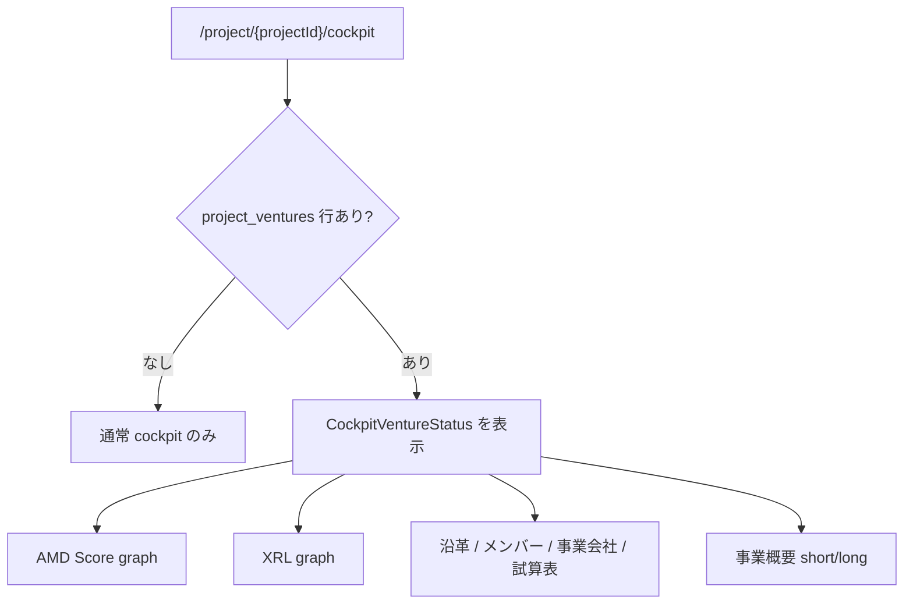
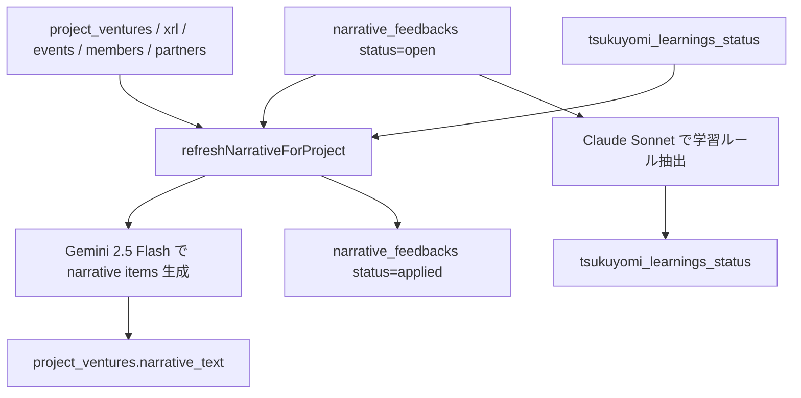
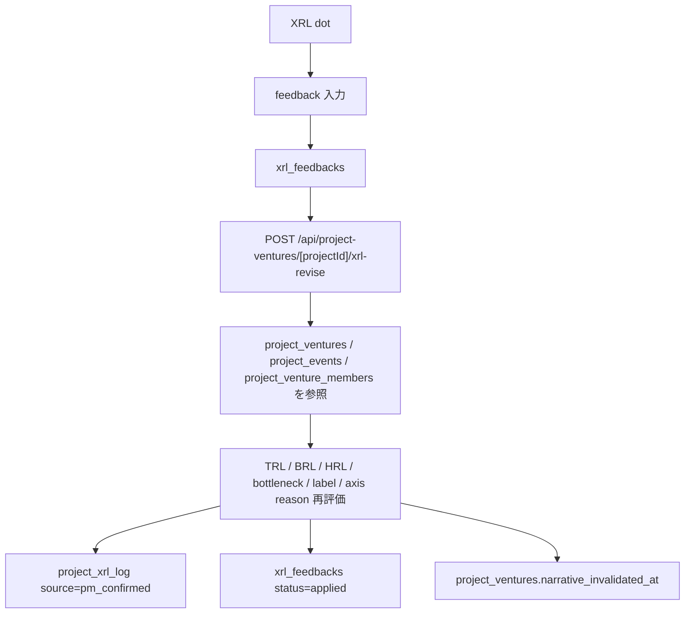

# 37. Venture Status / Narrative / PL / XRL Feedback 仕様

SU 系 PJ の hero 部分に出る Venture Status、事業概要、沿革、XRL 観測、試算表、つくよみ修正導線の詳細仕様。

ここでいう SU 系 PJ は `project_ventures` 行が存在する PJ。通常の DTSU 伴走 PJ でも `project_ventures` が無い場合、この章の hero / モーダル群は出ない。

## 37.1 対象画面

| 画面 / UI | 役割 |
|---|---|
| `/project/{projectId}/cockpit` の hero | `project_ventures` を中心に、AMD Score、XRL、沿革、メンバー、事業会社、試算表をまとめる |
| 事業概要 (詳細) モーダル | `long_description` を表示 / 直接保存 / つくよみマージ |
| 沿革モーダル | `project_ventures.narrative_text` を年月 + 一行 + 詳細で表示 |
| 沿革修正依頼 | `narrative_feedbacks` に保存し、即時再生成または次回 refresh で反映 |
| XRL ドット詳細 | `project_xrl_log` の TRL / BRL / HRL 観測を見て、フィードバック反映できる |
| 月次試算表 | `project_pl_monthly` を 36 ヶ月 view で表示 / 手入力 / ヒアリング生成 |

## 37.2 データモデル

| テーブル | 役割 |
|---|---|
| `project_ventures` | SU 系 PJ の基本情報。display name、lane、origin、PI、設立日、AMD参画期間、概要、沿革 cache |
| `project_events` | 汎用イベントログ。採用、調達、契約、技術進捗、ガバナンス、XRL観測、note など |
| `project_venture_members` | SU 側メンバー。AMD 内部メンバーの `project_members` とは別 |
| `project_partners` | 興味事業会社 / 協業先 / 顧客候補 |
| `project_xrl_log` | Venture Status の XRL 観測 dot |
| `xrl_feedbacks` | XRL dot への修正依頼 |
| `narrative_feedbacks` | 沿革への修正依頼 |
| `tsukuyomi_learnings_status` | 沿革生成 / PL ヒアリングに効く学習ルール |
| `project_pl_monthly` | PJ 別の月次 PL 予測 / 手入力値 |
| `project_pl_hearings` | つくよみ試算表ヒアリングの履歴 |

## 37.3 hero の表示条件



`project_ventures` のメタ更新や、XRL 反映、イベント追加は沿革を古くする可能性があるため、`narrative_invalidated_at` を更新して次回再生成対象にする。

## 37.4 事業概要マージ

| 列 | UI | 役割 |
|---|---|---|
| `short_description` | hero の短い説明 | 1-2 行サマリ |
| `long_description` | 事業概要詳細モーダル | 技術、市場、差別化、ビジネスモデルの長文説明 |

| 操作 | 保存 |
|---|---|
| 直接編集 | `project_ventures.long_description` |
| つくよみマージ | 既存説明と追記文を統合して保存 |

つくよみマージは既存 short / long と追記文を照合し、重複を除き、矛盾があれば新情報を優先して統合する。「ネットで調べて」「最新情報を入れて」と書いた場合は web search を使って補足する。

保存後は `long_description`, `short_description`, `narrative_invalidated_at`, `updated_at` を更新する。**admin 権限が必要**。

## 37.5 沿革生成と修正依頼

沿革は `project_ventures.narrative_text` に JSON 配列文字列として保存する。表示は `CockpitNarrativeModal` が行い、生成は `refreshNarrativeForProject()` が正本。



| 操作 | 役割 |
|---|---|
| 自動再生成 | `narrative_text` が無い、または `narrative_invalidated_at > narrative_generated_at` の PJ を再生成 |
| 即時再生成 | 1 PJ だけ即時再生成。沿革修正依頼の直後に呼ぶ |

沿革の各行、または沿革全体に対して修正依頼を送ると `narrative_feedbacks` に保存される。その後 `narrative-regen` が即時に走り、成功すれば `project_ventures.narrative_text` を更新し、`narrative_feedbacks.status='applied'` にし、修正依頼から学習ルールを抽出して `tsukuyomi_learnings_status` に保存する。

学習ルールは `scope='narrative'` で、全 PJ 共通なら `target_project_id=null`、PJ 固有なら `target_project_id=<projectId>`。

## 37.6 XRL feedback

XRL dot は `project_xrl_log` の行。ドット詳細モーダルから修正依頼を出すと、まず `xrl_feedbacks` に保存され、`/api/project-ventures/[projectId]/xrl-revise` が Gemini 2.5 Flash で再評価する。



保存される `source_note` は、軸別 reason を JSON 文字列にしたもの:

```json
{
  "trl_reason": "...",
  "brl_reason": "...",
  "hrl_reason": "..."
}
```

`xrl-revise` は service role で `project_xrl_log` を更新するため **admin 必須**。

## 37.7 project events

`project_events` は沿革と AMD Score graph の annotation を駆動するイベントログ。

| kind | 用途 |
|---|---|
| `hire` | 採用 / 経営メンバー追加 |
| `funding` | 資金調達 / grant |
| `deal` | PoC / NDA / MoA / 売上 / ライセンス |
| `tech_progress` | 技術進捗 |
| `governance` | 重要な意思決定 |
| `xrl_obs` | XRL 観測 |
| `amd_score_override` | AMD Score annotation / override |
| `note` | 汎用メモ |

自由文のイベント入力は、kind 別の `meta` に構造化して保存候補を作れる。DB に直接書く前にログイン中ユーザーが確認する。

実際の insert / update / delete は `project_events` へ行い、ログイン session に依存する。

## 37.8 AMD Score graph の編集 hit area

Venture Status の AMD Score graph は、現在日までを実線、未来予測を破線で表示する。未来予測 path は線そのものが細く、クリックしづらいため、未来予測の各点に透明 hit area を重ねる。

| 対象 | 挙動 |
|---|---|
| 過去 / 現在のイベント dot | 既存 `project_events` 編集モーダルを開く |
| グラフ空白 | クリックした X 座標の日付で `project_events` 新規作成モーダルを開く |
| 未来予測点 | 透明 hit circle が `p.date` そのものを使って `project_events` 新規作成モーダルを開く |
| 現在スコア pill | AMD Score breakdown modal を開く |

注意: ここはクリック範囲改善まで。将来のスコア前提そのものを修正する UI は別実装。修正履歴と alpha feedback loop の設計は [21 章 21.11](21-amd-score-spec.md#2111-未来予測修正と-alpha-feedback-loop) が正本。

## 37.9 月次試算表とヒアリング

月次試算表は `project_pl_monthly` が互換テーブル。今後の会社全体予実は [29 章 Management Score / Finance Simulation](29-management-score-and-finance-simulation-spec.md) 側の `company_budget_monthly` / `company_actual_monthly` へ寄せるが、PJ 単位の将来仮説・補助入力としてこの UI は残す。

| 列 | 意味 |
|---|---|
| `revenue_yen` | 売上 |
| `cogs_yen` | 売上原価 |
| `personnel_yen` | 人件費 |
| `rd_yen` | R&D 費 |
| `marketing_yen` | マーケ費 |
| `other_opex_yen` | その他 OPEX |
| `notes` | 確定 / 推定 / 前提メモ |

`POST /api/project-ventures/[projectId]/pl-hearing/turn` は、つくよみが 1 ターンずつ質問し、十分な情報が揃ったら 12-36 ヶ月分の PL を返す。

入力は `project_ventures`, `project_events`, `project_venture_members`, `project_partners`, `project_xrl_log`, 既存 `project_pl_monthly`, `tsukuyomi_learnings_status(scope in ['pl_hearing','all'])`, UI から渡す `history[]` と `new_answer`。

`done=false` なら次の質問を返す。`done=true` なら `monthly[]` を `project_pl_monthly` に upsert し、`project_pl_hearings` に履歴を保存する。service role と LLM を使うため **admin 必須**。

## 37.10 Tsukuyomi Chat との関係

`/api/tsukuyomi/chat` も `project_ventures`, `project_events`, `project_pl_monthly` を context に含み、tool call で事業概要、イベント、XRL、PL、沿革 invalidate を触れる。cockpit の個別モーダルは、よく使う操作を UI として切り出したもの。

つくよみ chat の更新も沿革に影響する場合は `narrative_invalidated_at` を立てる。

## 37.11 権限境界

事業概要マージ、沿革再生成、PL hearing、XRL 修正は、いずれも PJ の正本を更新するため admin 権限が必要。通常メンバーは閲覧とコメントを中心に使う。

## 関連

- PJ cockpit: [01 章](01-pj-cockpit.md)
- AMD Score / XRL: [21 章](21-amd-score-spec.md), [35 章 FRL / 関連メンバー / HRL](35-frl-related-members-score-spec.md)
- HUD / Venture Map: [23 章](23-hud-and-venture-map-spec.md)
- Management Score / 会社予実: [29 章](29-management-score-and-finance-simulation-spec.md)
