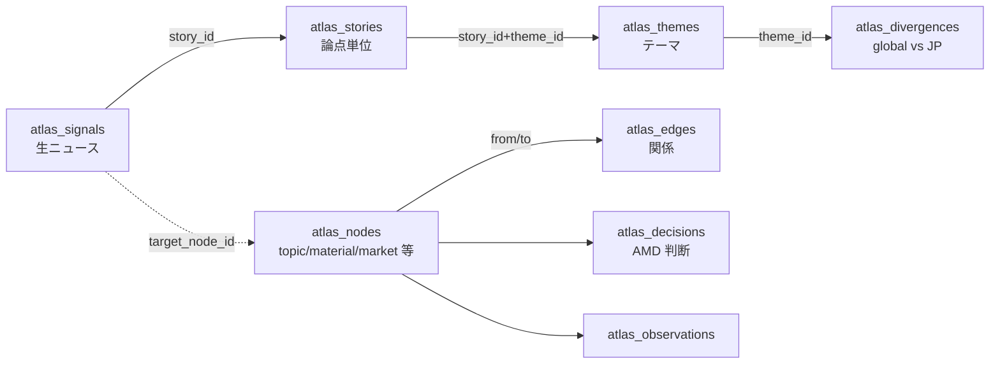

# Atlas / Macrotrend 詳細仕様

`/atlas` 系画面 (= signal / story / theme / divergence / macrotrend) の開発者向け正本。 メンバー向け使い方は [2-5 章](2-5-research-assets-quick-start.md) と [4-1 章](4-1-atlas-protocol-score-macrotrend.md)。

## Atlas の位置付け

AMD OS の 2 本柱の一方:

| 柱 | 機能 | 本質 |
|---|---|---|
| AMD プロトコル | 判断のフレーム | **どう** 考えるか |
| **AMD Atlas** | 判断の地図 | **何を** 見て考えるか |

Atlas は「あのとき、 あの技術シーズで起業しておくべきだった」を後付けで検出可能にする、 マクロ判断の蓄積資産。

## データモデル

### ノード ↔ エッジ ↔ シグナル ↔ ストーリー ↔ テーマ

### `atlas_signals` 列 (= 個別ニュース)

| column | 用途 |
|---|---|
| `title` / `content` | 本文 |
| `source_url` / `source_type` | 出典 |
| `domain` | 6 領域 (= `gx_energy` / `gx_circular` / `life` / `materials` / `robo` / `ict`) |
| `suggested_tags` | tag 候補 (= `_text` 配列) |
| `importance` | `high` / `medium` / `low` |
| `status` | `inbox` (= 未確認) / `assigned` (= story 紐付け済) / `archived` / `dismissed` |
| `target_node_id` | 紐付け先 `atlas_nodes` (= optional) |
| `story_id` | 紐付け先 `atlas_stories` (= 主) |
| `submitted_at` / `reviewed_at` | inbox 投入 → 人 review 時刻 |
| `metadata` | jsonb (= region / merger_into 等の補助情報) |

### `atlas_stories` 列 (= 論点単位の時系列追記)

| column | 用途 |
|---|---|
| `title` / `summary` | 論点の見出しと要約 |
| `status` | `ongoing` / `paused` / `resolved` |
| `importance` | `high` / `medium` / `low` |
| `tags` | `_text` 配列 |
| `primary_domain` | 主領域 |
| `started_at` / `last_updated_at` | 時系列 |
| `signal_count` | story 内 signal 数 (= キャッシュ) |

### `atlas_themes` 列 (= テーマ = story 群の上位概念)

| column | 用途 |
|---|---|
| `name` | UNIQUE (= テーマ名) |
| `description` | 説明 |
| `primary_domain` | 主領域 |
| `tag_keywords` | `_text` 配列 (= story 自動紐付けキーワード) |
| `status` | `active` / `archived` |

### `atlas_story_themes` (= 多対多紐付け)

| column | 用途 |
|---|---|
| `story_id` / `theme_id` | composite PK |
| `confidence` | 紐付け確信度 (= 0.0-1.0) |

### `atlas_divergences` 列 (= global vs JP 乖離)

| column | 用途 |
|---|---|
| `theme_id` | UNIQUE (= テーマ 1 つに 1 行) |
| `global_summary` / `japan_summary` | 各エリアの動向要約 |
| `divergence_message` | 乖離の解釈 (= 自然文) |
| `divergence_score` | 乖離スコア (= 0-1) |
| `global_intensity` / `japan_intensity` | 各エリアの強度 |
| `global_signal_count` / `japan_signal_count` | 各エリアの signal 件数 |
| `signal_breakdown` | jsonb (= 内訳) |
| `generated_at` | 直近生成時刻 |

### `atlas_nodes` / `atlas_edges` (= マインドマップ)

| `atlas_nodes.type` | 意味 |
|---|---|
| `topic` | 論点そのもの (= ヘリウム脱却 等) |
| `signal` | 個別ニュース (= signals 由来) |
| `decision` | AMD の判断イベント |
| `project` | AMD の PJ (= `projects` と接続) |
| `technology` | 技術シーズ |
| `material` | 素材 / 原料 |
| `market` | 市場 / 産業 |

| `atlas_edges.relation_type` | 意味 |
|---|---|
| `affects` | topic → PJ |
| `derived_from` | signal → topic |
| `triggered` | topic → decision |
| `related_to` | topic ↔ topic |
| `depends_on` | technology → material |
| `competes_with` | technology ↔ technology |

### `atlas_decisions` 列 (= AMD 判断ログ)

| column | 用途 |
|---|---|
| `topic_id` | 紐付け `atlas_nodes` (= topic) |
| `decided_at` | 判断時刻 |
| `action` | 何をしたか |
| `rationale` | 判断理由 |
| `outcome_eval_at` / `outcome` | 後追い評価 |

### `atlas_observations` 列 (= 補助観測ログ)

| column | 用途 |
|---|---|
| `node_id` | 対象 node |
| `observed_at` | 観測時刻 |
| `content` | 観測内容 |
| `source_url` / `source_type` | 出典 |

### `atlas_reports` 列 (= 定期レポート)

| column | 用途 |
|---|---|
| `type` | `weekly` / `monthly` / `quarterly` |
| `title` | レポートタイトル |
| `period_start` / `period_end` | 集計期間 |
| `signal_count` / `high_count` / `medium_count` / `low_count` | 件数集計 |
| `signals_json` | 含まれた signal 配列 |
| `macro_summary` | LLM 生成 narrative |

### `atlas_story_merges` (= マージ履歴)

| column | 用途 |
|---|---|
| `merged_from_title` / `merged_from_summary` | 統合元 story (= 削除済) |
| `merged_to_id` / `merged_to_title` | 統合先 story |
| `reason` | マージ理由 |

人手 / LLM が「重複 story」を統合した履歴を残す。

## Macrotrend (= マクロ指標)

### `macro_index_log` 列

| column | 用途 |
|---|---|
| `lane` | ASPI 8 domain (= [`pwa/design/aspi_lanes.md`](../design/aspi_lanes.md)) |
| `observed_at` | 観測日 (= 月末日) |
| `index_value` | 統合 macro index (= 0-1 連続値) |
| `policy_density` | 政策密度 (= 政策言及件数 / 期間) |
| `budget_amount` | 国家予算額 |
| `investment_amount` | 民間投資額 |
| `policy_mention_count` | 政策言及件数 |
| `raw_signal_count` | 元 signal 件数 |
| `computed_at` | 計算時刻 |

### `macro_lane_weights` 列 (= Cobb-Douglas / BVAR 等の lane 重み)

| column | 用途 |
|---|---|
| `lane` | 対象 lane |
| `alpha` / `beta` / `gamma` / `delta` | Cobb-Douglas exponents (= [`pwa/design/aspi_lanes.md`](../design/aspi_lanes.md)) |
| `lambda` / `eta` | 高次パラメータ (= optional) |
| `computed_at` / `computed_by` | 算出メタ |
| `source_data_window_days` | 何日分のデータから推定したか |

### `triple_helix_state_log` 列 (= ASPI BVAR/Kalman state)

| column | 用途 |
|---|---|
| `lane` / `observed_at` | UNIQUE |
| `mu_a` / `mu_i` / `mu_g` | Academia / Industry / Government の state mean |
| `sigma_su` | SU 候補の不確実性 |
| `model` | `bvar_kalman` 等のモデル識別 |
| `raw_meta` | jsonb (= モデル詳細) |

### Triple-Helix recompute

`/api/cron/triple-helix-recompute` (= manual operation、 [6-1 章](6-1-operations-settings-spec.md))。 8 domain × 16 quarter の BVAR/Kalman 再計算。 投入データの確認後に admin が手動キックする。

## 画面

| URL | 役割 |
|---|---|
| `/atlas` | 入口。 ストーリー一覧 + Inbox バッジ |
| `/atlas/inbox` | signal 受信箱 (= `status='inbox'`)、 swipe で story 紐付け / dismiss |
| `/atlas/stories` | story 一覧 / 検索 |
| `/atlas/stories/[id]` | story 詳細 (= 時系列 signal + 紐付け theme + 関連 PJ) |
| `/atlas/themes` | theme 一覧 + divergence 表示 |
| `/atlas/macrotrends` | lane 別の macro index 時系列グラフ |
| `/atlas/decisions` | AMD 判断ログ |

## 関連 cron (= 停止中)

LLM / web_search 課金を抑えるため、 2026-05-22 以降は自動 schedule を停止中。 復活は別途 owner 承認。

| route | 役割 | 復活時の前提 |
|---|---|---|
| `/api/cron/lane-suggest` | 新規 PJ の `project_ventures.lanes` 候補を `lane_suggestions` に保存 | 承認は `/admin/projects` |
| `/api/cron/kaken-ingest` | KAKEN OpenSearch + LLM fallback で `observation_log key=I_R` 補完 | |
| `/api/cron/grant-ingest` | NEDO / JST / AMED 採択情報 + LLM fallback で `observation_log key=B` 補完 | |
| `/api/cron/vc-investment-ingest` | VC news + LLM で `observation_log key=V` 補完 | |
| `/api/cron/relearn-lane-weights` | `macro_lane_weights` を Sonnet で再推定 | 復活時は最新 ASPI 8 domain と before-zero model 確認 |
| `/api/cron/macro-backfill-historical` | 2010-2025 の `macro_index_log` を chunk + retry で補完 | `lane` / `startYear` / `endYear` 絞って実行 |

詳細は `pwa/design/aspi_lanes.md` と [6-1 章 Operations Settings](6-1-operations-settings-spec.md)。

## Atlas / Seeds / VC の分離設計

`pwa/design/macrotrend_atlas_seeds_architecture.md` 参照。 要点:

- **Atlas** = 世界マクロ視点。 国家政策 / 投資総額 / 論文 / マクロ事件 を扱う
- **Seeds** = AMD 視点。 機関 × PI × シーズ。 Atlas に混ぜると視点がぼやける
- **VC** = 投資家マスタ。 ファンドレイズは「世界マクロ」ではないので Atlas と独立 (= `vc_news` は別系統)

旧設計では Atlas の seedScore に seeds を入れていたが、 2026-05-08 に切り離し。 旧 `compositeScore` 重み `0.4 macro + 0.2 papers + 0.2 policy + 0.1 invest + 0.1 seeds` → `0.4 + 0.2 + 0.2 + 0.2` (= seeds 0.1 を invest に振替) に再正規化。

## divergence の使い方

`atlas_divergences` は「同じテーマに対して global / JP で動向が乖離してる度合い」を示す。 例:

| theme | global_summary | japan_summary | divergence_score |
|---|---|---|---|
| 「ヘリウム脱却」 | 欧米で代替技術急進、 投資集中 | 国内議論は少なく、 既存サプライ依存 | 0.78 |
| 「液体生検」 | 米国 FDA 認可加速 | 日本国内導入は限定的 | 0.65 |

divergence 高いテーマは AMD の事業機会 (= AMD 内部評価で `amd_rating` 高い seeds と結合可) の候補になる。 `/atlas/themes` で divergence 順にソートできる。

## 関連

- 設計: [`pwa/design/atlas.md`](../design/atlas.md) (= 構想 + ノード / エッジ模式)
- 設計: [`pwa/design/atlas_routine.md`](../design/atlas_routine.md) (= ingest / divergence 生成 routine)
- 設計: [`pwa/design/macrotrend_atlas_seeds_architecture.md`](../design/macrotrend_atlas_seeds_architecture.md) (= Atlas / Seeds / VC 分離経緯)
- 設計: [`pwa/design/policy_signals.md`](../design/policy_signals.md) (= 政策シグナル)
- 設計: [`pwa/design/aspi_lanes.md`](../design/aspi_lanes.md) (= ASPI 8 domain + lane weights)
- 4-1 章 [判断エンジン overview](4-1-atlas-protocol-score-macrotrend.md) (= Atlas + Protocol + Score + Macrotrend の関係)
- 2-5 章 [探索系アセットの使い方](2-5-research-assets-quick-start.md) (= ユーザー視点)
- 5-1 章 [Seeds / VC / Scholar 詳細仕様](5-1-research-assets-vc-seeds-scholar-spec.md)
- 5-2 章 [HUD / Venture Map 仕様](5-2-hud-and-venture-map-spec.md)
- 6-1 章 [Operations Settings](6-1-operations-settings-spec.md) (= 停止中 cron の復活方法)
