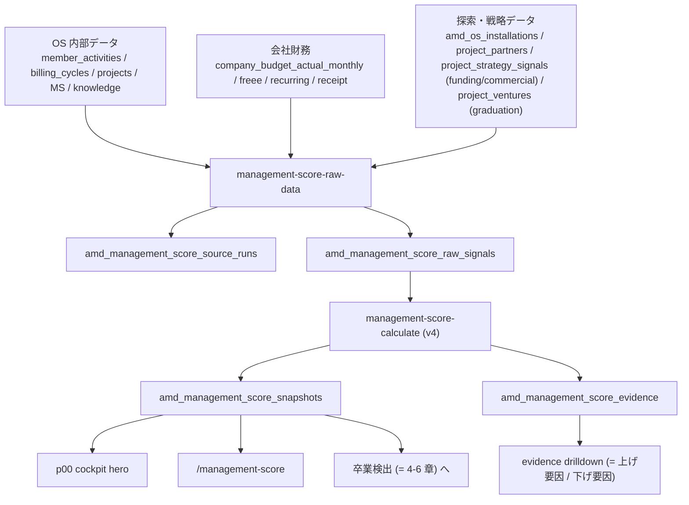
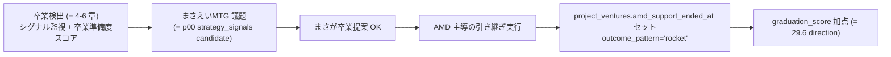

# Management Score (= バイタルサイン) / Finance Simulation 仕様

AMD Management Score は、AMD 全社 (= `p00`) の経営状態を月次で見る 0-100 のスコア。PJ / SU の価値・成熟度を見る [4-3 章 AMD Score](4-3-amd-score-spec.md) とは別物。

> **UI 表記 (2026-05-25 まさ #71 確定)**: 「AMD Management Score」と「AMD Score」が紛らわしいため、`/dashboard` 等の UI 上では Management Score を **「バイタルサイン (VS)」** と表記する。本仕様 md・DB テーブル名 (= `amd_management_score_snapshots` 等)・`/management-score` ページ内タイトルは引き続き「AMD Management Score」のまま (= 文脈で明確、内部 ID として安定)。「バイタルサイン」は医療由来の Vital Signs メタファー (= 経営の脈拍・体力)。

> **計算ロジック (2026-05-26 まさ #82 v4 確定)**: 単純加重平均では「先手力崩壊 = 即経営危機」のような不可逆構造を表現できないため、 v4 で **加算 + 不可逆閾値 + 動的重み + 死亡判定** の混合方式に切り替える。v1 (= 加重平均のみ) → v4 の経緯は [05.x](9-1-decisions-and-history.md) を見る。

## 何を見るスコアか

| スコア | 対象 | 主な問い | 主な画面 |
|---|---|---|---|
| AMD Score | PJ / SU | この PJ は Macrotrend に乗り、XRL / FRL が整っているか | 各 PJ cockpit, `/venture-map/amd-score` |
| AMD Management Score (= バイタルサイン) | AMD 全社 | 今月の AMD は経営状態として良くなったか、どこへ介入すべきか | `/project/p00/cockpit`, `/management-score` |

バイタルサインは「良い点数を出す」ためではなく、次の問いに答えるために使う。

- 今月の AMD は、経営状態として良くなったか / 悪くなったか
- 何が点数を上げ、何が点数を下げたか
- 次にどこへ介入すれば一番効くか
- 足元の売上は良くても、長期の方向性からズレていないか
- **不可逆な閾値 (= 先手力崩壊 / 債務超過 / runway 枯渇) に近づいていないか**

## 画面

| 画面 | 役割 |
|---|---|
| `/project/p00/cockpit` | 会社全体 cockpit。上部 hero にバイタルサイン total + 5 軸時系列を表示する。`/dashboard` 上部のバイタルサイン枠クリック先 |
| `/management-score` | バイタルサイン詳細画面。score history、5 軸 mini trend、runway / cash / 予実、evidence drilldown、GAS 月次試算表移植ビュー、経営シグナル評価、差分メモを見る。`/dashboard` ではバイタルサイン枠右上の詳細リンクから開く |
| `/admin/settings` | raw data 収集 / score 計算 operation の稼働状態を見る。2026-05-25 時点では UI からの Run Now は止め、対象月を明示して Codex automation 側で実行する |

`/project/p00/cockpit` の hero は `amd_management_score_snapshots` を直接読み、横軸 `ym`、縦軸 0-100 の折れ線で `total_score` と 5 軸を重ねる。詳細は `/management-score` へ誘導する。

`/management-score` は次を表示する。

| ブロック | 内容 | 主な table |
|---|---|---|
| header メタ | 対象月 / 前月比 Δ / confidence / raw 件数 / 計算 timestamp / **build version** | `amd_management_score_snapshots` |
| 今月の結論 | snapshot.summary 自動生成文 (= 1-3 行 narrative) | `amd_management_score_snapshots.summary` |
| 死亡判定アラート | 債務超過 / runway < 1ヶ月 / 先手力 < 70% で赤帯 | `inputs_json.deathFlags` |
| score cards | Total / 先手力 / 財務 / 継続 / 新規 / 方向 (各 Δ chip 付き) | `amd_management_score_snapshots` |
| finance metrics | Runway / Cash / 売上 予算・実績 / 純CF 予算・実績 | `company_budget_actual_monthly` |
| 上げ要因 / 下げ要因 | evidence を axis 別 × impact 順 (= drilldown) | `amd_management_score_evidence` |
| スコア推移 | 最大 25 ヶ月の total bar + 5 軸 table | `amd_management_score_snapshots` |
| 5 軸 mini trend | 先手力 / 財務 / 継続 / 新規 / 方向の小型折れ線 | `amd_management_score_snapshots` |
| GAS 月次試算表ビュー | cash balance、cash inflow/outflow、PJ 売上、固定費、税金、runway。各月は 予算 / 実績 / 差分 の3列で読む | `company_budget_actual_monthly`, `company_budget_inputs`, `company_budget_simulation_runs` |
| 経営シグナル評価 | 月次試算表の予実から、先3か月見込み、費用抑制、追加獲得目標、予実乖離原因、意思決定アラートを月末Codex評価として残す。最新月は展開、過去月は折りたたみ | `company_management_signal_reviews`, `company_budget_actual_monthly`, `billing_cycles`, `payout_notices` |
| 差分メモ | 予実差分の理由・確認状態 | `company_budget_variance_notes` |

**対象月は「未来月を除外」**:画面は `score.ym <= currentYmJST()` で filter し、 5/26 に「6月」の半端 snapshot を表示しない (= まさ #76 確定)。

## 全体フロー



raw data 収集と score 計算を分ける理由は、当時の根拠 payload を残し、あとから式や重みを変えても入力の欠損・鮮度・source 失敗を追えるようにするため。

## 軸と重み (= v4 計算式)

v4 では、 「単純加重平均では不可逆破綻 (= 先手力崩壊 / 債務超過) を表現できない」「新規軸の重要度は現行 PJ 残期間に依存する」というまさ #82 確定方針を反映し、 **加算 + 動的重み + 不可逆閾値 + 死亡判定の混合方式**を採用する。

```text
total_score = base_total × initiative_modifier × death_clamp

base_total =
  0.30 × finance_score
+ 0.30 × initiative_score
+ 0.20 × retention_score
+ ω_pipeline × pipeline_score          ← ω は現行 PJ 残期間で動的
+ 0.15 × direction_score

ω_pipeline (= 動的重み):
  現行 PJ 平均残期間 > 12 ヶ月 → ω = 0.05  (= 新規取らなくていい、まさ工数優先)
  現行 PJ 平均残期間 6〜12 ヶ月 → ω = 0.10  (= 中間)
  現行 PJ 平均残期間 < 6 ヶ月 → ω = 0.20  (= 営業必須、 残期間枯渇)

initiative_modifier (= 不可逆閾値):
  initiative_score ≥ 90% → × 1.0  (= 健全)
  initiative_score 70-90% → × 0.7  (= 警告ゾーン)
  initiative_score < 70% → × 0.3  (= 致命ゾーン、 巻き返し困難)

death_clamp (= 死亡判定):
  net_assets < 0 (= 債務超過) → total = 0
  runway < 1 ヶ月 → total = min(total, 10)
```

`ω_pipeline` 以外の重みは 0.30 / 0.30 / 0.20 / 0.15 = 0.95 で固定 (= 残り 0.05 が新規軸動的部分の最小値)。 ω が 0.20 まで上がった場合は合計 1.10 となり、 base_total が 100 を超えないよう 100 でクリップする。

**ω_pipeline 計算の status 更新漏れ対応** (= まさ #90 確定 2026-05-27):
`projects.status='active'` のまま end_ym が過去になっている PJ (= 終了したが台帳更新漏れ) は、 残期間を 0 として平均算入する (= 計算から除外しない)。 これがないと「BWE/CTB/JC が 3 月終了で status='active' のまま」 のケースが拾えず「現行 active PJ がすべて終了済」 という誤判定が出る (= 旧ロジックの bug、 詳細 BUGS [score/omega-pipeline])。 end_ym が NULL の active PJ は残期間不明として平均から除外する。

| 軸 | 固定重み | 意味 | 主な入力 |
|---|---:|---|---|
| 先手力 `initiative` | 30% | AMD まだ持ってる PJ で他人主導 events が出ていないか | `member_activities` (= 卒業 PJ 除外) |
| 財務耐久 `finance` | 30% | 月次収支、予実差分、請求、入金、runway が健全か | `company_budget_actual_monthly`, `company_actual_monthly`, `billing_cycles`, `company_finance_*` |
| 既存 PJ 継続 `retention` | 20% | 既存 PJ が続くか、伸びるか、止まりそうか | `projects`, `milestone_monthly_progress`, `project_freeze_periods`, `project_meeting_summaries` |
| 新規獲得 `pipeline` | ω 5-20% | 次の売上・SU候補・相談が増えているか | Gmail/Slack 案件追跡 → `project_strategy_signals.signal_type='commercial_progress'`, `project_registry_diffs` |
| 戦略接近 `direction` | 15% | AMD が Deeptech startup studio として目指す方向へ近づいているか | 6 入力 (= 29.6 戦略接近度参照) |

**v1 (= 加重平均のみ) からの主な変更点**:

- 先手力に不可逆閾値ペナルティを追加 (= まさ #82「夫婦関係冷え切ったら戻らない」アナロジー)
- 新規軸の重みを動的化 (= まさ「工数余ってないなら新規行かない方が正解、 ただし大型案件残半年なら営業必須」)
- 死亡判定を独立 (= 単純な加重平均では債務超過を表現できない)
- 先手力の入力を「減点方式」に変更 (= 加点方式は unknown 多発で破綻していた)
- 戦略接近度の入力を 6 個に全面差し替え (= まさ「AMD Score / protocol / venture / atlas は方向接近度の判定材料として弱い」)

## raw signal 収集

API:

```text
GET /api/cron/management-score-raw-data?ym=YYYYMM&includeFreee=0
```

local:

```bash
npm --prefix pwa run collect:management-score-raw -- --ym=YYYYMM
npm --prefix pwa run collect:management-score-raw -- --ym=YYYYMM --include-freee
```

`CRON_SECRET` が設定されている環境では、API は `Authorization: Bearer ${CRON_SECRET}` を要求する。

| table | 役割 |
|---|---|
| `amd_management_score_source_runs` | raw data intake の実行ログ。`success` / `partial` / `failed`、source 別件数、error を保存 |
| `amd_management_score_raw_signals` | score 算出前の月次 signal。axis / source_table / source_id / signal_key / value / payload / source_hash を保持 |
| `company_actual_monthly` | freee trial_pl 由来の会社月次実績。`includeFreee=1` のとき同期対象 |

source 別の大枠 (v4):

| axis | source_kind / table |
|---|---|
| initiative | `member_activities` (= 卒業 PJ 除外) |
| finance | `budget_actual_view`, `company_actual_monthly`, `billing_cycles`, `company_finance_recurring_items`, `company_finance_receipt_events`, freee `trial_pl` |
| retention | `projects`, `milestone_monthly_progress`, `project_freeze_periods`, `project_meeting_summaries`, retention 寄り `project_knowledge` |
| pipeline | `project_strategy_signals` (`applies_to_company_score=true` かつ `company_score_axis='pipeline'` / `commercial_progress`)、`project_registry_diffs` |
| direction | `project_strategy_signals` (`funding` / company pipeline monetization)、`project_partners`、新テーブル `amd_os_installations`、`project_ventures` 卒業集計、属人脱却率 |

**v4 で外す入力**:`seeds` (= 在庫加点問題、 まさ #79)、`amd_score_inputs` 平均 (= 方向性無関係、 まさ #82)、`protocols` 件数 / `project_ventures` 件数 / `atlas_signals` / `macro_index_log` (= 戦略接近度の判定として弱い)。`seeds` は AMD Score 側 (= [4-3 章](4-3-amd-score-spec.md)) の入力としてのみ使う。

**raw置換ルール** (= 2026-06-01): `management-score-raw-data` は対象 `ym` の raw を再生成するとき、`freee_actual` 以外の既存 `amd_management_score_raw_signals` を削除してから入れ直す。旧 `seed` / `project_knowledge` / `atlas` / `protocol` など v4 で外した source_kind が残ると、5月は新規が過大、6月は逆に材料不足で新規/方向が過小に見えるため、月次rawは append ではなく replace として扱う。

## score 計算 (= v4)

API:

```text
GET /api/cron/management-score-calculate?ym=YYYYMM
```

処理:

1. `amd_management_score_raw_signals` から対象 `ym` の row を全件読む
2. axis ごとに 5 軸 score と confidence を計算する
3. base_total を加算 (動的 ω_pipeline 込み)
4. initiative_modifier 適用 (= 90/70% 閾値ペナルティ)
5. death_clamp 適用 (= 債務超過 / runway 枯渇)
6. snapshot.summary を自動生成 (= rule-based narrative)
7. `weights_json`, `inputs_json`, `confidence`, `summary`, `finance_cap_applied` 付きで `amd_management_score_snapshots` に `ym` upsert
8. 既存 evidence を削除し、上位 40 件まで `amd_management_score_evidence` に insert

`amd_management_score_snapshots.inputs_json` には、raw signal 件数、axis 別件数、axis 入力、ω_pipeline 計算根拠、initiative_modifier 倍率、death_flags が保存される。

### 先手力 (v4 = 減点方式 + 卒業 PJ 除外)

**減点方式**:デフォルトは満点 (= 100)、 「**他人主導と明確に言える events**」が観察されるたび減点する。 v1 までの加点方式 (= `AMD起点 / 全 events`) は `unknown` 多発で破綻していた (= まさ #82)。

**評価対象 PJ**:`project_ventures.amd_support_ended_at IS NULL` の PJ のみ。 卒業済 PJ で他人主導 events が出るのは AMD が育てた組織の自走兆候であり、 歓迎すべき事象なので先手力減点しない (= まさ #83)。

```text
target_pj_ids = SELECT project_id FROM project_ventures
                WHERE amd_support_ended_at IS NULL

passive_events = SELECT FROM member_activities
                 WHERE project_id IN target_pj_ids
                   AND ym = $ym
                   AND initiative_origin IN ('partner_proposed', 'external')
                   AND impact >= 3

total_events = SELECT FROM member_activities
               WHERE project_id IN target_pj_ids AND ym = $ym

passive_ratio = passive_events / max(total_events, 1)

initiative_score = clamp(100 - passive_ratio × 100, 0, 100)
```

**減点しないもの**:`amd_proposed` / `co_decided` / `unknown` / 全 PJ の `impact < 3` の events。 「他人主導が明確かつ重要」(= partner_proposed/external × impact ≥ 3) だけが減点対象。

**confidence**:`total_events < 5` の月は confidence 0.3 まで落とし、 UI に「データ不足」表示する。

**抽出パイプライン** (= initiative_origin を埋めるところ):

```
monthly_reports + project_meeting_summaries
        ↓
/api/cron/member-activities (= LLM 抽出 cron)
        ↓
Claude Sonnet 4.6 (prompt: llm_prompts.member_activities.extract = migration 057)
        ↓
判定: amd_proposed / co_decided / partner_proposed / external / unknown
        ↓
member_activities.initiative_origin
```

prompt 鉄則:**判断不能なら unknown を返す** (= 旧 GAS rewardscoring 踏襲、 捏造で amd_proposed を付けない)。

### 財務耐久

```text
finance_score =
  30% runway_score
+ 25% budget_actual_variance_score
+ 20% billing_collection_score
+ 15% forecast_visibility_score
+ 10% data_freshness_score
```

| 要素 | 実装上の読み方 |
|---|---|
| runway_score | `payload.runway_months` を 12 ヶ月で 100 点換算 |
| budget_actual_variance_score | `budget_amount_yen` と `variance_yen` の乖離率。乖離が大きいほど下がる |
| billing_collection_score | `billing_cycles` 由来の paid / payment / done と sent_unpaid の比率 |
| forecast_visibility_score | revenue / net_cash_flow / operating_profit の forecast row が 6 件以上あると満点 |
| data_freshness_score | freee trial_pl row があれば 90、なければ 55 |

財務 cap (= base_total への足切り、 死亡判定とは別):

| 条件 | 総合点 cap |
|---|---:|
| runway < 2 ヶ月 | max 45 |
| runway < 4 ヶ月 | max 60 |

**evidence summary の好調 / 注意判定**:項目を「収益系 (`revenue`, `gross_profit`, `operating_profit`, `net_cash_flow`, `project_revenue`)」と「費用系 (`cost_member`, `cost_closer`, `fixed_cost`, `social_insurance`, `loan_payment`, `loan_interest`, `tax_payment_*`)」に分類し、 収益系は `variance > 0 = 好調`、 費用系は `variance < 0 = 好調` で判定する。 v3 までは `project_revenue` が categoryLabel に未登録で fallback 分岐に落ち「実績 0 = 好調」と誤判定していた (= まさ #81 で報告された UX バグ)。

### 既存 PJ 継続

```text
retention_score =
  35% active_project_ratio
+ 35% milestone_progress
+ 20% meeting_signal
+ 10% baseline
- freeze_penalty
```

`project_freeze_periods` が active の場合は 1 件あたり 18 点、最大 40 点を減点する。

### 新規獲得 (v4 = Gmail/Slack 案件追跡)

v4 では入力を **Gmail/Slack の案件追跡** に切り替える (= まさ #79、 v1 までの seeds 在庫加点は廃止)。 案件は `project_strategy_signals` に `signal_type='commercial_progress'` で stage 付きで保存される。

stage:

| stage | 意味 | probability |
|---|---|---:|
| `signal` | 兆しだけある | 0.05 |
| `lead` | 会話・紹介・接触あり | 0.15 |
| `qualified` | 課題/予算/担当が見えている | 0.35 |
| `proposal` | 提案中 | 0.55 |
| `verbal` | ほぼ合意 | 0.80 |
| `won` | 契約・PJ化済み | 1.00 |
| `lost` | 見送り | -0.10 |

```text
pipeline_value = Σ(expected_value_yen × probability × strategic_fit)
pipeline_score = clamp(100 × pipeline_value / target_pipeline_value)
```

`target_pipeline_value` は ω_pipeline と連動 (= 残期間少ない月は目標値が高い)。

**重み ω_pipeline 計算**:

```text
remaining_months_avg =
  average of (end_ym - currentYm) for active projects with end_ym set

if remaining_months_avg > 12 → ω = 0.05
elif remaining_months_avg ≥ 6 → ω = 0.10
else → ω = 0.20
```

end_ym が NULL の PJ (= 終了予定未定) は計算から除外。

### 戦略接近度 (v4 = 6 入力)

v4 では入力を全面差し替え (= まさ #82、 v1 までの AMD Score / protocol / venture / atlas は外す)。

```text
direction_score =
  20% fund_setup_score        (= ファンド設立進捗)
+ 15% partner_growth_score    (= 連携研究機関の月次差分)
+ 25% amd_os_install_score    (= AMD OS 導入進捗)
+ 15% monetization_score      (= マネタイズ仮説の前進)
+ 15% non_masa_initiative_score (= 属人脱却率)
+ 10% graduation_score        (= PJ 成功卒業進捗)
```

| 入力 | 取り方 |
|---|---|
| fund_setup_score | `project_strategy_signals` で `signal_type='funding'` & `status='confirmed'` の累積件数 / 目標 (= 5 件で満点) |
| partner_growth_score | `project_partners` (`org_type='university'` or `'research_institute'`) の月次差分。 前月比 +1 で +20 点 |
| amd_os_install_score | 新テーブル `amd_os_installations` の `status='live'` 件数 + `status='trial'` × 0.5 |
| monetization_score | `project_strategy_signals` で `signal_type='commercial_progress'` & `decision_state='decided'` & `status='confirmed'` 月次件数 |
| non_masa_initiative_score | `member_activities` のうち、 `member_id != masa AND initiative_origin = 'amd_proposed'` の比率 (= 全 amd_proposed events 中) |
| graduation_score | `project_ventures` の `outcome_pattern='rocket' AND amd_support_ended_at IS NOT NULL` PJ 数 / 全 PJ 数 |

**`graduation_score` の判定**:`outcome_pattern='rocket'` (= 成功卒業) のみ加点。 `ue_fail` (= 失敗卒業) や `planning` (= 進行中) は対象外。 「AMD が育てた → 成功卒業 → AMD の評判向上」のループを score 化する。 詳細は [4-6 章 卒業フェーズ検出](4-6-graduation-detection-spec.md) と接続。

## 不可逆閾値 + 死亡判定 (= v4 新規)

### initiative_modifier (= 先手力 不可逆閾値)

先手力が一定以下に落ちると、 加重平均だけでは表現できない **「巻き返し困難ゾーン」** に入る。 これを total_score 側で乗算ペナルティとして表現する (= まさ #82「夫婦関係冷え切ったら戻らない」)。

| 範囲 | modifier | UI 表示 |
|---|---:|---|
| 90% 以上 | × 1.0 | 緑 (健全) |
| 70-90% | × 0.7 | **⚠️ 黄帯**「先手力低下傾向、 早期対応推奨」 |
| 70% 未満 | × 0.3 | **🚨 赤帯**「存続危機、 巻き返し困難ゾーン」 |

70% を**回復閾値**ではなく**致命閾値**として扱う。 90% を**警告閾値**として、 早期介入を促す (= 70% に到達してからでは遅い、 まさ #83)。

### death_clamp (= 死亡判定)

加重平均では「債務超過 = 経営終了」を表現できない。 v4 では独立した死亡判定を持つ。

| 条件 | total_score 強制 | UI |
|---|---:|---|
| net_assets < 0 (= 債務超過) | **0** | 🚨🚨 サイレン「経営継続不可」 |
| runway < 1 ヶ月 | **min(total, 10)** | 🚨 サイレン「即危機 / cash 枯渇間近」 |

`net_assets` は `company_actual_monthly` の総資産 - 総負債で算出する想定 (= freee 連携完了後)。 freee 未連携時は `null` で死亡判定 skip。

## evidence

`amd_management_score_evidence` は、raw signal 全文ではなく「その月のスコアに効いた短い根拠」を保存する。

| column | 意味 |
|---|---|
| `snapshot_id` / `ym` | 対応する score snapshot |
| `axis` | `initiative` / `finance` / `retention` / `pipeline` / `direction` |
| `evidence_kind` | `axis_summary`, `budget_variance`, `freeze`, `meeting_risk`, `seed_candidate`, `venture_portfolio` 等 |
| `summary` | **人間が読む自然文 narrative** (= v4 で機械的 signal_key 表示から書き換え、 まさ #80) |
| `source_type` / `source_ref` / `source_hash` | 元データへの参照 |
| `impact` | score への概算影響 |
| `confidence` | 根拠の確からしさ |
| `payload` | 後から drilldown するための補助 JSON |

`/management-score` の **「上げ要因 / 下げ要因」セクション**に impact 順で表示される。 各カードは「軸 chip / evidence_kind / impact / confidence / summary / source_ref / 詳細 (= payload 展開)」を表示する。 軸タブで filter 可能。

evidence summary の書き方ガイド (= v4):

- 「**何が起きて、 なぜ score に効いたか**」を 1 文で書く
- 機械的な `signal_key: brief` 表記は禁止 (= まさ #80「数字だけで根拠じゃない」)
- 例 (= 良):「シーズ候補「非麻薬性オピオイド鎮痛薬」 (観察中, AMD評価 3/5 / life) — 新規案件 pipeline を形成」
- 例 (= 悪):「seed:investigating: 非麻薬性オピオイド鎮痛薬」 (= 何を意味するか UI からは分からない)

## Finance Simulation (= 月次収支シミュレータ)

Finance Simulation は、会社 PL / cash runway を月次で試算する経営判断ビュー。**2026-06-16 に入力ソースを「凍結 snapshot (`company_budget_inputs`)」から「OS のライブテーブル直読み」に切り替えた**。それ以前は GAS 月次試算表から手で起こした `company_budget_inputs` を復元していたため、PJ の契約・MS 進捗・固定費が動いても snapshot を作り直さない限りシミュレータに反映されなかった。今は OS の生データ (請求サイクル / MS 進捗 / 固定費マスタ) が動けば、次に画面を開いた時点で自動でシミュレータに乗る。

### なぜライブ駆動にしたか

旧方式は「ある時点で手入力した予算表のコピー」を眺めるだけで、現実 (新規契約・MS 進捗・メンバー報酬の発生) とすぐ乖離した。経営判断 (先3か月キャッシュが持つか、どの月が赤字になるか) は最新の OS 状態で計算しないと意味がない。そこで入力を OS 正本テーブルから毎回組み立てる方式に変えた。

### 入力ソース (= `buildLiveMonthlyPlInputs`)

`MonthlyPlInputs` を次のライブテーブルから組み立てる。

| 入力区分 | 正本テーブル / 列 | 取り方 |
|---|---|---|
| 固定収益 | `projects.fee_type='monthly_fixed'` + `projects.fee_amount` | 毎月定額で立つ受託フィー。`start_ym`〜`end_ym` (契約中) の月だけ計上。実例: p10 SE ¥10万 / p19 ZMP ¥30万 / p20 CX ¥29万 / p21 SX ¥104.8万 |
| 変動収益 | `projects.fee_type='variable'` の PJ について `billing_cycles` を月別に。売上 = `budget_reported_amount` (あれば優先)、無ければ `budget_yen ÷ 0.65` で逆算 | ⚠️ `budget_yen` は**報酬予算 (reported×0.65) であって売上ではない**。売上に使うときは逆算が要る。実例: p25 KUTE 月 ¥654,545 (budget_yen) → 売上 ≒ ¥1,007,000。**CX(p20) は契約期間 2026-06〜09 の variable PJ。billing_cycles の budget_yen (6月¥50,700 / 7-9月¥178,100) を÷0.65逆算して売上 6月¥78,000 / 7-9月¥274,000 = 税抜計¥900,000 (契約税込¥990,000)。10月以降は billing_cycles に budget が無いため売上¥0**。variable PJ は `end_ym` ではなく billing_cycles の有無で月レンジが決まる |
| └ CX 無期限計上事故 (2026-06-16 修正) | — | ⚠️ p20 CX は以前 `fee_type='monthly_fixed', fee_amount=¥290,000, start_ym='202511', end_ym=null` になっており、契約は 2026-06〜09 の 4 ヶ月なのに **202702 以降まで毎月¥290,000 が無期限で立ち続けていた**。契約書 (contract_terms `1cf248e3`, masa確定 2026-06-15) に基づき `fee_type='variable' / start_ym='202606' / end_ym='202610'` へ修正し、月別売上は billing_cycles で表現。**`end_ym=null` の monthly_fixed は契約終了後も売上が止まらない** ので、契約終了月を必ず入れる。恒久対策は契約抽出 → projects 自動反映 (spec 5-6 §Contract Apply) |
| 固定費 | `company_finance_recurring_items` (`status='active'`) | 家賃・SaaS・役員報酬・固定人件費など定常支出。各行を `start_ym`〜`end_ym` 付きの fixed cost にマップし、月レンジはエンジン側で解決。実例: 役員報酬(まさ) 26年4月以降 ¥70万 / 役員報酬(きよ) ¥34万 / 家賃按分 ¥72,666 / claude ¥22,945 ほか |
| └ サブスク額の正本 | freee `/api/1/deals?partner_id=<取引先>` の取引実額 | ⚠️ SaaS/サブスクの `amount_yen` は手動入力前提にしない。**freee の取引先別 deals 履歴 (= 実際の支払実額) が正本**。最新の取引額を引いて `company_finance_recurring_items` を更新する。2026-06-16 棚卸し実績: slack ¥20,828 / claude ¥22,945 (freee最新2025-10、Max化前のため freee に2026実額が入り次第追従) / conduct ¥48,400 (税理士のみ。社労士法人コンダクトは2025-10で取引終了=契約解除、合算¥44,000→税理士単独¥48,400へ) / co-en=つくばまちなかデザイン ¥38,500 (費目=地代家賃) / notion ¥3,800 / DocuSign ¥3,100 (年額¥37,200÷12) / freee ¥5,480 |
| 社保ベース判定 | 固定費のうち `display_name` が `役員報酬` / `上乗せ` / `給与` / `給料` / `賞与` を含む行を `costType='executive'` にマップ。残りは `taxable` | ⚠️ `company_finance_recurring_items` に `cost_type` 列は無いため `display_name` で判別する。エンジンは `executive`/`salary` の月額だけを `socialInsBase` に積み、`socialInsBase × socialInsRate(=0.15)` を社保額とする。**この判別を入れる前は全固定費が `taxable` 扱いで `socialInsBase=0` → 社保が常時¥0だった (2026-06-16 修正)**。実例: 役員報酬(まさ¥70万)+役員報酬(きよ¥34万)+まさ上乗せ¥127,334 = base ¥1,167,334 → 社保 ≒ ¥175,100/月 |
| 将来メンバー原価 | MS 進捗 → uncapped 報酬 (後述) を `projectRevenues[].internalMemberCost` に注入 | 各 PJ の MS を期間月数で按分し、将来月の uncapped 報酬を原価として投影 |
| 別財布（別契約）売上 | 全 PJ の `billing_cycles.extra_revenue_json` (= migration 142) を `projectRevenues[].extraRevenue` に注入 | ⚠️ 本契約 (定額/変動) とは**別枠**の受託売上。fee_type を問わず全 PJ から読む。エンジンで売上計・粗利・消費税・CF・残高に加算されるが、**原価は cap_extra プールの uncapped 報酬として `internalMemberCost` 経由で別途計上済みのため、自動原価率 (rateMember/rateCloser) は通さない** (= 二重計上防止)。**計上方式 (B-a, 2026-06-16 まさ確定)**: エントリに `period_start_ym`〜`period_end_ym` があれば**開発期間で月次按分**し (総額÷期間月数、端数は最終月寄せ、pt消化と同じ「期間で割る」思想)、PL計上もキャッシュ入金も同じ按分月に乗せる。按分ロジックは共通 lib `src/lib/finance/extra-revenue.ts` の `expandExtraRevenue(rows, {minYm, maxYm})` に集約され、`/management-score` の live builder (`live-monthly-pl-inputs.ts`) と `/admin/payouts`「先12か月 PJ収支」表 (`AdminPayoutsClient.tsx`) の**両系統が同じ関数を呼ぶ** (2026-06-17, v0.25.2 で一本化)。エンジンの `extraRevenueForYm` は ym 一致額を素直に合算する。期間指定が無いエントリは `billing_cycles.ym` へ一括計上 (後方互換)。実例: OkuDoor システム開発 ¥2,000,000 税抜 (p19, INV-0000000305, 2026-03-31 一括請求 / 開発期間 202605〜202610 を6ヶ月按分 ≒ ¥333,333/月・最終月¥333,335, 葛飾ロードへ定額¥30万/月とは別財布の受託)。収支表では PJ名に `🔵別財布込` が付く |
| パラメータ / 融資 / スポット | 旧 `company_budget_inputs` から流用 | 繰越欠損 / 前期消費税 / 社保率 / 各種率、および OS にライブテーブルが無い融資 (`loan`)・臨時収支 (`spot`) は当面 snapshot 値を再利用。ただし融資予定は**実行済み、または実行日・返済開始が現実に確定したものだけ**を入れる。予算線は「計画・確定済み前提」を残し、実績線は freee / 入出金の実額で別管理する。未実績の古い借入予定を fallback に残すと `loanDisbursement` が cash balance を過大にする一方、実行済み融資を予算から消すと cash balance がありえないマイナスになる。2026-06-18 時点で `loan01` (商工中金 500万円、`disbursementYm=202601`) は freee `wallet_txns` によって 2026-01-19 の融資実行と PayPay銀行への 500万円入金を確認済みのため、予算入力に残す |

### 将来メンバー原価は uncapped を使う

シミュレータの将来原価は、月次支払キャップ・キャリーストック平準化を**かけない生の月次報酬 (uncapped)** を使う。理由は、キャップ後の数字は「実際にいくら払うか」であって「その月にいくら発生したか (= 原価)」ではないため。経営判断としては「その月に本当に発生する原価」で赤字月を見たい。uncapped 報酬の定義は [7-1 章 報酬計算仕様](7-1-reward-calc-spec.md) の「uncapped」セクションが正本。

**「将来メンバー原価 = uncapped」は (A) `/management-score` 月次収支シミュレータの正本** (実績メンバーがまだ載っていない将来月の原価を `computeForwardUncappedMemberCosts` の uncapped 投影で出す)。**将来月の原価に `budget_yen` (= 予算 = baseCap) をそのままコピーするのは禁止** — 「予算 = 原価」になり収支がゼロに張り付く嘘になる (= BUGS.md 2026-06-17「予算195,000に対して原価195,000っておかしい」)。実例: p19 の 202607 は予算 ¥195,000 だが真の uncapped 原価 = ¥393,705 (まさの稼働分 ¥191,685 を含む)。uncapped が取れない月 (plan 期間外など) に限り budgetYen 決め打ちへフォールバックする。

> ⚠️ **(B) `/admin/payouts`「先12か月 PJ収支」表の将来「支払予定」は uncapped ではなく capped (2026-06-17, v0.25.4)**: (B) の収支表は**支払予定**を出す表であって、(A) の**原価**シミュとは列の意味が違う。支払予定 = 実際にいくら払うか = **capped (月次キャップ + 繰越平準化) + 役員/支払対象外の除外**が正本 (spec 7-1)。`computeForwardCappedMemberCosts` が投影する。v0.25.3 で一度 (B) の支払予定にも uncapped を入れてしまい、pt 消化が厚い月に budget を超えて跳ねてマイナス月・役員のみ PJ (KUTE) で巨額の支払予定が出る嘘になったため、v0.25.4 で capped に訂正した (BUGS.md 2026-06-17)。**「原価 (uncapped) と支払予定 (capped) を取り違えない」が今回の最大の教訓。**

MS の pt 消化は**必ず期間の月数で按分**する (まとめ達成禁止、[7-1 章](7-1-reward-calc-spec.md) の按分ルール参照)。按分された結果ある月に集中するのは問題ない。按分を入れずに将来投影すると、特定月だけ原価が跳ねて存在しない赤字月が捏造される。

#### エンジンの「revenue が無い月は原価も計上しない」制約と現行データでの無害性

`monthly-pl-simulation.ts` のメンバー原価ループは「その月に売上のある PJ」だけ `internalMemberCost` を原価計上する (= 売上 0 の月は原価行ごとスキップ)。これは「売上が立つ前の PJ で報酬原価だけが先行計上される」のを防ぐ設計だが、**uncapped 報酬が立つのに売上が無い月があると、その原価がシミュレータに乗らない**という穴になりうる。現行 active PJ で全件確認した結果、この穴に落ちる PJ・月は無い:

| PJ | 状況 | uncapped 原価が立つ月 |
|---|---|---|
| p00 (AMD) | plan cycle `total_points=0` / MS pt 合計 0 | uncapped 自体が 0 (穴に落ちない) |
| p07 (LST) / p24 (CLG) / p26 (VasculaX) | plan cycle 無し | uncapped 0 |
| p06 (CTB, variable) | plan cycle が 2023-2024 で終了済 | 将来月の uncapped 無し |
| p10/p19/p20/p21 (monthly_fixed) | 毎月 `fee_amount` の売上が立つ | 原価月と売上月が一致 |
| p25 (KUTE, variable) | plan cycle 全期間 (202605-202703) で billing に `budget_yen` あり | 全月で売上が立つ |

したがって `projectRevenues[].internalMemberCost` 注入方式のままで取りこぼしは無い。**将来、売上が立たない月に報酬原価だけ発生する PJ が現れたら**、その月の原価は `varCosts[]` (= 売上に紐づかない変動費) として注入する必要がある。live builder にこの分岐を足す前に、この表を再確認する。

> **逆ケース (= 別財布売上) は実装済み (2026-06-16)**: 上記は「原価だけ立って売上が無い」穴だが、ZMP (p19) で逆の「**別契約の原価 (cap_extra) は立つのに、その売上が本契約売上に乗らない**」問題が起きていた。OkuDoor システム開発を定額¥30万/月とは別に ¥2,000,000 (税抜) で受託していたが、原価 (cap_extra uncapped 報酬) だけが costMember に乗り、売上が無いため粗利を食い潰して収支がゼロ〜赤字に見えていた。対策として `billing_cycles.extra_revenue_json` (migration 142) に別財布売上を構造化して持たせ、live builder が `projectRevenues[].extraRevenue` として注入、エンジンが売上計・粗利・消費税・CF に加算する (原価率は通さない)。複数財布 PJ の汎用管理基盤としても使う (まさ確定 2026-06-16, B案: extraRevenue を一級市民化)。**計上方式は開発期間按分 (B-a)**: `period_start_ym`〜`period_end_ym` を持たせると総額を開発期間で月次按分し、PL計上もキャッシュ入金も同じ按分月に乗せる (= 単月の収支が実態に近くなる、pt消化と同じ「期間で割る」思想)。OkuDoor は開発期間 202605〜202610 の6ヶ月按分 (≒¥333,333/月)。当初は請求月一括計上で実装したが、まさ確定で按分方式に修正 (2026-06-16)。
> ✅ **収支系3系統に反映済み (2026-06-18, v0.27.7)**: PJ収支を出す画面は少なくとも3系統ある — (A) `/management-score` 月次収支シミュレータ (`buildLiveMonthlyPlInputs`→エンジン)、(B) `/admin/payouts`「先12か月 PJ収支」表 (`AdminPayoutsClient.tsx`)、(C) `/management-score` 下部の「PJ別 先12か月収支」表 (`management-score/page.tsx` の `ProjectMonthlyFinanceTable`)。当初 (A) だけ実装し (B) を verify 時に見落として横ばい表示になった (= BUGS.md 2026-06-17)。さらに 2026-06-18、(C) が旧ロジックのまま残り ZMP 202607〜202612 を `195,000 - 195,000 = 0` と表示していた (= BUGS.md 2026-06-18)。**対策として按分ロジックを共通 lib `src/lib/finance/extra-revenue.ts` (`expandExtraRevenue`) に集約し、(B)(C) は `extra_revenue_json IS NOT NULL` の全行を展開して各月セルに `extraRevenueYen` を加算、`別財布 ¥…` を表示する**。按分元 ym が表示窓より前でも取りこぼさないよう、絞り込みは展開後の minYm/maxYm で行う。**finance の数字を変えたら必ず `/management-score` の月次収支シミュレータ、`/management-score` 下部PJ別表、`/admin/payouts` の3系統で確認すること**。

> ✅ **(B) の将来支払予定を capped + 役員除外に修正 (2026-06-17, v0.25.4)**: (B) `/admin/payouts`「先12か月 PJ収支」表は支払予定 (`forecastPayoutYen`) を出す表。当初 `cycle.budget_yen` 決め打ち → v0.25.3 で uncapped 投影に変えたが、**uncapped はキャップ・繰越を通さない生報酬なので支払予定としては誤り**。pt 消化が厚い月に budget_yen を超えて跳ね、まさのスクショで ① マイナス月 ② ZMP 巨額 ③ 役員のみ PJ (KUTE) で巨額の支払予定、が露見した (BUGS.md 2026-06-17)。**対策 (v0.25.4)**: route が `computeForwardCappedMemberCosts(db, projectId, ym)` を呼び `forecastCapped: [{projectId, ym, cappedTotalYen}]` を返却。この関数は各月 `buildRewardSummary` で **capped (キャップ + 繰越平準化)** を投影し、`is_officer` / `exclude_from_payout_notice` のメンバーを**単に落とす** (i 案: 再配分しない)。client は capped が「計算済み」なら値 0 でも使う (役員のみ PJ の支払予定ゼロを budget フォールバックに落とさない)。実測: KUTE(p25) 全月 capped 支払予定 = ¥0、ZMP(p19) 202609 は uncapped ¥777,465 → capped ¥215,169 に平準化、マイナス月消滅。**支払予定 (capped) と原価 (uncapped) は列の意味が違うので取り違えないこと。**

> ✅ **(C) も capped + 別財布に同期 (2026-06-18, v0.27.7)**: (C) `/management-score` 下部「PJ別 先12か月収支」表も支払予定を出す表なので、(B) と同じく `computeForwardCappedMemberCosts` の capped を使う。`forecastCapped` が計算済みなら 0 も正値として扱い、plan期間内だけ `budgetYen` フォールバックを許す。最終収支は `budgetYen + extraRevenueYen - forecastPayoutYen`。本番DB実測の ZMP(p19) 正値は 202607 +¥329,207 / 202608 +¥341,133 / 202609 +¥313,164 / 202610 +¥327,243 / 202611 +¥46,926 / 202612 +¥46,653。

> ✅ **(C) で MS 月割ptも確認する (2026-06-18, v0.27.8)**: 同じ表は「収支」だけでなく、各PJのMSが12か月予測上でプロラタに散っているかを確認する監査面でもある。各 PJ × ym セルに `MS月割 +{pt}pt / {N}MS` を表示し、`value_milestones.period_start_ym`〜`target_ym` と `ms-schedule-shared.ts` のアンカー方式で、その月の単月消化ptを計算する。非確定 `milestone_monthly_progress` は正本にせず、PM locked source があるMSだけ `PM確定` と表示する。`期間未設定` が出るMSは、プロラタ計算に必要な期間入力が欠けているので、MS台帳の `period_start_ym` / `target_ym` を直す。これにより「支払予定がなぜこの月に出るか」と「MS消化が月末一括でなく月割りになっているか」を同じ12か月横軸で確認できる。

#### 報酬予算の月次解決順 (`deriveRewardBudgetForPt`) と uncapped 月次原価の実測概算

uncapped 報酬の ptUnit は「月次報酬予算 ÷ plan cycle 総 pt」で出す。月次報酬予算 (`deriveRewardBudgetForPt`) は次の優先順で解決する。**`billing_cycles.budget_reported_amount` は売上であって報酬予算ではないので、ここでは参照しない** (= budget_yen が 0 の月は fee fallback に落ちる):

1. `billing_cycles.budget_yen` (> 0 ならそれ)
2. `fee_type='monthly_fixed'` なら `fee_amount × 0.65`
3. `value_plan_cycles.budget_yen ÷ 期間月数`

主要 active PJ の実測 (2026-06 時点):

| PJ | plan cycle | 総pt | 月次報酬予算 | 月次按分pt | uncapped 月次原価 ≒ |
|---|---|---|---|---|---|
| p19 ZMP | 202601-202612 (12ヶ月) | 187 | billing `budget_yen` ≈ ¥195,000 | 187/12 ≈ 15.6 | ≈ ¥195,000 |
| p20 CX | 202606-202609 (4ヶ月) | 40 | billing `budget_yen` ≈ ¥50,700 | 40/4 = 10 | ≈ ¥50,700 |
| p21 SX | 202604-202703 (12ヶ月) | 120 | 26年4-5月は `budget_yen=0` → fee fallback ¥681,200 / 6月以降は billing `budget_yen=681,200` | 120/12 = 10 | ≈ ¥56,767 |
| p25 KUTE | 202605-202703 (11ヶ月) | 110 | billing `budget_yen` ≈ ¥654,545 | 110/11 = 10 | ≈ ¥654,545 |

p21 の 26年4-5月は `billing_cycles.budget_yen` が 0 (reported=¥840,000 のみ) なので fee fallback (¥1,048,000 × 0.65 = ¥681,200) が効き、報酬原価が 0 に落ちない。この fallback が無いと SX の人件費原価が前半 0 円になり赤字月を誤って消してしまう。

### baseline 表示も live 駆動 (= `buildLiveGasSimulationResult`)

シミュレータ画面の初期表示 (panel の `result`) も、凍結 snapshot ではなく live inputs でエンジンを回した結果にする。`page.tsx` の `buildLiveGasSimulationResult` が `runMonthlyPlSimulation(liveInputs)` を**サーバ側で**実行し、その予算行に snapshot baseline (`buildGasSimulationResult`) が持つ実績列 (freee 実績・入金・支払通知など) をマージして `GasSimulationResult` を作る。

- live 構築に失敗したら snapshot にフォールバックして画面は壊さない (`try/catch`)。
- panel の「シナリオ実行」ボタンが叩く `/api/management-score/finance/simulate` にも live inputs (`gasSimulationInputs`) が渡るので、シナリオ再計算も live 駆動。
- snapshot inputs (`company_budget_inputs`) は live builder の fallback (params/融資/スポット/シナリオ) と保険として残す。

### 予実管理のための DB 書き込み (= A案)

シミュレーションだからといって DB に書かない、という方針は取らない。**書いておかないと予実管理 (予定 vs 実績) ができない**ため。将来月の予測報酬は次の流れで保存する。


保存先は `billing_cycles.reward_summary_json` の **`forecastUncapped` キー** (= `computeForwardUncappedMemberCosts(persist:true)` が書く)。既存の capped actual (実支払データ = `members`/`totalPaySum` 等) は**上書きしない**。capped (実際にいくら払ったか) と uncapped forecast (その月に発生する原価予測) を同じ行に共存させる。

行追加 (INSERT) は不要。現行 active PJ (p00/p19/p20/p21/p25) は plan cycle 末まで `billing_cycles` 行が既に揃っているため、**既存行の `reward_summary_json` 更新だけで済む** (= 新規行 backfill が無いのでまさ承認ゲートに当たらない)。将来 plan cycle が延長され末月以降に行が無くなった場合のみ、INSERT 是非をまさに確認する。

### シミュレータ画面 (= `GasMonthlySimulationPanel`)

panel 自体の表示構造は不変 (エンジン `monthly-pl-simulation.ts` も不変)。入力の作り方だけが live builder に変わった。

| 表示 | 内容 |
|---|---|
| KPI | 月平均売上、月平均営業利益、最終キャッシュ残高、現在のランウェイ |
| chart | キャッシュ残高(予算) line、キャッシュ残高(実績) line (緑・破線、実績確定月まで)、収入 / 支出 bar。予算と実績の残高推移を1枚で予実比較する |
| 月次 table | 売上、粗利、固定費、社保、臨時収入、臨時支出、営業利益、融資、返済、利息、消費税、法人税、月次CF、キャッシュ。**縦スクロールさせず全行を常時表示** (max-height 撤廃、横スクロールのみ許容) |
| 展開 row | 売上計の PJ 別内訳、**売上原価の PJ 別 内製/外注内訳** (行クリックで `▶/▼` トグル)、固定費の科目別内訳、粗利周辺の原価 |
| 予実列 | 各月に 予算 (live試算) / 実績 (freee PL・入金確認) / 差分 を並べる (下記「予実管理」セクション) |

### 旧 simulate API (= レガシー、当面残す)

```text
POST /api/management-score/finance/simulate
```

admin-only。body は `inputs.params`, `inputs.projects`, `inputs.fixedCosts` を要求する。ライブ駆動移行後はメイン経路ではないが、`company_budget_simulation_runs` への保存運用が必要になった時のために残している。

| persist | 保存内容 |
|---|---|
| `false` | simulation result だけ返す |
| `simulation_only` | `company_budget_simulation_runs` と `company_budget_inputs` へ保存 |
| `company_monthly` | 上記に加えて company scope の `company_budget_monthly` へ保存 |

## 更新運用

バイタルサインを更新する時は、raw 収集 → score 計算の順に実行する。

```text
1. 対象月を決める (= 完結月のみ、 未来月は計算しない)
2. raw data 収集
   /api/cron/management-score-raw-data?ym=YYYYMM&includeFreee=1
3. source_runs を見て success / partial / failed を確認
4. score 計算
   /api/cron/management-score-calculate?ym=YYYYMM
5. /project/p00/cockpit と /management-score を確認
6. 異常な点数なら raw_signals / inputs_json / evidence を見る
```

`/admin/settings` には operation として表示するが、Run Now は出さない。 対象月、freee 同期有無、実行順序を間違えると読み解きづらい snapshot が残るため。

### 自動 cron (= vercel.json 2026-05-27 から運用化)

```text
"0 21 * * *"  → /api/cron/management-score-raw-data?includeFreee=1   (= 毎日 06:00 JST)
"30 21 * * *" → /api/cron/management-score-calculate                  (= 毎日 06:30 JST)
"0 20 1 * *"  → /api/cron/graduation-detection                        (= 月初 1 日 05:00 JST)
```

毎朝まさが /management-score を開く時には、前日までの freee 実績 + 内部 signal が反映済の状態になる。 raw-data 収集後 30 分待ってから calculate を走らせて、 freee 取得失敗時 (= partial / failed) にも score 算出は走る (= confidence を下げて表示)。

### evidence drilldown UI (= EvidencePanel)

`/management-score` の「上げ要因 / 下げ要因」 セクションは `amd_management_score_evidence` を impact 順で 2 カラム表示。 軸タブ (= 全て / 先手 / 財務 / 継続 / 新規 / 方向) で filter 可能、 「詳細」 ボタンで payload JSON 展開。 v4 では evidence の `summary` は自然文で書く (= まさ #80 で機械的 `signal_key` 表示を廃止)。 例:

- 「シーズ候補「非麻薬性オピオイド鎮痛薬」 (観察中, AMD評価 3/5)」 ← 良
- 「seed:investigating: 非麻薬性オピオイド鎮痛薬」 ← 廃止 (= 機械的)

### 軸別の変動理由 UI (= 2026-06-01 追加)

`/management-score` の score cards 直下に **各軸の変動理由** を表示する。目的は、まさが「新規 推移がなぜ急に下がったのか」「どの根拠を見れば次の一手に繋がるのか」を、DB名を知らなくても追えるようにすること。

1軸ごとに `<details>` で展開でき、以下を表示する。

| 表示 | 内容 | 主な保存先 |
|---|---|---|
| 前月差分 | 当月score - 前月score。急落軸は赤chip | `amd_management_score_snapshots` |
| 軸summary | 計算時に生成した自然文。新規なら案件追跡件数 / stage / pipeline_value を含む | `amd_management_score_snapshots.inputs_json.axisInputs.<axis>.summary` |
| 計算入力 | raw件数、stageCount、pipelineValue、freeze数、runwayなどの短いfact chip | `inputs_json.axisInputs` |
| 効いた根拠 | impact絶対値順の上位 evidence。何が加点/減点したかを自然文で読む | `amd_management_score_evidence` |
| まさえいMTG確定signal | 新規/方向軸に流れる confirmed signal 件数 | `project_strategy_signals` |

**新規軸の読み方**:

- `project_strategy_signals.signal_type='commercial_progress'` が主入力。
- `decision_state` が `observed/proposed/decided/executing/revised` のどこかで確度が変わる。
- `commercial_progress` が少ない、または `observed/proposed` 止まりだと `pipeline_value` が伸びず、新規scoreが下がる。
- `project_registry_diffs` / `project_knowledge` は補助入力。商談・紹介・提案の前進が弱い月は、ここだけでは大きくは戻らない。

保存済みの `axisInputs` / `evidence` だけで理由を出す。現時点で保存されていないものは、画面で捏造せず `evidence待ち` と表示する。より強い説明が必要な場合は、raw signal 作成時に `project_strategy_signals.source_refs_json` と `score_impact_summary` を厚くする。

### まさえいMTG 確定シグナル 一覧 (= 2026-05-27 #91 確定、2026-06-01 UI更新)

EvidencePanel の上部に「**まさえいMTG で確定したシグナル**」 帯を表示する。 まさが daily MTG で confirm した `project_strategy_signals` (= `status='confirmed' AND decision_state IN ('decided','executing','revised')`) を chip で並べ、 それらがバイタル計算の **新規 / 方向** 軸に流れていることを可視化する。

| 状態 | UI |
|---|---|
| 確定シグナル 0 件 | グレー帯 (= 該当なし) |
| 1 件以上 | 薄プライマリ帯。 chip 羅列ではなく、読めるカード一覧で「何が固まったか」「どの評価軸に効くか」「どのPJか」「いつ確定/発生したか」「根拠件数」「score_impact_summary」を表示 |

一覧の軸判定 ([EvidencePanel.tsx](../src/components/management-score/EvidencePanel.tsx#signalTypeToAxis)):
- `commercial_progress` → 新規軸
- `funding / partner_growth / graduation / next_move` → 方向軸
- それ以外 → 軸なし

各signalは `<details>` で根拠 `source_refs_json` を開ける。title / summary は truncate せず、長い文字列も折り返して読む。確定シグナルは会社として正式決定済みという意味ではなく、**チームへ出す提案としてまさえいMTGで固まった材料**を意味する。

**設計判断**:旧 `DialogueModeButton` (= candidate を 1 件ずつ承認するレビュー UI) は廃止 (= まさ #91「議論してないものは重要じゃないから議論してない、 議論したものは確認なしで採用すべき」)。 確認ワークフローを作るのではなく、 「議論で confirm された結果がバイタル入力にどう流れるか」 を見せる方向に再設計した。

### 鮮度 guard / pre-month snapshot 除外 (= 2026-06-01 追加)

`/management-score` は、当月 `ym` の snapshot でも `created_at` / `updated_at` がその月の 1 日 00:00 JST より前なら **pre-month snapshot** とみなし、最新の経営バイタル扱いから外す。

例: `ym=202606` の snapshot が `2026-05-26` に作られている場合、6 月の材料ではなく 5 月時点の未来月試算なので、6 月の最新スコアとしては表示しない。画面には「当月スコアの鮮度警告」として、除外した snapshot の対象月と材料時点を出す。

ヘッダーには `材料時点` を表示し、まさが「この月のスコアは何日時点の材料か」を見て判断できるようにする。スコアを更新するには、月開始後に `management-score-raw-data` → `management-score-calculate` を対象月指定で走らせる。

まさえいMTG確定シグナル帯は、選択中 snapshot の `ym` に属し、かつ `project_id='p00'` の会社スコープで、`commercial_progress / funding / partner_growth / graduation / next_move` のように新規/方向軸へ対応する type だけを表示する。`management_decision` など PJ 個別の技術・事業メモ、発生日が対象月と違う古い signal、axis なしの signal はこのスコア欄には混ぜない。

### AMD会社バイタルとPJ個別シグナルの境界 (= 2026-06-01 追加)

`project_strategy_signals` は本来 PJ cockpit の「経営ハイライト」正本で、LST/p07 の技術進捗・設立予定・顧客/装置/研究論点も入る。これを AMD Management Score がそのまま全PJ横断で読むと、AMD会社全体の経営バイタルではなく、個別PJの内部進捗が混入する。

DB分類として、`project_strategy_signals` に `signal_scope` / `applies_to_company_score` / `pipeline_status` / `pipeline_probability` / `expected_amount_yen` / `expected_contract_ym` / `company_score_axis` / `scope_reason` を追加した。Management Score は `applies_to_company_score=true` を正本として読み、backfill前の古い row だけ `project_id='p00'` fallback を残す。

契約前 pipeline は `status='candidate'` でも、`signal_scope in ('company','cross_project')`、`applies_to_company_score=true`、`company_score_axis='pipeline'`、`pipeline_probability >= 0.75`、`expected_contract_ym` ありなら新規/方向軸へ入れてよい。香川大のように MTG 実施前からほぼ契約確定だった案件は、MTG後の confirmed を待つのではなく、会社level high-confidence pipeline candidate として表現する。

- 会社スコープ: AMDの売上・契約・提案・入金・採択・アライアンス・資源配分・組織運営に効くもの。
- PJスコープ: 個別PJの技術/実験/設立/事業内容/研究/顧客/装置論点。PJ cockpit、MTGサマリ、PJ knowledge、BZM実践知には残すが、AMD Management Score には入れない。

2026-06-01初期backfillでは、香川大100万円予算確保、KUTE受託ミッション、NIMS見積/契約、SX PoC前売上方針などを `company_score_axis='pipeline'` の高確度pipelineとして分類し、202605/202606 snapshot を再生成した。香川大は `amd_management_score_evidence` の pipeline evidence に「香川大が今年度予算100万円を確保... 確度95%」として入る。

### 予実管理・先3か月キャッシュ判断 (= 2026-06-01 追加)

`/management-score` は、GAS月次試算表の予算行だけでなく、月次試算表そのものを予実管理表として表示する。行の中心構造は、各項目を1行に保ち、各月の配下に `予算` / `実績` / `差分 (= 実績 - 予算)` の3列を左から並べる。横スクロールは許容し、同じ月の中で予算・実績・差分を横並び比較できることを優先する。

| 見るもの | 正本 | UI上の扱い |
|---|---|---|
| freee PL実績 | `company_actual_monthly` / `company_budget_actual_monthly.actual_amount_yen` | `売上実績 freee PL`、`固定費実績 freee`、`実績差引` |
| freee口座残高実績 | `company_actual_monthly` の `category='cash_balance'` (生成元: `pwa/scripts/sync_freee_cash_balances.cjs`、freee `wallet_txns.balance` 月末合算) | `キャッシュ残高(実績)` line と月次表 `キャッシュ` 実績欄に使う。予算残高 (`company_budget_monthly.cash_amount_yen`) は上書きしない |
| 入金確認済み | `billing_cycles.payment_confirmed_at` + `budget_reported_amount` / `invoice_base_lines_json` | 税込入金として `入金確認済` に集計。CTB 202604 のように `invoice_ym=202605` なら入金月側に寄せる |
| 支払通知書 | `payout_notices.sent_at` / `total_yen` | `支払通知書送付済(税抜)` として表示。実績差引では税込相当を cash outflow として扱う |
| 報酬支払済み | `billing_cycles.reward_paid_at` | 支払済み反映の有無をアラートに使う |
| 先3か月入金予定 | `billing_cycles` + `projects.payment_due_rule` | `invoice_sent` / `invoice_issued` / `budget_confirmed` / `unconfirmed` の source label 付きで表示 |
| 先3か月支出予定・Cash | `company_budget_actual_monthly.budget_payload.cashInflow/cashOutflow` と `cash_amount_yen` | 当月着地見込み、先3か月最低Cash、一括入金除きCFを表示 |

月次予実表で比較する項目は、少なくとも `売上計`、`入金`、`売上原価`、`粗利`、`固定費`、`社保`、`臨時収入`、`臨時支出`、`営業利益`、`融資実行`、`借入返済`、`税金`、`月次CF`、`支払い`、`キャッシュ` を含める。実績sourceは行ラベルに chip で出す。未来月や未確定月の実績欄は `未確定`、過去月なのに実績sourceが無い欄は `未反映`、OS側に実績sourceがまだ無い項目は `未連携` と表示する。数字色は、予算をグレー、実績を黒、差分をプラス水色・マイナスピンクで区別する。

この画面では `actual` と `forecast` を同じ数字として混ぜない。実績は `payment_confirmed_at` / `sent_at` / freee PL / freee `wallet_txns.balance` のように OS が確認済みのデータだけ、予定は予算・請求サイクル・支払ルールに基づく見込み、未確認は請求未送付・入金未確認・支払済み未反映として label を出す。キャッシュ判断パネルは補助であり、主UIは下部の月次試算表を予実表として読むこと。実績キャッシュを同期しても予算キャッシュは書き換えない (= 予実差分を残す)。

意思決定アラートは次を出す。

- 一括入金を除いた通常月CFが赤字か。
- 先3か月の最低Cashが閾値を下回るか。
- 未入金予定が残っているか、そのうち高確度 (`invoice_sent` / `invoice_issued` / `budget_confirmed`) がいくらか。
- 支払通知書は送付済みだが `reward_paid_at` が未反映か。
- 支払済み cycle に `payout_notice_uploaded_at` が未反映か。

## 既知ギャップ + v4 移行 TODO

| 優先 | ギャップ | 状態 | 次にやること |
|---|---|---|---|
| P0 | freee 試算表に売上高ノード返ってこない | 過去 5 ヶ月で revenue 系 raw_signals は 雑収入 + 受取利息 計 ¥181 のみ。 売上高 / 商品売上 / 役務収入 系ノードが freee API レスポンスに 1 件も含まれない (= 2026-05-27 raw_signals 直接確認済) | freee dashboard で売上が「売掛金」 計上になってないか / 計上タイミングが入金ベースになってないか / freee API trial_pl が 0 円ノードを omit してないかを確認。 PWA コード側 (= `freeeCategory()`) の文字列マッチは「売上」「収益」「revenue」「sales」 網羅済、 問題なし |
| P0 | initiative 抽出の cron 健康度 | 202606 unknown 100% (= 入力薄) | `/api/cron/member-activities` 実行履歴と入力本文を確認 |
| P0 | amd_os_installations 新テーブル | 未作成 | migration 設計 + L2 抽出経路 |
| P1 | next_actions 自動生成 | `next_actions_json` は空配列で保存 | evidence と strategy signal から次アクション生成 |
| P2 | finance simulation ライブ駆動 | 2026-06-16 に入力を OS ライブテーブル直読み (`buildLiveMonthlyPlInputs`) へ移行。将来原価は uncapped 報酬を期間按分で投影 | 将来月の `billing_cycles` 行 INSERT (予測報酬保存) はまさ承認後に backfill。旧 `simulate` API は保存運用用に残置 |
| P2 | freee freshness 見える化 | freee row が無い時に score / confidence が下がる | token / sync failure を `/admin/settings` と差分メモで見える化 |

## 卒業フェーズ検出との接続

v4 の戦略接近度 `graduation_score` は 卒業 PJ の件数比率で月次集計するが、 **「AMD 側が卒業を察知して先制提案する」フローそのもの** は別機能として [4-6 章 卒業フェーズ検出](4-6-graduation-detection-spec.md) に分離する。

接続点:



つまり 4-6 章機能が成功卒業を順に積み上げ → 29.6 戦略接近度の `graduation_score` が上がる → バイタルサイン total が向上、 という二段構造。

## 関連

- 設計: [`pwa/design/management_score.md`](../design/management_score.md)
- cockpit p00: [2-4 章 AMD 会社全体](2-4-amd-cockpit.md)
- AMD Score: [4-3 章 AMD Score 詳細仕様](4-3-amd-score-spec.md)
- 卒業検出: [4-6 章 卒業フェーズ検出](4-6-graduation-detection-spec.md)
- まさえいMTG: [8-2 章 通知レビュー + 経営シグナル](8-2-notification-review-and-strategy-signals-spec.md)
- L2 抽出 routine: [8-3 章 L2 Extraction Routines](8-3-l2-extraction-routines-spec.md)
- Operations Settings: [6-1 章 Operations Settings 仕様](6-1-operations-settings-spec.md)
