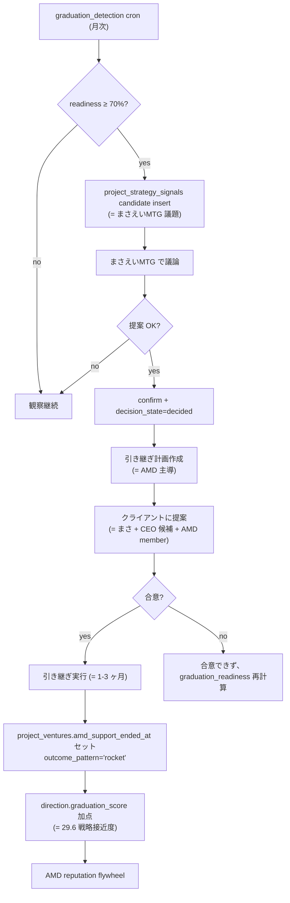

# 卒業フェーズ検出 仕様

AMD が支援している PJ について、 **「卒業準備が整いつつある状態」を AMD 側が先んじて検出**し、 **AMD から卒業を提案し、 引き継ぎを AMD 主導で進める** ための機能。

> **2026-05-26 まさ #84 確定**: 「察知が先か、 クライアントが先か = 評判の天と地」。 AMD OS の中核価値 (= AMD の評判 / 新規取得力 / Deeptech studio としての持続可能性) に直結する超重要機能として、 単独 module で実装する。

## 何を解くか

### 問題

AMD は PJ 支援を続けるうちに「もう CEO 候補が自走できる」段階に至る。 ここで:

| 検知主体 | 結末 | AMD への影響 |
|---|---|---|
| **AMD が先に察知** | AMD「成果が出たので AMD は卒業します。引き継ぎ計画はこうです」と先制提案 | ✅ AMD が育てた成功卒業 / 評判向上 / 新規案件取りやすくなる |
| **クライアントが先に察知** | クライアント「AMD って役に立ってなくない? 打ち切ろう」と切り出される | ❌ AMD は守りに入る (= 必要性アピール) / 評判低下 / 新規案件にも影響 |

同じ卒業でも、 **どちらが切り出すかで AMD の業界 reputation が天と地ほど変わる**。 これまでの経験で繰り返されてきた構造で、 まさが言語化したもの。

### 解くこと

- 各 PJ について、 月次で「卒業準備度」を 0-100 で算出する
- 閾値到達 (= 70% 以上) で「卒業提案候補」として **まさえいMTG 議題** に上げる
- まさが提案 OK と判断したら、 引き継ぎ計画作成 → 実行 → `project_ventures.amd_support_ended_at` セットまでを支援
- 全体として **「AMD 主導の成功卒業」を増やすフライホイール** を回す

### 解かないこと

- 失敗卒業 / 打ち切り判定 (= 別途必要だが本機能の対象外)
- PJ 再開 / 凍結解除 (= `project_freeze_periods` 管理)
- 引き継ぎ実務そのもの (= 引き継ぎ計画テンプレートは別途)

## 検出シグナル (= 6 種)

各 PJ について月次で 6 シグナルを集計する。 **どれか 1 つだけ強くても卒業提案には早い**。 複数が同時に上がってきた状態を「卒業準備度高」と判定する。

| # | シグナル | 取り方 | 何を意味する |
|---|---|---|---|
| 1 | **MTG main talker の遷移** | `project_meeting_summaries` の議事録 narrative を LLM で発言比率分析。 直近 3 ヶ月の CEO 候補 vs AMD 比率 | CEO 候補が AMD より発言してる = 議論主導が移ってる |
| 2 | **AMD member events 減少** | `member_activities` の AMD member 起点 events 件数。 過去 6 ヶ月の月次推移 (= 線形回帰の傾き) | AMD の介入頻度が減ってる = CEO 候補が独立して動いてる |
| 3 | **monthly_reports の AMD 寄与文言減少** | `monthly_reports` 本文を LLM で「AMD が」「PM が」「えいみが」等の頻度抽出。 過去 6 ヶ月の月次推移 | AMD の寄与表現が減ってる = 報告内容で AMD の存在感が薄れてる |
| 4 | **CEO 候補の milestone 主導比率** | `milestone_responsibility` の AMD vs CEO 候補比率。 当月 + 直近 3 ヶ月 | CEO 候補が milestone 責任を持ち始めてる |
| 5 | **経営判断の起点シフト** | `protocols` (`project_id` 一致) の `kind='proactive_amd'` vs `kind='ceo_led'` 比率 (= status=confirmed のみ) | 経営判断 / 戦略決定の起点が CEO に移ってる |
| 6 | **「もう大丈夫」キーワード検知** | `project_meeting_summaries.decided` / `risks` / `next_actions` から「卒業」「自走」「自走可能」「引き継ぎ」「AMD 撤退」等のキーワード | 直接シグナル (= 議事録に明示的に出る) |

### スコアリング

各シグナルを 0-100 で正規化:

| シグナル | 0 点 | 100 点 |
|---|---|---|
| 1 | AMD が 70% 以上発言 | CEO 候補が 70% 以上発言 |
| 2 | AMD events 件数 月次微増傾向 | AMD events 件数 月次 50% 以上減少 |
| 3 | AMD 寄与文言比率 横ばい/増加 | AMD 寄与文言比率 50% 以上減少 |
| 4 | AMD が 70% 以上 milestone 責任 | CEO 候補が 70% 以上 milestone 責任 |
| 5 | proactive_amd > ceo_led × 2 | ceo_led > proactive_amd × 2 |
| 6 | キーワード検出なし | キーワード検出 1 件以上 (= 出たら即 100) |

```text
graduation_readiness =
  0.20 × signal_1_talker
+ 0.20 × signal_2_events
+ 0.15 × signal_3_reports
+ 0.20 × signal_4_milestones
+ 0.15 × signal_5_decisions
+ 0.10 × signal_6_keywords
```

シグナル 6 (= 明示キーワード) は重みは軽いが、 検出されると即「最重要 trigger」 として通知優先度を上げる (= まさが見落とさないように)。

## アラート閾値 + まさえいMTG 議題化

| graduation_readiness | 状態 | アクション |
|---|---|---|
| 0-39% | 通常運用 | 何もしない |
| 40-69% | 観察 | UI で「卒業準備度上昇中」chip 表示、 即アクション不要 |
| **70% 以上** | **卒業提案候補** | **まさえいMTG 議題に自動投入** (= `project_strategy_signals` に candidate insert) |
| 90% 以上 | 卒業提案急務 | 通知優先度 critical (= 翌朝 push) |

### まさえいMTG への投入

70% 到達した PJ は自動的に `project_strategy_signals` に 1 件 insert される:

```json
{
  "project_id": "p07",
  "ym": "202605",
  "signal_type": "next_move",
  "title": "卒業提案候補: p07 (graduation_readiness 78%)",
  "summary": "MTG main talker が CEO 候補側に遷移 (= シグナル 1)、AMD events も過去6ヶ月で 40% 減 (= シグナル 2)。AMD 主導で卒業提案する好機。",
  "polarity": "forward",
  "impact_level": "high",
  "decision_state": "proposed",
  "status": "candidate",
  "score_impact_summary": "卒業成立で direction.graduation_score +X 点見込み",
  "source_refs_json": [
    { "source": "graduation_detection", "snapshot_id": "..." }
  ],
  "created_by": "graduation_detector"
}
```

まさえいMTG のセッションで:

- まさが「**提案 OK / もう少し様子見 / 違うアクション**」を判断
- `POST /api/strategy-signals { action:'confirm', decision_state:'decided' }` で確定
- decision_state='decided' になったら **引き継ぎ計画フェーズ** に入る

## 引き継ぎ計画 → 卒業確定フロー



引き継ぎ計画の中身 (= テンプレ):

- 引き継ぎ対象 (= 業務 / 知識 / 関係性 / システム)
- 移譲先 (= CEO 候補 / 内部メンバー / 外部協力先)
- スケジュール (= 1-3 ヶ月、 段階的)
- 卒業セレモニー (= AMD としての公式アナウンス)
- アーカイブ後の関係維持 (= 顧問契約 / アドバイザリー / 完全独立)

引き継ぎ計画は `project_meeting_summaries` で「dialogue:graduation:p07:...」 のような meeting_id で保存する。 narrative_md で「背景 → 引き継ぎ提案 → スケジュール → 残課題」 を 1 本にまとめる。

## DB スキーマ

### 新テーブル: `project_graduation_signals`

各 PJ × 月の卒業準備度スナップショット。 月次 cron で upsert。

```sql
CREATE TABLE project_graduation_signals (
  id UUID PRIMARY KEY DEFAULT gen_random_uuid(),
  project_id TEXT NOT NULL REFERENCES projects(project_id),
  ym TEXT NOT NULL,

  readiness_score NUMERIC NOT NULL,          -- 0-100 総合スコア

  signal_1_talker NUMERIC,                   -- 各シグナル 0-100
  signal_2_events NUMERIC,
  signal_3_reports NUMERIC,
  signal_4_milestones NUMERIC,
  signal_5_decisions NUMERIC,
  signal_6_keywords NUMERIC,

  inputs_json JSONB NOT NULL DEFAULT '{}',   -- 計算根拠 (= 件数 / 比率等)
  evidence_text TEXT,                        -- 人間が読む自然文
  matched_keywords TEXT[],                   -- シグナル 6 で検出した語

  computed_at TIMESTAMPTZ NOT NULL DEFAULT NOW(),

  UNIQUE (project_id, ym)
);

CREATE INDEX project_graduation_signals_readiness ON project_graduation_signals (readiness_score DESC, ym DESC);
```

### 既存テーブルの拡張

`project_ventures`:

- `amd_support_ended_at`: 既存。 卒業確定時にセット
- `outcome_pattern`: 既存。 成功卒業時 `'rocket'`、 失敗卒業時 `'ue_fail'`
- 値域確認: 実装前に `db_schema.md` で `outcome_pattern` の現在値を grep する

`project_strategy_signals` の使い方:

- 卒業提案候補は `signal_type='next_move'`、 `decision_state='proposed'` で candidate insert
- まさが confirm したら `decision_state='decided'` に昇格
- 引き継ぎ完了したら `decision_state='executing'` → 完了で `'revised'` (= 引き継ぎ実行ログとして残す)

## 抽出パイプライン

### cron schedule

```text
GET /api/cron/graduation-detection?ym=YYYYMM
```

月次 (= 毎月 1 日 06:00 JST) に全 active PJ について計算。 Authorization: Bearer ${CRON_SECRET}。

### 処理フロー

```
1. 対象 PJ 抽出
   SELECT * FROM projects WHERE status='active'
   AND project_id IN (
     SELECT project_id FROM project_ventures WHERE amd_support_ended_at IS NULL
   )

2. 各 PJ × ym でシグナル 1-6 を集計
   - シグナル 1 (= MTG main talker): LLM 経由で発言比率分析
   - シグナル 2 (= AMD events): member_activities を月次集計
   - シグナル 3 (= reports): LLM で monthly_reports 文言抽出
   - シグナル 4 (= milestones): milestone_responsibility 集計
   - シグナル 5 (= decisions): protocols 集計
   - シグナル 6 (= keywords): project_meeting_summaries 全文 grep

3. readiness_score 計算 + evidence_text 自然文生成

4. project_graduation_signals upsert (= UNIQUE project_id, ym)

5. readiness_score >= 70 なら project_strategy_signals に candidate insert
   (= 既存 candidate がある場合は重複 insert しない、 source_hash で判定)

6. readiness_score >= 90 なら l2_notifications に critical 通知
```

### LLM プロンプト (= 2026-05-27 seed 済)

シグナル 1 (= main talker) とシグナル 3 (= AMD 寄与文言) は LLM 必須。 prompt は `llm_prompts` テーブルで管理する (= 旧 GAS rewardscoring と同じパターン)。

| prompt_key | 用途 | seed migration |
|---|---|---|
| `graduation_detection.talker_ratio` | signal 1 (= MTG 発言比率) | [095_graduation_detection_llm_prompts.sql](../scripts/migrations/095_graduation_detection_llm_prompts.sql) |
| `graduation_detection.report_attribution` | signal 3 (= monthly_reports AMD 寄与文言) | 同上 |

**運用ルール (= AGENTS 絶対ルール踏襲)**:
- migration 095 で `is_active=FALSE` で seed 済。 まさが [`/admin/prompts`](../src/app/(app)/admin/prompts/page.tsx) で body を確認 / 微調整 → `is_active=TRUE` にする
- `is_active=FALSE` / body 空 のときは [`calculate.ts`](../src/lib/graduation-detection/calculate.ts) が **0 を返す** (= サイレントに変な抽出をしない、 まさ #判断不能なら null ルール踏襲)
- 両方 `inactive` でも cron は **正常動作**。 readiness_score は signal 2/4/5/6 だけから計算され、 LLM 経由のシグナルは 0 のまま保存される (= 2026-05-27 本番 smoke test 確認済、 `llm_enabled=false` で全 8 PJ processed)
- 片方だけ `active` でも OK (= 例: talker_ratio だけ activate して、 report_attribution は様子見)

**コスト目安**:
- 1 PJ あたり token 数千 (= 過去 3 ヶ月 MTG サマリ + 過去 6 ヶ月 monthly_reports)
- active PJ 8 件 × signal 1+3 = 16 calls / 月
- claude-sonnet-4-6 で月 $1-5 程度

**signal 1 (talker_ratio) 入力**:
- 過去 3 ヶ月の `project_meeting_summaries` (= summary_short / decided / next_actions / risks)
- 関連メンバー (= `project_founding_members` category=`startup`/`university` を CEO 候補、 category=`amd` を AMD member として LLM に渡す)

**signal 3 (report_attribution) 入力**:
- 過去 6 ヶ月の `monthly_reports` (= final_content / draft_content)

LLM 出力 JSON の取り回しは [`parseJsonFromLlm()`](../src/lib/graduation-detection/calculate.ts) でガード (= JSON でなければ 0 点 + raw を inputs に保存)。 LLM error も catch して 0 点 + error を inputs に保存する (= cron 全体は止めない)。

## UI

### `/management-score` (= バイタルサイン画面)

戦略接近度カードの下に「**卒業準備候補 PJ**」セクションを追加:

| 列 | 表示 |
|---|---|
| PJ name | クリックで cockpit 遷移 |
| readiness_score | 0-100 + chip (= 観察 / 候補 / 急務) |
| 主要シグナル | 高いシグナル top 2 (= 「main talker 遷移 88% / events 減 76%」のような表記) |
| 最終更新月 | snapshot ym |
| アクション | 「まさえいMTG 議題」リンク (= candidate 1 件にジャンプ) |

### `/project/[projectId]/cockpit`

cockpit hero に「**卒業準備度 X%**」を表示 (= 70% 以上は黄、 90% 以上は赤)。 詳細は modal で展開:

- シグナル 1-6 のスコアと根拠 (= evidence_text)
- 推移グラフ (= 過去 6 ヶ月の readiness_score 折れ線)
- まさえいMTG に上げる / 議題から外す ボタン

### `/management-score` 戦略接近度の internal

戦略接近度カードを開くと内訳が見える ([29.6 戦略接近度](4-5-management-score-and-finance-simulation-spec.md#296-score-計算--v4)):

- graduation_score 内訳 (= 成功卒業 PJ 数 / 全 PJ 数)
- 「直近卒業 PJ」一覧 (= rocket でセットされたもの)

## まさえいMTG プレイブック (= えいみ向け実務メモ)

まさえいMTG セッションで卒業候補が並んだとき:

1. **PJ 1 つずつ提示**:「p07、 graduation_readiness 78%。 主要シグナルは main talker 遷移 (= CEO 候補が直近 3 ヶ月 65% 発言) + AMD events 減 (= 過去 6 ヶ月で 42% 減)。卒業提案、 進める?」
2. **まさの反応待ち** (= 進める / 様子見 / 違う方向):
   - 進める → `POST /api/strategy-signals action=confirm decision_state=decided`、 引き継ぎ計画 phase へ
   - 様子見 → reject せず、 翌月 readiness 再計算 (= 自動で再度議題に上がる可能性)
   - 違う方向 → 「打ち切り提案」「凍結」等の別 signal_type で `action=create status=confirmed`
3. **引き継ぎ計画作成** (= 進めるになったら):
   - `POST /api/dialogue-meeting` で「dialogue:graduation:p07:YYYYMMDD」 meeting_id で議論ログ保存
   - 議事録 narrative_md には「背景 → 卒業提案 → 引き継ぎスケジュール → クライアント説明計画」を書く
   - cockpit MTGサマリに narrative として表示される

## 既知の難所 + 設計余地

| 論点 | あたしの仮説 / 確認事項 |
|---|---|
| **シグナル 1 / 3 の LLM コスト** | 月 1 回・active PJ × 6 ヶ月議事録 + reports = 1 PJ あたり 数千 token × 数十 PJ。 sonnet 4.6 で月 $10-30 程度に収まる想定 |
| **キーワード誤検出** | 「卒業」「自走」が文脈次第で誤検出 (例: 「自走できない」を逆に検出) → negation 判定 LLM prompt で吸収 |
| **CEO 候補の identify** | `project_founding_members` の `category='startup'` を CEO 候補とする想定。 複数 CEO 候補がいる PJ は合算 |
| **「自然な卒業」vs「突然の卒業」** | readiness が 6 ヶ月かけてジワジワ上がってる PJ → 自然な卒業。 1 ヶ月で急上昇 → 何か起きた (= クライアント側が察知してる兆候、 急ぐべき) |
| **既に卒業段階を過ぎてる PJ** | `amd_support_ended_at` が NULL のままなのに実態は AMD ほぼ動いてない → 検出機能で readiness 90%+ が継続的に出る → 月次レビューで強制的に議題化 |
| **PJ の質的差異** | 早期 PJ (= TRL 低) と後期 PJ で卒業基準は違うはず → readiness 閾値を AMD Score / XRL stage で動的に調整する余地 (= 後続検討) |
| **「もう一段、 上がってから卒業」** | 卒業提案候補だが、 まだ AMD として伸ばす余地ある時 → まさの judgment 優先、 自動判定しない |

## 関連

- バイタルサイン (= 接続元): [4-5 章 Management Score / Finance Simulation](4-5-management-score-and-finance-simulation-spec.md)
- まさえいMTG / 経営シグナル: [8-2 章 通知レビュー + 経営シグナル](8-2-notification-review-and-strategy-signals-spec.md)
- L2 抽出 routine (= シグナル 1 / 3 の LLM 抽出経路): [8-3 章 L2 Extraction Routines](8-3-l2-extraction-routines-spec.md)
- 設計議論 (= 別途作成予定): `pwa/design/graduation_detection.md`
- db schema: [`pwa/design/db_schema.md`](../design/db_schema.md)
