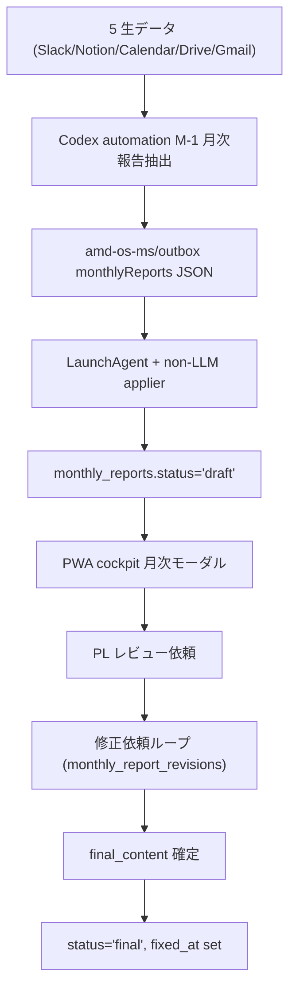
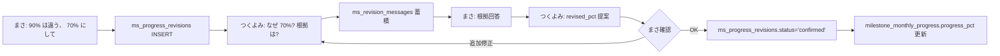

# MS Progress / Monthly Report / Revision Loop 仕様

D-2 MS 進捗、 M-1 月次報告書、 月次ノート、 つくよみ修正依頼 loop の正本仕様。 cockpit の月次モーダル正本を含む。

## MS Progress (= D-2)

`milestone_monthly_progress` (= 月次 % キャッシュ) と `progress_estimate_state` (= 抽出 state) が中核。

> **2026-06-12 全面改訂 (schedule_default_revision_v3)**: AI が進捗を直接書き込む方式を廃止。
> **「N か月計画の MS は 1 か月あたり 100/N % の累積進捗がデフォルトで入る。L2 データからズレが検知されたら通知に確認が来て、まさが認めない限りデフォルト通り」** が基本契約。確定仕様は [`/spec` 3-10 章](../spec/3-10-l2-ms-progress-current-spec.md)。

### `milestone_monthly_progress` 列

| column | 用途 |
|---|---|
| `milestone_key` / `ym` | UNIQUE |
| `progress_pct` | 当月の進捗 % (= 累積) |
| `consumed_pt` | 消費 pt (= reward 計算に使う) |
| `source` | `routine_auto` (= デフォルト月割り、自動) / `pm_manual` / `pm_confirmed` / `pm_rejected` / `criteria_toggle` / `tsukuyomi_revision` (= 人間確定系)。**AI 直接書き込み系 (`tsukuyomi_estimate` 等) は廃止** |
| `confirmed_at` | 確定時刻 (= 人間確定系のみ set) |
| `note` | 月次の動き要約 (= 自然文) |

### `progress_estimate_state` 列 (= 冪等性 state)

| column | 用途 |
|---|---|
| `project_id` / `ym` | UNIQUE |
| `source_hash` | 入力データの hash (= 差分検知) |
| `saved_count` / `skipped_count` / `total_count` | 抽出件数 |
| `llm_model` | 使用 model |
| `message` | エラー / state メッセージ |
| `last_processed_at` | 直近 |

### 進捗の書き込みフロー (= 2026-06-12 schedule_default_revision_v3)

進捗 % の writer は 2 系統に分かれる。**LLM は `milestone_monthly_progress` を一切書かない**。

```mermaid
flowchart LR
  subgraph default[デフォルト按分 — 非LLM]
    A[value_milestones の期間] --> B[Vercel cron ms-schedule-progress 02:30 JST]
    B --> C[全MS スケジュール按分を計算]
    C --> D[milestone_monthly_progress upsert source='routine_auto']
  end
  subgraph revision[ズレ検知 — LLM は提案のみ]
    E[monthly_reports + project_meeting_summaries] --> F[MMOマシン automation 毎時0分]
    F --> G[source_hash 差分検知 + Sonnet 4.6 推定]
    G --> H{デフォルトとの乖離 ±10pt 以上?}
    H -->|no| I[何もしない デフォルト有効]
    H -->|yes| J[ms_progress_revisions INSERT status='pending']
    J --> K[l2_notifications 通知 l2_kind='ms_progress_revision']
    K --> L{まさが はい/いいえ}
    L -->|はい| M[milestone_monthly_progress upsert source='tsukuyomi_revision']
    L -->|いいえ| N[status='discarded' デフォルト有効のまま]
  end
```

- **デフォルト按分**: `/api/cron/ms-schedule-progress` (= Vercel cron、毎日 02:30 JST、非LLM)。active PJ × {当月, 前月} の全MSへ `source='routine_auto'` でスケジュール按分の累積 % を upsert。人間確定系 (PM locked) の行は上書きしない
- **LLM 推定**: MMOマシン automation `amd-os-l3-ms-progress-extract` (毎時 0 分、[8-3 章 §D-2](8-3-l2-extraction-routines-spec.md))。L2 データから推定し、デフォルト按分との乖離が ±10pt 以上のときだけ `ms_progress_revisions` (pending) + 通知を積む。`project_monthly_notes` / `progress_estimate_state` の更新は従来通り
- 旧 PWA `/api/cron/hourly-estimate` は 2026-05-29 に停止済みで、`ALLOW_PWA_LLM_CRONS=1` なしでは disabled response のみ返す

### デフォルト月割り (= 全MS共通、アンカー方式)

2026-06-12 以降、月割りデフォルトは `tag='routine'` 限定ではなく **全MS共通**。「N か月計画の MS なら 1 か月あたり 100/N % の累積進捗がデフォルトで入る」が基本契約。

**さらに同日追補 (アンカー方式)**: まさが確定した月がある MS は、その確定値が按分の起点 (= アンカー) になる。

- `value_milestones.period_start_ym`〜`target_ym` の月数で 100% を割る (1年MSなら毎月 `100/12%`)
- **アンカーが無い MS**: 期間開始前の月は 0%、最終月以降は 100% (従来按分)
- **アンカーがある MS**: その月より前の最新の確定値 (PM locked 行) を起点に `アンカー% + (100/N) × 経過月数` (100 で cap)。例: 3か月MSを 5月に 15% で確定したら、6月デフォルトは 15 + 33.3 = **48.3%** — スケジュール表上は最終月でも勝手に 100% に飛ばない
- **アンカーがある MS は target_ym を過ぎても**、確定アンカーからの月割りで淡々と積み続ける。100% にしたければまさが確定するか、つくよみの修正提案に「はい」と答える
- Vercel cron `/api/cron/ms-schedule-progress` が対象月までの各月を `milestone_monthly_progress.source='routine_auto'` で upsert する (`consumed_pt` も points × 按分%で同時計算)
- PMが `pm_manual` / `pm_confirmed` / `pm_rejected` / `criteria_toggle` / `tsukuyomi_revision` で確定済みの月 (= PM locked) は上書きしない
- `ms_progress_revisions.status='confirmed'` がある月は、その修正値を `tsukuyomi_revision` として再適用し、デフォルトより優先する
- `/api/progress/ms-schedule` のMS別期待進捗も同じアンカー方式で計算する (表示と writer が一致)
- 報酬計算 (`reward-summary.ts`) の非確定月デフォルトも同じアンカー方式 (= 表示と支払いが一致)
- **巻き戻りはこの設計上起きない**: デフォルトは月が進むほど単調増加、AI が直接書く経路は無い。過去に AI 直書きで巻き戻った行 (`source='tsukuyomi_estimate'` / `l2_routine`) も cron が `routine_auto` で自然修復する

### 計画遅延通知 (= l2_kind 'ms_schedule_delay')

`target_ym` を過ぎたのに進捗が 100% 未満の MS は、毎日の cron が通知カード「**D-2 MS計画遅延**」を `/notifications` に積む (importance 2)。

- 検知対象は当月分のみ。「⏰ {PJ名} / {MS名} が計画遅延 (期限 {target_ym}, 現在 {pct}%)」形式
- 対応方法: 月次進捗モーダルで実態の % を確定するか、つくよみの修正提案に「はい」、あるいは MS の `target_ym` を見直す
- 100% に到達するなど遅延が解消したら、翌日の cron が同じ通知を自動で消す
- アンカーが無い MS は最終月に 100% になる (按分の自然な帰結) ので、遅延通知の対象にならない

### LLM 推定の役割 (= 提案のみ)

LLM (Sonnet 4.6) は L2 データから累積進捗を推定するが、**書くのは `ms_progress_revisions` (pending) と通知だけ**。

- デフォルト按分との乖離が ±10pt 未満なら何もしない (= デフォルトのまま)
- ±10pt 以上で `ms_progress_revisions` INSERT + `l2_notifications` (l2_kind=`ms_progress_revision`) を upsert
- PM locked の月は提案も skip。discarded 済みと同値の再提案、pending 重複も抑止
- 80%以上・100% の提案には、成果物が完成・完了・確定・提出・承認済・レビュー可能になった直接証拠が必要。面談、関心表明、VC/DD開始、準備、着手、進行中だけでは高進捗を提案しない
- まさが通知の「はい」または revision PATCH で confirm するまで、進捗はデフォルト月割りのまま

### `milestone_responsibility` (= per-MS のメンバーシェア)

| column | 用途 |
|---|---|
| `milestone_id` / `member_id` / `role` | UNIQUE |
| `share` | 0.0-1.0 (= per-MS のシェア) |
| `role` | `担当` / `補助` 等 |
| `task_description` | 担当領域 |

GAS `rv2_calcRewardSummary` が報酬計算時に `share` を掛けて per-member 配分を出す。

### `milestone_sub_items` (= MS のサブアイテム)

| column | 用途 |
|---|---|
| `sub_item_id` | text PK |
| `milestone_id` | 親 MS |
| `title` | サブアイテム名 |
| `weight` | 重み (= デフォルト 1) |
| `status` | `open` / `done` |
| `assignee` | 担当者 |

進捗 % の集計に使う (= sub_items の `status='done'` の重み比率)。

## 月次報告書 (= M-1、 `monthly_reports`)

`monthly_reports` は Codex automation `AMD OS M-1 月次報告抽出` が primary writer。5 生データを読み、`amd-os-ms/outbox.monthlyReports` 経由で非LLM applier が Supabase に反映する。

**🚨 課金注意 (2026-05-29 訂正)**: R313 は単なる deterministic 集約ではない。AMD-Report GAS 現物では、未生成レポートや差分ありレポートのときに R303 generator 経由で Anthropic Claude API を呼ぶ。`run_monthlyReportCron` trigger が有効なら token 課金が発生しうるため、「R313 = LLM 不使用」と書かない。2026-05-29 実画面確認時点では `run_monthlyReportCron` / `run_L2CronDaily` trigger は存在しない。

これは月次報告書の生成停止ではない。`monthly_reports` は OS の必須データで、定期生成は Codex automation 側で行う。PWA の手動/backfill route と月次報告モーダルは復旧・手動編集用。避けるのは、対象範囲や費用意図が曖昧なまま日次の有料API trigger を復活させること。

### `monthly_reports` 列

| column | 用途 |
|---|---|
| `report_id` | UNIQUE text PK |
| `project_id` / `ym` | UNIQUE |
| `draft_content` | draft 段階の markdown |
| `final_content` | 確定版 markdown |
| `status` | `pending` / `draft` / `final` |
| `collection_summary_json` | 5 生データ集計の jsonb |
| `generated_at` / `fixed_at` | 生成 / 確定時刻 |
| `slide_file_id` | Slide file ID (= Drive) |
| `pdf_file_id` | PDF file ID (= Drive) |
| `last_cron_at` | 直近 cron 実行 |
| `section_members` | 担当メンバーセクション |
| `pl_review_requested_at` / `pl_review_requested_by` | PL レビュー依頼 |
| `confirmed_by` | 確定者 |

### 生成フロー



### Backfill

休止期間 (= `project_freeze_periods.status='active'`) の PJ は monthly reports が空欄になる。 `/api/cron/freeze-period-backfill` (= manual operation) が Sonnet で休止期間サマリを生成、 `freeze_period_backfills` に保存する。

通常月の backfill は `/api/cron/monthly-reports-backfill` (= manual operation、 [6-1 章](6-1-operations-settings-spec.md))。Vercel cron には登録しない。必要な月・件数を確認してから手動で使う。

## 月次ノート (= `project_monthly_notes`)

MS 管理対象外 PJ (= `project_category='advisor'`) 用、 およびすべての PJ で MS 進捗とは別に「その月の動き要約」を残す。

### `project_monthly_notes` 列

| column | 用途 |
|---|---|
| `project_id` / `ym` | UNIQUE |
| 内容列 (= `note_md` 等) | jsonb / text |

`progress-estimator` が `monthly_reports` + `project_meeting_summaries` を寄せて `project_monthly_notes` を更新する (= advisor 系 PJ や MS 不在月の補助情報源)。

## 修正依頼 Loop (= つくよみとのチャット)

MS 進捗の修正依頼と、 月次報告書の修正依頼は **チャット型 loop**。 単発の「これに直して」ではなく、 つくよみとの往復で固める。

### MS 進捗修正 (= `ms_progress_revisions` + `ms_revision_messages`)



### `ms_progress_revisions` 列

| column | 用途 |
|---|---|
| `project_id` / `milestone_id` / `ym` | 対象 MS |
| `current_pct` / `current_note` | 修正前 |
| `revised_pct` / `revised_note` | 修正後 |
| `status` | `pending` / `confirmed` / `discarded` |
| `requested_by` / `confirmed_by` | アクター。つくよみ自動提案は `requested_by='system:tsukuyomi-estimate'` |

### つくよみ自動提案の confirm/discard (= 通知の「はい/いいえ」)

LLM がデフォルト按分との乖離 ±10pt 以上を検知して積んだ revision は、`l2_notifications` に **`l2_kind='ms_progress_revision'`** (= ラベル「D-2 MS進捗修正提案」) で通知される。通知カードの「はい/いいえ」で完結する:

- **はい** → revision confirm。`milestone_monthly_progress` に `source='tsukuyomi_revision'` (= PM locked) で upsert、`consumed_pt` 再計算、`tsukuyomi_learnings` / `member_ms_activities.learned_addendum` 蓄積、報酬 summary 再同期まで一括実行
- **いいえ** → `status='discarded'`。`milestone_monthly_progress` は触らない (= デフォルト月割りが有効のまま)。同値の再提案は抑止される
- `/api/progress/revisions` の PATCH (confirm/discard) でも同じ処理になる (= 通知経路と revision 画面経路は等価)

### `ms_revision_messages` 列 (= conversation)

| column | 用途 |
|---|---|
| `revision_id` | 紐付け `ms_progress_revisions` |
| `sender_kind` | `user` / `tsukuyomi` / `system` |
| `body` | メッセージ本文 |
| `created_at` | 時系列 |

### MS 進捗の「メンバー提案」 (= `ms_progress_proposals` + `ms_proposal_messages`)

mypage で SU 側メンバーが「自分はこの MS を 50% やったよ」と提案する経路 (= まだ未確定):

| `ms_progress_proposals` | 用途 |
|---|---|
| `member_id` | 提案者 |
| `project_id` / `milestone_id` / `ym` | 対象 |
| `suggested_pct` / `suggested_text` | 提案 |
| `status` | `pending` / `accepted` / `rejected` |
| `reject_reason_raw` | 却下理由 |
| `reviewed_by` / `reviewed_at` | レビュー |

提案 → admin or PM が confirm → `ms_progress_revisions` 経由で `milestone_monthly_progress` に反映。自動推定が後から走っても、confirmed revision が対象月のロックとして再適用される。

### 月次報告書修正 (= `monthly_report_revisions` + `monthly_report_revision_messages`)

同じパターン。

| column | 用途 |
|---|---|
| `project_id` / `ym` | 対象 monthly_report |
| `instruction` | 修正指示 (= 自然文) |
| `requested_by` | 依頼者 |
| `revised_content` | つくよみ提案の修正版 |
| `status` | `pending` / `applied` / `discarded` |

confirm されたら `monthly_reports.draft_content` を `revised_content` で置き換え。 `applied_at` セット。

## Cockpit 月次モーダル

`/project/[projectId]/cockpit` で月見出し (= `YYYY.MM稼働分`) クリック → `CockpitMonthlyModal` が開く。 ここでまさ / PM が見るもの:

| ブロック | 内容 |
|---|---|
| 月次報告書 | `monthly_reports.draft_content` / `final_content`、 修正依頼ボタン |
| MS 進捗 (per-MS) | `milestone_monthly_progress.progress_pct`、 cumulative bar、 修正依頼ボタン |
| MTG サマリ (当月) | `project_meeting_summaries` で当月 ym のもの |
| 経営ハイライト (当月) | `project_strategy_signals` で当月 ym のもの |
| 月次ノート | `project_monthly_notes` |

PM routine step 行や `?step=` query からこのモーダルを開いてはいけない。月次モーダルは月次カードから開く現行導線に限定し、stepId 別モーダルを再導入しない。

## 抽出 cron / Run Now

| operation | 役割 | cadence |
|---|---|---|
| `AMD OS M-1 月次報告抽出` | M-1 Codex automation (= primary) | daily 05:30 JST |
| `/api/cron/ms-schedule-progress` | D-2 デフォルト按分 writer (= Vercel cron、非LLM) | daily 02:30 JST |
| `claude-l3-ms-progress-extract` | D-2 ズレ検知 → revision 提案 (= MMOマシン automation) | 毎時 0 分 |
| `pwa-hourly-estimate` | 旧 PWA fallback。停止中 | disabled |
| `manual-monthly-reports-backfill` | 月次報告書を Sonnet で生成 | 手動 |
| `manual-freeze-period-backfill` | 休止期間 PJ の reports + meetings 統合 | 手動 |

[6-1 章](6-1-operations-settings-spec.md) に詳細。定期 cron として PWA hourly-estimate は使わない。月次モーダルの「AIで再推定」は `POST /api/progress/estimate` の明示操作で、定期抽出とは別導線。

## トラブル時

| 症状 | 確認場所 |
|---|---|
| 月次モーダルで MS 進捗が出ない | `milestone_monthly_progress` の該当 ym 行、 `value_milestones.is_active=true`、 `value_milestones.period_start_ym`/`target_ym` が入っているか (= 按分計算の入力) |
| 進捗 % が更新されない | `/api/cron/ms-schedule-progress` の実行ログ (= デフォルト按分 writer)。LLM 側は `progress_estimate_state.source_hash` / `amd-os-l3-ms-progress-extract` 実行履歴 (= 提案のみで % は書かない) |
| 進捗が想定よりズレてる | 通知の `ms_progress_revision` (= D-2 MS進捗修正提案) が pending で待ってないか。「はい」で confirm するまでデフォルト月割りのまま。確定済みの月があるなら、その確定値起点のアンカー按分になっているか (= 進みすぎに見えるときは過去の低い確定値が無いか) |
| 期限切れMSが 100% にならない | 仕様通り。アンカーがある MS は target_ym 超過後も確定値起点の月割りを継続する。「D-2 MS計画遅延」通知が出るので、実態に合わせて確定するか target_ym を見直す |
| 修正依頼が反映されない | `ms_progress_revisions.status='confirmed'`、 `milestone_monthly_progress` 該当行が `source='tsukuyomi_revision'` で更新されているか |
| 月次報告書が空 | `AMD OS M-1 月次報告抽出` の実行履歴、`amd-os-ms/outbox` の applied/failed、`monthly_reports.collection_summary_json`。R313 trigger は復活させない |
| 休止 PJ の月が空 | `project_freeze_periods.status='active'`、 `manual-freeze-period-backfill` 実行 |
| advisor PJ で MS が出る | `projects.project_category='advisor'` の判定、 月次ノート側に寄せる ([2-6 章](2-6-admin-ops.md)) |

## 関連

- 設計: [`pwa/design/ms_progress.md`](../design/ms_progress.md) (= MS 進捗詳細)
- 設計: [`pwa/design/progress_estimation.md`](../design/progress_estimation.md) (= つくよみ MS 推定アルゴリズム)
- 設計: [`pwa/design/meeting_summaries.md`](../design/meeting_summaries.md) (= MTG サマリ正本)
- 8-3 章 [L2 Extraction Routines §D-2](8-3-l2-extraction-routines-spec.md) (= D-2 抽出 routine)
- 2-3 章 [PJ コックピットの見方](2-3-pj-cockpit.md) (= 月次モーダル UI)
- 6-6 章 [Member Ops / Billing / Prompt](6-6-member-billing-prompts-spec.md) (= mypage 月次進捗表示)
- 8-1 章 [Knowledge Admin / Tsukuyomi](8-1-knowledge-admin-tsukuyomi-spec.md) (= dialog 対話型ループ全体)
- 6-1 章 [Operations Settings](6-1-operations-settings-spec.md) (= cron Run Now)
