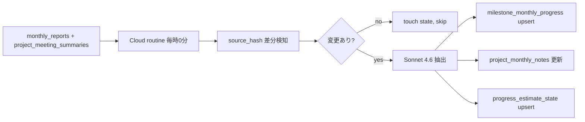
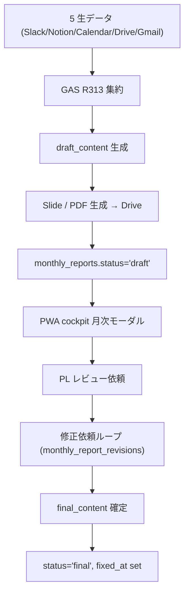
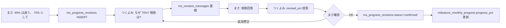

# MS Progress / Monthly Report / Revision Loop 仕様

L2 ③ MS 進捗、 L2 ① 月次報告書、 月次ノート、 つくよみ修正依頼 loop の正本仕様。 cockpit の月次モーダル正本を含む。

## MS Progress (= L2 ③)

`milestone_monthly_progress` (= 月次 % キャッシュ) と `progress_estimate_state` (= 抽出 state) が中核。

### `milestone_monthly_progress` 列

| column | 用途 |
|---|---|
| `milestone_key` / `ym` | UNIQUE |
| `progress_pct` | 当月の進捗 % (= 累積) |
| `consumed_pt` | 消費 pt (= reward 計算に使う) |
| `source` | `cron` / `manual` / `tsukuyomi` |
| `confirmed_at` | 確定時刻 |
| `note` | 月次の動き要約 (= 自然文) |

### `progress_estimate_state` 列 (= 冪等性 state)

| column | 用途 |
|---|---|
| `project_id` / `ym` | UNIQUE |
| `source_hash` | 入力データの hash (= 差分検知) |
| `saved_count` / `skipped_count` / `total_count` | 抽出件数 |
| `llm_model` | 使用 model |
| `message` | エラー / state メッセージ |
| `last_processed_at` | 直近 |

### 抽出フロー (= Cloud routine `amd-os-l3-ms-progress-extract`)

cadence: 毎時 0 分 JST (= [8-3 章 §③](8-3-l2-extraction-routines-spec.md))。 PWA `/api/cron/hourly-estimate` (= 並行稼働中) と Claude routine `amd-os-l3-ms-progress-extract` の dual writer。

### 定常業務 MS (`tag='routine'`)

定常業務は、トラブルがなければ月割りで進むものとして扱う。

- `value_milestones.period_start_ym`〜`target_ym` の月数で 100% を割る
- 1年PJなら毎月 `100/12%`
- `progress-estimator` は対象月までの各月を `milestone_monthly_progress.source='routine_auto'` で補完する
- PMが `pm_manual` / `pm_confirmed` / `pm_rejected` / `criteria_toggle` / `tsukuyomi_revision` で確定済みの月は上書きしない
- `ms_progress_revisions.status='confirmed'` がある月は、その修正値を `tsukuyomi_revision` として再適用し、自動推定より優先する
- `/api/progress/ms-schedule` のMS別期待進捗アンカーも同じ MS別期間から計算する

### 成果物MSの高進捗ガード

非routineのMSも、まずMS個別期間の按分を基本値にする。5か月MSなら1か月目20%、2か月目40%、3か月目60%が基準。情報ソースから遅れが分かれば10%/15%などに下げ、先行が分かれば25%などに上げる。

- `progressPct` は今月の追加分ではなく、対象月時点の累積進捗率
- MS個別期間の開始前は自動推定で保存しない
- AI由来の過大値 (`source='tsukuyomi_estimate'`) は次回推定で下方修正してよい
- 80%以上、または100%を保存するには、成果物が完成・完了・確定・提出・作成済・策定済・承認済・レビュー可能になった直接証拠が必要
- 面談、関心表明、VC/DD開始、資料作成予定、準備、着手、進行中だけでは高進捗にしない
- 資本政策MSでは、資本政策表・調達方針・持分方針・EXITまでの道筋の実物またはレビュー可能なドラフトが確認できる場合だけ高進捗にする

### `milestone_responsibility` (= per-MS のメンバーシェア)

| column | 用途 |
|---|---|
| `milestone_id` / `member_id` / `role` | UNIQUE |
| `share` | 0.0-1.0 (= per-MS のシェア) |
| `role` | `担当` / `補助` 等 |
| `task_description` | 担当領域 |

GAS `rv2_calcRewardSummary` が報酬計算時に `share` を掛けて per-member 配分を出す。

### `milestone_sub_items` (= MS のサブアイテム)

| column | 用途 |
|---|---|
| `sub_item_id` | text PK |
| `milestone_id` | 親 MS |
| `title` | サブアイテム名 |
| `weight` | 重み (= デフォルト 1) |
| `status` | `open` / `done` |
| `assignee` | 担当者 |

進捗 % の集計に使う (= sub_items の `status='done'` の重み比率)。

## 月次報告書 (= L2 ①、 `monthly_reports`)

`monthly_reports` は AMD-Report GAS R313 が別 clasp で生成し、 PWA の report route / backfill route が補助する。 **LLM 不使用** (= 5 生データを deterministic に集約)。

### `monthly_reports` 列

| column | 用途 |
|---|---|
| `report_id` | UNIQUE text PK |
| `project_id` / `ym` | UNIQUE |
| `draft_content` | draft 段階の markdown |
| `final_content` | 確定版 markdown |
| `status` | `pending` / `draft` / `final` |
| `collection_summary_json` | 5 生データ集計の jsonb |
| `generated_at` / `fixed_at` | 生成 / 確定時刻 |
| `slide_file_id` | Slide file ID (= Drive) |
| `pdf_file_id` | PDF file ID (= Drive) |
| `last_cron_at` | 直近 cron 実行 |
| `section_members` | 担当メンバーセクション |
| `pl_review_requested_at` / `pl_review_requested_by` | PL レビュー依頼 |
| `confirmed_by` | 確定者 |

### 生成フロー

### Backfill

休止期間 (= `project_freeze_periods.status='active'`) の PJ は monthly reports が空欄になる。 `/api/cron/freeze-period-backfill` (= manual operation) が Sonnet で休止期間サマリを生成、 `freeze_period_backfills` に保存する。

通常月の backfill は `/api/cron/monthly-reports-backfill` (= manual operation、 [6-1 章](6-1-operations-settings-spec.md))。

## 月次ノート (= `project_monthly_notes`)

MS 管理対象外 PJ (= `project_category='advisor'`) 用、 およびすべての PJ で MS 進捗とは別に「その月の動き要約」を残す。

### `project_monthly_notes` 列

| column | 用途 |
|---|---|
| `project_id` / `ym` | UNIQUE |
| 内容列 (= `note_md` 等) | jsonb / text |

`progress-estimator` が `monthly_reports` + `project_meeting_summaries` を寄せて `project_monthly_notes` を更新する (= advisor 系 PJ や MS 不在月の補助情報源)。

## 修正依頼 Loop (= つくよみとのチャット)

MS 進捗の修正依頼と、 月次報告書の修正依頼は **チャット型 loop**。 単発の「これに直して」ではなく、 つくよみとの往復で固める。

### MS 進捗修正 (= `ms_progress_revisions` + `ms_revision_messages`)

### `ms_progress_revisions` 列

| column | 用途 |
|---|---|
| `project_id` / `milestone_id` / `ym` | 対象 MS |
| `current_pct` / `current_note` | 修正前 |
| `revised_pct` / `revised_note` | 修正後 |
| `status` | `pending` / `confirmed` / `discarded` |
| `requested_by` / `confirmed_by` | アクター |

### `ms_revision_messages` 列 (= conversation)

| column | 用途 |
|---|---|
| `revision_id` | 紐付け `ms_progress_revisions` |
| `sender_kind` | `user` / `tsukuyomi` / `system` |
| `body` | メッセージ本文 |
| `created_at` | 時系列 |

### MS 進捗の「メンバー提案」 (= `ms_progress_proposals` + `ms_proposal_messages`)

mypage で SU 側メンバーが「自分はこの MS を 50% やったよ」と提案する経路 (= まだ未確定):

| `ms_progress_proposals` | 用途 |
|---|---|
| `member_id` | 提案者 |
| `project_id` / `milestone_id` / `ym` | 対象 |
| `suggested_pct` / `suggested_text` | 提案 |
| `status` | `pending` / `accepted` / `rejected` |
| `reject_reason_raw` | 却下理由 |
| `reviewed_by` / `reviewed_at` | レビュー |

提案 → admin or PM が confirm → `ms_progress_revisions` 経由で `milestone_monthly_progress` に反映。自動推定が後から走っても、confirmed revision が対象月のロックとして再適用される。

### 月次報告書修正 (= `monthly_report_revisions` + `monthly_report_revision_messages`)

同じパターン。

| column | 用途 |
|---|---|
| `project_id` / `ym` | 対象 monthly_report |
| `instruction` | 修正指示 (= 自然文) |
| `requested_by` | 依頼者 |
| `revised_content` | つくよみ提案の修正版 |
| `status` | `pending` / `applied` / `discarded` |

confirm されたら `monthly_reports.draft_content` を `revised_content` で置き換え。 `applied_at` セット。

## Cockpit 月次モーダル

`/project/[projectId]/cockpit` で月見出し (= `YYYY.MM稼働分`) クリック → `CockpitMonthlyModal` が開く。 ここでまさ / PM が見るもの:

| ブロック | 内容 |
|---|---|
| 月次報告書 | `monthly_reports.draft_content` / `final_content`、 修正依頼ボタン |
| MS 進捗 (per-MS) | `milestone_monthly_progress.progress_pct`、 cumulative bar、 修正依頼ボタン |
| MTG サマリ (当月) | `project_meeting_summaries` で当月 ym のもの |
| 経営ハイライト (当月) | `project_strategy_signals` で当月 ym のもの |
| 月次ノート | `project_monthly_notes` |

ステップ行クリックでこのモーダルを開いてはいけない (= 6-5 章で書いた回帰多発エリア、 `CockpitView.resolveStepModalFromTap()` 経由で stepId 別モーダル)。

## 抽出 cron / Run Now

| operation | 役割 | cadence |
|---|---|---|
| `pwa-hourly-estimate` | MS 進捗 hourly estimate を手動キック | 毎時 0 分 |
| `claude-l3-ms-progress-extract` | L2 ③ Cloud routine (= 並行) | 毎時 0 分 |
| `manual-monthly-reports-backfill` | 月次報告書を Sonnet で生成 | 手動 |
| `manual-freeze-period-backfill` | 休止期間 PJ の reports + meetings 統合 | 手動 |

[6-1 章](6-1-operations-settings-spec.md) に詳細。 `pwa-hourly-estimate` の `Run Now` default は `maxItems=3` (= 詰まり確認用)。 全件再推定したい時は `force=1` / `ym=YYYYMM` / `maxItems` の意味を確認してから実行する。

## トラブル時

| 症状 | 確認場所 |
|---|---|
| 月次モーダルで MS 進捗が出ない | `milestone_monthly_progress` の該当 ym 行、 `value_milestones.is_active=true` |
| 進捗 % が更新されない | `progress_estimate_state.source_hash` が変わったか、 cron 実行履歴、 modal の `pwa-hourly-estimate` Run Now |
| 修正依頼が反映されない | `ms_progress_revisions.status='confirmed'`、 `milestone_monthly_progress` 該当行が更新されているか |
| 月次報告書が空 | `monthly_reports.status='pending'` のまま、 GAS R313 実行履歴、 `/api/cron/monthly-reports-backfill` で再生成 |
| 休止 PJ の月が空 | `project_freeze_periods.status='active'`、 `manual-freeze-period-backfill` 実行 |
| advisor PJ で MS が出る | `projects.project_category='advisor'` の判定、 月次ノート側に寄せる ([2-6 章](2-6-admin-ops.md)) |

## 関連

- 設計: [`pwa/design/ms_progress.md`](../design/ms_progress.md) (= MS 進捗詳細)
- 設計: [`pwa/design/progress_estimation.md`](../design/progress_estimation.md) (= つくよみ MS 推定アルゴリズム)
- 設計: [`pwa/design/meeting_summaries.md`](../design/meeting_summaries.md) (= MTG サマリ正本)
- 8-3 章 [L2 Extraction Routines §③](8-3-l2-extraction-routines-spec.md) (= L2 ③ 抽出 routine)
- 2-3 章 [PJ コックピットの見方](2-3-pj-cockpit.md) (= 月次モーダル UI)
- 6-6 章 [Member Ops / Billing / Prompt](6-6-member-billing-prompts-spec.md) (= mypage 月次進捗表示)
- 8-1 章 [Knowledge Admin / Tsukuyomi](8-1-knowledge-admin-tsukuyomi-spec.md) (= dialog 対話型ループ全体)
- 6-1 章 [Operations Settings](6-1-operations-settings-spec.md) (= cron Run Now)
