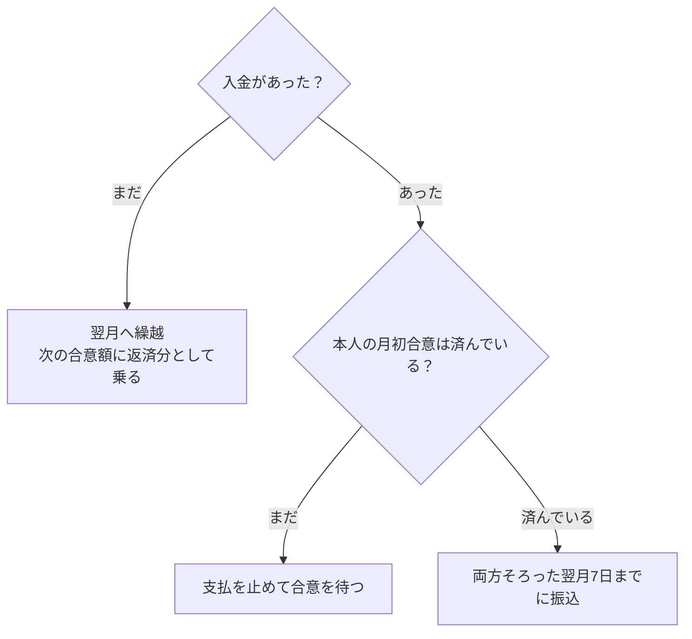
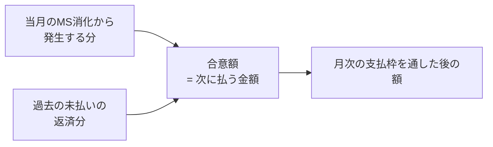
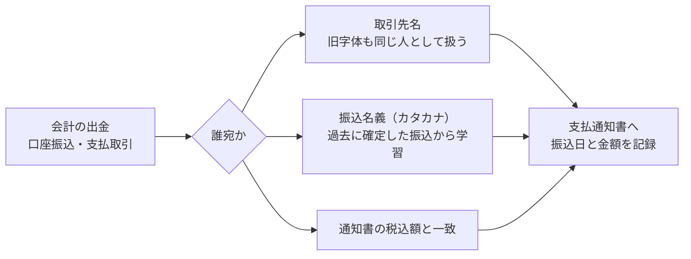

# メンバー支払フロー — 合意から振込まで

AMD からメンバーへ業務委託費を払うまでの流れをまとめる。**金額がどこで決まり、いつ払われ、払ったことをどう確認するか**の1本の筋。

個別の画面仕様は [6-5 章 支払通知書](6-5-admin-payouts-reward-notice-spec.md)、計算式は [7-1 章 報酬計算ロジック](7-1-reward-calc-spec.md)、クライアントからの入金確認は [6-4 章](6-4-finance-payment-confirm-spec.md) を見る。ここはその手前の「全体像」。

---

## まず一行で

> **月初に合意した金額を、クライアントからの入金があってから払う。**

金額は月初合意で確定する。支払通知書の側で計算し直さない。払う時期は入金が来てから決まる。

---

## 全体の流れ


支払に進めるかどうかは、④の入金と①の合意の2つで決まる。



---

## ① 金額はどこで決まるか

**月初合意で決まる。** 合意する金額は「次に払う金額そのもの」で、次の2つを足したもの。



過去の未払いの返済分を入れずに合意額を出すと、合意した額と実際に払う額が食い違う。**支払うべきすべての金額が合意額に入っていなければ、その計算が間違っている**（まさ確定 2026-08-27）。

支払通知書は、この合意額をそのまま使う。通知書の側で別の計算をしない。

### 月次の支払枠

1か月に払える上限は、そのPJのクライアント支払から決まる。

```
PJ予算 = (クライアント支払 − 契約バッファ) × 65%
```

発生額と繰越の合計がこの枠を超える月は、メンバー全員の「発生+繰越」に比例して按分し、払いきれない分が翌月へ繰り越される。詳細は [7-1 章](7-1-reward-calc-spec.md)。

---

## ② いつ払うか

支払は次の2つが**両方そろってから**。

| 条件 | 意味 |
|---|---|
| クライアントからの入金 | そのPJの請求に対する入金が確認できていること |
| 本人の月初合意 | 当人がその稼働月の内容と金額に合意していること |

**両方そろった翌月7日まで**に振り込む。請求書をいつ出したか、支払条件が何日かは、メンバーへの支払時期の計算には使わない。

入金がまだの月は支払わず、その分は未払いとして翌月以降の合意額へ返済分として乗る。

---

## ③ 立替精算の合流

承認済みの立替精算は、同じ支払通知書に合算して払う。報酬とは扱いが違う。

| | 報酬 | 立替精算 |
|---|---|---|
| 消費税 | 税抜額に10%を上乗せ | 上乗せしない（実費そのまま） |
| 支払枠 | 65%枠の中で按分される | 枠では削らない（原資が違う） |
| 二重払いの防止 | 支払通知書の月で管理 | 一度乗せた立替に支払月の印を付け、以後拾わない |

支払通知書の内訳は「小計（税抜）／消費税／立替精算（実費）／合計（税込）」の4段になる。報酬が0円で立替だけの月も通知書を出す。

---

## ④ 払ったことの確認

**人に聞かない。** 会計（freee）の出金を毎日読み込み、支払通知書と突き合わせて自動で記録する。



支払通知書の一覧には「振込済 5/29 ¥804,914」または「振込未確認」が出る。数えるのは口座からの振込か、通知書の税込額と1円単位で一致する支出だけ。経費の立替やカード決済は支払いに数えない。

---

## 混同しやすい2つの「月」

同じPJの同じ稼働月から、意味の違う「月」が2つ出る。**取り違えると画面ごとに金額が食い違う。**

| | 意味 | 使う場所 |
|---|---|---|
| クライアント入金月 | クライアントからAMDへ入金される月 | 売上、入金予定、資金繰り |
| メンバー支払月 | AMDからメンバーへ払う月 | 報酬、配賦、支払通知書、月初合意 |

2026年8月に、月初合意・役員への配賦・経営スコアの3か所がクライアント入金月でメンバーへの支払を数えており、同じ月を開いても画面ごとに金額が違う状態になっていた。いまは呼び分けを機械で検査している（`npm run test:payment-month-usage`）。

---

## 画面ごとの役割

| 画面 | 何を見る |
|---|---|
| 月初合意（メンバー本人） | その月にやることと、次にもらえる金額の確認・合意 |
| 月初合意（admin） | 誰が合意済みか、合意額はいくらか。未合意は支払を止める |
| 支払通知書 | 合意額＋立替の発行、送付、振込の確認 |
| 支払通知書の内訳 | 金額の中身。MS別の発生、繰越がどの月の分か、実際の振込 |

---

## よくある状態と読み方

| 見えているもの | 意味 |
|---|---|
| 支払額が0円で、未払い残だけある | その稼働月はクライアント請求がない（契約期間外など）。発生分は消えず、次に入金がある月の枠から順に払う |
| 合意額と支払通知書の額が違う | 起きてはいけない状態。同じ計算を使っているので、違えば不具合 |
| 「振込未確認」のまま | 会計の出金に、その通知書の税込額と一致する振込が見つかっていない |
| 立替が通知書に出ない | admin承認がまだか、すでに別の支払月へ乗せた後 |

---

## 関連する自動処理

| 処理 | 役割 |
|---|---|
| 報酬キャッシュ再計算 | 発生額・繰越・支払額の計算を作り直す |
| クライアント入金の取り込み | 会計の入金を請求と突き合わせ、入金月を確定する |
| メンバー支払の取り込み | 会計の出金を支払通知書と突き合わせ、振込済みを記録する |
| 支払通知書の先回り生成 | 送付前のPDFを夜間に作る |
