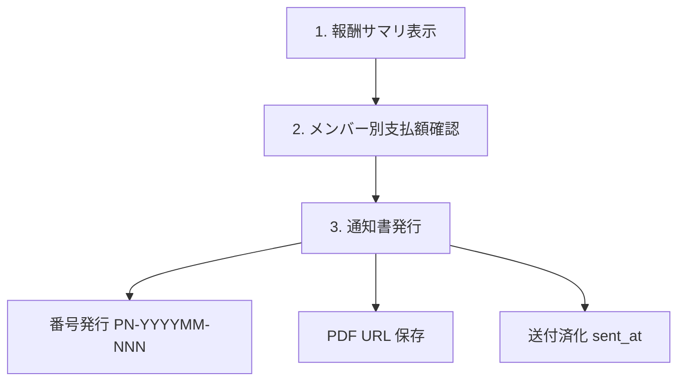
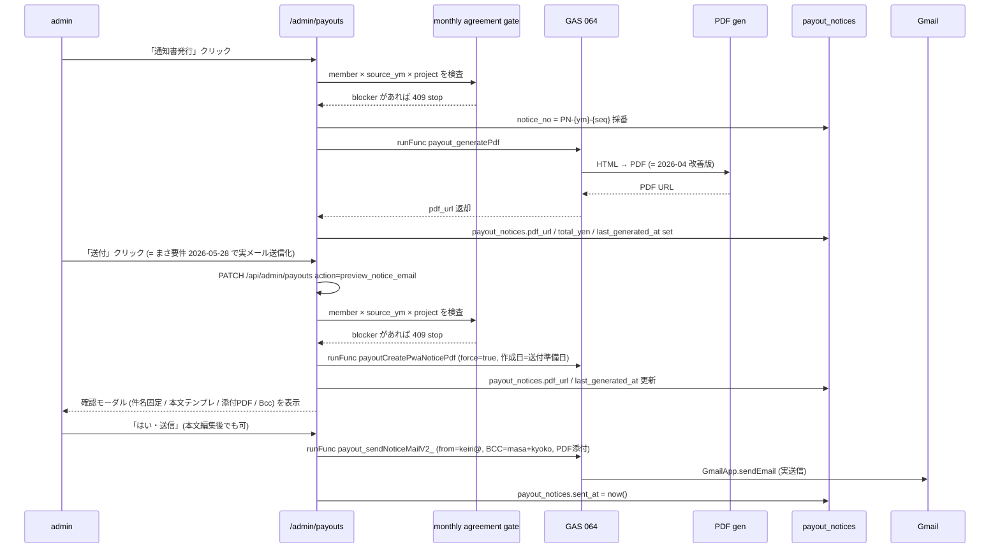

# Admin Payouts / 支払通知書 仕様

`/admin/payouts` 画面の仕様。 AMD から SU 側メンバーへの **月次業務委託費 (= AMD 業務委託フィー) 支払通知書** 発行フロー。 メンバー視点は [2-2 章](2-2-member-workflows-quick-start.md)、 admin 入口は [2-6 章](2-6-admin-ops.md)、 **報酬計算式・進捗ソース・キャップ制御の正本**は [7-1 章 報酬計算ロジック 詳細仕様](7-1-reward-calc-spec.md) を見る。

## 画面 URL

`/admin/payouts?ym=YYYYMM`

`ym` 省略時は現月。 `admin_listPayoutYmCandidates` (GAS) で支払対象月の候補を出して切替できる。

## 支払対象

支払通知書発行は **AMD メンバー → SU 法人** ではなく、 **AMD → AMD メンバー** が原則。 SU 法人がまだ無い PJ (= pre-founding) でも、 業務委託契約に基づき AMD から各メンバーへの月次支払が発生する。

### 対象判定 (= `admin_listPayoutYmCandidates`)

GAS 066 `A066_PayoutPaidRepo.js` の `admin_listPayoutYmCandidates` が、 admin に表示する候補月を返す。 ロジック:

```text
1. members where status='active' AND exclude_from_payout_notice=false
2. 各メンバーの participate PJ (= project_members.is_active=true) × ym で billing_cycles を結合
3. 該当 ym の billing_cycles.reward_summary_json から member_allocations_json[memberId] を抽出
4. 合計額 > 0 のメンバーを表示
```

`exclude_from_payout_notice=true` のメンバー (= 例: りり / ID006 NIMS 無償出向、あき / ID029 無報酬稼働) は通知書発行を skip。月初合意も `not_required` とし、admin の合意一覧・合意保存・修正要望保存の対象から外す。

## 月次サイクル



### 1. 報酬サマリ表示

`billing_cycles.reward_summary_json` を **キャッシュ表示**。 通常 GET は重い再計算を走らせない (= 過去ハマり)。支払月の明細だけでなく、先12か月の capped 支払予定 (`forecastCapped`) も `forecastCycles.reward_summary_json` から集計し、画面を開いただけでは `computeForwardCappedMemberCosts` 相当の重い再計算を全PJ分回さない。

報酬対象メンバーがいない月も、`reward_summary_json.members=[]` の **0円キャッシュ**として保存する。`null` のままだと `/admin/payouts` の先12か月表が「未計算」と解釈し、budget fallback で本来 0 円のPJに支払予定を出す事故になるため。

`reward_summary_json` の構造 (= GAS rv2 計算):

```json
{
  "totalPaidYen": 350000,
  "members": {
    "ID001": { "earnedPt": 100, "basePay": 150000, "bonusPt": 50, "totalPay": 200000 },
    "ID002": { ... }
  },
  "ptUnit": 1500,
  "ptUnitNote": "...",
  ...
}
```

### 報酬キャッシュ再計算

- 自動: `/api/cron/payout-reward-cache-refresh` (= 日次 03:05 JST)。通常実行は前月 + 当月から先12か月の支払 ym と、同じ窓内の稼働 ym を対象にし、`/admin/payouts` の先12か月表で読む `forecastCycles.reward_summary_json` を事前生成する。`ym=YYYYMM` を指定した手動実行は既定でその月のみ、`lookahead=11` などを付けると指定月から先12か月まで更新する。
- 手動: `/admin/payouts` の「報酬キャッシュ再計算」ボタン (= UI から `refreshRewards=1` で route 叩く)
- 入力: `billing_cycles` + `value_milestones` + `milestone_monthly_progress` + `milestone_responsibility`
- 出力: `billing_cycles.reward_summary_json` (= 上書き。0円月も `members=[]` のキャッシュを保存) + `budget_yen` fallback

通常 GET は **読むだけ**。 admin の保存系処理または手動ボタンだけが再計算を走らせる (= まさ #過去 教訓)。`refreshRewards=1` の場合は再計算後の `reward_summary_json` を使って同じ集計を返す。

`/admin/payouts` の初回表示は、page 側が `loadTargetData(currentYm, { includeAgreementGate: false })` を SSR で実行し、`AdminPayoutsClient initialData` として渡す。クライアントは初回 client GET をスキップし、月変更・手動再計算・保存/発行後の再取得だけ `/api/admin/payouts` を使う。これにより、キャッシュ済みデータを表示するだけなのに hydration 後の API 待ちで空表示が続く事故を避ける。

初期表示の `GET /api/admin/payouts` は、支払データ本体を先に返すため月初合意gateの重い snapshot 照合を含めない。画面は `gateOnly=1` の別GETを裏で走らせ、後から「月初合意支払ゲート」パネルだけ更新する。保存・発行・送付などの write action は従来どおりサーバー側で `buildPayoutAgreementGateSummary()` を必ず実行し、gate blocker があれば止める。

### 報酬額の手入力禁止

`/admin/payouts` には、PJ・稼働月・メンバー・支払額を手で指定して報酬明細へ入れるルートを置かない。報酬額は `value_plan_cycles` / `value_milestones` / `milestone_monthly_progress` / `milestone_responsibility` から再計算できるものだけを正とする。

MS / PlanCycle が未設定の PJ は報酬計算対象外。支払が必要な場合は、先にMS / PlanCycle / responsibility を作る。

### 2. メンバー別支払額確認

メンバー行 × PJ 列のマトリクス。 各セルに per-PJ の per-member 支払額。 行末に各メンバーの月次合計、 PJ 列末に各 PJ の月次合計。

この表が `/admin/payouts` の主作業面なので、サマリ直下・報酬債務台帳より上に置く。

支払通知書の正式発行・送付に使う税抜支払額は、最新の報酬キャッシュから `monthly_reward_payout` と `payout_notices.total_yen` に同期する。画面を開いただけでは保存せず、夜間の `payout-notice-prebuild` cron、正式PDF発行、一括発行、送付モーダル準備のタイミングで同期する。同期時点ではメール送信しない。金額が変わった未送付 PDF は `pdf_url` / `last_generated_at` をクリアし、次の一括発行・cron prebuild で再生成対象へ戻す。金額が変わっていなくても、未送付PDFの `last_generated_at` より `members.updated_at` が新しい場合は、メンバー台帳の住所・宛名・登録番号が変わった可能性があるため再生成対象にする。

UI では通常の同期差分をバッジ表示しない。差分があっても画面表示中に自動POSTはしない。開きっぱなしのタブでは 60 秒ごとに read-only 再取得し、夜間 cron や別操作で同期済みになった状態へ追随する。正式な個別発行・全員分PDF一括発行・強制再発行・送付モーダル準備は、サーバー側で最新計算額を同期し、その後に DB から `members` / `monthly_reward_payout` / `payout_notices` を読み直してから実行する。金額が変わっていなくても、`/admin/members` で更新した `contractor_name` / `member_address` / `invoice_registration_number` は再発行PDFへ反映する。運用者が先に保存ボタンを押す必要はない。月初合意 gate や本契約cap blocker がある場合だけ `同期できない` を表示して同期を止め、admin override または blocker 解消を待つ。

### 月初合意ステータスとの境界

`/admin/monthly-work-agreements?ym=YYYYMM` で、支払対象になりうる active member / active project member が当月の遂行内容・予定報酬に合意済みかを確認できる。ここで保存される `member_monthly_work_agreements` は月初計画 snapshot と hash の監査レイヤーで、`/admin/payouts` の報酬計算や支払通知書発行額を直接変更しない。

`frozen` PJ は報酬が発生しないため、月初合意の対象PJから除外する。月初合意の予定報酬は、当月の月次予算を当月の予定MS消化ptと active member 正規化 share で配分した **月初合意用の予定額** として算出する。これは支払通知書の `reward_summary_json.members[].totalPay` とは別の確認レイヤーで、本人から届いた修正要望は `member_monthly_work_agreement_requests` に保存され、admin一覧の「修正要望」件数と各行の最新要望時刻で確認する。

admin一覧では合意用の予定報酬とは別に、`reward_summary_json.members[].totalPay` 由来の `今月支払` と `stockYen` 由来の `未払い残` を列で分けて表示する。`stockYen` は前月繰越も含む今月末の未払い残で、今月支払対象ではない。支払額・未払い残の計算正本は `/admin/payouts` / 報酬キャッシュ側にあり、月初合意一覧は監査・確認のための read-only 表示に留める。

`/admin/payouts` は支払対象の `member × 稼働月 × PJ` ごとに `member_monthly_work_agreements` / `member_monthly_work_agreement_requests` を read し、未合意・条件更新あり・修正要望中のまま支払へ進ませない。これは支払 gate であり、`reward_summary_json` の計算式には混ぜない。

2026年5月以前の稼働月 (`source_ym <= 202605`) は、月初合意機能の導入前/移行月として支払 gate 上 `合意済` 扱いにする。実際の合意 row を作るのではなく、gate の表示理由を「導入前/移行月のため合意済み扱い」とし、2026年6月以降の稼働月から通常どおり未合意・条件更新・修正要望を blocker にする。

移行月扱いの行だけで blocker が無い場合、admin UI は個別メンバー一覧を出さず、対象支払行数と「移行月スキップ」の summary だけを表示する。支払 gate は支払発生行を守る仕組みなので、支払行が無い他メンバーを個別の `合意済` 行として見せない。

| state | UI表示 | server behavior |
|---|---|---|
| 未合意 | `pending` | 支払データ同期 / PDF生成 / 送付 / 送付済み確定を 409 stop |
| 移行月合意済扱い | `agreed` | `source_ym <= 202605` は導入前/移行月として allow |
| 条件更新あり | `stale` | latest agreed snapshot hash と current hash が違うため stop |
| 修正要望中 | `revision_requested` | open request が member全体または当該PJにあるため stop |
| 対象外 | `not_required` | frozen/lost/active期間外PJ、支払額0、役員/通知対象外は gate 外 |
| admin override | `admin_override` | 理由つきで例外実行し、監査ログを保存 |

admin override は 8 文字以上の理由が必要。server は `member_monthly_work_agreement_payout_overrides` に、action、理由、actor email、支払月、稼働月、member、PJ、blocker status、snapshot hash/current hash、request id を append-only で残す。

契約上は OS 月次合意を毎月の個別発注 / SOW / 条件確認として扱う設計。ただし hard guard の本番運用は、業務委託契約の改定・メンバー同意・法務レビューを前提にする。この manual は運用仕様であり、法的助言として断定しない。

### 3. 通知書発行



### 「送付」ボタンのメール送信仕様 (まさ要件 2026-05-28 確定)

- 送信元: `keiri@team-armada.jp` (Gmail send-as エイリアス必須)
- 件名: `支払通知書のご案内` (固定・編集不可)
- Bcc: `masa@team-armada.jp` , `kyoko@team-armada.jp` (固定)
- 添付: 「送付」クリック時に準備した `payout_notices.pdf_url` の Drive fileId から `DriveApp.getFileById().getBlob()` で実 PDF 添付。ファイル名は `支払通知書_{ym}_{memberName}.pdf`
- 作成日: 「送付」クリック時に送信用PDFを強制再生成し、PDF右上の `作成日` はその送付準備日 (JST) にする。確認モーダルの「はい・送信」では PDF を再生成せず、準備済み PDF を即添付して送る。cron prebuild / 事前発行PDFの日付は送付モーダル準備時に置き換わる。
- 本文テンプレ (確認モーダル既定値):
  ```
  {memberName}様

  いつもお世話になっております。
  株式会社チームアルマダです。

  支払通知書を本メールにてお送りいたします。
  内容をご確認のうえ、修正やご不明点がございましたら下記期日までにご連絡ください。

  ご確認期間が短くなっており恐縮ですが、ご対応のほどよろしくお願いいたします。

  ――――――――――――
  【内容確認・修正の締切】
  YYYY年M月D日（曜）15:00まで
  ――――――――――――

  期日までにご連絡がない場合は、内容をご承認いただいたものとしてお手続きを進めさせていただきます。

  ご連絡はkeiri@team-armada.jpまでお願いいたします。

  引き続きどうぞよろしくお願いいたします。
  ```
  - `{memberName}` = `members.member_name` (本名、code_name ではない)
  - 修正期日 = 支払日(= ym 末日) - 3日。土日祝もそのまま (= まさ確認済 2026-05-28)
- 「本文修正」ボタンで textarea 編集可。送信前に「編集を確定」で表示モードに戻すと「はい・送信」が押せる
- 送信成功で `payout_notices.sent_at = now()` を即時 set
- 「送付取消」(再表示時) は sent_at = null に戻す**だけ**で、既に送信したメールを取り消すわけではない (= 履歴フラグ用)
- 既に sent_at が立っている通知書は、誤再送を避けるため「送付」モーダル準備も `already sent` で止める。再送が必要な場合は明示的に「送付取消」で未送付に戻してから送る。
- 実装: `pwa/src/app/api/admin/payouts/route.ts` の `action=preview_notice_email` / `action=send_notice_email` + `gas/065_PayoutMailer.js` `payout_sendNoticeMailV2_`

### `payout_notices` 列

| column | 用途 |
|---|---|
| `member_id` / `ym` | composite PK |
| `sent_at` | 送付済化時刻 (= NULL なら未送付) |
| `notice_no` | `PN-YYYYMM-NNN` (= 月内 seq)。preview PDF は `PREVIEW-YYYYMM-{memberId}` |
| `pdf_url` | Drive / Storage PDF URL |
| `total_yen` | 当月支払総額 (= 内訳ではなく集計値、税抜)。支払通知書PDFではこの金額に消費税10%を上乗せして `合計（税込）` を表示する |
| `last_generated_at` | 最終 PDF 生成時刻。cron prebuild / 一括発行 / 個別発行で更新 (= 差分検出 + UI 表示用) |

### `payout_agreement` 列

| column | 用途 |
|---|---|
| `project_id` / `member_id` | composite UNIQUE |
| `agreed_at` | 同意時刻 |
| `token` | 同意リンク用 token |

PJ × メンバー単位の業務委託契約同意ステータス。 初回支払前に SU 側メンバーが同意したかを記録する。

### `monthly_reward_payout` 列 (= 実支払ログ)

| column | 用途 |
|---|---|
| `project_id` / `ym` / `member_id` | composite UNIQUE |
| `earned_pt` | 獲得ポイント |
| `base_pay` | base 給 |
| `bonus_pt` | bonus pt |
| `total_pay` | 合計支払額 (= 税抜)。支払通知書PDFではこの金額を小計として扱い、消費税10%を上乗せする |

GAS rv2 の最終計算結果を per-PJ × per-ym × per-member で保存する snapshot。 `billing_cycles.reward_summary_json.members[memberId]` の正規化版。

## 支払通知書 PDF (= 2026-04 改善版が正本)

`gas-main/064_PayoutFreeeNotice.js` が PDF 生成正本。`/admin/payouts` の支払額は税抜なので、PDF生成時に消費税10%を上乗せし、サマリの「お支払金額」と右下の「合計（税込）」は税込額を出す。 フォーマット:

| 要素 | 内容 |
|---|---|
| ヘッダー | 公式ロゴ画像 (= `PAYOUT_LOGO_FILE_ID`) + `PAYOUT_LOGOTYPE_FILE_ID` |
| 背景 | 白地、 青アクセント |
| 宛先 | `members.contractor_name` (= 未設定時は `member_name` / `code_name`) + `members.member_address` + `members.invoice_registration_number`。PDF上の表示ラベルは `登録番号` |
| 発行者 | AMDの会社名 / 住所 / インボイス登録番号 (`T7021001064067`、Script Properties で上書き可)。ロゴ画像・会社名・住所・`登録番号` は右端に揃える |
| 明細表 | 青ヘッダで、 PJ 別の base_pay / bonus / total |
| 税内訳 | `小計（税抜）` = admin/payouts の支払額、`消費税（10%）` = 税抜額 × 10%、`合計（税込）` = 小計 + 消費税 |
| 支払予定 / 方法 | 支払予定日と支払方法を表示。振込先欄はPDFから削除する |
| 右上情報 | 作成日 / 通知書番号を右寄せで表示 (= 送付モーダル準備時は送信用PDFを再生成し、送付準備日を表示) |

税計算の検算例:

```text
admin/payouts 支払額 (= 税抜) 731,740円
消費税 10%                   73,174円
お支払金額 / 合計(税込)      804,914円
```

`731,740円(税込)` / `小計 665,218円` のように出る場合は、GAS本番 Web App deployment が古く、税込総額から税抜へ割り戻す旧ロジックが動いている可能性が高い。`clasp push` だけで止めず、`gas/CLAUDE.md` の本番 deployment ID を `clasp deploy --deploymentId ...` で更新してから `force: true` で再生成する。

### 旧フォーマット禁止 anchor

以下の旧 anchor は復活禁止 (= `npm run test:critical-ui` で検知):

- `setValue("team ARMADA")`
- `brandCell`
- 旧 `支払通知書番号` レイアウト

### 確認用 PDF

`/admin/payouts` の「PDF 確認」ボタンは、 確定前でも PDF 生成可能。 確認用 PDF は **`payout_notices` に保存しない** (= 番号採番もしない)。 まさが「これでよさそう」と見た上で「通知書発行」を押す。

### 先回り生成 (= 2026-05-27 追加, まさ #バルクPDF 確定)

メンバー 1 人ずつ「PDF 確認」「支払通知書発行」を押して GAS の PDF 生成完了を待つのが遅いので、 **裏で先回り生成** する仕組みが入っている。

#### 自動: cron `payout-notice-prebuild`

- vercel cron で **毎日 02:00 JST (= `0 17 * * *` UTC)** に起動
- 対象: 当月 + 翌月の 2 支払 ym
- PDF生成前に `savePayoutDataSnapshot` で `monthly_reward_payout` と `payout_notices.total_yen` を最新計算額へ同期し、明示操作では同期後に DB を再読込して `members.contractor_name` / `member_address` / `invoice_registration_number` の最新値を使う
- 各 ym で、 `exclude_from_payout_notice=false` かつ `is_officer=false` で支払額 > 0 のメンバー、または既存の未送付 `payout_notices` があるメンバーを対象に並列生成 (= concurrency 3)
- `sent_at` が立っている通知書は履歴として保護し、cron / 一括発行 / `force=true` でも `pdf_url` / `total_yen` / `last_generated_at` を上書きしない
- 最新支払計算に対応する明細が無い未送付 `payout_notices` は孤立レコードとして削除し、古いPDFリンクを active な通知書として残さない
- 月初合意支払 gate に blocker があるメンバーは PDF 生成せず、`agreement_gate` failure として結果に出す
- **差分検出**: 既に `payout_notices.pdf_url` があり、 `total_yen` が一致し、未送付PDFの `last_generated_at` が現行テンプレート更新時刻以降で、かつ `members.updated_at` 以降なら **スキップ** (= GAS を叩かない)
- 差分があるメンバーのみ GAS に投げて、 `pdf_url` / `notice_no` / `total_yen` / `last_generated_at` を更新
- 朝、 まさが `/admin/payouts` を開いた時点でほとんどのメンバーの PDF が既に存在する状態にする

手動で叩く時:

```bash
curl -X POST "https://amd-os-pwa.vercel.app/api/cron/payout-notice-prebuild" \
  -H "Authorization: Bearer $CRON_SECRET" \
  -H "Content-Type: application/json" \
  -d '{ "ym": "202605", "force": false }'
```

`force: true` で差分検出を無視して未送付の対象者を強制再生成。送付済み通知書は保護する。`lookahead: N` で当月+N ヶ月先まで対象を広げる (デフォルト 1)。

#### 手動: `/admin/payouts` の「全員分PDF一括発行」「確認用PDF生成」

上部操作列と `メンバー別支払` 見出しのボタンから即時で全員分を並列生成。

- 「全員分PDF一括発行」: `bulk_issue_notice_pdf` action。サーバー側で最新計算額を同期し、同期後に DB を再読込してから、差分検出あり、本番 notice_no で `payout_notices` に保存する
- 「確認用PDF生成」: `bulk_preview_notice_pdf` action。 確認用 (= `notice_no` は `PREVIEW-...` 固定で DB 保存しない)。正式PDFの「PDF確認」とは別物
- 「強制再発行 (全員)」 (= 黄色ボタン、2026-05-28 追加): `bulk_issue_notice_pdf` action を **`force: true`** で叩く。サーバー側で最新計算額を同期し、同期後に DB を再読込してから、送付済みを除く対象者分を強制再生成する。 PDF フォーマット変更 (= 表記ラベル / レイアウト) や `/admin/members` の住所・宛名・登録番号修正を反映したい時に使う (= 金額が変わってないと差分検出でスキップされて変更が反映されない問題への対処)。 確認ダイアログあり
- 行の「PDF確認」は生成済みの正式PDFを開くだけで、PDF生成は行わない。PDFが未生成、またはメンバー台帳更新後で古くなっている場合は、先に「支払通知書発行」または「強制再発行」で正式PDFを作り直す。

レスポンスには `{ targetCount, generated, skipped, failed, results[] }` が入る。 失敗があったメンバーは UI 上部の赤い帯に最大 8 件表示される。

#### 差分検出のロジック (= `shouldRegenerateNotice`)

| 状況 | 再生成する？ |
|---|---|
| `previewOnly=true` | はい (= preview は毎回新規生成、 DB保存なし) |
| `force=true` | はい。ただし送付済み通知書は保護して再生成しない |
| 既存行なし | はい |
| `pdf_url` が NULL / 空 | はい |
| `notice_no` が `PREVIEW-...` | はい (= 仮 PDF を本番化) |
| `total_yen` が一致しない | はい (= 金額が変わった) |
| 未送付PDFの `last_generated_at` が現行テンプレート更新時刻より古い / 空 | はい (= 表記ラベル・レイアウト変更を反映) |
| 未送付PDFの `last_generated_at` より `members.updated_at` が新しい | はい (= 住所・宛名・登録番号などメンバー台帳更新を反映) |
| `sent_at` が立っている | **いいえ** (= 送付済み履歴を保護) |
| 上記すべて該当なし | **いいえ** (= スキップして既存 `pdf_url` を再利用) |

#### 支払データ同期との連携

`payout-notice-prebuild`、正式PDF発行、全員分PDF一括発行、強制再発行、送付モーダル準備の直前で、既存 `payout_notices.total_yen` と新計算値を比較し、 **金額が変わったメンバーは `pdf_url` / `last_generated_at` を NULL クリア**する (`sent_at` が立っている行は触らない)。 これで次回 cron / 一括発行で差分検出が再生成を発火させる仕組み。

正式PDF発行・強制再発行・送付モーダル準備のような admin の明示操作では、金額差分の有無に関係なく同期後に DB を再読込し、`members` の最新宛先情報を GAS へ渡す。cron の先回り生成だけは、未送付PDFの `last_generated_at` / `total_yen` / テンプレート更新時刻 / `members.updated_at` による差分検出で GAS 呼び出しを抑制できる。

支払データ同期の DB write 前にも月初合意支払 gate を通す。blocker がある場合、`monthly_reward_payout` / `payout_notices` へ保存しない。admin override reason がある場合だけ、監査ログ保存後に例外実行する。

#### UI

`NoticeBadge` 内に最終生成時刻を相対表示 (= 「生成 3分前」「生成 15時間前」)。 まさが朝開いた時に「最新の PDF か古いキャッシュか」を即判別できる。

`メンバー別支払` の `支払額` は、DB保存・支払通知書PDF生成の正本である **税抜** と、消費税10%を上乗せした **税込** を併記する。`monthly_reward_payout.total_pay` / `payout_notices.total_yen` には税抜を保存し、GAS PDF 生成時に税込合計を出す。月初合意 gate と先12か月メンバー別支払予定の詳細でも、`支払額` と書く列は税抜 / 税込を同時に表示する。

### golden test

`pwa/scripts/__fixtures__/payout_notice_golden.png` + SHA256 が回帰防止用 golden。 PDF レイアウト変更時は同 commit で golden を更新する。

## ScriptProperties

GAS 064 が読む:

| key | 用途 |
|---|---|
| `PAYOUT_LOGO_FILE_ID` | ロゴ画像 (= Drive file id) |
| `PAYOUT_LOGOTYPE_FILE_ID` | ロゴタイプ画像 (= Drive file id) |
| `PAYOUT_NOTICE_FOLDER_ID` | PDF 保存先 Drive folder |
| `PAYOUT_NOTICE_TEMPLATE_ID` | Doc テンプレ id |

詳細は `gas/CLAUDE.md` の ScriptProperties section。

## 支払月判定 (= 「いつの ym を払うか」)

`/admin/payouts?ym=YYYYMM` の `ym` は **支払 ym**。 「YYYYMM 月の業務に対する支払」を意味する。 実際の振込日は `members.bank_info` に書いた支払サイクル (= 末締め翌月末払い 等) で決まる。

- `billing_cycles.ym` も同じ意味で **業務 ym** を指す
- 「3 月分の支払を 4 月末に振り込む」場合、 `ym='202603'` の `billing_cycles` を見て、 `payout_notices.ym='202603'` で発行、 振込実行日は別管理

## 会社留保 / 契約バッファの扱い

`/admin/payouts` の支払通知書対象は、非役員かつ `exclude_from_payout_notice=false` のメンバーだけ。`members.is_officer=true` のメンバーは支払通知書から外すが、月次 cap 按分で役員に割り当たった分は `reward_summary_json.members[].companyReserveYen` / `officerReserveYen` として AMD の内部留保に残す。

先12か月では、会社留保を支出として表示しない。`キャッシュ支払` 表は非役員・支払通知対象メンバーへの外部支払だけを見る。`会社留保` 表は `cap/売上枠 - 外部支払` を留保増加額として表示し、役員の `regularCompanyReserveYen` / `extraCompanyReserveYen` はその内訳として読む。`cap超過チェック` 表だけは、役員会社留保も含めた報酬需要が cap/売上枠を超えていないかを見る。

`先12か月 メンバー別支払予定` 表は、行を非役員・支払対象メンバー、列を稼働月にした外部支払マトリクス。セルの主値は `reward_summary_json.members[].totalPay` のメンバー・稼働月合計 (= 税抜) で、役員会社留保・支払対象外メンバー・未払い残 `stockYen` は支払額に混ぜない。セルを選ぶと、その稼働月の PJ 別内訳として `project_id` / `totalPay` / `regularPaidYen` / `extraPaidYen` / `basePay` / `earnedPt` / `stockYen` を表示し、支払額は税抜 / 税込を併記する。

## 報酬債務台帳

`/admin/payouts` では、未払い残を単独の `stock` 金額として表示しない。支払月の上部に「報酬債務台帳」を置き、支払対象の `member × PJ × 稼働月` ごとに次の式で読む。

```text
前月残(carryInYen) + 今月発生(grossDueYen - carryInYen) - 今月支払(totalPay) = 月末未払い残(stockYen)
```

`stockYen` は「今月支払われる額」ではなく、まだ払っていない月末残高。SX のように契約開始前の 202604/202605 に実働があり、202606 から契約・支払が始まる PJ では、契約前発生分が `carryInYen` として後月に流れ、当月支払と月末未払い残が同時に出る。

台帳の原因ラベルは以下を使う。

| label | 条件 | 読み方 |
|---|---|---|
| 契約前発生 | `projects.start_ym` より前の稼働月 | 契約開始前に発生した報酬。cap 0 円のため後月支払へ繰越 |
| 繰越+今月発生 | `carryInYen > 0` かつ当月発生もある | 過去未払い残と今月発生分が同じ cap の中で返済・支払されている |
| 繰越のみ | `carryInYen > 0` かつ当月発生 0 | 過去未払い分だけを返済対象にしている |
| cap不足 | 当月発生が cap で払い切れない | 当月cap不足により月末未払い残が発生 |

先12か月表は `キャッシュ支払` / `会社留保` / `報酬債務` / `cap超過チェック` の4表に分ける。加えて、支払通知書を誰にいくら出すかを横断確認するため、非役員・支払対象メンバーだけを行にした `メンバー別支払予定` 表を置く。`stockYen` は月末残高なので、12か月分を合計しない。報酬債務表では各月残、ピーク、最終月残を見る。PL/cash の収支表、支払通知書の capped 支払予定、会社留保、未払い残を1つの表に混ぜない。

月初合意 gate の PJ 対象判定は、`projects.status='frozen'` だけでなく `projects.freeze_from_ym <= source_ym` も not_required にする。CTB p06 のように `status='active'` のまま freeze overlay で止まっている PJ を支払 gate に戻さないため。

## シーズン予実表 (`/admin/season-pl`)

`/admin/payouts` が「支払月」単位なのに対し、`/admin/season-pl` は **「シーズン (= plan cycle) 単位」** で「請求額がいくらで、内訳がどうで、差し引きどうなるか」を全 PJ で見る予実表。シーズン頭に確定する「予算」と、毎月の入金・支払で埋まる「実績」を 1 画面で突き合わせ、**pt 単価過大・未割当 pt・cap/原資不整合・役員 stock 非収束** を一目で検知するための監査ビュー。報酬計算式の正本は引き続き [7-1 章](7-1-reward-calc-spec.md)。

### 画面構成
- **一覧**: 全 active plan cycle を 1 行ずつ (PJ / 請求額 / バッファ / 原資 / pt単価 / 各検算 ✓✗)。警告のある行が上に来る。行クリックで詳細へ。
- **詳細 (①②③)**:
  - ① **収入**: 契約期間内の請求額 (税抜・シーズン合計) を予算、入金確認済み合計を実績。
  - ② **配分**: バッファ内訳 (営業費用・旅費など) + メンバー原資 ((請求−バッファ)×65%) + AMD マージン (35%)。`バッファ + 原資 + マージン == 請求額` の閉じ検算。
  - ③ **メンバー別**: 獲得pt × pt単価 = 予算取り分 / 実支払累計 (非役員=現金, 役員=会社留保) / 最終 stock / 差 (収束)。差は最終月で 0 が正。

### バッファ内訳の入れ方
バッファ内訳は `value_plan_cycles.buffer_breakdown_json` に `{ "items": [{ "label": "営業費用", "amount": 800000 }, ...], "total": 1800000 }` 形式で持つ (表示・検算専用。pt 単価原資は引き続き `budget_yen` を使う)。未設定なら原資から逆算したバッファ合計を表示する。

### 検算フラグの読み方
| フラグ | OK 条件 | NG が示すもの |
|---|---|---|
| 閉じ検算 | バッファ + 原資 + マージン == 請求額 | バッファ / 原資設定ミス |
| 未割当pt | `total_points == Σ(MS points)` かつ宙吊り MS 無し | pt 単価分母を裏打ちする MS が足りない (SX 1pt 穴のような歪み) |
| 原資=Σ月cap | `budget_yen == Σ billing_cycles.budget_yen` | cap と原資の不整合 (ZMP 型) |
| pt単価 | pt単価 == (請求−バッファ)×65%÷total_points | バッファ未反映 / budget_yen 設定異常 |
| 役員stock収束 | 最終月で役員 stock == 0 | 役員繰越が効いていない / 期中 |

> **注意**: 未割当 pt は「途中までの消化 pt が total に届いていない」ことではない (期中は当然届かない)。`total_points` (pt 単価の分母) を裏打ちする MS の points 合計が足りているかを見る。これが穴だと、消化されないまま原資が配り切れない構造になる。

## ZMP 追加開発の別財布 (cap_extra プール, 2026-06-20 更新)

ZMP の通常固定費は 300,000 円 × 65% = 195,000 円が通常cap。OkuDoor 追加開発などで追加受託分を支払うときは、通常枠に混ぜず**別財布 (cap_extra プール)** として扱う。**計算ルール (65%/pt単価/cap/繰越) は本契約と同じ**。詳細は [7-1 章「別財布 (cap_extra) プール」](7-1-reward-calc-spec.md) と [`../design/season_budget_actual.md`](../design/season_budget_actual.md) §5.2 プレイブック。

1. OkuDoor 側のMSは `tag='cap_extra'` として、`reward_summary_json.members[].extraBasePay` / `extraPaidYen` / `extraStockYen` / `extraCompanyReserveYen` に分離する。
2. 通常MSの本契約使用額 (= 非役員支払 + 役員会社留保) は本契約capだけで判定し、ZMPなら `195,000 円` を超えないことを見る。
3. `cap_extra` の使用額は `別財布使用` として表示し、通常capの超過判定には混ぜない。
4. **別プールの月次cap は `billing_cycles.extra_budget_yen`** (NULL=未設定/従来即払い・0=全額繰越・N=上限)。完了時一括なら開発期間中=0・完了月=満額。**extra pt単価は `Σextra_budget_yen ÷ Σcap_extra pt` で独立**に決まる (regular 単価を借用しない)。
5. 報酬キャッシュ再計算 → `reward_summary_json` 更新。**既に旧ロジック (即払い) で払った月が PAID保護されている場合**は、保護フラグ (reward_paid_at / payout_notice_uploaded_at) を一時 NULL → `syncRewardSummariesForProject` → 復元、で全期間を新ロジックに揃える (現金未払い = `monthly_reward_payout` に実支払行が無いことを確認してから)。
6. `/admin/payouts` で `本契約発生` / `本契約cap` / `本契約使用` / `別財布発生` / `別財布使用` を別々に確認して当月分を発行。`/admin/season-pl` でシーズン全体の閉じ (うめ/あび等の extra 累計が目標額・OkuDoor総消化が原資に収束・最終月 extraStock=0) を検算する。

## 「通常 GET は読むだけ」原則 (= 過去ハマり防止)

- GET `/admin/payouts?ym=YYYYMM` は `syncRewardSummariesForBillingCycles` (= 重い再計算) を暗黙実行しない
- 「報酬キャッシュ再計算」ボタンまたは保存系処理 (= 通知書発行 / 送付済化) だけが `refreshRewards=1` で再計算を走らせる
- 過去事故: GET でも自動再計算してたら、 admin が画面開いただけで全月 reward が再計算され、 値が変わった (= 既に承認済の月の数字がズレる UX 問題)

## トラブル時

| 症状 | 確認場所 |
|---|---|
| 支払額が出ない | `billing_cycles.reward_summary_json` の該当 ym 行、 cron `payout-reward-cache-refresh` 実行履歴 |
| メンバーが行に出ない | `members.status='active'`、 `exclude_from_payout_notice=false`、 `project_members.is_active=true` |
| PDF 確認で宛名 / 住所 / インボイス番号が空 | `members.contractor_name` / `member_address` / `invoice_registration_number` 入力 |
| 通知書発行で notice_no 重複 | `payout_notices` 既存行 (= UNIQUE PK は `(member_id, ym)`)、 再発行は既存行を update |
| GAS Payout 権限エラー | `gas-main/A066_PayoutPaidRepo.js` の OAuth 再認可、 [`pwa/design/invoice_url_payout_auth.md`](../design/invoice_url_payout_auth.md) |
| 旧フォーマット復活 | `npm run test:critical-ui` で `brandCell` / `setValue("team ARMADA")` を検出、 golden png 比較 |
| PDFだけ税計算が古い | PWA側の金額ではなく GAS Web App deployment が古い可能性。`npx --yes @google/clasp@latest deployments` で本番 ID の version を確認し、`clasp deploy --deploymentId AKfycbwzA_sBg4iXhQH1dQjMKvgpeBShFcJ9_XmNdW0O0lptbCcTlApkJy7xArdAh4R7zl3G --description ...` 後に `payout-notice-prebuild` を `force:true` で再実行 |

## 関連

- 2-6 章 [admin オペ](2-6-admin-ops.md) (= 月次カード / admin請求早見表)
- 6-3 章 [Invoice / Billing Routine](6-3-invoice-and-billing-routine-spec.md) (= 反対側、 SU から AMD への請求書)
- 6-6 章 [Member Ops / Billing / Prompt](6-6-member-billing-prompts-spec.md) (= 報酬計算正本)
- 6-2 章 [Admin Projects / Members 台帳](6-2-admin-projects-members-ledger-spec.md) (= PJ / メンバー台帳)
- 設計: [`pwa/design/FEATURE_REGISTRY.md`](../design/FEATURE_REGISTRY.md) (= 消してはいけない業務導線)
- 設計: [`pwa/design/invoice_url_payout_auth.md`](../design/invoice_url_payout_auth.md) (= signed URL + Payout OAuth)
- [7-1 章 報酬計算ロジック 詳細仕様](7-1-reward-calc-spec.md) (= 計算式・進捗ソース優先度・キャップ・繰越正本)
- 報酬計算実装: `gas-main/059_RewardV2_Ops.js`
- PDF 生成正本: `gas-main/064_PayoutFreeeNotice.js`
