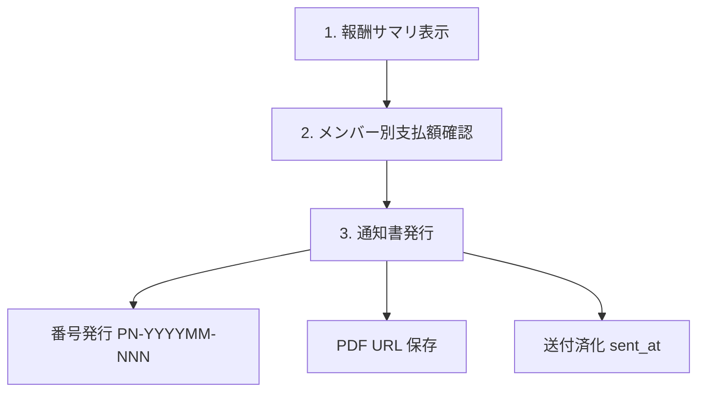
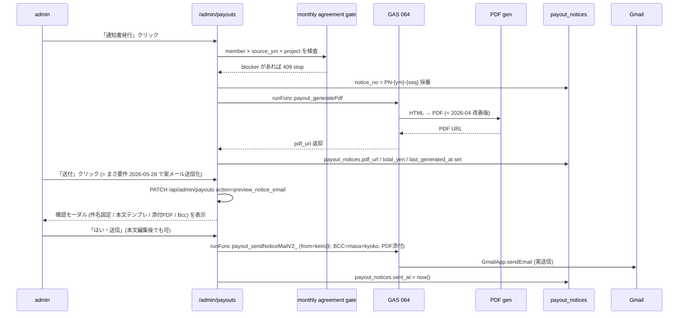

# Admin Payouts / 支払通知書 仕様

`/admin/payouts` 画面の仕様。 AMD から SU 側メンバーへの **月次業務委託費 (= AMD 業務委託フィー) 支払通知書** 発行フロー。 メンバー視点は [2-2 章](2-2-member-workflows-quick-start.md)、 admin 入口は [2-6 章](2-6-admin-ops.md)、 **報酬計算式・進捗ソース・キャップ制御の正本**は [7-1 章 報酬計算ロジック 詳細仕様](7-1-reward-calc-spec.md) を見る。

## 画面 URL

`/admin/payouts?ym=YYYYMM`

`ym` 省略時は現月。 `admin_listPayoutYmCandidates` (GAS) で支払対象月の候補を出して切替できる。

## 支払対象

支払通知書発行は **AMD メンバー → SU 法人** ではなく、 **AMD → AMD メンバー** が原則。 SU 法人がまだ無い PJ (= pre-founding) でも、 業務委託契約に基づき AMD から各メンバーへの月次支払が発生する。

### 対象判定 (= `admin_listPayoutYmCandidates`)

GAS 066 `A066_PayoutPaidRepo.js` の `admin_listPayoutYmCandidates` が、 admin に表示する候補月を返す。 ロジック:

```text
1. members where status='active' AND exclude_from_payout_notice=false
2. 各メンバーの participate PJ (= project_members.is_active=true) × ym で billing_cycles を結合
3. 該当 ym の billing_cycles.reward_summary_json から member_allocations_json[memberId] を抽出
4. 合計額 > 0 のメンバーを表示
```

`exclude_from_payout_notice=true` のメンバー (= 例: りり / ID006 NIMS 無償出向) は通知書発行を skip。月初合意も `not_required` とし、admin の合意一覧・合意保存・修正要望保存の対象から外す。

## 月次サイクル



### 1. 報酬サマリ表示

`billing_cycles.reward_summary_json` を **キャッシュ表示**。 通常 GET は重い再計算を走らせない (= 過去ハマり)。

`reward_summary_json` の構造 (= GAS rv2 計算):

```json
{
  "totalPaidYen": 350000,
  "members": {
    "ID001": { "earnedPt": 100, "basePay": 150000, "bonusPt": 50, "totalPay": 200000 },
    "ID002": { ... }
  },
  "ptUnit": 1500,
  "ptUnitNote": "...",
  ...
}
```

### 報酬キャッシュ再計算

- 自動: `/api/cron/payout-reward-cache-refresh` (= 日次 03:05 JST)
- 手動: `/admin/payouts` の「報酬キャッシュ再計算」ボタン (= UI から `refreshRewards=1` で route 叩く)
- 入力: `billing_cycles` + `value_milestones` + `milestone_monthly_progress` + `milestone_responsibility`
- 出力: `billing_cycles.reward_summary_json` (= 上書き) + `budget_yen` fallback

通常 GET は **読むだけ**。 admin の保存系処理または手動ボタンだけが再計算を走らせる (= まさ #過去 教訓)。

### MSなしPJ 強制報酬確定

MS / PlanCycle が未設定の PJ でも、 `/admin/payouts` の `MSなしPJ 強制報酬確定` から PJ・稼働月・メンバー・支払額を指定して報酬明細に入れられる。

- 保存先: `billing_cycles.reward_summary_json`
- source: `admin_manual_payout`
- 対象 cycle が無ければ `billing_cycles(project_id, ym)` を作成する
- `invoice_ym` は今開いている支払月へ固定する
- `budget_yen` は手入力報酬合計以上にして、通常の `支払データ保存` / `PDF確認` / `支払通知書発行` に合流する
- `payout-reward-cache-refresh` は MS なし / reward members なしの場合、既存の `admin_manual_payout` を消さずに保持する

### 2. メンバー別支払額確認

メンバー行 × PJ 列のマトリクス。 各セルに per-PJ の per-member 支払額。 行末に各メンバーの月次合計、 PJ 列末に各 PJ の月次合計。

### 月初合意ステータスとの境界

`/admin/monthly-work-agreements?ym=YYYYMM` で、支払対象になりうる active member / active project member が当月の遂行内容・予定報酬に合意済みかを確認できる。ここで保存される `member_monthly_work_agreements` は月初計画 snapshot と hash の監査レイヤーで、`/admin/payouts` の報酬計算や支払通知書発行額を直接変更しない。

`frozen` PJ は報酬が発生しないため、月初合意の対象PJから除外する。月初合意の予定報酬は `reward_summary_json.members[].totalPay` ではなく、当月の月次予算を当月予定MS消化ptと担当shareで配分した合意用の予定額。本人から届いた修正要望は `member_monthly_work_agreement_requests` に保存され、admin一覧の「修正要望」件数と各行の最新要望時刻で確認する。

`/admin/payouts` は支払対象の `member × 稼働月 × PJ` ごとに `member_monthly_work_agreements` / `member_monthly_work_agreement_requests` を read し、未合意・条件更新あり・修正要望中のまま支払へ進ませない。これは支払 gate であり、`reward_summary_json` の計算式には混ぜない。

| state | UI表示 | server behavior |
|---|---|---|
| 未合意 | `pending` | `支払データ保存` / PDF生成 / 送付 / 送付済み確定を 409 stop |
| 条件更新あり | `stale` | latest agreed snapshot hash と current hash が違うため stop |
| 修正要望中 | `revision_requested` | open request が member全体または当該PJにあるため stop |
| 対象外 | `not_required` | frozen/lost/active期間外PJ、支払額0、役員/通知対象外は gate 外 |
| admin override | `admin_override` | 理由つきで例外実行し、監査ログを保存 |

admin override は 8 文字以上の理由が必要。server は `member_monthly_work_agreement_payout_overrides` に、action、理由、actor email、支払月、稼働月、member、PJ、blocker status、snapshot hash/current hash、request id を append-only で残す。

契約上は OS 月次合意を毎月の個別発注 / SOW / 条件確認として扱う設計。ただし hard guard の本番運用は、業務委託契約の改定・メンバー同意・法務レビューを前提にする。この manual は運用仕様であり、法的助言として断定しない。

### 3. 通知書発行



### 「送付」ボタンのメール送信仕様 (まさ要件 2026-05-28 確定)

- 送信元: `keiri@team-armada.jp` (Gmail send-as エイリアス必須)
- 件名: `支払通知書のご案内` (固定・編集不可)
- Bcc: `masa@team-armada.jp` , `kyoko@team-armada.jp` (固定)
- 添付: `payout_notices.pdf_url` の Drive fileId から `DriveApp.getFileById().getBlob()` で実 PDF 添付。ファイル名は `支払通知書_{ym}_{memberName}.pdf`
- 本文テンプレ (確認モーダル既定値):
  ```
  {memberName}様
  いつもお世話になっております。
  株式会社チームアルマダです。

  支払通知書を本メールにてお送りいたします。
  内容をご確認のうえ、修正やご不明点がございましたら下記期日までにご連絡ください。

  --------
  【内容確認・修正の締切】
  YYYY年MM月DD日 17:00まで
  --------
  ```
  - `{memberName}` = `members.member_name` (本名、code_name ではない)
  - 修正期日 = 支払日(= ym 末日) - 3日。土日祝もそのまま (= まさ確認済 2026-05-28)
- 「本文修正」ボタンで textarea 編集可。送信前に「編集を確定」で表示モードに戻すと「はい・送信」が押せる
- 送信成功で `payout_notices.sent_at = now()` を即時 set
- 「送付取消」(再表示時) は sent_at = null に戻す**だけ**で、既に送信したメールを取り消すわけではない (= 履歴フラグ用)
- 既に sent_at が立っている状態でも「送付」モーダルを開けるが、警告バナー表示し再送扱い (sent_at 上書き)
- 実装: `pwa/src/app/api/admin/payouts/route.ts` の `action=preview_notice_email` / `action=send_notice_email` + `gas/065_PayoutMailer.js` `payout_sendNoticeMailV2_`

### `payout_notices` 列

| column | 用途 |
|---|---|
| `member_id` / `ym` | composite PK |
| `sent_at` | 送付済化時刻 (= NULL なら未送付) |
| `notice_no` | `PN-YYYYMM-NNN` (= 月内 seq)。preview PDF は `PREVIEW-YYYYMM-{memberId}` |
| `pdf_url` | Drive / Storage PDF URL |
| `total_yen` | 当月支払総額 (= 内訳ではなく集計値、税抜)。支払通知書PDFではこの金額に消費税10%を上乗せして `合計（税込）` を表示する |
| `last_generated_at` | 最終 PDF 生成時刻。cron prebuild / 一括発行 / 個別発行で更新 (= 差分検出 + UI 表示用) |

### `payout_agreement` 列

| column | 用途 |
|---|---|
| `project_id` / `member_id` | composite UNIQUE |
| `agreed_at` | 同意時刻 |
| `token` | 同意リンク用 token |

PJ × メンバー単位の業務委託契約同意ステータス。 初回支払前に SU 側メンバーが同意したかを記録する。

### `monthly_reward_payout` 列 (= 実支払ログ)

| column | 用途 |
|---|---|
| `project_id` / `ym` / `member_id` | composite UNIQUE |
| `earned_pt` | 獲得ポイント |
| `base_pay` | base 給 |
| `bonus_pt` | bonus pt |
| `total_pay` | 合計支払額 (= 税抜)。支払通知書PDFではこの金額を小計として扱い、消費税10%を上乗せする |

GAS rv2 の最終計算結果を per-PJ × per-ym × per-member で保存する snapshot。 `billing_cycles.reward_summary_json.members[memberId]` の正規化版。

## 支払通知書 PDF (= 2026-04 改善版が正本)

`gas-main/064_PayoutFreeeNotice.js` が PDF 生成正本。`/admin/payouts` の支払額は税抜なので、PDF生成時に消費税10%を上乗せし、サマリの「お支払金額」と右下の「合計（税込）」は税込額を出す。 フォーマット:

| 要素 | 内容 |
|---|---|
| ヘッダー | 公式ロゴ画像 (= `PAYOUT_LOGO_FILE_ID`) + `PAYOUT_LOGOTYPE_FILE_ID` |
| 背景 | 白地、 青アクセント |
| 宛先 | `members.contractor_name` (= 未設定時は `member_name` / `code_name`) + `members.member_address` + `members.invoice_registration_number` |
| 明細表 | 青ヘッダで、 PJ 別の base_pay / bonus / total |
| 税内訳 | `小計（税抜）` = admin/payouts の支払額、`消費税（10%）` = 税抜額 × 10%、`合計（税込）` = 小計 + 消費税 |
| 支払予定 / 方法 / 振込先 | `members.bank_info` を出力 |
| 右上情報 | 通知書番号 / 作成日 (= 2026-05-28 まさ要望で「支払通知日」表記を「作成日」に変更、`gas/064_PayoutFreeeNotice.js` line 312) |

税計算の検算例:

```text
admin/payouts 支払額 (= 税抜) 731,740円
消費税 10%                   73,174円
お支払金額 / 合計(税込)      804,914円
```

`731,740円(税込)` / `小計 665,218円` のように出る場合は、GAS本番 Web App deployment が古く、税込総額から税抜へ割り戻す旧ロジックが動いている可能性が高い。`clasp push` だけで止めず、`gas/CLAUDE.md` の本番 deployment ID を `clasp deploy --deploymentId ...` で更新してから `force: true` で再生成する。

### 旧フォーマット禁止 anchor

以下の旧 anchor は復活禁止 (= `npm run test:critical-ui` で検知):

- `setValue("team ARMADA")`
- `brandCell`
- 旧 `支払通知書番号` レイアウト

### 確認用 PDF

`/admin/payouts` の「PDF 確認」ボタンは、 確定前でも PDF 生成可能。 確認用 PDF は **`payout_notices` に保存しない** (= 番号採番もしない)。 まさが「これでよさそう」と見た上で「通知書発行」を押す。

### 先回り生成 (= 2026-05-27 追加, まさ #バルクPDF 確定)

メンバー 1 人ずつ「PDF 確認」「支払通知書発行」を押して GAS の PDF 生成完了を待つのが遅いので、 **裏で先回り生成** する仕組みが入っている。

#### 自動: cron `payout-notice-prebuild`

- vercel cron で **毎日 02:00 JST (= `0 17 * * *` UTC)** に起動
- 対象: 当月 + 翌月の 2 支払 ym
- 各 ym で、 `exclude_from_payout_notice=false` かつ `is_officer=false` で支払額 > 0 のメンバー全員を対象に並列生成 (= concurrency 3)
- 月初合意支払 gate に blocker があるメンバーは PDF 生成せず、`agreement_gate` failure として結果に出す
- **差分検出**: 既に `payout_notices.pdf_url` があり、 かつ `total_yen` が一致しているメンバーは **スキップ** (= GAS を叩かない)
- 差分があるメンバーのみ GAS に投げて、 `pdf_url` / `notice_no` / `total_yen` / `last_generated_at` を更新
- 朝、 まさが `/admin/payouts` を開いた時点でほとんどのメンバーの PDF が既に存在する状態にする

手動で叩く時:

```bash
curl -X POST "https://amd-os-pwa.vercel.app/api/cron/payout-notice-prebuild" \
  -H "Authorization: Bearer $CRON_SECRET" \
  -H "Content-Type: application/json" \
  -d '{ "ym": "202605", "force": false }'
```

`force: true` で差分検出を無視して全員強制再生成。`lookahead: N` で当月+N ヶ月先まで対象を広げる (デフォルト 1)。

#### 手動: `/admin/payouts` の「全員分PDF一括発行」「全員分PDF確認」

ヘッダのボタンから即時で全員分を並列生成。

- 「全員分PDF一括発行」: `bulk_issue_notice_pdf` action。 差分検出あり、 本番 notice_no で `payout_notices` に保存。 **支払データ保存済の場合だけ active** になる
- 「全員分PDF確認」: `bulk_preview_notice_pdf` action。 確認用 (= `notice_no` は `PREVIEW-...` 固定で DB 保存しない)。 保存前でも押せる
- 「強制再発行 (全員)」 (= 黄色ボタン、2026-05-28 追加): `bulk_issue_notice_pdf` action を **`force: true`** で叩く。 差分検出を無視して全員分を強制再生成する。 PDF フォーマット変更 (= 表記ラベル / レイアウト) を反映したい時に使う (= 金額が変わってないと差分検出でスキップされてラベル変更が反映されない問題への対処)。 確認ダイアログあり

レスポンスには `{ targetCount, generated, skipped, failed, results[] }` が入る。 失敗があったメンバーは UI 上部の赤い帯に最大 8 件表示される。

#### 差分検出のロジック (= `shouldRegenerateNotice`)

| 状況 | 再生成する？ |
|---|---|
| `previewOnly=true` | はい (= preview は毎回新規生成、 DB保存なし) |
| `force=true` | はい |
| 既存行なし | はい |
| `pdf_url` が NULL / 空 | はい |
| `notice_no` が `PREVIEW-...` | はい (= 仮 PDF を本番化) |
| `total_yen` が一致しない | はい (= 金額が変わった) |
| 上記すべて該当なし | **いいえ** (= スキップして既存 `pdf_url` を再利用) |

#### `saveAll` (= 「支払データ保存」) との連携

`saveAll` 内で、 既存 `payout_notices.total_yen` と新計算値を比較し、 **金額が変わったメンバーは `pdf_url` / `last_generated_at` を NULL クリア**する (`sent_at` が立っている行は触らない)。 これで次回 cron / 一括発行で差分検出が再生成を発火させる仕組み。

`saveAll` の DB write 前にも月初合意支払 gate を通す。blocker がある場合、`monthly_reward_payout` / `payout_notices` へ保存しない。admin override reason がある場合だけ、監査ログ保存後に例外実行する。

#### UI

`NoticeBadge` 内に最終生成時刻を相対表示 (= 「生成 3分前」「生成 15時間前」)。 まさが朝開いた時に「最新の PDF か古いキャッシュか」を即判別できる。

### golden test

`pwa/scripts/__fixtures__/payout_notice_golden.png` + SHA256 が回帰防止用 golden。 PDF レイアウト変更時は同 commit で golden を更新する。

## ScriptProperties

GAS 064 が読む:

| key | 用途 |
|---|---|
| `PAYOUT_LOGO_FILE_ID` | ロゴ画像 (= Drive file id) |
| `PAYOUT_LOGOTYPE_FILE_ID` | ロゴタイプ画像 (= Drive file id) |
| `PAYOUT_NOTICE_FOLDER_ID` | PDF 保存先 Drive folder |
| `PAYOUT_NOTICE_TEMPLATE_ID` | Doc テンプレ id |

詳細は `gas/CLAUDE.md` の ScriptProperties section。

## 支払月判定 (= 「いつの ym を払うか」)

`/admin/payouts?ym=YYYYMM` の `ym` は **支払 ym**。 「YYYYMM 月の業務に対する支払」を意味する。 実際の振込日は `members.bank_info` に書いた支払サイクル (= 末締め翌月末払い 等) で決まる。

- `billing_cycles.ym` も同じ意味で **業務 ym** を指す
- 「3 月分の支払を 4 月末に振り込む」場合、 `ym='202603'` の `billing_cycles` を見て、 `payout_notices.ym='202603'` で発行、 振込実行日は別管理

## 会社留保 / 契約バッファの扱い

`/admin/payouts` の支払通知書対象は、非役員かつ `exclude_from_payout_notice=false` のメンバーだけ。`members.is_officer=true` のメンバーは支払通知書から外すが、当月稼働分は `reward_summary_json.members[].companyReserveYen` / `officerReserveYen` として AMD の内部留保に残す。

先12か月の PJ 収支表では、`billing_cycles.budget_buffer_amount` を「契約バッファ」、役員の `companyReserveYen` を「役員分」として表示する。最終収支では役員分は同額を `officerOffsetYen` で戻すため、外部流出ではなく会社残高に残る計画値として扱う。非役員メンバーの `stockYen` は従来どおり翌月以降の支払予定に繰り越す。

月初合意 gate の PJ 対象判定は、`projects.status='frozen'` だけでなく `projects.freeze_from_ym <= source_ym` も not_required にする。CTB p06 のように `status='active'` のまま freeze overlay で止まっている PJ を支払 gate に戻さないため。

## ZMP 追加開発 cap 外支払 (= 例外運用)

ZMP の通常固定費は 300,000 円 × 65% = 195,000 円が cap。 OkuDoor 追加開発などで追加受託分を支払うときの運用:

1. `/admin/projects` の「PJ 予算確定・調整」で `cap外追加支払枠` に合意額を入れる
2. `billing_cycles.budget_yen = 通常 cap + 追加枠` で書き換え
3. 報酬キャッシュ再計算 → `reward_summary_json` 更新
4. `/admin/payouts` で当月分発行

## 「通常 GET は読むだけ」原則 (= 過去ハマり防止)

- GET `/admin/payouts?ym=YYYYMM` は `syncRewardSummariesForBillingCycles` (= 重い再計算) を暗黙実行しない
- 「報酬キャッシュ再計算」ボタンまたは保存系処理 (= 通知書発行 / 送付済化) だけが `refreshRewards=1` で再計算を走らせる
- 過去事故: GET でも自動再計算してたら、 admin が画面開いただけで全月 reward が再計算され、 値が変わった (= 既に承認済の月の数字がズレる UX 問題)

## トラブル時

| 症状 | 確認場所 |
|---|---|
| 支払額が出ない | `billing_cycles.reward_summary_json` の該当 ym 行、 cron `payout-reward-cache-refresh` 実行履歴 |
| メンバーが行に出ない | `members.status='active'`、 `exclude_from_payout_notice=false`、 `project_members.is_active=true` |
| PDF 確認で宛名 / 住所 / 振込先が空 | `members.contractor_name` / `member_address` / `bank_info` 入力 |
| 通知書発行で notice_no 重複 | `payout_notices` 既存行 (= UNIQUE PK は `(member_id, ym)`)、 再発行は既存行を update |
| GAS Payout 権限エラー | `gas-main/A066_PayoutPaidRepo.js` の OAuth 再認可、 [`pwa/design/invoice_url_payout_auth.md`](../design/invoice_url_payout_auth.md) |
| 旧フォーマット復活 | `npm run test:critical-ui` で `brandCell` / `setValue("team ARMADA")` を検出、 golden png 比較 |
| PDFだけ税計算が古い | PWA側の金額ではなく GAS Web App deployment が古い可能性。`npx --yes @google/clasp@latest deployments` で本番 ID の version を確認し、`clasp deploy --deploymentId AKfycbwzA_sBg4iXhQH1dQjMKvgpeBShFcJ9_XmNdW0O0lptbCcTlApkJy7xArdAh4R7zl3G --description ...` 後に `payout-notice-prebuild` を `force:true` で再実行 |

## 関連

- 2-6 章 [admin オペ](2-6-admin-ops.md) (= 月次ルーティン早見表)
- 6-3 章 [Invoice / Billing Routine](6-3-invoice-and-billing-routine-spec.md) (= 反対側、 SU から AMD への請求書)
- 6-6 章 [Member Ops / Billing / Prompt](6-6-member-billing-prompts-spec.md) (= 報酬計算正本)
- 6-2 章 [Admin Projects / Members 台帳](6-2-admin-projects-members-ledger-spec.md) (= PJ / メンバー台帳)
- 設計: [`pwa/design/FEATURE_REGISTRY.md`](../design/FEATURE_REGISTRY.md) (= 消してはいけない業務導線)
- 設計: [`pwa/design/invoice_url_payout_auth.md`](../design/invoice_url_payout_auth.md) (= signed URL + Payout OAuth)
- [7-1 章 報酬計算ロジック 詳細仕様](7-1-reward-calc-spec.md) (= 計算式・進捗ソース優先度・キャップ・繰越正本)
- 報酬計算実装: `gas-main/059_RewardV2_Ops.js`
- PDF 生成正本: `gas-main/064_PayoutFreeeNotice.js`
