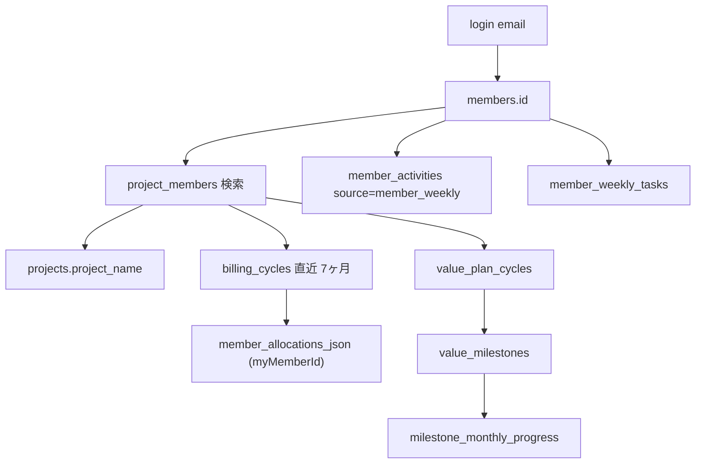
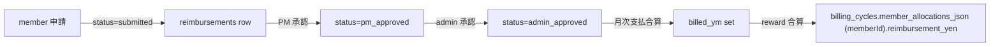

# Member Ops / 請求書発行 / Prompt 仕様

メンバーが直接触る `/mypage` / `/reimburse` と、 admin が運用する `/admin/invoices` / `/admin/prompts` の開発者向け仕様。 メンバー視点の使い方早見表は [2-2 章](2-2-member-workflows-quick-start.md) を見る。

## /mypage

`/mypage` は **ログインユーザー個人画面**。 自分が関わる全 PJ の業務と報酬を集約する。

### データフロー

### 表示要素と source

| 要素 | source | 備考 |
|---|---|---|
| 当月 PJ 別報酬額 | `billing_cycles.member_allocations_json[memberId]` | 正本。 PWA は再計算しない |
| 月初合意カード | `/api/monthly-work-agreement` | `member_monthly_work_agreements` と当月 snapshot hash。API失敗時も `/mypage` 主表示はブロックしない |
| MS 進捗バー | `milestone_monthly_progress` | 累積 % + 当月増分 |
| 来週やること | `member_weekly_tasks` | 本人が追加する来週の手動タスク。チェックボックスで完了管理 |
| 今週やったこと | `member_weekly_tasks` + `member_activities (source='member_weekly')` | 上段は手動タスク、下段は月-日 JST の自動抽出活動 |
| 前週・前々週 | 同上 | 初期状態で閉じたトグル。未完了も元週に残す |
| 月別合計 | 過去 6 ヶ月分 × 当月、 chevron でトグル | |

### 週次タスクの状態・繰越

`member_weekly_tasks` は本人の手動タスクだけを持つ。自動抽出の `member_activities` を完了扱いにしたり書き換えたりしない。本人は「来週やること」に追加し、来週が今週になった後はチェックボックスで完了/未完了を切り替える。

週が月曜（JST）へ切り替わった最初の本人表示時、直前週の未完了だけを今週にコピーする。コピー元の行は元週に `未完了` として残り、同じ元行を同じ週へ二度コピーしない。完了済みは繰り越さない。本人以外の閲覧はread-onlyで、adminにも他人のタスクを操作させない。

### 報酬計算正本 (= GAS rv2_calcRewardSummary)

PWA 側で `member_allocations_json` を再計算しない。 正本ロジック:

- `gas-main/059_RewardV2_Ops.js` `rv2_calcRewardSummary`
- 入力: `value_milestones` (= MS × points × tag) + `milestone_monthly_progress` + `milestone_responsibility` (= per-MS のメンバーシェア)
- 出力: `billing_cycles.reward_summary_json` + `member_allocations_json`
- 再計算は `/api/cron/payout-reward-cache-refresh` (= 日次 03:05 JST) または手動 `Run Now` (= 6-1 章)

**計算式・進捗ソース優先度・月次キャップ・繰越の詳細**は [7-1 章 報酬計算ロジック 詳細仕様](7-1-reward-calc-spec.md) に集約。 この章は `/mypage` の表示側、 計算正本は 7-1 章を見る。

### 月初タスク・報酬合意

| item | contract |
|---|---|
| 本人画面 | `/monthly-agreement?ym=YYYYMM` |
| mypage導線 | 当月報酬合計カード直下 |
| 保存先 | `member_monthly_work_agreements` |
| 修正要望 | `member_monthly_work_agreement_requests` |
| admin確認 | `/admin/monthly-work-agreements?ym=YYYYMM`。対象月はプルダウンから選ぶ。2026年6月以前は導入前・移行月のため、月初合意は不要で未合意による支払い停止もしない。 |
| hash差分 | 前回 `snapshot_hash` と現在 snapshot hash が違えば `条件更新あり` |
| 変更点表示 | `条件更新あり` 時、ステータスバナー直後・`01`/`02` 必須確認の手前に「今回の変更点」を表示。前回合意時の `snapshot_json` (v2形式) と現在snapshotを、hash対象の全フィールド (member/totals/project/milestone/支払予定) にわたってPJ単位で純粋関数比較し、件数＋PJごとの「前回 → 今回」を示す。PJ名・値は省略せず全文折り返し (モバイル優先)。前回記録が無い/旧形式なら比較不可の理由メッセージのみ。生JSON・生hashは出さない |
| 予定額変更理由 | `projects[].expectedRewardYen` が変わったPJは、管理者がメンバーに伝える理由を8文字以上で入力する。理由は `ym × member × PJ × 現在snapshot hash` に紐付き、前回/今回の金額より先に表示する。理由がない間は「変更理由を確認中」として修正要望は送れるが合意はできない。理由は自動推測しない |

合意は「当月の担当内容と予定額を確認した」監査 snapshot。本人が必ず確認するのは「PJごとの担当内容」と「その対価としての予定額」の2点。月次の到達目標は現在の snapshot に無いため、MS名を到達目標として表示しない。未合意または条件更新ありのままでは、その稼働月の支払いに進めない。`reward_summary_json`、`member_allocations_json`、MS進捗、担当shareを読むだけで、報酬計算を再実行したり値を書き換えたりしない。

月初合意画面は cap、carry-over、条件/前提、未確定・要確認などの精算/確認内部情報を出さない。本人には「どのPJのどのMSを担当するか」「その対価としての想定報酬」を示す。月次の到達目標は定義していないため、MS名を目標として表示しない。MS別予定報酬は月初合意用の月次予算配分で算出し、PJ別想定報酬と合計が合うよう丸め差分を吸収する。`status='frozen'` / `freeze_from_ym <= ym` / active `project_freeze_periods` の PJ と、当月報酬も担当MSもないPJは対象外。`members.exclude_from_payout_notice=true` かつ `is_admin=false` のメンバー (= りり / ID006 NIMS 無償出向、あき / ID029 無報酬稼働) は月初合意も対象外。`is_admin=true` のメンバーは、テスト確認のため支払通知対象外でも月初合意対象に含める。報酬キャッシュがあるPJで担当MSにbreakdown行がない場合は、未確定ではなく `0円` と表示する。`reward_summary_json.members[].stockYen > 0` の場合だけ、支払予定とは分けて翌月以降へ繰り越される残額として `今月末未払い残（今月は支払われない）` を read-only 表示する。`今月支払` は PJ のメンバー支払条件から計算し、請求書発行月である `billing_cycles.invoice_ym` では上書きしない。`未払いがどう残るか` は、1か月を縦に複数行カードとして積まず、左に項目、右に稼働月列を広げる横長マトリクスで表示する。

当月の本人合意が未完了または条件更新ありで、表示対象PJがある場合、OS内の他画面を開くと、開いた画面を背景に残したまま月初合意モーダルを前面に表示する。この判定は画面表示後にAPIで取得する方式 (v3.44.8) になっており、判定結果や表示条件は変わらない。モーダルは、ヘッダー→横幅いっぱいの `合意状態：未合意 / 条件更新あり / 合意済み / 対象外` と理由→全幅の `01 担当する仕事`→全幅の `02 その対価としての予定額`→`確認して合意`→初期状態で閉じた `参考情報` の順にする。状態値だけの `未確認` や、何の確認か分からない `確認不要` は使わない。`01` は全PJの担当内容、`02` は予定額合計を先に強調して同じPJ順の内訳を表示する。必須確認領域の番号・見出し・本文を補足ラベルより強くし、12px未満の文字は使わない。月次の到達目標は snapshot に無いため表示しない。`確認して合意` は2セクションを読んだ後に置き、`内容が違う場合は修正要望` はその次の副操作として必要なときだけ開く。支払い状況・予定額の根拠・snapshot IDなどは `参考情報` の中へまとめ、担当内容を下段のPJカードで重ねて表示しない。背景クリックで表示だけ一時的に閉じられるが、合意状態は保存されないため、未合意のままダッシュボードなどを開き直すと再表示される。合意完了後は、次回からこの確認モーダルを出さずにマイページ、PJコックピット、admin画面などへ入れる。

表示内容に違和感がある場合、本人は「修正要望」から対象PJ、要望種別、本文を送る。要望は送信時点の snapshot hash と一緒に保存され、admin/PM側の確認キューとして扱う。

### OS 上の月次確認 TODO

| メンバーのロール (project_members) | 表示される TODO |
|---|---|
| `is_pm=true` の PJ | TODO 出さない |
| `is_pl=true AND is_pm=false` | TODO 出さない |
| `is_pm=false AND is_pl=false` | TODO 出さない |

OS 上では PM/PL/参加メンバーのいずれにも月次確認 TODO を出さない。報告書確認の軽い連絡は Slack 側で完結させ、OS の nudge / TODO / action queue へ同期しない。`請求額確定` は、全請求対象PJで契約書由来の金額が読み込まれ、対象月の報酬額が `billing_cycles.reward_summary_json` で見えていることを前提に、契約台帳/報酬キャッシュのデータ整備として扱う。契約未適用・報酬キャッシュ未作成が見つかった場合も、通常の PM 月次タスクへ戻さない。立替確認と請求書発行/送付もPM月次nudgeには出さず、請求書発行/送付はadmin業務に寄せる。

### 支払対象外メンバー特例

`members.exclude_from_payout_notice=true` かつ `members.is_officer=false` のメンバー (= 例: りり / ID006 NIMS 無償出向、あき / ID029 無報酬稼働) は `/mypage` / `/dashboard` 埋め込みの **報酬額表示が `ー`**。reward 計算キャッシュ自体は他メンバー集計の整合のため残すが、支払通知書・月初合意・支払 gate では `not_required` にする。

支払通知書発行対象から除外するかどうかの唯一の根拠は `members.exclude_from_payout_notice=true` であり、`is_officer` は使わない (2026-07-29 まさ確定: あき/ID029・りり/ID006 は非役員だが支払対象外、既存役員は `exclude_from_payout_notice=true` で揃っている)。`exclude_from_payout_notice=true` のメンバーは 65% PJ 予算内の cap 按分には参加させたうえで、割当済み額を現金支払ではなく内部配賦 (`companyReserveYen` / `officerReserveYen`、UI表示は「対象外配賦」) として残す。`is_officer=true` かつ `exclude_from_payout_notice=true` の場合、`/mypage` は金額を隠さず表示し、`（支払対象外）` を添える。

### 月次集計の前提 ym レンジ

- `billing_cycles` / `member_activities` は **過去 6 ヶ月 + 当月 = 7 ヶ月**
- `milestone_monthly_progress` は **当月 + 前月** だけでなく **前月以前 1 ヶ月余分** (= 当月増分計算のため前月終端値が必要)

### admin 閲覧モード

admin (`members.is_admin=true`) は `/mypage?memberId=<member_id>` で他メンバーのページを見られる。 `member_id` は `ID001` のような `members.member_id` をそのまま使い、 `001` のように `ID` prefix を削らない。 メンバーコードネームを文中に出すときは共通 UI `LinkedMemberText` で `/mypage?memberId=` リンクにする。 `/admin/members` の codeName セルも同じURLへのリンクにする。

## /reimburse

メンバーが立替費用を申請する画面。

### 入力 → 承認フロー

### `reimbursements` 列 (= 正本)

| 列 | 用途 |
|---|---|
| `reimbursement_id` | text PK (= `RB-YYYYMMDD-NNN` 形式) |
| `project_id` / `project_name` | PJ 紐付け (= `p00` = AMD 全体) |
| `date` | 領収書日付 (= 申請月でなく実支出日) |
| `category` | 交通費 / 会議費 / 書籍 / 接待 / その他 |
| `amount` / `tax_rate` | 税込金額と税率 |
| `description` | 用途記述 |
| `transport_mode` / `transport_from` / `transport_to` / `transport_trip` | 交通費の場合 |
| `receipt_storage_paths` / `receipt_file_names` | Supabase Storage path 配列 (= 領収書 PDF/PNG/JPEG) |
| `status` | `submitted` → `pm_approved` → `admin_approved` |
| `created_by` / `pm_approved_by` / `pm_approved_at` / `admin_approved_by` / `admin_approved_at` | アクター記録 |
| `billed_ym` | 月次支払に乗った ym (= NULL なら未払) |

### 添付ファイル

`receipt_storage_paths` は Supabase Storage の path 配列 (= `reimbursements/{reimbursement_id}/{filename}`)。 file の Storage bucket は `reimbursements` (= 非公開、 admin 経由でのみ DL)。 file 名は `receipt_file_names[i]` に対応 index で保持。

### 承認 API

| API | 役割 |
|---|---|
| `POST /api/reimburse` | 申請。 status=submitted で insert |
| `POST /api/reimburse/{id}/pm-approve` | PM 承認 |
| `POST /api/reimburse/{id}/admin-approve` | admin 承認 |
| `POST /api/reimburse/{id}/reject` | 却下 (= status='rejected') |

PM 承認は `project_members.is_pm=true AND project_id=reimbursement.project_id` のメンバーのみ。 admin 承認は `members.is_admin=true` のみ。

### admin 承認済み台帳

`members.is_admin=true` で開いたときだけ、既存の「承認待ち」「自分の申請」に加えて「承認済み」台帳が常設表示される (`/reimburse` 単体、`/admin/kiyo?task=reimbursements` 埋め込みの両方)。書込みAPI・権限条件は変更せず、既存 fetch (`reimbursements` を最大400件、date降順) の結果をクライアント側でフィルタするだけの表示。同じ画面内の申請・編集・PM承認・admin承認の既存操作はそのまま使える (= 書込み経路を増やさない表示台帳)。

- 対象: `status IN ('approved', 'paid')`（現行実装の正本 status は `approved`。`paid` は将来互換のため含めるだけで、新規に発生させない）
- 並び: `admin_approved_at` 降順、欠測時は `date` で安定sort
- 表示列: 発生日 / PJ / 摘要 / 申請者 / 費目 / 金額 / PM承認者+承認日 / admin承認者+承認日 / 領収書リンク
- 見出しに件数と合計金額 (`¥`, 3桁区切り) を出す
- 高密度table (border-only、丸角・影なし)。PCは列が揃うcompact table、mobileは横スクロールで同じtableを見る

## /admin/invoices

admin/きよが締め済み稼働月の請求書発行を処理する画面 (= `pwa/src/app/(app)/admin/invoices/page.tsx`)。旧 `/admin/billing` は廃止済みで、この画面へ自動遷移する。

### 表示構造 (2026-08-12 二列レイアウトへ再設計)

- レイアウト: 左列＝請求先PJ一覧（PJごとの未完了件数バッジ、`AdminInvoiceIssueQueue` 内で group化）。右列＝選択PJの作業面。デスクトップは document 全体をスクロールさせず、左右それぞれの内部領域でスクロールする。モバイルは縦積みに再配置
- 右列の構成（上から）: ①契約条件パネル（`projects.contract_terms_json.currentContracts[].terms.cockpitSummary` の請求/支払タイミング・業務範囲・成果物・立替精算・実施体制。無ければ契約種別+月額 fallback）、②13か月請求台帳（稼働月/請求月/請求額/状態/発行条件の一覧、行クリックで③を切替）、③選択月の内訳ワークベンチ
- 対象: 直近 13 ヶ月の締め済み稼働月 (= 現月は含めず前月まで) の `billing_cycles`
- 行: `projects.status IN ('active','ended','frozen')` のPJ×13か月を生成してcycleをleft joinする。期間外・freeze後は除外し、cycle欠損は `月次台帳未生成`、金額欠損は `請求額なし` blockerとして表示する
- 金額表示: 台帳は「基本額/承認済立替/請求候補」、ワークベンチはさらに「未承認参考」を表示する。請求候補は基本額+承認済立替。`budget_yen` は使わない
- 立替一覧と承認: 選択月の全ステータスを一覧表示する。担当PMまたはadminには申請中のPM承認、adminにはPM承認済みのadmin承認を出す。`/api/reimbursements/decision` と共有サーバー処理が権限と遷移元statusを再検査する
- blocker明示: `freee取引先未設定` / `請求額なし` / `立替未承認 N件` / `月報未確定`。未承認は月報状態に関係なく必ず発行を止める
- 主操作: 状態が `発行待ち` の月で「発行」から `AdminInvoiceIssueDialog`（既存コンポーネントを流用、新規作成しない）を開き、明細確認 → freee 発行
- 発行モーダル: iOS `InvoiceStepView` と同じく、件名、基本明細行、契約月額との差分確認、前月明細引き継ぎ、承認済み立替の読み取り専用明細、調整行、請求日、支払期日、備考、発行済み情報、発行取消を扱う。件名・ヘッダー・freee fallback には `client_name` を使い、AMD内部の `project_name` / `project_id` を出さない。単純な件名/日付/全行だけのモーダルにはしない
- 請求額: `invoice_base_lines_json` の明細合計を最優先し、なければ `contract-money.ts` の `contractBackedClientAmount`（確定請求額 > 契約スケジュール金額 > 月額固定契約の `projects.fee_amount`）へ fallback する。`budget_yen` は AMD 側の原資/報酬予算なので請求額判定には使わない

### 状態分類

| 分類 | 判定 |
|---|---|
| 発行待ち | `invoice_issued_at` が空、freee取引先あり、請求額あり、必要な報告FIX済み、立替締め済み |
| 要確認 | 発行前の金額 / 対外報告 / 立替のどれかが未完 |
| 設定不足 | freee取引先未設定など、OS設定が足りず発行できない |
| 過去滞留 | 請求月 (`invoice_ym || ym`) が対象月より古い未発行行。今月発行分とは分けて確認する |
| 発行済み | `invoice_issued_at` あり、`invoice_sent_at` なし |
| 送付済み | `invoice_sent_at` あり、`payment_confirmed_at` なし |
| 入金済み | `payment_confirmed_at` あり |

### 立替確認 (2026-08-12 更新)

選択月の内訳ワークベンチが `reimbursements`（`billed_ym` 優先、無ければ `date`）を全ステータスで表示する。`submitted`/`pmApproved` が1件でも残れば発行不可。発行モーダルと`issue-invoice`も同じ月判定で `approved/paid` だけを明細へ載せる。`claim_invoice_issue` がbilling cycle行をlockしてblocker確認+claimを1トランザクションで行い、並行発行と発行済み再実行を拒否する。authenticated RLSは本人のsubmitted申請・編集・削除だけを許可し、承認遷移は認証済みサーバー境界だけを通す。

## /admin/prompts

LLM プロンプトと、 つくよみの context (= スプシ由来の旧 system prompt) を一画面で管理する admin 画面 (= `pwa/src/app/(app)/admin/prompts/page.tsx`)。

### 設計原則 (= AGENTS.common.md の絶対ルール)

**プロンプトはコードに書かず DB で管理する**。 コード側の hardcoded prompt は fallback としてのみ存在、 DB に `is_active=TRUE` の row があればそちらが優先される。

### 二段構成

| ブロック | source | 役割 |
|---|---|---|
| LLM プロンプト | `llm_prompts` | PWA 側 LLM 機能 (= L2 抽出 / narrative / scoring 等) の prompt 本体 |
| 旧つくよみ context | `tsukuyomi_context` (= `status='active'` のみ表示) | GAS R172 がスプシから同期してきた旧 system prompt 群 |

### `llm_prompts` 列

| 列 | 用途 |
|---|---|
| `prompt_key` | LLM 機能識別子 (= `meeting_summary.extract` / `member_activities.extract` 等) |
| `description` | 1 行説明 |
| `body` | prompt 本文 (= Markdown、 placeholder 含む) |
| `model` | optional override (= 空なら呼び出し側 default) |
| `max_tokens` | optional override |
| `is_active` | true なら DB body を使う、 false ならコード fallback を使う |
| `notes` | 編集メモ |
| `updated_by` / `updated_at` | 監査 |

### `tsukuyomi_context` 列

| 列 | 用途 |
|---|---|
| `context_id` | text PK (= `ctx_xxx` 形式) |
| `tags` | 適用 scope (= `meeting`, `monthly_report` 等の csv) |
| `priority` | 注入順序 (= 小さい数字が先) |
| `system_prompt` | system prompt 本文 |
| `status` | `active` / `archived` |

つくよみ呼び出し側は `tags` をフィルタしながら `priority` 順に system_prompt を連結し、 LLM に system role として渡す ([8-1 章](8-1-knowledge-admin-tsukuyomi-spec.md))。

### 編集フロー

1. admin が `body` を編集 → `POST /api/admin/prompts/{id}` (= `members.is_admin=true` のみ)
2. `is_active` を true にすると次の LLM 呼び出しから反映
3. fallback に戻したいときは `is_active=false` (= code-side hardcoded prompt が使われる)
4. 監査: `updated_by` + `updated_at` が自動で記録

### よくある prompt_key (= 2026-05-26)

| prompt_key | 利用元 |
|---|---|
| `meeting_summary.extract` | H-1 MTG サマリ抽出 (= Windows MMO Codex Desktop automation + PWA event route) |
| `member_activities.extract` | D-1 先手力判定の `initiative_origin` 抽出 |
| `project_knowledge.extract` | D-3 PJ ナレッジ抽出 |
| `member_knowledge.extract` | D-4 メンバーナレッジ抽出 |
| `protocol.extract` | D-1 AMD Protocol 抽出 |
| `xrl_evidence.extract` | M-2 XRL 根拠抽出 |
| `strategy_signal.extract` | D-6 経営ハイライト抽出 |
| `monthly_report.narrate` | 月次報告書 narrative_md 生成 |
| `dialogue_meeting.narrate` | まさえいMTG 議事録の narrative 化 |

prompt_key 一覧の正本は DB の `llm_prompts` 自身。 コード側 fallback は `pwa/src/lib/llm-prompts/*.ts` に分散。

## トラブル時

| 症状 | 確認場所 |
|---|---|
| `/mypage` の報酬額が出ない | `billing_cycles.member_allocations_json` の該当 ym 行、 `payout-reward-cache-refresh` 実行履歴 |
| 立替が `/mypage` に出るが支払に乗らない | `reimbursements.status` / `billed_ym` |
| `/admin/invoices` で PJ 行が出ない | `projects.status IN ('active','ended','frozen')` の絞り条件、 `ended` の `end_ym` |
| 修正した prompt が反映されない | `llm_prompts.is_active=true` か、 呼び出し側のキャッシュ層 (= 該当 cron 再実行) |
| つくよみが「古い prompt 使ってる」と感じる | `tsukuyomi_context.status='active'` の row、 `priority` 順を確認 |

## 関連

- 2-2 章 [メンバーの日常ワークフロー](2-2-member-workflows-quick-start.md) (= 使い方早見表)
- 6-5 章 [Admin Payouts / 支払通知書](6-5-admin-payouts-reward-notice-spec.md) (= 報酬 → 支払通知書)
- 7-1 章 [報酬計算ロジック 詳細仕様](7-1-reward-calc-spec.md) (= 計算式・進捗ソース・キャップ正本)
- 6-3 章 [請求書発行 / 月次サイクル](6-3-invoice-and-billing-routine-spec.md) (= billing_cycles 全体)
- 8-1 章 [Knowledge Admin / Tsukuyomi](8-1-knowledge-admin-tsukuyomi-spec.md) (= つくよみ context 詳細)
- 6-1 章 [Operations Settings](6-1-operations-settings-spec.md) (= cron 実行)
- 設計: [`pwa/design/mypage.md`](../design/mypage.md)
- 報酬計算正本: `gas-main/059_RewardV2_Ops.js`
