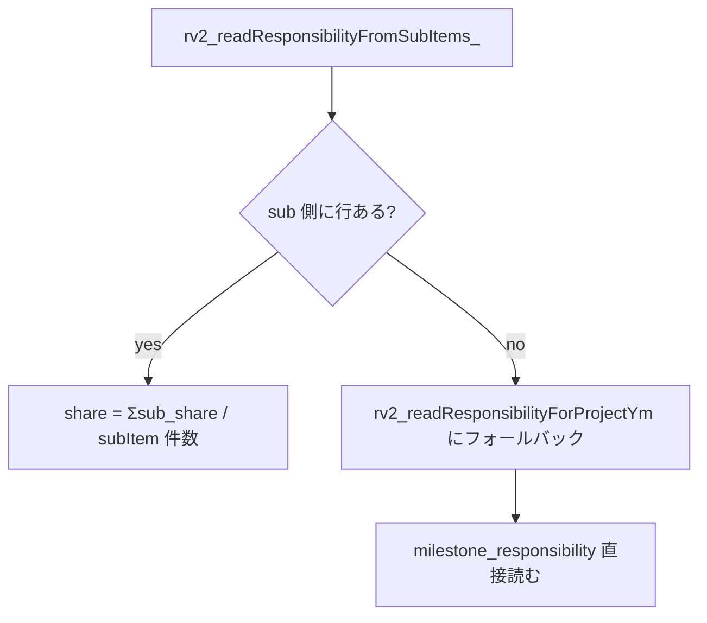

# 報酬計算ロジック 詳細仕様

メンバーの月次報酬がどう決まるかの **計算正本**。 数式・入力データ・優先順位・キャップ制御まで一通り。 **現行の動作実装は `pwa/src/lib/reward-summary.ts` (= こちらが正本)**。 GAS版 `gas/059_RewardV2_Ops.js` は旧互換実装で、 主従は PWA 側。 ここはそれを読み手向けに明文化したもの。

> **2026-06-15 同期メモ**: 本章は元々 GAS実装基準で書かれていたが、 現行PWA実装 (`reward-summary.ts`) に合わせて以下を同期した — (1) PM確定 source 一覧を実装の `PM_LOCKED_PROGRESS_SOURCES` に更新、 (2) 期間按分を 2026-06-12 まさ確定の **アンカー方式** (`anchoredExpectedCumPctForYm`) に更新、 (3) **uncapped (キャップ前) 月次報酬** と、 それを使う **月次収支シミュレータの将来原価** の節を新設。 計算式の主従が GAS→PWA に逆転した点に注意。

メンバー向け使い方は [2-2 章 メンバーの日常ワークフロー](2-2-member-workflows-quick-start.md)、 admin 入口は [6-5 章 Admin Payouts / 支払通知書](6-5-admin-payouts-reward-notice-spec.md) を見る。

---

## まず一行で

> **「PJ 予算 × 65% から契約バッファと会社留保を先取りした残額」を、 「その月の MS 消化度合」と「メンバーごとの背負い度 (share)」で按分する**。

つまり、 PJ がたくさん進んだ月はみんなの報酬が増えて、 進まなかった月は少なくなる。 同じ MS でも、 share が大きい人ほど多く取る。

---

## 用語

| 用語 | 意味 |
|---|---|
| `feeAmount` | PJ の月額固定費 (= `projects.feeAmount`) |
| `monthlyGross` | `feeAmount × 0.65` (= AMD の月次総原資) |
| `grossBudget` | `monthlyGross × cycleMonths` (= 計画サイクル全期間の総原資) |
| `deductionTotal` | サイクル全期間の控除累計 (= `pj_deductions` から計算) |
| `netBudget` | `grossBudget − deductionTotal` (= 実際に分配できる原資) |
| `regularTotalPt` | 本契約 regular の総ポイント (= シーズン期間の月数 × 10pt) |
| `ptUnit` | `round(netBudget / regularTotalPt)` (= 本契約 1pt あたりの円換算) |
| `cumPct` / `prevCumPct` | MS の累計進捗率と前月累計 |
| `thisMonthPct` | `cumPct − prevCumPct` (= 当月増分) |
| `consumedPt` | MS の当月消化 pt = `maxPt × thisMonthPct / 100` |
| `plannedShare` | MS 設計時点の予定担当比率 (= `milestone_responsibility.share`) |
| `actualShare` | 当月の活動ログから算出・確認した実績配分 (= `milestone_monthly_contribution_allocations.actual_share`) |
| `share` | 報酬計算に使う比率。`actualShare` が `auto_applied` / `confirmed` / `pm_override` なら実績配分、なければ `plannedShare` |
| `earnedPt` | メンバーの当月獲得 pt 表示値 = `Σ_ms round(consumedPt × share, 2桁)`。円額計算の正本は丸め前の `earnedPtRaw` |
| `basePay` | MSごとの `round(currCumEarnedPtRaw × ptUnit) - round(prevCumEarnedPtRaw × ptUnit)` の合算 (= ベース報酬) |
| `bonusPt` | bonus ポイント (= **現状 0 固定**、 後述) |
| `totalPay` | cap 前は `basePay + bonusPt`、 cap 後は実支払額 |
| `grossDue` | `totalPay + carryIn` (= cap 前にメンバーが「本来もらえる額」) |
| `capBudgetYen` | 月次の支払上限 |
| `budget_buffer_amount` | 契約上 AMD が先に回収する会社バッファの当月消化額。当月の `invoice × 65%` から先に差し引き、外部支払 cap には回さない |
| `companyReserveYen` / `officerReserveYen` | 役員メンバーに通常の cap 按分で割り当たった額を AMD 内部留保として認識した額。支払通知書には出さない |
| `externalPayoutCapYen` | 通常の cap 按分後、非役員メンバーの支払/stock返済に実際に使われた額 |
| `carryIn` | 前月から繰越された未払い分 |
| `stockYen` / `deferredYen` | cap 超過で翌月へ繰り越す分 (= 同義) |

---

## 計算式 (= 公式)

```text
# 原資
monthlyGross   = feeAmount × 0.65
grossBudget    = monthlyGross × cycleMonths
deductionTotal = Σ_ym (Σ_active_deductions (rate% × monthlyGross or fixedAmount))
netBudget      = max(0, grossBudget − deductionTotal)
ptUnit         = round(netBudget / totalPt)                  # totalPt = 0 のとき ptUnit = 0

# 当月消化 pt (MS ごと)
thisMonthPct      = max(0, cumPct − prevCumPct)
consumedPt[ms]    = ms.maxPt × thisMonthPct / 100
monthlyConsumedPt = Σ_ms consumedPt[ms]

# 個人配分
earnedPt[member]  = Σ_ms (consumedPt[ms] × share[member, ms]) # share は実績配分優先
basePay[member]   = Σ_ms (round(cumEarnedPt[ms,member] × ptUnit) − round(prevCumEarnedPt[ms,member] × ptUnit))
totalPay[member]  = basePay[member] + bonusPt[member]        # bonusPt は現状 0

# キャップ制御 (= 月次支払上限)
grossDue[member]  = totalPay[member] + carryIn[member]

# 会社留保も他メンバーと同じ cap 按分に入れる
contractBufferYen = billing_cycles.budget_buffer_amount
# 役員 (officer) も非役員と同じく過去 stock を carryIn として母数に入れる (2026-06-19 まさ確定)
grossDueForCap[officer] = basePay[officer] + carryIn[officer]
grossDueForCap[nonOfficer] = grossDue[nonOfficer]

if Σ grossDueForCap[all eligible] ≤ capBudgetYen:
    allocated[member] = grossDueForCap[member]
else:
    allocated[member] = round(capBudgetYen × grossDueForCap[member] / Σ grossDueForCap[all eligible])  # 按分

paid[nonOfficer] = allocated[nonOfficer]
stockYen[nonOfficer] = grossDue[nonOfficer] − paid[nonOfficer] # 翌月へ繰越
companyReserveYen[officer] = allocated[officer]            # AMD 内部留保として認識 (現金支払 0)
# 役員も cap 不足で留保しきれなかった分は stock として翌月へ繰り越す (= 非役員と同じ)。
# これで「年間原資 × pt 比」が役員 (= AMD 会社留保) でも成立し、年間で pt 比に収束する。
companyReserveUnfundedYen[officer] = grossDueForCap[officer] − allocated[officer]
stockYen[officer] = companyReserveUnfundedYen[officer]      # 翌月 carryIn[officer] へ
paid[officer] = 0
```

`basePay` は月ごとの `earnedPt` を2桁丸めしてから円換算しない。MSごと・メンバーごとに `round(累計earnedPt×ptUnit) - round(前月までの累計earnedPt×ptUnit)` を当月額にする。これにより、期間按分で月をまたいでもシーズン合計は必ず `round(MS総pt×share×ptUnit)` に収束する。

> **2026-06-19 まさ確定 — 役員 stock 繰越**: 旧実装は役員 (`is_officer`) の `carryIn` を 0 にし、cap 不足月に留保しきれなかった分 (`companyReserveUnfundedYen`) を翌月へ繰り越さず捨てていた。SX のように cap が慢性的に逼迫する PJ では、これにより**役員 (= AMD 会社留保) が年間で pt 比どおりに受け取れず構造的に取りこぼす**事故になっていた (SX 現行サイクルだけで役員計 約189万、3 active PJ で約192万)。役員も非役員と同じく stock を繰り越す方式に変更し、`年間原資 = Σ(pt × pt単価)`、`Σ月cap = 年間原資` の下で**月次の前後はあっても年間で全員 pt 比に収束**することをシミュレーション+本番再計算で検証済み。実装は `pwa/src/lib/reward-summary.ts` の `applyRewardCapsForMonth` (cap 按分母数に officer の carryIn を含める / 役員返却ブロックで `stockYen` を繰り越す) の 2 箇所。

> **pt単価の原資定義 (まさ正本)**: `PJ予算 = (請求額 − バッファ) × 65%`、`本契約pt単価 = PJ予算 ÷ (シーズン期間の月数 × 10pt)`。バッファ (= 営業費用・旅費等、AMD が請求額から先取りする PJ コスト枠) は **pt単価の計算に必ず反映**する。現行実装の `deriveRewardBudgetForPt` は `value_plan_cycles.budget_yen` をそのまま原資に使うため、**`value_plan_cycles.budget_yen` にバッファ反映後の額 `(請求額 − バッファ) × 65%` を入れる**ことで正しい pt単価になる (SX は 2026-06-19 に 6,812,000 → 5,642,000 へ是正済み)。通常 MS の配分 pt 合計が増減しても、本契約 pt単価は変動させない。バッファを第一級入力にしてロジック側で自動控除する恒久実装は別タスク。

---

## 入力データ (= source of truth)

| データ | テーブル | 取得条件 |
|---|---|---|
| 計画サイクル | `value_plan_cycles` | `project_id = pid AND status = 'fixed'` (= 必須、 無いと error) |
| マイルストーン | `value_milestones` | `plan_cycle_id` 一致 AND `is_active = true` AND `goal_level = 'annual'` |
| 月次進捗 | `milestone_monthly_progress` | `plan_cycle_id` 一致 (= 全 ym) |
| MS 背負い度 (= sub) | `milestone_sub_items` + `sub_item_responsibility` | `projectId` 一致 (= 優先) |
| MS 背負い度 (= MS直接) | `milestone_responsibility` | sub 側が空のときの fallback |
| 当月MS実績配分 | `milestone_monthly_contribution_allocations` | `(milestone_id, ym, member_id)`。`status in ('auto_applied','confirmed','pm_override')` だけ報酬計算に使用 |
| メンバー活動ログ | `member_activities` | `project_id` / `ym` / `milestone_id` が一致する活動から自動実績配分を算出 |
| PJ 固定費 | `projects.feeAmount` | `projectId` 一致 |
| 月次控除 | `pj_deductions` | active 行を期間内 ym で全月集計 |
| 月次予算 cap | `billing_cycles.budget_yen` | `(project_id, ym)` 一致 (= 優先) |
| 前月繰越 | `billing_cycles.reward_summary_json` (= 前月分) | `members[*].stockYen` / `deferredYen` |
| メンバー名 | `members.codeName` / `name` | コードネーム解決用 |

---

## 進捗ソースの優先順位

`milestone_monthly_progress` の `source` 列で同じ MS × ym に複数行あるとき、 報酬計算で**支払い対象にできる累積消化pt** (= payable cum) は「PM が確定した行」だけを信用し、 それ以外の月はスケジュール按分デフォルトで埋める。

**PM 確定 (= PM_LOCKED) と見なす source 一覧** (実装正本 `pwa/src/lib/ms-schedule-shared.ts` の `PM_LOCKED_PROGRESS_SOURCES`):

| source | 意味 |
|---|---|
| `pm_manual` | PM (まさ) が手入力した値 |
| `pm_confirmed` | PM が確認・承認した値 |
| `pm_rejected` | PM が却下した値 (= 確定値として扱う) |
| `criteria_toggle` | success_criteria のチェック完了で自動算出 (PM操作起点) |
| `tsukuyomi_revision` | つくよみの修正を PM が確定したリビジョン |

**それ以外の source (`routine_auto` / 野良 `l2_routine` / `tsukuyomi_estimate` 等) は報酬計算では一切参照しない**。 これらが入っていても、 報酬の payable cum は「PM確定行 + スケジュール按分デフォルト」だけで決まる。 「LLM や自動補完がいい加減に上げた値」を支払い差分にしないため。

**payable cum は cumulative max で取る** (= `payableCum(ym) = max over m≤ym`)。 「進捗が巻き戻って再上昇」しても差分が二重に支払われない構造。 実装は `reward-summary.ts` の `buildPayableCumMap`。

---

## 期間按分デフォルト (= アンカー方式、 2026-06-12 まさ確定)

PM確定行が無い月の累積消化ptは、 **その MS の期間 (`period_start_ym`〜`target_ym`) を月数で按分**して埋める。 「N か月で完了する計画の MS は 1 か月あたり `100/N` % ずつ累積で進む」という基本契約。 実装正本は `pwa/src/lib/ms-schedule-shared.ts`。

**まとめ達成は構造的に起こらない**: MS の pt は必ず `period_start_ym`〜`target_ym` の月数で散る。 たとえ複数 MS の `target_ym` が同月に重なっても、 各 MS は自分の開始月から按分されるので、 月次原価が一点に跳ねることはない (= 2026-06-15 まさ「必ず期間の月数で按分」確定。 [[feedback_pt_consumption_must_be_prorated]])。

### 基本按分 (アンカー無し)

```text
# expectedCumPctForYm: 開始前=0、最終月以降=100、間は経過月割り
totalMonths   = (target_ym − period_start_ym) + 1
elapsed       = (当月 − period_start_ym) + 1
expectedCumPct = min(100, round(elapsed / totalMonths × 100, 1 桁))
```

### アンカー方式 (PM確定行を起点に月割り)

当月より**前**の最新 PM確定行 (= アンカー) があれば、 そこを起点にして月割りで淡々と積む。 `target_ym` を過ぎても自動で 100% に飛ばさない:

```text
# anchoredExpectedCumPctForYm
anchorPct        = アンカー (asOf より前の最新 PM_LOCKED 行) の累積%
monthsSinceAnchor = 当月 − アンカー月
cumPct           = min(100, anchorPct + (100/totalMonths) × monthsSinceAnchor)
```

アンカーが無ければ基本按分にフォールバックする。アンカー月が `period_start_ym` より前にある場合は、経過月数の起点だけ `period_start_ym` の直前月へ丸める。これにより、開始前の 0% 確認が開始月の 100% 完了に化ける事故を防ぐ。旧 `routineMonthPct = 100/totalMonths` の説明はこのアンカー方式に統合された。

按分デフォルト値は in-memory で計算されるだけで **DB に書かない** (= `milestone_monthly_progress` は触らない)。

---

## 予定担当比率と当月実績配分

`milestone_responsibility.share` は計画時の予定比率であり、その月に実際に誰が動いたかとは分けて扱う。

1. `member_activities(project_id, ym, milestone_id)` から、活動者・`raw_metadata.responsibilities`・`impact`・`depth`・source種別を重みづけして、MS月ごとの `actualShare` 自動案を作る
2. 自動案の確信度がしきい値以上なら `status='auto_applied'` として `milestone_monthly_contribution_allocations` に保存し、報酬計算に使う
3. 確信度が低い場合は `status='needs_review'` として保存するが、報酬計算では使わず `plannedShare` にfallbackする
4. PM/admin が明示調整した場合は `status='confirmed'` / `pm_override` として保存し、自動案より優先する

例: SX の `PoC先候補開拓` が予定 `まさ50% / かる50%` でも、5月の `member_activities` がまさ側だけなら、その月の `actualShare` は `まさ100% / かる0%` になり、報酬もそれで計算する。

### 4月稼働分の固定

202604 の支払額はすでに確定済みなので、実績配分を後から適用しない。`ym=202604` は `member_activities` / `milestone_monthly_contribution_allocations.actual_share` を無視し、従来どおり `milestone_responsibility.share` で計算する。

支払通知書PDFでは、ここで決まった税抜支払額に消費税10%だけを上乗せする。

## responsibility 解決順序

メンバー × MS の share は 2 段階で決まる:



**Sub 優先のロジック**:

1. `milestone_sub_items` から `subItemId → milestoneId` の対応を作る
2. `sub_item_responsibility` を `(subItemId, memberId)` でループ
3. MS 単位に集約: `share = Σ (sub_share) / そのMSの subItem 総数`
4. = sub レベルで分担を入れてあれば、 自動的に MS レベル share に丸め込まれる

**Fallback**: sub 側に 1 行も無ければ `milestone_responsibility` の `(milestone_id, member_id, share)` をそのまま使う。

---

## ptUnit の決まり方 (= 数値例)

ZMP (= `feeAmount = 300,000`, `cycleMonths = 12`, `totalPt = 100`, `deduction なし`) の場合:

```text
monthlyGross  = 300,000 × 0.65 = 195,000
grossBudget   = 195,000 × 12   = 2,340,000
deductionTotal = 0
netBudget     = 2,340,000
ptUnit        = round(2,340,000 / 100) = 23,400 円/pt
```

= **1 pt 消化したメンバーには 23,400 円が割り当てられる**。 MS が 30pt のものをひとりで 50% 進めれば、 `30 × 0.5 × 23,400 = 351,000 円` (cap 前) になる。

---

## bonusPt (= 現状 0 固定)

`rv2_calcRewardSummary` の出力では `members[*].bonusPt = 0` で固定されている。 旧 rv1 系 (`gas-main/052_RewardScoring_Ops.js` 経由の `appreciationBonus`) は廃止済み。

将来再実装する場合は:
- どこから採点入力するか (= /admin/payouts の admin 入力 / つくよみ自動 / メンバー相互投票)
- `billing_cycles.reward_summary_json` のどこに格納するか
- ptUnit との関係 (= bonusPt も ptUnit で円換算するのか、 円直入力か)

を決めてからこの章とコードを同時更新する。

---

## 別財布 (cap_extra) プール — 本契約とは別原資の受託 (2026-06-20 確定)

PJ が月次定額の本契約とは**別に**まとまった受託 (例: ZMP の OkuDoor システム開発 ¥200万) を受けることがある。これを「別財布」と呼び、本契約の pt単価・cap を汚染しないよう**同一 plan cycle 内の別プール (cap_extra)** として扱う。**計算ルール (65%/pt単価/cap/繰越) は本契約と全く同じ**。別財布だからといって特殊計算はしない。

### 2 つのプール
- **regular プール** (本契約): 原資 = `value_plan_cycles.budget_yen`、pt単価 = `原資 ÷ regular pt`。regular pt は **シーズン期間の月数 × 10pt** で固定し、通常 MS の配分 pt 合計からは導出しない。
- **cap_extra プール** (別財布): `value_milestones.tag='cap_extra'` の MS。pt は MS 期間 (`period_start_ym`〜`target_ym`) の月数×10ptで決まり、原資 = `Σ billing_cycles.extra_budget_yen`、**extra pt単価 = `Σextra_budget_yen ÷ Σcap_extra pt` で独立**に決まる (regular 単価を借用しない)。

`value_plan_cycles.total_points` には **regular pt + 別財布pt の合計** を入れる。regular pt も cap_extra pt も期間月数×10ptで決まる。エンジン (`rewardPointBasis`) は regular 分母にシーズン期間月数×10pt、cap_extra 分母に MS 期間月数×10ptを使うので、admin で通常 MS の配分 pt を増減しても regular pt単価は薄まらない。

### `billing_cycles.extra_budget_yen` (別プールの月次cap)
本契約 `budget_yen` と同じ規約:
- **NULL** = cap 未設定 → 従来フォールバック (需要全額即払い)。**非推奨** (即払いで Σcap を膨らませ本契約と混ざる)。
- **0** = その月は全額 stock 繰越 (払わず翌月へ)。
- **N** = その月の支払上限 N 円。

**完了時一括支払 (典型)**: 開発期間中の月を全部 `0`、**完了月に満額 (= 別財布売上原資)** を置く。開発期間は extraStock 積立 → 完了月に一括消化・extraStock=0。

### 数値例 (ZMP OkuDoor, 2026-06-23 正本)
```text
別財布原資     = 1,300,000 (OkuDoor システム開発の売上原資)
cap_extra pt   = 202605〜202610 の6か月 × 10pt = 60
extra pt単価   = round(1,300,000 / 60) = 21,667 円/pt
extra_budget_yen: 202605〜202609 = 0 (全額繰越) / 202610 = 1,300,000 (完了月満額)
→ 202605〜202609 は extraStock 積立、202610 に一括支払・extraStock=0。
  うめ/あび 各 ≈ 200,000 (share 0.1538 × 60pt × 21,667円)、まさ(役員) は会社留保。
  regular pt単価 = 2,340,000 / 120 = 19,500 (202601〜202612 の12か月×10pt)。
```

### 別財布の支払額が先に決まっている場合
別財布は「先に支払額が確定 → share を後付け調整」が普通。原資と pt (= MS期間×10pt) は固定したまま `milestone_responsibility.share` を微調整して目標額に合わせる (OkuDoor: 原資130万・60pt固定で share まさ0.6924 / あび・うめ各0.1538 にして各20万近傍へ合わせる)。

### 旧ロジックで既払いの月がある場合 (再計算手順)
別財布対応前に「即払い」で払った月の snapshot は旧 pt単価で固定されており新配分と食い違う。その月が PAID保護で sync skip されるなら、**保護フラグ (reward_paid_at / payout_notice_uploaded_at) を一時 NULL → `syncRewardSummariesForProject` で全期間再計算 → フラグ復元** する。完了月capは満額のままで正しく閉じる。`monthly_reward_payout` に実支払行が無い (現金未払い) ことを確認してから実施。

> 汎用の運用プレイブック (3ステップ) は [`../design/season_budget_actual.md`](../design/season_budget_actual.md) §5.2。実装: migration 149 / `reward-summary.ts` (`deriveExtraCapYen` / extra pt単価独立化) / `season-pl.ts` (予実表の別財布分離) / 教訓 [`../BUGS.md`](../BUGS.md) 2026-06-20。

---

## 月次キャップ (= `rv2_applyMonthlyCap_`)

### capBudgetYen の決まり方

```text
1. billing_cycles.budget_yen が明示されている → これを使う (= 0 も有効な cap)
2. fallback: feeAmount × 0.65            → monthlyGross をそのまま cap に使う
3. fallback: planCycle.budgetYen / cycleMonths → サイクル予算の月按分
```

`budget_yen = 0` は「この業務月は支払 cap が 0 円」という明示値。契約開始前に実働がある PJ では、earned / grossDue は発生させつつ、`totalPay = 0`、`stockYen = grossDue` として翌月以降へ繰り越す。`budget_yen IS NULL` は cap 未設定なので、上記 fallback を使う。

`budget_buffer_amount` がある月は、請求額の 65% からその額を先に AMD 回収分として差し引く。契約自動確定では `budget_yen = round(invoiceYen × 0.65) - budget_buffer_amount` として保存するため、報酬計算側が見る `capBudgetYen` はすでにバッファ消化後の値になる。

シーズン内で使い切らなかった cap は、同じプール内の翌月以降へ繰り越す。これはメンバーへの未払 `stockYen` とは別の「未使用支払枠」で、`billing_cycles.budget_yen` / `extra_budget_yen` 自体は月次の基本 cap として維持する。契約最終月は、繰越 cap を使った後に `ptUnit = round(cycleBudget / totalPt)` などの円丸めで 10,000 円以下の少額 stock が残る場合だけ、最終月の有効 cap に差分を足して `stockYen = 0` に閉じる。通常月 cap は契約月額 × 65% を維持し、シーズン全体では全 PJ が未払ゼロ着地になる。10,000 円を超える不足は丸め誤差ではなく設計・契約・billing の不整合として扱い、自動で隠さない。

### 会社留保の扱い

cap は次の順番で扱う。これは全 PJ 共通で、特定 PJ だけの例外ルールにはしない。

1. `billing_cycles.budget_buffer_amount`: 契約台帳にある会社回収バッファを最優先で消化する。`projects.contract_terms_json.companyReserveBufferYen` などに総額があれば、契約自動確定が月ごとに未消化分を `budget_buffer_amount` へ入れる。`companyReserveBufferMonthlyYen` などの月次上限がある場合は、その金額を超えて一気に回収しない。
2. `members.is_officer=true` の当月 `basePay`: 役員も非役員・支払対象メンバーと同じ cap 按分に入れる。割り当たった額だけを `reward_summary_json.members[].companyReserveYen` / `officerReserveYen` に残し、`totalPay=0` のまま支払通知書からは除外する。
3. 非役員・支払対象メンバーの `grossDue`: 当月稼働分 + 前月 stock の返済を、役員 basePay と同じ cap 按分に入れる。

役員の過去 `stockYen` は支払予定へ繰り越さない。役員分は「未払い債務」ではなく会社留保の計画値なので、当月 cap で留保できなかった分は `companyReserveUnfundedYen` として監査用に残すだけにする。非役員メンバーの stock は従来どおり carryIn として翌月以降へ繰り越す。

### キャップ超過時の按分

`Σ grossDueForCap[eligible] ≤ capBudgetYen` なら非役員支払分と役員会社留保分をそのまま全額充当 (= `capped = false`)。

`Σ grossDueForCap[eligible] > capBudgetYen` のとき:

```text
remainingCap = capBudgetYen
remainingGross = Σ grossDueForCap[eligible]
for each member in members:                      # earnedPt 降順
    if 最後のメンバー:
        paid = remainingCap                       # 端数誤差を最後に押し込む
    else:
        allocated = round(remainingCap × grossDueForCap / remainingGross)
    allocated = max(0, min(grossDueForCap, allocated)) # クランプ
    if member is officer:
        member.companyReserveYen = allocated
        member.totalPay = 0
        member.companyReserveUnfundedYen = grossDueForCap − allocated
    else:
        member.totalPay = allocated
        member.stockYen = grossDueForCap − allocated # 翌月 carryIn
    remainingCap   -= allocated
    remainingGross -= grossDueForCap
```

端数処理: 各メンバーで `round` がかかるので、 微小な端数誤差は **最後のメンバーに集約** する。 これで `Σ paid = cap` が保証される。

### 前月繰越 (= carryIn)

前月 `billing_cycles.reward_summary_json.members[*].stockYen` を読んで `carryIn[memberId]` として加算。

同時に、前月までに使い切らなかった支払 cap もプール別に繰り越す。regular の未使用 cap は regular の支払い・会社留保だけに、cap_extra の未使用 cap は cap_extra の支払い・会社留保だけに使う。これにより、前半で MS 消化が薄い月の cap を捨てず、後半で MS 消化が厚くなった月に自然に充当できる。

特例: **当月の members 配列に居なくても、 前月 stockYen が残ってるメンバーは「carry-only 行」として members に追加** される (= `earnedPt = 0, basePay = 0, grossDue = carryIn`)。 これで「過去に働いて未払いだったメンバー」が忘れ去られない。

`stockYen` はその月に新しく発生した未払い額ではなく、`carryIn + 当月発生 - totalPay` 後の**月末未払い残高**。UIでは `stockYen` だけを単独表示せず、`/admin/payouts` の報酬債務台帳で `carryInYen` / 当月発生 / `totalPay` / `stockYen` を同じ行に並べる。

契約開始前に実働がある PJ では、契約前の稼働月は `budget_yen = 0` のまま `grossDue` と `stockYen` を発生させる。契約開始後の月では、前月までの `stockYen` が `carryInYen` になり、当月発生分と同じ cap の中で支払・繰越される。このため `stockYen` が大きいこと自体は異常ではなく、「どの月から来た残高か」を台帳で確認する。

先12か月の見通しでは、会社留保を `出` に混ぜない。`キャッシュ支払` は外部支払だけ、`会社留保` は `cap/売上枠 - 外部支払`、`報酬債務` は月末未払い残、`cap超過チェック` は報酬需要と cap/売上枠の差だけを見る。各表のセルは、その表で確認したい主数字を優先し、別目的の補助数字を混ぜない。`stockYen` は残高なので、12か月分の単純合計を「未払い総額」として読まない。報酬債務表の合計列はピークではなく、最終月に未払い残がゼロ着地するかを最優先で表示する。

### 支払済み/通知済みの過払いを本人の未払残から相殺する

支払通知書を送付済み、または実際に支払済みの月は、あとから現行ロジックの金額へ書き換えない。現行ロジックより多く払っていたことが分かった場合は、会社留保や他メンバーの未払残で吸収せず、同一PJ・同一シーズン・同一メンバー本人の `stockYen` からだけ差し引く。

この相殺は `reward_member_liability_offsets` に監査台帳として残し、`buildRewardSummary` の capped 計算後、対象メンバーの未払残 (`regularStockYen` / `extraStockYen`) が発生した月以降で消化する。`pool='any'` の場合は regular → cap_extra の順で本人の未払残だけを減らす。未払残が足りない分は残額として翌月以降へ持ち越す。

ZMP 2026シーズンの運用判断では、しん・こうの小額過払いは許容し、あび・うめの過払いだけを本人の未払残から相殺する。これは支払通知書の再発行ではなく、シーズン全体で「クライアント支払額 − バッファ」に 65% を掛けた原資以内へ収束させるための支払スケジュール調整。

---

## uncapped (= キャップ前の生の月次報酬)

上のキャップ制御を**噛ませない**、 その月に発生した生の報酬。 実装は `reward-summary.ts` の `buildRewardSummaryUncapped`。

```text
# キャップ・キャリーストックを通さず、その月消化分だけで確定
earnedPtRaw[ms, member] = consumedPt[ms] × share[member, ms]
earnedPt[member]        = Σ_ms round(earnedPtRaw[ms, member], 2桁)  # pt 表示用
payYen[member]          = Σ_ms (
  round(currCumEarnedPtRaw[ms, member] × ptUnit)
  - round(prevCumEarnedPtRaw[ms, member] × ptUnit)
)
```

`buildRewardSummary` (= capped) との違いは **月次キャップ・carryIn・stockYen を一切通さない**こと。 「その月に得た pt だけでその月の報酬が決まる」という素の定義そのもの。 capped 版は、 この uncapped の値に対して支払い上限と繰越平準化 (キャリーストック) をかけた**支払いスケジュール**にすぎない。

### 何に使うか

| 用途 | capped / uncapped |
|---|---|
| 実際の月次支払い (= /admin/payouts、 支払通知書) | **capped** (支払上限と繰越で平準化) |
| 月次収支シミュレータの**メンバー原価** (下記) | **uncapped** (その月に発生した原価そのもの) |

収支シミュは「その月にいくら原価が発生したか」を見たいので、 支払いを翌月に繰り越す capped ではなく、 発生 baseの uncapped を使う。

---

## 月次収支シミュレータの将来原価 (= 予実管理)

`/management-score` の月次収支シミュレータは、 将来各月の**メンバー原価**を上記 uncapped 報酬で投影する。 「いつ・どの MS が・何 pt 消化される予定か」は [期間按分デフォルト](#期間按分デフォルト--アンカー方式-2026-06-12-まさ確定) で各月に散っているので、 将来月でも uncapped 月次報酬が出せる。

`/management-score` 下部の「PJ別 先12か月収支」表は、支払予定 (capped) とは別に `MS月割 +{pt}pt / {N}MS` を表示する。これは報酬計算をもう一度行う列ではなく、`value_milestones.period_start_ym`〜`target_ym` と `anchoredExpectedCumPctForYm` から、その月にどの程度MSが進む前提かを目視確認するための監査表示。PM locked 行があるMSは `PM確定` として表示し、非確定の `routine_auto` / LLM推定行は正本にしない。

> **`/admin/payouts`「先12か月 PJ収支」表の将来「支払予定」は capped + 役員除外を使う (2026-06-17, v0.25.4)**: `/admin/payouts` の「先12か月 PJ収支」収支表の支払予定列は、**月次収支シミュの原価 (uncapped) とは別物**で、実際にいくら払うか = **capped (月次キャップ `budget_yen` + stock 繰越平準化)** が正本 (上の表 279行)。`computeForwardCappedMemberCosts` が plan cycle 期間の各月を `buildRewardSummary` で投影し、`is_officer` / `exclude_from_payout_notice` のメンバーは支払予定から**単に落とす** (再配分しない = AMD 持ち出しが無限に膨らむのを防ぐ)。**将来月の支払予定に uncapped を入れたり `budget_yen` を決め打ちコピーするのは禁止** — uncapped は pt 消化が厚い月に budget を超えて跳ね、マイナス月・役員のみ PJ (KUTE) で巨額の支払いが出る嘘になる (BUGS.md 2026-06-17、v0.25.3 で一度この誤りを犯し v0.25.4 で訂正)。役員のみ PJ は capped 支払予定 = ¥0 が正しい結果なので、値 0 を「未計算」と誤判定して budget フォールバックに落とさないこと。

- **入力**: live テーブル (`projects` の `monthly_fixed` / `value_plan_cycles` (active) / `value_milestones` の `period_start_ym`・`target_ym`・`points` / `milestone_responsibility` / `billing_cycles`)。 旧 `company_budget_inputs` の凍結スナップショットは使わない。
- **将来原価 = 将来各月の uncapped 報酬**。 capped を使うと繰越で原価が翌月にずれて月次収支が歪むため、 uncapped が正。
- **DB に書く (= 予実管理)**: 将来月の予定報酬も `billing_cycles.reward_summary_json` に保存する。 後で実績が確定したら同じ行が上書きされ、 予実が 1 テーブルに並ぶ。 「シミュだから DB に書かない」は誤り (2026-06-15 まさ確定)。

> **注意 (uncapped の単月赤字)**: uncapped はキャリーストック平準化をしないので、 pt 消化が厚い月はメンバー原価が跳ねて**単月赤字**が出ることがある。 これは実運用の capped (繰越平準化) では均される性質。 シミュ上で赤字月が顕著なら、 按分計画 (MS の `period_start_ym`〜`target_ym`) かサイクル設計を見直すシグナルとして扱う。

詳細な収支シミュ仕様は [4-5 章 Management Score / 収支シミュレーション](4-5-management-score-and-finance-simulation-spec.md) を参照。

---

## 出力構造 (= `reward_summary_json`)

`billing_cycles.reward_summary_json` にキャッシュされる JSON:

```json
{
  "totalPaySum": 195000,
  "totalGrossDueYen": 251000,
  "capBudgetYen": 195000,
  "effectiveCapBudgetYen": 227000,
  "capped": true,
  "carryInYen": 32000,
  "carryOverYen": 56000,
  "monthlyBudget65": 195000,
  "regularCapCarryInYen": 32000,
  "regularUnusedCapCarryOutYen": 0,
  "finalCapTopUpYen": 0,
  "planCycleId": "pc_xxx",
  "annualBudget": 3000000,
  "grossBudget": 2340000,
  "deductionTotal": 0,
  "netBudget": 2340000,
  "totalPt": 100,
  "ptUnit": 23400,
  "monthlyConsumedPt": 8.5,
  "cumulativeConsumedPt": 42.3,
  "progressRate": 42.3,
  "expectedRate": 33.3,
  "milestones": [
    {
      "milestoneKey": "ms_xxx",
      "title": "...",
      "maxPt": 30,
      "tag": "normal",
      "progressPct": 5.0,
      "pctUsed": 60.0,
      "consumedPt": 1.5,
      "cumPct": 60.0,
      "cumPt": 18.0,
      "source": "pm_manual"
    }
  ],
  "members": [
    {
      "memberId": "ID001",
      "memberName": "...",
      "earnedPt": 4.5,
      "basePay": 105300,
      "bonusPt": 0,
      "totalPay": 95000,
      "carryInYen": 0,
      "grossDueYen": 105300,
      "cappedFrom": 105300,
      "deferredYen": 10300,
      "stockYen": 10300,
      "breakdown": [
        { "msKey": "ms_xxx", "title": "...", "msConsumedPt": 1.5, "share": 1.0, "earnedPt": 1.5 }
      ]
    }
  ]
}
```

---

## 再計算トリガ

`reward_summary_json` は **キャッシュ**。 計算が走るのは以下のときだけ:

| トリガ | 入口 |
|---|---|
| 自動 (日次 03:05 JST) | `/api/cron/payout-reward-cache-refresh` |
| 手動ボタン | `/admin/payouts` の「報酬キャッシュ再計算」 |
| 同期/発行系操作 | `/admin/payouts` の支払データ同期、通知書発行、送付済化を行うとき (= `refreshRewards=1` 付与) |

**通常 GET (= `/admin/payouts?ym=YYYYMM` を開くだけ) は絶対に再計算しない**。 過去事故: GET でも自動再計算してた頃、 admin が画面開いただけで承認済の過去月の数字がズレるという UX 事故が発生 (= 6-5 章「通常 GET は読むだけ原則」参照)。

## 月初合意との境界

`/monthly-agreement` は、この章の支払計算結果を確定額として表示する画面ではない。月初合意は、当月の月次予算を「当月の予定MS消化pt × active member 正規化 share」で配分した **月初合意用の予定報酬** と、担当MS/到達目標を本人へ表示し、`member_monthly_work_agreements.snapshot_json` と `snapshot_hash` に保存する確認レイヤー。合意 API は報酬キャッシュを再計算せず、`milestone_monthly_progress`、`milestone_responsibility`、`billing_cycles` も書き換えない。

月初合意画面では `reward_summary_json.members[].breakdown[].payYen`、cap、carry-over などの支払・精算内部情報は表示しない。本人確認に必要なのは「担当MS」「当月到達目標」「その対価としての予定報酬」。ただし SX のように当月支払と未払い繰越が分かれる PJ は、`totalPay` / `stockYen` / `grossDueYen` / `carryInYen` を read-only に表示し、「今月支払」「今月末未払い残（今月は支払われない）」を別枠で確認できるようにする。`stockYen` は前月繰越も含む今月末残なので、本人詳細では前月繰越・今月発生・今月支払の内訳を添える。これは予定報酬計算には使わず、cap 由来の配賦や繰越の検証は `/admin/payouts` と本章の責務に残す。

本人からの修正要望は `member_monthly_work_agreement_requests` に保存する。これは報酬計算への直接入力ではなく、admin/PM が MS/share/予定報酬の元データを見直すための確認キュー。

snapshot hash が変わったときは「条件更新あり」として再合意を促す。これは報酬計算の入力変更ではなく、本人/admin が条件変更を見落とさないための状態。

`/admin/payouts` の支払 gate は、この月初合意レイヤーを server-side に read する。未合意 (`pending`) / 条件更新あり (`stale`) / 修正要望中 (`revision_requested`) の `member × 稼働月 × PJ` がある場合、支払データ同期・支払通知書PDF生成・送付・送付済み確定を止める。admin override は理由・actor・対象 member/PJ/月を `member_monthly_work_agreement_payout_overrides` に残した場合だけ許可する。

この gate は「支払へ進めるか」の判定であり、`buildRewardSummary`、cap、stockYen、carry-over、pt unit、PM locked progress の計算には影響しない。業務委託契約上の個別発注 / SOW / 条件確認として hard guard を本番運用するには、契約改定・メンバー同意・法務レビューを前提にする。ここでは法的助言として断定しない。

---

## edge case と過去ハマり

| ケース | 挙動 |
|---|---|
| `value_plan_cycles.status='fixed'` が無い PJ | `rv2_calcRewardSummary` は `{ error: "planCycle not found" }` を返す。 admin/payouts では「MSなしPJ 強制報酬確定」ルートを使う ([6-5 章](6-5-admin-payouts-reward-notice-spec.md#msなしpj-強制報酬確定)) |
| `pj_deductions` テーブル未作成 | `try/catch` で `deductionTotal = 0` にフォールバック |
| MS に responsibility 未設定 | そのメンバーには配分されない (= 0 円)。 routine MS で起こりがち |
| routine MS の前月補完 | 前月分の `routine_auto` も `allProgress` に push される。 ただし当月に pm_manual があれば自動補完は skip |
| 端数誤差 | キャップ按分は最後のメンバーに `remainingCap` を全部押し込む → `Σ paid = cap` 保証 |
| 当月 0 円なのに前月 stockYen 残 | carry-only 行として members に追加され、 前月分が今月支払われる |
| MSなしPJ | admin が `/admin/payouts` の「MSなしPJ 強制報酬確定」から PJ × 稼働月 × メンバー × 支払額を手入力。 source = `admin_manual_payout`。 ([6-5 章](6-5-admin-payouts-reward-notice-spec.md#msなしpj-強制報酬確定)) |

---

## トラブル時

| 症状 | 確認場所 |
|---|---|
| 自分の報酬が 0 円 | `milestone_responsibility` or `sub_item_responsibility` に自分の `share` 行があるか / `milestone_monthly_progress` の `progress_pct` が 0 でないか / `value_plan_cycles.status='fixed'` か |
| ptUnit が 0 | `projects.feeAmount` が 0、 または `value_plan_cycles.total_points` が 0 |
| 報酬が前月より急に増減 | `pj_deductions` の active 期間変更、 または cap budget の変更 (= `billing_cycles.budget_yen` 上書き) |
| stockYen が永遠に残る | cap が常に gross を下回り続けてる → cap budget 見直し or 控除見直し |
| routine MS で配分が偏る | sub_item_responsibility が一部メンバーしか入ってない可能性。 全員に share を入れるか、 milestone_responsibility に fallback させる |
| キャッシュが古い | `/admin/payouts` の「報酬キャッシュ再計算」を押す or `payout-reward-cache-refresh` cron 実行履歴を確認 |

---

## 関連

- 計算正本: `gas-main/059_RewardV2_Ops.js` (= `rv2_calcRewardSummary`)
- データ取得: `gas-main/058_RewardV2_Repo.js` (= `rv2_readProgressForPlanCycle`, `rv2_readResponsibilityFromSubItems_`, `rv2_readResponsibilityForProjectYm`)
- 控除計算: `gas-main/043_PjDeductions_Repo.js` (= `pjDed_calcCycleDeductionTotal_`)
- 試算 (= UI 上のシミュレーション): `gas-main/060_RewardV2_Estimator.js`
- メンバー側表示: [2-2 章 メンバーの日常ワークフロー](2-2-member-workflows-quick-start.md)
- /mypage 仕様: [6-6 章 Member Ops / Billing / Prompt](6-6-member-billing-prompts-spec.md#mypage)
- /admin/payouts 仕様: [6-5 章 Admin Payouts / 支払通知書](6-5-admin-payouts-reward-notice-spec.md)
- DB schema: [`pwa/design/db_schema.md`](../design/db_schema.md) (= `billing_cycles`, `value_milestones`, `value_plan_cycles`, `milestone_monthly_progress`, `milestone_responsibility`, `milestone_sub_items`)
- 設計: [`pwa/design/ms_progress.md`](../design/ms_progress.md) (= MS 進捗の source 設計)
- 設計: [`pwa/design/progress_estimation.md`](../design/progress_estimation.md) (= LLM 進捗推定)
