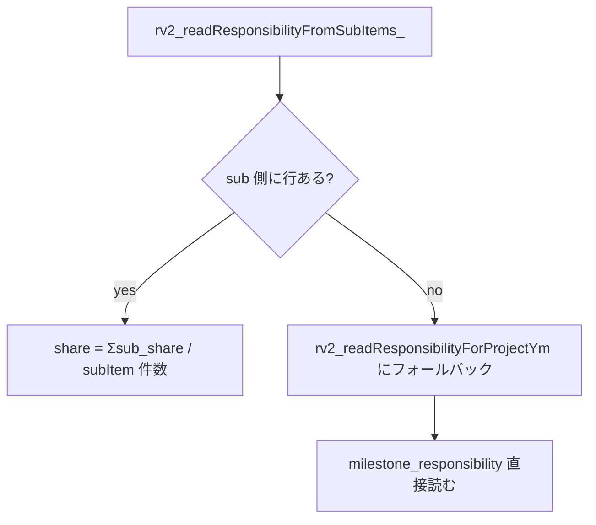

# 報酬計算ロジック 詳細仕様

メンバーの月次報酬がどう決まるかの **計算正本**。 数式・入力データ・優先順位・キャップ制御まで一通り。 **現行の動作実装は `pwa/src/lib/reward-summary.ts` (= こちらが正本)**。 GAS版 `gas/059_RewardV2_Ops.js` は旧互換実装で、 主従は PWA 側。 ここはそれを読み手向けに明文化したもの。

> **2026-06-15 同期メモ / 2026-07-17 訂正**: 本章は元々 GAS実装基準で書かれていたが、 現行PWA実装 (`reward-summary.ts`) に合わせて PM確定 source、期間按分、uncapped (キャップ前) 月次報酬を同期した。2026-07-17 以降、`/management-score` live 月次試算表の売上原価は uncapped ではなく `/admin/payouts` の capped 外部支払予定を正本にする。uncapped は cap 設計・MS期間設定・報酬需要の監査に使う。

メンバー向け使い方は [2-2 章 メンバーの日常ワークフロー](2-2-member-workflows-quick-start.md)、 admin 入口は [6-5 章 Admin Payouts / 支払通知書](6-5-admin-payouts-reward-notice-spec.md) を見る。

---

## まず一行で

> **「クライアント支払 − 契約バッファ」の65%を PJ メンバー予算とし、その枠内を「その月の MS 消化度合」と「メンバーごとの背負い度 (share)」で按分する**。

残り35%は AMD 運営費30% + クローザー報酬5%の外枠で、PJメンバー予算や下記の「対象外配賦」には含めない。`companyReserveYen` は35%を意味せず、65%枠内で支払対象外メンバーへ割り当たった非現金配賦の互換フィールド名。

つまり、 PJ がたくさん進んだ月はみんなの報酬が増えて、 進まなかった月は少なくなる。 同じ MS でも、 share が大きい人ほど多く取る。

---

## 用語

| 用語 | 意味 |
|---|---|
| `feeAmount` | PJ の月額固定費 (= `projects.feeAmount`) |
| `monthlyGross` | `feeAmount × 0.65` (= AMD の月次総原資) |
| `grossBudget` | `monthlyGross × cycleMonths` (= 計画サイクル全期間の総原資) |
| `deductionTotal` | サイクル全期間の控除累計 (= `pj_deductions` から計算) |
| `netBudget` | `grossBudget − deductionTotal` (= 実際に分配できる原資) |
| `regularTotalPt` | 本契約 regular の総ポイント (= シーズン期間の月数 × 10pt) |
| `ptUnit` | `round(netBudget / regularTotalPt)` (= 本契約 1pt あたりの円換算) |
| `cumPct` / `prevCumPct` | MS の累計進捗率と前月累計 |
| `thisMonthPct` | `cumPct − prevCumPct` (= 当月増分) |
| `consumedPt` | MS の当月消化 pt = `maxPt × thisMonthPct / 100` |
| `plannedShare` | MS 設計時点の予定担当比率 (= `milestone_responsibility.share`) |
| `actualShare` | 当月の活動ログから算出・確認した実績配分 (= `milestone_monthly_contribution_allocations.actual_share`) |
| `share` | 報酬計算に使う比率。`actualShare` が `auto_applied` / `confirmed` / `pm_override` なら実績配分、なければ `plannedShare` |
| `earnedPt` | メンバーの当月獲得 pt = `Σ_ms (consumedPt × share)` |
| `basePay` | `round(earnedPt × ptUnit)` (= ベース報酬) |
| `bonusPt` | bonus ポイント (= **現状 0 固定**、 後述) |
| `totalPay` | cap 前は `basePay + bonusPt`、 cap 後は実支払額 |
| `grossDue` | `totalPay + carryIn` (= cap 前にメンバーが「本来もらえる額」) |
| `capBudgetYen` | 月次の支払上限 |
| `budget_buffer_amount` | 契約上 AMD が先に回収する会社バッファの当月消化額。当月の `invoice × 65%` から先に差し引き、外部支払 cap には回さない |
| `companyReserveYen` / `officerReserveYen` | `exclude_from_payout_notice=true` の支払対象外メンバーに、通常の65% cap 按分で割り当たった非現金配賦。35%のAMD運営費・クローザー報酬とは別。`officer*` は互換名であり `is_officer` は分類に使わない |
| `externalPayoutCapYen` | 通常の cap 按分後、`exclude_from_payout_notice=false` の支払対象メンバーへの支払/stock返済に実際に使われた額 |
| `carryIn` | 前月から繰越された未払い分 |
| `stockYen` / `deferredYen` | cap 超過で翌月へ繰り越す月末残高 (= 同義)。支払対象メンバー分は外部への未払残、支払対象外メンバー分は非現金配賦の未充当繰越として読む。月次フローのように月ごとに合計しない |

---

## 計算式 (= 公式)

```text
# 原資
monthlyGross   = feeAmount × 0.65
grossBudget    = monthlyGross × cycleMonths
deductionTotal = Σ_ym (Σ_active_deductions (rate% × monthlyGross or fixedAmount))
netBudget      = max(0, grossBudget − deductionTotal)
ptUnit         = round(netBudget / totalPt)                  # totalPt = 0 のとき ptUnit = 0

# 当月消化 pt (MS ごと)
thisMonthPct      = max(0, cumPct − prevCumPct)
consumedPt[ms]    = ms.maxPt × thisMonthPct / 100
monthlyConsumedPt = Σ_ms consumedPt[ms]

# 個人配分
earnedPt[member]  = Σ_ms (consumedPt[ms] × share[member, ms]) # share は実績配分優先
basePay[member]   = round(earnedPt[member] × ptUnit)
totalPay[member]  = basePay[member] + bonusPt[member]        # bonusPt は現状 0

# キャップ制御 (= 月次支払上限)
grossDue[member]  = totalPay[member] + carryIn[member]

# 支払対象外メンバーも他メンバーと同じ65% cap 按分に入れる
contractBufferYen = billing_cycles.budget_buffer_amount
# 支払対象外メンバーも支払対象メンバーと同じく過去 stock を carryIn として母数に入れる
grossDueForCap[nonCashMember] = basePay[nonCashMember] + carryIn[nonCashMember]
grossDueForCap[cashMember] = grossDue[cashMember]

if Σ grossDueForCap[all eligible] ≤ capBudgetYen:
    allocated[member] = grossDueForCap[member]
else:
    allocated[member] = round(capBudgetYen × grossDueForCap[member] / Σ grossDueForCap[all eligible])  # 按分

paid[cashMember] = allocated[cashMember]
stockYen[cashMember] = grossDue[cashMember] − paid[cashMember] # 翌月へ繰越
companyReserveYen[nonCashMember] = allocated[nonCashMember]     # 65%枠内の非現金配賦 (現金支払 0)
# 支払対象外メンバーも cap 不足で配賦しきれなかった分は stock として翌月へ繰り越す。
companyReserveUnfundedYen[nonCashMember] = grossDueForCap[nonCashMember] − allocated[nonCashMember]
stockYen[nonCashMember] = companyReserveUnfundedYen[nonCashMember]
paid[nonCashMember] = 0
```

> **2026-06-19 まさ確定 — 支払対象外メンバーの stock 繰越 / 2026-07-29 分類根拠訂正**: 旧実装は当時の「役員」区分の `carryIn` を 0 にし、cap 不足月に配賦しきれなかった分 (`companyReserveUnfundedYen`) を翌月へ繰り越さず捨てていた。SX のように cap が慢性的に逼迫する PJ では、年間で pt 比どおりに配賦できない構造的な取りこぼしになる。stock を他メンバーと同じく繰り越し、月次の前後はあっても年間で pt 比に収束させる。2026-07-29以降、その対象判定は `is_officer` ではなく `exclude_from_payout_notice=true` のみ。あき・りりのような非役員も対象になり、役員でも `exclude=false` なら現金支払対象になる。

> **2026-07-03 まさ確定 — 未使用 cap 繰越**: `stockYen` だけを翌月へ繰り越し、当月に使い切らなかった `budget_yen` (= 月次支払 cap) を捨てる旧挙動は禁止。前半の MS 消化が薄く後半に厚い PJ では、年間原資 `Σ月cap` が足りていても終盤だけ cap 不足になり、シーズン末に未払い残が残るため。`buildRewardSummary` は plan cycle 先頭から時系列に `regularUnusedCapCarryOutYen = max(0, effectiveRegularCapBudgetYen - regularGrossDueForCap)` を計算し、次月の `regularCapCarryInYen` として足す。つまり、当月の配分に使う上限は `effectiveRegularCapBudgetYen = regularCapBudgetYen + regularCapCarryInYen`。別財布 (`cap_extra`) は `extra_budget_yen` が明示された月だけ同じく `extraUnusedCapCarryOutYen` を繰り越し、`NULL` (= cap 未設定・需要全額即払い) の月では未使用別財布 cap を発生させない。

> **2026-07-03 まさ確定 — シーズン終了時 stock ゼロ必須 / 自動上乗せ禁止 / 2026-07-29 分類根拠訂正**: すべての plan cycle は `period_end_ym` の計算後に、支払対象メンバーへの未払残を 0 円で閉じることを絶対条件にする。ただし、報酬計算側が最終月に自動で cap を足してゼロに見せることは禁止。`buildRewardSummary` は月次 cap と未使用 cap 繰越だけで計算し、それでも最終月に支払対象メンバー分の `stockYen` が残る場合は不足額としてそのまま出す。raw の `carryOverYen` には支払対象外メンバーの非現金配賦未充当分も含まれうるため、`/admin/ms-overview` / PJ cockpit の `期末未払残` は支払対象メンバー分だけを最終月に一度だけ読み、対象外メンバーの繰越は内部収束チェックとして扱う。`stockYen` は残高スナップショットなので複数月を合計しない。`/admin/ms-overview` の編集モードは保存前検算でクライアント支払額、バッファ、原資上限、PJ予算、メンバー支払額、対象外配賦、期末未払残を表示し、外部向け期末未払残、PJ予算不足、または PJ予算の原資上限超過が 1 円でもある場合は `blocked` として保存を止める。AMD運営側が認識していないところでバッファ/運営費が勝手に削られてゼロ着地に見える設計は禁止。

> **pt単価の原資定義 (まさ正本)**: `PJ予算 = (請求額 − バッファ) × 65%`、`本契約pt単価 = PJ予算 ÷ (シーズン期間の月数 × 10pt)`。バッファ (= 営業費用・旅費等、AMD が請求額から先取りする PJ コスト枠) は **pt単価の計算に必ず反映**する。現行実装の `deriveRewardBudgetForPt` は `value_plan_cycles.budget_yen` をそのまま原資に使うため、**`value_plan_cycles.budget_yen` にバッファ反映後の額 `(請求額 − バッファ) × 65%` を入れる**ことで正しい pt単価になる (SX は 2026-06-19 に 6,812,000 → 5,642,000 へ是正済み)。通常 MS の配分 pt 合計が増減しても、本契約 pt単価は変動させない。バッファを第一級入力にしてロジック側で自動控除する恒久実装は別タスク。

---

## 入力データ (= source of truth)

| データ | テーブル | 取得条件 |
|---|---|---|
| 計画サイクル | `value_plan_cycles` | `project_id = pid AND status = 'fixed'` (= 必須、 無いと error) |
| マイルストーン | `value_milestones` | `plan_cycle_id` 一致 AND `is_active = true` AND `goal_level = 'annual'` |
| 月次進捗 | `milestone_monthly_progress` | `plan_cycle_id` 一致 (= 全 ym) |
| MS 背負い度 (= sub) | `milestone_sub_items` + `sub_item_responsibility` | `projectId` 一致 (= 優先) |
| MS 背負い度 (= MS直接) | `milestone_responsibility` | sub 側が空のときの fallback |
| 当月MS実績配分 | `milestone_monthly_contribution_allocations` | `(milestone_id, ym, member_id)`。`status in ('auto_applied','confirmed','pm_override')` だけ報酬計算に使用 |
| メンバー活動ログ | `member_activities` | `project_id` / `ym` / `milestone_id` が一致する活動から自動実績配分を算出 |
| PJ 固定費 | `projects.feeAmount` | `projectId` 一致 |
| 月次控除 | `pj_deductions` | active 行を期間内 ym で全月集計 |
| 月次予算 cap | `billing_cycles.budget_yen` | `(project_id, ym)` 一致 (= 優先) |
| 前月繰越 | `billing_cycles.reward_summary_json` (= 前月分) | `members[*].stockYen` / `deferredYen` |
| メンバー名 | `members.codeName` / `name` | コードネーム解決用 |

---

## 進捗ソースの優先順位

`milestone_monthly_progress` の `source` 列で同じ MS × ym に複数行あるとき、 報酬計算で**支払い対象にできる累積消化pt** (= payable cum) は「PM が確定した行」だけを信用し、 それ以外の月はスケジュール按分デフォルトで埋める。

**PM 確定 (= PM_LOCKED) と見なす source 一覧** (実装正本 `pwa/src/lib/ms-schedule-shared.ts` の `PM_LOCKED_PROGRESS_SOURCES`):

| source | 意味 |
|---|---|
| `pm_manual` | PM (まさ) が手入力した値 |
| `pm_confirmed` | PM が確認・承認した値 |
| `pm_rejected` | PM が却下した値 (= 確定値として扱う) |
| `criteria_toggle` | success_criteria のチェック完了で自動算出 (PM操作起点) |
| `tsukuyomi_revision` | つくよみの修正を PM が確定したリビジョン |

**それ以外の source (`routine_auto` / 野良 `l2_routine` / `tsukuyomi_estimate` 等) は報酬計算では一切参照しない**。 これらが入っていても、 報酬の payable cum は「PM確定行 + スケジュール按分デフォルト」だけで決まる。 「LLM や自動補完がいい加減に上げた値」を支払い差分にしないため。

**payable cum は cumulative max で取る** (= `payableCum(ym) = max over m≤ym`)。 「進捗が巻き戻って再上昇」しても差分が二重に支払われない構造。 実装は `reward-summary.ts` の `buildPayableCumMap`。

---

## 期間按分デフォルト (= アンカー方式、 2026-06-12 まさ確定)

PM確定行が無い月の累積消化ptは、 **その MS の期間 (`period_start_ym`〜`target_ym`) を月数で按分**して埋める。 「N か月で完了する計画の MS は 1 か月あたり `100/N` % ずつ累積で進む」という基本契約。 実装正本は `pwa/src/lib/ms-schedule-shared.ts`。

**まとめ達成は構造的に起こらない**: MS の pt は必ず `period_start_ym`〜`target_ym` の月数で散る。 たとえ複数 MS の `target_ym` が同月に重なっても、 各 MS は自分の開始月から按分されるので、 月次原価が一点に跳ねることはない (= 2026-06-15 まさ「必ず期間の月数で按分」確定。 [[feedback_pt_consumption_must_be_prorated]])。

### 基本按分 (アンカー無し)

```text
# expectedCumPctForYm: 開始前=0、最終月以降=100、間は経過月割り
totalMonths   = (target_ym − period_start_ym) + 1
elapsed       = (当月 − period_start_ym) + 1
expectedCumPct = min(100, round(elapsed / totalMonths × 100, 1 桁))
```

### アンカー方式 (PM確定行を起点に月割り)

当月より**前**の最新 PM確定行 (= アンカー) があれば、 そこを起点にして月割りで淡々と積む。 `target_ym` を過ぎても自動で 100% に飛ばさない:

```text
# anchoredExpectedCumPctForYm
anchorPct        = アンカー (asOf より前の最新 PM_LOCKED 行) の累積%
monthsSinceAnchor = 当月 − アンカー月
cumPct           = min(100, anchorPct + (100/totalMonths) × monthsSinceAnchor)
```

アンカーが無ければ基本按分にフォールバックする。アンカー月が `period_start_ym` より前にある場合は、経過月数の起点だけ `period_start_ym` の直前月へ丸める。これにより、開始前の 0% 確認が開始月の 100% 完了に化ける事故を防ぐ。旧 `routineMonthPct = 100/totalMonths` の説明はこのアンカー方式に統合された。

按分デフォルト値は in-memory で計算されるだけで **DB に書かない** (= `milestone_monthly_progress` は触らない)。

---

## 予定担当比率と当月実績配分

`milestone_responsibility.share` は計画時の予定比率であり、その月に実際に誰が動いたかとは分けて扱う。

1. `member_activities(project_id, ym, milestone_id)` から、活動者・`raw_metadata.responsibilities`・`impact`・`depth`・source種別を重みづけして、MS月ごとの `actualShare` 自動案を作る
2. 自動案の確信度がしきい値以上なら `status='auto_applied'` として `milestone_monthly_contribution_allocations` に保存し、報酬計算に使う
3. 確信度が低い場合は `status='needs_review'` として保存するが、報酬計算では使わず `plannedShare` にfallbackする
4. PM/admin が明示調整した場合は `status='confirmed'` / `pm_override` として保存し、自動案より優先する

例: SX の `PoC先候補開拓` が予定 `まさ50% / かる50%` でも、5月の `member_activities` がまさ側だけなら、その月の `actualShare` は `まさ100% / かる0%` になり、報酬もそれで計算する。

### 4月稼働分の固定

202604 の支払額はすでに確定済みなので、実績配分を後から適用しない。`ym=202604` は `member_activities` / `milestone_monthly_contribution_allocations.actual_share` を無視し、従来どおり `milestone_responsibility.share` で計算する。

支払通知書PDFでは、ここで決まった税抜支払額に消費税10%だけを上乗せする。

## responsibility 解決順序

メンバー × MS の share は 2 段階で決まる:



**Sub 優先のロジック**:

1. `milestone_sub_items` から `subItemId → milestoneId` の対応を作る
2. `sub_item_responsibility` を `(subItemId, memberId)` でループ
3. MS 単位に集約: `share = Σ (sub_share) / そのMSの subItem 総数`
4. = sub レベルで分担を入れてあれば、 自動的に MS レベル share に丸め込まれる

**Fallback**: sub 側に 1 行も無ければ `milestone_responsibility` の `(milestone_id, member_id, share)` をそのまま使う。

---

## ptUnit の決まり方 (= 数値例)

ZMP (= `feeAmount = 300,000`, `cycleMonths = 12`, `totalPt = 100`, `deduction なし`) の場合:

```text
monthlyGross  = 300,000 × 0.65 = 195,000
grossBudget   = 195,000 × 12   = 2,340,000
deductionTotal = 0
netBudget     = 2,340,000
ptUnit        = round(2,340,000 / 100) = 23,400 円/pt
```

= **1 pt 消化したメンバーには 23,400 円が割り当てられる**。 MS が 30pt のものをひとりで 50% 進めれば、 `30 × 0.5 × 23,400 = 351,000 円` (cap 前) になる。

---

## bonusPt (= 現状 0 固定)

`rv2_calcRewardSummary` の出力では `members[*].bonusPt = 0` で固定されている。 旧 rv1 系 (`gas-main/052_RewardScoring_Ops.js` 経由の `appreciationBonus`) は廃止済み。

将来再実装する場合は:
- どこから採点入力するか (= /admin/payouts の admin 入力 / つくよみ自動 / メンバー相互投票)
- `billing_cycles.reward_summary_json` のどこに格納するか
- ptUnit との関係 (= bonusPt も ptUnit で円換算するのか、 円直入力か)

を決めてからこの章とコードを同時更新する。

---

## 別財布 (cap_extra) プール — 本契約とは別原資の受託 (2026-06-20 確定)

PJ が月次定額の本契約とは**別に**まとまった受託 (例: ZMP の OkuDoor システム開発 ¥200万) を受けることがある。これを「別財布」と呼び、本契約の pt単価・cap を汚染しないよう**同一 plan cycle 内の別プール (cap_extra)** として扱う。**計算ルール (65%/pt単価/cap/繰越) は本契約と全く同じ**。別財布だからといって特殊計算はしない。

### 2 つのプール
- **regular プール** (本契約): 原資 = `value_plan_cycles.budget_yen`、pt単価 = `原資 ÷ regular pt`。regular pt は **シーズン期間の月数 × 10pt** で固定し、通常 MS の配分 pt 合計からは導出しない。
- **cap_extra プール** (別財布): `value_milestones.tag='cap_extra'` の MS。pt は原則 MS 期間 (`period_start_ym`〜`target_ym`) の月数×10pt。**ただし別財布原資やメンバー支払額が先に決まっている金額ベースの予算では、`value_milestones.points` に明示ptを入れ、その明示ptを優先する**。原資 = `Σ billing_cycles.extra_budget_yen`、**extra pt単価 = `Σextra_budget_yen ÷ Σcap_extra pt` で独立**に決まる (regular 単価を借用しない)。

`value_plan_cycles.total_points` には **regular pt + 別財布pt の合計** を入れる。regular pt は期間月数×10pt、cap_extra pt は `points > 0` なら明示pt、未設定なら期間月数×10ptで決まる。エンジン (`rewardPointBasis`) は regular 分母にシーズン期間月数×10pt、cap_extra 分母に別財布の effective pt を使うので、admin で通常 MS の配分 pt を増減しても regular pt単価は薄まらない。

### `billing_cycles.extra_budget_yen` (別プールの月次cap)
本契約 `budget_yen` と同じ規約:
- **NULL** = cap 未設定 → 従来フォールバック (需要全額即払い)。**非推奨** (即払いで Σcap を膨らませ本契約と混ざる)。
- **0** = その月は全額 stock 繰越 (払わず翌月へ)。
- **N** = その月の支払上限 N 円。

**完了時一括支払 (典型)**: 開発期間中の月を全部 `0`、**完了月に満額 (= 別財布売上原資)** を置く。開発期間は extraStock 積立 → 完了月に一括消化・extraStock=0。

### 数値例 (ZMP OkuDoor, 2026-07-09 正本)
```text
別財布原資     = 1,300,000 (OkuDoor システム開発の売上原資)
cap_extra pt   = 金額ベース特例の明示pt = 130
extra pt単価   = 1,300,000 / 130 = 10,000 円/pt
extra_budget_yen: 202605〜202609 = 0 (全額繰越) / 202610 = 1,300,000 (完了月満額)
→ 202605〜202609 は extraStock 積立、202610 に一括支払・extraStock=0。
  うめ/あび 各 200,000 (share 0.153846 × 130pt × 10,000円)、まさ(役員) は会社留保。
  regular pt単価 = 2,340,000 / 120 = 19,500 (202601〜202612 の12か月×10pt)。
```

### 別財布の支払額が先に決まっている場合
別財布は「先に支払額が確定 → pt と share を後付け調整」が普通。原則は期間×10ptだが、原資や支払額が金額ベースで確定している場合だけ、割り切れる明示ptを `value_milestones.points` に入れる。OkuDoor は原資130万・130pt・extra単価10,000円/ptにして、share を まさ0.692308 / あび・うめ各0.153846 に合わせ、あび・うめ各20万円へ閉じる。

### 旧ロジックで既払いの月がある場合 (再計算手順)
別財布対応前に「即払い」で払った月の snapshot は旧 pt単価で固定されており新配分と食い違う。その月が PAID保護で sync skip されるなら、**保護フラグ (reward_paid_at / payout_notice_uploaded_at) を一時 NULL → `syncRewardSummariesForProject` で全期間再計算 → フラグ復元** する。完了月capは満額のままで正しく閉じる。`monthly_reward_payout` に実支払行が無い (現金未払い) ことを確認してから実施。

実支払行や freee 照合済みの支払証跡がある月は、保護フラグを解除して上書きしない。別財布がその保護月で現金支払 0 円なら、未払い在庫の端数差だけを `reward_member_liability_offsets` に積まない。未来の未保護月を現行ptで再計算して吸収する。別財布の現金支払が既に出ている場合だけ、本人別の差額台帳で未来月に精算する。

> 汎用の運用プレイブック (3ステップ) は [`../design/season_budget_actual.md`](../design/season_budget_actual.md) §5.2。実装: migration 149 / `reward-summary.ts` (`deriveExtraCapYen` / extra pt単価独立化) / `season-pl.ts` (予実表の別財布分離) / 教訓 [`../BUGS.md`](../BUGS.md) 2026-06-20。

---

## 月次キャップ (= `rv2_applyMonthlyCap_`)

### capBudgetYen の決まり方

```text
1. billing_cycles.budget_yen が明示されている → これを使う (= 0 も有効な cap)
2. fallback: feeAmount × 0.65            → monthlyGross をそのまま cap に使う
3. fallback: planCycle.budgetYen / cycleMonths → サイクル予算の月按分
```

`budget_yen = 0` は「この業務月は支払 cap が 0 円」という明示値。契約開始前に実働がある PJ では、earned / grossDue は発生させつつ、`totalPay = 0`、`stockYen = grossDue` として翌月以降へ繰り越す。`budget_yen IS NULL` は cap 未設定なので、上記 fallback を使う。

`budget_buffer_amount` がある月は、請求額の 65% からその額を先に AMD 回収分として差し引く。契約自動確定では `budget_yen = round(invoiceYen × 0.65) - budget_buffer_amount` として保存するため、報酬計算側が見る `capBudgetYen` はすでにバッファ消化後の値になる。

ただし `value_plan_cycles.buffer_breakdown_json` にシーズン全体のバッファ内訳があり、`value_plan_cycles.budget_yen` が `(請求額 − バッファ) × 65%` として既に確定している PJ では、契約自動確定・予算承認はそのシーズン原資を請求月へ按分した `budget_yen` を使い、`billing_cycles.budget_buffer_amount` で同じバッファを二重控除しない。表示上のバッファも `buffer_breakdown_json` を優先する。SX のように営業費用・旅費などをシーズン原資に織り込んだ PJ で、請求サイクル側にさらに月次バッファを入れると、PJ予算が過小になり期末未払を発生させるため禁止。

monthly_fixed 契約の Contract Apply は、バッファなしの場合、未確定の `billing_cycles.budget_yen` と現行 `value_plan_cycles.budget_yen` を契約 cap (= 月額税抜×65% の月次合計) に整合する。KUTE p25 では 2026-05-08 の一括生成時にクライアント月額相当が月別 `budget_yen` に入り、2026-06-18 の旧 Contract Apply が monthly_fixed 月別行を触らず、2026-07-01 の当月自動確定だけが正しい65%へ直したため、月ごとに新旧ロジックが混在した。以後、契約反映済みなのに未来月だけ古い一括生成値が残る状態を禁止する。

契約最終月に `ptUnit = round(cycleBudget / totalPt)` の円丸めで少額の stock が残る場合も、報酬計算側が自動で cap を増やしてはいけない。MS保存前検算で不足額として表示し、必要なら admin が契約・PJ予算・MS設計を明示的に直してから保存する。通常月 cap は契約月額 × 65% と未使用 cap 繰越だけで計算し、暗黙の精算枠は作らない。

### 支払対象外メンバーへの非現金配賦の扱い（互換名: 会社留保）

cap は次の順番で扱う。これは全 PJ 共通で、特定 PJ だけの例外ルールにはしない。

1. `value_plan_cycles.buffer_breakdown_json` / `billing_cycles.budget_buffer_amount`: シーズン原資にバッファ内訳がある場合は、それが最優先の正本であり、月次請求サイクル側では二重控除しない。シーズン内訳が無い PJ だけ、契約台帳にある会社回収バッファを `billing_cycles.budget_buffer_amount` として月ごとに消化する。`projects.contract_terms_json.companyReserveBufferYen` などに総額があれば、契約自動確定が月ごとに未消化分を `budget_buffer_amount` へ入れる。`companyReserveBufferMonthlyYen` などの月次上限がある場合は、その金額を超えて一気に回収しない。
2. `members.exclude_from_payout_notice=true` の当月 `basePay`: 役職に関係なく支払対象メンバーと同じ65% cap 按分に入れる。割り当たった額だけを `reward_summary_json.members[].companyReserveYen` / `officerReserveYen` に残し、`totalPay=0` のまま支払通知書からは除外する。これは35%のAMD運営費・クローザー報酬ではない。
3. `members.exclude_from_payout_notice=false` の支払対象メンバーの `grossDue`: 当月稼働分 + 前月 stock の返済を、対象外メンバーの `basePay + carryIn` と同じ cap 按分に入れる。

支払対象外メンバーの過去 `stockYen` は外部支払予定へは含めない。「外部への未払い債務」ではなく非現金配賦の未充当分なので、次月以降の cap 按分には他メンバーと同じく carryIn として入れ、`companyReserveYen` / `officerReserveYen` へ収束させる。支払対象メンバーの stock は外部未払残として翌月以降へ繰り越す。

### キャップ超過時の按分

`Σ grossDueForCap[eligible] ≤ capBudgetYen` なら現金支払分と支払対象外の非現金配賦分をそのまま全額充当 (= `capped = false`)。

`Σ grossDueForCap[eligible] > capBudgetYen` のとき:

```text
remainingCap = capBudgetYen
remainingGross = Σ grossDueForCap[eligible]
for each member in members:                      # earnedPt 降順
    if 最後のメンバー:
        paid = remainingCap                       # 端数誤差を最後に押し込む
    else:
        allocated = round(remainingCap × grossDueForCap / remainingGross)
    allocated = max(0, min(grossDueForCap, allocated)) # クランプ
    if member.exclude_from_payout_notice:
        member.companyReserveYen = allocated
        member.totalPay = 0
        member.companyReserveUnfundedYen = grossDueForCap − allocated
    else:
        member.totalPay = allocated
        member.stockYen = grossDueForCap − allocated # 翌月 carryIn
    remainingCap   -= allocated
    remainingGross -= grossDueForCap
```

端数処理: 各メンバーで `round` がかかるので、 微小な端数誤差は **最後のメンバーに集約** する。 これで `Σ paid = cap` が保証される。

### 前月繰越 (= carryIn)

前月 `billing_cycles.reward_summary_json.members[*].stockYen` を読んで `carryIn[memberId]` として加算。

特例: **当月の members 配列に居なくても、 前月 stockYen が残ってるメンバーは「carry-only 行」として members に追加** される (= `earnedPt = 0, basePay = 0, grossDue = carryIn`)。 これで「過去に働いて未払いだったメンバー」が忘れ去られない。

`stockYen` はその月に新しく発生した未払い額ではなく、`carryIn + 当月発生 - totalPay` 後の**月末未払い残高**。複数月の `stockYen` を合計すると同じ残高を重複計上するため禁止。UIでは `stockYen` だけを単独表示せず、`/admin/payouts` の報酬債務台帳で支払対象メンバー分の `carryInYen` / 当月発生 / `totalPay` / `stockYen` を同じ行に並べる。支払対象外メンバー分は非現金配賦の未充当繰越として扱い、外部への未払い残には混ぜない。

契約開始前に実働がある PJ では、契約前の稼働月は `budget_yen = 0` のまま `grossDue` と `stockYen` を発生させる。契約開始後の月では、前月までの `stockYen` が `carryInYen` になり、当月発生分と同じ cap の中で支払・繰越される。このため `stockYen` が大きいこと自体は異常ではなく、「どの月から来た残高か」を台帳で確認する。

### MS修正差額 (= liability offsets)

MS をシーズン途中で修正し、すでに protected な月 (`reward_paid_at` / `payout_notice_uploaded_at` / `payment_confirmed_at`) の本来報酬が変わる場合、その月の `billing_cycles.reward_summary_json` は書き換えない。`/admin/ms-overview` 保存時に旧 cache と新計算値の member×pool 差額を `reward_member_liability_offsets` に記録し、次の未保護月の報酬計算へ入れる。

- `offset_yen > 0`: 本人への追加支払。`apply_ym` の basePay に加算され、通常の cap / stock 繰越に乗る。
- `offset_yen < 0`: ポイント制移行後の未確定月で、同じ本人の将来支払から控除する差額。`apply_ym` 以降の本人の `basePay + carryInYen` から控除し、控除しきれない分は `liabilityRecoupCarryYen` として次月へ残る。
- `apply_ym IS NULL`: シーズン内に未保護の未来月が無い pending 差額。自動では他メンバーや会社バッファへ振らない。
- `source_ym < 202607` の差額行は、2026年7月のポイント制移行前に合意済みだった月なので、報酬計算へ入れない。過去に合意・支払済みの額を、新制度の計算結果であとから減額対象にしない。
- 同じ旧制度月の事前合意額を通知書へ復元する場合は、`legacy_reward_payout_amount_override_events` を支払レイヤーで読む。これは報酬再計算や liability offset ではない。`reward_summary_json`・MS・stock/carryを変えず、`monthly_reward_payout` と未送付の支払通知書だけを事前合意額へ同期する。DB/codeとも `source_ym <= 202606` 以外には適用しない。
- 同じ MS 編集由来の pending 行は、保存し直すたびに `voided` へ置き換える。差額は常に「protected 月の保存済み cache」と「現在の MS 設計で再計算した本来値」の差として再作成する。

先12か月の見通しでは、支払対象外メンバーへの非現金配賦を `出` に混ぜない。`キャッシュ支払` は支払対象メンバーへの現金支払だけ、`対象外配賦` は65% cap内の非現金配賦、`報酬債務` は支払対象メンバーへの月末未払い残、`cap超過チェック` は報酬需要と cap/売上枠の差だけを見る。各表のセルは、その表で確認したい主数字を優先し、別目的の補助数字を混ぜない。`stockYen` は残高なので、12か月分の単純合計を「未払い総額」として読まない。報酬債務表の合計列はピークではなく、最終月に支払対象メンバーへの未払い残がゼロ着地するかを最優先で表示する。対象外メンバー分の繰越は非現金配賦側の内部検算で追う。

---

## uncapped (= キャップ前の生の月次報酬)

上のキャップ制御を**噛ませない**、 その月に発生した生の報酬。 実装は `reward-summary.ts` の `buildRewardSummaryUncapped`。

```text
# キャップ・キャリーストックを通さず、その月消化分だけで確定
earnedPt[member] = Σ_ms (consumedPt[ms] × share[member, ms])
payYen[member]   = round(earnedPt[member] × ptUnit)      # = そのまま支払額扱い
```

`buildRewardSummary` (= capped) との違いは **月次キャップ・carryIn・stockYen を一切通さない**こと。 「その月に得た pt だけでその月の報酬が決まる」という素の定義そのもの。 capped 版は、 この uncapped の値に対して支払い上限と繰越平準化 (キャリーストック) をかけた**支払いスケジュール**にすぎない。

### 何に使うか

| 用途 | capped / uncapped |
|---|---|
| 実際の月次支払い (= /admin/payouts、 支払通知書) | **capped** (支払上限と繰越で平準化) |
| `/management-score` live 月次試算表の**売上原価** | **capped の外部支払分** (`externalRegularPayoutCapYen + externalExtraPayoutCapYen`) |
| MS進捗・pt単価・報酬需要の監査 | **uncapped** (cap 前の理論需要) |

月次試算表は「実際に会社から外へ出る支払」を見るので、`/admin/payouts` と同じ capped 外部支払を使う。会社留保・役員留保・未払い残・uncapped の理論需要は、支出ではなく監査/設計の数字として別枠で見る。

---

## 月次収支シミュレータの売上原価 (= 予実管理)

`/management-score` の live 月次試算表は、将来各月の**売上原価**を `/admin/payouts` と同じ capped 外部支払予定で投影する。`billing_cycles.reward_summary_json.externalRegularPayoutCapYen + externalExtraPayoutCapYen` が正本で、支払対象外メンバーへの非現金配賦・未払い残・uncapped の理論需要は原価/cash out に混ぜない。

`/management-score` 下部の「PJ別 先12か月収支」表は、支払予定 (capped) とは別に `MS月割 +{pt}pt / {N}MS` を表示する。これは報酬計算をもう一度行う列ではなく、`value_milestones.period_start_ym`〜`target_ym` と `anchoredExpectedCumPctForYm` から、その月にどの程度MSが進む前提かを目視確認するための監査表示。PM locked 行があるMSは `PM確定` として表示し、非確定の `routine_auto` / LLM推定行は正本にしない。

> **`/admin/payouts`「先12か月 PJ収支」表の将来「支払予定」は capped + 支払対象外除外を使う (2026-06-17, v0.25.4 / 2026-07-17 月次試算表へ正本化 / 2026-07-29 支払区分の根拠を `exclude_from_payout_notice` に統一)**: `/admin/payouts` の支払予定列は、実際にいくら払うか = **capped (月次キャップ `budget_yen` + stock 繰越平準化)** が正本。支払対象かどうかの唯一の根拠は `members.exclude_from_payout_notice` であり、`is_officer` は支払分類に使わない (役員でも exclude=false なら支払対象、あき/りりのように非役員でも exclude=true なら支払対象外)。`computeForwardCappedMemberCosts` が plan cycle 期間の各月を `buildRewardSummary` で投影する際、`exclude_from_payout_notice=true` のメンバーも 65% PJ 予算内の cap 按分には**参加させ**、その割当済み額を非現金の内部配賦 (`companyReserveYen`) に回す。`payableMembers` (現金支払予定の対象) を求める最終フィルタでのみ `payoutExcluded` で除外する — cap 配分自体から落とすわけではない。**将来月の支払予定や月次試算表の売上原価に uncapped を入れたり `budget_yen` を決め打ちコピーするのは禁止**。支払対象外メンバーだけの PJ や支払対象メンバーがいない PJ は capped 外部支払予定 = ¥0 が正しい結果なので、値 0 を「未計算」と誤判定してフォールバックに落とさないこと。

- **入力**: live テーブル (`projects` の `monthly_fixed` / `value_plan_cycles` (active) / `value_milestones` の `period_start_ym`・`target_ym`・`points` / `milestone_responsibility` / `billing_cycles`)。 旧 `company_budget_inputs` の凍結スナップショットは使わない。
- **売上原価 = 将来各月の capped 外部支払予定**。`/admin/payouts` の支払通知フローと同じ `reward_summary_json` を読む。
- **DB に書く (= 予実管理)**: 報酬キャッシュは `/admin/payouts` / `payout-reward-cache-refresh` 側で `billing_cycles.reward_summary_json` に保存する。月次試算表はそのキャッシュを読み、原価用に上書きしない。

> **注意 (uncapped の扱い)**: uncapped はキャリーストック平準化をしないので、pt 消化が厚い月は報酬需要が跳ねる。これは支出予定ではなく、cap 設計や MS 期間設定を監査するシグナルとして扱う。月次試算表の cash / 売上原価へは capped 外部支払予定だけを入れる。

詳細な収支シミュ仕様は [4-5 章 Management Score / 収支シミュレーション](4-5-management-score-and-finance-simulation-spec.md) を参照。

---

## 出力構造 (= `reward_summary_json`)

`billing_cycles.reward_summary_json` にキャッシュされる JSON:

```json
{
  "totalPaySum": 195000,
  "totalGrossDueYen": 251000,
  "capBudgetYen": 195000,
  "capped": true,
  "carryInYen": 32000,
  "carryOverYen": 56000,
  "monthlyBudget65": 195000,
  "planCycleId": "pc_xxx",
  "annualBudget": 3000000,
  "grossBudget": 2340000,
  "deductionTotal": 0,
  "netBudget": 2340000,
  "totalPt": 100,
  "ptUnit": 23400,
  "monthlyConsumedPt": 8.5,
  "cumulativeConsumedPt": 42.3,
  "progressRate": 42.3,
  "expectedRate": 33.3,
  "milestones": [
    {
      "milestoneKey": "ms_xxx",
      "title": "...",
      "maxPt": 30,
      "tag": "normal",
      "progressPct": 5.0,
      "pctUsed": 60.0,
      "consumedPt": 1.5,
      "cumPct": 60.0,
      "cumPt": 18.0,
      "source": "pm_manual"
    }
  ],
  "members": [
    {
      "memberId": "ID001",
      "memberName": "...",
      "earnedPt": 4.5,
      "basePay": 105300,
      "bonusPt": 0,
      "totalPay": 95000,
      "carryInYen": 0,
      "grossDueYen": 105300,
      "cappedFrom": 105300,
      "deferredYen": 10300,
      "stockYen": 10300,
      "breakdown": [
        { "msKey": "ms_xxx", "title": "...", "msConsumedPt": 1.5, "share": 1.0, "earnedPt": 1.5 }
      ]
    }
  ]
}
```

---

## 再計算トリガ

`reward_summary_json` は **キャッシュ**。 計算が走るのは以下のときだけ:

| トリガ | 入口 |
|---|---|
| 自動 (日次 03:05 JST) | `/api/cron/payout-reward-cache-refresh` |
| 手動ボタン | `/admin/payouts` の「報酬キャッシュ再計算」 |
| 同期/発行系操作 | `/admin/payouts` の支払データ同期、通知書発行、送付済化を行うとき (= `refreshRewards=1` 付与) |

**通常 GET (= `/admin/payouts?ym=YYYYMM` を開くだけ) は絶対に再計算しない**。 過去事故: GET でも自動再計算してた頃、 admin が画面開いただけで承認済の過去月の数字がズレるという UX 事故が発生 (= 6-5 章「通常 GET は読むだけ原則」参照)。

## 月初合意との境界

`/monthly-agreement` は、この章の支払計算結果を確定額として表示する画面ではない。月初合意は、当月の月次予算を「当月の予定MS消化pt × active member 正規化 share」で配分した **月初合意用の予定報酬** と、担当MS/担当内容を本人へ表示し、`member_monthly_work_agreements.snapshot_json` と `snapshot_hash` に保存する確認レイヤー。月次の到達目標は現在の snapshot に無いため、MS名を目標として表示しない。合意 API は報酬キャッシュを再計算せず、`milestone_monthly_progress`、`milestone_responsibility`、`billing_cycles` も書き換えない。表示専用の過去支払額は `monthly_reward_payout` の保存済み明細を優先し、MS編集後の再計算値で過去月の支払額を動かさない。

月初合意画面では `reward_summary_json.members[].breakdown[].payYen`、cap、carry-over などの支払・精算内部情報は表示しない。本人確認に必要なのは、必須2点である「PJごとの担当内容」と「その対価としての予定報酬」。モーダルではこの2点を先に示し、PJごとに `担当内容` を一度だけ置き、その右へ複数の担当MSを並べる。予定報酬合計と全PJの金額も `合意前に必ず確認すること` の枠内へ実数で集める。月次の到達目標は snapshot に無いため表示しない。`確認して合意` を主ボタンとし、修正要望はその右の小さいボタンから必要なときだけ開く。下段は独立した説明カードを置かず `参考情報` の短い区切りにする。支払い状況は初期状態で閉じた `支払い状況と対象PJ` にまとめ、開いたときだけ合計とPJごとの支払い内訳を表示する。必須枠へ担当内容を集約するため、モーダル下段でPJごとの同じ情報を重複表示しない。未合意 / 条件更新ありの間は、この確認を完了するまで当該稼働月の支払いに進めない。SX のように当月支払と未払い繰越が分かれる PJ は、`totalPay` / `stockYen` / `grossDueYen` / `carryInYen` を read-only の参考情報として表示し、「今月支払」「今月末未払い残（今月は支払われない）」を別枠で確認できるようにする。`stockYen` は前月繰越も含む今月末残なので、本人詳細では前月繰越・今月発生・今月支払の内訳を添える。これは予定報酬計算には使わず、cap 由来の配賦や繰越の検証は `/admin/payouts` と本章の責務に残す。

本人からの修正要望は `member_monthly_work_agreement_requests` に保存する。これは報酬計算への直接入力ではなく、admin/PM が MS/share/予定報酬の元データを見直すための確認キュー。

snapshot hash が変わったときは「条件更新あり」として再合意を促す。これは報酬計算の入力変更ではなく、本人/admin が条件変更を見落とさないための状態。

`/admin/payouts` の支払 gate は、この月初合意レイヤーを server-side に read する。未合意 (`pending`) / 条件更新あり (`stale`) / 修正要望中 (`revision_requested`) の `member × 稼働月 × PJ` がある場合、支払データ同期・支払通知書PDF生成・送付・送付済み確定を止める。admin override は理由・actor・対象 member/PJ/月を `member_monthly_work_agreement_payout_overrides` に残した場合だけ許可する。

この gate は「支払へ進めるか」の判定であり、`buildRewardSummary`、cap、stockYen、carry-over、pt unit、PM locked progress の計算には影響しない。業務委託契約上の個別発注 / SOW / 条件確認として hard guard を本番運用するには、契約改定・メンバー同意・法務レビューを前提にする。ここでは法的助言として断定しない。

---

## edge case と過去ハマり

| ケース | 挙動 |
|---|---|
| `value_plan_cycles.status='fixed'` が無い PJ | `rv2_calcRewardSummary` は `{ error: "planCycle not found" }` を返す。 admin/payouts では「MSなしPJ 強制報酬確定」ルートを使う ([6-5 章](6-5-admin-payouts-reward-notice-spec.md#msなしpj-強制報酬確定)) |
| `pj_deductions` テーブル未作成 | `try/catch` で `deductionTotal = 0` にフォールバック |
| MS に responsibility 未設定 | そのメンバーには配分されない (= 0 円)。 routine MS で起こりがち |
| routine MS の前月補完 | 前月分の `routine_auto` も `allProgress` に push される。 ただし当月に pm_manual があれば自動補完は skip |
| 端数誤差 | キャップ按分は最後のメンバーに `remainingCap` を全部押し込む → `Σ paid = cap` 保証 |
| 当月 0 円なのに前月 stockYen 残 | carry-only 行として members に追加され、 前月分が今月支払われる |
| MSなしPJ | admin が `/admin/payouts` の「MSなしPJ 強制報酬確定」から PJ × 稼働月 × メンバー × 支払額を手入力。 source = `admin_manual_payout`。 ([6-5 章](6-5-admin-payouts-reward-notice-spec.md#msなしpj-強制報酬確定)) |

---

## トラブル時

| 症状 | 確認場所 |
|---|---|
| 自分の報酬が 0 円 | `milestone_responsibility` or `sub_item_responsibility` に自分の `share` 行があるか / `milestone_monthly_progress` の `progress_pct` が 0 でないか / `value_plan_cycles.status='fixed'` か |
| ptUnit が 0 | `projects.feeAmount` が 0、 または `value_plan_cycles.total_points` が 0 |
| 報酬が前月より急に増減 | `pj_deductions` の active 期間変更、 または cap budget の変更 (= `billing_cycles.budget_yen` 上書き) |
| stockYen が永遠に残る | cap が常に gross を下回り続けてる → cap budget 見直し or 控除見直し |
| routine MS で配分が偏る | sub_item_responsibility が一部メンバーしか入ってない可能性。 全員に share を入れるか、 milestone_responsibility に fallback させる |
| キャッシュが古い | `/admin/payouts` の「報酬キャッシュ再計算」を押す or `payout-reward-cache-refresh` cron 実行履歴を確認 |

---

## 関連

- 計算正本: `gas-main/059_RewardV2_Ops.js` (= `rv2_calcRewardSummary`)
- データ取得: `gas-main/058_RewardV2_Repo.js` (= `rv2_readProgressForPlanCycle`, `rv2_readResponsibilityFromSubItems_`, `rv2_readResponsibilityForProjectYm`)
- 控除計算: `gas-main/043_PjDeductions_Repo.js` (= `pjDed_calcCycleDeductionTotal_`)
- 試算 (= UI 上のシミュレーション): `gas-main/060_RewardV2_Estimator.js`
- メンバー側表示: [2-2 章 メンバーの日常ワークフロー](2-2-member-workflows-quick-start.md)
- /mypage 仕様: [6-6 章 Member Ops / 請求書発行 / Prompt](6-6-member-billing-prompts-spec.md#mypage)
- /admin/payouts 仕様: [6-5 章 Admin Payouts / 支払通知書](6-5-admin-payouts-reward-notice-spec.md)
- DB schema: [`pwa/design/db_schema.md`](../design/db_schema.md) (= `billing_cycles`, `value_milestones`, `value_plan_cycles`, `milestone_monthly_progress`, `milestone_responsibility`, `milestone_sub_items`)
- 設計: [`pwa/design/ms_progress.md`](../design/ms_progress.md) (= MS 進捗の source 設計)
- 設計: [`pwa/design/progress_estimation.md`](../design/progress_estimation.md) (= LLM 進捗推定)
