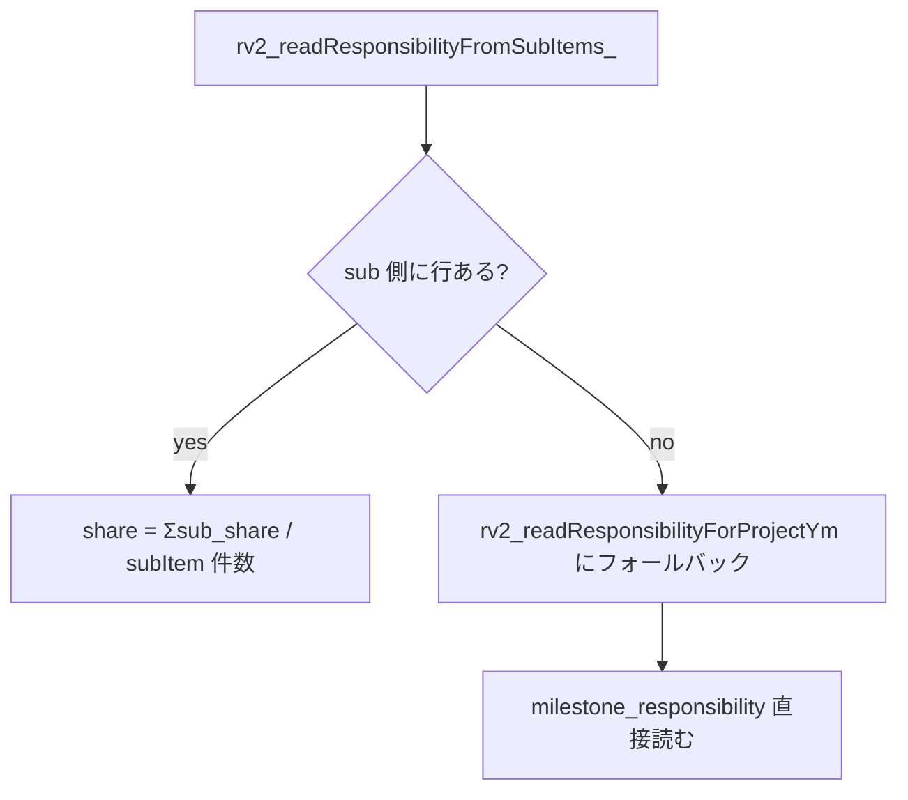

# 報酬計算ロジック 詳細仕様

メンバーの月次報酬がどう決まるかの **計算正本**。 数式・入力データ・優先順位・キャップ制御まで一通り。 現行PWAの計算実装は `pwa/src/lib/reward-summary.ts`、GAS互換実装は `gas/059_RewardV2_Ops.js`。ここはそれを読み手向けに明文化したもの。

メンバー向け使い方は [2-2 章 メンバーの日常ワークフロー](2-2-member-workflows-quick-start.md)、 admin 入口は [6-5 章 Admin Payouts / 支払通知書](6-5-admin-payouts-reward-notice-spec.md) を見る。

---

## まず一行で

> **「PJ 予算 × 65% から控除を引いた金額」を、 「その月の MS 消化度合」と「メンバーごとの背負い度 (share)」で按分する**。

つまり、 PJ がたくさん進んだ月はみんなの報酬が増えて、 進まなかった月は少なくなる。 同じ MS でも、 share が大きい人ほど多く取る。

---

## 用語

| 用語 | 意味 |
|---|---|
| `feeAmount` | PJ の月額固定費 (= `projects.feeAmount`) |
| `monthlyGross` | `feeAmount × 0.65` (= AMD の月次総原資) |
| `grossBudget` | `monthlyGross × cycleMonths` (= 計画サイクル全期間の総原資) |
| `deductionTotal` | サイクル全期間の控除累計 (= `pj_deductions` から計算) |
| `netBudget` | `grossBudget − deductionTotal` (= 実際に分配できる原資) |
| `totalPt` | 計画サイクルの総ポイント (= `value_plan_cycles.total_points`、 通常 100) |
| `ptUnit` | `round(netBudget / totalPt)` (= 1pt あたりの円換算) |
| `cumPct` / `prevCumPct` | MS の累計進捗率と前月累計 |
| `thisMonthPct` | `cumPct − prevCumPct` (= 当月増分) |
| `consumedPt` | MS の当月消化 pt = `maxPt × thisMonthPct / 100` |
| `plannedShare` | MS 設計時点の予定担当比率 (= `milestone_responsibility.share`) |
| `actualShare` | 当月の活動ログから算出・確認した実績配分 (= `milestone_monthly_contribution_allocations.actual_share`) |
| `share` | 報酬計算に使う比率。`actualShare` が `auto_applied` / `confirmed` / `pm_override` なら実績配分、なければ `plannedShare` |
| `earnedPt` | メンバーの当月獲得 pt = `Σ_ms (consumedPt × share)` |
| `basePay` | `round(earnedPt × ptUnit)` (= ベース報酬) |
| `bonusPt` | bonus ポイント (= **現状 0 固定**、 後述) |
| `totalPay` | cap 前は `basePay + bonusPt`、 cap 後は実支払額 |
| `grossDue` | `totalPay + carryIn` (= cap 前にメンバーが「本来もらえる額」) |
| `capBudgetYen` | 月次の支払上限 |
| `carryIn` | 前月から繰越された未払い分 |
| `stockYen` / `deferredYen` | cap 超過で翌月へ繰り越す分 (= 同義) |

---

## 計算式 (= 公式)

```text
# 原資
monthlyGross   = feeAmount × 0.65
grossBudget    = monthlyGross × cycleMonths
deductionTotal = Σ_ym (Σ_active_deductions (rate% × monthlyGross or fixedAmount))
netBudget      = max(0, grossBudget − deductionTotal)
ptUnit         = round(netBudget / totalPt)                  # totalPt = 0 のとき ptUnit = 0

# 当月消化 pt (MS ごと)
thisMonthPct      = max(0, cumPct − prevCumPct)
consumedPt[ms]    = ms.maxPt × thisMonthPct / 100
monthlyConsumedPt = Σ_ms consumedPt[ms]

# 個人配分
earnedPt[member]  = Σ_ms (consumedPt[ms] × share[member, ms]) # share は実績配分優先
basePay[member]   = round(earnedPt[member] × ptUnit)
totalPay[member]  = basePay[member] + bonusPt[member]        # bonusPt は現状 0

# キャップ制御 (= 月次支払上限)
grossDue[member]  = totalPay[member] + carryIn[member]
if Σ grossDue ≤ capBudgetYen:
    paid[member]     = grossDue[member]
    stockYen[member] = 0
else:
    paid[member]     = round(capBudgetYen × grossDue[member] / Σ grossDue)  # 按分
    stockYen[member] = grossDue[member] − paid[member]                       # 翌月へ繰越
```

---

## 入力データ (= source of truth)

| データ | テーブル | 取得条件 |
|---|---|---|
| 計画サイクル | `value_plan_cycles` | `project_id = pid AND status = 'fixed'` (= 必須、 無いと error) |
| マイルストーン | `value_milestones` | `plan_cycle_id` 一致 AND `is_active = true` AND `goal_level = 'annual'` |
| 月次進捗 | `milestone_monthly_progress` | `plan_cycle_id` 一致 (= 全 ym) |
| MS 背負い度 (= sub) | `milestone_sub_items` + `sub_item_responsibility` | `projectId` 一致 (= 優先) |
| MS 背負い度 (= MS直接) | `milestone_responsibility` | sub 側が空のときの fallback |
| 当月MS実績配分 | `milestone_monthly_contribution_allocations` | `(milestone_id, ym, member_id)`。`status in ('auto_applied','confirmed','pm_override')` だけ報酬計算に使用 |
| メンバー活動ログ | `member_activities` | `project_id` / `ym` / `milestone_id` が一致する活動から自動実績配分を算出 |
| PJ 固定費 | `projects.feeAmount` | `projectId` 一致 |
| 月次控除 | `pj_deductions` | active 行を期間内 ym で全月集計 |
| 月次予算 cap | `billing_cycles.budget_yen` | `(project_id, ym)` 一致 (= 優先) |
| 前月繰越 | `billing_cycles.reward_summary_json` (= 前月分) | `members[*].stockYen` / `deferredYen` |
| メンバー名 | `members.codeName` / `name` | コードネーム解決用 |

---

## 進捗ソースの優先順位

`milestone_monthly_progress` の `source` 列で同じ MS × ym に複数行あるとき、 当月値はこの優先順位で決まる:

| 優先度 | source | 意味 |
|---|---|---|
| 3 | `pm_manual` / `pm_confirmed` | PM が手入力 / 確認した値 (= 最強) |
| 2 | `criteria_toggle` | success_criteria のチェック完了で自動算出 |
| 1 | `routine_auto` | routine タグ MS の期間按分自動補完 |
| 0 | `tsukuyomi_estimate` | LLM 推定値 (= 最弱) |

**前月累計 (prevCumPct) は別ルール**: `pm_manual` / `pm_confirmed` / `criteria_toggle` の **TRUSTED な値だけ** を採用 (= LLM 推定や routine_auto は前月の base として信用しない)。 これは「当月増分」を「LLM がいい加減に上げた前月値の差分」にしないため。

---

## routine タグ MS の自動進捗補完

`tag = 'routine'` の MS は、 計画サイクル期間で均等に按分されると見なす。

```text
routineMonthPct = 100 / totalMonths             # 1 ヶ月あたりの進捗 %
elapsed         = (当月 − サイクル開始月) + 1
autoCumPct      = min(100, round(routineMonthPct × elapsed, 1 桁))
```

ただし **同月 ym に `pm_manual` / `pm_confirmed` / `criteria_toggle` の進捗が既にあれば、 そっちを優先** (= 自動補完は上書きしない)。

自動補完値は `allProgress` 配列に in-memory で push されるだけで **DB に書かない** (= `milestone_monthly_progress` は触らない)。

---

## 予定担当比率と当月実績配分

`milestone_responsibility.share` は計画時の予定比率であり、その月に実際に誰が動いたかとは分けて扱う。

1. `member_activities(project_id, ym, milestone_id)` から、活動者・`raw_metadata.responsibilities`・`impact`・`depth`・source種別を重みづけして、MS月ごとの `actualShare` 自動案を作る
2. 自動案の確信度がしきい値以上なら `status='auto_applied'` として `milestone_monthly_contribution_allocations` に保存し、報酬計算に使う
3. 確信度が低い場合は `status='needs_review'` として保存するが、報酬計算では使わず `plannedShare` にfallbackする
4. PM/admin が明示調整した場合は `status='confirmed'` / `pm_override` として保存し、自動案より優先する

例: SX の `PoC先候補開拓` が予定 `まさ50% / かる50%` でも、5月の `member_activities` がまさ側だけなら、その月の `actualShare` は `まさ100% / かる0%` になり、報酬もそれで計算する。

### 4月稼働分の固定

202604 の支払額はすでに確定済みなので、実績配分を後から適用しない。`ym=202604` は `member_activities` / `milestone_monthly_contribution_allocations.actual_share` を無視し、従来どおり `milestone_responsibility.share` で計算する。

支払通知書PDFでは、ここで決まった税抜支払額に消費税10%だけを上乗せする。

## responsibility 解決順序

メンバー × MS の share は 2 段階で決まる:



**Sub 優先のロジック**:

1. `milestone_sub_items` から `subItemId → milestoneId` の対応を作る
2. `sub_item_responsibility` を `(subItemId, memberId)` でループ
3. MS 単位に集約: `share = Σ (sub_share) / そのMSの subItem 総数`
4. = sub レベルで分担を入れてあれば、 自動的に MS レベル share に丸め込まれる

**Fallback**: sub 側に 1 行も無ければ `milestone_responsibility` の `(milestone_id, member_id, share)` をそのまま使う。

---

## ptUnit の決まり方 (= 数値例)

ZMP (= `feeAmount = 300,000`, `cycleMonths = 12`, `totalPt = 100`, `deduction なし`) の場合:

```text
monthlyGross  = 300,000 × 0.65 = 195,000
grossBudget   = 195,000 × 12   = 2,340,000
deductionTotal = 0
netBudget     = 2,340,000
ptUnit        = round(2,340,000 / 100) = 23,400 円/pt
```

= **1 pt 消化したメンバーには 23,400 円が割り当てられる**。 MS が 30pt のものをひとりで 50% 進めれば、 `30 × 0.5 × 23,400 = 351,000 円` (cap 前) になる。

---

## bonusPt (= 現状 0 固定)

`rv2_calcRewardSummary` の出力では `members[*].bonusPt = 0` で固定されている。 旧 rv1 系 (`gas-main/052_RewardScoring_Ops.js` 経由の `appreciationBonus`) は廃止済み。

将来再実装する場合は:
- どこから採点入力するか (= /admin/payouts の admin 入力 / つくよみ自動 / メンバー相互投票)
- `billing_cycles.reward_summary_json` のどこに格納するか
- ptUnit との関係 (= bonusPt も ptUnit で円換算するのか、 円直入力か)

を決めてからこの章とコードを同時更新する。

---

## 月次キャップ (= `rv2_applyMonthlyCap_`)

### capBudgetYen の決まり方

```text
1. billing_cycles.budget_yen が > 0     → これを使う (= admin が予算確定済)
2. fallback: feeAmount × 0.65            → monthlyGross をそのまま cap に使う
3. fallback: planCycle.budgetYen / cycleMonths → サイクル予算の月按分
```

### キャップ超過時の按分

`Σ grossDue ≤ cap` ならそのまま全額支払 (= `capped = false`)。

`Σ grossDue > cap` のとき:

```text
remainingCap = cap
remainingGross = Σ grossDue
for each member in members:                      # earnedPt 降順
    if 最後のメンバー:
        paid = remainingCap                       # 端数誤差を最後に押し込む
    else:
        paid = round(remainingCap × grossDue / remainingGross)
    paid = max(0, min(grossDue, paid))            # クランプ
    deferred = grossDue − paid
    member.totalPay  = paid
    member.stockYen  = deferred                   # 翌月 carryIn
    remainingCap   -= paid
    remainingGross -= grossDue
```

端数処理: 各メンバーで `round` がかかるので、 微小な端数誤差は **最後のメンバーに集約** する。 これで `Σ paid = cap` が保証される。

### 前月繰越 (= carryIn)

前月 `billing_cycles.reward_summary_json.members[*].stockYen` を読んで `carryIn[memberId]` として加算。

特例: **当月の members 配列に居なくても、 前月 stockYen が残ってるメンバーは「carry-only 行」として members に追加** される (= `earnedPt = 0, basePay = 0, grossDue = carryIn`)。 これで「過去に働いて未払いだったメンバー」が忘れ去られない。

---

## 出力構造 (= `reward_summary_json`)

`billing_cycles.reward_summary_json` にキャッシュされる JSON:

```json
{
  "totalPaySum": 195000,
  "totalGrossDueYen": 251000,
  "capBudgetYen": 195000,
  "capped": true,
  "carryInYen": 32000,
  "carryOverYen": 56000,
  "monthlyBudget65": 195000,
  "planCycleId": "pc_xxx",
  "annualBudget": 3000000,
  "grossBudget": 2340000,
  "deductionTotal": 0,
  "netBudget": 2340000,
  "totalPt": 100,
  "ptUnit": 23400,
  "monthlyConsumedPt": 8.5,
  "cumulativeConsumedPt": 42.3,
  "progressRate": 42.3,
  "expectedRate": 33.3,
  "milestones": [
    {
      "milestoneKey": "ms_xxx",
      "title": "...",
      "maxPt": 30,
      "tag": "normal",
      "progressPct": 5.0,
      "pctUsed": 60.0,
      "consumedPt": 1.5,
      "cumPct": 60.0,
      "cumPt": 18.0,
      "source": "pm_manual"
    }
  ],
  "members": [
    {
      "memberId": "ID001",
      "memberName": "...",
      "earnedPt": 4.5,
      "basePay": 105300,
      "bonusPt": 0,
      "totalPay": 95000,
      "carryInYen": 0,
      "grossDueYen": 105300,
      "cappedFrom": 105300,
      "deferredYen": 10300,
      "stockYen": 10300,
      "breakdown": [
        { "msKey": "ms_xxx", "title": "...", "msConsumedPt": 1.5, "share": 1.0, "earnedPt": 1.5 }
      ]
    }
  ]
}
```

---

## 再計算トリガ

`reward_summary_json` は **キャッシュ**。 計算が走るのは以下のときだけ:

| トリガ | 入口 |
|---|---|
| 自動 (日次 03:05 JST) | `/api/cron/payout-reward-cache-refresh` |
| 手動ボタン | `/admin/payouts` の「報酬キャッシュ再計算」 |
| 保存系操作 | `/admin/payouts` で「支払データ保存」「通知書発行」「送付済化」を叩いたとき (= `refreshRewards=1` 付与) |

**通常 GET (= `/admin/payouts?ym=YYYYMM` を開くだけ) は絶対に再計算しない**。 過去事故: GET でも自動再計算してた頃、 admin が画面開いただけで承認済の過去月の数字がズレるという UX 事故が発生 (= 6-5 章「通常 GET は読むだけ原則」参照)。

## 月初合意との境界

`/monthly-agreement` は、この章の計算結果 (`reward_summary_json` / `member_allocations_json`) と MS/share 条件を本人へ表示し、`member_monthly_work_agreements.snapshot_json` と `snapshot_hash` に保存する確認レイヤー。合意 API は報酬キャッシュを再計算せず、`milestone_monthly_progress`、`milestone_responsibility`、`billing_cycles` も書き換えない。

snapshot hash が変わったときは「条件更新あり」として再合意を促す。これは報酬計算の入力変更ではなく、本人/admin が条件変更を見落とさないための状態。

---

## edge case と過去ハマり

| ケース | 挙動 |
|---|---|
| `value_plan_cycles.status='fixed'` が無い PJ | `rv2_calcRewardSummary` は `{ error: "planCycle not found" }` を返す。 admin/payouts では「MSなしPJ 強制報酬確定」ルートを使う ([6-5 章](6-5-admin-payouts-reward-notice-spec.md#msなしpj-強制報酬確定)) |
| `pj_deductions` テーブル未作成 | `try/catch` で `deductionTotal = 0` にフォールバック |
| MS に responsibility 未設定 | そのメンバーには配分されない (= 0 円)。 routine MS で起こりがち |
| routine MS の前月補完 | 前月分の `routine_auto` も `allProgress` に push される。 ただし当月に pm_manual があれば自動補完は skip |
| 端数誤差 | キャップ按分は最後のメンバーに `remainingCap` を全部押し込む → `Σ paid = cap` 保証 |
| 当月 0 円なのに前月 stockYen 残 | carry-only 行として members に追加され、 前月分が今月支払われる |
| MSなしPJ | admin が `/admin/payouts` の「MSなしPJ 強制報酬確定」から PJ × 稼働月 × メンバー × 支払額を手入力。 source = `admin_manual_payout`。 ([6-5 章](6-5-admin-payouts-reward-notice-spec.md#msなしpj-強制報酬確定)) |

---

## トラブル時

| 症状 | 確認場所 |
|---|---|
| 自分の報酬が 0 円 | `milestone_responsibility` or `sub_item_responsibility` に自分の `share` 行があるか / `milestone_monthly_progress` の `progress_pct` が 0 でないか / `value_plan_cycles.status='fixed'` か |
| ptUnit が 0 | `projects.feeAmount` が 0、 または `value_plan_cycles.total_points` が 0 |
| 報酬が前月より急に増減 | `pj_deductions` の active 期間変更、 または cap budget の変更 (= `billing_cycles.budget_yen` 上書き) |
| stockYen が永遠に残る | cap が常に gross を下回り続けてる → cap budget 見直し or 控除見直し |
| routine MS で配分が偏る | sub_item_responsibility が一部メンバーしか入ってない可能性。 全員に share を入れるか、 milestone_responsibility に fallback させる |
| キャッシュが古い | `/admin/payouts` の「報酬キャッシュ再計算」を押す or `payout-reward-cache-refresh` cron 実行履歴を確認 |

---

## 関連

- 計算正本: `gas-main/059_RewardV2_Ops.js` (= `rv2_calcRewardSummary`)
- データ取得: `gas-main/058_RewardV2_Repo.js` (= `rv2_readProgressForPlanCycle`, `rv2_readResponsibilityFromSubItems_`, `rv2_readResponsibilityForProjectYm`)
- 控除計算: `gas-main/043_PjDeductions_Repo.js` (= `pjDed_calcCycleDeductionTotal_`)
- 試算 (= UI 上のシミュレーション): `gas-main/060_RewardV2_Estimator.js`
- メンバー側表示: [2-2 章 メンバーの日常ワークフロー](2-2-member-workflows-quick-start.md)
- /mypage 仕様: [6-6 章 Member Ops / Billing / Prompt](6-6-member-billing-prompts-spec.md#mypage)
- /admin/payouts 仕様: [6-5 章 Admin Payouts / 支払通知書](6-5-admin-payouts-reward-notice-spec.md)
- DB schema: [`pwa/design/db_schema.md`](../design/db_schema.md) (= `billing_cycles`, `value_milestones`, `value_plan_cycles`, `milestone_monthly_progress`, `milestone_responsibility`, `milestone_sub_items`)
- 設計: [`pwa/design/ms_progress.md`](../design/ms_progress.md) (= MS 進捗の source 設計)
- 設計: [`pwa/design/progress_estimation.md`](../design/progress_estimation.md) (= LLM 進捗推定)
