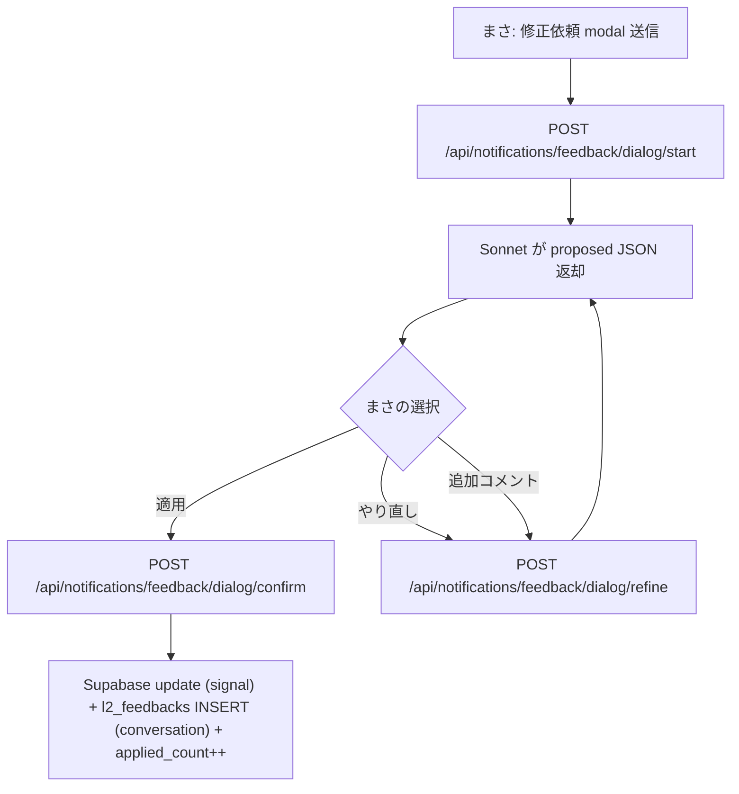

# Knowledge Admin / Tsukuyomi 仕様

`/admin/protocols` / `/admin/contexts` / `/admin/tsukuyomi` の admin 画面と、 つくよみ修正依頼 (= dialog 対話型 feedback API) の仕様。

> つくよみは AMD OS 内の月モチーフ・バッチ系 LLM 人格。 daily / hourly cron の抽出を担当する役。 一方で、 ユーザーが画面上で対話的に「ここ違うよ」と修正依頼を投げる先でもある (= 同じ人格、 異なる起動経路)。

## /admin/protocols

AMD Protocol (= L2 ②) の確認・編集画面。 詳細仕様は [`pwa/design/amd_protocol.md`](../design/amd_protocol.md) と [8-3 章 §② AMD Protocol](8-3-l2-extraction-routines-spec.md)。

### AMD Protocol の正本構造 (= Phase 4.5、 2026-05-11 確定)

| 概念 | テーブル | 意味 |
|---|---|---|
| 普遍的な意思決定パターン | `protocols` | 固有 PJ 名 / 人名を含まない、 横断する経営判断パターン |
| 具体事例 (= 1:N) | `protocol_examples` | 該当パターンが起きた PJ / 日付 / 事例固有の 3 要素 |
| 結果の時系列観測 | `protocol_result_observations` | 1m / 3m / 6m / 12m / 24m の append-only ledger |

### `protocols` 列

| column | 値 |
|---|---|
| `protocol_id` | `p4u-{sha12(title)}` (= タイトル hash、 PJ 横断で同タイトル = 同 ID) |
| `project_id` | **NULL** (= 普遍プロトコル、 紐付けは examples 側) |
| `title` | 20-40 字、 普遍的な見出し |
| `content` | markdown で 4 要素 (= ① 分岐点 🔀 / ② 判断材料 📊 / ③ アクション 🎯 / ④ 結果 💡) |
| `status` | `candidate` → `confirmed` (= 正式昇格) → `rejected` / `archived` |
| `importance` | 1 (軽微) / 2 (中) / 3 (重大) |
| `kind` | `pattern` (= 普遍) / `legacy_specific` (= 旧形式) |
| `is_universal` | true (= pattern なら) |

**「単純な事実」(= 設立日 / 氏名 / 資金調達額 等) はプロトコルにしない**。 これらは `project_knowledge.basic_fact` カテゴリに分類 (= `sync-pj-facts` cron 経由)。

### `protocol_examples` 列

| column | 値 |
|---|---|
| `protocol_id` | 参照、 `ON DELETE CASCADE` |
| `project_id` / `occurred_on` | 事例の PJ と日付、 UNIQUE 制約 |
| `summary` | 50-150 字 |
| `branch_point` / `criteria` / `action_taken` | 事例固有の 3 要素 |
| `result` | **自動抽出時は NULL** (= 後追い記録、 まさが UI 経由で編集) |
| `source_meeting_id` / `source_url` | 出典 |

### `protocol_result_observations` 列 (= append-only ledger)

| column | 値 |
|---|---|
| `observed_on` | 観測日 |
| `horizon` | `immediate` / `1m` / `3m` / `6m` / `12m` / `24m` / `long_term` |
| `valence` | `positive` / `negative` / `mixed` / `neutral` / `unknown` |
| `confidence` | `low` / `medium` / `high` |
| `summary` | 観測内容 |
| `evidence_source_type` / `_id` / `_url` | 根拠 |

「1 年後に正しく見えた判断が、 2 年後には別の副作用を生む」 状況を扱うため、 結果は 1 欄上書きせず時系列で積む (= まさ #57 2026-05-21)。

`/admin/protocols` では P0 として、各プロトコルの展開領域に `protocol_result_observations` を read-only の outcome ledger として表示する。表示対象は horizon / valence / confidence / summary / PJ ID / evidence category / 短い reference id までで、`evidence_url` や source permalink、実本文、prompt全文、few-shot、score weight / threshold / calibration は出さない。同じ horizon に異なる valence がある場合だけ `矛盾観測` chip を出す。

### 画面 UI

`pwa/src/components/admin/AdminProtocolsClient.tsx` が client 本体。 各 protocol カードは:

- ステップカード (= 4 要素を色分けで表示):
  - 🔀 ① 分岐点 (青 `bg-blue-50`)
  - 📊 ② 判断材料 (橙 `bg-amber-50`)
  - 🎯 ③ アクション (緑 `bg-emerald-50`)
  - 💡 ④ 結果 (紫 `bg-violet-50`、 記録時のみ表示)
- 📂 関連事例リスト (= protocol_examples を日付順)
- 結果観測 ledger (= protocol_result_observations を時系列で表示、P0 は read-only)
- アクション: ✅ 確定 (`status='confirmed'`) / 🔄 修正依頼 / ❌ 却下 / 📥 archive

`parseFourElements(content)` で `**① 分岐点**:` 等の見出しから自動分解する。

## /admin/contexts

つくよみが LLM 呼び出し時に system role として注入する **context** (= 旧スプシ system prompt 群) を管理する画面。 6-6 章の `/admin/prompts` と並列。

### `tsukuyomi_context` 列

| column | 値 |
|---|---|
| `context_id` | `ctx_xxx` 形式の text PK |
| `tags` | 適用 scope の csv (= `meeting`, `monthly_report`, `protocol_extract` 等) |
| `priority` | 注入順序 (= 小さい数字が先) |
| `system_prompt` | system prompt 本文 |
| `status` | `active` / `archived` |

### 注入ロジック

つくよみ呼び出し側 (= 各 L2 抽出 routine / dialog API 等) は:

1. 自分のスコープに該当する `tags` を絞る
2. `status='active'` のみ
3. `priority ASC` で並べる
4. `system_prompt` を `\n\n` で連結
5. LLM の system role として渡す

### 旧スプシからの同期

GAS `R172_TsukuyomiContextRepo` が `CFG_TsukuyomiContext` スプシ → Supabase へ同期する (= 過去のスプシ context 20+ 件をここから引っ張ってきている)。 まさが「過去のスプシプロンプトが消えてる」と感じる時は、 まずこの table の `status='active'` 行を確認する。

## /admin/tsukuyomi (= つくよみ学習)

つくよみが対話・cron から得た「学んだこと」のレビュー画面。

### `tsukuyomi_learnings` 列

| column | 値 |
|---|---|
| `scope` | `global` / `project` / `member` |
| `scope_key` | scope に応じた key (= `project_id` 等) |
| `content` | 学習内容 (= 自然文) |
| `source` | 学習源 (= `slack`, `meeting`, `dialog` 等) |
| `source_ref` | 元データへの参照 |
| `status` | `active` / `archived` |
| `created_by` | 作成者 (= 人 / `cron` / `dialog`) |
| `removed_at` / `removed_by` / `removed_reason` | 削除履歴 (= soft delete) |

### `tsukuyomi_learnings_status` (= 学習適用ステータス)

| column | 値 |
|---|---|
| `scope` | 学習スコープ |
| `target_project_id` | 適用先 PJ |
| `lesson_text` | 学んだ短文 |
| `source_feedback_id` | 元 `l2_feedbacks` の id |

`tsukuyomi_learnings` が抽象な「学んだこと」、 `tsukuyomi_learnings_status` が「どの PJ に何が適用されたか」のスナップショット。

### `tsukuyomi_memory` (= 短期記憶)

Slack 等の conversation から拾った「忘れちゃダメな短期メモ」。 `status='active'` の memory_id が cron / dialog の system prompt に注入される。

### `tsukuyomi_nudge_queue` (= 督促キュー)

つくよみがまさに対して「これ次やった方がいいですよ」と nudge を送るためのキュー。 status: `ready` → `posted` (= `posted_at` set)。 Slack DM 経由で送信される。

### `tsukuyomi_sessions` / `tsukuyomi_chat_logs` / `tsukuyomi_usage_log`

| table | 役割 |
|---|---|
| `tsukuyomi_sessions` | 1 dialog session 単位 (= session_id) |
| `tsukuyomi_chat_logs` | session 内の各メッセージ (= role / content / applied_actions JSON) |
| `tsukuyomi_usage_log` | LLM コスト追跡 (= 入出力 tokens / cache hit / cost_usd / cost_jpy) |

## つくよみ修正依頼 (= dialog 対話型 feedback API)

L2 抽出結果 (= 経営ハイライト / プロトコル / PJ ナレッジ / MTG サマリ 等) に対して、 まさが UI 上で「ここ違う」を投げる **対話型 loop**。 一方通行 update は廃止 (= まさ #34 2026-05-25)。

2026-05-28 以降、右下に常駐していた visible つくよみマスコットは非表示。画面内の明示的な「つくよみに修正依頼」導線は `TsukuyomiChatBridge` が `tsukuyomi:open` event を受けて drawer を開く。

### フロー (= 案 A 採用、 dialog 永続化なし)



### API 3 つ

| API | body | 役割 |
|---|---|---|
| `POST /api/notifications/feedback/dialog/start` | `{ l2_kind, target_id, scope_key, initial_feedback }` | Sonnet で proposed 生成、 dialog_id (= client 発行 UUID) 返却 |
| `POST /api/notifications/feedback/dialog/refine` | `{ dialog_id, additional_hint? / additional_feedback?, previous_proposed }` | 過去 proposed + 追加 hint で再生成 |
| `POST /api/notifications/feedback/dialog/confirm` | `{ dialog_id, proposed, conversation }` | 適用: 対象 signal を Supabase update + `l2_feedbacks` に conversation 全体を保存 |

dialog_id は client 側で UUID 発行、 サーバは state を持たない (= 案 A)。 history (= 過去 proposed + hints) は client が body で渡す。

### `l2_feedbacks` への保存

| column | 値 |
|---|---|
| `l2_kind` | `strategy_signal` / `protocol` / `project_knowledge` / `meeting_summary` 等 |
| `target_id` | 対象 row の PK (= signal_id 等) |
| `scope_key` | `{ym}:{slug}` 形式 (= `202605:protocol:p4u-xxxxx` 等) |
| `feedback_text` | conversation 全体 (= まさの修正依頼 + つくよみ proposed 履歴) |
| `status` | `active` (= 次回 routine 発火時に prompt に注入される) |
| `applied_count` | confirm されるたび ++ |
| `last_applied_at` | 直近 confirm 時刻 |

`status='active'` の `l2_feedbacks` は、次回 subscription automation 発火時に同 `l2_kind` / `target_id` / `scope_key` で SELECT され、LLM の prompt に「過去にまさが指摘した修正依頼」として注入される (= [8-3 章 §冪等性と通知](8-3-l2-extraction-routines-spec.md#冪等性と通知))。

### Sonnet プロンプト (= 案 A)

```text
あなたは AMD OS の経営ハイライトを、 まさからの修正依頼に基づいて
対話的に改訂するつくよみ。

入力:
- 現在の signal (= title/summary/impact_level/signal_type/polarity 等)
- 過去の修正依頼 (= 時系列)
- 今回のまさの修正依頼 (= 初回または追加)
- 過去の proposed (= refine の場合)

出力 JSON:
{
  "proposed": {
    "title": "...",
    "summary": "...",
    "impact_level": "critical|high|medium|low",
    "signal_type": "...",
    "polarity": "+|-|=",
    "score_impact_summary": "...",
    "applied_feedback_summary": "<反映した修正依頼の 1 文要約>"
  },
  "reasoning": "まさの修正依頼を受けて、 〜〜のように改訂しました。
                これでいい? 何か追加で変更したいことがあれば教えて。"
}

JSON 以外の文字一切出力禁止。
```

### 適用範囲

| L2 | 対話型 dialog 接続状態 |
|---|---|
| ⑨ 経営ハイライト (= `project_strategy_signals`) | ✅ 接続済 (= まず実装、 動作確認用) |
| ② AMD Protocol | 🚧 横展開予定 |
| ④ PJ ナレッジ | 🚧 横展開予定 |
| ⑤ メンバーナレッジ | 🚧 横展開予定 |
| ⑥ MTG サマリ | 🚧 横展開予定 |

## DB 関係マップ

```mermaid
flowchart LR
  A[/notifications &lpar;UI&rpar;] -->|修正依頼 submit| B[dialog/start API]
  B --> C[Sonnet 4.6]
  C --> D{まさ判断}
  D -->|適用| E[dialog/confirm API]
  E --> F[l2_feedbacks INSERT]
  E --> G[signal/protocol UPDATE]
  F -.->|next automation 発火| H[subscription automation fetch active feedbacks]
  H --> I[LLM prompt に注入]
  I --> J[次回抽出に反映]
```

## トラブル時

| 症状 | 確認場所 |
|---|---|
| `/admin/protocols` で候補だけしか出ない | `protocols.status='candidate'` のまま、 まさが UI で confirmed 昇格してない |
| `/admin/contexts` で system prompt が反映されない | `tsukuyomi_context.status='active'`、 `tags` 一致、 priority 順を確認 |
| 修正依頼が次回 routine で反映されない | `l2_feedbacks.status='active'`、 `applied_count` がインクリメントされてるか、 該当 routine が `l2_feedbacks` を fetch してるか |
| dialog confirm 後にカードが更新されない | UI 側の client state、 `signal` の Supabase update 成功、 `applied_count++` |

## 関連

- 設計: [`pwa/design/amd_protocol.md`](../design/amd_protocol.md) (= AMD Protocol 詳細)
- 設計: [`pwa/design/feedback_dialog.md`](../design/feedback_dialog.md) (= dialog 対話型ループの設計議論)
- 設計: [`pwa/design/score_revision_feedback_loop.md`](../design/score_revision_feedback_loop.md) (= score 系の修正依頼接続)
- 8-3 章 [L2 Extraction Routines](8-3-l2-extraction-routines-spec.md) (= 各 L2 routine と feedback 接続)
- 8-2 章 [通知レビュー UI / 経営ハイライト確認](8-2-notification-review-and-strategy-signals-spec.md) (= notifications 側の UI)
- 3-3 章 [通知・修正依頼・正本反映ゲート](3-3-notifications-and-tsukuyomi.md) (= ユーザー向け概念)
