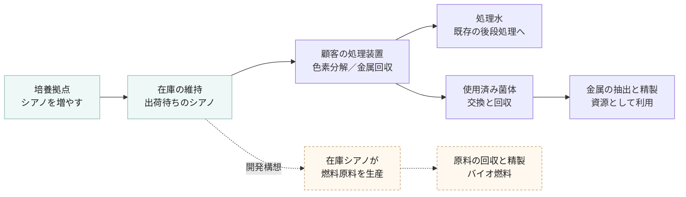
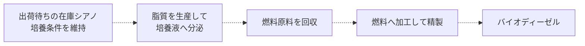

## 1. 培養と在庫から始まる製品の全体像

SOLは、好熱性シアノバクテリアを培養し、工場の既存排水設備に追加する処理装置と、菌体の継続供給、交換、回収を組み合わせたシステムを開発している。
主な用途は、着色排水の色素分解と、金属を含む排液からの資源回収である。

培養拠点で保有する出荷待ちのシアノには、在庫として維持する間に燃料原料を生産させ、その原料を回収してバイオ燃料にする構想を組み合わせる。
顧客への菌体供給と、在庫シアノによる燃料生産を、培養基盤からつながる二つの流れとして設計する。

図は提供を目指す製品の構成を示す。
燃料生産の破線部分は開発構想であり、出荷待ち在庫を用いた継続生産の実証と、排水処理向けの出荷品質との両立を確認する段階にある。

## 2. 顧客へ提供する装置と運用

顧客の排水ラインに処理装置を追加し、SOLの培養拠点から供給する菌体を使って対象物質を処理する。
既存設備との接続、必要な前処理、処理後水を戻す位置は、顧客の工程と排水性状に合わせて設計する。

| 提供するもの | 製品で担う役割 |
|---|---|
| 処理装置 | 菌体と排水を接触させる反応部、菌体を保持するフィルター、送液と流量管理を組み合わせる。閉じた流路で菌体の流出を抑える設計とする |
| 菌体の継続供給 | 対象排水に合う株と菌体量を選び、使用条件に合わせて供給する。循環カートリッジ型と槽への直接投入型を検討する |
| 導入と保守 | 既存設備との接続、運転条件の設定、逆洗や交換の手順、故障時の対応を整える |
| 交換と回収 | 使用済みの菌体や部材を回収する。金属回収用途では、回収した菌体から金属を取り出す工程につなぐ |

装置の初期導入と、菌体の定期供給や保守を組み合わせる提供形態を想定する。
供給頻度、作業分担、価格、回収物の所有権は、顧客ごとの導入条件と契約で定める。

## 3. 色素分解と金属回収の製品構成

色素分解と金属回収は、処理の目的、菌体の使い方、処理後に回収するものが異なる。
用途ごとに性能と運用条件を定める。

| 用途 | 主な対象 | 処理の流れ | 導入時に確かめること |
|---|---|---|---|
| 色素分解と脱色 | 染色工程などの着色排水 | 菌体と排水を接触させ、対象の色素を分解する。菌体を保持して処理水を後段へ送り、使用条件に応じて菌体を交換する | 色度の改善、分解後の生成物、後段処理への影響、菌体を使い続けられる回数 |
| 金属回収 | 対象金属を含む工場排液や工程液 | 菌体へ金属を取り込ませ、菌体を回収する。別工程で金属を抽出し、精製する | 金属ごとの取り込み量、共存成分の影響、出口濃度、菌体の回収率、金属の回収率と純度 |

銅、鉄、ニッケル、ネオジムなどの取り込みは、研究チームから実験室や一部の実排液での報告がある。
対象金属の種類と混ざり方で処理速度が変わるため、導入対象の実排液で評価する。
金属を抽出する際に菌体を使い切る工程は、在庫シアノを維持して燃料原料を生産する工程と分けて設計する。

## 4. 設置場所と顧客の作業

初期の導入先として、顧客工場の既存排水設備に追加するオンサイト方式を想定する。
既存の廃液処理業者の拠点に菌体と装置を供給するオフサイト方式も、展開候補に位置づける。

| 導入方式 | 設置と処理の場所 | 運用の考え方 |
|---|---|---|
| オンサイト | 排水を出す顧客の工場 | 顧客が日常の送液や運転を担い、SOLが菌体の供給、保守、交換回収の仕組みを提供する。具体的な分担は現場ごとに定める |
| オフサイト | 提携する既存の廃液処理業者の拠点 | 処理業者が回収、運搬、廃液処理を担い、SOLが菌体と装置を供給し、取り込んだ金属を取り出す構想。委託範囲と回収物の扱いは協議する |

設置前には、排水の成分と濃度、平均流量と変動、温度、pH、塩分、油分、既存の処理工程を確認する。
必要な設置面積、電源、配管、交換作業の動線も現地で確認する。
株と使用方法に応じた封じ込め、菌体の捕捉、異常時の停止、回収物の取扱いを導入条件に含める。

## 5. 顧客が得る価値と導入の判断条件

顧客にとっての価値は、現在の排水処理費や作業負担、要求される出口水質、回収資源の価値との比較で判断する。

| 狙う価値 | 成立を判断するための比較 |
|---|---|
| 排水処理の負担を減らす | 同じ入口条件と出口水質で、既存処理の薬剤、汚泥、設備、運転、保守の総費用と比較する |
| 排液中の金属を資源として利用する | 回収金属の量、純度、精製費、引取条件を確認し、菌体供給から回収までの費用と比べる |
| 既存設備を活用して導入する | 追加する装置と工事、必要な停止時間、既存工程との接続を確認する |
| 継続供給によって現場運用を支える | 出荷品質、保存期間、輸送後の性能、交換頻度、故障時の対応を確認する |

処理能力、出口水質、交換頻度、設備寸法、導入費は、対象排水と運転条件を揃えた実証で製品仕様へ落とし込む。
実験の結果や量産時の原価試算は、それぞれの条件を添えて示す。

## 6. 在庫シアノによるバイオ燃料生産

排水処理向けに保有するシアノが、出荷を待つ間にも燃料原料を生産する仕組みを目指す。
脂質を細胞の外へ分泌する株を開発し、培養液中に出た原料を回収して、バイオディーゼルへ加工する構想である。

研究チームからはラボスケールの燃料試作経験が報告されている。
在庫シアノを維持しながら原料を継続回収する工程は、分泌株の開発、生産速度、回収方法、運転期間、排水処理向けの性能維持を実証する必要がある。

事業化に向けては、在庫量と保有期間から得られる燃料量を測り、培養を続ける費用と原料の回収精製費を含めて採算を評価する。
販売する燃料の品質、使用先の要求、外部の加工や精製を利用する範囲も、この評価に合わせて定める。

## 7. 製品化の現在地

| 項目 | 現在確認できる範囲 | 製品化に向けて残る確認 |
|---|---|---|
| 排水処理性能 | 実験室での金属取り込みと脱色、一部の実排液での試験が技術台帳に記録されている | 対象顧客の実排液での反復試験、出口水質、処理流量、必要菌体量 |
| 処理装置 | カートリッジ型の試験と10Lリアクターでの鉄排液処理の報告がある | 連続運転、目詰まりと逆洗、菌体の流出防止、交換と再起動、現場規模への拡張 |
| 継続供給 | 培養、包装、輸送、現場投入、回収をつなぐ提供形態を設計している | 出荷基準、独立ロットの品質、使用期限、輸送後の性能、供給と保守の体制 |
| 金属の資源回収 | 金属を取り込んだ菌体から抽出精製する工程を想定している | 金属別の回収率と純度、精製費、回収物の取扱い、販売条件 |
| 在庫からの燃料生産 | ラボでの燃料試作報告を踏まえ、在庫シアノによる原料生産を製品構想に組み込む | 脂質分泌株、継続生産、原料回収、出荷品質との両立、燃料品質、採算 |

試験条件と研究上の結果は[技術説明資料](?tab=technology)、現場への提供形態と収益の流れは[ビジネスモデル](?tab=business-model)、費用の前提と感度は[コスト試算](?tab=cost-model)で確認できる。
