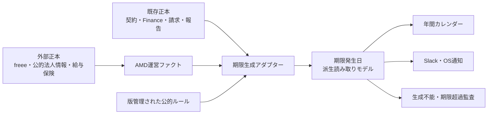

# AMD運営カレンダー仕様

> **状態**：実装済み（migration 178、`/admin/schedule`、派生生成・通知・再生成API）。本番DB適用とproduction deployをこのbundleで実施する。
> **対象画面**：`/admin/schedule`。
> **画面名**：AMD運営カレンダー。
> **実装担当モデル**：まさ指定の`5.6luna`。
> **設計確定日**：2026-07-16。

## 目的

AMD運営カレンダーは、税務、労務、契約、報告、請求、入金、支払、ガバナンスに関する期限を、既存の正本と公的ルールから自動生成するadmin画面である。

きよとまさは、この画面を開いて10秒以内に、次に発生する義務、期限、金額、担当、根拠、完了状態を判断できなければならない。

カレンダーは新しい入力台帳ではない。

予定を直接作成、編集、削除する機能は持たず、元データの状態を未来の期限へ変換する読み取りモデルとして動く。

## 固定原則

次の原則は、実装時に変更しない。

1. **手入力禁止**：カレンダー上に予定追加、日付編集、金額編集、担当者編集を置かない。
2. **正本参照**：契約、支払義務、請求、報告書、会社属性などの元データから期限を生成する。
3. **元データ修正**：誤りはカレンダーで上書きせず、契約台帳、Finance、PJ条件、会社情報、接続元サービスで直す。
4. **欠損可視化**：計算に必要な情報がなければ予定を捏造せず、`生成不能`と理由を表示する。
5. **決定的計算**：PWAの生成処理はLLMを呼ばず、同じ入力から同じ期限を作る。
6. **根拠保持**：すべての予定に、元テーブルまたは公的ルール、生成時の版、参照先を残す。
7. **二重計上禁止**：同じ義務を複数の入力が示しても、表示、金額集計、通知は一件に束ねる。
8. **不明額を0円にしない**：金額未取得と0円確定を分ける。
9. **通知のexact-once**：同じ期限、通知先、通知段階を重複送信しない。
10. **派生行を正本化しない**：生成済み予定は検索、通知、監査のための保存物であり、契約や法令の正本ではない。

## 利用者と判断

主利用者は、法人運営を担うきよと、経営判断を行うまさである。

きよは、納付、提出、請求、契約更新の実務へ移る直前にこの画面を開く。

まさは、年間の締切集中、今後の出金、未確定事項、担当の空白を確認するために使う。

画面が先頭で答える問いは次の四つである。

- 次に何が発生するか。
- いつまでか。
- いくら動くか、または金額をまだ取得できていないか。
- 誰が、どの正本を見て完了させるか。

## 対象範囲

### 初期実装に含めるもの

| 区分 | 予定の例 | 主な元データ |
|---|---|---|
| 税務 | 法人税確定申告、法人税中間申告、源泉所得税納付、法定調書、消費税関連 | AMD運営ファクト、公的ルール、`company_payment_obligations`、freee |
| 労務 | 社会保険料納付、労働保険年度更新、年末調整の社内工程、源泉徴収票交付 | AMD運営ファクト、公的ルール、給与と保険の外部ソース |
| 契約 | 締結予定、更新通知、満了 | `contracts` |
| 提出 | 月次報告書、年次報告書、契約上の成果物 | `contracts`、`contract_terms`、`projects.contract_terms_json`、`monthly_reports` |
| 支払 | 源泉所得税、社会保険料、住民税、労働保険料、法人税、消費税などの法定納付 | `company_payment_obligations`、AMD運営ファクト、公的ルール |
| 要対応 | 税務、法務、契約、ガバナンスの期限つき対応 | `action_items` |

### 後続拡張に含めるもの

- 補助金と助成金の実績報告、精算、事業終了期限。
- 特許、商標、年金、審査請求などの知財期限。
- 株主総会、取締役会、登記、公告などのAMD本体ガバナンス期限。
- 契約外の外部機関向け定期報告。

後続拡張も、カレンダーへの予定入力では実現しない。

対応する正本または自動抽出経路を先に作ってから、生成アダプターを追加する。

### 対象外

- 個人の会議予定。
- 作業時間を確保するためのGoogle Calendar枠。
- 廃止済みのPM月次ルーティン。
- 旧`/tasks`画面の復活。
- カレンダーから契約、支払義務、請求書、報告書を直接更新する機能。

## 全体構造

予定は、正本、事実、ルール、発生日の四段で生成する。



既存の正本を直接結合して画面表示するだけでは、通知の送信証跡と過去の期限変更を追えない。

一方、カレンダー用の独立した予定台帳を作ると、元データとの二重管理になる。

そのため、元データから決定的に再生成できる派生行を保存する。

## AMD運営ファクト

法定期限の計算には、AMD本体の属性が必要になる。

2026-07-16の設計時点では、`project_company_profiles`と`company_profile_entries`にAMD本体の構造化済み行は存在しない。

実装では、利用者に日付を入力させる代わりに、`company_operating_facts`を新設し、接続元から取得した事実を保存する。

### 必要な事実

| `fact_key` | 用途 | 想定する取得元 |
|---|---|---|
| `legal_name` | 法人の対象確認 | freee、公的法人情報 |
| `corporate_number` | 公的情報との同一性確認 | 公的法人情報、freee |
| `fiscal_year_end_month` | 法人税、消費税、決算工程 | freee、確定申告資料 |
| `withholding_payment_mode` | 源泉所得税の毎月納付または納期特例判定 | e-Tax関連資料、納付履歴、通知メール |
| `payroll_closing_day` | 年末調整と給与工程の社内期限 | 給与システム |
| `payroll_payment_day` | 年末調整と源泉徴収の対象月判定 | 給与システム、支払履歴 |
| `regular_payee_count` | 納期特例の適用可能性検査 | 給与システム、`members` |
| `social_insurance_enrollment` | 社会保険料予定の適用判定 | 日本年金機構通知、給与システム |
| `labor_insurance_enrollment` | 労働保険年度更新の適用判定 | 労働局通知、給与システム |
| `consumption_tax_filing_mode` | 消費税確定、中間申告の適用判定 | freee、申告資料 |
| `tax_return_extension` | 延長特例を含む申告期限判定 | 申請書、税務通知 |

### テーブル契約

`company_operating_facts`は、次の列を持つ。

| 列 | 役割 |
|---|---|
| `fact_id` | 行ID |
| `fact_key` | 事実の一意キー |
| `value_json` | 型を保持した値 |
| `source_kind` | freee、公的法人情報、給与、Gmail、documentなど |
| `source_ref` | 元データを確認する参照先 |
| `source_hash` | 同じ取得結果の重複保存防止 |
| `confidence` | 取得元と一致度に基づく信頼度 |
| `valid_from`、`valid_to` | 事実が有効な期間 |
| `observed_at` | 取得日時 |
| `verified_at` | 自動照合またはレビューの完了日時 |
| `superseded_at` | 後続の事実に置き換わった日時 |

`(fact_key, source_kind, source_hash)`に一意制約を置く。

ブラウザから`company_operating_facts`へ値を直接書かせない。

誤りを見つけた場合は、取得元の修正、接続の再同期、誤った候補の却下を行う。

カレンダー上で代替値を入力する操作は作らない。

### 取得元の優先順位

同じ事実が複数の取得元にある場合は、次の順で採用する。

1. 行政機関または提出済み資料の確定値。
2. freeeなど接続済み業務システムの確定値。
3. 契約書、納付書、申告書などの確認済み抽出値。
4. Gmail通知などの検知値。

下位の値が上位と食い違う場合は上書きせず、`生成不能`に`source_conflict`を出す。

## 公的ルールの正本

法令期限は、DB画面から編集できるマスタに置かない。

版管理されたコードとして`pwa/src/lib/admin-schedule/rules/`へ置き、テストと公式参照先を同じ変更束に含める。

### ルール定義

各ルールは次を持つ。

| 項目 | 内容 |
|---|---|
| `rule_key` | 変更しない一意キー |
| `rule_version` | 期限式または適用条件の版 |
| `category` | 税務、労務など |
| `effective_from`、`effective_to` | 適用期間 |
| `applicability` | 必要なAMD運営ファクトと判定式 |
| `date_formula` | 基準日から期限を作る式 |
| `date_adjustment` | 無補正、前営業日、翌営業日、年度別確定日のいずれか |
| `amount_resolver` | 金額の取得元と優先順位 |
| `owner_resolver` | 担当者の決定規則 |
| `notification_stages` | 通知段階 |
| `official_refs` | 公式参照先 |
| `review_after` | 次に公式情報を再確認する日 |

`review_after`を過ぎたルールは予定を消さない。

画面上で`ルール再確認期限超過`として表示し、期限自体とルールの鮮度を分けて扱う。

### 初期ルール群

| ルール | 計算に使う事実 | 日付の扱い | 金額の扱い |
|---|---|---|---|
| 法人税確定申告と納付 | 決算月、期限延長 | 事業年度終了を基準に公的ルールで計算 | 支払義務またはfreeeの確定値、なければ未取得 |
| 法人税中間申告と納付 | 事業年度、前期税額、適用要件 | 事業年度開始と中間期間から計算 | 前期実績を使える場合だけ見積額を出す |
| 源泉所得税通常納付 | 給与と報酬の支払月、納付方式 | 対象月の翌月期限を計算 | 納付書または支払義務を優先 |
| 源泉所得税納期特例 | 納期特例の適用事実 | 上期分と下期分を別々に計算 | 納付書または支払義務を優先 |
| 法定調書 | 支払実績、対象年 | 翌年の公的期限を使う | 金額を主要表示にしない |
| 源泉徴収票交付 | 給与支払実績、対象年 | 翌年の公的期限を使う | 金額を主要表示にしない |
| 社会保険料納付 | 加入状態、対象月 | 対象月の翌月末を公的休日規則で補正 | 納入告知額または支払義務を優先 |
| 労働保険年度更新 | 加入状態、年度 | 年度ごとに公表された期間と期限を使う | 申告額または支払義務を優先 |
| 年末調整工程 | 給与締日、給与支給日、対象者 | 給与工程と翌年提出期限から逆算 | 金額を主要表示にしない |

年末調整には、全社共通の単一の法定締日を仮定しない。

AMDの給与締日、最終給与処理、源泉徴収票と法定調書の期限から、必要な社内工程を自動生成する。

### 初期ルールの公式参照先

- [国税庁：法人税等の主な納期限](https://www.nta.go.jp/taxes/nozei/nofu/24200042/noufu_kigen.htm)
- [国税庁：法人税の中間申告](https://www.nta.go.jp/publication/pamph/hojin/aramashi2023/pdf/01.pdf)
- [国税庁：源泉所得税の納付期限と納期の特例](https://www.nta.go.jp/taxes/shiraberu/taxanswer/gensen/2505.htm)
- [国税庁：法定調書の提出義務者](https://www.nta.go.jp/taxes/shiraberu/taxanswer/hotei/7400.htm)
- [国税庁：年末調整のしかた](https://www.nta.go.jp/users/gensen/nencho/index/shikata.htm)
- [日本年金機構：厚生年金保険料等の納付](https://www.nenkin.go.jp/service/kounen/hokenryo/nofu/nofu.html)
- [厚生労働省：労働保険年度更新](https://www.mhlw.go.jp/stf/seisakunitsuite/bunya/koyou_roudou/roudoukijun/hoken/roudouhoken21/index.html)

実装開始日に公式情報を再取得し、日付、適用要件、休日補正を再確認する。

設計時に確認した年度別の日付を、将来年度へそのまま複製しない。

### ルールの自動保守

公的ルールをコードへ置くことは、担当者が毎年日付を転記することを意味しない。

公式参照先を定期確認するCodex automationを別writerとして用意し、URL、取得日時、本文hash、前回との差分を`company_schedule_rule_checks`へ保存する。

hashが変わらないrunはclean no-opにする。

hashが変わった場合は、適用条件、期限式、年度別日付への影響を示すreview artifactを作り、ルール本体を自動で書き換えない。

人が行うのは差分の承認または却下であり、カレンダーへの日付入力ではない。

## 既存正本からの生成

### 契約

`contracts`から期限を生成する対象は、`relationship_scope='amd_contract'`かつ`registry_status='accepted'`の契約である。

更新通知と満了には`is_current_for_project=true`を要求する。

締結予定は、acceptedかつ`signed_at is null`で、進行中の契約状態に限って生成する。

`expected_signing_date`、`renewal_notice_date`、`expiration_date`を、それぞれ別の予定種別として扱う。

契約候補、Driveフォルダ、議事録、関連メールを、確定した契約期限として表示しない。

契約候補に期限らしい記載があっても、`生成不能`のレビュー対象に留める。

契約金額は`amount_role='contract_reference'`として表示し、出金または入金の合計へ加えない。

### 月次報告と年次報告

報告義務は、`contracts.operational_terms_json`、`contract_terms.extracted_terms_json`、`projects.contract_terms_json`の順に、契約IDを保ったまま解決する。

`monthly_report_required=true`でも、`各月末`や`翌月10日`のように実日付へ解決できる契約だけを月次展開する。

`請求書提出時`、`指定なし`、月内の一部で日付へ解決できない締切は、月ごとの`needs_source`を量産しない。

代わりに契約ごとに1件だけ`report_deadline_missing`を生成し、`/admin/contracts`または`/admin/projects`の元データへ案内する。

月次報告の完了は、対応する`monthly_reports.status`と`fixed_at`から判定する。

契約上の提出完了とOS内の原稿FIXが一致しない場合は、完了とみなさず`completion_unverified`を表示する。

### PJ別請求と入金

PJ別の請求書発行、送付、入金確認は、この運営カレンダーの生成対象に含めない。

本画面の主役は「会社として税務署、年金事務所、労働局等へ、いつ・いくら納めるか」である。

`billing_cycles`由来のPJ別請求/入金は、請求管理やPJコックピットで扱い、運営カレンダーへ写像しない。

### 支払義務

`company_payment_obligations`は支払期限と金額の正本として、そのまま期限発生日へ写像する。

#### 年間の口座流出の見せ方

年間の法定納付は、総額だけを先頭に置かない。過去に納付済みの金額まで「これから払う額」に見えると、資金繰り判断を誤らせるためである。

- `納付済み`: `completed` の納付。年間の実績として残すが、これからの口座流出・支払レールには加えない。
- `要照合`: 期限を過ぎても未完了の納付、または日付/対象月が未確定で当月以前の納付。支払漏れか照合遅れかを元台帳で確認する。
- `これからの口座流出`: 未来日付の未完了納付。日付、正式名称、支払先、完全な円金額、確定/概算を出す。

上段の主数値は `要照合 + これからの口座流出` とし、年間総額と納付済み額は内訳として併記する。概算額は直近の実績をコピーした確定債務ではなく、必ず`概算`または`要照合`の状態を保つ。

社会保険料の口座引落額は会社負担と役員・従業員からの預り分を合算した納付額である。従ってカレンダーでは「いつ口座からいくら出るか」として全額を表示し、月次PLの会社負担コストや役員報酬額と同一視しない。

運営カレンダーへ取り込むのは、`category in ('tax','social_insurance')`の法定納付だけである。

一般SaaS、家賃、役員報酬、カード、通常請求、借入返済など、会社の一般支払はこの画面へ出さない。

`due_date_precision='month'`の行を、任意の日に置かない。

年間表示では対象月に配置し、日付欄を`月内・日付未確定`と表示する。

`amount_status='unknown'`は`金額未取得`と表示し、0円には変換しない。

支払済みは`paid_at`と`paid_amount_yen`を使う。

既存の支払義務通知が担当する予定には、新しいカレンダー通知を送らない。

### 期限つき要対応

`action_items`は、`scope='company'`または税務、法務、契約、Financeに分類され、`due_at`がある確定行だけを表示対象にする。

`review_status='candidate'`の行は、確定した予定ではなく`生成不能`または要確認欄へ置く。

同じ支払を`company_payment_obligations`が持つ場合は、支払義務を主表示とし、`action_items`を根拠の一つとして束ねる。

### 継続支払

`company_finance_recurring_items`は、`company_payment_obligations`を経由して表示する。

両テーブルを直接表示すると同じ支払が二重になるため、継続支払を独立した予定として生成しない。

activeな継続支払に対応する支払義務が生成されていない場合は、`source_gap`を表示する。

## 期限発生日

通知、監査、履歴のため、生成結果を`company_schedule_occurrences`へ保存する。

このテーブルは派生読み取りモデルであり、ブラウザから直接作成または編集できない。

### 主な列

| 列 | 役割 |
|---|---|
| `occurrence_id` | 行ID |
| `occurrence_key` | 元データ、予定種別、対象期間から作る一意キー |
| `scope` | `company`または`project` |
| `category` | tax、labor、contract、report、invoice、receipt、payment、governance |
| `event_kind` | 契約満了、報告提出などの具体種別 |
| `title` | 表示名 |
| `period_key` | 対象年月または対象年度 |
| `due_on` | 日付精度がある期限 |
| `due_ym` | 月精度の期限 |
| `date_precision` | day、month、period、unknown |
| `date_kind` | 法定期限、契約期限、提出期限、支払期日、入金予定、社内工程 |
| `amount_yen` | 金額を取得できた場合の値 |
| `amount_status` | exact、estimated、unknown、not_applicable |
| `amount_role` | outgoing、incoming、contract_reference、informational |
| `project_id` | 関連PJ |
| `owner_member_id` | 自動解決した担当者 |
| `source_kind`、`source_id` | 主正本 |
| `source_refs_json` | 束ねた補助根拠 |
| `source_hash` | 生成に使った元データの版 |
| `rule_key`、`rule_version` | 適用した公的または契約ルール |
| `resolution_href` | 誤りを修正する元画面 |
| `lifecycle_status` | open、completed、cancelled、needs_source、superseded |
| `generation_state` | generated、needs_source、source_stale、generation_stale、rule_stale、superseded |
| `notification_owner` | payment_obligation、company_schedule、none |
| `generated_at`、`last_seen_at` | 生成監査 |

`due_soon`、`due_today`、`overdue`は、現在日時と`due_on`から画面表示時に計算する。

保存状態にはしない。

### 生成不能

期限を計算できない行も`lifecycle_status='needs_source'`で保存する。

`due_on`がなくても、次を保持する。

- 何を生成できなかったか。
- どの入力が足りないか。
- どの正本を直せば再生成できるか。
- 直近の取得結果と根拠。

これにより、日付がない義務がカレンダーから黙って消える状態を防ぐ。

## 日付計算

休日補正は、予定種別ごとに明示する。

- 法定納期限は、該当制度の公式ルールに従う。
- 請求書送付などAMD内部締切は、既存の支払ルールが定める前営業日補正を使う。
- 契約期限は、契約書に補正規定がない限り日付を動かさない。
- 年度ごとに行政が確定日を公表する期限は、算式だけで推定せず年度別データを使う。

既存`japanese-holidays.ts`は2024年から2027年の固定リストである。

年間運営カレンダーの恒久正本としては使わず、公式情報から更新できる年度別休日データへ置き換える。

期限式はJSTの暦日で計算し、通知時刻だけをJSTの時刻へ変換する。

## 金額計算

金額は、用途を分けて表示する。

| `amount_role` | 意味 | 合計表示 |
|---|---|---|
| `outgoing` | 納税、保険、報酬、経費などの出金 | 出金予定だけで合計 |
| `incoming` | 請求先からの入金予定 | 入金予定だけで合計 |
| `contract_reference` | 契約総額または月額 | 合計しない |
| `informational` | 金額が主目的でない提出や手続 | 合計しない |

金額の取得優先順位は、元正本の確定値、支払義務の確定値、決定的に算出できる見積値、未取得の順とする。

見積値には`estimated`を表示し、確定値と同じ合計に混ぜる場合も内訳を分ける。

## 重複排除

`occurrence_key`は、元データIDではなく業務上の同一性を表す。

基本形は`scope:event_kind:subject_id:period_key`とする。

同じ義務を複数の入力が示す場合は、次の優先順位で主正本を選ぶ。

1. `company_payment_obligations`の確定支払義務。
2. acceptedかつcurrentな契約。
3. `monthly_reports`の実行状態。
4. review済み`action_items`。
5. 検知メールや抽出候補。

下位の入力は捨てず、`source_refs_json`へ根拠として残す。

## 担当者の自動解決

担当者は、次の順で解決する。

1. 元正本の`owner_member_id`。
2. 契約の`business_owner`と`members`の一致。
3. 報告義務に対応するPJ責任者。
4. 税務、労務、支払はactiveな`members.code_name='きよ'`。
5. 解決不能なら`needs_source`。

担当者が解決できない予定を、きよへ黙って寄せない。

`担当未解決`として表示し、担当者マッピングの正本を修正する。

## 完了状態

元正本が完了状態を持つ予定は、カレンダーで完了操作を行わない。

- 支払は`company_payment_obligations.paid_at`を使う。
- 月次報告は`monthly_reports.status`と`fixed_at`を使う。

法定手続など、既存正本に完了記録がない予定だけ、`company_schedule_actions`へ完了事実を保存する。

保存できる操作は`completed`、`not_applicable`、`reopened`に限る。

この操作は予定の作成または日付変更ではなく、発生済み義務に対する実行記録である。

`company_schedule_actions`は、`occurrence_id`、`action`、`acted_at`、`acted_by_member_id`、`evidence_ref`、`reason`を持つappend-only台帳にする。

同じ予定の状態は最新actionから計算し、過去actionを上書きしない。

## 自動生成

外部ソースからAMD運営ファクトを同期する`/api/cron/company-operating-facts`と、期限発生日を作る`/api/cron/company-schedule`を非LLM処理として追加する。

AMD運営ファクト同期は、freee、公的法人情報、既存の納付と給与に関する確定データを読み、取得できた値と欠損を保存する。

Gmail本文や添付の新規抽出を期限生成routeへ混ぜない。

実行時刻は、既存の支払義務同期が終わる09:20 JSTより後に置く。

初期案はAMD運営ファクト同期を毎日09:05 JST、既存の支払義務同期を09:20 JST、期限発生日生成を09:35 JSTとする。

契約Apply、会社運営ファクト同期、支払義務更新、報告書FIX後にも、対象範囲だけを再生成する。

画面GETで重い全件再生成を行わない。

生成範囲は、前年1月1日から翌々年12月31日までとする。

管理者向けの`今すぐ再生成`はrepair操作として許可するが、値を入力する機能にはしない。

同じ`occurrence_key`はupsertし、元データから消えた行を物理削除しない。

根拠が消えた行は`superseded`にして履歴を残す。

## 通知

画面だけでは期限の見落としを防げないため、通知も同じ期限発生日から動かす。

### 通知段階

| 区分 | 初期通知段階 |
|---|---|
| 契約更新と満了 | 90日前、60日前、30日前、14日前、7日前、1日前、当日、期限超過 |
| 報告と成果物 | 14日前、7日前、3日前、1日前、当日、期限超過 |
| 税務と労務 | 30日前、14日前、7日前、1日前、当日、期限超過 |
| 生成不能 | 初回、状態変化時、7日間未解決時 |

`company_payment_obligations`由来の予定は、既存の支払義務通知だけを使う。

新しい通知処理は`notification_owner='company_schedule'`の予定に限って送る。

ただし送信自体は既定で停止し、`AMD_OS_SCHEDULE_NOTIFICATIONS_ENABLED='1'`の明示opt-in時だけSlack送信を有効にする。

`company_schedule_notifications`は、`occurrence_id`、通知先、`schedule_key`、`stage`に一意制約を置く。

期限変更時は新しい期限を含む`schedule_key`を作り、変更前の未送信通知を無効化する。

期限超過通知は毎日送信できるが、同じ日の送信を重複させない。

## 画面設計

### 表示構造

画面上部は、汎用の指標カード列にしない。

このページ固有の構造として、12か月を横断する**年間締切レール**を置く。

年間締切レールには、今日の位置、期限密度、直近の法定期限、出金集中月、生成不能件数を表示する。

その下に、12か月の実日付カレンダーを置く。年間締切レールは補助ナビであり、カレンダー幅を奪う右レールは置かない。

```text
AMD運営カレンダー                           2026年  暦年｜事業年度
────────────────────────────────────────────────────
生成状態  自動生成 48件   生成不能 3件   ルール再確認 1件

年間締切レール
1月 ━●━━ 2月 ━━━ 3月 ━●●━ ... 12月 ━●━ │ 今日

［税務］［契約］［報告］［支払］［状態］
┌ 1月 ─────────┐ ┌ 2月 ─────────┐ ┌ 3月 ─────────┐
│ 月 火 水 木 金 土 日 │ │ 月 火 水 木 金 土 日 │ │ 月 火 水 木 金 土 日 │
│       1  2  3  4   │ │             1   │ │             1   │
│ 10 源泉納付 ¥…     │ │ 28 契約満了     │ │ 31 年次報告     │
│ 月内・日付未確定 1件│ │ 今日の輪郭      │ │ ほかN件         │
└────────────────┘ └────────────────┘ └────────────────┘
```

### 初期表示

- デスクトップは現在の暦年を年間表示する。
- `暦年`と`AMD事業年度`を切り替えられる。
- AMD事業年度の決算月を取得できない場合は切替を無効化し、生成不能の理由を表示する。
- mobileは1か月ずつの7列実日付グリッドを表示する。前月/次月、月選択、今日へ戻る操作と、選択日のagendaを常時用意する。年表示を単なるリストへ置き換えない。

### カレンダー項目

各予定には、次を表示する。

- 日付または対象月。
- 予定名。
- 税務、契約、報告などの区分。
- 金額と金額状態。
- 担当者。
- 関連PJまたは相手先。
- 期限超過、要確認、完了などの状態。

日付セルには上位2〜3件をevent pillで表示し、残りは`ほかN件`でその日のagendaを開く。`due_on`がない `month` / `period` / `unknown` は架空の日へ置かず、各月の「月内・日付未確定」laneまたは年間下段の「日付を生成できない締切」laneへ置く。

期限超過と生成不能を省略枠の中へ隠さない。

### 詳細欄

予定を選ぶと、デスクトップは右から、mobileは下からdetail drawer/sheetを開く。年間カレンダーは常に全幅で表示し、補助情報は下段へ置く。

詳細欄は次の順で表示する。

1. 何を、いつまでに行うか。
2. 金額と金額の意味。
3. 担当者と完了状態。
4. 日付の計算根拠。
5. 元正本と公式参照先。
6. `元の正本で確認`。

`予定を編集`と`予定を削除`は置かない。

### 絞り込み

常設する絞り込みは、区分、PJ、担当、状態の四つに絞る。

金額状態、日付精度、生成元は詳細な絞り込みへ収める。

### 生成状態

カレンダーの上に、次の三つを常時表示する。

- 自動生成済み件数。
- 生成不能件数。
- 期限を過ぎたルール再確認件数。

件数を押すと該当一覧へ絞り込む。

予定が0件でも、生成処理が正常なのか、入力が欠けているのかを区別して表示する。

## 視覚方針

画面は、派手なダッシュボードではなく、年間の運営台帳として設計する。

### 業務領域の言葉

- 締日。
- 法定期限。
- 更新通知期間。
- 報告義務。
- 納付と入金。
- 根拠書類。
- 担当と完了。

### 色の世界

- 帳票の白。
- 墨色の本文。
- 薄い青の予定票。
- 朱色の期限超過印。
- 琥珀色の確認付箋。
- 緑色の完了印。

色は区分の装飾に使わず、緊急度と状態にだけ使う。

税務、契約、報告の違いは、短い日本語ラベルとアイコンで示す。

### 固有表現

**年間締切レール**を、年間表示、月間表示、詳細欄、mobile月見出し、通知要約の五か所で一貫して使う。

期間の流れと今日の位置を失わないことが、この画面の固有表現になる。

### 採用しない定番

| 採用しない定番 | 代わりに使うもの |
|---|---|
| 月間カレンダーだけを置く | 年間締切レールと12か月表示 |
| 色で全カテゴリを塗り分ける | 色は緊急度、カテゴリは文字ラベル |
| 大きな数値カードを並べる | 次の期限と生成状態を一本の帯で表示 |
| `＋予定`ボタンを置く | 元正本への修正導線 |
| すべてを同じカード形にする | 月セル、期限行、詳細欄を用途別に設計 |

### 実装時の視覚制約

- 既存admin shellの単一サイドバーを維持する。
- 本文はadminの利用可能幅を使い切る。
- 深度表現は低コントラストの境界線に統一し、強い影を使わない。
- 間隔は4pxを基準にする。
- 数字と日付にはtabular numbersを使う。
- 320px、375px、768px、1280pxで横方向の本文欠落を起こさない。
- mobileで12列を縮小表示しない。

## API

### `GET /api/admin/schedule`

指定期間の期限発生日、生成不能、生成状態を返す。

主なqueryは`from`、`to`、`scope`、`category`、`projectId`、`ownerMemberId`、`status`とする。

admin認証を要求する。

### `POST /api/admin/schedule/rebuild`

対象期間または対象正本を再生成するrepair APIである。

予定値を受け取らない。

admin認証と実行理由を要求し、実行結果を監査ログへ残す。

### `POST /api/admin/schedule/actions`

既存正本に完了状態がない期限について、`completed`、`not_applicable`、`reopened`を記録する。

日付、金額、担当者、予定名の変更を受け付けない。

### `GET /api/cron/company-schedule`

定期再生成と通知を実行する。

`CRON_SECRET`を要求する。

LLM、Gmail、Driveをこのrouteから直接呼ばない。

必要な外部情報は、各専用同期が正本へ保存した結果を読む。

### `GET /api/cron/company-operating-facts`

freee、公的法人情報、既存の確定データからAMD運営ファクトを同期する。

`CRON_SECRET`を要求し、同じ`source_hash`を重複保存しない。

取得できない事実もrun結果に残し、期限発生日側が`needs_source`を生成できるようにする。

## 権限

`/admin/schedule`とadmin APIはadminだけが利用できる。

`company_operating_facts`、`company_schedule_occurrences`、`company_schedule_notifications`はservice-role writerだけが作成と更新を行う。

browserからの直接INSERT、UPDATE、DELETEを許可しない。

`company_schedule_actions`はadmin API経由だけで書く。

## 監査と鮮度

画面は、次の鮮度を表示する。

- 最終全体生成日時。
- 各予定の元データ最終確認日時。
- 適用ルールの版と公式情報の再確認期限。
- 生成不能が最初に発生した日時。

取得元が一定期間更新されていない予定は、期限を消さず`source_stale`を付ける。

元データが新しくなったのに生成処理が追随していない場合は、`generation_stale`を付ける。

## 回帰防止

### 年間運営コックピット

既定表示は`年間運営`とし、実日付の12か月グリッドは補助タブ`日付カレンダー`へ置く。

年間運営は`source_kind='company_payment_obligation'`、`amount_role='outgoing'`、`category in ('tax','labor')`、取消以外の発生だけを法定納付として集計する。

上段に`今から要対応の口座流出`（要照合+これからの口座流出）、納付済み額、要照合額、これからの口座流出額、年間納付総額、次の未完了支払、支払ピーク月を表示する。

12か月の支払額レールは`要照合`と`これからの口座流出`だけの月別合計と件数を表示し、納付済み額を混ぜない。月別運営カードへ移動できる。

月別運営カードは`これからの口座流出`、`要照合`、`納付済み`、`その他の運営`を分離する。

納付行は日付と曜日、正式名称、支払先、完全な円金額、確定/概算、状態を省略せず、月次報告や契約期限より強く表示する。

支払先と支払義務の元状態は`company_payment_obligations.counterparty/status`から発生metadataへ引き継ぐ。

PJ別の請求書発行・送付・入金確認は年間納付へ混ぜない。

実装時に、次を`npm run test:critical-ui`または専用テストへ登録する。

- `/admin/schedule`とAdminSidebarの`運営カレンダー`導線。
- `年間締切レール`。
- `生成不能`欄。
- `元の正本で確認`導線。
- 予定追加、日付編集、金額編集APIが存在しないこと。
- `amount_status='unknown'`を0円表示しないこと。
- 契約参考額を出金または入金へ合算しないこと。
- 支払義務通知とカレンダー通知を二重送信しないこと。
- acceptedかつAMD当事者の契約だけを確定期限へ昇格すること。
- report requiredかつ期限式欠損を`生成不能`へ出すこと。
- 同じ入力で同じ`occurrence_key`を生成すること。
- 休日補正を予定種別ごとに分けること。

## 受入条件

1. カレンダーに予定追加ボタンがない。
2. すべての表示予定から、元正本または公的ルールへ辿れる。
3. AMD本体の決算月を取得できない場合、法人税期限を推測せず生成不能として出す。
4. 契約満了、報告提出、支払義務、請求、入金の同一性が保たれる。
5. 日付精度が月しかない予定を任意の日へ置かない。
6. 金額未取得を0円扱いしない。
7. 契約総額と出金予定を同じ合計へ混ぜない。
8. 期限変更後も旧期限の監査履歴が残る。
9. 支払義務通知を重複送信しない。
10. 320px、375px、768px、1280pxで主要情報が欠落しない。
11. 年間表示から直近の期限、期限集中月、生成不能を10秒以内に特定できる。

## 5.6lunaへの実装順

実装は、まさ指定の`5.6luna`で行う。

この設計セッションでは実装しない。

1. 実装開始日の公式ルール再確認。
2. `company_operating_facts`、`company_schedule_rule_checks`、取得アダプター。
3. 版管理された公的ルールと日付単体テスト。
4. 期限発生日、完了記録、通知証跡のmigration。
5. 契約、報告、請求、支払、要対応の生成アダプター。
6. 再生成APIと非LLM cron。
7. `/admin/schedule`の年間締切レール、年間表示、一覧、詳細欄。
8. 既存支払通知との重複排除を含む通知処理。
9. critical UI、日付、金額、exact-once、responsiveの検証。
10. `FEATURE_REGISTRY`、マニュアル、`db_schema.md`、附則のcurrent truth更新。

実装開始時は、既存のdirty bundleを混ぜず、対象ファイルだけを扱う。
